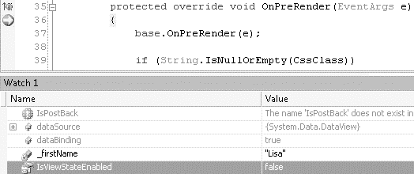

# 第四章：数据绑定控件

## 代码清单 4-24：调用 Select 方法

```csharp
DataSourceSelectArguments selectArguments = CreateDataSourceSelectArguments();
selectArguments.StartRowIndex = PageSize * PageIndex;
selectArguments.MaximumRows = PageSize;
dataSourceView.Select(selectArguments, callback);
```

回调函数接收数据并执行数据绑定。请在 `PerformSelect` 方法中以内联方式将此回调声明为委托。代码清单 4-25 显示了该回调委托。

## 代码清单 4-25：DataSourceViewSelectCallback

```csharp
DataSourceViewSelectCallback callback =
    delegate(IEnumerable data)
    {
        if (IsBoundUsingDataSourceID)
        {
            OnDataBinding(EventArgs.Empty);
        }
        PerformDataBinding(data);
    };
```

`PersonListingControl` 和 `ObjectDataSource` 都有一个名为 `EnablePaging` 的属性，用于控制 `Select` 方法的行为。如果启用了分页，则需要 `StartRowIndex` 和 `MaximumRows` 的值，并将它们传递给已声明的 `DataObjectMethod`。如果未启用分页，则使用不包含这些参数的方法。然而，`ObjectDataSource` 和 `PersonListingControl` 的 `EnablePaging` 值不必相同。如果 `ObjectDataSource` 启用了分页而 `PersonListingControl` 没有，它仍将使用接受分页参数的方法。

当处于这种混合模式时，应设置这些值以允许将所有数据返回给控件。代码清单 4-26 显示了设置这些值的代码。

## 代码清单 4-26：混合模式下的选择参数

```csharp
if (dataSourceView.CanPage)
{
    selectArguments.AddSupportedCapabilities(DataSourceCapabilities.None);
    selectArguments.StartRowIndex = 0;
    selectArguments.MaximumRows = Int16.MaxValue;
}
```

`MaximumRows` 属性被设置为 `Int16.MaxValue`，以实现实际上无限制的结果返回。

这种混合模式在多个控件使用同一个 `ObjectDataSource` 时非常有用。

一旦在视图上调用了 `Select` 方法，数据就会被发送到回调函数。

最后，必须将 `RequiresDataBinding` 的值设置为 `false`，以指示数据已被请求。此外，还必须调用 `MarkAsDataBound` 方法，该方法会更新控件状态，以表明数据已成功绑定到控件。

`PerformSelect` 方法如代码清单 4-27 所示。

## 代码清单 4-27：PerformSelect 方法

```csharp
protected override void PerformSelect()
{
    if (!IsBoundUsingDataSourceID)
    {
        OnDataBinding(EventArgs.Empty);
    }
    DataSourceView dataSourceView = GetData();
    DataSourceViewSelectCallback callback =
        delegate(IEnumerable data)
        {
            if (IsBoundUsingDataSourceID)
            {
                OnDataBinding(EventArgs.Empty);
            }
            PerformDataBinding(data);
        };
    if (EnablePaging && dataSourceView.CanPage)
    {
        DataSourceSelectArguments selectArguments =
            CreateDataSourceSelectArguments();
        selectArguments.StartRowIndex = PageSize * PageIndex;
        selectArguments.MaximumRows = PageSize;
        dataSourceView.Select(selectArguments, callback);
    }
    else
    {
        DataSourceSelectArguments selectArguments =
            CreateDataSourceSelectArguments();
        if (dataSourceView.CanPage)
        {
            selectArguments.AddSupportedCapabilities(DataSourceCapabilities.None);
            selectArguments.StartRowIndex = 0;
            selectArguments.MaximumRows = Int16.MaxValue;
        }
        dataSourceView.Select(selectArguments, callback);
    }
    RequiresDataBinding = false;
    MarkAsDataBound();
    OnDataBound(EventArgs.Empty);
}
```

##### 获取总行数

在对数据进行分页浏览时，了解总行数是必要的。由于从选择中返回的数据受限于 `MaximumRows` 属性，因此它不代表总数。

相反，必须使用 `DataSourceView` 上的 `Select` 方法来获取 `TotalRowCount`，如代码清单 4-28 所示。

## 代码清单 4-28：GetTotalRowCount

```csharp
private int GetTotalRowCount()
{
    int totalRowCount = 0;
    DataSourceView dataSourceView = GetData();
    if (dataSourceView.CanRetrieveTotalRowCount)
    {
```


### DataSourceSelectArguments 与回调（Callback）

`DataSourceSelectArguments selectArguments = CreateDataSourceSelectArguments();`
`selectArguments.AddSupportedCapabilities(DataSourceCapabilities.RetrieveTotalRowCount);`
`selectArguments.RetrieveTotalRowCount = true;`

`DataSourceViewSelectCallback callback = delegate`
`{`
`    totalRowCount = selectArguments.TotalRowCount;`
`};`

`dataSourceView.Select(selectArguments, callback);`
`}`
`return totalRowCount;`
`}`

`DataSourceSelectArguments` 方法通过添加 `RetrieveTotalRowCount` 能力进行调整，这会调用 `TotalRowCount` 来为回调填充数据。此值通过委托捕获并返回，供控件其他部分使用。具体来说，此值由代码清单 4-29 中所示的 `TotalRowsCount` 属性使用。

### TotalRowsCount 属性

**代码清单 4-29.** `TotalRowsCount` 属性

```csharp
private int _totalRowsCount = 0;
[Browsable(false)]
public virtual int TotalRowsCount
{
    get
    {
        if (_totalRowsCount == 0)
        {
            _totalRowsCount = GetTotalRowCount();
        }
        return _totalRowsCount;
    }
}
```

`TotalRowsCount` 属性与 `PageSize` 属性一起用于计算 `MaxIndex` 属性的值，如代码清单 4-30 所示。

### MaxIndex 属性

**代码清单 4-30.** `MaxIndex` 属性

```csharp
private int _maxIndex = 0;
[Browsable(false)]
public virtual int MaxIndex
{
    get
    {
        if (_maxIndex == 0)
        {
            double maxIndexDbl = (TotalRowsCount/PageSize) - 1;
            _maxIndex = (int)maxIndexDbl;
            if (maxIndexDbl > _maxIndex)
            {
                _maxIndex++;
            }
        }
        return _maxIndex;
    }
}
```

为了控制分页，`PersonListingControl` 使用分页器控件通过回发事件移动到下一页和上一页。这些分页器控件是使用 `LinkButton` 控件创建的链接，其 `CommandArgument` 值设置为目标 `PageIndex`。

##### 连接分页器事件

分页器控件触发回发事件以设置新的 `PageIndex` 值。通常，附加事件是相当自动的。因为这是一个自定义数据绑定控件，所以需要初始化控件、附加事件，然后将其添加到 `Controls` 集合中，以便在触发回发事件时将其包括在内。事件序列按此顺序发生：`Init`、`PagePreLoad`、`Load` 和 `RaisePostBackEvent`。在 `Init` 和 `PagePreLoad` 事件之间，`ControlState` 和 `ViewState` 被加载。分页器控件必须在加载状态和 `RaisePostBackEvent` 之前初始化并添加到 `Controls` 集合中。为确保这一点，这些控件可以在 `CreateChildControls` 中通过调用 `CreatePagerControls` 方法进行初始化。

控件只需要初始化一次，而每次运行 `CreateChildControls` 时都需要将控件重新添加到 `Controls` 集合中。`CreatePagerControls` 方法如代码清单 4-31 所示。

### CreatePagerControls 方法

**代码清单 4-31.** `CreatePagerControls` 方法

```csharp
private void CreatePagerControls()
{
    InitializePagerControls();
    Controls.Add(_previousLinkButton);
    Controls.Add(new LiteralControl(" "));
    Controls.Add(_nextLinkButton);
    Controls.Add(new LiteralControl(" "));
}
```

设置控件属性和附加事件的工作由 `InitializePagerControls` 方法处理，该方法中有一个检查以确保它只运行一次。此方法的代码如代码清单 4-32 所示。

### InitializePagerControls

**代码清单 4-32.** `InitializePagerControls`

```csharp
private void InitializePagerControls()
{
    if (_controlsInitialized)
    {
        return;
    }
    if (_nextLinkButton == null)
    {
        _nextLinkButton = new LinkButton();
        _nextLinkButton.ID = "lbNext";
        _nextLinkButton.Text = "Next";
        _nextLinkButton.CssClass = "btn";
        _nextLinkButton.CommandName = SetPageIndexCommandName;
        _nextLinkButton.Click += new EventHandler(PagerButton_Click);
    }
    if (_previousLinkButton == null)
    {
        _previousLinkButton = new LinkButton();
        _previousLinkButton.ID = "lbPrev";
        _previousLinkButton.Text = "Previous";
        _previousLinkButton.CssClass = "btn";
        _previousLinkButton.CommandName = SetPageIndexCommandName;
        _previousLinkButton.Click += new EventHandler(PagerButton_Click);
    }
}
```


_controlsInitialized = true;

}

这些分页器方法确保了在回发（postback）过程中事件会被触发。在从一页翻到另一页时，“下一页”和“上一页”链接对用户可能是可用的，也可能不可用。如果用户已经处于控件的最后一页，则应该隐藏“下一页”链接。

由于 `RaisePostBackEvent` 在 `Load` 事件之后运行，因此这些分页器链接的可见性也必须在如清单 4-33 所示的 `PreLoad` 事件中设置。

### 清单 4-33. `PreLoad` 事件

```csharp
protected override void OnPreRender(EventArgs e)
{
    base.OnPreRender(e);
    _previousLinkButton.Text = PreviousPageText;
    _nextLinkButton.Text = NextPageText;
    _previousLinkButton.CommandArgument = (PageIndex - 1).ToString();
    _previousLinkButton.Visible = EnablePaging && PageIndex > 0;
    _nextLinkButton.CommandArgument = (PageIndex + 1).ToString();
    _nextLinkButton.Visible = EnablePaging && PageIndex < MaxIndex;
}
```

页面首次加载时，“上一页”链接将不可见。“下一页”链接的 `CommandArgument` 将被设置为 `1`，当分页器事件由清单 4-34 中的 `PagerButton_Click` 事件处理器处理时，该值将用于设置 `PageIndex`。

### 清单 4-34. `PagerButton_Click` 事件处理器

```csharp
protected void PagerButton_Click(object sender, EventArgs e)
{
    LinkButton lb = sender as LinkButton;
    if (lb != null && SetPageIndexCommandName.Equals(lb.CommandName))
    {
        int pageIndex;
        int.TryParse(lb.CommandArgument, out pageIndex);
        PageIndex = pageIndex;
    }
}
```

这里隐含着一些数据绑定操作。`PageIndex` 属性对变化敏感，如清单 4-35 所示。

### 清单 4-35. `PageIndex` 属性

```csharp
private int _pageIndex = 0;
[Browsable(false)]
public virtual int PageIndex
{
    get
    {
        EnsureChildControls();
        return _pageIndex;
    }
    set
    {
        EnsureChildControls();
        if (value < 0)
        {
            throw new ArgumentOutOfRangeException("value");
        }
        if (_pageIndex != value)
        {
            _pageIndex = value;
            if (Initialized)
            {
                RequiresDataBinding = true;
            }
        }
    }
}
```

当 `PageIndex` 的值发生变化时，`PageIndex` 属性的设置操作会将 `RequiresDataBinding` 值设为 `true`，这将导致数据在后续的事件生命周期中绑定。

## 创建 PersonRow

`PersonListingControl` 的主要内容是 `PersonRow` 项的集合。这是一个简单的控件，它利用提供给它的数据绑定到它创建的控件上。

`PersonRow` 继承自 `WebControl`，并实现了 `IDataItemContainer` 和 `INamingContainer` 接口。请记住，`INamingContainer` 接口没有方法，因为它仅仅是一个用于管理命名容器层次结构的标记接口。

`IDataItemContainer` 实现了三个只读属性，如清单 4-36 所示。

### 清单 4-36. `IDataItemContainer` 成员

```csharp
#region " IDataItemContainer Members "
public object DataItem
{
    get
    {
        return Data;
    }
}
public int DataItemIndex
{
    get
    {
        return _itemIndex;
    }
}
public int DisplayIndex
{
    get
    {
        return _itemIndex;
    }
}
#endregion
```

当 `PersonRow` 被构造时，这些值作为参数传入。数据存储在一个成员变量中，通过 `Data` 属性访问。构造函数和 `Data` 属性如清单 4-37 所示。

### 清单 4-37. `PersonRow` 构造函数和 `Data` 属性

```csharp
public PersonRow(int itemIndex, object o)
    : base(HtmlTextWriterTag.Div)
{
    _data = o;
    _itemIndex = itemIndex;
}
public virtual object Data
{
    get
    {
        return _data;
    }
}
```

这里传入的数据可能为空值，因此在调用 `CreateChildControls` 方法时，应妥善处理这种情况。如果有数据，可以使用清单 4-38 中的代码，通过 `DataBinder` 从数据对象加载值。

### 清单 4-38. 数据绑定代码

```csharp
if (Data != null)
{
    DateTime dateValue;
    DateTime.TryParse(DataBinder.GetPropertyValue(Data, birthDateField, ""),
                      out dateValue);
    FirstName = DataBinder.GetPropertyValue(Data, firstNameField, null);
    LastName = DataBinder.GetPropertyValue(Data, lastNameField, null);
    BirthDate = dateValue;
    City = DataBinder.GetPropertyValue(Data, cityField, null);
    Country = DataBinder.GetPropertyValue(Data, countryField, null);
}
```

你会注意到这里没有代码来检查数据是 `DataSet`、`IDataReader` 还是自定义业务对象。`DataBinder` 使用反射从对象中获取值并将其设置在属性上。`FirstName` 属性接收与 `firstNameField` 关联的值，这是一个字符串，应该与数据对象上的某个属性匹配。默认情况下，`firstNameField` 的字符串值是 `FirstName`，这与该控件使用的存储过程返回的某一列相匹配。并且作为一个良好的数据绑定控件，如果你无法将字段名与数据源匹配，可以通过一系列属性调整这个字符串。`FirstName` 数据字段属性如清单 4-39 所示。

### 清单 4-39. `FirstName` 数据字段属性

```csharp
private string _dataFirstNameField = "FirstName";
[Browsable(true), Category("Data"), Description("First Name Data Field"),
 DefaultValue("FirstName")]
public string DataFirstNameField
{
    get
    {
        EnsureChildControls();
        return _dataFirstNameField;
    }
    set
    {
        EnsureChildControls();
        _dataFirstNameField = value;
    }
}
```

`DataFirstNameField` 属性实际上是由 `PersonListingControl` 定义的，以简化控件的配置。当 `PersonRow` 创建子控件时，一个名为 `CaptureSettings` 的方法会从 `PersonListingControl` 获取这些值。`CaptureSettings` 方法如清单 4-40 所示。

### 清单 4-40. `CaptureSettings` 方法

```csharp
/// <summary>
/// 如果父级是 PersonListingControl，则从中获取设置
/// </summary>
private void CaptureSettings()
{
    PersonListingControl parent = Parent as PersonListingControl;
    if (parent != null)
    {
        personFormat = parent.PersonFormat;
        firstNameField = parent.DataFirstNameField;
        lastNameField = parent.DataLastNameField;
        birthDateField = parent.DataBirthDateField;
        birthDateFormat = parent.DataBirthDateFormat;
        cityField = parent.DataCityField;
        countryField = parent.DataCountryField;
    }
}
```

当调用 `DataBinder` 时，它从数据对象中提取的数据首先被设置在 `FirstName` 属性上。这个属性是成员变量的访问器，而不是某个控件的 `Text` 属性。`PersonRow` 使用的控件只是一系列 `LiteralControls`，它们在 `CreateChildControls` 方法执行期间被添加到 `Controls` 集合中，但最初并未定义 `Text` 值。`CreateChildControls` 方法的简化版本如清单 4-41 所示。

### 清单 4-41. 创建控件集合

```csharp
ltFirstName = new LiteralControl();
ltLastName = new LiteralControl();
ltBirthDate = new LiteralControl();
ltCity = new LiteralControl();
ltCountry = new LiteralControl();
Controls.Add(new LiteralControl("\n<p>\n"));
Controls.Add(ltFirstName);
Controls.Add(new LiteralControl(" "));
Controls.Add(ltLastName);
Controls.Add(new LiteralControl(", "));
Controls.Add(ltBirthDate);
Controls.Add(new LiteralControl(", "));
Controls.Add(ltCity);
Controls.Add(new LiteralControl(", "));
Controls.Add(ltCountry);
Controls.Add(new LiteralControl("\n</p>\n"));
```

**高效标记**


`PersonRow` 使用 `LiteralControl` 而非 `Label` 控件，具体原因在于它能为页面生成更少的标记代码。这减小了页面体积，并缩短了用户的页面加载时间。一个名为 `ListView` 的新控件将随 `.NET 3.5`（于 2008 年初发布）一同推出。它将允许开发者精确选择呈现给 Web 浏览器的标记，其重点在于将样式处理卸载到一个外部样式表，该样式表在每次访问网站时仅需加载一次。这种减小的总体尺寸将加速页面请求，并使你的应用程序运行更快。

这些 `LiteralControl` 充当容器，在稍后的 `PreRender` 事件中当 `Text` 值最终被设置时更新，如**清单 4-42**所示。

**第 4 章 ■ 数据绑定控件**

**105**

**清单 4-42.** *在 `OnPreRender` 方法中设置 `Text` 属性*
```
protected override void OnPreRender(EventArgs e)
{
    base.OnPreRender(e);
    if (String.IsNullOrEmpty(CssClass))
    {
        CssClass = "personRow";
    }
    ltFirstName.Text = FirstName;
    ltLastName.Text = LastName;
    ltBirthDate.Text = BirthDate.ToString(birthDateFormat);
    ltCity.Text = City;
    ltCountry.Text = Country;
}
```

进行这种分离是为了解决一些与 `ViewState` 相关的问题，这将在下一节中解释。

## 手动持久化 ViewState

自定义控件可能不会按你希望的方式持久化状态。为了克服这个缺点，可以手动处理 `ViewState`。这是通过重写 `SaveViewState` 和 `LoadViewState` 方法来实现的。`SaveViewState` 方法如**清单 4-43**所示。

**清单 4-43.** *`SaveViewState` 方法*
```
protected override object SaveViewState()
{
    Pair state = new Pair();
    object baseState = base.SaveViewState();
    object[] objArray = new object[5];
    objArray[0] = _firstName;
    objArray[1] = _lastName;
    objArray[2] = _birthDate;
    objArray[3] = _city;
    objArray[4] = _country;
    state.First = baseState;
    state.Second = objArray;
    return state;
}
```

状态的结构完全是任意的。它实际上与本章前面展示的 `ControlState` 的工作原理相同。对于少量数据，仅使用 `Pair` 或 `Triplet` 类型可能是合理的。因为这里有五个值需要序列化，我选择使用一个对象数组，并将其设置为成员变量的值。

接下来，状态必须在下次页面请求时重新加载到页面中。`LoadViewState` 方法如**清单 4-44**所示。

**第 4 章 ■ 数据绑定控件**

**106**

**清单 4-44.** *`LoadViewState` 方法*
```
protected override void LoadViewState(object state)
{
    if (state != null && state is Pair)
    {
        Pair pair = (Pair)state;
        base.LoadViewState(pair.First);
        object[] objArray = (object[])pair.Second;
        if (objArray[0] != null)
        {
            _firstName = (string)objArray[0];
        }
        if (objArray[1] != null)
        {
            _lastName = (string)objArray[1];
        }
        if (objArray[2] != null)
        {
            _birthDate = (DateTime)objArray[2];
        }
        if (objArray[3] != null)
        {
            _city = (string)objArray[3];
        }
        if (objArray[4] != null)
        {
            _country = (string)objArray[4];
        }
    }
    else
    {
        base.LoadViewState(null);
    }
}
```

`LoadViewState` 方法执行与 `SaveViewState` 相反的操作，它将对象强制转换为 `Pair` 以访问 `Second` 属性，即之前设置的对象数组。

有了这些方法，五个成员变量将安全地存储到 `ViewState` 中，并在回发请求期间、`Load` 事件之前重新加载。

这引出了为什么 `LiteralControl` 的 `Text` 属性没有在 `CreateChildControls` 方法中设置，而是设置在 `OnPreRender` 方法中的原因。用于为 `PersonRow` 持久化数据的 `ViewState` 在调用 `CreateChildControls` 时不可用。但这些值在运行 `OnPreRender` 方法时是可用的。


**第 4 章 ■ 数据绑定控件**

**107**

## 无 ViewState 工作

为了减小页面大小，开发者可能会选择在数据绑定控件上禁用 `ViewState`。如果控件不处理这种情况，控件将无法按预期工作。它不会像首次页面加载时那样显示数据，而是显示空行。需要注意的是，这个数据绑定控件可能是页面上列出的多个控件之一，并且回发事件可能由页面上的任何控件引发。在创建这个控件时，我使用了一个测试页面，该页面有一个未附加到事件处理程序的按钮（参见图 4-4）。它只是简单地引发一个回发。

**图 4-4.** *“无操作”按钮*

当我第一次关闭 `ViewState` 时，它如预期那样失效了，因为它专门使用 `ViewState` 访问器来保存数据。预计它会失效。确保这些数据保留在原地的一个选项是使用 `ControlState`，但这样做只会将问题转移到另一个地方，并且不允许使用该控件的开发者通过禁用 `ViewState` 来调整其页面大小。相反，这个问题必须在 `PersonListingControl` 中解决。

`PersonListingControl` 通过 `DataSourceID` 访问数据，因此如果需要，它可以随时检索数据。当 `ViewState` 被禁用时，必须将一组值作为 `ControlState` 持久化。这些值包括分页器链接的 `PageIndex`、`TotalRowsCount`、`ItemCount` 和 `CommandArgument` 值。

之前你在**清单 4-22**中查看了 `PersonListingControl` 的 `CreateChildControls` 方法，该方法在 `dataBinding` 值为 `false` 时使用 `_itemCount` 成员变量重新创建正确数量的项。这是将使用 `ControlState` 持久化的值之一。**清单 4-45**展示了 `SaveControlState` 方法。

**第 4 章 ■ 数据绑定控件**

**108**

**清单 4-45.** *`SaveControlState` 方法*
```
protected override object SaveControlState()
{
    object[] state = new object[6];
    state[0] = base.SaveControlState();
    state[1] = _pageIndex;
    state[2] = _totalRowsCount;
    state[3] = _itemCount;
    state[4] = _previousLinkButton.CommandArgument;
    state[5] = _nextLinkButton.CommandArgument;
    return state;
}
```

这组有限的值在持久化时应该非常小。你可能会注意到，通常放置 `ViewState` 的隐藏输入字段中的值并非空，即使你可能已经为整个页面禁用了 `ViewState`。它不为空的原因是 `ControlState` 与 `ViewState` 使用相同的空间，但希望占用的空间要少得多。加载 `ControlState` 的方法如**清单 4-46**所示。

**清单 4-46.** *`LoadControlState` 方法*
```
protected override void LoadControlState(object savedState)
{
    _pageIndex = 0;
    object[] objArray = savedState as object[];
    if (objArray != null)
    {
        InitializePagerControls();
        base.LoadControlState(objArray[0]);
        if (objArray[1] != null)
        {
            _pageIndex = (int) objArray[1];
        }
        if (objArray[2] != null)
        {
            _totalRowsCount = (int)objArray[2];
        }
        if (objArray[3] != null)
        {
            _itemCount = (int)objArray[3];
        }
        if (objArray[4] != null)
        {
            _previousLinkButton.CommandArgument = (string)objArray[4];
        }
        if (objArray[5] != null)
        {
            _nextLinkButton.CommandArgument = (string)objArray[5];
        }
    }
    else
    {
        base.LoadControlState(null);
    }
}
```

当我实现这些方法后，一切都开始像禁用 `ViewState` 之前那样正常工作。我知道我绝对没有做任何事情来持久化 `PersonRow` 的数据，但我可以点击分页器链接和“无操作”按钮，并且总是得到我期望的数据。看起来一切都是自动处理的，我想确切地知道这是如何完成的，于是我启动了调试器。



**第 4 章 ■ 数据绑定控件**

**109**

### 调试器单步执行


