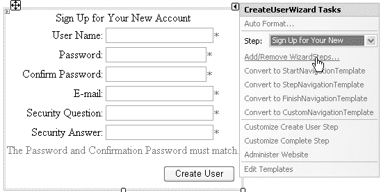

# 第 5 章 ■ SQL 提供程序

121

## 匿名与认证配置文件的差异

匿名会话的超时设置可以与认证会话的超时设置不同，但这并非唯一的区别。正如第一章所讨论的，可以设定自定义属性要求使用已认证的配置文件。将匿名配置文件属性保持在最低限度，有助于减小数据库中匿名配置文件数据的大小。用于记录字体大小和配置文件组的自定义属性如清单 5-10 所示。

### 清单 5-10. 自定义配置文件属性

```
<properties>
<add name="FontSize" type="String" allowAnonymous="true" defaultValue="10" />
<add name="ProfileGroup" type="String" allowAnonymous="false" />
</properties>
```

## 从匿名迁移到认证

当用户创建账户或登录您的网站时，该用户将随身携带其匿名配置文件。对应的 Cookie 仍会设置在其浏览器中，与该匿名配置文件关联的值也仍会存在于您的数据库中。我通常希望做的是移除该 Cookie，并向前复制所有合理的值。

在第一章中，我解释了如何使用来自已认证或匿名配置文件的 Guid 值来管理与购物篮的关联。但是，当用户确实从不同的计算机访问站点，向匿名篮中添加商品，然后在购买时最终登录，我并不希望丢失匿名篮中放置的商品。为了将这些篮中商品转移到已认证的账户，我处理了 `Profile_MigrateAnonymous` 事件，这是 `Global.asax` 中的一个全局应用程序事件。

但我并非盲目地用匿名篮替换已认证篮。有必要通过添加商品来合并篮子。如果用户前一天在家登录该账户并向篮中添加了几件商品，然后第二天在工作时又向一个全新的匿名篮中添加了更多商品，该用户实际上会有两个篮子。登录时，`Profile_MigrateAnonymous` 事件触发，我只是简单地将匿名篮中的商品添加到已认证篮中，并显示合并后的篮子。

另一种选择是，要么完全忽略匿名篮中的商品，要么用匿名篮替换已认证篮。将商品从匿名篮移动到已认证篮是理想的选择。

有时，您的配置文件可能包含无法用这种方式处理的数据。字体大小偏好的简单示例展示了当您首次创建配置文件时选择了一个大小，而当您从另一台计算机登录时，您可能不希望仅用匿名值覆盖已认证的配置文件值。例外情况可能是，如果已认证的值被设为默认值，而匿名值不是默认值。在这种情况下，为了保持用户在继续使用网站时的一些一致性，接收该值可能是有帮助的。清单 5-11 中的代码在 `Global.asax` 中处理 `Profile_MigrateAnonymous` 事件以迁移 `FontSize` 属性，然后删除匿名配置文件的所有痕迹。



8601Ch05CMP3 8/27/07 8:05 AM Page 122

122

第 5 章 ■ SQL 提供程序

### 清单 5-11. 迁移匿名配置文件

```
void Profile_MigrateAnonymous(object sender, ProfileMigrateEventArgs e)
{
    ProfileCommon anonymousProfile = Profile.GetProfile(e.AnonymousID);
    string defaultFontSize = "10";
    if (defaultFontSize.Equals(Profile.FontSize) &&
        !defaultFontSize.Equals(anonymousProfile.FontSize))
    {
        Profile.FontSize = anonymousProfile.FontSize;
    }
    // 删除匿名用户、配置文件和 Cookie
    Membership.DeleteUser(e.AnonymousID, true);
    ProfileManager.DeleteProfile(e.AnonymousID);
    AnonymousIdentificationModule.ClearAnonymousIdentifier();
}
```


代码清单 5-11 的最后几行清理了数据库，使其不会被那些匿名账户弄得杂乱不堪。我已观察到，留下匿名 cookie 标识符会导致每次页面请求时都触发`Profile_MigrateAnonymous`事件。因此，移除匿名配置文件不仅能使数据库保持整洁，还能防止这个事件被不必要地触发。

##### 创建用户

使用`Membership`API 创建账户的控件是`CreateUserWizard`。它高度可定制。除了定制，你甚至可以完全接管流程，使用你自己的 Web 窗体，并只与`Membership`API 交互来创建用户。这涉及更多工作，而考虑到我们追求生产力的目标，你可能希望避免这样做。与其从头开始创建你自己的控件，不如简单地向`CreateUserWizard`添加一个步骤。

对于你的配置文件，你希望允许用户为网站选择一个主要兴趣，以及用户偏好的字体大小（如代码清单 5-10 中自定义属性`ProfileGroup`和`FontSize`所定义）。匿名用户不允许使用`ProfileGroup`。要定制`CreateUserWizard`，你首先需要向该向导添加一个步骤（参见图 5-2）。

### 图 5-2. 向向导添加一个步骤

对于此定制，你希望将你的向导步骤放在三步序列的开始。你的步骤将询问用户对于自定义配置文件属性的偏好。第二步将询问所有必需的配置文件信息，最后一步将显示新用户配置文件已创建的确认信息。使用代码清单 5-12 中的标记来创建定制控件。

### 代码清单 5-12. 定制后的 CreateUserWizard

```aspx
<%@ Control Language="C#" AutoEventWireup="true"
CodeFile="CreateCustomUserControl.ascx.cs"
Inherits="Controls_CreateCustomUserControl" %>

<asp:CreateUserWizard ID="CreateUserWizard1" runat="server"
OnCreatedUser="CreateUserWizard1_CreatedUser"
ContinueDestinationPageUrl="~/Default.aspx">
    <WizardSteps>
        <asp:WizardStep runat="server" Title="Primary Interest">
            <b>选择您的主要兴趣:</b><br />
            <asp:RadioButtonList ID="rblPrimaryInterest" runat="server">
                <asp:ListItem Selected="True" Value="1">体育</asp:ListItem>
                <asp:ListItem Value="2">政治</asp:ListItem>
                <asp:ListItem Value="3">天气</asp:ListItem>
                <asp:ListItem Value="4">商业</asp:ListItem>
                <asp:ListItem Value="5">娱乐</asp:ListItem>
            </asp:RadioButtonList>
            <p>
                请在下方选择您认为最易阅读的字体大小。
            </p>
            <table><tr><td>
                <b>示例大小:</b>
                <div style="font-size: 10px;">小号字体</div>
                <div style="font-size: 12px;">常规字体</div>
                <div style="font-size: 14px;">大号字体</div>
            </td><td>
                <asp:RadioButtonList ID="rblFontSize" runat="server">
                    <asp:ListItem Value="10">小</asp:ListItem>
                    <asp:ListItem Selected="True" Value="12">常规</asp:ListItem>
                    <asp:ListItem Value="14">大</asp:ListItem>
                </asp:RadioButtonList>
            </td></tr></table>
        </asp:WizardStep>
        <asp:CreateUserWizardStep runat="server">
        </asp:CreateUserWizardStep>
        <asp:CompleteWizardStep runat="server">
        </asp:CompleteWizardStep>
    </WizardSteps>
</asp:CreateUserWizard>
```

持有你想要使用的值的控件位于单选按钮列表`rblPrimaryInterest`和`rblFontSize`中。当`CreatedUser`事件触发时，你将获取它们的值（参见代码清单 5-13）。

### 代码清单 5-13. CreatedUser 事件处理器

```csharp
protected void CreateUserWizard1_CreatedUser(object sender, EventArgs e)
{
    Profile.FontSize = rblFontSize.SelectedValue;
    Profile.ProfileGroup = rblPrimaryInterest.SelectedValue;
}
```

现在，你可以使用`ProfileGroup`的值来向用户展示更符合其需求的内容，并以他们偏好的字体大小显示。但你可能想要直接获取这些数据。这可能有些棘手。

## 动态配置文件和作为 BLOB 的配置文件

要获取配置文件数据之所以棘手，有两个原因。首先，数据以一种无法通过简单数据库查询直接访问的格式进行序列化。其次，你无法创建一个命令行实用程序来读取配置文件数据并将其作为计划作业在夜间运行以执行用户分析任务，因为你需要 ASP.NET 动态编译器来生成用户配置文件。

关于数据序列化，示例属性将存储在`aspnet_Profile`表的`PropertyNames`和`PropertyValues`列中，如表 5-3 所示。

### 表 5-3. 序列化的配置文件属性

| PropertyNames | PropertyValues |
| --- | --- |
| `FontSize:S:0:2:ProfileGroup:S:2:1:` | |

在`PropertyNames`中，它以冒号分隔列出了名称、类型、起始索引和长度。在`PropertyValues`中，你可以使用`PropertyNames`推导出 14 是`FontSize`，3 是`ProfileGroup`。这种结构是为了优化大小以及单配置文件访问而设计的，并非用于聚合分析。如果你想处理这些数据，你将需要编写一个相当复杂的存储过程。另一种方法是依赖.NET 类，它们已经能够反序列化这些数据。

这就引出了处理这些数据棘手的第二个原因。ASP.NET 动态编译器使用一个构建提供程序，该提供程序读取`Web.config`文件中的设置并在内存中生成`Profile`对象。这就是为什么在 Visual Studio 中你能看到自定义属性的智能感知支持。目前，这个动态编译器不适用于类库。而如果你将代码放在网站的`App_Code`文件夹中，你会发现你同样无法访问这些动态值。

这让我们回到了使用 ASP.NET 运行时通过配置文件来访问这些值，你可以在 Web 窗体内使用它们。为了获得可用的数据，你只需遍历每个已认证的账户，并生成一个包含所有配置文件数据的逗号分隔值（CSV）导出文件，这些数据你可以像人们多年来使用 CSV 文件那样进行解析和使用。代码清单 5-14 包含将配置文件数据导出为 CSV 下载的代码。

### 代码清单 5-14. 配置文件导出器

```csharp
using System;
using System.Web.Profile;
using System.Web.UI;

public partial class ProfilesExporter : Page
{
    protected void Page_Load(object sender, EventArgs e)
    {
        Response.AddHeader("content-disposition",
            "attachment; filename=CustomProfiles.csv");
        Response.ContentType = "text/csv";

        ProfileInfoCollection profiles =
            ProfileManager.GetAllProfiles(
                ProfileAuthenticationOption.Authenticated);

        foreach (ProfileInfo profile in profiles)
        {
            ProfileCommon pc = Profile.GetProfile(profile.UserName);
            Response.Write(String.Format("{0},{1},{2}\n", pc.UserName, pc.FontSize, pc.ProfileGroup));
        }
        Response.End();
    }
}
```

请注意，代码清单 5-14 中的代码添加了`content-disposition`头，它强制下载并定义了一个以`.csv`扩展名结尾的文件名。如果没有这个头，文件很可能会尝试使用`ProfilesExporter.aspx`作为文件名。你可以修改文件名以包含时间戳，这样就能将其与每日更新的数据副本区分开来。

有了这个 CSV 数据，你将能更轻松地进行分析。除了导出到 CSV 文件，你还可以调整这个 Web 窗体，将数据插回到你为数据分析目的而创建的数据库表中。这里使用的方法是为了快速运行而构建的。相比之下，读写数据会减慢数据库速度并延长导出运行时间。


`SqlProfileProvider`所使用的 BLOB 存储机制导致许多开发者创建了自己的替代方案。我的做法是创建自己的一组表，并以用于标识用户的`Guid`作为键。你也可以使用由郝昆（Hao Kung）创建的`SqlTableProfileProvider`。他是微软 ASP.NET 团队的工程师之一。他整合了一个提供程序实现来解决 BLOB 问题。在 Windows Live (`http://www.live.com`) 上快速搜索 `SqlTableProfileProvider` 就能直接找到下载页面。

8601Ch05CMP3 8/27/07 8:05 AM Page 126

126

