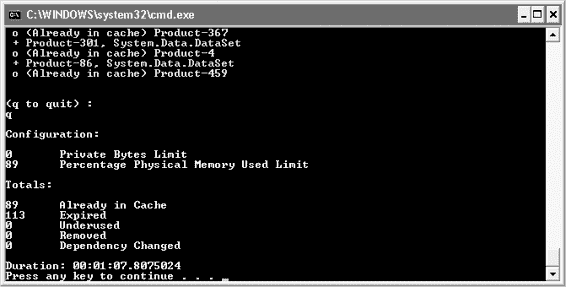

# 第 6 章 ■ 缓存

**159**

```csharp
product = new Product((int) row["ProductID"]);
product.Name = (string) row["Name"];
product.ProductNumber = (string) row["ProductNumber"];
product.Price = (decimal)row["ListPrice"];
product.Availability = (string) row["Availability"];
```

`8601Ch06CMP2 8/24/07 12:13 PM Page 159`

```csharp
product.Data = row;
}
context.Items["CurrentProduct"] = product;
}
return product;
}
```

用户控件准备好用作 `SubstitutionFragment` 后，它就可以通过 `Substitution` 控件和 `Substitution` 方法来引用（见清单 6-13 和 6-14）。

**清单 6-13.** 用户控件标记

```aspx
<asp:Substitution ID="subProductDetail" runat="server"
    MethodName="GetProductDetail" />
```

**清单 6-14.** 用户控件后台代码

```csharp
using System.Web;
using System.Web.UI;

public partial class Controls_ProductDetailSFBridge : UserControl
{
    private static string GetProductDetail(HttpContext context)
    {
        SubstitutionFragment substitutionFragment = (new Page()).LoadControl(
            "~/Controls/ProductDetailSF.ascx") as SubstitutionFragment;
        if (substitutionFragment != null)
        {
            return substitutionFragment.RenderToString(context);
        }
        else
        {
            return "无法加载控件：控件为空";
        }
    }
}
```

`SubstitutionFragment` 类提供的抽象使你无需借助强制类型转换或反射技术，并且它还封装了一些通用行为，供所有使用此技术的用户控件使用。

##### 数据缓存

数据缓存允许你将任何对象放入缓存，同时附带一个用于唯一标识它的键，以及几个其他参数来自定义缓存管理数据的方式。

`8601Ch06CMP2 8/24/07 12:13 PM Page 160`

**160**

### 缓存方法

你可以使用几种方法将项目放入缓存，然后再将它们移除。

`Cache` 对象直接包含三个方法：`Add`、`Insert` 和 `Remove`。这些是你将用于直接操作缓存的唯一方法。除了这些方法，在处理数据时，你还会使用各种类型的依赖项，这些依赖项会被发送到缓存中。

#### Add 方法

`Add` 方法接受一个键和一个对象，以及其他一些参数，将对象放入缓存。如果某个项已在缓存中，它不会添加新值；而是保持现有项不变。这种行为是为什么更常使用 `Insert` 方法的原因。认识到 `Add` 和 `Insert` 方法之间的这一关键区别非常重要。

你可以通过以下方式测试我刚才描述的行为：先用键 `myKey` 和值 `1` 将一个项添加到缓存中。然后，再用相同的键添加另一个值为 `2` 的项。当你从缓存中获取 `myKey` 的值时，它将是 `1`，因为第二次添加操作没有替换第一个值。这种行为可能带来问题，但在合适的场景下也可以加以利用。然而，一般来说，当缓存中已存在某一项时，你不应尝试再次添加它。标准的数据缓存模式是：首先检查该项是否存在于缓存中。如果存在，就使用它；如果不存在，就创建它，将其添加到缓存中，然后使用它。

#### Insert 方法

`Insert` 方法同样接受一个键和一个对象，并带有几个参数，将项目放入缓存。但是，如果具有相同键的项目已在缓存中，它将替换该项目，并使用参数提供的所有值。`Add` 方法只有一种方法签名，而 `Insert` 方法有四种方法签名。

#### Remove 方法

`Remove` 方法接受用于将项目放入缓存的键，并将其从缓存中移除。移除时，并不要求标有该键的项目必须仍然存在于缓存中；但如果它存在，`Remove` 方法在移除它时将返回对该对象的引用。否则，它返回一个空引用。

缓存索引


### 第 6 章：缓存

## 将缓存用作索引

缓存也可用作索引。清单 6-15 和 6-16 展示了如何使用索引从缓存中添加和获取数据。以这种方式添加值会使用 `Add` 方法，但不允许你设置其他参数，因此它将使用默认的缓存设置。

从缓存获取数据通常通过索引完成，因为获取值不需要任何参数。你只需要当初将该项放入缓存时使用的键。

**清单 6-15.** 使用缓存索引添加项
`Cache["Product-129"] = product;`

**清单 6-16.** 使用缓存索引获取项
`Product product = Cache["Product-129"] as Product;`

## 遍历缓存

你可以使用 `Cache` 对象遍历缓存条目。出于监控目的，你可能希望按类型分别记录缓存中的项数，以便更好地微调缓存提供的性能。你也可以按特定类型清除缓存中的所有项，如清单 6-17 所示。

**清单 6-17.** 按类型清除缓存项

```
private static int PurgeCacheItemsByType(Type type)
{
    Cache cache = HttpRuntime.Cache;
    List<String> keys = new List<string>();

    foreach (DictionaryEntry entry in cache)
    {
        if (entry.Value != null &&
            entry.Value.GetType().Equals(type))
        {
            keys.Add((string)entry.Key);
        }
    }

    foreach (string key in keys)
    {
        cache.Remove(key);
    }

    return keys.Count;
}
```

尽管清单 6-17 中的示例在某些特定情况下可能有用，但通常最好允许缓存根据插入项时提供的参数来管理数据。

## 参数

缓存利用多个参数来控制其行为，特别是针对要添加的项。用于将项放入缓存的参数构成了一个策略，规定了应如何处理数据。有些数据可以分配更高的优先级，这将增加其在被请求时可用的可能性。但你也可能有一些数据，缓存它们仅仅是为了方便地减少数据库负载。你可以给它分配较低的优先级。下文将讨论这些参数，并解释如何使用它们来影响放入缓存的数据的处理方式。

### `CacheItemPriority`

缓存使用优先级来决定在需要清理空间以释放内存或其他原因需要自动移除时，可以移除哪些项。表 6-1 显示了 `CacheItemPriority` 的各种值。

**表 6-1.** `CacheItemPriority` 值

| 值 | 描述 |
| :--- | :--- |
| `AboveNormal` | 略高于正常值的值，意味着在释放内存空间等情况下被移除的可能性较低。 |
| `BelowNormal` | 略低于正常值的值，意味着在释放内存空间等情况下被移除的可能性较高。 |
| `Default` | 与 `Normal` 相同 |
| `High` | 一个使关联项最不可能在其他项之前被移除的值 |
| `Low` | 一个使关联项最有可能在其他项之前被移除的值 |
| `Normal` | 中等优先级，用作默认值 |
| `NotRemovable` | 一个在自动清除项以释放空间时阻止缓存移除该项的值 |

### `CacheItemRemovedCallback`

`CacheRemovedCallback` 属性引用一个方法，该方法将在项从缓存中移除时被调用。此方法提供用于将项放入缓存的键、对象本身，以及一个 `CacheItemRemovedReason`，它指示项被移除的原因（见表 6-2）。通常，项被移除是因为超时期限已到，项正好过期，但也存在其他移除项的原因。

**表 6-2.** `CacheItemRemovedReason` 值

| 值 | 描述 |
| :--- | :--- |
| `DependencyChanged` | 与项关联的缓存依赖项已更改。 |
| `Expired` | 超时期限已结束。 |
| `Removed` | |


#### 缓存

## 未充分利用

该项目是通过 `Remove` 或 `Insert` 方法的请求而被移除的。

该项目是为了清理空间而被移除的。

你可能会发现，即使你不断将项目放回缓存，它们仍会因 `未充分利用` 的原因而被移除。当你明知缓存中只有几个小项目，系统却不断将它们踢出时，这可能会令人沮丧。很自然地，你会想要提高其优先级，或者干脆将其优先级设置为 `不可移除`。但如果缓存中的所有内容都被设置为 `不可移除`，你就失去了优先级带来的好处。相反，你可以尝试调整缓存设置。

对于 `Web.config` 文件中的缓存设置，在处理因 `未充分利用` 原因从缓存中移除项目时，有两个值最为重要：`privateBytesLimit` 和 `percentagePhysicalMemoryUsedLimit`。默认情况下，`privateBytesLimit` 没有限制，而 `percentagePhysicalMemoryUsedLimit` 将被设置为总物理内存的 89%。知道 89% 已经是一个非常高的值后，你可能只想通过为服务器增加更多物理内存来改善缓存。但如果你的服务器由多个应用程序共享，你可以为其中一些应用程序将 `privateBytesLimit` 设置为限制性较强的值，从而为最需要的应用程序腾出更多空间。



找到合适的缓存设置可能很棘手。缓存是根据你的自定义设置以及一组难以预测的启发式规则进行管理的。为了更好地了解你的设置将如何表现，你可以通过模拟来测试配置设置。

## 缓存模拟

要理解缓存如何与上一节描述的各种参数协同工作可能很困难。为了将其实际行为可视化，我创建了一个模拟。

因为缓存系统可以在 Web 应用程序之外使用，你可以创建一个简单的控制台应用程序，从数据库读取数据并将其放入缓存。为了模拟活动 Web 服务器的负载，我设置它每隔几秒运行一个线程，向缓存中添加若干新项目。随着活动的发生，信息会立即报告到控制台，并用颜色标示活动类型，例如项目被添加到缓存或从缓存中移除。我设置模拟使用两个变量：新项目添加之间的时间间隔，以及每个时间间隔要添加的项目数量。

我运行的模拟使用了微软提供的示例数据库 `AdventureWorks`，这是一个充满产品和订单数据的商业数据库示例。（该数据库可以从微软网站下载。）模拟首先读取所有产品的列表，然后将所有键放入一个集合，用于在每个时间间隔随机向缓存添加项目。

该模拟也会根据缓存设置表现出不同的行为。当我将 `privateBytesLimit` 设置为一个低得离谱的值时，我发现项目更频繁地因 `未充分利用` 的原因被移除。但随着我提高该值或将其恢复为默认值，我开始看到更多项目达到了超时时间。这导致更多项目因 `已过期` 原因从缓存中移除，这比 `未充分利用` 原因更可取。

在你努力寻找内存和性能之间最佳平衡点的过程中，可以为你的每个应用程序修改此模拟。此模拟软件在结束时报告结果，同时包括当前的缓存设置和持续时间，以便你可以记录结果（参见 `图 6-1`）。如果测试结果表明需要购买额外内存，这份文档将有助于证明其合理性。请参阅本章的代码下载以获取模拟的完整源代码。

`图 6-1.` 缓存模拟

## 常用文件夹补充

缓存模拟可以调整到与你的应用程序相匹配的场景。它可以作为一个有用的工具添加到你的 `常用` 文件夹的 `工具` 子文件夹中（`D:\项目\常用\工具\缓存模拟`）。模拟器的完整源代码可随本书的示例代码一起下载。

## 使缓存数据无效

缓存数据可以通过多种方式使其无效。主要方式是设置一个超时时间，强制缓存项在指定时间点后过期。或者，你可以设置一个滑动窗口来实现移动过期。在一段不活动期后，滑动窗口将允许缓存项从缓存中移除。绝对过期和滑动过期的设置是互斥的。同样在本节中，我将讨论缓存依赖项，你可以在依赖项更改时使用它来使项目无效，以及手动从缓存中移除项目。

###### 绝对过期

我的偏好始终是在缓存项上设置绝对超时时间。我知道仅仅将一个项目缓存十秒钟，在高峰负载期间也有助于提高性能。但将超时时间设置为五分钟或更长，至少可以确保如果我更改了数据库中的值，网站上显示的内容将在五分钟内更新。`代码清单 6-18` 展示了一个使用绝对过期的示例。

`代码清单 6-18.` 绝对过期

```
DataSet data = GetItem(3491);
string cacheKey = "Item-3491";
DateTime expiration = DateTime.Now.AddMinutes(5);
Cache.Insert(cacheKey, data, null, expiration,
Cache.NoSlidingExpiration, CacheItemPriority.Normal, null);
```

###### 滑动过期

滑动过期会使项目只要在指定的时间窗口内被访问，就会保留在缓存中。对于不经常更改但访问频繁的数据，这是一个不错的选择。但从理论上讲，如果一个项目被频繁访问，它在缓存中停留的时间没有上限。这可能会导致一些问题，首先表现为当数据在数据库中更新后却似乎没有变化的、难以解释的行为。通常的良好实践是，当使用滑动过期时，为项目设置一个缓存依赖项。`代码清单 6-19` 展示了一个使用滑动过期的示例。

`代码清单 6-19.` 滑动过期

```
DataSet data = GetItem(3491);
string cacheKey = "Item-3491";
TimeSpan slidingWindow = TimeSpan.FromSeconds(30);
Cache.Insert(cacheKey, data, null, Cache.NoAbsoluteExpiration, slidingWindow, CacheItemPriority.Normal, null);
```

### 缓存依赖项

为了在绝对过期之前或滑动过期的时间段过去之前快速从缓存中移除项目，你可以利用缓存依赖项。缓存依赖项有多种实现方式。你可以将缓存中的一个项目绑定到一个文件，当文件更新时，缓存项将从缓存中移除。你也可以通过创建一个继承自 `CacheDependency` 类的类来实现自己的缓存依赖项。`SqlCacheDependency` 就是这样一种实现，它可以在数据库中的数据发生更改时通知你的应用程序。这个实现将在稍后介绍。

###### 手动移除


如果你记录了将项目放入缓存时使用的键，就可以用它们来调用缓存上的 `Remove` 方法，手动移除这些项目。当你调用 `Insert` 方法时，如果已存在具有相同键的项目，实际上会在添加新项目的同时移除现有项目。例如，当用户登录你的网站时，你加载他们的数据并使用类似 `UserData-JSmith` 的键将其放入缓存；而当会话过期或用户登出时，你会主动要求缓存移除这些键，因为直到他们返回之前你不会再使用这些数据。请求移除数据时，该数据不一定仍在缓存中，但因为你已知用户名，便可以重新构造当初用于存入缓存的键。如果为该用户存储的数据量较大，这种方法可能有助于腾出空间，让其他项目在缓存中保留更久，从而提升性能。

##### SQL 缓存依赖

通过向缓存项附加依赖关系，当数据库中的数据发生变化时，可以自动从缓存中移除数据。一旦检测到数据库变更，依赖项将立即覆盖缓存项的过期时间或滑动窗口。

###### 使用 SqlDependency 和 SqlCacheDependency

有几种方法可以将依赖项与缓存项关联起来，以便在数据变更时通知你。`SqlDependency` 是与 SQL Server 通信以监控数据库变更的基础机制。（注意 `SqlDependency` 与 `SqlCacheDependency` 不同。）表 6-3 展示了 `SqlDependency` 对象的成员。

**表 6-3.** `SqlDependency` 成员

**名称** | **类型** | **描述**
--- | --- | ---
`Id` | `Guid` | 只读属性
`HasChanges` | `Boolean` | 只读属性
`OnChange` | 事件 | 事件

`Id` 和 `HasChanges` 属性是 `SqlDependency` 对象上仅有的属性，且均为只读。当依赖项发生变更时，会触发 `OnChange` 事件，使你能够访问 `SqlDependency` 对象的 `Id` 和 `HasChanges` 属性。由于 `Id` 属性是由随机的 `Guid` 值生成的，因此实用性不高。

**清单 6-20.** `OnChange` 处理程序方法

```
void OnChangeHandler(object sender, SqlNotificationEventArgs e)
{
    SqlDependency sqlDependency = (SqlDependency) sender;
    // sqlDependency.Id 是一个随机的 Guid
}
```

展示了一个 `OnChange` 事件处理程序。由于你无法使用 `Id` 属性来识别放入缓存的已变更项的键或项目本身，你可能会选择直接使用 `SqlCacheDependency` 对象，因为它提供了这些有用的详细信息。

## 为何使用 SqlDependency？

与 `SqlCacheDependency` 相比，`SqlDependency` 存在明显局限，因为后者会为你管理缓存中的项目。但如果你希望确保项目不会被逐出缓存，可以自行管理自己的集合并使用 `OnChange` 事件从中移除项目以保持其最新状态。你需要理解的是，放入你所管理的集合中的项目将占用内存，直到你将其移除。你已知缓存会管理内存使用，并在其确定需要为内存空间清除新项目时将项目从缓存中逐出。根据你的需求，你可能会决定进行这种权衡。

为了增强 `SqlDependency` 的使用，需要将原始查询中使用的参数传递到 `OnChange` 事件处理程序中。这可以通过作为委托创建的匿名方法实现。内联代码块将能够访问外部方法的参数，因此无需使用 `SqlDependency` 上的 `Guid` 值。

在清单 6-21 中，一个方法被赋予了一个名为 `productId` 的整数值，该值用作传递给存储过程的参数，用于从数据库检索产品。此整数值被用作托管集合的索引值。

**清单 6-21.** 使用委托的匿名方法

```
SqlDependency sqlDependency = new SqlDependency(sqlCmd);
OnChangeEventHandler onChangeHandler =
    delegate(object sender, SqlNotificationEventArgs e)
    {
        dataItems.Remove(productId);
    };
sqlDependency.OnChange += onChangeHandler;
```

注意委托的签名如何与 `OnChange` 事件所需的签名匹配。代码块还直接引用了 `productId`，即使此事件可能在包含方法执行完毕很久之后才触发。这是一种强大的技术，可用于单个或多个查询参数。

构建 `SqlDependency` 需要一个标准的 `SqlCommand` 对象。因为你正在使用数据访问应用程序块，所以你拥有的是一个 `DbCommand`。方便的是，它可以被强制转换为 `SqlCommand` 并用于构建 `SqlDependency`。

你还可以使用 `AddCommandDependency` 方法将更多 `SqlCommand` 对象添加到 `SqlDependency`。清单 6-22 展示了如何将多个命令添加到同一个 `SqlDependency`。

**清单 6-22.** 多个 `SqlCommand` 依赖项

```
SqlDependency sqlDependency = new SqlDependency();
sqlDependency.AddCommandDependency(productSqlCmd);
sqlDependency.AddCommandDependency(pricingSqlCmd);
sqlDependency.AddCommandDependency(inventorySqlCmd);
OnChangeEventHandler onChangeHandler =
    delegate(object sender, SqlNotificationEventArgs e)
    {
        dataItems.Remove(productId);
    };
sqlDependency.OnChange += onChangeHandler;
```

如果清单 6-22 中三个命令的数据确实相互失效，那么以这种方式将它们绑定在一起是有意义的。然而，你可能永远没有理由这样做。如果价格数据发生变化，很可能不需要你获取更新的产品和库存数据，但如果需要，此选项是可用的。

## 使用 SqlCacheDependency

`SqlCacheDependency` 利用 `SqlDependency` 在依赖项变更时从缓存中移除数据。它派生自 `CacheDependency` 基类，后者是插入缓存项时使用的参数之一。表 6-4 显示了 `SqlCacheDependency` 的构造函数。

**表 6-4.** `SqlCacheDependency` 构造函数

**参数** | **回调机制**
--- | ---
`String dbName`, `String tableName` | 轮询
`SqlCommand sqlCmd` | 通知

###### 轮询

当使用数据库和表名创建 `SqlCacheDependency` 时，它将监控该表的变更。监控表是通过 SQL Server 2000 和 2005 中可用的轮询功能完成的。轮询的工作方式是将一个触发器附加到要监控的表上，该触发器在每次执行 `insert`、`update` 和 `delete` 语句时触发。触发器会增加该源表在状态表中的一个数字，以指示表已发生变更。

当表被监控时，系统会轮询该状态表中的数字以检查其是否已更改。

### 为表启用轮询

使用 `aspnet_regsql.exe` 实用工具启用轮询。我使用清单 6-23 中的脚本在 AdventureWorks 示例数据库中启用 `Production.Product` 表。首先必须启用管理依赖项的服务，然后必须启用特定表。

**清单 6-23.** 添加 SQL 缓存依赖项.cmd

```
@echo off
set REGSQL="%windir%\Microsoft.NET\Framework\v2.0.50727\aspnet_regsql.exe"
set DATABASE=AdventureWorks
set DSN="Data Source=.\SQLEXPRESS;Initial Catalog=%DATABASE%;Integrated Security=True"
echo Registering dependencies
%REGSQL% -C %DSN% -ed
echo Registering Production.Product table
%REGSQL% -C %DSN% -et -t Production.Product
Pause
```


不幸的是，清单 6-23 中的脚本在首次运行时失败了，因为 `Product` 表位于 `Production` 模式中，而不是默认的 `dbo` 模式。这可以通过调整实用工具使用的存储过程来修复，使其认识到目标表不存在于 `dbo` 模式中。一旦数据库启用了依赖项，就会创建一个名为 `AspNet_SqlCacheRegisterTableStoredProcedure` 的存储过程。必须更新此存储过程，以便能够通过轮询监控 `Production.Product` 表（参见清单 6-24）。（感谢 Chris Benard [http://chrisbenard.net/]，他在博客上发布了这个更新后的脚本。）

## 更新存储过程以支持模式

**清单 6-24.** *更新后的 AspNet_SqlCacheRegisterTableStoredProcedure*
```sql
ALTER PROCEDURE [dbo].[AspNet_SqlCacheRegisterTableStoredProcedure]
    @tableName NVARCHAR(450)
AS
BEGIN
    DECLARE @triggerName AS NVARCHAR(3000)
    DECLARE @fullTriggerName AS NVARCHAR(3000)
    DECLARE @canonTableName NVARCHAR(3000)
    DECLARE @quotedTableName NVARCHAR(3000)
    DECLARE @schemaName NVARCHAR(3000)

    /* 检测模式名称 */
    IF CHARINDEX('.', @tableName) <> 0 AND CHARINDEX('[', @tableName) = 0
        OR CHARINDEX('[', @tableName) > 1
        SET @schemaName = SUBSTRING(@tableName, 1, CHARINDEX('.', @tableName) - 1)
    ELSE
        SET @schemaName = 'dbo'

    /* 创建触发器名称 */
    IF @schemaName <> 'dbo'
        SET @triggerName = SUBSTRING(@tableName,
            CHARINDEX('.', @tableName) + 1, LEN(@tableName) - CHARINDEX('.', @tableName))
    ELSE
        SET @triggerName = @tableName

    SET @triggerName = REPLACE(@triggerName, '[', '__o__')
    SET @triggerName = REPLACE(@triggerName, ']', '__c__')
    SET @triggerName = @triggerName + '_AspNet_SqlCacheNotification_Trigger'
    SET @fullTriggerName = @schemaName + '.[' + @triggerName + ']'

    /* 为触发器创建规范化表名 */
    /* 如果名称包含其他分隔符，则不要修改 */
    IF (CHARINDEX('.', @tableName) <> 0 OR
        CHARINDEX('[', @tableName) <> 0 OR
        CHARINDEX(']', @tableName) <> 0)
        SET @canonTableName = @tableName
    ELSE
        SET @canonTableName = '[' + @tableName + ']'

    /* 首先确保表存在 */
    IF (SELECT OBJECT_ID(@tableName, 'U')) IS NULL
    BEGIN
        RAISERROR ('00000001', 16, 1)
        RETURN
    END

    BEGIN TRAN
        /* 将值插入通知表 */
        IF NOT EXISTS (SELECT tableName FROM
            dbo.AspNet_SqlCacheTablesForChangeNotification
            WITH (NOLOCK) WHERE tableName = @tableName)

        IF NOT EXISTS (SELECT tableName FROM
            dbo.AspNet_SqlCacheTablesForChangeNotification
            WITH (TABLOCKX) WHERE tableName = @tableName)

            INSERT dbo.AspNet_SqlCacheTablesForChangeNotification
            VALUES (@tableName, GETDATE(), 0)

        /* 创建触发器 */
        SET @quotedTableName = QUOTENAME(@tableName, '''')

        IF NOT EXISTS (SELECT name FROM sysobjects WITH (NOLOCK) WHERE name = @triggerName AND type = 'TR')
            IF NOT EXISTS (SELECT name FROM sysobjects WITH (TABLOCKX) WHERE name = @triggerName AND type = 'TR')
                EXEC('CREATE TRIGGER ' + @fullTriggerName + ' ON ' + @canonTableName +'
                    FOR INSERT, UPDATE, DELETE AS BEGIN
                        SET NOCOUNT ON
                        EXEC dbo.AspNet_SqlCacheUpdateChangeIdStoredProcedure N' +
                        @quotedTableName + '
                    END
                ')
    COMMIT TRAN
END
```

`Add SQL Cache Dependencies.cmd` 脚本可以进行调整，以内联更新存储过程，这样它使用 SQL Server 2005 附带的 `OSQL` 命令行实用工具时就不会失败（参见清单 6-25）。

## 更新批处理脚本以支持模式

**清单 6-25.** *Add SQL Cache Dependencies.cmd (修订版)*
```cmd
@echo off
set REGSQL="%windir%\Microsoft.NET\Framework\v2.0.50727\aspnet_regsql.exe"
set OSQL="C:\Program Files\Microsoft SQL Server\90\Tools\Binn\osql.exe"
set SCRIPTS_DIR="AdventureWorksDatabase\AspNet Scripts"
set UPDATE_SCRIPT=AspNet_SqlCacheRegisterTableStoredProcedure.sql
set DATABASE=AdventureWorks
set DSN="Data Source=.\SQLEXPRESS;Initial Catalog=%DATABASE%;Integrated Security=True"

echo Registering dependencies
%REGSQL% -C %DSN% -ed

echo Updating AspNet Stored Procedure for Schema Support
%OSQL% -S .\SQLEXPRESS -E -d %DATABASE% -i %SCRIPTS_DIR%\%UPDATE_SCRIPT%

echo Registering Production.Product table
%REGSQL% -C %DSN% -et -t Production.Product

pause
```

此存储过程更新后，启用此表依赖项轮询的脚本将能成功运行。要再次清除添加到数据库的资源，您可以运行清单 6-26 中的脚本。

## 移除 SQL 缓存依赖项

**清单 6-26.** *Remove SQL Cache Dependencies.cmd*
```cmd
@echo off
set REGSQL="%windir%\Microsoft.NET\Framework\v2.0.50727\aspnet_regsql.exe"
set DATABASE=AdventureWorks
set DSN="Data Source=.\SQLEXPRESS;Initial Catalog=%DATABASE%;Integrated Security=True"

%REGSQL% -C %DSN% -dd

pause
```

## 为轮询配置 SqlCacheDependency

数据库准备好进行轮询后，您还必须配置应用程序以使用它。清单 6-27 所示的配置块属于 `system.web` 块内，并创建了一个到 `AdventureWorks` 数据库的映射，该数据库使用 `aw` 值指定为连接字符串名称以及缓存依赖项的名称。

**清单 6-27.** *配置 SqlCacheDependency*
```xml
<caching>
    <sqlCacheDependency enabled="true">
        <databases>
            <add name="aw" connectionStringName="aw" pollTime="15000"/>
        </databases>
    </sqlCacheDependency>
</caching>
```

`pollTime` 属性是可选的。它控制检查状态表的频率。该值以毫秒为单位，但我强烈建议该值不要低于 1 秒（1,000 毫秒）。实际上，我会将轮询时间设置得更高，比如 10 秒或一分钟。如果您使用的是绝对过期，您自然希望轮询时间远短于缓存窗口，而滑动窗口可能永远不会使缓存项失效，除非轮询指示缓存依赖项已更改。

现在轮询已启用并配置好，清单 6-28 中的代码片段将创建一个轮询缓存依赖项并将项插入缓存。

## 创建轮询缓存依赖项

**清单 6-28.** *创建轮询缓存依赖项*
```csharp
Cache cache = HttpRuntime.Cache;
CacheDependency cacheDependency = new SqlCacheDependency("aw", "Production.Product");
cache.Insert(cacheKey, dataSet, cacheDependency,
    DateTime.Now.AddSeconds(120), Cache.NoSlidingExpiration,
    CacheItemPriority.Normal, removedCallback);
```

注意 `aw` 参数引用了配置的缓存依赖项，而表名完全限定为 `Production.Product` 表。缓存项被赋予 120 秒的绝对超时时间，而缓存依赖项将每 15 秒轮询一次状态表以检查更改。

如果数据在查询提取数据后立即更改，它至少要等到 15 秒后才能得到更改。

## 轮询的问题

虽然轮询是一种简单可靠的方法来使缓存中保存的数据失效，但如果轮询时间非常低，它可能会有点消耗资源。而且因为轮询时间是为整个数据库配置的，而不是为每个监控的表唯一设置的，您可能会将轮询时间设置为保持最当前状态的表所需的最低数字。更短的轮询时间意味着数据库会被更频繁地访问。

轮询也不是一种细粒度的方法。对于监控表中的任何插入、更新或删除，缓存依赖项都会更改，而不管修改的数据是否实际保存在缓存中。如果您有一个包含 50,000 行的表，其中 10,000 行当前保存在缓存中，更新单个记录将导致所有这 10,000 行从缓存中移除。

**查询通知**


从缓存中自动移除过期项的另一种方式是**查询通知**。它无需持续检查表状态是否变更，而是将查询注册到通知系统，并请求在查询所引用的资源发生变动时获得通知。这种通知是即时且无延迟的，同时精确限定于查询的范围，这使得它在目标数据对时间敏感的场景下尤为理想。这也意味着它比轮询方法更**细粒度**，因为轮询无法区分同一表中不同行的变动。

## 对比轮询与通知机制

在实施缓存时，选择轮询还是通知将成为关键决策。虽然某一方案可能完美适配你的场景，但仍需考虑一些细节。轮询的吸引力在于其易于设置，但正如前一节示例所示，在轮询时间点到达前，应用程序无法感知变更依赖。且每次表的任何变动都会触发通知。

通知确实能立即提醒你依赖项的变更，并能更精确地定位你关心的行，但有效的查询受到限制。在数据频繁变动的系统中，通知也可能变得相当密集。若单独使用轮询或通知不足以满足你的性能需求，可考虑采用混合或定制方案。

轮询解决方案的工作原理是在每个表上设置触发器，监视所有插入、更新和删除操作。每次变更时，状态表中的计数器会递增。随后轮询机制通过监控计数器的变化来检测变动。定制解决方案可利用存储过程处理所有插入、更新和删除操作，并随着变更更新更细粒度的状态表，使得单行变动不会使该表的所有缓存项失效。例如，若产品按类别组织，当某个类别变更时，只需使受影响的类别对应的缓存项失效。

通过建立高效的状态表，你可以使用通知来监控变化并按需移除缓存项。这种定制解决方案的变体可帮助你为应用程序调整出高性能方案。

## 启用 Service Broker

要设置查询通知，必须执行多个步骤来准备数据库。这可能是个复杂的过程，但以下步骤应能助你快速启动运行。查询通知构建于使用 **Service Broker**（SQL Server 数据库的一项功能）的通知系统之上。该功能远超单纯的查询监控，并且出于安全考虑，初次安装数据库时默认未启用（适用于 SQL Server 2005 和 SQL Express）。要启用它，你需要使用名为 **SQL Server Surface Area Configuration for Features** 的工具，其底部有一个名为 **Surface Area Configuration for Features** 的链接。全新安装后，你会发现当深入查看**数据库引擎**节点下的 **Service Broker** 节点时，由于尚未创建端点，无法启用 Service Broker。必要的端点要求定义 `master key`。这些均可通过清单 6-29 中的脚本创建。

清单 6-29. `Create Service Broker Endpoint.sql`
```sql
CREATE MASTER KEY ENCRYPTION BY password = 'CHANGE_ME';
GO

use Master;
GO

CREATE CERTIFICATE [SERVER_NAME]
with subject = N'SERVER_NAME';
GO

CREATE ENDPOINT [ServiceBroker]
state = started as tcp (listener_port = 4022) for service_broker (authentication = certificate [SERVER_NAME]);
GO
```


### 第 6 章：缓存

自然地，你需要更改用于创建主密钥的密码，并将其配置为使用你的计算机名称来替代 `SERVER_NAME`。配置好端点后，你可以重新启动`功能面配置工具`并检查`Service Broker`的状态。

定义端点后，你现在将看到在此脚本中创建的端点，其状态将显示为`已启动`或`已停止`。可能需要重启你的 `SQL Server` 实例才能使此更改生效。

现在，你已准备好启用 `Service Broker`。当你首次创建新数据库时，`Service Broker` 默认是启用的。对于 `AdventureWorks` 数据库，`Service Broker` 未启用。可通过清单 6-30 所示的脚本来启用它。

## 清单 6-30. 启用 Service Broker.sql

```sql
ALTER DATABASE AdventureWorks SET ENABLE_BROKER
```

如果一切顺利，此命令应该运行得相当快，但你可能会发现由于死锁，它需要极长的时间才能完成。要强制命令运行，你可以在命令末尾添加 `WITH ROLLBACK IMMEDIATE` 并重新运行脚本。要检查 `Service Broker` 是否已启用，你可以运行清单 6-31 中的查询。

## 清单 6-31. Service Broker 查询.sql

```sql
SELECT name, is_broker_enabled FROM sys.databases
```

此查询将列出你所有的数据库，并显示 `1` 或 `0`，前者表示 `Service Broker` 已启用，后者表示已禁用。

## 授予权限

为了使用通知系统，需要授予用户在数据库中创建存储过程、队列和服务的能力（见清单 6-32）。还需要其他几个权限。

## 清单 6-32. 授予权限.sql

```sql
GRANT CREATE PROCEDURE to [USERNAME]
GRANT CREATE QUEUE to [USERNAME]
GRANT CREATE SERVICE to [USERNAME]
GRANT REFERENCES on
CONTRACT::[http://schemas.microsoft.com/SQL/Notifications/PostQueryNotification]
to [USERNAME]
--(注意，架构名称区分大小写)
CREATE SERVICE SqlQueryNotificationService ON QUEUE ServiceBrokerQueue
GRANT VIEW DEFINITION to [USERNAME]
EXEC sp_addrole 'sql_dependency_subscriber'
GRANT SUBSCRIBE QUERY NOTIFICATIONS TO [USERNAME]
GRANT REFERENCES on
CONTRACT::[http://schemas.microsoft.com/SQL/Notifications/PostQueryNotification]
to [USERNAME]
EXEC sp_addrolemember 'sql_dependency_subscriber', 'USERNAME'
GRANT SELECT TO [USERNAME]
GRANT SUBSCRIBE QUERY NOTIFICATIONS TO [USERNAME]
GRANT SEND ON SERVICE::SqlQueryNotificationService TO [USERNAME]
GRANT RECEIVE ON QueryNotificationErrorsQueue TO [USERNAME]
```

只需将 `USERNAME` 更改为你在连接字符串中指定的用户名。该用户将被授予创建通知所需资源的必要权限。

**添加至公共文件夹**

每次你想使用 `SQL Server` 的此功能时，都需要运行脚本来启用 SQL 通知。你可以将这些脚本放入你的 `Common` 文件夹下的 `Scripts` 子文件夹中（`D:\Projects\Common\Scripts\SQL Notifications`）。

## 对查询的要求

查询通知并不适用于所有查询。首先，查询必须使用由两部分名称限定的表，如清单 6-33 所示。

## 清单 6-33. 适用于通知的有效查询

```sql
SELECT
ProductID, [Name], ProductNumber, Color, ListPrice,
SellStartDate, SellEndDate, DiscontinuedDate
FROM Production.Product
WHERE ProductID = @ProductID
```

还有一长串的运算符和表达式不允许在查询通知请求中使用。以下是在查询通知中不能使用的常用函数、运算符和表达式。

*   `count(*)` 聚合函数
*   `AVG`、`MAX`、`MIN`
*   `TOP` 子句
*   `DISTINCT` 关键字
*   `UNION` 运算符
*   子查询
*   引用可为空表达式的 `SUM` 函数
*   `INTO` 子句


