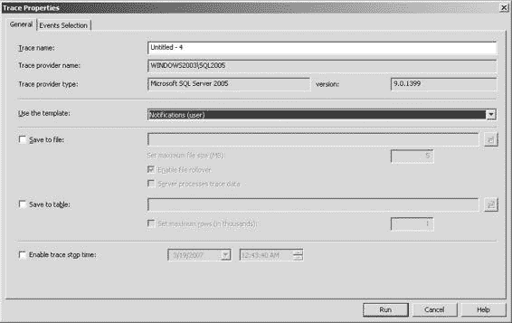
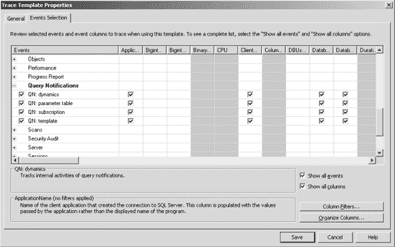
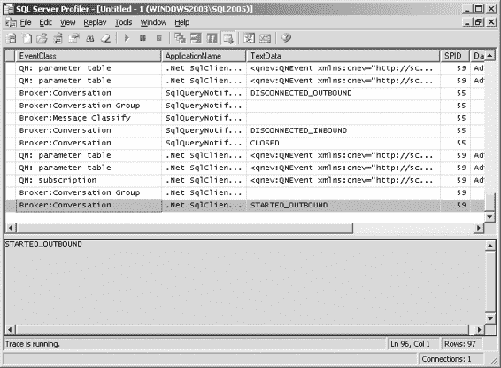
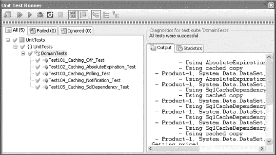
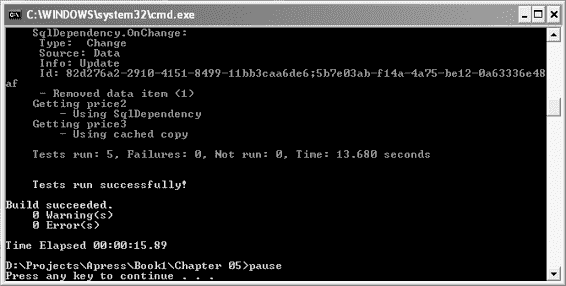
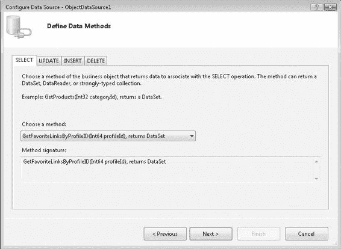
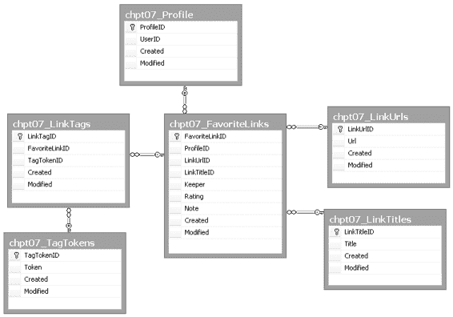

# 第 6 章 ■ 缓存

遵循的经验法则是创建一个作用范围有限的查询。你不能将 `AdventureWorks` 数据库中 `Production.Product` 表的平均 `ListPrice` 包含进来，这是完全合理的，因为这需要监控表中的所有行。

你还需要考虑，通过查询通知监控表会降低表更新的性能。并且，如果被监控的数据被多个应用程序频繁更新，那么选择另一种方式来确保缓存中的数据保持最新可能是最佳选择，因为这些通知会抵消缓存数据的价值。你可能无法缓存频繁更新的数据，而应将缓存限制在不经常变化的数据上。这样做至少能减少系统上的整体负载，因为需要传输的数据更少了。

由于存在许多不支持的特殊情况，因此有必要验证每个查询是否有效。如果查询无效，通知将立即触发 `OnChange` 事件，从而将该项从缓存中移除。

###### 查询通知故障排除

通知可能像缓存本身一样，是一个黑盒。需要仔细监控发生了什么以及对代码库的更改将如何影响缓存和通知的实际性能，以确保这些黑盒按预期运行。有一些工具可以用来窥探这些黑盒内部以监控活动。

## 使用 SQL Server Profiler 进行故障排除

`SQL Server 2005` 的 `SQL Server Profiler` 可用于查看查询被发送到系统时发生的情况，以及通知系统如何通过跟踪系统内部来作出响应。不幸的是，`SQL Express Management Studio` 不包含探查器，因此你需要使用完整版。到目前为止，大多数示例都使用 `SQL Express`，因为我个人更喜欢只在我的开发系统上运行 `SQL Express`，只在需要时才在另一个系统上安装 `SQL Server 2005`。我发现 `SQL Express` 不像 `SQL Server 2005` 那样占用大量资源。在需要跟踪时，我只需将我的更改部署到另一台计算机（虚拟机）上并运行跟踪来获取所需信息。

通常，我只在无法通过其他方式（例如观察本章前面介绍的监控实用工具）诊断问题时才需要运行跟踪。

要捕获特定于通知的信息，需要在探查器中创建一个自定义模板。启动 `SQL Server Profiler` 并单击“新建模板”图标。然后单击“事件选择”选项卡以获取所有可用事件的列表（见图 6-2）。对于通知，你关注的是“代理服务”和“查询通知”事件。单击最左边列的复选框以启用这两个事件组的所有事件。返回“常规”表，输入 `Notifications` 作为新模板的名称并保存它。

现在通过单击“新建跟踪”图标开始一个新的跟踪。选择新创建的 `Notifications` 模板，然后单击“运行”按钮（见图 6-3）。





**图 6-2.** 用于通知的自定义跟踪模板

**图 6-3.** 运行通知跟踪



跟踪启动后，你可以启动你的应用程序并观察事件的发生。图 6-4 显示了正常工作的通知系统的跟踪。代理服务和查询通知系统在跟踪中显示了正确的事件序列，应用程序的行为也符合预期。如果它失败了，你可能会看到代理服务立即启动并结束一个“会话”。这将表明查询通知拒绝了你的查询。

也许它包含了一个聚合函数或其他它无法支持的 SQL 功能。你可以通过精简你正在测试的查询并重新启动此序列来更新查询，以识别查询的哪一部分被拒绝。

**图 6-4.** 观察跟踪

你不必停止跟踪，但暂停它并单击“播放”按钮左侧的“清除”按钮是有帮助的。在再次启动你的应用程序之前单击“播放”以恢复观察跟踪。

一旦你的应用程序按你希望的方式工作，你可以将跟踪保存到文件中，以便以后如果需要比较行为时作为参考。只需从“文件”菜单保存跟踪。之后，你可以在探查器中打开保存的跟踪文件，与另一个新创建的跟踪并排查看。

## 通过单元测试进行故障排除

对于测试通知和整个缓存系统的更自动化方法，你可以利用单元测试。如果你预期某个通知将强制依赖项更改，你可以检查数据中的更改是否确实引发了从缓存中移除缓存数据的事件。



一个流行的单元测试框架是 `NUnit` (http://www.nunit.org/)，它是开源的，可以免费获取。你也可以从 JetBrains 获取 `UnitRun` (http://www.jetbrains.com/unitrun/)，它是一个免费工具，作为 `Visual Studio 2005` 的插件运行，以运行和调试用 `NUnit` 创建的测试（见图 6-5）。

**图 6-5.** 使用 NUnit 测试的 UnitRun

图 6-5 中显示的每个测试都检查了本章创建的用于数据访问层所支持的各种缓存场景。这些场景包括无缓存 (`Off`)、绝对到期、轮询、使用 `SqlCacheDependency` 的通知以及使用 `SqlDependency` 的通知。

这些测试并不严格是单元测试。它们越界成为了集成测试，因为它们做的工作远不止单一单元，并且与多个对象或资源交互。对于那些强烈认同测试驱动开发的开发者来说，这种区别至关重要。就本文档的测试目的而言，这些是集成测试；然而，我们尝试隔离每个测试，以便一个测试不影响另一个测试。

为此所做的部分努力包括声明 `StartUp` 和 `TearDown` 方法（见清单 6-34）。

**清单 6-34.** DomainTests.cs

```csharp
using System;
using System.Data;
using System.Threading;
using Chapter06.ClassLibrary;
using NUnit.Framework;

namespace UnitTests
{
    [TestFixture]
    public class DomainTests
    {
        #region " Shared Methods "
        private Domain domain;
        private int productId;
        private decimal originalPrice;

        [SetUp]
        public void SetUp()
        {
            productId = 1;
            domain = new Domain();
            DataSet productDs = domain.GetProductByID(productId, CachingMode.Off);
            originalPrice = GetPrice(productDs);
        }

        [TearDown]
        public void TearDown()
        {
            domain.SetListPrice(originalPrice, productId);
            domain.ClearCache();
            domain = null;
        }

        private decimal GetPrice(DataSet ds)
        {
            // verify there is data
            Assert.IsTrue(ds.Tables.Count > 0, "DataSet must be populated");
            Assert.IsNotNull(ds.Tables[0], "Table must be populated");
            Assert.IsTrue(ds.Tables[0].Rows.Count > 0, "Row must be populated");
            DataRow row = ds.Tables[0].Rows[0];
            decimal price = (decimal)row["ListPrice"];
            return price;
        }
        #endregion

        // Test Methods //
    }
}
```

你可以看到 `SetUp` 方法创建了域对象并获取了原始价格。`TearDown` 方法使用原始价格恢复价格。对于运行的每个测试，`SetUp` 方法首先运行，测试完成后，`TearDown` 方法运行。一个测试不会影响下一个测试。

## 清单 6-35. Test101_Caching_Off_Test 方法

在每个测试中，都会检查特定场景是否符合预期。每个假设都通过 `Assert` 调用进行检查，该调用将被计为整个测试套件的一个通过或失败。清单 6-35 中的测试检查了缓存未开启时的正确行为。

```csharp
/// <summary>
/// 测试系统在缓存关闭时是否正常工作
/// </summary>
[Test]
public void Test101_Caching_Off_Test()
{
    CachingMode mode = CachingMode.Off;
    domain.PrepareCachingMode(mode);
    // 获取产品的第一个副本
    DataSet productDs1 = domain.GetProductByID(productId, mode);
    decimal oldPrice = GetPrice(productDs1);
    decimal newPrice = oldPrice + 0.01m;
    domain.SetListPrice(newPrice, productId);
    // 获取产品的第二个副本
    DataSet productDs2 = domain.GetProductByID(productId, mode);
    decimal updatedPrice = GetPrice(productDs2);
    Assert.AreNotEqual(oldPrice, updatedPrice);
    Assert.AreEqual(newPrice, updatedPrice);
    domain.CompleteCachingMode(mode);
}
```

如果缓存关闭，旧价格和新价格应该不匹配，并且更新后的价格应该与新价格匹配。在清单 6-36 中，测试尝试使用绝对过期模式进行缓存。

## 清单 6-36. Test102_Caching_AbsoluteExpiration_Test 方法

```csharp
/// <summary>
/// 测试系统在绝对过期模式下是否正常工作
/// </summary>
[Test]
public void Test102_Caching_AbsoluteExpiration_Test()
{
    CachingMode mode = CachingMode.AbsoluteExpiration;
    domain.PrepareCachingMode(mode);
    domain.SetAbsoluteTimeout(3);
    // 获取产品的第一个副本
    DataSet productDs1 = domain.GetProductByID(productId, mode);
    decimal price1 = GetPrice(productDs1);
    decimal newPrice1 = price1 + 0.01m;
    domain.SetListPrice(newPrice1, productId);
    // 获取产品的第二个副本
    DataSet productDs2 = domain.GetProductByID(productId, mode);
    decimal price2 = GetPrice(productDs2);
    Thread.Sleep(3000);
    DataSet productDs3 = domain.GetProductByID(productId, mode);
    decimal price3 = GetPrice(productDs3);
    Assert.AreEqual(price1, price2, "price1 and price2 should match due to caching");
    Assert.AreNotEqual(newPrice1, price2, "newPrice1 and price2 should not match due to caching");
    Assert.AreEqual(newPrice1, price3, "newPrice1 and price3 should match once the cache expires the item");
    domain.CompleteCachingMode(mode);
}
```

这个测试稍微复杂一些。第一个和第二个价格应该相等，因为尽管价格被更新了，但第二个价格是在旧价格仍应被缓存时检索到的。将绝对超时设置为 3 秒后，第三个价格应获取到更新值，并与第一次更新的价格相匹配。此测试特意将绝对超时从默认的 120 秒更改为 3 秒，以确保测试在合理的时间内完成。

下一个测试检查轮询功能是否正常工作。当缓存模式设置为轮询时，绝对超时设置仍然有效，轮询时间设置为默认值。为了加快速度，单元测试项目的轮询时间被设置为 3 秒。清单 6-37 显示了轮询测试。

## 清单 6-37. Test103_Caching_Polling_Test 方法

```csharp
/// <summary>
/// 测试系统在轮询模式下是否正常工作
/// </summary>
[Test]
public void Test103_Caching_Polling_Test()
{
    CachingMode mode = CachingMode.Polling;
    domain.PrepareCachingMode(mode);
    // 获取产品的第一个副本
    DataSet productDs1 = domain.GetProductByID(productId, mode);
    decimal price1 = GetPrice(productDs1);
    decimal newPrice1 = price1 + 0.01m;
    domain.SetListPrice(newPrice1, productId);
    // 获取产品的第二个副本
    DataSet productDs2 = domain.GetProductByID(productId, mode);
    decimal price2 = GetPrice(productDs2);
    // 轮询时间设置为 3 秒
    Thread.Sleep(3000);
    DataSet productDs3 = domain.GetProductByID(productId, mode);
    decimal price3 = GetPrice(productDs3);
    Assert.AreEqual(price1, price2,
```


本次测试的运行方式与绝对过期测试非常相似，但输出窗口中打印的信息显示，缓存项被移除并非因为过期，而是由于依赖项发生了变更。除此之外，两者的断言逻辑是相同的。

清单 6-38 中的测试涉及通知机制。更新价格与获取更新后值之间的时间间隔非常短，但足以让通知机制将缓存项从缓存中移除。

### 清单 6-38. `Test104_Caching_Notification_Test` 方法

```csharp
/// <summary>
/// 测试系统在使用通知模式时是否正常工作
/// </summary>
[Test]
public void Test104_Caching_Notification_Test()
{
    CachingMode mode = CachingMode.Notification;
    domain.PrepareCachingMode(mode);

    // 获取产品的第一个副本
    DataSet productDs1 = domain.GetProductByID(productId, mode);
    Assert.IsNotNull(productDs1, "productDs1 cannot be null");
    decimal price1 = GetPrice(productDs1);

    decimal newPrice1 = price1 + 0.01m;
    domain.SetListPrice(newPrice1, productId);

    // 线程休眠足够长的时间以允许通知机制生效
    Thread.Sleep(200);

    // 获取产品的第二个副本
    DataSet productDs2 = domain.GetProductByID(productId, mode);
    Assert.IsNotNull(productDs2, "productDs2 cannot be null");
    decimal price2 = GetPrice(productDs2);

    DataSet productDs3 = domain.GetProductByID(productId, mode);
    Assert.IsNotNull(productDs3, "productDs3 cannot be null");
    decimal price3 = GetPrice(productDs3);

    Assert.AreNotEqual(price1, price2,
        "price1 and price2 should not match due to the cache notification");
    Assert.AreEqual(newPrice1, price2,
        "newPrice1 and price2 should match due to the cache notification");
    Assert.AreEqual(newPrice1, price3,
        "newPrice1 and price3 should match");

    domain.CompleteCachingMode(mode);
}
```

这些断言验证了第一次和第二次获取的价格不匹配，而新价格与第三次获取的价格相匹配，后者理应来自缓存。输出窗口中的文本应再次显示依赖项变更何时将项从缓存中移除，以及何时使用了缓存的副本。

最后，清单 6-39 所示的最后一个测试使用了 `SqlDepdendency` 对象，该对象不使用缓存，但仍使用通知系统。

### 清单 6-39. `Test105_Caching_SqlDependency_Test` 方法

```csharp
/// <summary>
/// 测试系统在使用 SqlDependency 时是否正常工作
/// </summary>
[Test]
public void Test105_Caching_SqlDependency_Test()
{
    CachingMode mode = CachingMode.SqlDependency;
    domain.PrepareCachingMode(mode);

    // 获取产品的第一个副本
    Console.WriteLine("Getting price1");
    DataSet productDs1 = domain.GetProductByID(productId, mode);
    Assert.IsNotNull(productDs1, "productDs1 cannot be null");
    decimal price1 = GetPrice(productDs1);

    decimal newPrice1 = price1 + 0.01m;
    domain.SetListPrice(newPrice1, productId);

    // 线程休眠足够长的时间以允许通知机制生效
    Thread.Sleep(200);

    // 获取产品的第二个副本
    Console.WriteLine("Getting price2");
    DataSet productDs2 = domain.GetProductByID(productId, mode);
    Assert.IsNotNull(productDs2, "productDs2 cannot be null");
    decimal price2 = GetPrice(productDs2);

    Console.WriteLine("Getting price3");
    DataSet productDs3 = domain.GetProductByID(productId, mode);
    Assert.IsNotNull(productDs3, "productDs3 cannot be null");
    decimal price3 = GetPrice(productDs3);

    Assert.AreNotEqual(price1, price2,
        "price1 and price2 should not match due to the SqlDependency");
    Assert.AreEqual(newPrice1, price2,
        "newPrice1 and price2 should match due to the SqlDependency");
    Assert.AreEqual(newPrice1, price3,
        "newPrice1 and price3 should match");

    domain.CompleteCachingMode(mode);
}
```

这最后一个测试的工作方式与其他通知测试非常相似，区别在于其内部使用了一个自定义集合来保存产品数据的副本，而不是依赖缓存。当所有这些测试都无误通过时，就确认了缓存系统和数据库都在正常工作。这一小组测试至少提供了整个应用程序所必需的基础支持。一些团队将“所有单元测试必须通过后才能将更改提交到源代码控制系统”作为一项要求。这可以作为防止破坏性更改的保障措施。



一旦测试系统就位，你可以使用 MSBuild 脚本来运行测试，而无需启动 Visual Studio 2005（参见图 6-6）。如果你当前的工作依赖于其他几个项目，你可以同步这些依赖项目的源代码，然后运行 MSBuild 脚本来构建和测试它们。这种自动化将为你节省时间，并在你开始在项目中进行更改之前识别出依赖项的问题。

### 图 6-6. 进行单元测试的 MSBuild

## 缓存带来的问题

除非你设计并通过规划、培训和代码审查来强制执行一个缓存策略，否则在使用缓存时会出现意外问题。你可能决定将“所有放入缓存的数据使用不超过五分钟的绝对过期时间”作为一项策略。你可能还决定不使用输出缓存，而是专注于使用依赖项通知的数据缓存，以确保应用程序使用的数据始终是最新的。通过制定明确的策略并通过代码审查强制执行，将更容易控制局面。

有几件事需要注意。使用数据缓存时，你可能会在后台代码中使用静态引用轻松持有缓存项，这将导致它永远不会消失。我发现，在处理缓存数据时，最好避免使用静态引用。为了解决这个问题，我创建了包装方法，作为获取数据的访问点。包装器首先在缓存中检查是否存在缓存项，如果存在则返回它。如果不存在，它就从数据库中提取数据，将其放入缓存，然后返回。我从不假设该项已经在缓存中。

对于输出缓存，你可能会将 `VaryByParam` 设置为 `*`，认为这样可以确保不同的 URL 会得到不同的结果。对于产品页面，你希望 `Product.aspx?ProductID=808` 显示的结果与 `Product.aspx?ProductID=429` 不同。这个 `VaryByParam` 设置可以确保它按预期工作，但如果你的网站被设置为显示多种语言的内容，第一个访问该页面的用户将为其语言缓存内容。在输出缓存保存原始请求的期间内，下一个具有不同语言首选项访问该页面的用户，将看到第一个用户的语言首选项。为了解决这种情况，你可以检查 `Accept-Language` 头部，作为唯一标识页面内容的一部分。清单 6-40 显示了在语言是关注点时，用于输出缓存的设置。

### 清单 6-40. 用于语言的 `VaryByHeader`

```aspx
<%@ OutputCache Duration="300" VaryByParam="*"
    VaryByHeader="Accept-Language" %>
```

##### 性能策略

制定一个全面的性能优化方案是必要的。仅仅缓存数据库查询结果并不能确保你的应用程序表现良好。如果某些查询非常慢，你将继续遇到性能问题。在应用程序最慢的地方，你可以尝试加快查询速度。


在某个场景下，你可能有一个偶尔运行的查询，但它返回结果所需的时间却长得令人痛苦。在另一个场景下，你有一个速度中等偏慢的查询，但它需要使用不同参数运行多次，这很快就会累积起来并拖慢你的应用程序。在这两种情况下，你都可以选择优化查询本身，或者更改它所查询的数据结构。

一个查询可能运行很长时间，因为它需要跨多个表进行连接（join），即使已经存在索引来协助表连接操作。如果数据量巨大，你可能需要扫描非常多的行才能匹配连接条件。这种性能损耗很难通过重写查询来避免，但可以尝试重构数据结构来解决。

###### 数据仓库

数据库设计师会尽力拆分数据，使其完全规范化。这样做减少了存储数据所需的空间，但同时也让查询变得更加复杂。以产品数据库为例，假设有 50,000 个产品，与产品相关的所有数据分布在十张表中，你将需要连接许多表才能获取所需数据。而且有些产品可能对客户并不可见（不可购买），因此数据库中存在额外的数据，这增加了全表扫描的成本。

在这种情况下，你可以尝试创建一个**反规范化表**来存放产品数据，从而避免表连接操作。当填充这个反规范化表时，还可以将其限制为仅包含活跃产品，以减少其大小。一个简单的 `SELECT * FROM MYTABLE` 会比任何连接查询都快得多。

为了实现这一点，你仍然需要偶尔刷新仓库表。也许你可以在一天中的非高峰时段进行几次，或者在一天中使用率最低的时段只执行一次。你甚至可以选择将数据库分布在不同的物理机器上，并通过远程查询来填充仓库。这样做可以让供应商全天处理其产品的数据，而不会影响公共数据库的性能。

我曾对一个产品数据库实施了所有这些操作，并将仓库表的所有内容加载到一个 `DataSet` 中，然后将其放入缓存。当我发现这些数据只占用不到 10 MB 的空间，而服务器总内存远超过 2 GB 时，我考虑过将所有产品数据保存在内存中。一旦 `DataSet` 在内存中，我所需要做的就是使用 `DataView` 对象的 `RowFilter` 属性对其进行查询（参见代码清单 6-41）。

**代码清单 6-41.** *使用 RowFilter 与 ProductID*

```
public DataTable GetProductByID(DataSet productDs, int productId)
{
    DataView dv = new DataView(productDs.Tables[0]);
    dv.RowFilter = "ProductID = " + productId;
    return dv.ToTable();
}
```

此示例接收一个已包含所有产品的 `DataSet`，然后利用带有 `RowFilter` 的 `DataView` 创建一个新的、仅包含匹配行的 `DataTable`。然后，你可以像使用 `DataSet` 一样，在任何数据绑定控件中使用这个 `DataTable`。

随着 .NET 2.0 的发布，`DataSet` 的性能通过改进的索引实现得到了显著提升。因此，这项技术运行得非常快。`RowFilter` 属性可以接受任何在 SQL 查询的普通 `WHERE` 子句中使用的字符串。

我还发现，加载仓库表中的所有行，比通过规范化表上的连接查询来加载单个产品更快。如果需要让产品数据保持更高的时效性，允许 `DataSet` 更频繁地从缓存中过期而不显著影响性能，可能是合理的。

产品也属于一个分类层级结构中。一组根类别包含子类别，依此类推，直到最终到达产品。我将这个结构扁平化，并将其放入另一个仓库表中以便快速访问。对于这个表，我包含了许多计算字段，例如产品数量、类别的开始和结束日期（因为有些类别是季节性的）。这些额外的列通过使其易于访问而无需查询数据库，辅助了 `RowFilter` 的使用。我发现，每当有新的查询需求需要新的条件时，我可以简单地在仓库表中添加一列，而不必放弃这个运行效果极佳的仓库策略。

## 惰性加载

并非所有的产品详情都被放入仓库表中。当存在一对多关系时，这是无法做到的。我也不想加载并非立即需要的数据。当用户通过产品分类层级深入网站时，他们只看到每个产品的摘要数据，例如名称和价格。加载详细数据可以推迟到必要时进行，我通过利用对象模型实现了这一点。

我通常做的是，将数据库中的 `DataSet` 形式的数据转换为业务对象，例如一个具有 `Name`（名称）、`Price`（价格）和 `VendorName`（供应商名称）等属性的 `Product` 对象。这些属性是在对象构造时始终加载的属性类型。我称填入这些属性的数据为**摘要数据**。其他属性，如 `Colors`（颜色）、`Features`（特性）和 `Dimensions`（尺寸），是详细数据，不会在类别页面上显示，因此在 `Product` 对象首次构造时不会加载。但是，当访问该属性时（初始值为 `null`），就会查询数据库以获取必要数据并返回。这被称为**惰性加载**，代码清单 6-42 展示了一个示例。

**代码清单 6-42.** *惰性加载示例*

```
private ColorsCollection _colors = null;

public ColorsCollection Colors
{
    get
    {
        if (_colors == null)
        {
            _colors = GetColors(ProductID);
        }
        return _colors;
    }
}
```

随后对 `Colors` 属性的每一次请求，数据都将已经存在并立即返回。这一切都基于一个假设：摘要数据的使用频率将远高于通过惰性加载获取的详细数据。在网站类别页面列出摘要数据的情况下，这将成立。

单个 `Product` 对象可以被放入缓存中有限的时间，这将自动保留由成员变量持有的详细数据。这种做法减少了整个产品对数据库的访问次数。然而，这可能并不完全符合你的期望。就像输出缓存会缓存整个页面的数据（无论任何单个数据缓存的超时设置）一样，只要父对象保留在缓存中，它也会一直保留数据。与其将数据作为成员变量保存，它可以使用数据缓存，并在每次需要时简单地请求数据，并期望数据会在适当的时间内被缓存。对于这种情况，你有很多可用的选择。

## 本章小结

在本章中，你了解了使用 `System.Web.Caching` 进行缓存的各种选项以及其他替代方案。你还学习了因依赖项更改而使缓存失效的技术，以及缓存存在的几个问题。最后，你探索了一些技术和策略，以充分利用混合和匹配可用功能，从而从系统中挤出最佳的性能。


尽管 Visual Studio 内置了许多强大工具来辅助将数据绑定到应用程序，你仍然需要手动构建数据访问层的部分内容。手动构建的数据访问层能为你在布局表结构、存储过程以及将数据从数据库传输到应用程序并返回的代码层方面提供最大的灵活性。当你直接与数据访问层打交道时，你将深入了解系统的所有细微差别。你也将能够深入思考系统将如何运作。

### 本章内容

本章涵盖以下内容：
- 使用 `DataSet`、内联 SQL 和存储过程
- 使用 `DataObject` 和 `对象数据源`
- 构建数据库
- 构建数据访问层
- 构建网站

在构建数据访问层时，你的设计决策会影响性能。如果你足够幸运，可以改变数据库中数据的构建方式，甚至更好，你可以从头开始。你的设计决策将产生或好或坏的影响。目前，随着 WCF 和 LINQ 引入 .NET 平台，我们的选择正以新的方式扩展。这些选项超越了已变得司空见惯的典型 ADO.NET 和 `DataSet` 模型。然而，这些新技术极具吸引力，足以突破本章所审视的设计框架。

本章的示例应用程序是一个用于存储和标记你喜爱链接的网站。我将向你展示应用程序的每个部分是如何构建的，并解释过程中做出的决策。

#### 使用数据集、内联 SQL 和存储过程

传统方法是使用内联 SQL 或存储过程，用查询结果填充 `DataSet`，然后将该数据绑定到用户界面上的数据绑定控件。此过程可用于快速构建一个功能相当丰富的丰富界面。

然而，人们往往只考虑构建第一个版本应用程序所需的时间成本。但随后下一个版本就会到来。随着现实世界的变化，应用程序和数据库的需求也会随之改变。历史表明，回头维护应用程序占据了开发者 80% 的工作量。

你可以在 Visual Studio 中打开 `服务器资源管理器`，将一个表拖放到 `Web 窗体` 的设计界面上，就能自动生成支持选择、更新、删除、分页和排序的完整功能的 `GridView` 和关联的 `SqlDataSource`。但是，当需要哪怕是最微小的改动时，会发生什么？如果你在数据库表中添加一个新列，并想在 `GridView` 上显示它，该怎么办？你确定会正确更新 `SqlDataSource` 中的所有命令吗？如果你的查询涉及连接两个或更多表，又会怎样？你如何处理删除和更新命令？这正是所有向导工具将你置之不顾的地方，也是你开始亲自动手、花更多时间在白板和白板笔上的时候。如果你已经通过这些易于使用的向导走到这一步，那么制定一个功能计划来应对新的功能需求将变得困难。

##### 数据集

`DataSet` 是一个我们已经非常熟悉的对象。它是 .NET 中用于传输数据的主要对象。它有两种主要形式：类型化（XSD）和非类型化。你在第 2 章中了解了它们的区别，该章揭示了类型化 `DataSet` 的刚性本质，使其在数据库发生变化时难以维护。因此我们转而使用非类型化 `DataSet`。实际上，`DataSet` 被用作一个华丽的**数据传输对象（DTO）**，它被神奇地绑定到控件上，而无需真正考虑每列的数据类型。这种自动数据绑定使我们能够通过向导快速构建原型应用程序。但这种非类型化的数据分组以及所有自动生成的方法可能会让必须将其用作数据访问层的开发者感到困惑。我们将在后续章节中探讨这些困难。

### 编译时与运行时支持

非类型化 `DataSet` 的内容由填充它的查询定义。如果一个名为 `BirthDate` 的列今天是 `DateTime` 类型，但明天它更新为返回一个 `VARCHAR(15)`，非类型化 `DataSet` 会自动接收更改后的列而不会报错。但如果你在代码中将该值强制转换为 `DateTime`，你将面临运行时发生 `InvalidCastException` 异常的风险。最好在编译时捕获此错误，以便在修改应用程序时处理它。当然，你也会测试应用程序的运行时行为是否正常，但由于数据库实际上与应用程序是断开的，查询返回的类型可能在最糟糕的时候发生变化。

另一位不知道你的应用程序正在查询某个表的数据库管理员，可能会调整该表，将一个 `int` 列更改为 `bigint`，因为自动递增的值即将达到 16 位整数的最大值。此类更改虽不幸，但确实会发生。

考虑一个表，其主键值设置为 `int` 类型，并且也是一个 `IDENTITY` 列，每创建一个新记录就递增 1。你可能已将该列强制转换为 `Int16`，但是一旦它超过 32,767，你将收到运行时异常，因为它现在至少需要是 `Int32` 类型。如果你只是用数据库中的几条记录测试应用程序，你不会遇到这个运行时异常。而当这个问题最终发生时，它就像一个定时炸弹，会在应用程序发布到实际环境一段时间后出现。

当这个运行时错误发生时，它将如何被记录并报告给开发团队？如果错误发生在用户界面层，错误似乎指向绑定问题，而不是数据库深处真正的原因。你可以想象，诊断这类问题会消耗你的开发时间，因为你可能会在系统自己的那一侧（使用着一个尚未达到麻烦阈值的数据库副本）原地打转，寻找问题所在。

与其使用乐于传递任何放入其中的数据的非类型化 `DataSet`，你可以手动将数据加载到业务对象中，其属性设置为用户界面层预期的精确类型。当应用程序编译时，它会确保这些类型正确对齐。当数据库中发生破坏这种隐式约定的更改时，可以在问题源头处理和记录错误，从而使你能够更好地修复它。一条记录着“在加载 `Person` 对象时第 151 行类型不匹配”的错误消息将准确定位问题，以便你检查该行代码的预期类型和数据库查询实际返回的类型。

### 重构


非类型化的值也会使应用程序的重构变得困难。你无法简单地在`DataSet`中右键单击一个属性并选择“查找所有引用”。`DataSet`中的值是通过名称或数字索引作为`DataRow`或`DataRowView`来访问的，这无法通过自动代码分析追踪回源对象。一个泛型的`DataRow`可以属于任何`DataSet`，而由 Visual Studio 和第三方插件提供的重构功能将无法协助你进行全解决方案范围的更改。要进行全局更改，你必须诉诸于搜索和替换，但这样做是有问题的。

当你的应用程序需要修订，并且你想更新一个查询使其更具描述性时，你可能会添加一个名为`VendorName`的新列，将`Name`重命名为`CustomerName`，并移除`Name`列。突然之间，所有对`Name`的引用都失效了，并将导致运行时异常。因此，你必须找到所有对`Name`的引用并更正它们。每次进行这样的更改时，你都必须运行搜索，并确保`row["Name"]`实际引用的是你刚刚更改的同一查询结果。你可能很容易就有许多包含名为`Name`列的查询。全局搜索和替换会破坏那些引用。

相反，如果你使用的是自定义业务对象，你可以安全地使用重构工具在解决方案范围内重命名属性。为了访问应用程序范围之外的引用，你还可以使用`Obsolete`属性标记旧属性，并附上使用新属性的说明，同时保持现有功能。这项技术将在本章后面介绍。

### 调试

你可能会期望使用`DataSet`进行调试会得到很好的支持。令人惊讶的是，调试支持的缺乏是使用`DataSet`的一个显著缺点。在图 7-1 中，你可以看到如何获取`DataSet`中第一个`DataTable`的第一个`DataRow`的值。要获取下一个`DataRow`，你必须更改索引值。

至少你可以查看该行中各列的值，但这些值是通过索引而不是列名访问的。当你访问同一行数据，该行被附加到 Web 窗体上的数据绑定控件（例如`Repeater`）时，你将通过`e.Item.DataItem`访问该行，这是一个`DataRowView`。正如你从图 7-2 中看到的，监视窗口的帮助比图 7-1 更小。你无法直接导航到这些值，并且几乎无法通过查看监视窗口来推断类型。

这种糟糕的调试体验将减少你用于创建和维护应用程序的时间。当数据在数据访问层立即移入业务对象并传递回应用程序时，你将能够以更有用的方式从调试器访问数据。图 7-1 和 7-2 中使用的相同数据在图 7-3 中被放入一个`FavoriteLink`对象中。`FavoriteLink`是网站将使用的一个关键对象，我们将在本章后面构建这个网站。

图 7-3 中显示的值显然更具可读性，并且你确切地知道你正在处理什么。使用业务对象显然比`DataSet`提供了更好的调试体验。至少用户界面层恢复了编译时支持，而类型安全问题被隔离在数据访问层深处。当你通过将`row["Url"]`转换为`String`来在`FavoriteLink`对象中设置`Url`属性时，你会在靠近拉取数据的查询的地方进行此操作。任何由此产生的异常都将显示堆栈跟踪，指向此查询和行号（如果你随程序集一起部署了程序调试数据库（PDB）文件）。稍后你将看到如何完全避免`InvalidCastException`。

■**注意** 如果在编译类库时创建的 PDB 文件随程序集一起部署，异常可以提供更详细的堆栈跟踪。诸如异常发生的确切行号等有用细节将帮助你追踪和修复错误。PDB 文件是在调试和发布配置下创建的。

像任何其他普通对象一样，`FavoriteLink`对象也更易于重构。你可以在代码中找到对`Url`属性的所有引用，无论它在解决方案中的何处使用。不幸的是，如果你以声明方式将`Url`属性绑定到数据绑定控件，重构搜索将不会找到该引用。

最后，在调试时，你可以更轻松地使用`FavoriteLink`对象，如图 7-3 所示。这甚至包括在属性访问器中设置断点，这在观察哪些值被绑定到数据绑定控件时将非常有用。

##### 内联 SQL

一个需要避免的诱惑是直接将你的 SQL 语句写入代码中。尽管你创建的与数据库通信的代码确实会与查询和其他数据库命令紧密绑定，但这并不是创建或维护软件最有效的方式。

#### 维护注意事项

将 SQL 直接放入代码中的一个问题是，当这些查询更改时，会导致额外的维护工作。你最终会为自己增加更多工作并增加出错的机会。例如，你最基本的查询可能开始时如清单 7-1 所示。

```sql
SELECT * FROM Production.Product WHERE ProductID = 1
```

你可以看到它开始时是一个可读的查询，但随着查询变长，它开始看起来更像清单 7-2。

```sql
SELECT 
    p.ProductID, p.[Name], p.ProductNumber,
    p.Color, p.ListPrice, 
    p.SellStartDate, p.SellEndDate, 
    p.DiscontinuedDate 
FROM Production.Product AS p 
JOIN Production.ProductProductPhoto AS ppp 
ON ppp.ProductID = p.ProductID 
WHERE ppp.ProductPhotoID != 1;
```

清单 7-2 中的查询显然是一个维护噩梦。当你进行微小的更改时，你会在代码中内联进行，并尽力确保将查询仔细地包裹在`String`的引号内。但你放弃了很多东西。

如果清单 7-2 中的查询是作为独立的 SQL 脚本维护的，你可以使用诸如 SQL Server Management Studio 或带有数据库项目的 Visual Studio 之类的工具来提供语法着色以及其他一些丰富的功能。第三方工具也可提供实时智能感知支持，并在你处理 SQL 时提供列和表名的列表。内联查询无法利用所有这些支持。

#### 安全注意事项


使用内联 SQL 的另一个问题是 SQL 注入攻击的风险。这种风险常被忽视，但它确实是一个非常实际的问题。在清单 7-1 中，`ProductID` 被硬编码到了 `String` 中，但你可能从 URL 的查询字符串（如 `Product.aspx?ProductID=1`）中获取该值。如果用于查询数据库的 `String` 类似于清单 7-3，那么这种内联查询很容易被利用。

**清单 7-3.** 可被利用的内联查询

```java
public String GetProductQuery(String productId)
{
    return "SELECT * FROM Production.Product WHERE ProductID = " + productId;
}
```

攻击者只需要调整查询字符串，添加一个结束当前查询并开始另一条命令（例如 `UPDATE` 或 `DELETE` 命令）的语句。一个足智多谋的攻击者可以通过查询你的数据库架构来发现所有表并复制数据，从而获取所有数据，而你可能对此一无所知。在问题得到纠正之前，攻击者可以随时返回重复该查询，危害你的数据。

防范 SQL 注入攻击的第一步是永远不要相信来自用户的数据。数据应始终被验证。如果你期望 `ProductID` 是一个整数，可以使用清单 7-4 中的代码更安全地组装查询。

**清单 7-4.** 验证传入数据

```java
int productId = 0;
String sql = "";

if (int.TryParse(Request.QueryString["ProductID"], out productId))
{
    sql = GetProductQuery(productId);
}
else
{
    // handle the failed attempt
}
```

更糟糕的是，如果你的应用程序将异常信息直接显示给潜在的攻击者，这将会给攻击者提供有助于修改查询的信息。当你捕获异常时，你应该记录错误并抛出一个不包含任何可能帮助攻击者的信息的新异常。用户不需要知道那个级别的详细信息。用户也不需要向你通知异常的详细信息，因为你总是可以查看错误日志来获取详情。你也应该监控该错误日志，因为它可能会显示危害你数据库的尝试。

超越验证所有传入数据的下一步是使用参数化查询将值绑定到数据库命令。当值通过类型限制被专门绑定到查询中的占位符（更不用说参数的正确顺序）时，这使得攻击者组装功能性攻击变得困难得多。参数化查询还会转义诸如引号和通配符之类的字符，从而消除了注入一个会关闭你的查询并启动另一个查询的字符串的可能性。清单 7-5 展示了一个参数化查询。

**清单 7-5.** 参数绑定

```csharp
public DataSet GetProduct(int productId)
{
    DataSet ds;
    try
    {
        String sql = "SELECT * FROM Production.Product " +
                     "WHERE ProductID = @ProductID";
        using (DbCommand dbCmd = db.GetSqlStringCommand(sql))
        {
            db.AddInParameter(dbCmd, "@ProductID",
                             DbType.Int32, productId);
            ds = db.ExecuteDataSet(dbCmd);
        }
    }
    catch (Exception ex)
    {
        // handle exception
        throw;
    }
    return ds;
}
```

当 `ProductID` 在用户界面层被验证后，你可以采取适当的操作，例如向用户显示有意义的验证消息。这样做可以防止垃圾数据进入数据库。

还可以采取另一步来进一步保护数据，但这无法通过内联 SQL 完成。当所有与数据库的交互都通过存储过程而不是内联 SQL 完成时，你可以锁定对表的访问，并特别允许特定用户访问存储过程。

##### 存储过程

存储过程可用于扩展你的应用程序，并在你的用户界面和底层数据之间提供一个干净灵活的桥梁。通过阻止对表的访问，你使存储过程成为访问数据库的唯一入口点。当所有数据都通过一个可以包含编程逻辑的存储过程层时，你将拥有极大的灵活性。

作为你的公共接口的存储过程成为你数据访问层不可或缺的一部分。事实上，如果你有五个应用程序使用你的数据库，并且你想记录每次从 `Production.Product` 表中删除记录的操作，那么用于删除这些记录的存储过程可以被更新以处理日志记录。你不需要将该变更纳入五个应用程序中的每一个。而且，如果你选择调整数据库的结构，例如进一步规范化结构，在许多情况下，存储过程仍然可以使用相同的参数并在结构变更后返回相同的输出。

你还可以将一些开发人员可能认为是业务逻辑的内容封装在存储过程中。通常，将业务逻辑深埋在存储过程中并不是一个好主意。存储过程通常用 T-SQL 创建，对于试图避免用 T-SQL 编写任何内容的普通开发者来说，它不像 C# 代码那样具有表现力和可测试性。那些对 T-SQL 很熟悉的开发者可能不同意将业务逻辑放入存储过程的可行性。

有时业务逻辑已经与数据库结构紧密绑定。例如，确定产品是否在销售以及销售价格的逻辑可能被认为是业务逻辑。但是将产品表连接到销售计划表和定价表是结构性逻辑。如果我在销售期间运行一个名为 `GetProduct` 的存储过程，它会给我折扣价。在其他任何时间运行它，它会给我常规价格。将此类逻辑封装在存储过程中非常有吸引力，因为它提供了诸多优势。它向你的应用程序隐藏了数据库的结构，并提供了你所需的数据。而且，如果数据库最初创建时没有销售功能，存储过程让你有机会推出这样的功能，而无需同时更新你的应用程序代码。

我们将职责分配给 T-SQL 与应用程序其余部分之间的界限，是我们有时会跨越的。

因为你可以识别哪些存储过程已存在，所以你可以准确识别哪些命令正在访问数据库。你还可以直接访问所有这些命令。

如果你因任何原因决定重组表，你可以编写一组脚本来调整表并更新存储过程以执行变更。如果你有查询分散在五个应用程序中，你将不得不查看每个应用程序，以了解每个查询在各自应用程序源代码中是如何工作的。如果一个查询是以复杂的方式组装的，你可能很难确认你的更新不会导致破坏性变更。展望未来，我们将利用存储过程提供的所有优势。

## 使用 DataObjects 和 ObjectDataSource

我们再次回到 `DataObjects` 和 `ObjectDataSource`，它们在第二章中作为我们数据模型选择的一部分被简要介绍过。在所有选择中，这两个最值得关注，因为它们提供了极大的灵活性。这些功能旨在无缝协作，并提供丰富的工具支持，使开发人员能够对数据层进行大量控制。这些组件为我们提供了一种智能的方式，将应用程序插入数据源。

在应用程序插入数据源后，数据将以我们选择的任何形式通过管道流动。


### 第 7 章：手动数据访问层

作为创建数据访问层的开发人员，您将创建标记有 `DataObject` 属性的类，其方法标记有 `DataObjectMethodType` 属性，这些属性指明了该方法将为 `ObjectDataSource` 提供什么。表 7-1 列出了 `DataObectMethodType` 的各个值。

## 表 7-1. DataObjectMethodType 枚举

*   `Insert`
    表示执行插入操作的方法
*   `Update`
    表示执行更新操作的方法
*   `Delete`
    表示执行删除操作的方法
*   `Select`
    表示检索数据的方法
*   `Fill`
    表示填充 `DataSet` 的方法



当使用数据访问层的开发人员将 `ObjectDataSource` 拖到设计界面上时，向导面板将首先引导开发人员选择任何标记为 `DataObject` 的类，然后为所选类选择带有 `DataObjectMethodType` 属性的方法。它向开发人员显示返回类型和参数，以及方法名——方法名应足够明确以表明其功能（见图 7-4）。

## 图 7-4. ObjectDataSource 向导方法选择

通过引导开发人员找到正确的对象和方法，您可以大大简化他们的工作，同时鼓励他们使用正确的方法。翻查源代码并猜测该使用哪些类和方法会花费更多时间，并且如果他们选择错误，可能会引入问题。更糟糕的是，他们可能会放弃并绕过数据访问层直接访问数据库。通过鼓励开发团队使用 `ObjectDataSource` 和正确构建的数据访问层，他们将习惯于以这种方式使用设计界面来构建应用程序，并期望数据库开发人员为他们提供实现应用程序功能所需的类和方法。建立了这种关系后，随着应用程序开发人员开始依赖数据库开发人员，您可以开始规范沟通。

## 设计契约

当应用程序开发人员显示一组关于产品的数据时，他们将使用像 `GridView` 这样的数据绑定控件。而当开发人员使用 `ObjectDatasSource` 通过您创建的数据访问层将数据绑定到该 `GridView` 时，他们将选择一个符合需求的类和方法。当选择一个名为 `ProductDomain` 的对象，它有一个名为 `GetAllProducts` 的方法并返回 `ProductCollection` 时，开发人员会认为这是正确的选择。但这些名称不应仅仅表示与产品有关。名称和对象代表了数据访问层正在维护的、供任何使用它的应用程序使用的**设计契约**。这些对象和方法如何收集数据并返回并非设计契约的一部分细节，但有哪些方法可用以及它们返回什么则很重要。违反契约将导致运行时异常。

另一个同样返回 `ProductCollection` 的、名为 `GetProductsByCategory` 的方法应包含与 `GetAllProducts` 方法返回的相同的列。`ProductDomain` 类上的方法可以设置为 `public` 或 `private`。将它们设为 `private` 会明确地将其排除在设计契约之外。对于 `public` 方法，您可以使用 `DataObjectMethodType` 来标记它们，以定义该方法的预期用途。在使用了返回 `ProductCollection` 的方法后，开发人员应能够使用 `ProductDomain` 类上的其他方法，而不必担心数据与预期不同。

随着应用程序开发人员需要数据访问层提供功能，设计契约将进行协商以纳入所需内容以及何时提供。并且在新功能发布后，未经适当通知应用程序开发人员，不得更改契约。

## 数据契约

在开发人员将其应用程序通过隐含的设计契约接入您的数据层后，还存在另一个协议。设计契约定义了数据流经的管道，但传递的消息必须用**数据契约**来定义。如果 `ProductCollection` 持有的 `Product` 对象具有名为 `ProductName`、`ProductNumber` 和 `Price` 的属性，则必须维护该数据契约。一旦数据绑定设置完成，日后更改该名称即使不是不可能，也会非常困难。

数据契约包括字段的名称及其类型。如果 `ProductName` 是 `String` 类型而 `Price` 是 `Decimal` 类型，那么对于数据访问层的未来版本，它应始终保持如此。数据绑定将使用这些名称进行声明，并期望绑定首次声明时定义的类型。更改数据契约将需要更新应用程序以防止运行时异常。

当然，有时数据契约必须更改，正如数据本身也会变化一样。在这样做时，您应首先将版本号递增到下一个重要的值。然后，您应生成文档解释任何破坏性更改，以及开发人员应如何调整其应用程序以适应新的数据契约。您还可以在过渡期内提供帮助，此时旧的数据契约会被维护，并设定一个明确的结束日期。

在一个简单的场景中，您从一个 `Person` 对象开始，它有一个 `Name` 属性代表一个人的全名。后来，由于需求变更，`Name` 被拆分为名为 `FirstName`、`MiddleInitial` 和 `LastName` 的属性。您可以通过添加新属性同时保留旧属性来启动一个过渡期。清单 7-6 显示了一个标记为 `Obsolete` 的方法。

## 清单 7-6. 拆分 Name 属性

```csharp
/// <summary>
/// 期望格式如 "John Q Public" 或 "John Public" 的名称
/// </summary>
[Obsolete("请使用 FirstName, MiddleInitial 和 LastName")]
public string Name
{
    get
    {
        if (String.IsNullOrEmpty(MiddleInitial))
        {
            return FirstName + " " + LastName;
        }
        return FirstName + " " + MiddleInitial + " " + LastName;
    }
    set
    {
        string[] parts = value.Split(" ".ToCharArray()[0]);
        FirstName = parts[0];
        if (parts.Length > 2)
        {
            MiddleInitial = parts[1];
            LastName = parts[2];
        }
        else if (parts.Length > 1)
        {
            MiddleInitial = String.Empty;
            LastName = parts[1];
        }
    }
}
```

在清单 7-6 中，`Name` 属性包装了新引入的属性，以维护现有的数据契约，同时为开发人员提供开始迁移其应用程序的选择。为了帮助开发人员，在 `Name` 属性上放置了 `Obsolete` 属性，以便在他们的代码编译时显示警告。警告包含一条有用的信息，说明现在应使用哪些属性。

也许您的数据访问层初始版本为 1.2.0.8。当您应用这些过渡性更改时，将版本设置为 1.2.1.0 并发布给开发人员。过渡期结束后，您可以将版本号更显著地提升，比如到 1.3.0.0 甚至 2.0.0.0，这应该能促使开发人员意识到已经发生了重大更改。如果开发人员只看到非常小的版本号增加，他们可能会认为这只是一个次要的错误修复版本，并在没有适当评估和考虑更改的情况下开始使用它。


## 测试设计与数据契约

由于无法完全利用编译时支持来避免运行时异常，因此必须对应用程序进行测试。自然，这是添加自动化测试的良好位置。这些测试将确认从数据源检索的数据包含具有正确类型的预期字段。

这些测试可以在两个不同层次上完成。直接在数据访问层之上，可以有一组单元测试来确保返回预期数据；一个测试数据库会被填充特定数据，数据访问层和测试使用这些数据来返回一致的结果。

数据访问层通过这些测试后，下一步是包含集成测试，这些测试将考虑通过数据绑定使用的数据。

测试代码相当容易。测试网页上的数据绑定则不那么容易。此步骤现在需要加载每个页面，并检查每个值是否看起来正确且不会引发异常。诸如 Microsoft Visual Studio Team System 之类的工具提供了创建和运行此类测试的工具。或者，您可以使用 OpenQA 的 Selenium，它为网页提供跨浏览器和跨平台的测试功能。

在这些集成测试中，您加载页面并验证预期值是否出现在页面上。

#### 构建数据库

每当我构建应用程序时，我总是从数据库开始。这是一种自下而上的方法。

我知道我将管理哪些数据以及需要对数据执行哪些操作，因此我首先规划数据库将存储什么、数据之间的关系将如何工作以及应用程序将如何与之交互。通过将工作范围仅限于数据库，工作可以更快地推进，而不会被界面或其他辅助细节分心。数据库功能完成后，构建应用程序的前端就容易得多。

在本章中，您将构建一个社交书签网站，该网站保存链接并具有用于浏览链接的标签系统。个人资料将直接与标准的 `ASP.NET Membership User` 帐户集成，以便您可以利用 `ASP.NET` 中所有其他可用的用户帐户管理功能。

##### 创建数据库结构

数据结构将保存链接和标签，以及与 `Membership User` 的关联。它将采用完全规范化的方式进行分解，以减少存储需求并优化数据访问速度。我的假设是许多用户将使用该应用程序，并且不同用户会保存相同的链接并使用相同的标签，因此我希望仅存储一次这些公共数据，并仅保留与该数据的关系。

图 7-5 列出了数据库结构。它显示了核心部分是 `FavoriteLinks` 表，周围环绕着所有相关数据。



**图 7-5.** 数据库结构

#### 整合数据

由于许多用户会存储相同的 URL 和标题作为其链接的一部分，因此这些数据保存在与 `FavoriteLinks` 表分离的表中。当用户存储 `http://youtube.com/` 的链接时，保存过程将在 `LinkUrls` 表中创建一个新记录。下一个保存相同链接的用户将简单地指向现有记录。对于链接使用的任何标题，`LinkTitles` 表也是如此。这样，数据库中将存储尽可能少的数据。

减少数据重复还降低了全表扫描以及表范围扫描的成本。在接下来的存储过程中，努力确保数据被清除任何未使用的数据，并且数据库尽可能小。当链接或标签不再被任何用户使用时，它将从数据库中删除。

#### 管理关系

数据并非存在于真空中。在普通数据库中，表之间可能存在许多关系。关系类型可分为三组：

*   `一对一`
*   `一对多`
*   `多对多`

`一对一` 关系乍看之下可能不是特别有用，但请考虑如何拆分数据。您可以将关于用户最常访问的数据信息保存在一个表中，而将额外的详细信息保存在另一个表中。我将第一个表称为摘要表，第二个表称为详细信息表。而且我可能拥有多个详细信息表。在 `FavoriteLinks` 数据库中，`Membership User` 记录与单个收藏链接配置文件具有关系。这并非为了规范化数据，而是为了按用途对数据进行分组。一个包含 30 列的表在硬盘扫描每条记录方面将难以查询，更不用说读取和维护索引了。通过拆分数据，您可以增强性能。

当数据被拆分时，您还有机会考虑对数据进行分区以获得进一步的性能提升。

您需要仔细地将数据分组到表中，以在应用程序所需的所有查询中创建尽可能少的连接。理想情况下，您在从详细信息表访问相关记录后，将使用其主键直接访问详细信息表。

下一种关系是 `一对多`。对于 `FavoriteLinks` 数据库，存在多个 `一对多` 关系。`Profile` 表中的一条记录可以有多个指向 `FavoriteLinks` 表的引用。子记录在每个实例中指回父记录以允许多个关系。这些子对父的引用是通过外键完成的，这要求将子记录中的一列与父记录的主键配对。这意味着访问索引列，这有助于加快利用这些关系的查询速度。令人惊讶的是，我遇到过未正式使用外键的数据库。关系存在，但向数据库添加外键约束的额外步骤并未完成。我确信创建此类数据库的开发人员在准备首次发布应用程序时，不想处理外键约束的麻烦。一个简单的脚本来添加和移除约束本可以消除这个问题。

我还发现，当开发数据库中没有外键约束时，关系可能会变得有点混乱。当父记录被删除时，您可能会留下子记录，这些记录会随着时间的推移而累积，并用垃圾数据填满您的数据库。当我使用新数据库或维护现有数据库时，我在开发存储过程时会保留外键约束，以确保我尊重这些关系。调整存储过程以采取必要步骤满足约束要求是非常简单的。

最后，逻辑上存在 `多对多` 关系，但不应直接用两个表表示。有必要将此类关系拆分为三个表，中间的表充当两个 `一对多` 关系之间的链接。在当前数据库中，`FavoriteLinks` 数据库与 `TagTokens` 表具有 `多对多` 关系，该关系通过 `LinkTags` 表组织。对于这种关系，同一个标签可以放在许多链接上，而一个链接可以拥有许多标签。我选择将中间的表称为 `LinkTags`。中间表取相关表的部分内容是有用的。

这种结构使得轻松识别这些“桥梁”表，并一目了然地显示关系。

## 创建与修改时间

## 表设计：维护创建与修改时间戳

每当从零开始创建数据库时，我喜欢在每个表的末尾添加 `created` 和 `modified` 字段，并在每次插入和更新时维护它们。掌握这些细节的访问权限有很多好处。首先，在数据库使用了很长时间后，你可以查看表中某些行有多“老”。这使你有机会清除或归档那些久未被访问的旧数据。你还可以根据 `Created` 或 `Modified` 值对旧数据进行逻辑分区。当一个表变得非常大时，你可能只访问最近创建或修改的数据。在数据被分区后，你可以在查询中仅扫描该子集，而无需对整个表进行全表扫描。

> **注意**：分区属于数据库管理员的职责范围，本书不深入讨论。在考虑数据的逻辑分组时，与你的 DBA 讨论分区策略会很有用，以确定根据你的数据库结构和可用硬件可以采取哪些措施。

## 关于空值（Null）的处理

如何处理空值（`null`）的决定对某些开发团队来说是一个敏感问题。

有些人倾向于完全不允许空值，只使用已知的默认值；而另一些人则认为真正的空值应该被保留为 `null`。争论的焦点将取决于你能否将默认值的定义传达给数据库的所有用户——这即使不是不可能，也通常是困难的。同时，空值是众所周知的存在，并且会迫使应用程序开发人员迟早处理它。然而，当你能够阻止空值从数据库中输出时，你就降低了数据访问层的复杂性。

当一个列可能返回空值时，使用该值需要额外的步骤来检查该值是否可以安全地转换为不允许空值的类型（如 `int` 或 `DateTime`）。这个额外的空值检查会对性能产生影响。传统的方法是检查该值是否匹配 `DBNull.Value`，如果不是空值则进行转换。清单 7-7 展示了传统的做法。

**清单 7-7. 传统的空值处理代码**
```
DateTime birthDate;

if (!DBNull.Value.Equals(row["BirthDate"]) && row["BirthDate"] is DateTime)
{
    birthDate = (DateTime)row["BirthDate"];
}
```

或者，你可以通过为 `DateTime` 和 `int` 使用可空类型来简化这段代码，这样你就可以直接使用 `as` 运算符进行转换（见清单 7-8）。

**清单 7-8. 简化的空值处理代码**
```
DateTime? birthDate;

birthDate = row["BirthDate"] as DateTime?;
```

清单 7-8 中的简化代码结合了可空类型和 `as` 运算符，允许将空值赋值，而不会有 `NullReferencesException` 或 `InvalidCastException` 的风险。`as` 运算符首先测试转换是否有效，然后再完成转换。检查是否匹配 `DBNull.Value` 或使用 `as` 运算符是没有必要的。

如果你选择使用默认值，你可以使用在整个应用程序中明确定义的默认值。对于 `String` 来说，自然的选择是 `String.Empty`，而像 `int` 和 `DateTime` 这样的类型没有明显的默认值。通常，数值默认是正数，特别是当它被用作从 0 开始递增的标识值的主键时。在这种情况下，`-1` 是一个明确的选择。

对于 `DateTime`，你可能想使用 `DateTime.MinValue`，但 SQL Server 不允许在数据库中为 `DateTime` 类型使用该值，因为它将日期限制为大于 1753 年 1 月 1 日。你将需要使用一个替代值。在微软内部，使用的是 1754 年 1 月 1 日的值，在大多数情况下这是一个合理的默认值。

## 表 7-2. 建议的默认值

| 类型        | 默认值           |
|-------------|------------------|
| 字符串      | `String.Empty`   |
| 日期时间    | `1/1/1754`       |

将这些值设置为数据访问层中的常量后，它们就可以在应用程序的其余部分进行检查。如果将来您选择更改默认值，只需更新这些常量，即可在整个应用程序中反映更改。当数据访问层和数据库都设置为识别相同的默认值时，您可以通过存储过程妥善处理它们。这样，即使不允许存储过程返回 null 值，您仍然可以在数据库中设置 null。

### 防止空值

假设您确实有一个包含 `DateTime` 类型列 `BirthDate` 的表，并且该列允许 null 值。返回此值的存储过程可以使用 `COALESCE` 函数将 null 值转换为默认日期值。代码清单 7-9 展示了如何使用 `COALESCE` 函数。

**代码清单 7-9. 为 Null 值返回默认日期**

```sql
SELECT
    COALESCE(
        BirthDate,
        Convert(DateTime, '1/1/1754')
    ) AS BirthDate
FROM chpt07_Nullable
```

当向系统发送默认值时，我们也可以将默认值转换为 null 进行存储。代码清单 7-10 展示了此检查与转换过程。

**代码清单 7-10. 将默认日期转换为 Null**

```sql
DECLARE @DefaultDate DateTime
SET @DefaultDate = Convert(DateTime, '1/1/1754')
DECLARE @BirthDate DateTime
SET @BirthDate = Convert(DateTime, '1/1/1754')
IF (@BirthDate = @DefaultDate)
BEGIN
    SET @BirthDate = NULL
END
```

通过在存储过程中处理默认值转换，您能获得比 `CLR` 代码更好的性能，并避免了检查类型是否为 `DBNull.Value` 以及进行类型转换的开销。

### COALESCE 与 ISNULL

`COALESCE` 函数是一个标准 SQL 函数，而 `ISNULL` 是 SQL Server 提供的专有函数。`ISNULL` 函数通常可以与 `COALESCE` 函数互换使用，并且可能提供更好的性能。您需要运行自己的测试来收集指标，以确定您的具体查询从哪个函数中获益更多，因为在特定条件下，其中一个可能比另一个更快。

对于 FavoriteLinks 数据库，我选择不在表级别允许 null 值。对于这个小型应用程序，可以合理地确保在整个应用程序中遵循默认值。应用程序还将使用验证来确保不会向数据访问层发送空字符串，这本身就能防止 null 值进入系统。

#### 使用数据库项目

为了构建数据库，我使用了 Visual Studio 2005 专业版中的一个功能——数据库项目。每个表和存储过程脚本都经过独特的组织和源代码控制，这使得跨应用程序版本管理数据库变更更加容易。

#### 管理脚本

FavoriteLinks 数据库包含六个表，如图 7-5 所示。除了这些表之外，还有多个脚本文件，其中包含应用程序所需的所有访问这些表的存储过程脚本。还有用于添加和删除维护表间关系的约束的脚本。所有这些脚本都被组织到文件夹中的组里。

数据库项目的一个隐藏功能是智能依赖关系分析，当您选择多个脚本并运行它们时，此分析会透明地执行。Visual Studio 会检查所选的脚本，并根据依赖关系，以正确的顺序运行它们，以确保脚本成功运行。如果您碰巧在一个表脚本中定义了一个外键，该外键引用了按字母顺序排在其后的另一个表，那么在运行脚本时，运行顺序将会被调整。


除了外键约束，存储过程还可以引用其他存储过程。选择并运行所有存储过程也有助于确定执行顺序，并能避免因使用了尚未定义的资源而产生的警告。我发现，如果我对所有存储过程做了多处修改，在完成修改后选择并运行所有存储过程是很有帮助的。

## 规划存储过程

对于“收藏链接”网站，用户将存储多个链接以及标签和其他相关数据。为了实现此功能，存储过程将涵盖所有访问功能，包括获取、保存和清除数据。尽管六张表之间的关系很复杂，但构建在表结构之上的层并不必直接反映这种复杂性。从存储过程开始，抽象层将使数据更易于使用。

##### 获取数据

要构建的第一组存储过程是从数据库获取数据的那些。主要数据是链接，因此我们将详细查看这些。其中，核心过程将是获取与某个配置文件相关的所有链接的过程，如 `代码清单 7-11` 所示。

`代码清单 7-11.` `chpt07_GetFavoriteLinksByProfileID.sql`
```
CREATE Procedure dbo.chpt07_GetFavoriteLinksByProfileID
(
    @ProfileID int
)
AS
SELECT
    fl.FavoriteLinkID AS ID,
    lt.Title,
    lu.Url,
    fl.Keeper,
    fl.Rating,
    fl.Note,
    fl.Created,
    fl.Modified
FROM chpt07_FavoriteLinks AS fl
JOIN chpt07_LinkUrls AS lu ON lu.LinkUrlId = fl.LinkUrlID
JOIN chpt07_LinkTitles AS lt ON lt.LinkTitleID = fl.LinkTitleId
WHERE fl.ProfileID = @ProfileID
ORDER BY fl.Created DESC
GO
```

我们将把这个存储过程与下一个最常用的存储过程进行比较，如 `代码清单 7-12` 所示。

`代码清单 7-12.` `chpt07_GetFavoriteLinksByTag.sql`
```
CREATE Procedure dbo.chpt07_GetFavoriteLinksByTag
(
    @ProfileID bigint,
    @Token nvarchar(30)
)
AS
SELECT
    fl.FavoriteLinkID AS ID,
    lt.Title,
    lu.Url,
    fl.Keeper,
    fl.Rating,
    fl.Note,
    fl.Created,
    fl.Modified
FROM chpt07_FavoriteLinks AS fl
JOIN chpt07_LinkUrls AS lu ON lu.LinkUrlId = fl.LinkUrlID
JOIN chpt07_LinkTitles AS lt ON lt.LinkTitleID = fl.LinkTitleId
JOIN chpt07_LinkTags AS lt2 ON lt2.FavoriteLinkID = fl.FavoriteLinkID
JOIN chpt07_TagTokens AS tt ON tt.TagTokenID = lt2.TagTokenID
WHERE fl.ProfileID = @ProfileID AND tt.Token = @Token
ORDER BY fl.Created DESC
GO
```

在这两个存储过程中，结果集是相同的。使结果集相同是刻意为之，以保持它们彼此兼容。稍后在数据访问层中，同一个业务对象将保存来自 FavoriteLinks 数据库的数据，并且将需要这些值。这些存储过程之间的唯一区别在于传入的参数以及它们筛选结果的方式。在 `chpt07_GetFavoriteLinksByProfileID` 中，`@ProfileID` 用于访问保存到指定配置文件的所有链接。在 `chpt07_GetFavoriteLinksByTag` 中，再次提供了 `@ProfileID`，同时还有 `@Token` 参数，以将结果范围限制为匹配的标签。除此之外，用于整合所有数据的一系列连接操作保持一致。还有其他筛选收藏链接列表的标准，它们都通过使用不同的参数返回相同的列。

## 优化内容与方法

提高数据访问层的性能需要知道优化什么以及如何去做。通过简单地将“获取”查询放入一组有限的存储过程中，你可以让 SQL Server 专注于最频繁运行的查询并调整其查询计划。而且，由于你查询数据库的次数多于保存或删除数据的次数，你可以将大部分精力用于优化从数据库获取数据的过程。随着时间的推移，你可以对这组有限的存储过程进行性能分析，并根据需要进一步优化它们。


