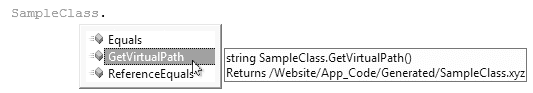

# 生成的数据访问层

没有多少开发人员愿意碰数据访问层。大多数开发人员更喜欢坚持使用他们最喜欢的语言，例如 C#，并避免使用他们很少使用的语言，例如 T-SQL。

这是可以理解的。开发人员使用一种语言越多，他建立的专业知识和信心水平就越高。因此，如果你足够幸运，团队中有一位精通 T-SQL 的熟练数据库开发人员，你肯定会尽可能多地利用他的技能。

然而，这类程序员是稀缺的。为应对这种情况，你可以寻找生成数据访问层的方法，从而大大减少你不得不离开首选语言 C# 所需的时间。

本章涵盖以下内容：
*   代码生成
*   SubSonic
*   Blinq


在讨论数据访问层时，常用的术语是 `CRUD`，代表创建（Create）、读取（Read）、更新（Update）和删除（Delete）。数据访问层大部分是样板代码。如果你认为这意味着对于每个表，你只需要创建对应的 SQL 语句，那么你可以通过扫描数据库并构建执行所有 `CRUD` 任务的类来自动生成此类代码。如果你想添加智能功能，比如关系处理，你可以在代码生成过程中读取外键约束以推断关系，并将面向对象的功能内建到生成的代码中。本章介绍的工具能以一种优雅的方式为我们完成所有这些工作，而不会像类型化数据集那样让人感觉不适。

#### 代码生成

代码生成是一个古老的概念。如果你追溯到软件开发的起点，你会看到源文件如何被编译成汇编代码，当时的开发人员认为编译器生成的代码效率远不如手写的汇编指令。但使用编译器的好处在于，它能以显著缩短的开发周期来实现源代码的意图。如今，我们已经超越了这个初始阶段，深入到了代码生成的领域。我们在集成开发环境（IDE）中用选择的语言编写代码，代码被转换为中间语言（IL），最终由即时编译器将其转换为机器码。在过去几十年里，编译过程不断改进，引入了开发者甚至还未意识到但一直在持续受益的优化。我们已经接纳了代码生成，并且正在寻找新的方法来利用它进一步加速我们的开发周期，同时生成比我们自己开发更高效的代码。

当你使用 `ASP.NET` 时，你已经在利用代码生成：每个页面和用户控件都会为各自的后台代码生成一个分部类到内存中。标记页面上放置的每个控件的变量引用都会被放入这个分部类中，而你则在后台代码文件中定义分部类的其余部分。你可能还记得 `ASP.NET 1.1` 中那个警告你不要直接修改的已生成代码区域。该区域的代码现在被安全地生成到隐藏的分部类中。实现这一点的代码生成归功于随 `ASP.NET 2.0` 引入的构建提供程序。

**注意** 如果你构建的不是网站项目，而是 Web 应用程序项目，那么你仍然在使用旧的 `ASP.NET 1.1` 模型，代码是直接生成到后台代码文件中的。Web 应用程序项目无法利用构建提供程序，因为它需要仅对网站可用的动态编译器。从技术上讲，Web 应用程序项目是一个类库，无法访问此功能。

#### 构建提供程序

构建提供程序是一种代码生成器，它将构建结果放入内存，以便运行时可以访问。Visual Studio 也能够运行构建提供程序，并使生成的代码立即可用，而无需编译项目。构建提供程序为所有常见文件类型（如 `.aspx`、`.ascx`、`.asmx` 等）进行了预配置。在所有网站都继承的基础 `Web.config` 文件中，你会找到一个名为 `buildProviders` 的配置元素，它列出了所有映射的提供程序。特别是，`.aspx` 扩展名被映射到名为 `PageBuildProvider` 的提供程序，而 `.xsd` 被映射到 `XsdBuildProvider`，后者创建类型化数据集。

你可以实现自己的构建提供程序，并将其与你选择的扩展名关联。清单 8-1 展示了如何为所有扩展名为 `.xyz` 的文件映射一个构建提供程序。

### 清单 8-1. 用于 .xyz 文件的构建提供程序

```xml
<buildProviders>
    <add extension=".xyz" type="Chapter08.BuildProviders.XyzBuildProviders" />
</buildProviders>
```

当 `ASP.NET` 编译器遇到扩展名为 `.xyz` 的文件时，它将使用配置的构建提供程序将代码生成到内存中，以便网站中的页面和控件可以使用，同时也提供智能感知支持。图 8-1 显示了生成类的智能感知外观。



### 图 8-1. 生成类的智能感知

`BuildProvider` 类（位于 `System.Web.Compilation` 命名空间中）包含一个名为 `GenerateCode` 的方法，你必须重写此方法才能将生成的代码注入到网站中。清单 8-2 展示了 `GenerateCode` 方法的一个实现。

### 清单 8-2. GenerateCode 方法

```csharp
public override void GenerateCode(AssemblyBuilder assemblyBuilder)
{
    assemblyBuilder.AddCodeCompileUnit(this,
        new CodeSnippetCompileUnit(GetGeneratedCode()));
}
```

包含 `GenerateCode` 方法的示例类名为 `XyzBuildProviders`，它继承自 `BuildProvider` 类。你可能想做的第一个任务是读取源文件的内容。要读取文件，你可以调用返回 `Stream` 的 `OpenStream`，或者返回 `Reader` 的 `OpenReader`。清单 8-3 向你展示了如何将源文件内容作为字符串获取。

### 清单 8-3. GetContents 方法

```csharp
private string GetContents()
{
    TextReader reader = OpenReader();
    string contents = reader.ReadToEnd();
    reader.Close();
    return contents;
}
```

源文件的内容可以很容易地是 `XML` 或你选择的自定义文件格式，你可以在构建生成代码时解析和使用它。在这个例子中，源文件中只有一行，它将用作类的注释。

你可能还想知道源文件的名称。也许对于每个源文件，你想生成一个单独的类，并且源文件的文件名将被重用为生成类的名称。在这种情况下，你可以使用从基类 `BuildProvider` 继承的 `VirtualPath` 属性。对于网站，源文件必须位于 `App_Code` 文件夹中，因此一个典型的值类似于 `/AppCode/SomeFile.xyz`。清单 8-4 展示了如何从该值中提取类名。

### 清单 8-4. GetClassName 方法

```csharp
private string GetClassName()
{
    int startIndex = VirtualPath.LastIndexOf("/") + 1;
    int length = VirtualPath.IndexOf(".") - startIndex;
    string className = VirtualPath.Substring(startIndex, length);
    return className;
}
```

你也可以让类名具有一定含义，但在这里，我们将假设无论目录结构如何，都使用相同的命名空间。最后，清单 8-2 中调用的 `GetGeneratedCode` 方法如清单 8-5 所示。

### 清单 8-5. GetGeneratedCode 方法

```csharp
public string GetGeneratedCode()
{
    string className = GetClassName();
    string contents = GetContents();
    StringBuilder code = new StringBuilder();
    code.AppendLine("namespace Chapter08.Website {");
    code.AppendLine("/// <summary>");
    code.AppendLine("/// " + contents);
    code.AppendLine("/// </summary>");
    code.AppendLine("public partial class " + className + " {");
    code.AppendLine("/// <summary>");
    code.AppendLine("/// Returns " + VirtualPath);
    code.AppendLine("/// </summary>");
    code.AppendLine("public static string GetVirtualPath() {");
    code.AppendLine("return \"" + VirtualPath + "\";");
    code.AppendLine("}\n}\n}");
    return code.ToString();
}
```


