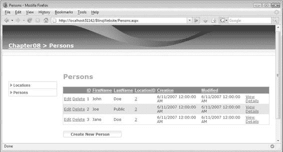
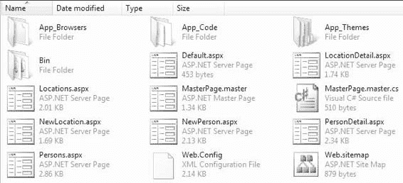

# 8 生成数据访问层

## 常用文件夹补充

像 `SubSonic` 和 `Blinq` 这样的工具，即使不用于整个数据访问层，也可以纯粹利用它们的脚手架功能。你可以将这些工具放在 `Tools` 文件夹中的 `Common` 文件夹中（例如 `D:\Projects\Common\Tools\Code Generators`）。`Blinq` 会被安装到 `Program Files` 文件夹，而 `SubSonic` 的工具和程序集可以解压到一个文件夹中，供活动项目引用。

由于项目引用了 `LINQ`，它应该在运行时生成优化的查询，因为 `LINQ` 已经过精细调整以与 `SQL Server` 协同工作。只要数据库有 `LINQ` 提供程序实现，`LINQ` 也可以与其他数据库一起工作。`LINQ` 中专门查询数据库的部分是 `DLINQ`，而 `XLINQ` 用于查询 `XML`。请参阅 `MSDN` 文档以获取关于 `LINQ` 技术的完整介绍和入门。在这里，我将重点介绍如何使用 `Blinq`，它提供了哪些功能，以及如何利用它来构建真实的应用程序。

首先，你需要从 `ASP.NET` 网站（`http://www.asp.net`）下载 `Blinq`。它位于沙盒部分。它需要 `LINQ` 支持，因此你需要 `LINQ CTP` 或 `Visual Studio 2008` 的预览版（代号 `Orcas`）。一旦安装了 `Blinq`，你就可以运行清单 8-21 中的命令来生成一个 `Blinq` 驱动的网站。

**清单 8-21.** `Blinq` 生成命令
```
"C:\Program Files\Microsoft ASP.NET\Blinq\blinq.exe" /l:cs /server:.\SQLEXPRESS /database:Chapter08 /namespace:Chapter08.BlinqDAL /t:$(BlinqTmpDir) /f
```

`Blinq` 工具可以通过 `/l` 开关生成 `C#` 或 `VB` 的代码。值可以是 `cs` 或 `vb`，默认输出语言是 `C#`。`/server` 和 `/database` 开关指定服务器和数据库，并假设使用受信任的连接。清单 8-21 中的命令连接到本地 `SQL Express` 数据库和 `Chapter08` 数据库。`/namespace` 开关定义了生成代码将放置的命名空间。`/t` 开关指定了所有文件将被创建的目标目录。文件开关 `/f` 会在命令再次运行时强制替换现有文件。

以下示例使用的示例数据库与 `SubSonic` 示例使用的结构相同。它只包含一个 `Person` 表和一个 `Location` 表，它们之间有一个外键引用。运行 `Blinq` 工具创建的文件如图 8-7 所示。

图 8-8 展示了该网站，其特点是一个类似于 `SubSonic` 项目的脚手架系统。

再次说明，你可能不希望最终用户使用此界面，但你可以在开发应用程序时使用它来输入初始样本数据。你希望从这个生成的网站中获取的是放在 `App_Code` 文件夹中的代码，以及提供数据访问的页面中的标记。

页面本身几乎没有代码。所有操作都是通过带有数据绑定控件和 `ObjectDataSource` 引用的标记声明完成的。这些页面在你处理自定义页面时可以作为很好的参考。清单 8-22 显示了用于 `Person` 表的 `ObjectDataSource` 声明。





**图 8-7.** `Blinq` 生成的文件

**图 8-8.** `Blinq` 生成的网站

**清单 8-22.** 用于 `Person` 的 `ObjectDataSource`
```
<asp:ObjectDataSource ID="PersonsDataSource" runat="server"
    TypeName="Chapter08.BlinqDAL.Person"
    DataObjectTypeName="Chapter08.BlinqDAL.Person"
    OldValuesParameterFormatString="original_{0}"
    ConflictDetection="CompareAllValues"
    SelectMethod="GetPerson"
    InsertMethod="Insert"
    UpdateMethod="Update"
    DeleteMethod="Delete"
    EnableCaching="True">
    <SelectParameters>
        <asp:QueryStringParameter QueryStringField="ID"
            Name="ID"
            ConvertEmptyStringToNull="False">
        </asp:QueryStringParameter>
    </SelectParameters>
</asp:ObjectDataSource>
```

`Blinq` 在 `Chapter08.BlinqDAL` 命名空间中创建的 `Person` 类包括 `GetPerson`、`Insert`、`Update` 和 `Delete` 方法。用于查询数据库中单个记录的 `ID` 值被设置为从查询字符串中提取。

`Blinq` 生成的代码放置在网站的 `App_Code` 文件夹中的两个源文件 `Chapter08.cs` 和 `StaticMethods.cs` 中。第一个源文件的名称来自数据库的名称。你可以将这些文件提取到一个类库中，以便从中心点作为依赖项重用它们。`Blinq` 如此有趣的原因在于它用于处理数据的代码是多么简单和切中要害。清单 8-23 显示了 `Person` 类中的 `GetPerson` 方法。

**清单 8-23.** `GetPerson` 方法
```
public static Person GetPerson(Int64 ID) {
    Chapter08 db = Chapter08.CreateDataContext();
    return db.Persons.Where(x=>x.ID == ID).FirstOrDefault();
}
```

查询只有一行。另一端没有存储过程。`LINQ` 系统创建所有必要的 `SQL`，并使用它来获取数据并填充 `Person` 对象。

就这样！`LINQ` 查询简单地将 `ID` 列与传入该方法的 `ID` 值进行匹配。另一个方法 `GetPersonsByLocation` 稍微复杂一些，因为它处理 `Person` 和 `Location` 表之间的关系。如清单 8-24 所示。

**清单 8-24.** `GetPersonsByLocation` 方法
```
public static IQueryable<Person> GetPersonsByLocation(Int64 ID) {
    Chapter08 db = Chapter08.CreateDataContext();
    return db.Locations.Where(x=>x.ID == ID).SelectMany(x=>x.Persons);
}
```

`GetPersonsByLocation` 查询获取一个 `Location` 的 `ID`，然后从中选择多个 `Person` 记录。正如你所看到的，这里发生了一些查询链式调用。随着你在工作中越来越多地使用 `LINQ`，这将成为一种熟悉的编码风格。一个查询的结果可以通过另一个查询进行传递，以过滤最终结果。虽然你可能认为这个查询效率低下，但你会惊喜地发现，`LINQ` 运行时环境的内部机制处理了一些优化，从而加快了你的查询速度，同时让你编写的代码对你来说更具可读性。

在第 10 章中，我将通过一系列例子更深入地探讨 `LINQ`，这些例子将更详细地解释这里发生的事情。

#### 总结

在本章中，你了解了如何使用构建提供程序以及几个强大的实用程序来生成代码，这些实用程序会生成新的源文件。你现在应该已经了解了如何充分利用自动生成的数据访问层，节省通常编写所有代码所需的时间，同时仍然保留通过模板和部分类扩展生成代码的能力。

