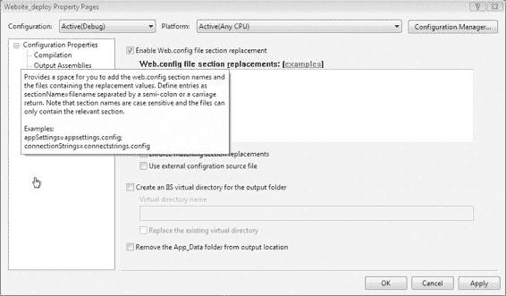
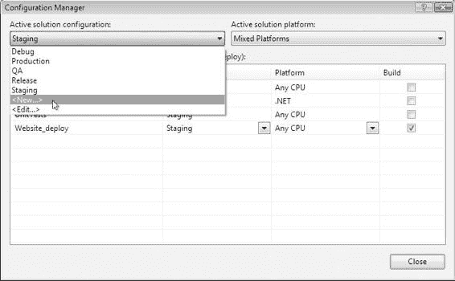
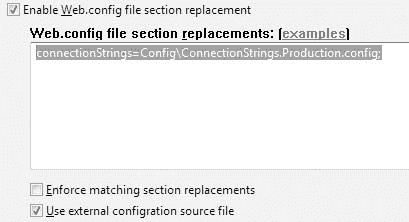

# 第 9 章 部署

值得注意的是，一些项目文件本身也是 MSBuild 脚本。类库的项目文件就是一个 MSBuild 脚本，你可以在其中列出（Listing 9-2）所示的 `BeforeBuild` 和 `AfterBuild` **目标**（target）中放置**任务**（task）。这些目标最初是被注释掉的，但你可以取消注释。然后，你可以在其中放置任意想要的任务，让它们在构建过程之前或之后运行。

**Listing 9-2.** `BeforeBuild` 和 `AfterBuild` 目标

```xml
<Target Name="BeforeBuild">
    <Message Text="### BeforeBuild ###" Importance="high"></Message>
</Target>
<Target Name="AfterBuild">
    <Message Text="### AfterBuild ###" Importance="high"></Message>
</Target>
```

你还可以使用 `PreBuildEvent` 和 `PostBuildEvent` **属性**，它们的工作方式更像是一系列命令的批处理文件。这些属性默认是空的，但你可以调用命令行。示例（Listing 9-3）运行 MSBuild 实用程序，其参数指定了解决方案目录中的一个脚本。

**Listing 9-3.** `PreBuildEvent` 和 `PostBuildEvent` 属性

```xml
<PropertyGroup>
    <PreBuildEvent>%25windir%25\Microsoft.NET\Framework\v2.0.50727\MSBuild.exe ➥
        "$(SolutionDir)build.proj" /t:PreBuild /p:Configuration=$(ConfigurationName)
    </PreBuildEvent>
    <PostBuildEvent>%25windir%25\Microsoft.NET\Framework\v2.0.50727\MSBuild.exe ➥
        "$(SolutionDir)build.proj" /t:PostBuild /p:Configuration=$(ConfigurationName)
    </PostBuildEvent>
</PropertyGroup>
```

在独立管理各个项目的细节之后，你可以在解决方案级别创建一个构建脚本，该脚本将简单地使用项目文件，调用 `Build` **目标**。

这是通过 `MSBuild` 目标完成的。对于标准的解决方案布局——即解决方案文件位于根文件夹中，项目位于子文件夹中——通常会在根文件夹中放置一个名为 `build.proj` 的文件，用于协调自动化流程。

主要的构建脚本 `build.proj` 将主要处理构建过程，但它也可以清理项目，运行单元测试和其他自动化任务。示例（Listing 9-4）展示了一个脚本，它使用来自 MSBuild Community Tasks 项目的 `Prompt` **任务**，在打印一系列选项后获取用户的响应。这样做使得构建脚本能够与用户进行交互。

**Listing 9-4.** 主构建脚本示例 (`build.proj`)

```xml
<?xml version="1.0" encoding="utf-8"?>
<Project DefaultTargets="Build">
    <PropertyGroup>
        <NoWarn Condition="'$(NoWarn)'!=''">$(NoWarn),</NoWarn>
        <NoWarn>$(NoWarn)MSB4078</NoWarn>
        <Configuration Condition=" '$(Configuration)' == '' ">Release</Configuration>
        <ApplicationName>Chapter09</ApplicationName>
        <ApplicationVersion>v1.0</ApplicationVersion>
        <Interactive Condition="'$(Interactive)' == ''">False</Interactive>
    </PropertyGroup>
    <Import Project="$(MSBuildExtensionsPath)\MSBuildCommunityTasks\ ➥
        MSBuild.Community.Tasks.Targets" />
    <Target Name="Clean">
        <Message Text="Running Clean Target..." Importance="high"></Message>
        <MSBuild Projects="ClassLibrary\ClassLibrary.csproj"
            Targets="Clean" ContinueOnError="false"></MSBuild>
    </Target>
    <Target Name="PreBuild">
        <Message Text="No PreBuild Tasks"></Message>
    </Target>
    <Target Name="Build">
        <Message Text="Running Build Target..." Importance="high"></Message>
        <MSBuild Projects="ClassLibrary\ClassLibrary.csproj"
            Targets="Build" ContinueOnError="false"></MSBuild>
    </Target>
    <Target Name="PostBuild">
        <Message Text="No PostBuild Tasks"></Message>
    </Target>
    <Target Name="RunTests" DependsOnTargets="Build">
        <Message Text="No Tests Tasks"></Message>
    </Target>
    <Target Name="Rebuild" DependsOnTargets="Clean;PreBuild;Build;PostBuild">
        <Message Text="Full Rebuild Successful!" Importance="high"></Message>
    </Target>
    <Target Name="FullBuild"
        DependsOnTargets="Clean;PreBuild;Build;PostBuild;RunTests">
        <Message Text="Full Build Successful!" Importance="high"></Message>
    </Target>
    <Target Name="PromptForTarget" Condition="'$(Interactive)' == 'True'">
        <Message Text=" "></Message>
        <Message Text="1) Clean" Importance="high"></Message>
        <Message Text="2) PreBuild" Importance="high"></Message>
        <Message Text="3) Build" Importance="high"></Message>
        <Message Text="4) PostBuild" Importance="high"></Message>
        <Message Text="5) RunTests" Importance="high"></Message>
        <Message Text="6) Rebuild" Importance="high"></Message>
        <Message Text="7) FullBuild" Importance="high"></Message>
        <Prompt Text=" Enter a target:">
            <Output TaskParameter="UserInput" PropertyName="SelectedTarget"/>
        </Prompt>
        <Message Text="Selected target is $(SelectedTarget)" Importance="high">
        </Message>
        <MSBuild Targets="Clean"
            Projects="build.proj" Condition="'$(SelectedTarget)' == '1'"></MSBuild>
        <MSBuild Targets="PreBuild"
            Projects="build.proj" Condition="'$(SelectedTarget)' == '2'"></MSBuild>
        <MSBuild Targets="Build"
            Projects="build.proj" Condition="'$(SelectedTarget)' == '3'"></MSBuild>
        <MSBuild Targets="PostBuild"
            Projects="build.proj" Condition="'$(SelectedTarget)' == '4'"></MSBuild>
        <MSBuild Targets="RunTests"
            Projects="build.proj" Condition="'$(SelectedTarget)' == '5'"></MSBuild>
        <MSBuild Targets="Rebuild"
            Projects="build.proj" Condition="'$(SelectedTarget)' == '6'"></MSBuild>
        <MSBuild Targets="FullBuild"
            Projects="build.proj" Condition="'$(SelectedTarget)' == '7'"></MSBuild>
    </Target>
</Project>
```

你不能简单地双击一个 MSBuild 脚本来运行它，因此创建一个可以在 Windows 资源管理器中点击的脚本会很有帮助，例如示例（Listing 9-5）所示的 `RunBuild.cmd`。

**Listing 9-5.** `RunBuild.cmd`

```cmd
%windir%\Microsoft.NET\Framework\v2.0.50727\MSBuild.exe build.proj ➥
    /t:PromptForTarget /p:Configuration=Release;Interactive=True
Pause
```

MSBuild 实用程序接受多个参数。具体来说，`/t` 开关指定了一个以分号分隔的**目标**列表，而 `/p` 开关指定了脚本将能使用的一系列**属性**。示例（Listing 9-5）中的命令调用了一个名为 `PromptForTarget` 的目标，并将 `Configuration` 属性设置为 `Release`，将 `Interactive` 属性设置为 `True`。你可以通过在 Visual Studio 命令提示符下运行 `MSBuild \?` 来获取 MSBuild 命令行选项的完整列表。

#### 部署网站

将网站从开发环境移动到服务器可以通过多种方式完成。

最常用的方式一直是 `xcopy` 命令：一个标准的 Windows 命令行实用程序，它有许多开关，让你可以极大地控制复制过程。示例（Listing 9-6）显示了一个简单的命令，它将所有文件从源目录复制到目标目录。如果目标文件夹中已经存在文件，它只会在源文件较新时才替换目标文件。

**Listing 9-6.** 使用 `xcopy`

```cmd
xcopy /E/D/Y "D:\SourceDir" "\\Server1\DestinationDir"
```

虽然使用 `xcopy` 有时可以完成任务，但你可能并不总是想盲目地复制文件。`xcopy` 命令无法确保在每次部署时删除旧文件，也不会为目的地环境调整配置。要处理这些需求，你可以利用 Web 部署项目。

##### 网站部署项目


使用 ASP.NET 2.0 网站模型创建的 Web 应用程序不使用类库那样的项目文件。这个新模型使得许多新功能成为可能，例如页面级编译，但它也取消了我们在.NET 1.1 项目中有的一些功能。没有项目文件，就无法在生成前后自动运行操作，也无法以相同的方式管理引用和资源。`Web.config`文件处理部分细节，但并非全部。在解决方案中管理 ASP.NET 网站有助于管理依赖关系以及与解决方案中其他项目的关系，但最终你需要一种方法来生成网站并为其部署做准备。这正是 Web 部署项目的用武之地。

Web 部署项目是 Visual Studio 的一个扩展，必须作为加载项安装。加载项安装就绪后，你可以在解决方案资源管理器中右键单击一个网站，然后单击**创建 Web 部署项目**选项，这将创建一个新项目，其中包含一个 Visual Studio 可以通过一组向导进行管理的单一`MSBuild`脚本。

### 获取 Web 部署项目的途径

Web 部署项目可以在 ASP.NET 网站(http://www.asp.net)上找到。点击顶部的**下载**链接，找到 Web 部署项目部分。这将带你到可以下载安装程序的页面。



**262** 第 9 章 ■ 部署

##### 自动化配置更改

Web 部署项目最有用的功能是能够根据目标配置修改`Web.config`文件的内容。这是按节进行的。项目文件是一个`MSBuild`脚本，它运行一系列任务，读取你设置的参数。图 9-1 显示了插入这些设置的对话框窗口。

**图 9-1.** *配置节替换* 替换节设置对于每个配置都是唯一的。Visual Studio 中的标准项目最初只有**Debug**和**Release**配置。你可以为你的每个目标环境创建新的配置，例如 QA（质量保证）、Staging（预演）和 Production（生产）。这些独特的环境在连接字符串以及可能的其他设置上肯定有不同的值。

你的替换节的源文件必须存在于正在修改的网站之下。原始的`Web.config`文件不会被更改。更新后的`Web.config`文件副本与网站的所有其他文件一起放置在输出目录中。要创建新配置，你可以从**配置管理器**中选择**新建**选项，如图 9-2 所示。

定义好所有配置后，你可以打开 Web 部署项目的**属性页**。你可以从 Web 部署项目的上下文菜单打开**属性页**。左侧的**部署**选项卡是配置节替换选项所在的位置。对于**Production**配置，你可以在网站中创建一个名为`Config`的文件夹，并在该文件夹中放置一个名为`ConnectionStrings.Production.config`的文件。然后，你可以在**属性页**中勾选复选框以启用配置节替换，并使用清单 9-7 中所示的设置。



第 9 章 ■ 部署 **263**

**图 9-2.** *创建新配置*

**清单 9-7.** *生产环境连接字符串设置*
```
connectionStrings=Config\ConnectionStrings.Production.config;
```
你可以将配置文件放在网站中任何你喜欢的位置。虽然你可以使用任何你喜欢的文件扩展名，但最好使用标准的`.config`扩展名，因为它是一个受保护的扩展名：它被特别阻止，因此 Web 服务器不会将其提供给用户。保存替换节的文件内容应只包含单个节，如清单 9-8 所示。

**清单 9-8.** *ConnectionStrings.Production.config*
```xml
<?xml version="1.0"?>
<connectionStrings>
  <add name="chpt09" connectionString="Data Source=ProductionDB\SQL2005;
       Initial Catalog=Chapter09;Integrated Security=True"
       providerName="System.Data.SqlClient" />
</connectionStrings>
```
当 Web 部署项目使用**Production**配置编译时，它将使用清单 9-8 中的内容替换`connectionStrings`节。构建完成后，你可以通过查看 Web 部署项目目录下的**Production**文件夹来确认它已被替换。它会像典型项目一样为每个配置创建一个文件夹。



**264** 第 9 章 ■ 部署

另一个有用的选项是`configSource`属性，这是所有.NET 应用程序配置文件的一个功能，它允许你引用外部文件来获取节的内容。

这可以通过勾选文本框下方的第二个选项自动完成，如图 9-3 所示。

**图 9-3.** *使用外部配置源文件* 将连接字符串设置放在`Web.config`文件之外的一个单独文件中，对于生产环境，可以让你安全地隔离连接字符串，这样你每次部署时都可以在旧副本上放置一个新的`Web.config`文件，而不会覆盖外部文件。这样做可以让你锁定`Config`文件夹，使得只有有限的用户组可以读取和修改这些文件。你可以给予运行网站工作进程的用户（通常是**Network Service**）读取配置文件的权限，同时允许本地管理员修改这些文件。

##### 构建后部署

Web 部署项目的一个缺点是，每次你想用调整后的配置创建新部署时都必须重新构建。将应用程序从 QA 移到预演，最后移到生产环境，需要为每个环境构建一次。更好的方法是构建一次，将文件放入一个放置位置，然后从那里生成你的环境特定输出。幸运的是，处理配置节替换的任务可以在 Web 部署项目之外使用，跳过每次都需要执行的构建过程。

你想要用于构建后部署的任务称为`ReplaceConfigSections`。它是一个自定义的`MSBuild`任务，包含在 Web 部署项目的程序集中，位于一个名为`Microsoft.WebDeployment.Tasks.dll`的程序集中。你可以创建一个自定义的`MSBuild`脚本，并使用`UsingTask`指令包含此自定义任务。一个简单的示例如清单 9-9 所示。这个例子看起来非常像 Web 部署项目的项目文件内容。

**清单 9-9.** *构建后配置节替换*
```xml
<Project DefaultTargets="Build">
  <UsingTask
    TaskName="ReplaceConfigSections"
    AssemblyFile="$(MSBuildExtensionsPath)\Microsoft\WebDeployment\v8.0\
                  Microsoft.WebDeployment.Tasks.dll"/>
  <PropertyGroup>
    <DeploymentDir>$(MSBuildProjectDirectory)\Website_deploy\$(Configuration)
                   </DeploymentDir>
    <WDTargetDir>$(DeploymentDir)</WDTargetDir>
    <ValidateWebConfigReplacement>false</ValidateWebConfigReplacement>
    <UseExternalWebConfigReplacementFile>false
```


### `列表 9-10.` `多个替换节`

```
</UseExternalWebConfigReplacementFile>

</PropertyGroup>

<ItemGroup Condition=" '$(Configuration)' == 'Release' ">

<WebConfigReplacementFiles Include="Config\ConnectionStrings.Release.config">

<Section>connectionStrings</Section>

</WebConfigReplacementFiles>

</ItemGroup>

<Target Name="Build">

<ReplaceConfigSections

RootPath="$(WDTargetDir)"

WebConfigReplacementFiles="@(WebConfigReplacementFiles)"

UseExternalWebConfigReplacementFile="$(UseExternalWebConfigReplacementFile)"

ValidateSectionElements="$(ValidateWebConfigReplacement)"

/>

</Target>

</Project>
```

`列表 9-9`定义了一个替换，用于`Release`配置中的`connectionStrings`节。属性`RootPath`、`WebConfigReplacementsFiles`、`UseExternalWebConfigReplacementFile`和`ValidateSectionElements`都由`PropertyGroup`和`ItemGroup`元素设置。`WebConfigReplacementsFiles`属性是一个项目集合。此示例只定义了一个节，但可以通过简单地复制现有的`ItemGroup`定义来向该集合添加更多，如`列表 9-10`所示。

```
<ItemGroup Condition=" '$(Configuration)' == 'Release' ">

<WebConfigReplacementFiles Include="Config\AppSettings.Release.config">

<Section>appSettings</Section>

</WebConfigReplacementFiles>

<WebConfigReplacementFiles Include="Config\ConnectionStrings.Release.config">

<Section>connectionStrings</Section>

</WebConfigReplacementFiles>

<WebConfigReplacementFiles Include="Config\Compilation.Release.config">

<Section>compilation</Section>

</WebConfigReplacementFiles>

</ItemGroup>
```

为了管理这些预配置部署文件的创建，您可以创建一个名为`deploy`的第二个 MSBuild 脚本来处理这些`PostBuild`任务。您可能希望将编译工作留给`build.proj`脚本，而部署工作由另一个名为`deploy.proj`的脚本处理。当项目的输出准备好时，部署脚本将使用构建脚本确保已编译`Release`版本。然后，它将该构建的输出复制到 Web 部署项目可以使用替换节设置调整`Web.config`的位置。`列表 9-11`中的完整脚本处理这些任务。

### `列表 9-11.` `deploy.proj`

```
<Project DefaultTargets="Build"

>

<UsingTask

TaskName="ReplaceConfigSections"

AssemblyFile="$(MSBuildExtensionsPath)\Microsoft\WebDeployment\v8.0\ ➥

Microsoft.WebDeployment.Tasks.dll"/>

<Import Project="$(MSBuildExtensionsPath)\MSBuildCommunityTasks\ ➥

MSBuild.Community.Tasks.Targets" />

<PropertyGroup>

< Environment Condition=" '$( Environment)' == '' ">QA</ Environment >

<Interactive Condition="'$(Interactive)' == ''">False</Interactive>

<WebDeploymentDir>Website_deploy</WebDeploymentDir>

<SourceDeploymentDir>$(WebDeploymentDir)\Release</SourceDeploymentDir>

<DestinationDeploymentDir>$(MSBuildProjectDirectory)\Deployments\ ➥

$(Environment)</DestinationDeploymentDir>

<!-- 替换设置 -->

<WDTargetDir>$(WebDeploymentDir)\$(Environment)</WDTargetDir>

<ValidateWebConfigReplacement>false</ValidateWebConfigReplacement>

</PropertyGroup>

<PropertyGroup Condition=" '$( Environment)' == '' ">

<UseExternalWebConfigReplacementFile>false</UseExternalWebConfigReplacementFile>

</PropertyGroup>

<PropertyGroup Condition=" '$( Environment)' == 'QA' ">

<UseExternalWebConfigReplacementFile>false</UseExternalWebConfigReplacementFile>

</PropertyGroup>

<PropertyGroup Condition=" '$( Environment)' == 'Staging' ">

<UseExternalWebConfigReplacementFile>false</UseExternalWebConfigReplacementFile>

</PropertyGroup>

<PropertyGroup Condition=" '$( Environment)' == 'Production' ">

<UseExternalWebConfigReplacementFile>true</UseExternalWebConfigReplacementFile>

</PropertyGroup>

<ItemGroup Condition=" '$( Environment)' == 'QA' ">

<WebConfigReplacementFiles Include="Config\ConnectionStrings.QA.config">


```xml
<Project>
  <ItemGroup Condition=" '$(Environment)' == 'Staging' ">
    <WebConfigReplacementFiles Include="Config\ConnectionStrings.Staging.config">
      <Section>connectionStrings</Section>
    </WebConfigReplacementFiles>
  </ItemGroup>

  <ItemGroup Condition=" '$(Environment)' == 'Production' ">
    <WebConfigReplacementFiles Include="Config\ConnectionStrings.Production.config">
      <Section>connectionStrings</Section>
    </WebConfigReplacementFiles>
  </ItemGroup>

  <Target Name="Build" Condition=" !Exists('$(WebDeploymentDir)\Release') ">
    <MSBuild Projects="build.proj" Targets="Build"
             Properties="Configuration=Release"></MSBuild>
  </Target>

  <Target Name="InitDeployment" DependsOnTargets="Build">
    <Delete Files="$(DestinationDeploymentDir)\**\*.*"
            Condition=" Exists('$(DestinationDeploymentDir)') "></Delete>
    <MakeDir Directories="$(DestinationDeploymentDir)"
             Condition=" !Exists('$(DestinationDeploymentDir)') "></MakeDir>
    <CreateItem Include="$(SourceDeploymentDir)\**\*.*">
      <Output ItemName="WebsiteFiles" TaskParameter="Include"/>
    </CreateItem>
    <Copy SourceFiles="@(WebsiteFiles)"
          DestinationFiles="@(WebsiteFiles->'$(DestinationDeploymentDir)\%(RecursiveDir)%(Filename)%(Extension)')"
          SkipUnchangedFiles="true"></Copy>
  </Target>

  <Target Name="PrepDeployment" DependsOnTargets="InitDeployment">
    <ReplaceConfigSections
      RootPath="$(DestinationDeploymentDir)"
      WebConfigReplacementFiles="@(WebConfigReplacementFiles)"
      UseExternalConfigSource="$(UseExternalWebConfigReplacementFile)"
      ValidateSectionElements="$(ValidateWebConfigReplacement)" />
    <Message Text="See Output: $(DestinationDeploymentDir)"></Message>
  </Target>

  <Target Name="PromptForTarget" Condition="'$(Interactive)' == 'True'">
    <Message Text="Select an Environment: "></Message>
    <Message Text="1) QA" Importance="high"></Message>
    <Message Text="2) Staging" Importance="high"></Message>
    <Message Text="3) Production" Importance="high"></Message>
    <Prompt Text=" Enter a target:">
      <Output TaskParameter="UserInput" PropertyName="SelectedTarget"/>
    </Prompt>
    <Message Text="Selected target is $(SelectedTarget)"></Message>
    <MSBuild Targets="PrepDeployment"
             Projects="deploy.proj"
             Properties="Environment=QA"
             Condition="'$(SelectedTarget)' == '1'"></MSBuild>
    <MSBuild Targets="PrepDeployment"
             Projects="deploy.proj"
             Properties="Environment=Staging"
             Condition="'$(SelectedTarget)' == '2'"></MSBuild>
    <MSBuild Targets="PrepDeployment"
             Projects="deploy.proj"
             Properties="Environment=Production"
             Condition="'$(SelectedTarget)' == '3'"></MSBuild>
  </Target>
</Project>
```

清单 9-11 中的脚本支持三种环境：`QA`、`Staging`（预演）和`Production`（生产）。可以通过 `RunDeploy.cmd` 运行它，该命令显示在清单 9-12 中。

### 清单 9-12. RunDeploy.cmd

```
%windir%\Microsoft.NET\Framework\v2.0.50727\MSBuild.exe deploy.proj /t:PromptForTarget /p:Environment=QA;Interactive=True

pause
```

在 Windows 资源管理器中双击 `RunDeploy.cmd` 时，它将运行脚本，显示三种环境选项。你可以输入其中一个，然后它将执行任务来准备该环境。每次选择只是在调用 `PrepDeployment` 目标时为 `Environment` 属性指定了不同的值。

在 `PrepDeployment` 目标运行之前，它会先运行 `InitDeployment`，后者通过 `DependsOnTarget` 属性设置为依赖项。`InitDeployment` 目标将预编译网站的内容复制到所选环境的目标目录。但在它运行之前，它也依赖于 `Build` 目标，而 `Build` 目标仅在预编译部署目录不存在时才运行。这可以防止被多次构建。`Build` 目标调用 `build.proj` 脚本，该脚本显示在清单 9-13 中。

### 清单 9-13. build.proj

```xml
<?xml version="1.0" encoding="utf-8"?>
<Project DefaultTargets="Build">
  <PropertyGroup>
```


```xml
<NoWarn Condition="'$(NoWarn)'!=''">$(NoWarn),</NoWarn>
<NoWarn>$(NoWarn)MSB4078</NoWarn>
<Configuration Condition=" '$(Configuration)' == '' ">Release</Configuration>
<ApplicationName>Chapter09</ApplicationName>
<ApplicationVersion>v1.0</ApplicationVersion>
<Interactive Condition="'$(Interactive)' == ''">False</Interactive>
</PropertyGroup>

<Import Project="$(MSBuildExtensionsPath)\MSBuildCommunityTasks\ ➥
MSBuild.Community.Tasks.Targets" />

<Target Name="Clean">
<Message Text="正在运行清理目标..." Importance="high"></Message>
<MSBuild Projects="ClassLibrary\ClassLibrary.csproj"
Targets="Clean" ContinueOnError="false"></MSBuild>
<MSBuild Projects="UnitTests\UnitTests.csproj"
Targets="Clean" ContinueOnError="false"></MSBuild>
</Target>

<Target Name="PreBuild">
<Message Text="无预生成任务"></Message>
</Target>

<Target Name="Build">
<Message Text="正在运行生成目标..." Importance="high"></Message>
<MSBuild Projects="ClassLibrary\ClassLibrary.csproj"
Targets="Build" ContinueOnError="false"></MSBuild>
<MSBuild Projects="Website_deploy\Website_deploy.wdproj"
Targets="Build" ContinueOnError="false"></MSBuild>
<MSBuild Projects="UnitTests\UnitTests.csproj"
Targets="Build" ContinueOnError="false"></MSBuild>
</Target>

<Target Name="PostBuild">
<Message Text="无后生成任务"></Message>
</Target>

<Target Name="RunTests" DependsOnTargets="Build">
<Message Text="无测试任务"></Message>
</Target>

<Target Name="Rebuild" DependsOnTargets="Clean;PreBuild;Build;PostBuild">
<Message Text="完全重新生成成功！" Importance="high"></Message>
</Target>

<Target Name="FullBuild"
DependsOnTargets="Clean;PreBuild;Build;PostBuild;RunTests">
<Message Text="完整生成成功！" Importance="high"></Message>
</Target>

<Target Name="PromptForTarget" Condition="'$(Interactive)' == 'True'">
<Message Text=" "></Message>
<Message Text="1) 清理" Importance="high"></Message>
<Message Text="2) 预生成" Importance="high"></Message>
<Message Text="3) 生成" Importance="high"></Message>
<Message Text="4) 后生成" Importance="high"></Message>
<Message Text="5) 运行测试" Importance="high"></Message>
<Message Text="6) 重新生成" Importance="high"></Message>
<Message Text="7) 完整生成" Importance="high"></Message>
<Prompt Text=" 请输入目标编号：">
<Output TaskParameter="UserInput" PropertyName="SelectedTarget"/>
</Prompt>
<Message Text="选定的目标是 $(SelectedTarget)"></Message>
<MSBuild Targets="Clean" Projects="build.proj"
Condition="'$(SelectedTarget)' == '1'"></MSBuild>
<MSBuild Targets="PreBuild" Projects="build.proj"
Condition="'$(SelectedTarget)' == '2'"></MSBuild>
<MSBuild Targets="Build" Projects="build.proj"
Condition="'$(SelectedTarget)' == '3'"></MSBuild>
<MSBuild Targets="PostBuild" Projects="build.proj"
Condition="'$(SelectedTarget)' == '4'"></MSBuild>
<MSBuild Targets="RunTests" Projects="build.proj"
Condition="'$(SelectedTarget)' == '5'"></MSBuild>
<MSBuild Targets="Rebuild" Projects="build.proj"
Condition="'$(SelectedTarget)' == '6'"></MSBuild>
<MSBuild Targets="FullBuild" Projects="build.proj"
Condition="'$(SelectedTarget)' == '7'"></MSBuild>
</Target>
</Project>
```

`build.proj` 脚本还包含一个菜单，当使用 `RunBuild.cmd` 脚本时会显示该菜单，如清单 9-14 所示。

`清单 9-14.` `RunBuild.cmd`

```
%windir%\Microsoft.NET\Framework\v2.0.50727\MSBuild.exe build.proj ➥
/t:PromptForTarget /p:Configuration=Release;Interactive=True
pause
```

菜单显示的七个选项是您所期望的典型构建选项。

当 `deploy.proj` 调用主构建脚本时，配置被设置为 `Release`，这将导致 `Build` 目标为 Web 部署项目运行构建，生成输出到 `Release` 文件夹。然后，`deploy.proj` 脚本使用 `Release` 文件夹来准备选定的环境。


最后，可以将准备好的输出目录中的内容打包成一个 zip 文件。相比于处理一大堆散文件，将 zip 文件移动到目标环境会更加容易。这可以通过`Zip`任务完成，它是 MSBuild 社区任务的一部分。首先，你需要在默认的`PropertyGroup`中定义 zip 文件的名称，如**清单 9-15**所示。

**清单 9-15.** 定义`ZipFilename`

```xml
<ZipFilename>$(MSBuildProjectDirectory)\Deployments\$(Configuration).zip</ZipFilename>
```

然后，可以将`Zip`任务添加到`PrepEnvironment`目标的末尾。`Zip`任务的声明如**清单 9-16**所示。

**清单 9-16.** `Zip`声明

```xml
<CreateItem Include="$(DestinationDeploymentDir)\**\*.*">
    <Output ItemName="ZipFiles" TaskParameter="Include"/>
</CreateItem>

<Zip Files="@(ZipFiles)"
     ZipFileName="$(ZipFilename)"
     WorkingDirectory="$(DestinationDeploymentDir)" />
```

最终会得到一个包含网站所有文件的 zip 包，其中包含了修改后的配置文件。如果 Web 服务器位于远程托管设施，你可以将此 zip 文件上传到服务器，并在原地解压，无需任何额外工作。

## 通用文件夹补充

本章中的 MSBuild 脚本在你的项目中具有很高的可复用性。使用它们可以减少你在每个项目上进行的手动工作，并能捕获构建项目所需的详细信息。这些脚本可以放置在你的`Scripts`子文件夹下的`Common`文件夹中，以便在你的项目中引用（`D:\Projects\Common\Scripts\MSBuild`）。

## 数据库部署

随着你的 Web 应用程序的每个版本被推送到各个环境，数据库可能需要进行一些更新，以确保应用程序正常运行。也许某个表中增加了一列，或者定义了一个新的存储过程。如果更新后的网站调用了该存储过程，那么在新的应用程序版本投入使用前，数据库必须先更新。要将数据库结构更新到当前版本，可能只需要创建一些`alter`语句。我将向你展示如何创建这些更新脚本，以及如何以最小的工作量部署它们。

##### 生成变更脚本

SQL Server Management Studio 可以帮助创建变更脚本。一旦你创建了所有表并填充了数据，就可以使用`alter`语句来更改结构。你可以在查询窗口中手动操作，也可以使用 SQL Server Management Studio 进行可视化操作。要修改表，只需在对象资源管理器中右键单击该表，然后从上下文菜单中选择`修改`。表编辑器将显示所有列。进行你的更改，完成后，可以单击`生成更改脚本`按钮。

将一个列从`varchar(25)`调整为`varchar(50)`会生成一个脚本，该脚本将创建一个具有修订后表定义的新临时表，然后将所有数据从现有表复制进去。接着，它会删除现有表，并将临时表重命名为刚刚删除的表的名称。这些步骤都在一个事务内完成，一旦所有步骤成功完成，事务就会提交。对于数据量较大的情况，这个更新操作可能需要一段时间才能完成。与你手动编写`alter`语句相比，这个生成的脚本也相当大。**清单 9-17**所示的脚本可以实现等效的结果。

**清单 9-17.** Alter 脚本

```sql
BEGIN TRANSACTION
GO
ALTER TABLE chpt09_Names
ALTER COLUMN [Name] varchar(50) NOT NULL
GO
COMMIT
```

> **注意：** 修改存储过程并非必要，因为你可以安全地删除并重新创建它们，而不会丢失任何数据。

修改表的过程仍然在事务中执行，但不需要复制表的内容。因此，这个简单的语句可能比生成的脚本运行得快得多。即使你打算手动编写自己的语句，参考生成的脚本也是有帮助的。你可能对表进行的另一项调整是添加索引。**清单 9-17**中更新的表有一个名为`Name`的列。如果该列有一个索引，可能会加快对该表的查询速度。

使用 Management Studio 在编辑表时，通过`管理索引和键`按钮，也可以可视化地添加索引。添加索引后，你可以生成更改脚本，复制创建索引的部分，并在你的自定义脚本中使用它。结果将如**清单 9-18**所示。

**清单 9-18.** 索引创建脚本

```sql
BEGIN TRANSACTION
GO
CREATE NONCLUSTERED INDEX IX_chpt09_Names ON dbo.chpt09_Names (
    Name
) WITH(
    STATISTICS_NORECOMPUTE = OFF, IGNORE_DUP_KEY = OFF,
    ALLOW_ROW_LOCKS = ON, ALLOW_PAGE_LOCKS = ON) ON [PRIMARY]
GO
COMMIT
```

同样，大量的数据会导致创建索引需要一段时间。

在完成一个发布周期时，你可能会将变更脚本添加到你的数据库项目中，作为下一次部署的一部分运行。这些更新脚本可以放置在解决方案的数据库项目中一个名为`Change Scripts`的文件夹里。在每个发布周期开始时，你可能希望将这些脚本中的更改合并到数据库的创建脚本中，并随着新的更改开始使用一组新的更新脚本。这样做将减少从头开始准备新环境的复杂性。如何管理更新脚本取决于你发布版本的频率以及每个发布版本所需更改的程度。

### 使用脚本模板

SQL Server Management Studio 提供了一个模板集合，你可以用来创建脚本以修改现有数据库并执行各种与数据库相关的任务。你可以通过打开模板资源管理器来查看这些模板。双击模板将在新的查询窗口中打开它。要用实际值替换模板中的所有参数，你可以从“查询”菜单中单击`为模板参数指定值`。

##### 自动化数据库更新

如果你有访问权限，变更脚本可以直接在目标数据库上手动运行。你可以直接从你的计算机访问，或者将脚本上传到数据库服务器，通过远程桌面连接到服务器，并使用本地安装的 Management Studio 副本来运行脚本。对于更改集有限且不频繁的更新，你可能会发现这种手动流程就足够了。但如果更改很多，而你又没有完全掌握所有情况，你可能希望由一个精心设计的自动化流程来控制这些更改，该流程已在 QA 和测试环境中成功运行。在生产环境中重复那个受控且经过验证的流程将确保部署更加可靠。

### 使用 MSBuild 和 ExecuteDDL

`ExecuteDDL`任务是 MSBuild 社区任务的一部分，可用于运行脚本以执行数据库更新。脚本创建后，可以从一个 MSBuild 脚本中引用，该脚本将在每个环境中用于更新数据库。

**清单 9-19**展示了`db.proj`的内容，这是一个 MSBuild 脚本，它为四个环境（开发、QA、测试和生产）运行两个更新脚本。

**清单 9-19.** `db.proj`

```xml
<Project DefaultTargets="RunScripts">
    <Import Project="$(MSBuildExtensionsPath)\MSBuildCommunityTasks\..." />
```


# MSBuild 项目配置与数据库部署脚本

## 项目配置

```xml
<PropertyGroup>
  <Environment Condition=" '$(Environment)' == '' ">Development</Environment>
  <Interactive Condition="'$(Interactive)' == ''">False</Interactive>
</PropertyGroup>

<PropertyGroup Condition=" '$(Environment)' == 'Development' ">
  <ConnectionString>Data Source=.\SQLEXPRESS;Initial Catalog=Chapter09;Integrated Security=True</ConnectionString>
</PropertyGroup>

<PropertyGroup Condition=" '$(Environment)' == 'QA' ">
  <ConnectionString>Data Source=QADB\SQL2005;Initial Catalog=Chapter09;Integrated Security=True</ConnectionString>
</PropertyGroup>

<PropertyGroup Condition=" '$(Environment)' == 'Staging' ">
  <ConnectionString>Data Source=StagingDB\SQL2005;Initial Catalog=Chapter09;Integrated Security=True</ConnectionString>
</PropertyGroup>

<PropertyGroup Condition=" '$(Environment)' == 'Production' ">
  <ConnectionString>Data Source=ProductionDB\SQL2005;Initial Catalog=Chapter09;Integrated Security=True</ConnectionString>
</PropertyGroup>
```

## 执行目标

```xml
<Target Name="RunScripts">
  <ExecuteDDL Files="Database\Change Scripts\Update1.sql" ConnectionString="$(ConnectionString)" Condition=" Exists('Database\Change Scripts\Update1.sql') " />
  <ExecuteDDL Files="Database\Change Scripts\Update2.sql" ConnectionString="$(ConnectionString)" Condition=" Exists('Database\Change Scripts\Update2.sql') " />
</Target>
```

## 交互式目标选择

```xml
<Target Name="PromptForTarget" Condition="'$(Interactive)' == 'True'">
  <Message Text="Select an Environment: "></Message>
  <Message Text="1) Development" Importance="high"></Message>
  <Message Text="2) QA" Importance="high"></Message>
  <Message Text="3) Staging" Importance="high"></Message>
  <Message Text="4) Production" Importance="high"></Message>
  <Prompt Text=" Enter a target:">
    <Output TaskParameter="UserInput" PropertyName="SelectedTarget"/>
  </Prompt>
  <Message Text="Selected target is $(SelectedTarget)"></Message>
  <MSBuild Targets="RunScripts" Projects="db.proj" Properties="Environment=Development" Condition="'$(SelectedTarget)' == '1'"></MSBuild>
  <MSBuild Targets="RunScripts" Projects="db.proj" Properties="Environment=QA" Condition="'$(SelectedTarget)' == '2'"></MSBuild>
  <MSBuild Targets="RunScripts" Projects="db.proj" Properties="Environment=Staging" Condition="'$(SelectedTarget)' == '3'"></MSBuild>
  <MSBuild Targets="RunScripts" Projects="db.proj" Properties="Environment=Production" Condition="'$(SelectedTarget)' == '4'"></MSBuild>
</Target>
</Project>
```

要运行 `db.proj` 脚本，可以使用如清单 9-20 所示的 `RunDb.cmd`。

**清单 9-20.** `RunDb.cmd`
```
%windir%\Microsoft.NET\Framework\v2.0.50727\MSBuild.exe db.proj /t:PromptForTarget /p:Configuration=Release;Interactive=True
Pause
```

运行脚本时，它将显示一个菜单，提供四个受支持环境的选择。选择控制 `ConnectionString` 属性的值，该值由 `ExecuteDDL` 任务使用。成功运行此 MSBuild 脚本的结果如图 9-6 所示。

**图 9-6.** 成功运行 `db.proj`

## 使用嵌入式脚本

数据库更新可以直接集成到您的应用程序中，方法是将脚本与其余数据访问层一起嵌入到程序集中。最初使用应用程序时，可以初始化数据库，应用程序的未来版本可以使用嵌入的脚本更新现有的数据库架构。这一切都将是自动且透明的。

升级网站可能就像复制新程序集一样简单，这会自动重启工作进程。数据库更新将自动应用。

此类功能不是 ASP.NET 的自动特性，但可以使用应用程序中可用的构建块来实现。对于以下示例，您将创建一个表来保存名称。初始化脚本将创建一个用于跟踪数据库架构的架构版本表。然后将有一系列更新脚本。每个版本都可以添加额外的更新脚本。

### 初始化数据库

首先，像在数据库项目中通常做的那样创建架构版本表。此表包含一个名称和一个整数作为版本。每个更新成功执行后，版本将设置为下一个版本。清单 9-21 显示了架构版本表的创建脚本。

**清单 9-21.** `chpt09_SchemaVersions.sql`
```sql
IF EXISTS (
  SELECT * FROM sysobjects WHERE type = 'U' AND name = 'chpt09_SchemaVersions') BEGIN
  DROP Table chpt09_SchemaVersions
END
GO
CREATE TABLE [dbo].chpt09_SchemaVersions COLLATE SQL_Latin1_General_CP1_CI_AS NOT NULL,
  [Version] [smallint] NOT NULL,
  CONSTRAINT [PK_chpt09_SchemaVersions] PRIMARY KEY CLUSTERED ([Name] ASC)WITH (PAD_INDEX = OFF, IGNORE_DUP_KEY = OFF) ON [PRIMARY]
) ON [PRIMARY]
GO
```

`Name` 列是主键。对于嵌入式脚本，将只有一个名为 `names` 的架构。此结构可以支持任意数量的其他架构，这些架构都可以独立进行版本控制。将数据库中保存的所有数据分解为不同的命名架构将有助于隔离更新，从而简化更新脚本。

该架构表使用两个存储过程来获取和设置架构版本。清单 9-22 显示了设置命名架构版本的脚本。

**清单 9-22.** `chpt09_SetSchemaVersion.sql`
```sql
IF EXISTS (
  SELECT * FROM sysobjects WHERE type = 'P' AND name = 'chpt09_SetSchemaVersion') BEGIN
  DROP Procedure chpt09_SetSchemaVersion
END
GO
CREATE Procedure dbo.chpt09_SetSchemaVersion
(
  @Name nvarchar(20),
  @Version smallint
)
AS
IF NOT EXISTS (
  SELECT * FROM chpt09_SchemaVersions WHERE Name = @Name
)
BEGIN
  INSERT into chpt09_SchemaVersions ([Name],Version) values (@Name, @Version)
END
ELSE
BEGIN
  UPDATE chpt09_SchemaVersions SET Version = @Version WHERE [Name] = @Name
END
GO
GRANT EXEC ON chpt09_SetSchemaVersion TO PUBLIC
GO
```

设置版本是一个简单的过程，要么插入，要么更新架构版本表。获取架构版本需要一个类似的过程。获取命名架构版本的脚本如清单 9-23 所示。

**清单 9-23.** `chpt09_GetSchemaVersion.sql`
```sql
IF EXISTS (
  SELECT * FROM sysobjects WHERE type = 'P' AND name = 'chpt09_GetSchemaVersion') BEGIN
  DROP Procedure chpt09_GetSchemaVersion
END
GO
CREATE Procedure dbo.chpt09_GetSchemaVersion
(
  @Name nvarchar(20),
  @Version smallint OUTPUT
)
AS
IF EXISTS (
  SELECT * FROM chpt09_SchemaVersions WHERE Name = @Name
)
BEGIN
  SET @Version = (SELECT Version FROM chpt09_SchemaVersions WHERE Name = @Name)
END
ELSE
BEGIN
  SET @Version = 0
END
GO
GRANT EXEC ON chpt09_GetSchemaVersion TO PUBLIC
GO
```

命名架构的版本作为输出参数返回。如果命名架构不存在，则版本默认为 0；否则返回实际值。

### 更新数据库

有了架构表和存储过程后，您可以将脚本作为嵌入式脚本复制到类库中。只需在类库中创建一个名为 `Scripts` 的文件夹。要添加新的 SQL 脚本，您需要将其作为简单的文本文件添加，但可以将扩展名设置为 `.sql`。

当打开`.sql`文件时，它将被视为 SQL 脚本。对于第一个脚本，你需要创建`SchemaVersion`表和两个用于获取和设置版本号的存储过程。定义这些资源的三个脚本内容将按顺序放置在一个名为`init.sql`的脚本中。第一个脚本是建表脚本，它将被修改以移除开头检查模式表是否存在的部分。这里需要采取额外的预防措施：如果该表已存在，并且此初始化脚本被运行，你希望它在尝试创建第一个表时立即失败。

为了确保此脚本被包含在程序集中，你需要通过如图 9-7 所示的属性面板将其“生成操作”设置为“嵌入的资源”。此设置使其作为资源流在程序集中可用。（稍后你将作为资源流加载该脚本。）**图 9-7.** *作为嵌入资源的`init.sql`*

接下来，你将创建一些示例脚本，这些脚本将作为更新运行以测试更新例程的功能。这些脚本将放置在类库的`Scripts`文件夹中，并设置为嵌入资源。它们将被命名为`NamesUpdate.00.sql`、`NamesUpdate.01.sql`和`NamesUpdate.02.sql`。第一个脚本定义`names`表和存储过程。第二个脚本添加三个名字，第三个脚本再添加一个名字。这些脚本可以轻松地调整表列、添加或删除索引，或执行任何你希望它们完成的操作。

关于这些嵌入脚本有两个重要细节。首先，所有命令后都使用`GO`语句分隔。这样做是为了使命令可以作为独立的 SQL 命令，通过企业库中的数据访问块来运行，就像你在前面章节中对存储过程所做的那样。其次，更新脚本应始终将数据库版本设置为下一个数字。这在所有其他命令成功运行后在末尾完成。然而，顺序并非严格必要，因为这些命令将作为一个事务分组执行，因此如果任何命令失败，更新脚本中的所有更改都将被撤销。清单 9-24 展示了`NamesUpdate.01.sql`。

**清单 9-24.** *NamesUpdate.01.sql*

```sql
-- update 1 (add stooges to names table)
EXEC chpt09_SaveName 'Larry'
GO
EXEC chpt09_SaveName 'Moe'
GO
EXEC chpt09_SaveName 'Curly'
GO
-- be sure to update the names schema version
EXEC chpt09_SetSchemaVersion 'names', 2
GO
```

每个名字都使用由第一个更新脚本`NamesUpdate.00.sql`（此处未展示，参见代码下载）创建的`chpt09_SaveName`存储过程添加。你可以看到每个命令如何以`GO`语句结束，最后一个语句将`names`模式的模式版本设置为 2。

### 运行脚本

嵌入在程序集中的脚本现在已准备好使用一个名为`DatabaseManager`的类来加载和运行。该类与更新脚本位于同一个类库中，其默认命名空间设置为`Chapter09`——这是在加载脚本作为资源流时的一个重要细节。文件夹结构也很重要，应如图 9-8 所示。

为了引用脚本，你将使用一个前缀，类似于命名空间。这个前缀在`DatabaseManager`类中定义为常量，如清单 9-25 所示。

**图 9-8.** *类库结构*

**清单 9-25.** *ScriptsPrefix 常量*

```csharp
private const string ScriptsPrefix = "Chapter09.Database.Scripts.";
```

脚本前缀使用默认命名空间和文件夹结构来定义嵌入脚本的路径。现在你已经准备好构建初始化和更新例程，这始于清单 9-26 所示的`InitializeDatabase`方法。

**清单 9-26.** *InitializeDatabase 方法*

### 第 9 章：部署

```csharp
public void InitializeDatabase()
{
    if (IsAutoUpdatesEnabled())
    {
        bool success = true;
        if (!IsInitialized())
        {
            List<string> initCommands = GetSqlCommands(ScriptsPrefix + "init.sql");
            success = RunSqlCommands(initCommands);
        }
        if (success)
        {
            UpdateDatabase();
        }
    }
}
```

`InitializeDatabase` 方法首先检查自动更新功能是否启用。这基于一个名为 `EnableAutoUpdates` 的配置设置。该值必须设置为 `true`，初始化过程才会运行。接下来，将加载并运行名为 `init.sql` 的脚本中的命令。如果脚本执行成功（即未抛出异常），则继续运行清单 9-27 所示的 `UpdateDatabase` 方法。

## 清单 9-27：UpdateDatabase 方法

```csharp
private void UpdateDatabase()
{
    int version = GetSchemaVersion("names");
    if (version == 0)
    {
        List<string> commands = GetSqlCommands(ScriptsPrefix + "NamesUpdate.00.sql");
        if (RunSqlCommands(commands))
        {
            version = GetSchemaVersion("names");
        }
    }
    if (version == 1)
    {
        List<string> commands = GetSqlCommands(ScriptsPrefix + "NamesUpdate.01.sql");
        if (RunSqlCommands(commands))
        {
            version = GetSchemaVersion("names");
        }
    }
    if (version == 2)
    {
        List<string> commands = GetSqlCommands(ScriptsPrefix + "NamesUpdate.02.sql");
        if (RunSqlCommands(commands))
        {
            version = GetSchemaVersion("names");
        }
    }
}
```

`UpdateDatabase` 方法获取 `names` 架构的初始版本。如果未定义，它将默认为 `0`，这将导致运行第一个脚本。第一个脚本完成后，版本应重置为 `1`，然后下一个脚本将运行，遵循相同的模式。如果这是此更新过程的首次运行，所有三个更新脚本都将运行。你可以看到，在方法的末尾再添加一个块来引用新的更新脚本将是轻而易举的事情。

有几个私有方法，`GetSqlCommands` 和 `RunSqlCommands`，使这个更新过程得以运作。第一个方法如清单 9-28 所示。

## 清单 9-28：GetSqlCommands 方法

```csharp
public List<string> GetSqlCommands(string scriptName)
{
    List<string> commands = new List<string>();
    Type type = GetType();
    Stream stream = type.Assembly.GetManifestResourceStream(scriptName);
    if (stream != null)
    {
        StringBuilder sb = new StringBuilder();
        StreamReader sr = new StreamReader(stream);
        string line = null;
        while (sr.Peek() >= 0)
        {
            line = sr.ReadLine();
            if (!CommandDelimiter.Equals(line))
            {
                sb.AppendLine(line);
            }
            else
            {
                commands.Add(sb.ToString());
                sb = new StringBuilder();
            }
        }
        if (!String.IsNullOrEmpty(sb.ToString()))
        {
            commands.Add(sb.ToString());
        }
    }
    return commands;
}
```

`GetSqlCommands` 方法使用 `Assembly` 类上的 `GetManifestResourceStream` 方法加载资源流。然后，它使用 `StreamReader` 逐行迭代，查找命令分隔符，该分隔符被定义为名为 `CommandDelimiter` 的常量。它被设置为标准的 `GO` 语句。每一行不匹配分隔符的内容都被添加到 `StringBuilder` 变量中。当遇到分隔符行时，`StringBuilder` 的值被添加到命令集合中，该集合最终传递给清单 9-29 所示的 `RunSqlCommands` 方法。

## 清单 9-29：RunSqlCommands 方法

```csharp
private bool RunSqlCommands(List<string> commands)
{
    bool success = true;
    using (DbConnection connection = db.CreateConnection())
    {
        connection.Open();
        DbTransaction transaction = connection.BeginTransaction();
        try
        {
            foreach (string command in commands)
            {
                using (DbCommand dbCmd = db.GetSqlStringCommand(command))
                {
                    db.ExecuteNonQuery(dbCmd, transaction);
                }
            }
            transaction.Commit();
        }
        catch (Exception ex)
        {
            success = false;
            Trace.WriteLine(ex.Message);
            // 回滚事务
            transaction.Rollback();
        }
        connection.Close();
    }
    return success;
}
```


在 `RunSqlCommands` 方法中，传入的命令会在事务内逐条执行。如果任何一条命令失败，整个事务都将被回滚，并且指示命令是否成功执行的返回值将被设置为 `false`。

**提示** 在开发用于更新数据库的嵌入式脚本时，你可以利用命令在事务中运行这一事实来防止脚本被提交。当你在更新脚本中添加语句时，可以在末尾放置一条无效语句以确保更改会被回滚；这样，你就可以继续处理脚本，而无需将数据库恢复到执行更新之前的状态。一旦你对更新脚本感到满意，就可以移除这个故意设置的错误。

确保数据库更新在每次应用程序更新时都到位的最后一步是，在每次应用程序启动时调用 `InitializeDatabase` 方法。对于网站，这可以通过在 `Global.asax` 文件中使用 `Application_Start` 方法来完成（参见清单 9-30）。

### 清单 9-30. Application_Start 调用 InitializeDatabase
```csharp
void Application_Start(object sender, EventArgs e)
{
    DatabaseManager dbm = new DatabaseManager();
    dbm.InitializeDatabase();
}
```

现在，每次网站更新时，它都会运行 `InitializeDatabase` 方法，这将确保你的数据库架构是最新的。

##### 自定义配置节

在前面的章节中，你在数据访问层中硬编码了连接字符串名称。如果你继续在数据访问层中硬编码此值，并构建与不同数据集一起工作的模块化组件，你可能会在每个组件中硬编码相同的值，这样你就不必为每个组件维护连接字符串配置。但是，假设你只有一个数据库连接是有问题的。它迫使你将所有数据放在同一个数据库中。

或者，你可以为每个组件使用唯一的连接字符串名称，这将要求你为每个组件维护一个连接字符串。这种方法提供了一些灵活性，但在配置中重复了多个连接字符串。另一种方法是，为每个组件使用指示要使用的连接字符串名称的应用程序设置。本章前面创建的与名称数据库一起工作的类库可以使用名为 `NamesDatabase` 的应用程序设置，该设置与要使用的连接字符串名称相匹配。这需要为每个组件完成。这可能是一种合理的方法。

最后一种方法是创建自定义配置，允许你按自己想要的方式在选择的结构中设置值。这是通过利用现有的 `ConfigurationSectionGroup` 和 `ConfigurationSection` 类来完成的。在第 5 章中，你创建了使用自定义 `ConfigurationSection` 的提供程序。通过提供程序基类，一些额外的工作已为你完成。在这里，你将构建一个自定义配置，手动读取全部内容，并在前面章节创建的 `DatabaseManager` 类中使用它。

你将构建一些类，这些类提供对将用于 `DatabaseManager` 的连接字符串名称的访问。一个类将代表配置组，而另一个将代表节。第三个类将是一个以编程方式加载配置的实用工具。

### 清单 9-31. Chapter09SectionGroup
第一个类是 `Chapter09SectionGroup`，它继承自 `ConfigurationSectionGroup` 并定义了一个属性。
```csharp
using System.Configuration;

namespace Chapter09.Configuration
{
    public class Chapter09SectionGroup : ConfigurationSectionGroup
    {
        [ConfigurationProperty("chapter09Group")]
        public Chapter09Section Chapter09Section
        {
            get
            {
                return (Chapter09Section)Sections["chapter09"];
            }
        }
    }
}
```

名为 `Chapter09Section` 的属性通过访问从基类继承的 `Sections` 属性，返回一个同名的类。

### 清单 9-32. Chapter09Section
`Chapter09Section` 如下所示。
```csharp
using System.Configuration;

namespace Chapter09.Configuration
{
    public class Chapter09Section : ConfigurationSection
    {
        [ConfigurationProperty("connectionStringName", DefaultValue = "chapter09", IsRequired = true), StringValidator(MinLength = 1, MaxLength = 50)]
        public string ConnectionStringName
        {
            get
            {
                return (string) this["connectionStringName"];
            }
            set
            {
                this["connectionStringName"] = value;
            }
        }

        [ConfigurationProperty("enableAutoUpdates", DefaultValue = "True", IsRequired = false)]
        public bool EnableAutoUpdates
        {
            get
            {
                bool enabled;
                bool.TryParse(this["enableAutoUpdates"].ToString(), out enabled);
                return enabled;
            }
            set
            {
                this["enableAutoUpdates"] = value;
            }
        }
    }
}
```

`Chapter09Section` 类访问配置中的 `connectionStringName` 和 `enableAutoUpdates` 属性。访问这些值的属性使用控制属性行为的特性进行装饰。`EnableAutoUpdates` 属性不是必需的，这允许在配置中未指定该值。当未指定时，将使用默认值。`ConnectionStringName` 属性是必需的，如果在配置中未定义该属性时访问它，将导致异常。

### 清单 9-33. Chapter09Configuration
要加载此配置，你将使用一个名为 `Chapter09Configuration` 的实用工具类，如下所示。
```csharp
using System.Configuration;
using System.Web;
using System.Web.Configuration;

namespace Chapter09.Configuration
{
    public class Chapter09Configuration
    {
        public static Chapter09SectionGroup GetConfig()
        {
            System.Configuration.Configuration config;
            HttpContext context = HttpContext.Current;

            if (context != null)
            {
                string path = "~";
                config = WebConfigurationManager.OpenWebConfiguration(path);
            }
            else
            {
                config = ConfigurationManager.OpenExeConfiguration(ConfigurationUserLevel.None);
            }

            Chapter09SectionGroup chapter09Config =
                (Chapter09SectionGroup)config.SectionGroups["chapter09Group"];
            return chapter09Config;
        }
    }
}
```

`Chapter09Configuration` 类有一个静态方法，该方法从 `GetConfig` 方法返回 `Chapter09SectionGroup` 类。此方法适用于网站以及控制台和桌面应用程序等其他应用程序。如你所见，它根据 `HttpContext` 的值使用 `WebConfigurationManager` 或 `ConfigurationManager`，该值在网站内运行方法时定义。配置加载后，它使用 `SectionGroups` 集合返回名为 `chapter09Group` 的组，该组与 `Chapter09SectionGroup` 类对应。为了使这些类与名称对应，有必要在配置文件中配置自定义节。此定义如清单 9-34 所示。

### 清单 9-34. 自定义节定义
```xml
<configSections>
  <sectionGroup name="chapter09Group"
                type="Chapter09.Configuration.Chapter09SectionGroup, Chapter09">
    <section name="chapter09"
             type="Chapter09.Configuration.Chapter09Section, Chapter09"/>
  </sectionGroup>
</configSections>
```

名称和类型由自定义节定义，其中节包含在组中。自定义配置的其余部分如清单 9-35 所示。

### 清单 9-35. 自定义配置
```xml
<chapter09Group>
  <chapter09 connectionStringName="chpt09" enableAutoUpdates="True"/>
</chapter09Group>
```


由于 `enableAutoUpdates` 属性是可选的，如果你想使用默认值（设置为 `True`），可以省略它。现在，你可以根据需要配置任意多个连接字符串，并通过这个自定义配置节指向你选择的那个，同时启用或禁用这个自动更新功能。

对数据库更新过程的一个潜在改进是，为更新过程定义一个独立的连接字符串名称，使其与数据访问层的其余部分分开。更新脚本需要普通 Web 应用程序所不需要的权限，因此，与其为整个应用程序提升权限，不如定义一个具有必要权限的特殊连接。这将提高应用程序的安全性。为了进一步改进，你可以在部署过程中启用这个特殊连接的用户账户，并在完成后将其禁用。这样做将确保无法运行更新，并阻断对拥有提升权限的账户的访问。

#### 总结

在本章中，我介绍了网站和数据库的部署，以及如何利用自定义配置。通过简化部署和配置流程，你可以更轻松地为应用程序推送更多更新，并且由于脚本将人为错误最小化，每次部署的风险也更低。能够及时推送更新将非常有助于适应生产环境的性能需求。本章涵盖的自动化任务也将解放你更多的时间，让你能够专注于性能改进，而不是忙于推送文件这类繁琐工作。

8601Ch10CMP3 8/25/07 1:09 PM Page 289

C H A P T E R 1 0

示例应用程序

现在，你可以将本书中涉及的多个部分组合起来，创建一个灵活且高性能的应用程序。你的目标是构建一个模块化的应用程序，从一个清晰的数据访问层开始，每个业务对象都根据其所在领域的数据以及对象之间的关系明确定义。

本章涵盖以下内容：

- 理解性能和可扩展性
- 创建数据库
- 创建数据访问提供程序
- 管理关系
- 使用自定义配置
- 实现 LINQ 提供程序
- 实现 WCF 提供程序

在之前的所有章节中，创建高性能应用程序的一个隐含原则是：良好的设计和灵活性比过早优化你的应用程序更为重要。除非你有一个成品在实际负载下运行，否则你不会真正知道会在哪里遇到性能问题。而且，负载可能会随着时间的推移以意想不到的方式发生变化。如果你在开发周期中过早地开始优化性能，你可能会将自己锁定在一个无法扩展的方法上。

### 理解性能与可扩展性

区分性能和可扩展性很重要。两者相关，但并非同一回事。随着你的网站使用量越来越大，它将需要处理越来越多的请求，并且需要在不增加每个请求成本的情况下做到这一点。如果你从 1,000 名用户开始，每个请求都在一秒内处理完毕，那么当你达到 100,000 名用户时，你会希望保持这种服务水平。如果你一开始就有一个性能极佳的网站，你可能永远不会有扩展性问题。但是，可能会出现每个请求的成本开始增加的临界点，那时你需要应用本章中的方法，以恢复到让最初那 1,000 名用户满意的服务水平。

在第 6 章中，我提到过，你常常可能成为自己最大的敌人，因为你过于频繁地访问数据库，以至于本质上造成了针对数据库的磁盘读取交通堵塞。

289

8601Ch10CMP3 8/25/07 1:09 PM Page 290

290

C H A P T E R 1 0 ■ 一 个 示 例 应 用 程 序

频繁的读取也会在网络上造成交通堵塞，这会使处理请求的时间加倍甚至三倍。这种高负载场景会导致每个请求的成本急剧增加。对于计算机来说，一秒钟可能漫长无比。而且，当你的网站在正常负载下接收到的许多请求都能在不到一秒的时间内处理完毕时，你可以想象，将缓存超时设置为五秒，即使用户可能看不到性能上的任何变化，也会影响应用程序的可扩展性。你消除了对数据库的调用，同时也节省了处理器上的时钟周期。设置缓存超时是极好的第一步，将使你受益匪浅。

一个典型的网站每天可能收到 5,000 到 100,000 次页面请求。

一天有 86,400 秒，从表 10-1 中你可以看到页面请求通常是如何分布的。

**表 10-1.** 请求之间的间隔时间

| 每日请求数 | 请求间隔时间 |
| :--- | :--- |
| 5,000 | 16.78 秒 |
| 100,000 | 0.86 秒 |
| 500,000 | 0.17 秒 |

表 10-1 是对网站流量的过度简化表示，但它说明了性能和可扩展性之间的区别。当一个网站每天只有 5,000 次点击时，解决可扩展性问题并不重要，特别是当单个请求耗时不到一秒时。如果一个网站每天有 100,000 次点击，请求之间的平均间隔时间降至一秒以下，但请求之间的间隔时间仍然超过半秒。请求之间仍然有一点时间，因此你不会有并发请求。100,000 次点击与 5,000 次点击之间的差异代表了一个巨大的窗口期，我假设大多数网站，尤其是内联网 Web 应用程序，都属于这个范围。而当一个网站达到 500,000 次或更多点击时，可扩展性就成了一个主要问题。当你的 Web 应用程序流量达到这种频率时，你将需要探索如何通过某种方式来分散负载。

##### 并发请求

性能与可扩展性的交汇点出现在并发请求数量开始增加每个请求的成本时。如果当前正在处理十个请求，并且每个请求都锁定了数据库中的一个常用表——哪怕只是片刻——这些请求可能会被延迟，它们的成本也会增加。但如果每个请求都能高效地访问数据库，而不干扰其他请求，你将获得你想要的可扩展性。

你的网站上一个频繁请求的页面可能没有明确地锁定一个表。它可能是在更新过程中间接锁定了一个你没有预料到的索引。我们通常期望索引能提高性能，但有时它们会产生相反的效果。当你遇到并发问题时，你可以咨询你的 DBA 以确定什么资源被锁定了。如果涉及索引，你可能需要使用不同类型的索引或完全删除该索引，这样你的并发问题就会消失。你也可以保留索引，但批量更新它，使其不会发生得如此频繁。

8601Ch10CMP3 8/25/07 1:09 PM Page 291

C H A P T E R 1 0 ■ 一 个 示 例 应 用 程 序

291

■**注意** 越来越多的服务器，甚至个人电脑，都配备了多个处理器。购买配备双核或四核处理器、能处理大量并发请求的新服务器已很常见。应尽可能利用这些强大的新功能，使你的应用程序和用户受益。你还需要确保不会因为将辅助工作卸载到其他服务器（例如处理已提交的订单）而在进程外处理不必要的任务时浪费处理能力。

##### 瓶颈


# 第 10 章：示例应用程序

如果在排查性能瓶颈时，你总是关注那些常见的“嫌疑对象”，可能就会忽略其他真正构成瓶颈、真正制约可扩展性的区域。多年前有一份报告对比了 Linux 上 Apache 网络服务器与 Windows NT 上 IIS 的可扩展性。报告显示，在高负载情况下 IIS 能够处理更多的请求。许多开发者质疑该报告的准确性，因为当时 Apache 是最流行、最高效的网络服务器，而 IIS 则被视为新入局者，且曾饱受各种问题困扰。事实证明，瓶颈与网络服务器关系不大。Apache 的问题根源在于 Linux 内部使用的锁定机制只允许有限数量的并发网络连接进入 Apache 服务器，而 Windows NT 采用线程模型，允许更多并发请求进入 IIS。因此，无论你如何配置 Apache 服务器，都不可能让它比 IIS 更快。因为它根本就不是最薄弱的环节。

同样地，你可能会发现你的网站并非应用程序中最薄弱的环节。问题可能出在数据库，甚至可能是网络。网络设备的质量可能是罪魁祸首，或者服务器之间的网络线缆质量不佳。我曾经有一台电脑，使用了一张 15 美元购买的网卡。我本可以购买 100 美元的网卡，但当时我认为两者标称速度相同，看不出区别。我用了便宜的网卡，大多数时候工作正常，但当我尝试通过网络传输多个大文件时，网卡就失效并丢失了连接。事实证明，更贵的网卡性能更优；因为它有更多缓冲区，能够处理将大量大文件复制到远程计算机的那种负载。那次经历让我明白，有时我可以通过更换一个 15 美元的硬件来加速应用程序，而不是购买一台新的、价值 10,000 美元的服务器，却让真正的瓶颈依然存在。

要找到你的瓶颈，你需要测量系统每个部分的性能。你可能会惊喜地发现，有时最简单的调整就能提升性能。

## 流量激增

表 10-1 中显示的请求平均间隔时间并不能真实反映流量模式。没有任何保证能让发往你网络服务器的请求如此均匀地间隔开。实际上，绝大多数网络流量看起来像一条钟形曲线。如果你的网站主要由邻近时区的人使用（通常情况如此），那么使用 24 小时制来看，你的大部分流量肯定会出现在白天。在美国，当东海岸是早上 6 点时，你网站的流量就会开始增加；当西海岸晚上 10 点过后，流量开始下降。而通常在中午时分，你会看到流量达到峰值，具体取决于你网站提供的内容。像新闻网站这样的站点，在午餐时间人们查看新闻头条时，流量会急剧飙升。

鉴于这些流量激增，你不能假设一个一天总共获得 10 万次点击的网站，在可扩展性成为问题之前，有 0.86 秒的时间来处理每个请求。由于规律性的流量激增或你的某些操作，你的网络服务器可能在一天中的几个关键时间点不堪重负。如果你运营一个资讯类网站，并向数百万读者发送电子邮件通讯，那么在通讯发出后的几小时甚至几天内，你可能会突然迎来一波流量高峰。像 Digg (`www.digg.com`) 和 Slashdot (`http://slashdot.org`) 这样的网站拥有数百万读者，这些读者都被引导至其首页展示的头条新闻。这导致那些被 Digg 和 Slashdot 链接到的、毫无防备的网站，在极短时间内获得巨大的流量。这种效应被称为 ***Slashdot 效应***，以让那些未准备好应对流量激增的网站下线而闻名。最近，Digg 变得极其流行，因此你的网站也可能受到 ***Digg 效应*** 的冲击。你可能只是发布了一篇有趣的博客文章或照片，而足够多的 Digg 用户认为它有价值。这种事情的发生确实毫无预警。

## 应对 Digg 效应

我的网站曾两次被 Slashdot 和 Digg 冲击，通过针对最初的流量激增做出一些调整，我得以安然度过风暴。在这两个案例中，内容都托管在 Apache 网络服务器上，我只是简单地调整了配置，以应对我的中等性能服务器上新增的负载。内容本身已经准备就绪，因为它们被设置为静态内容，Apache 可以直接从内存中提供服务，类似于 ASP.NET 的输出缓存。对于 Apache 网络服务器而言，瓶颈是由我允许创建的、用于处理请求的子进程数量所导致的。对于 IIS 来说，这不是问题，因为 IIS 是完全线程化的，现代的 Apache 2.0 安装也是如此，至少能够根据传入请求数量进行扩展。但是，如果每个请求多次访问数据库，你可能会发现瓶颈并非网络服务器。

这些遭遇流量巨大激增的时刻，需要一个应急响应计划。

我记得 9/11 袭击的那个悲惨日子，当时所有人都拼命寻找他们能找到的任何新闻，想了解正在发生什么。我当时浏览的网站之一是 CNN.com。我看到该网站在当天早些时候还是我们常见的完整版面，首页布满繁忙的链接和广告，后来就只剩下几个链接和一个头条。他们显然在努力应对这股流量激增，这无疑是他们以前从未经历过的。他们成功地保持了网站的在线状态，并将关键新闻传递给了读者。

有些时候，你知道流量会激增。在超级碗期间，NFL 网站承受着巨大的负载。运营该网站的人可以全年为此做准备，通常会为当年的超级碗设立一个专门的网站，在比赛前和比赛期间将所有流量引导至此。当橄榄球迷们一边在电视屏幕上观看比赛，一边从网站上获取最新统计数据时，该网站的流量会非常密集。交互式应用程序会展示球场示意图，并提供比赛的所有细节，持续更新。每次网络应用程序访问服务器，都会获取有关...


球所在的线段、哪方控球以及当前是第几档进攻。这些通常都是基于 Adobe Flash 的应用程序，它们能够访问网页服务器之外的不同来源，并能处理经过优化以降低整体带宽需求的数据流。发送 4KB 的数据流肯定比让用户每更新一次就刷新 50KB 的页面要好得多。通过采用另一种更高效的通信方案来管理数据流，高负载就能得到更有效的管理。

##### 分配流量

流量可以进行分配，这样即使你每天有 50 万次点击，也可以将它们分散到五台服务器上，从而有效地使每台服务器每天处理 10 万次点击。这种网站集群（web farm）方法相当普遍，并得到负载均衡硬件的支持。你甚至可以利用这样一个事实：通过域名系统（DNS），一个主机名可以关联多个 IP 地址。当一个网站的主机名配置了多个 IP 地址时，网络浏览器会循环使用每个 IP 地址。这种技术被称为 `Round Robin DNS`（循环 DNS）。像 `www.cnn.com` 和 `www.microsoft.com` 这样的网站，就为其网站地址配置了多个 IP 地址，以便从负载分配中获益。图 10-1 显示了在 `www.cnn.com` 和 `www.microsoft.com` 上运行 `nslookup` 实用程序的结果。你可以看到这两个网站都有多个 IP 地址。

**图 10-1.** `Round Robin DNS`

由多台服务器组成、连接到一个共同的数据库服务器的网站集群，可以有效地分配处理负载。结合良好的数据缓存策略，网站集群还可以减轻数据库的负载。

除了仅通过 DNS 进行逻辑分配外，你还可以将硬件分布到多个物理网络。你可以在几个主要城市的托管设施中放置服务器，这些设施接入互联网的主要骨干网，这将保证所有用户都能可靠、快速地访问你的网站。我住在密尔沃基，记得 1998 年有几次，在安装新线路时，密尔沃基和芝加哥之间的主干线被切断了。当时，还没有像现在这样通往麦迪逊和明尼阿波利斯等其他地点的冗余线路。我们接到客户的电话，说他们无法访问我们为他们托管的网站，尽管这些网站是在线的，甚至从城市内的不同地点也可以访问。如果这些网站被托管在多个托管设施中，可能只有极小一部分用户无法访问，或者根本不受影响。

##### 分配内容

虽然分配网站流量可以提供访问速度和可靠性，但你也可以通过分配你发布的内容来获得类似的益处。网站上的大量带宽可能用于图像和其他静态媒体。没有理由让所有这些内容都来自同一个网络服务器。你可以将包含所有动态页面的 ASP.NET 网站部署在一台服务器上，而将所有媒体部署在另一台服务器上，或者将媒体分布在多台服务器上。这样，生成动态页面的服务器就能被释放出来，专注于处理个性化内容。

多年来，苹果、微软、`Amazon.com` 和 Facebook 都使用了将媒体分散到庞大网络服务器群上的服务，这使他们能够应对因定期发布新产品和服务而出现的流量高峰。

### 托管在 AKAMAI 上

多年来，主要网站使用的流行内容分发网络一直是 `Akamai` (`www.akamai.com`)。它提供的主要服务一直是图像缓存，尽管后来也扩展到了动态和个性化内容。如果你查看 `images.apple.com`，你会看到在主机名下面，内容是由 `Akamai` 托管的。

将内容分配到单独网站的一个有用之处在于，你可以充分利用 HTTP 提供的传输机制，例如过期头（这是响应内容之前的众多头信息之一）。当你使用输出缓存时，会设置过期头。如果用户在过期时间内返回到该页面，该用户的网络浏览器可能直接从本地浏览器缓存中读取内容。

当大量用户位于使用过期头来保存你网站内容的缓存代理后面时，客户端缓存会得到进一步增强，这样你就不必为每个请求提供服务。像 AOL 这样的大型互联网服务提供商（ISP）曾使用大型代理来减少其网络上的带宽，从而惠及用户并降低成本。在大多数用户使用拨号调制解调器、带宽有限的时候，减少带宽是 AOL 的一个主要关注点。最近，Google 推出了他们的网络加速器服务，本质上是一个缓存大量内容的巨型代理。然而，它无法缓存动态内容，这包括所有未启用输出缓存而生成的 ASP.NET 网站。

如果你的网站有大量的静态内容，比如图像、样式表和 JavaScript，你将从客户端缓存中获益匪浅，尽管这些好处并不是绝对的。事实上，在 ASP.NET 网站上放置此类内容可能会妨碍它获得尽可能多的缓存，因为 ASP.NET 网站上的每一段内容都与构成匿名和认证会话的 Cookie 相关联。缓存代理将不得不假设，用户从你网站拉取的、带有 Cookie 的静态内容对该用户来说必须是唯一的。这样，代理就不会为你网站每个页面使用的、用于所有共享代理后面用户的那个 35KB 的页头图形进行缓存。你可以做的是，将你的静态内容放置到一个未配置为 ASP.NET 网站的子域上，这样就完全不涉及 Cookie。你需要确保，如果你的主网站运行在 `www.acme.com`，而你的图片运行在 `images.acme.com`，你的 Cookie 不要被笼统地设置为来自 `acme.com`，否则会导致 Cookie 与图片相关联。

当你的静态内容符合大多数代理遵循的标准后，你将开始通过利用你直接控制范围之外的资源，真正从内容分发中受益。然而，你需要小心处理静态内容。我从一位 Yahoo!开发者的演讲中了解到代理在处理 Cookie 时遇到的问题，他解释说，他们对静态图片采用一次性使用策略。图片发布后就不能更改。相反，他们必须将更新后的图片发布到一个新的 URL，并将他们的页面指向它。这种方法旨在确保无论客户端缓存多么激进，他们的用户都能获得正确的图片。对于再次成为现代 Web 应用关键部分的 JavaScript，也可以采用同样的方法。

### 使用静态文件开发


在开发过程中为静态文件重命名并不是一个现实的选项。我倾向于在脚本引用末尾添加一个唯一的查询字符串（`script.js?20070707`），以确保当它被部署到测试环境的暂存服务器时，质量保证团队能够获取到最新版本的脚本。这省去了我需要对不断变化的文件名进行版本控制的麻烦，同时也使应用程序与最新版本保持一致。当网站发布给用户时，我可以重命名脚本文件，加入一个任意的唯一版本号，以确保在新网站上线当天，用户不会使用到旧版本的脚本。我发现对于样式表，有时也有必要这样做，尤其是在 Internet Explorer 中，它非常不情愿替换其本地缓存的项目。

## 分布式服务

你还可以将网站的动态内容拆分到多个子域名中。CNN.com 可以将其网站拆分为多个子域名，例如 `weather.cnn.com`、`politics.cnn.com`、`entertainment.cnn.com` 和 `sports.cnn.com`。Google 已经将其服务拆分到诸如 `maps.google.com`、`mail.google.com` 和 `news.google.com` 等站点。通过将每个服务设置为以更独立的方式运行，你将获得在单一庞大网站中无法实现的灵活性。每个子域名都将专用于特定的服务。

将服务拆分到不同的服务器上后，你将能够独立管理每个网站。如果负责地图网站的开发团队准备好发布新版本，该团队可以这样做，而无需担心它会如何影响邮件和新闻网站（因为它们与地图网站是解耦的）。

Google 的邮件和新闻网站可能拥有自己的服务器和发布计划，它们之间的依赖性极低。然后，每个网站可以通过使用其单点登录功能作为一个整体运作，该功能统一了所有 Google 网站，很像你可以使用 `ASP.NET Membership Provider` 为你自己的网站所做的那样。

如果你能将你的网站拆分成多个部分，并将它们分布在多个服务器上，同时分解开发和发布计划，那么你就可以将一个笨重的网站塑造成多个从技术和项目管理角度都更易于管理的网站。随着某项服务的流量增加，你可以向承载该服务的 Web 集群中添加更多 Web 服务器以提升整体性能。你的服务也可以跨服务器重叠。表 10-2 展示了一个为大型公司服务、跨多个子域名拆分的企业内部网站。这些服务按人力资源（HR）、工时表（TS）、应付账款（A/P）、应收账款（A/R）和合同（C）分组。

**表 10-2.** *重叠服务*

| **服务器** | **HR** | **TS** | **A/P** | **A/R** | **C** |
| :--- | :---: | :---: | :---: | :---: | :---: |
| Web01 | X | | | | X |
| Web02 | | X | | | X |
| Web03 | | | X | | |
| Web04 | | | | X | |
| Web05 | X | | X | | |
| Web06 | | X | | X | |
| Web07 | X | | | X | |
| Web08 | | X | X | | |
| Web09 | X | X | | | |
| Web10 | | | X | | X |

Web 集群中有十台服务器，服务可以分布在它们中的每一台上。然而，为了降低维护成本，服务只被放置在足够多的服务器上以提供所需的服务水平。那些流量大得多且需要更多资源的应用程序，例如 A/P 和 A/R，各自被放置在五台服务器上。这些服务也分布在不同的服务器上，因此没有 A/P 服务托管在 A/R 服务器上。与此同时，使用较少的应用程序，如合同、人力资源和工时表，则分散在十台服务器上以确保均匀分布。对这十台服务器的流量可以通过 `Round Robin DNS` 或负载均衡路由器来管理。

## 分布式后端

上一节的方法拆分了前端流量，但由于瓶颈通常在数据库，你需要考虑拆分各种数据分组，以便运行多个数据库服务器。对于上一节的企业内部网示例，拆分可以轻松地沿着五项服务进行：人力资源、工时表、应付账款、应收账款和合同。最初，当你着手创建分布式后端时，你可以在物理分布数据库之前很久就先进行逻辑规划。`SQL Server` 可以采用单一逻辑数据库，其中每个表和存储过程都经过精心管理，以确保它们不会随时间推移而变得相互依赖；或者你可以在同一物理服务器上运行多个逻辑数据库。之后，随着公司发展到单一物理服务器不够用时，你可以将一个或多个数据库移动到第二台服务器上，以实现后端的物理分布。表 10-3 显示了一个拥有单一数据库服务器的小型公司的初始配置。

**表 10-3.** *小型公司配置*

| **主机名** | **数据库名称** | **服务** | **数据库** |
| :--- | :--- | :--- | :--- |
| `hrdb.acme.com` | HR | Human Resources | `DB1` |
| `tsdb.acme.com` | TS | Timesheets | `DB1` |
| `apdb.acme.com` | AP | Accounts Payable | `DB1` |
| `ardb.acme.com` | AR | Accounts Receivable | `DB1` |
| `contactsdb.acme.com` | Contracts | Contracts | `DB1` |

表 10-3 显示了处理企业内部网站所有服务的五个数据库的配置。一家小型公司只需要一个数据库，因此每个主机名都指向 `DB1` 数据库，其内部 IP 地址可能是 `10.10.1.101`。每个主机名都指向该 IP 地址。稍后，当数据库被分布到独立的物理服务器时，数据将被迁移，DNS 记录将被更新，而应用程序配置只要使用了这些主机名配置，就保持不变。

清单 10-1 显示了 `AP` 数据库的连接字符串。

**清单 10-1.** *AP 数据库连接字符串*
`Data Source=apdb.acme.com;Initial Catalog=AP;Integrated Security=True`

当公司成长并且应用程序性能需要提升时，你可以将负载最大的数据库移动到新的数据库服务器上，这台服务器的硬件性能可能比公司规模较小、预算较少时创建的初始数据库服务器强大得多。现在，你可能不再只是基本的 `RAID` 和双处理器服务器，而是升级到配备四处理器服务器的 `SAN`，它可以处理你排名前两位的数据库。这个更新后的配置如表 10-4 所示。

**表 10-4.** *成长中公司配置*

| **主机名** | **数据库名称** | **服务** | **数据库** |
| :--- | :--- | :--- | :--- |
| `hrdb.acme.com` | HR | Human Resources | `DB1` |
| `tsdb.acme.com` | TS | Timesheets | `DB1` |
| `apdb.acme.com` | AP | Accounts Payable | `DB2` |
| `ardb.acme.com` | AR | Accounts Receivable | `DB2` |
| `contactsdb.acme.com` | Contracts | Contracts | `DB1` |

在 A/P 和 A/R 服务的数据库被移动后，`apdb.acme.com` 和 `ardb.acme.com` 的 DNS 记录可以指向新服务器的 IP 地址 `10.10.1.102`。更改为新 IP 不会立即生效，因为 `DNS` 记录通常有一个 30 分钟或一小时的“生存时间”设置。要使更改立即生效，你需要在应用程序服务器上清除 `DNS` 缓存，强制它们获取最新的 `DNS` 信息，并开始将正确的请求路由到相应的数据库。在过渡期间的一段时间内，你可能希望将 A/P 和 A/R 数据库设置为`只读`，并在迁移后让它们在线运行一段时间。

## 可扩展性规划


本章至此介绍的所有建议，意味着当您开始遇到成长性痛点时，有多个选项可供选择。不幸的是，在了解如何提高应用程序的可扩展性与实际能够做到之间，存在着巨大的鸿沟。尽管您肯定不希望立即着手让自己的小网站能支撑 10 亿用户，但您也不应忽视您的软件应具备足够的灵活性，以适应不断变化的需求。

## 构建灵活的 Web 应用程序

通读本书，您已经深入研究了 `ASP.NET` 环境中协助我们构建快速网站的技术和特性。现在，您将致力于将这一切整合为一个灵活的 Web 应用程序，它易于构建，也易于适应变化的需求。随着网站负载的增加，软件设计将允许您更换需要新方案的组件，而无需迫使整个系统做出改变。但您需要确保能够以最小的努力起步。如果永远无法获得第一个用户，就永远不可能获得百万用户，因此您将从一些简单的基线需求开始。

### 初步设计考虑因素

首先，您需要将业务对象拆分成若干组，并使用自定义提供程序模型进行管理。每个业务分组都将独立管理，而业务对象之间的关系将通过系统设计来处理。您还将为未来的提供程序创建原型，以确保当需要以多种方式分发应用程序时，您已做好准备，无需进行大量返工。

构建高度可扩展的系统在硬件和时间方面可能成本高昂，而且因为您无法预知应用程序的哪个部分将来需要关注，所以最佳策略是简单地准备好适应，而不是将所有时间和精力投入到一个可能永远不会出现的问题上。让性能问题随着时间的推移自然显现。您可以确保自己已为此做好准备。

> **注意** 最好主动收集影响应用程序的所有指标，从每小时的请求数到系统中每台服务器的内存、磁盘和处理器使用率。当您看到数字发生变化时，应该能够解释这些变化并根据需要做出调整。这些指标应能让您看到趋势，从而能够未雨绸缪，并在必要时采取适当措施。如果网站的访问量具有季节性，例如在特定月份出现更高的流量峰值，您应该使用去年同月的数字，结合您在整个年度中看到的渐进式变化，来预测该流量增长。您的目标应该是让应用程序的容量始终保持在预计使用量之上。

#### 示例应用程序

本章的示例应用程序将是一个 `.NET` 用户组的网站。该网站将展示即将举行的会议信息，包括演讲者和赞助商的详细信息。它还将提供职位列表功能。其中一些项目之间存在关联关系，例如地点将与每个活动、每个职位以及每个赞助商相关联。与地点对象的关联是一种必须管理的依赖关系，例如，如果一个地点同时关联到一个活动和一个职位，那么在删除该地点时，不能连带删除关联的职位。

##### 创建数据库

我们将像前面章节那样创建数据库：通过构建一个数据库项目，其中包含用于定义表、存储过程和约束脚本的脚本。数据库中的对象将如表 10-5 所示。

**表 10-5.** 数据库中的对象

| 表 | 对象 |
| :--- | :--- |
| `dug_Events` | `Event` |
| `dug_Jobs` | `Job` |
| `dug_JobContacts` | `JobContact` |
| `dug_Locations` | `Location` |
| `dug_Speakers` | `Speaker` |
| `dug_Sponsors` | `Sponsor` |


每张表都将共享相同的基本结构：主键被定义为一个名为 `ID` 的 `bigint` 类型字段，以及名为 `Created` 和 `Modified` 的 `DateTime` 值字段，这些字段会在记录创建和更新时自动设置。主键被设置为一个标识值，在创建新记录时会自动递增。另一种做法是，主键可以根据表的内容具体命名，例如 `EventID`，这是一种常见的实践。遗憾的是，这种做法使得以通用方式处理所有记录变得困难，而这正是我们下一节将要采用的方式。

## 按日期分区

由于数据库中的每条记录都设置了 `Created` 和 `Modified` 日期，因此可以基于这些值对数据库进行分区。主分区可以包含所有在最近三个月内有修改日期的记录，而其他所有记录则属于另一个分区，该分区实际上充当了数据的归档。最初，这种分区方案可能不是必需的，甚至可能永远都不需要。但对于一个向数据库生成大量记录的高流量网站来说，这种方法将是一个有用的选择。

像 Digg 这样的网站可以使用几个分区。一个可以用于当前周，另一个用于最近三个月，还有一个用于超过最近三个月的所有内容。因为用户通常阅读和互动的是最新内容页面，所以第一个分区的访问频率最高，需要最快的物理数据访问速度。另外两个分区对速度的要求相对较低，但需要大量的存储空间。由于性能要求不高，归档分区的成本将显著降低；而主分区的空间需求被最小化，其成本也将低于一个需要高性能的大规模存储系统。

8601Ch10CMP3 8/25/07 1:09 PM Page 300

**300**

第 10 章 ■ 示例应用程序

## 获取、保存和删除

数据操作方法将遵循第 7 章介绍的获取、保存和删除方法。每个为 `Event` 获取数据的存储过程都将返回相同的列，因此可以为每个存储过程一致地创建一个 `Event` 实例。对于 `Event`，我们将使用以下存储过程：`dug_GetEvent.sql`、`dug_GetAllEvents.sql` 和 `dug_GetEventsByDate.sql`。代码清单 10-2 显示了 `dug_GetEvent.sql`，它返回与给定键匹配的单条记录。

### 代码清单 10-2. dug_GetEvent.sql

```sql
IF EXISTS (SELECT * FROM sysobjects WHERE type = 'P' AND name = 'dug_GetEvent') BEGIN
    DROP Procedure dug_GetEvent
END
GO

CREATE Procedure dbo.dug_GetEvent
(
    @EventID bigint
)
AS
    SELECT
        ID, Title, Description, MeetingDate, Created, Modified
    FROM dug_Events
    WHERE ID = @EventID
GO

GRANT EXEC ON dug_GetEvent TO PUBLIC
GO
```

访问网站的用户大多会对即将发生的事件感兴趣，因此，除了提供访问特定事件或所有事件的功能外，我们还将创建一个名为 `dug_GetEventsByDate` 的存储过程，该过程返回从现在到作为参数传入的目标日期之间的所有事件。使用这个简单的存储过程代表了“设计时性能”而非“优化时性能”，因为这种需求在设计阶段很容易被预见到。显然，如果数据库中最终有 1000 个事件，并且大多数是过去的事件，那么获取所有记录然后只显示未来几个月的事件将会产生不必要的开销。此存储过程如代码清单 10-3 所示。

### 代码清单 10-3. dug_GetEventsByDate.sql

```sql
IF EXISTS (SELECT * FROM sysobjects WHERE type = 'P' AND name = 'dug_GetEvent') BEGIN
    DROP Procedure dug_GetEvent
END
GO

8601Ch10CMP3 8/25/07 1:09 PM Page 301

第 10 章 ■ 示例应用程序

**301**

CREATE Procedure dbo.dug_GetEvent
(
    @EventID bigint
)
AS
    SELECT
        ID, Title, Description, MeetingDate, Created, Modified
    FROM dug_Events
    WHERE ID = @EventID
GO

GRANT EXEC ON dug_GetEvent TO PUBLIC
GO
```


并且由于 `dug_GetEventsByDate` 存储过程使用 `MeetingDate` 列作为过滤条件，如果表变得很大，它就成为索引的合理候选——但当数据库只有少量记录时，这并非绝对必要。你可能可以轻松地多年不用为 `MeetingDate` 列建立索引。请记住，维护索引也会增加数据库的负载，因此，向表中添加的索引越少，给系统带来的额外开销就越小。

保存事件（Event）记录的脚本 `dug_SaveEvent.sql`，接收与事件相关的所有值，以及 `OldEventID`（如果事件已存在于数据库中且正在被更新，则此值会被定义），和一个名为 `EventID` 的输出参数。无论保存过程中执行的是更新还是插入语句，`EventID` 都会被设置。代码清单 10-4 展示了这个保存过程。

**代码清单 10-4.** `dug_SaveEvent.sql`

```
IF EXISTS (SELECT * FROM sysobjects WHERE type = 'P' AND name = 'dug_SaveEvent')
BEGIN
    DROP Procedure dug_SaveEvent
END
GO

CREATE Procedure dbo.dug_SaveEvent
(
    @Title nvarchar(50),
    @Description text,
    @MeetingDate datetime,
    @SpeakerID bigint,
    @SponsorID bigint,
    @LocationID bigint,
    @OldEventID bigint,
    @EventID bigint OUTPUT
)
AS
BEGIN
    IF (@OldEventID < 0)
    BEGIN
        INSERT INTO dug_Events
            (Title, Description, MeetingDate, SpeakerID,
             SponsorID, LocationID, Created, Modified)
        VALUES (
            @Title,
            @Description,
            @MeetingDate,
            @SpeakerID,
            @SponsorID,
            @LocationID,
            GETDATE(),
            GETDATE()
        )

        SELECT @EventID = @@IDENTITY
    END
    ELSE
    BEGIN
        UPDATE dug_Events
        SET
            Title = @Title,
            Description = @Description,
            MeetingDate = @MeetingDate,
            SpeakerID = @SpeakerID,
            SponsorID = @SponsorID,
            LocationID = @LocationID,
            Modified = GETDATE()
        WHERE
            ID = @OldEventID

        SET @EventID = @OldEventID
    END
END
GO

GRANT EXEC ON dug_SaveEvent TO PUBLIC
GO
```

你可以看到，事件记录保存了指向 `Speaker`（演讲者）、`Sponsor`（赞助商）和 `Location`（地点）表的外键引用。除了各自的 ID 值外键引用外，`Speaker`、`Sponsor` 和 `Location` 的具体数据并不作为事件保存过程的一部分被保存。这些数据集合之间的边界得以维持，以确保易于维护。只要 ID 值保持不变（这将保留与事件记录的关系），`Sponsor` 表中存储的值可以被完全更改。

最后，删除过程很简单。只需要提供事件的 ID 值即可删除该记录，如代码清单 10-5 所示。

**代码清单 10-5.** `dug_DeleteEvent.sql`

```
IF EXISTS (SELECT * FROM sysobjects WHERE type = 'P'
    AND name = 'dug_DeleteEvent')
BEGIN
    DROP Procedure dug_DeleteEvent
END
GO

CREATE Procedure dbo.dug_DeleteEvent
(
    @EventID bigint
)
AS
DELETE FROM dug_Events
WHERE ID = @EventID
GO

GRANT EXEC ON dug_DeleteEvent TO PUBLIC
GO
```

`Speaker`、`Sponsor` 和 `Location` 的其他表也以类似方式管理，但由于数据的独特性存在一些差异。稍后我将详细介绍 `Location` 表如何被多个其他表用作依赖项。

#### 创建数据访问提供程序

我们示例网站的模块化设计鼓励我们使用提供程序模型，正如你在第 5 章看到的，这很容易实现。我们将为 .NET 用户组网站使用的每组数据创建一个 SQL 提供程序，供初始网站上线时使用。

之后，随着网站的发展和需要进一步扩展，可以按需创建和部署新的提供程序。我们稍后将创建的一个提供程序使用 LINQ，它可能比使用企业库和 ADO.NET 更快。我们还将创建一个 WCF 提供程序，它将允许我们以分布式方式配置数据库后端，从而分散数据库负载。

##### EventProvider 对象

目前，我们将专注于 `EventProvider`，如代码清单 10-6 所示。


### 清单 10-6. EventProvider.cs

```csharp
namespace DotnetUserGroup.DataAccess.Events
{
    public abstract class EventProvider : ProviderBase, ILocationConsumer
    {
        #region " Provider Methods "
        public abstract Event GetNewEvent();
        public abstract Event GetEvent(DomainKey key);
        public abstract EventCollection GetAllEvents();
        public abstract EventCollection GetEventsByDate(DateTime targetDate);
        public abstract DomainKey SaveEvent(Event evt);
        public abstract void DeleteEvent(Event evt);
        public abstract bool IsUsingLocation(Location location);
        #endregion
    }
}
```

正如第 5 章所述，该提供程序继承自 `ProviderBase` 类，并将所有操作声明为抽象方法。`EventProvider` 主要与 `Event` 对象协同工作，该对象保存了上一节介绍的“获取”存储过程返回的每个数据库值。`Event` 类如清单 10-7 所示。

### 清单 10-7. Event.cs

```csharp
namespace DotnetUserGroup.DataAccess.Events
{
    [DataContract]
    public class Event : DomainObject<Event>
    {
        protected internal Event() { }

        public Event(DataRow row)
        {
            Load(row);
        }

        public Event(IDataReader dr)
        {
            Load(dr);
        }

        public static Event CreateNewEvent()
        {
            Event evt = new Event();
            evt.ID.Value = (long) -1;
            return evt;
        }

        private string _title;
        [DataMember(Name = "Title", Order = 1)]
        public string Title
        {
            get { return _title; }
            set { _title = value; }
        }

        private string _description;
        [DataMember(Name = "Description", Order = 1)]
        public string Description
        {
            get { return _description; }
            set { _description = value; }
        }

        private DateTime _meetingDate = DefaultDateTime;
        [DataMember(Name = "MeetingDate", Order = 1)]
        public DateTime MeetingDate
        {
            get { return _meetingDate; }
            set { _meetingDate = value; }
        }

        private Speaker _speaker;
        [DataMember(Name = "Speaker", Order = 1)]
        public Speaker Speaker
        {
            get
            {
                if (_speaker == null)
                {
                    // lazy load the speaker
                    EventSection section = new EventSection();
                    _speaker = SpeakerManager.GetProvider(section.SpeakerProvider).GetSpeaker(this);
                }
                return _speaker;
            }
            set { _speaker = value; }
        }

        private Sponsor _sponsor;
        [DataMember(Name = "Sponsor", Order = 1)]
        public Sponsor Sponsor
        {
            get
            {
                if (_sponsor == null)
                {
                    // lazy load the sponsor
                    EventSection section = new EventSection();
                    _sponsor = SponsorManager.GetProvider(section.SponsorProvider).GetSponsor(this);
                }
                return _sponsor;
            }
            set { _sponsor = value; }
        }

        private Location _location;
        [DataMember(Name = "Location", Order = 1)]
        public Location Location
        {
            get
            {
                if (_location == null)
                {
                    // lazy load the location
                    EventSection section = new EventSection();
                    _location = LocationManager.GetProvider(section.LocationProvider).GetLocation(this);
                }
                return _location;
            }
            set { _location = value; }
        }
    }
}
```

`Event` 对象通常保存来自数据库的属性。由于加载数据通常是一项繁琐的任务，这项工作已通过第 7 章介绍的 `DomainObject` 更新版本设置为自动进行。

##### 修订后的 DomainObject

用于 .NET 用户组网站的修订版 `DomainObject` 与第 7 章中使用的版本非常相似，但存在一些差异。其中一个显著差异在于主键始终被假定与名为 `ID` 的列对齐。在第 7 章中，`ID` 只是一个数字，而更新后的 `DomainObject` 使用了一种名为 `DomainKey` 的新类型，它可以保存主键值，该值可以是以下类型之一：`Int16`、`Int32`、`Int64` 或 `GUID`。

当从 `DataSet` 或 `IDataReader` 中提取名为 `ID` 的列时，它被视为主键值，并设置在 `DomainKey` 属性上。清单 10-8 展示了 `DomainKey` 类。

### 清单 10-8. DomainKey.cs

```csharp
namespace DotnetUserGroup.DataAccess.Common
{
    [DataContract]
    public class DomainKey : IComparable<DomainKey>
    {
        public DomainKey(object keyValue)
        {
            Value = keyValue;
        }

        private object _keyValue;
        [DataMember(Name = "Value", Order = 1)]
        public object Value
        {
            get { return _keyValue; }
            set
            {
                // check in the order which is most likely
                if (value is Int32 ||
                    value is Guid ||
                    value is Int64 ||
                    value is Int16)
                {
                    _keyValue = value;
                }
                else
                {
                    throw new Exception("Type not supported as a DomainKey: " +
                        value.GetType());
                }
            }
        }

        public static DomainKey Default
        {
            get
            {
                DomainKey defaultKey = new DomainKey(-1);
                return defaultKey;
            }
        }

        #region " Comparison Methods "
        public int CompareTo(DomainKey other)
        {
            return Value.ToString().CompareTo(other.Value.ToString());
        }

        public override int GetHashCode()
        {
            return Value.GetHashCode();
        }

        public override bool Equals(object obj)
        {
            if (obj != null && obj is DomainKey)
            {
                DomainKey other = (DomainKey) obj;
                return Equals(other);
            }
            return false;
        }

        public bool Equals(DomainKey other)
        {
            if (other != null && Value.Equals(other.Value))
            {
                return true;
            }
            return false;
        }
        #endregion
    }
}
```

`DomainKey` 的主要目的是抽象主键的类型。`EventProvider` 的一个实现可以使用 `long` 值（由 SQL 实现使用），而未来的实现可能会使用 `Guid` 值，这在数据分布在多个数据库中且无法正确维护顺序标识键时更为合适。当主键类型在未来的实现中从 `long` 更改为 `Guid` 时，`EventProvider` 无需更改。然而，`Event` 类确实引用了关联的 `Sponsor`、`Speaker` 和 `Location`，这些也设置了使用 `long` 值的主键。如果调整其中一个实现以使用 `Guid` 值，则需要对存储过程和表结构进行一些调整。

`DomainKey` 的另一个特性是实现了 `IComparable<DomainKey>` 接口，这使得键可以在集合中唯一标识，以及其他用途。它还可以通过使用主键值而不是默认比较（后者可能不准确）来唯一标识一条记录与另一条记录。`DomainObject` 对 `ID` 属性使用 `DomainKey` 类型，然后使用 `DomainKey` 提供的比较来比较 `DomainObject` 的实例。`DomainObject` 类使用的比较方法如清单 10-9 所示。

### 清单 10-9. DomainObject 比较方法

```csharp
public int CompareTo(Object obj)
{
    int result = 0;
    DomainObject<T> otherDomainObject = obj as DomainObject<T>;
    if (otherDomainObject != null)
    {
        result = ID.CompareTo(otherDomainObject.ID);
        if (result == 0)
        {
            result = Created.CompareTo(otherDomainObject.Created);
            if (result == 0)
            {
                result = Modified.CompareTo(otherDomainObject.Modified);
            }
        }
    }
    return result;
}

public override int GetHashCode()
{
    return ID.GetHashCode();
}

public override bool Equals(object obj)
{
    DomainObject<T> domainObject = obj as DomainObject<T>;
    if (domainObject != null)
    {
        if (ID.Equals(domainObject.ID))
        {
            return true;
        }
    }
    return false;
}
```


现在，任何继承自 `DomainObject` 的对象都可以与另一个对象进行比较，以判断它们是否是同一对象，例如同一个 `Event` 或 `Speaker`。主键值自动成为比较的一部分，而 `Created` 和 `Modified` 值则是另一部分。一个 `Speaker` 对象的旧副本不会与新副本匹配，而一个 `Speaker` 记录加载到两个 `Speaker` 对象中时，它们则会如预期般匹配。此功能为任何使用本网站数据访问层所定义的约定构建的类自动提供。由于本网站创建的每个表都使用 `ID`、`Created` 和 `Modified` 列，加载过程将按计划填充 `DomainObject` 实例中的相应属性。

同时，其余的数据加载过程与第 7 章所述相同。加载方法可以接受 `DataRow` 或 `IDataReader` 来填充 `DomainObject`。完整代码列表请参阅本章的可下载示例。

## DOMAINOBJECT 与泛型

之所以在修订版的 `DomainObject` 中使用泛型，是为了解决继承与反射结合时出现的问题。在某些情况下，即使数据列与对象属性的名称和类型匹配，也会抛出 `TargetException`。我最终通过 NHibernate 项目的主要开发者 Ayende Rahien 发现，他在处理继承与反射时也遇到了类似问题。我通过将 `DomainObject` 改为泛型类型来绕过 `TargetException` 问题，该泛型要求所有继承类必须是 `DomainObject<T>` 的形式，其中 `T` 是一个 `DomainObject`。当 `Location` 继承自 `DomainObject<Location>` 时，它满足了泛型条件，并克服了反射的问题。

#### 管理关系

回到第 10 章清单 10-7 中的 `Event` 类，你可能已经注意到其中存在表示关系的属性。具体来说，名为 `Speaker`、`Sponsor` 和 `Location` 的属性，其值并非随 `Event` 对象的“获取”存储过程一同载入。对于 `Location` 属性，其实际值最初被留空（null），并在需要时加载。这就是之前介绍过的“延迟加载”技术。当访问 `Location` 属性时，“getter”方法会检查该变量是否已定义，如果没有，它将尝试从 `LocationProvider` 获取值，如清单 10-10 所示。

**清单 10-10.** *Location 属性的 Getter*
```csharp
private Location _location;

[DataMember(Name = "Location",Order = 1)]
public Location Location
{
    get
    {
        if (_location == null)
        {
            // 延迟加载位置
            EventSection section = new EventSection();
            _location = LocationManager.GetProvider(section.LocationProvider).GetLocation(this);
        }
        return _location;
    }
    set { _location = value; }
}
```

当使用 `Location` 属性时，值是通过 `LocationManager` 类加载的，但并非直接使用默认提供程序来获取位置，而是通过 `EventSection` 类来确定要使用的提供程序名称。稍后我们将探讨自定义配置如何辅助管理由不同提供程序处理的对象间关系。

#### 使用位置

用于管理关系的 `EventProvider` 的另一个特性是清单 10-11 所示的 `ILocationConsumer` 接口。

**清单 10-11.** *ILocationConsumer 接口*
```csharp
namespace DotnetUserGroup.DataAccess.Locations
{
    public interface ILocationConsumer
    {
        bool IsUsingLocation(Location location);
    }
}
```

`ILocationConsumer` 接口用于保护 `Location` 在仍在被使用时不被删除。一个 `Sponsor` 可以关联一个 `Location`，一个 `Event` 也可以。如果某个 `Sponsor` 或 `Event` 正在使用一个 `Location`，则该 `Location` 不应被删除。每个与位置有关系的提供程序都实现了 `ILocationConsumer` 接口。


当对某个 `Location` 调用删除方法时，`LocationManager` 会检查是否有任何提供程序实现正在使用该 `Location`。清单 10-12 展示了 `IsLocationInUse` 方法，该方法会检查所有实现了 `ILocationConsumer` 接口的实现。

### 清单 10-12. `IsLocationInUse` 方法

```csharp
public static bool IsLocationInUse(Location location)
{
    foreach (ILocationConsumer locationConsumer in GetLocationConsumers())
    {
        if (locationConsumer.IsUsingLocation(location))
        {
            return true;
        }
    }
    return false;
}
```

`IsLocationInUse` 方法调用了集合中每个实例上的 `IsUsingLocation` 方法，该方法由 `ILocationConsumer` 接口定义。清单 10-13 所示的 `GetLocationConsumers` 方法负责创建这个集合。

### 清单 10-13. `GetLocationConsumers` 方法

```csharp
private static ILocationConsumer[] GetLocationConsumers()
{
    List<ILocationConsumer> locationConsumers =
        new List<ILocationConsumer>();

    foreach (ProviderBase provider in
        AssemblyHelper.GetMatchedProviders(typeof(ILocationConsumer)))
    {
        ILocationConsumer locationConsumer = provider as ILocationConsumer;
        if (locationConsumer != null)
        {
            locationConsumers.Add(locationConsumer);
        }
    }
    return locationConsumers.ToArray();
}
```

`GetLocationConsumers` 方法只是从 `AssemblyHelper` 类获取一个针对 `ILocationConsumer` 接口的所有匹配提供程序的集合。`AssemblyHelper` 类是一个实用工具类，用于发现所有匹配给定类型的已配置提供程序，这样其他接口，例如 `ISpeakerConsumer` 和 `ISponsorConsumer`，也能以相同的方式使用。

清单 10-14 展示了 `AssemblyHelper` 类。

### 清单 10-14. `AssemblyHelper.cs`

```csharp
namespace DotnetUserGroup.DataAccess.Common
{
    public class AssemblyHelper
    {
        public static Type[] GetMatchedTypes(Assembly assembly, Type searchType)
        {
            List<Type> types = new List<Type>();
            Module[] modules = assembly.GetLoadedModules();

            foreach (Module module in modules)
            {
                foreach (Type type in module.GetTypes())
                {
                    if (type.IsClass &&
                        !type.IsAbstract &&
                        searchType.IsAssignableFrom(type))
                    {
                        types.Add(type);
                    }
                }
            }
            return types.ToArray();
        }

        public static ProviderBase[] GetMatchedProviders(Type searchType)
        {
            List<ProviderBase> providers = new List<ProviderBase>();
            DugConfiguration sectionGroup = DugConfiguration.GetConfiguration();

            foreach (ProviderConfigurationSection section in
                sectionGroup.ProviderSections)
            {
                foreach (ProviderSettings settings in section.Providers)
                {
                    // The assembly should be in \bin or GAC
                    Type providerType = Type.GetType(settings.Type, false);
                    Assembly providerAssembly = providerType.Assembly;

                    if (providerType.IsClass &&
                        !providerType.IsAbstract &&
                        searchType.IsAssignableFrom(providerType))
                    {
                        ProviderBase provider =
                            Activator.CreateInstance(providerType) as ProviderBase;
                        if (provider != null)
                        {
                            provider.Initialize(settings.Name, settings.Parameters);
                            providers.Add(provider);
                        }
                    }
                }
            }
            return providers.ToArray();
        }
    }
}
```

`AssemblyHelper` 类不仅仅是返回实现了 `ILocationConsumer` 接口的类型。它还会实例化已配置的提供程序并返回这些实例，以便可以调用 `IsUsingLocation` 方法。所检查的程序集都来自 `DugConfiguration`，这是所有提供程序自定义配置的根。我们在第 5 章和第 9 章简要介绍了自定义配置，接下来将更深入地介绍它们。

#### 自定义配置

将所有组件连接在一起的关键纽带是配置。虽然每个提供程序都设计为独立工作，但它们之间存在需要维护的关系。这些关系的性质仅通过配置即可更改，无需重建和重新部署您的应用程序。例如，您可能希望使用 SQL


### 代码清单 10-15. *SpeakerSection.cs*

```csharp
namespace DotnetUserGroup.DataAccess.Speakers
{
    public class SpeakerSection : ProviderConfigurationSection
    {
        [ConfigurationProperty("providers")]
        public override ProviderSettingsCollection Providers
        {
            get { return (ProviderSettingsCollection)base["providers"]; }
        }

        [StringValidator(MinLength = 1)]
        [ConfigurationProperty("defaultProvider", DefaultValue = "SqlSpeakerProvider")]
        public override string DefaultProvider
        {
            get { return (string)base["defaultProvider"]; }
            set { base["defaultProvider"] = value; }
        }
    }
}
```

最初是为每个提供程序提供了实现，但之后配置了一个新的 `SpeakerProvider` 实现，该实现与一个现有的演讲者数据库集成。所需要的只是包含继承自抽象 `SpeakerProvider` 类的那个类的程序集，以及更新配置以指向新的类和程序集。然后，该更改会通过相应的提供程序节进行配置。

每个自定义提供程序都定义了一个继承自标准类 `ConfigurationSection` 的配置节。代码清单 10-15 展示了 `SpeakerSection` 类。

第 9 章中的自定义配置只是简单地为几个配置值定义了一个占位符。在代码清单 10-15 中，提供程序节定义了一个名为 `Providers` 的属性（它指向 `ProviderSettingsCollection`），以及一个名为 `DefaultProvider` 的属性（它指向当未提供名称时应使用的提供程序）。这应该会让你想起标准的 ASP.NET 提供程序，因为它的实现方式是相同的。

`Providers` 属性使用 `ConfigurationProperty` 特性来指向配置中的相关元素。`ProviderSettingsCollection` 是一个标准类型，它会自动处理 `providers` 节内的配置。代码清单 10-16 展示了一个演讲者节的配置示例。

### 代码清单 10-16. *配置节示例*

```xml
<speakers defaultProvider="SqlSpeakerProvider">
  <providers>
    <clear />
    <add name="SqlSpeakerProvider"
         connectionStringName="dug"
         type="DotnetUserGroup.DataAccess.Speakers.SqlSpeakerProvider, DotnetUserGroup.DataAccess" />
  </providers>
</speakers>
```

你可以看到，由于 `ConfigurationProperty` 特性，`providers` 元素与 `SpeakerSection` 类中的 `Providers` 属性相对应。在 `providers` 节内，你可以 `clear`（清除）、`add`（添加）或 `remove`（移除）提供程序定义，这些定义必须包含 `name`（名称）和 `type`（类型）属性，以及提供程序实现所需的任何其他值。

##### 配置分组

每个提供程序节看起来都差不多，并且每个都将是 `dotnetUserGroup` 元素的子元素，该元素与继承自标准 `ConfigurationSectionGroup` 类的 `DugConfiguration` 类相关联。这个节组包含了所有的配置，并将它们与配置文件的其余部分清晰地隔离开来。这种层次结构有助于保持配置的条理清晰。代码清单 10-17 展示了这个层次结构的一般结构。

### 代码清单 10-17. *配置层次结构*

```xml
<dotnetUserGroup>
  <events />
  <jobs />
  <jobContacts />
  <locations />
  <speakers />
  <sponsors />
</dotnetUserGroup>
```

在代码清单 10-14 所示的 `AssemblyHelper` 类中，`DugConfiguration` 类上的 `ProviderSections` 属性被用来遍历所有的提供程序，以获取与目标类型匹配的实例。代码清单 10-18 展示了 `ProviderSections` 属性是如何定义的。

### 代码清单 10-18. *ProviderSections 属性*

```csharp
private List<ProviderConfigurationSection> _providerSections = null;
public ProviderConfigurationSection[] ProviderSections
{
    get
    {
        if (_providerSections == null)
        {
            _providerSections = new List<ProviderConfigurationSection>();
            _providerSections.Add(EventSection);
            _providerSections.Add(JobContactSection);
            _providerSections.Add(JobSection);
            _providerSections.Add(LocationSection);
```


# ProviderSections 属性中引用的节在 DugConfiguration 中也被定义为属性

`ProviderSections` 属性中引用的节也在 `DugConfiguration` 中被定义为属性，如代码清单 10-19 所示。

## 代码清单 10-19. 用于各节的属性

```csharp
[ConfigurationProperty("events")]
public EventSection EventSection
{
    get {
        return Sections["events"] as EventSection;
    }
}

[ConfigurationProperty("jobContacts")]
public JobContactSection JobContactSection
{
    get {
        return Sections["jobContacts"] as JobContactSection;
    }
}

[ConfigurationProperty("jobs")]
public JobSection JobSection
{
    get {
        return Sections["jobs"] as JobSection;
    }
}

[ConfigurationProperty("locations")]
public LocationSection LocationSection
{
    get {
        return Sections["locations"] as LocationSection;
    }
}

[ConfigurationProperty("speakers")]
public SpeakerSection SpeakerSection
{
    get {
        return Sections["speakers"] as SpeakerSection;
    }
}

[ConfigurationProperty("sponsors")]
public SponsorSection SponsorSection
{
    get {
        return Sections["sponsors"] as SponsorSection;
    }
}
```

你可能已经注意到，`ProviderSections` 属性返回的是一个 `ProviderConfigurationSection` 类的数组，而不是 `ConfigurationSection` 类。这是一个自定义类，它使得将所有提供程序配置节组合在一起成为可能。

`ProviderConfigurationSection` 类定义了两个抽象属性：`Providers` 和 `DefaultProvider`。代码清单 10-15 中显示的 `SpeakerSection` 类继承自该类。这个抽象类的定义见代码清单 10-20。

## 代码清单 10-20. ProviderConfigurationSection.cs

```csharp
namespace DotnetUserGroup.DataAccess.Common
{
    public abstract class ProviderConfigurationSection : ConfigurationSection
    {
        public abstract ProviderSettingsCollection Providers { get; }
        public abstract string DefaultProvider { get; set; }
    }
}
```

##### 声明自定义配置

为了使用自定义配置，必须先声明它。声明自定义配置节必须在配置文件的开头进行，紧接在 `Configuration` 开始元素之后。代码清单 10-21 展示了示例应用程序的节组和子节的声明。

#### 代码清单 10-21. 配置声明

```xml
<configSections>
    <sectionGroup name="dotnetUserGroup"
        type="DotnetUserGroup.DataAccess.Common.DugConfiguration, DotnetUserGroup.DataAccess">
        <section name="events"
            type="DotnetUserGroup.DataAccess.Events.EventSection, DotnetUserGroup.DataAccess" />
        <section name="jobs"
            type="DotnetUserGroup.DataAccess.Jobs.JobSection, DotnetUserGroup.DataAccess" />
        <section name="jobContacts"
            type="DotnetUserGroup.DataAccess.JobContacts.JobContactSection, DotnetUserGroup.DataAccess" />
        <section name="locations"
            type="DotnetUserGroup.DataAccess.Locations.LocationSection, DotnetUserGroup.DataAccess" />
        <section name="speakers"
            type="DotnetUserGroup.DataAccess.Speakers.SpeakerSection, DotnetUserGroup.DataAccess" />
        <section name="sponsors"
            type="DotnetUserGroup.DataAccess.Sponsors.SponsorSection, DotnetUserGroup.DataAccess" />
    </sectionGroup>
</configSections>
```

###### 配置提供程序

构建好自定义配置类并声明了自定义节后，就可以添加提供程序配置了。代码清单 10-22 显示了指向示例应用程序所有标准 SQL 提供程序的提供程序配置。

#### 代码清单 10-22. 提供程序配置

```xml
<dotnetUserGroup>
    <events defaultProvider="SqlEventProvider"
        locationProvider="SqlLocationProvider"
        speakerProvider="SqlSpeakerProvider"
        sponsorProvider="SqlSponsorProvider">
        <providers>
            <clear />
            <add name="SqlEventProvider"
                connectionStringName="dug"
                type="DotnetUserGroup.DataAccess.Events.SqlEventProvider, DotnetUserGroup.DataAccess" />
        </providers>
    </events>
    <jobs defaultProvider="SqlJobProvider">
        <providers>
            <clear />
```


# 第 10 章：一个示例应用程序

在`providers`元素内添加的提供程序设置是必需的，因为与标准的 ASP.NET 提供程序不同，这些设置并未在`Machine.config`文件中预定义（该文件在第 1 章的清单 1-4 中已介绍）。不过，有些值是可选的。当默认值符合你的意图时，每种情况下的`defaultProvider`属性都是可选的。

```xml
<add name="SqlJobProvider"
     connectionStringName="dug"
     type="DotnetUserGroup.DataAccess.Jobs.SqlJobProvider, DotnetUserGroup.DataAccess" />
</providers>
</jobs>

<jobContacts defaultProvider="SqlJobContactProvider">
  <providers>
    <clear />
    <add name="SqlJobContactProvider"
         connectionStringName="dug"
         type="DotnetUserGroup.DataAccess.JobContacts.SqlJobContactProvider, DotnetUserGroup.DataAccess" />
  </providers>
</jobContacts>

<locations defaultProvider="SqlLocationProvider">
  <providers>
    <clear />
    <add name="SqlLocationProvider"
         connectionStringName="dug"
         type="DotnetUserGroup.DataAccess.Locations.SqlLocationProvider, DotnetUserGroup.DataAccess" />
  </providers>
</locations>

<speakers defaultProvider="SqlSpeakerProvider">
  <providers>
    <clear />
    <add name="SqlSpeakerProvider"
         connectionStringName="dug"
         type="DotnetUserGroup.DataAccess.Speakers.SqlSpeakerProvider, DotnetUserGroup.DataAccess" />
  </providers>
</speakers>

<sponsors defaultProvider="SqlSponsorProvider">
  <providers>
    <clear />
    <add name="SqlSponsorProvider"
         connectionStringName="dug"
         type="DotnetUserGroup.DataAccess.Sponsors.SqlSponsorProvider, DotnetUserGroup.DataAccess" />
  </providers>
</sponsors>
</dotnetUserGroup>
```

在清单 10-15 中，`SpeakerSection`定义了`DefaultProvider`属性，其`DefaultValue`属性被设置为`SqlSpeakerProvider`。清单 10-23 所示的`EventSection`类为它在填充`Event`类中的`Speaker`、`Sponsor`和`Location`属性值时应使用的提供程序定义了额外的属性。`ConfigurationProperty`属性的`IsRequired`值被显式设置为`false`，而这恰好是其默认值，因此，如果你想使用默认设置，可以从配置中省略这些附加信息。当你从`EventSection`类访问这些属性时，无论你是否在配置文件中定义了它，它都会返回一个值。

**清单 10-23.** `EventSection.cs`

```csharp
namespace DotnetUserGroup.DataAccess.Events
{
    public class EventSection : ProviderConfigurationSection
    {
        [ConfigurationProperty("providers")]
        public override ProviderSettingsCollection Providers
        {
            get { return (ProviderSettingsCollection)base["providers"]; }
        }

        [StringValidator(MinLength = 1)]
        [ConfigurationProperty("defaultProvider",
            DefaultValue = "SqlEventProvider")]
        public override string DefaultProvider
        {
            get { return (string)base["defaultProvider"]; }
            set { base["defaultProvider"] = value; }
        }

        [StringValidator(MinLength = 1)]
        [ConfigurationProperty("speakerProvider",
            DefaultValue = "SqlSpeakerProvider",
            IsRequired = false)]
        public string SpeakerProvider
        {
            get { return (string)base["speakerProvider"]; }
            set { base["speakerProvider"] = value; }
        }

        [StringValidator(MinLength = 1)]
        [ConfigurationProperty("sponsorProvider",
            DefaultValue = "SqlSponsorProvider",
            IsRequired = false)]
        public string SponsorProvider
        {
            get { return (string)base["sponsorProvider"]; }
            set { base["sponsorProvider"] = value; }
        }

        [StringValidator(MinLength = 1)]
        [ConfigurationProperty("locationProvider",
            DefaultValue = "SqlLocationProvider",
            IsRequired = false)]
        public string LocationProvider
        {
            get { return (string)base["locationProvider"]; }
            set { base["locationProvider"] = value; }
        }
    }
}
```

## 创建新提供程序


当你确定标准 SQL 提供程序不足以满足需求时，可以轻松创建一个新的提供程序。你只需继承抽象的提供程序类，例如 `EventProvider`，并实现所有抽象方法即可。也许一切都如你所愿，只是某个提供程序中存在一些微小的细节问题。你可以为该提供程序创建一个新的实现，并配置你的应用程序来使用它，而让其余的标准提供程序保持不变。因为它们都基于基提供程序类所定义的抽象接口工作，新的实现将与现有提供程序无缝协作。利用本书提供的源代码，你可以将现有类作为起点。

新的提供程序可能与标准 SQL 提供程序非常相似，但存在一些差异，例如添加了标准实现中未包含的数据缓存功能。

.NET 用户组网站的设计方案是在用户控件上使用输出缓存，以减轻数据库负载，而非将缓存职责放入数据访问层。诸如活动列表之类的内容不会频繁更改，因此没有必要总是从提供程序获取最新数据来呈现页面。然而，你可能有不同的需求，可能希望创建一个新的提供程序，将缓存功能纳入数据访问层。你可以创建一个新的 `EventProvider` 实现，命名为 `SqlCachedEventProvider`，并在你的应用程序中使用它。

## 实现一个 LINQ 提供程序

除了使用 ADO.NET 和 Enterprise Library 外，我们现在也可以开始使用 LINQ，它目前还处于 CTP（社区技术预览版）阶段。.NET 3.5 运行时和 Visual Studio 2008 的最终版本计划于 2008 年 2 月发布。当 LINQ 最终发布时，它将改变我们处理数据的方式。LINQ，即语言集成查询，是一种语言扩展，将动态语言特性引入了 C#。它使我们能够使用类似于 SQL 的语法来查询对象。假设你有一个大型的 `Event` 对象集合，并希望获取未来六个月内将在某个特定地点举行的活动列表。LINQ 查询可以直接从 C# 中为你获取该结果，而无需数据库参与。

LINQ 中与数据库交互的部分被称为 DLINQ。你可以使用 DLINQ 查询数据库中的表，或获取存储过程调用的结果。为了实现提供程序的目的，我们将使用 LINQ 创建一个 `EventProvider` 实现，它调用与标准 SQL 实现相同的存储过程。

为了快速开始创建 `EventProvider` 的 LINQ 实现，我使用包含所有表和存储过程的数据库，通过 `Blinq` 生成了一个网站。你会从第 8 章回忆起 `Blinq`。我从生成的网站中提取了所需的部分，并调整了一些细节。例如，我知道每一个从活动表中获取数据的存储过程都返回相同的列集合，但 `Blinq` 为每个存储过程生成了一个独特类来保存结果。我选取了其中一个生成的结果类，并将其重命名为 `EventResult`。清单 10-24 显示了 `EventResult` 类。

**清单 10-24.** `EventResult.cs`

```
namespace DotnetUserGroup.DataAccess.LinqProviders.Data
{
    public class EventResult
    {
        #region " Variables "
        private long _ID;
        private string _Title;
        private string _Description;
        private System.DateTime _MeetingDate;
        private System.DateTime _Created;
        private System.DateTime _Modified;
        #endregion

        #region " Constructors "
        public EventResult()
        {
        }
        #endregion

        #region " Properties "
        [Column(Name = "ID", Storage = "_ID", DBType = "BigInt")]
        [DataObjectField(false, false, false)]
        public long ID
        {
            get
            {
                return this._ID;
            }
            set
            {
                if ((this._ID != value))
```


```
{
    this._ID = value;
    }
}

[Column(Name = "Title", Storage = "_Title", DBType = "NVarChar(50)")]
[DataObjectField(false, false, false, 50)]
public string Title
{
    get
    {
        return this._Title;
    }
    set
    {
        if ((this._Title != value))
        {
            this._Title = value;
        }
    }
}

[Column(Name = "Description", Storage = "_Description", DBType = "Text")]
[DataObjectField(false, false, false, 2147483647)]
public string Description
{
    get
    {
        return this._Description;
    }
    set
    {
        if ((this._Description != value))
        {
            this._Description = value;
        }
    }
}
```

8601Ch10CMP3 8/25/07 1:09 PM Page 324

`324`

`第 10 章 ■ 示例应用`

```
[Column(Name = "MeetingDate", Storage = "_MeetingDate", DBType = "DateTime")]
[DataObjectField(false, false, false)]
public System.DateTime MeetingDate
{
    get
    {
        return this._MeetingDate;
    }
    set
    {
        if ((this._MeetingDate != value))
        {
            this._MeetingDate = value;
        }
    }
}

[Column(Name = "Created", Storage = "_Created", DBType = "DateTime")]
[DataObjectField(false, false, false)]
public System.DateTime Created
{
    get
    {
        return this._Created;
    }
    set
    {
        if ((this._Created != value))
        {
            this._Created = value;
        }
    }
}

[Column(Name = "Modified", Storage = "_Modified", DBType = "DateTime")]
[DataObjectField(false, false, false)]
public System.DateTime Modified
{
    get
    {
        return this._Modified;
    }
    set
    {
        if ((this._Modified != value))
        {
            this._Modified = value;
        }
    }
}
#endregion
}
}
```

8601Ch10CMP3 8/25/07 1:09 PM Page 325

`第 10 章 ■ 示例应用`

`325`

可以看到，`EventResult`类并未继承任何特殊的 LINQ 基类，而是通过特性（Attribute）装饰每个属性，使它们与存储过程的结果相对应。接下来必须定义`DataContext`，它在代码与数据库之间架起桥梁。我提取了 Blinq 生成的代码中与事件相关的方法，并对其进行了调整，创建了如清单 10-25 所示的`DugDataContext`类。

**清单 10-25.** `DugDataContext.cs`

```
namespace DotnetUserGroup.DataAccess.LinqProviders.Data
{
    public class DugDataContext : DataContext
    {
        #region " 构造函数 "

        public DugDataContext(string connection)
            : base(connection)
        {
        }

        public DugDataContext(System.Data.IDbConnection connection)
            : base(connection)
        {
        }

        public DugDataContext(string connection, MappingSource mappingSource)
            : base(connection, mappingSource)
        {
        }

        public DugDataContext(
            IDbConnection connection, MappingSource mappingSource)
            : base(connection, mappingSource)
        {
        }

        #endregion

        #region " 方法 "
```

8601Ch10CMP3 8/25/07 1:09 PM Page 326

`326`

`第 10 章 ■ 示例应用`

```
        [StoredProcedure(Name = "dug_GetEvent")]
        public StoredProcedureResult<EventResult> GetEvent(
            [Parameter(Name = "EventID", DBType = "BigInt")]
            System.Nullable<long> eventID)
        {
            return this.ExecuteStoredProcedure<EventResult>(
                ((MethodInfo)(MethodInfo.GetCurrentMethod())), eventID);
        }

        [StoredProcedure(Name = "dug_GetEventsByDate")]
        public StoredProcedureResult<EventResult> GetEventsByDate(
            [Parameter(Name = "TargetDate", DBType = "DateTime")]
            System.Nullable<System.DateTime> targetDate)
        {
            return this.ExecuteStoredProcedure<EventResult>(
                ((MethodInfo)(MethodInfo.GetCurrentMethod())), targetDate);
        }

        [StoredProcedure(Name = "dug_GetAllEvents")]
        public StoredProcedureResult<EventResult> GetAllEvents()
        {
            return this.ExecuteStoredProcedure<EventResult>(
                ((MethodInfo)(MethodInfo.GetCurrentMethod())));
        }

        [StoredProcedure(Name = "dug_SaveEvent")]
        public int SaveEvent(
            [Parameter(Name = "Title", DBType = "NVarChar(50)")]
            string title,
            [Parameter(Name = "Description", DBType = "Text")]
            string description,
            [Parameter(Name = "MeetingDate", DBType = "DateTime")]
            System.Nullable<System.DateTime> meetingDate,
            [Parameter(Name = "SpeakerID", DBType = "BigInt")]
            System.Nullable<long> speakerID,
            [Parameter(Name = "SponsorID", DBType = "BigInt")]
            System.Nullable<long> sponsorID,
            [Parameter(Name = "LocationID", DBType = "BigInt")]
            System.Nullable<long> locationID,
            [Parameter(Name = "OldEventID", DBType = "BigInt")]
            System.Nullable<long> oldEventID,
            [Parameter(Name = "EventID", DBType = "BigInt")]
            ref System.Nullable<long> eventID)
        {
```

# 第 10 章 示例应用

`StoredProcedureResult result = this.ExecuteStoredProcedure(
((MethodInfo)(MethodInfo.GetCurrentMethod())), title,
description, meetingDate, speakerID, sponsorID, locationID, oldEventID, eventID);

eventID = ((System.Nullable<long>)(result.GetParameterValue(7)));
return result.ReturnValue.Value;
}`

```csharp
[StoredProcedure(Name = "dug_DeleteEvent")]
public int DeleteEvent(
    [Parameter(Name = "EventID", DBType = "BigInt")]
    System.Nullable<long> eventID)
{
    StoredProcedureResult result = this.ExecuteStoredProcedure(
        ((MethodInfo)(MethodInfo.GetCurrentMethod())), eventID);
    return result.ReturnValue.Value;
}
```

```csharp
[StoredProcedure(Name = "dug_IsEventUsingLocation")]
public StoredProcedureResult<CountResult> IsEventUsingLocation(
    [Parameter(Name = "LocationID", DBType = "BigInt")]
    System.Nullable<long> locationID)
{
    return this.ExecuteStoredProcedure<CountResult>(
        ((MethodInfo)(MethodInfo.GetCurrentMethod())), locationID);
}
```

与每个方法关联的特性通过`StoredProcedure`特性声明了存储过程的名称以及传递到存储过程中的每个参数。你可以看到，`get`方法的返回值是`StoredProcedureResult<EventResult>`，它与`EventProvider`实现所必需的`EventCollection`类型不同。因此需要进行转换。清单 10-26 中所示的`EventResultConvert`类将把 LINQ 类型转换为我们需要的类型。

### 清单 10-26 EventResultConverter.cs

```csharp
namespace DotnetUserGroup.DataAccess.LinqProviders.Data
{
    public static class EventResultConverter
    {
        public static EventCollection ToEventCollection(
            StoredProcedureResult<EventResult> eventResults)
        {
            EventCollection eventCollection = new EventCollection();
            foreach (EventResult eventResult in eventResults)
            {
                eventCollection.Add(Convert(eventResult));
            }
            return eventCollection;
        }

        public static Event Convert(EventResult eventResult)
        {
            Event evt = Event.CreateNewEvent();
            evt.ID.Value = (long) eventResult.ID;
            evt.Title = eventResult.Title;
            evt.MeetingDate = eventResult.MeetingDate;
            evt.Description = eventResult.Description;
            evt.Created = eventResult.Created;
            evt.Modified = eventResult.Modified;
            return evt;
        }
    }
}
```

有了类型转换类，现在就可以创建继承自`EventProvider`基类的`LinqEventProvider`类了。这个新的提供程序将包含提供程序都有的`Initialize`方法，并将使用配置的连接字符串名称来初始化`DugDataContext`，以便所有实现方法都可以使用它。清单 10-27 展示了完整的`LinqEventProvider`类。

### 清单 10-27 LinqEventProvider.cs

```csharp
namespace DotnetUserGroup.DataAccess.LinqProviders.Events
{
    public class LinqEventProvider : EventProvider
    {
        #region " Variables "
        private string connStringName = String.Empty;
        private DugDataContext db;
        #endregion

        #region " Provider Methods "
        /// <summary>
        /// SQL 实现
        /// </summary>
        public override void Initialize(string name,
            NameValueCollection config)
        {
            if (config == null)
            {
                throw new ArgumentNullException("config");
            }

            if (String.IsNullOrEmpty(name))
            {
                name = "LinqEventProvider";
            }

            if (String.IsNullOrEmpty(config["description"]))
            {
                config.Remove("description");
                config.Add("description", "LINQ Events Provider");
            }

            base.Initialize(name, config);

            connStringName = config["connectionStringName"].ToString();
            config.Remove("connectionStringName");

            if (WebConfigurationManager.ConnectionStrings[connStringName] == null)
            {
                throw new ProviderException("Missing connection string");
            }

            string connString = ConfigurationManager.
                ConnectionStrings[connStringName].ConnectionString;
            db = new DugDataContext(connString);

            if (config.Count > 0)
            {
                string attr = config.GetKey(0);
                if (!String.IsNullOrEmpty(attr))
                {
                    throw new ProviderException("Unrecognized attribute: " + attr);
                }
            }
        }
        #endregion

        #region " Implementation Methods "
        public override Event GetNewEvent()
        {
            return Event.CreateNewEvent();
        }

        public override Event GetEvent(DomainKey key)
        {
            StoredProcedureResult<EventResult> eventResults =
                db.GetEvent((long?) key.Value);
            EventCollection eventCollection =
                EventResultConverter.ToEventCollection(eventResults);

            if (eventCollection.Count > 0)
            {
                return eventCollection[0];
            }
            else
            {
                return null;
            }
        }

        public override EventCollection GetAllEvents()
        {
            StoredProcedureResult<EventResult> eventResults = db.GetAllEvents();
            EventCollection eventCollection =
                EventResultConverter.ToEventCollection(eventResults);
            return eventCollection;
        }

        public override EventCollection GetEventsByDate(DateTime targetDate)
        {
            StoredProcedureResult<EventResult> eventResults =
                db.GetEventsByDate(targetDate);
            EventCollection eventCollection =
                EventResultConverter.ToEventCollection(eventResults);
            return eventCollection;
        }

        public override DomainKey SaveEvent(Event evt)
        {
            if (evt == null)
            {
                throw new ArgumentNullException("evt", "Event must be defined");
            }

            long? speakerId = null;
            if (evt.Speaker != null)
            {
                speakerId = (long) evt.Speaker.ID.Value;
            }

            long? sponsorId = null;
            if (evt.Sponsor != null)
            {
                sponsorId = (long) evt.Sponsor.ID.Value;
            }

            long? locationId = null;
            if (evt.Location != null)
            {
                locationId = (long) evt.Location.ID.Value;
            }

            long? oldEventId = (long) evt.ID.Value;
            long? newEventId = null;
            db.SaveEvent(evt.Title, evt.Description, evt.MeetingDate,
                speakerId, sponsorId, locationId, oldEventId, ref newEventId);
            evt.ID.Value = newEventId;
            return evt.ID;
        }

        public override void DeleteEvent(Event evt)
        {
            if (evt == null)
            {
                throw new ArgumentNullException("evt", "Event must be defined");
            }
            db.DeleteEvent((long)evt.ID.Value);
        }

        public override bool IsUsingLocation(Location location)
        {
            if (location == null)
            {
                throw new ArgumentNullException("location");
            }

            StoredProcedureResult<CountResult> countResults =
                db.IsEventUsingLocation((long)location.ID.Value);

            foreach (CountResult countResult in countResults)
            {
                return countResult.Count > 0;
            }
            return false;
        }
        #endregion
    }
}
```

`EventProvider`的 LINQ 实现被创建为独立于标准 SQL 实现的程序集，以便可以单独部署。标准 SQL 提供程序的类库项目甚至不需要包含 LINQ 所需的任何引用，例如`System.Data.Query`，因为新提供程序在运行时加载，并且 LINQ 所需的命名空间可以从全局程序集缓存（GAC）中访问。

将 LINQ 特定的细节隔离到 LINQ 提供程序类库中非常方便，特别是因为 LINQ 是一项如此新的技术。即使 Visual Studio 2008 发布，你仍然可以为标准 SQL 提供程序定位.NET 2.0 或.NET 3.0 运行时，同时可以构建一个新的 LINQ 提供程序来定位.NET 3.5 运行时，并充分利用 Visual Studio 2008 中可用的所有新的动态语言特性。

##### 实现 WCF 提供程序

另一个提供程序实现可以使用 Windows 通信基础（WCF）来构建。WCF 是 Web 服务规范的实现，这些规范在过去几年中已经显著成熟。Web 服务规范始于 SOAP。


以及提供跨平台互操作性的 `.asmx` Web 服务，支持诸如 `.NET`、`Java`、`Python` 和 `Ruby` 等多种平台。但业界开始着手定义诸多细节，以通过 `WS-*` 规范使 Web 服务成为一种功能完备的协议，用于将应用程序作为服务进行分发。其中一些规范涉及请求路由，而另一些则处理安全机制。微软推出了 Web Service Extensions (`WSE`)，它为这些不断变化的规范增添了功能，直到它们变得相对稳定。随后，微软发布了搭载 `WCF` 的 `.NET 3.0`。`WCF` 是对用于 Web 服务的 `WS-*` 规范的丰富实现，但其目的不仅限于使 `.NET` 应用程序与其他平台良好集成。

`WCF` 最终将取代 `.NET remoting` 和 `COM`。

`WCF` 将为我们提供其他技术无法实现的高度灵活性。`WCF` 服务可以自托管在使用该服务的应用程序内部，也可以运行在该应用程序之外的同一服务器或远程服务器上。更改可以通过配置完全实现。通过为提供程序创建 `WCF` 实现，我们将可以选择将数据访问层移动到在本地或远程单独服务器上运行的服务中，从而有效地分配进入应用程序的负载和流量。

使用 `WCF` 的另一个好处是，你可以提供一个丰富的应用层，供多个应用程序同时使用。考虑一个管理工资系统的提供程序，它需要能被多个应用程序访问。如果你有三个使用该提供程序的独立网站，由于它们运行在不同的运行时中，你无法自动地在网站间共享缓存功能。但如果你使用 `WCF` 实现该提供程序，并将这三个网站都指向这个共享服务，你将受益于拥有一个数据中心化的缓存点，因为你可以控制数据的保存和删除位置，并在确定数据已更改时将其从缓存中移除。

有了共享服务，你实际上可以采取更积极的缓存策略，因为你完全控制着数据的进出。这很类似于使用存储过程作为看守者，但你可以访问 `.NET` 运行时的全部功能。并且，你可以不使用 `ASP.NET` 缓存，而是简单地持有自己的数据集合，随着数据变化保持其更新，并从内部集合返回所请求的数据，而无需每次查询数据库。

###### WCF 服务要求

运行 `WCF` 服务需要客户端和服务端。这比仅仅设置一组可以自动相互通信的类要多一些工作。为了让客户端能够工作，服务必须托管并准备就绪。服务还需要位于通过配置设定的已知位置。对于 `WCF` 提供程序，我们将创建一个新的 `EventProvider`，并在开发期间使用名为 `netTcpBinding` 的绑定，将服务设置为在本地端口上的控制台应用程序内运行。客户端配置如清单 10-28 所示。

**清单 10-28.** WCF 客户端配置

```xml
<system.serviceModel>
  <client>
    <endpoint
      address = "net.tcp://localhost:8002/EventService/"
      binding = "netTcpBinding"
      contract = "DotnetUserGroup.DataAccess.WcfProviders.Events.IEventService"
    />
  </client>
</system.serviceModel>
```

客户端将使用 `netTcpBinding` 在同一台机器的 `8002 端口` 上查找服务。然后，在控制台应用程序中，服务将使用清单 10-29 中的配置。

**清单 10-29.** WCF 服务配置

```xml
<system.serviceModel>
  <services>
```


# 第 10 章 ■ 示例应用程序

###### 托管服务

`service` 元素定义了实现由 `contract` 属性定义的接口 `IEventService` 的具体类 `EventService`。该接口被显式定义，因为它用于生成描述 Web 服务的 WSDL 文件。如果未定义该接口，则它不是 Web 服务的一部分。显然，创建一个接口类比自己创建 WSDL 文件要容易得多，但您确实需要用特性装饰该接口以协助生成 WSDL 输出。清单 10-30 展示了 `IEventService` 接口。

`清单 10-30.` `IEventService 接口`

```csharp
[ServiceContract(Namespace = "http://dug/events/")]
[ServiceKnownType(typeof(DomainKey))]
[ServiceKnownType(typeof(Event))]
[ServiceKnownType(typeof(Location))]
[ServiceKnownType(typeof(Speaker))]
public interface IEventService
{
    [OperationContract]
    Event GetNewEvent();

    [OperationContract]
    Event GetEvent(DomainKey key);

    [OperationContract]
    EventCollection GetAllEvents();

    [OperationContract]
    EventCollection GetEventsByDate(DateTime targetDate);

    [OperationContract]
    DomainKey SaveEvent(Event evt);

    [OperationContract]
    void DeleteEvent(Event evt);

    [OperationContract]
    bool IsUsingLocation(Location location);
}
`

您应该注意的第一个特性是 `ServiceKnownType`。通过添加这些特性，WSDL 输出将生成定义这些对象所需的数据，以便它们可以通过服务传递。通过显式声明这些类型，服务将能够安全地传递这些对象。然后，每个旨在成为服务一部分的方法都用 `OperationContract` 特性进行标记。

对于 WFC 实际的实现工作，我们将简单地使用标准的 SQL 提供程序，它将调用现有的存储过程。WCF 提供程序将充当桥梁，使提供程序能够分发到远程服务器。但在我们调用服务之前，需要让控制台应用程序启动服务宿主。

托管服务可以在任何类型的应用程序中完成。它可以是一个网站、控制台应用程序，甚至是一个 Windows 服务。它只需要使用服务接口的具体实现来启动一个服务宿主。对于事件实现，我们将使用清单 10-31 所示的 `EventServiceHost` 类，它运行一个单例并提供启动和停止服务的方法。

`清单 10-31.` `EventServiceHost.cs`

```csharp
namespace DotnetUserGroup.DataAccess.WcfProviders.Events
{
    public class EventServiceHost
    {
        private static readonly EventServiceHost _instance = new EventServiceHost();
        private ServiceHost host;

        public EventServiceHost()
        {
        }

        public static EventServiceHost Instance
        {
            get
            {
                return _instance;
            }
        }

        public void StartEventService()
        {
            Trace.WriteLine("Internal Hosting: StartEventService");
            host = new ServiceHost(typeof(EventService));
            host.Open();
        }

        public void StopEventService()
        {
            Trace.WriteLine("Internal Hosting: StopEventService");
            if (host != null)
            {
                host.Close();
                host = null;
            }
        }
    }
}
`

有了现成的服务配置，控制台应用程序可以使用 `EventServiceHost` 类来运行服务宿主。清单 10-32 展示了这个控制台应用程序。

`清单 10-32.` `Program.cs`

```csharp
namespace ConsoleApplication
{
    class Program
    {
        static void Main(string[] args)
        {
            EventServiceHost.Instance.StartEventService();
            Console.WriteLine("Running...");
            Console.WriteLine("[ Press Enter to End ]");
            Console.ReadLine();
```


# WCF 服务托管与数据契约配置

```csharp
EventServiceHost.Instance.StopEventService();
}
}
}
```

在开发过程中，使用控制台应用程序来托管服务非常方便，因为您可以轻松地启动和停止控制台应用程序以进行更改。

当准备好将服务部署到生产环境后，您可以通过网站或 Windows 服务来运行该服务。

###### 定义数据契约

除了定义服务所处理的操作外，还必须定义服务传递的数据对象。`DataContract` 用于标记对象以供 WCF 服务使用。在清单 10-7 中，您可能已经注意到 `Event` 类上的 `DataContract` 和 `DataMember` 特性。将对象标记为 `DataContract` 很像将其标记为 `Serializable`。实际上，您也可以传递标记为 `Serializable` 的对象，但现在更推荐将类标记为 `DataContract`。

在服务中使用的每一位数据都必须准备好，以便能够安全地在服务中传递。`Event` 类必须标记为 `DataContract`，它引用的每个类（例如 `Location` 和 `DomainKey` 类）也同样需要标记。

###### 配置提供程序

新的 WCF 提供程序的配置现在分为两部分：客户端和服务端。客户端将是应用程序（例如网站），它使用 WCF 提供程序与服务进行通信。然后服务将使用 `EventProvider` 的 SQL 实现来执行服务操作。清单 10-33 显示了客户端配置，清单 10-34 显示了服务配置。

**清单 10-33. 客户端配置**

```xml
<events defaultProvider="SqlEventProvider"
  locationProvider="SqlLocationProvider"
  speakerProvider="SqlSpeakerProvider"
  sponsorProvider="SqlSponsorProvider">
  <providers>
    <clear />
    <add name="WcfEventProvider"
         type="DotnetUserGroup.DataAccess.WcfProviders.Events.WcfEventProvider, DotnetUserGroup.DataAccess.WcfProviders" />
  </providers>
</events>
```

**清单 10-34. 服务配置**

```xml
<events defaultProvider="SqlEventProvider"
  locationProvider="SqlLocationProvider"
  speakerProvider="SqlSpeakerProvider"
  sponsorProvider="SqlSponsorProvider">
  <providers>
    <clear />
    <add name="SqlEventProvider" connectionStringName="dug"
         type="DotnetUserGroup.DataAccess.Events.SqlEventProvider, DotnetUserGroup.DataAccess" />
  </providers>
</events>
```

#### 使用提供程序

将数据连接到网站意味着将提供程序连接到页面和控件。

正如我多次提到的，`ObjectDataSource` 将充当连接这两个部分的桥梁。但还需要一个额外的步骤，因为 `ObjectDataSource` 要求其用于填充数据绑定控件数据项的类型具有默认构造函数。

由于提供程序的初始化没有默认构造函数，因此我们需要创建一个代理类。

最合理的做法是创建一个简单的类，它只包含与提供程序相同的方法，并将该类标记为 `DataObject`。`DataObject` 在第 7 章中有更详细的介绍。然后，返回数据的方法可以标记为 `Select` 类型的 `DataObjectMethod`。清单 10-35 展示了 `EventDataObject`。

**清单 10-35. EventDataObject.cs**

```csharp
namespace DotnetUserGroup.DataAccess.Events
{
    [DataObject()]
    public class EventDataObject
    {
        #region " Data Methods "

        public Event GetNewEvent()
        {
            return Provider.GetNewEvent();
        }

        [DataObjectMethod(DataObjectMethodType.Select)]
        public Event GetEvent(DomainKey key)
        {
            return Provider.GetEvent(key);
        }

        [DataObjectMethod(DataObjectMethodType.Select)]
        public EventCollection GetAllEvents()
        {
            return Provider.GetAllEvents();
        }

        [DataObjectMethod(DataObjectMethodType.Select)]
        public EventCollection GetEventsByDate(DateTime targetDate)
        {
```


```markdown
return `Provider.GetEventsByDate(targetDate)`;

}

[DataObjectMethod(DataObjectMethodType.Update)]

public `DomainKey` `SaveEvent(Event evt)`

{

return `Provider.SaveEvent(evt)`;

}

[DataObjectMethod(DataObjectMethodType.Delete)]

public void `DeleteEvent(Event evt)`

{

`Provider.DeleteEvent(evt)`;

}

public bool `IsUsingLocation(Location location)`

{

return `Provider.IsUsingLocation(location)`;

}

#endregion

#region " Provider Properties "

public `EventProvider` `Provider`

{

get

{

return `EventManager.GetProvider(ProviderName)`;

}

}

private string `_providerName` = `String.Empty`;

public string `ProviderName`

{

get

{

return `_providerName`;

}

set

{

`_providerName` = value;

}

}

#endregion

}

}
```

`EventDataObject` 使用一个名为 `Provider` 的属性，该属性仅仅是一个包装器，用于获取 `EventManager`，而 `EventManager` 会返回命名的提供程序。由于默认构造函数将与 `ObjectDataSource` 一起使用，从 `ProviderName` 属性返回的值将始终为 null。当 `EventManager` 接收到 null 值时，它会假定默认的提供程序是合适的，这样 `EventDataObject` 就能够正常运作。如果你想使用默认提供程序之外的其他提供程序，你就必须以编程方式实例化 `EventDataObject` 并设置其 `ProviderName` 属性，或者直接使用 `EventManager` 来获取你想要的提供程序。

最后，我们可以声明 `ObjectDataSource` 并将其绑定到数据绑定控件，例如 `Repeater`。清单 10-36 展示了用户控件中的事件列表。

### `清单 10-36.` `EventListingControl.ascx`

```aspx
<%@ Control Language="C#" AutoEventWireup="true"
CodeFile="EventListingControl.ascx.cs"
Inherits="Controls_EventListingControl" %>

<h1>事件列表</h1>

<asp:Repeater ID="rptEvents" runat="server" DataSourceID="odsEventsByDate"
OnItemDataBound="rptEvents_ItemDataBound">
<HeaderTemplate>
<hr />
</HeaderTemplate>
<ItemTemplate>
<b><asp:Literal ID="ltTitle" runat="server" Text='<%# Bind("Title") %>'>
</asp:Literal></b><br />
<asp:Literal ID="ltMeetingDate" runat="server" Text="9/9/9999"></asp:Literal><br />
<p>
<asp:Literal ID="ltDescription" runat="server"
Text='<%# Bind("Description") %>'>
</asp:Literal>
</p>
</ItemTemplate>
<SeparatorTemplate>
<hr />
</SeparatorTemplate>
<FooterTemplate>
<hr />
</FooterTemplate>
</asp:Repeater>

<asp:ObjectDataSource ID="odsEventsByDate" runat="server"
OldValuesParameterFormatString="original_{0}"
SelectMethod="GetEventsByDate"
TypeName="DotnetUserGroup.DataAccess.Events.EventDataObject"
OnSelecting="ObjectDataSource1_Selecting">
<SelectParameters>
<asp:Parameter
Name="targetDate"
Type="DateTime"
DefaultValue="01/01/1754" />
</SelectParameters>
</asp:ObjectDataSource>
```

将事件列表声明为用户控件后，它可以轻松地放置到你网站的任何页面中。大多数情况下，你甚至可能不需要在后台代码中添加任何代码，因为你已经将所有工作安全地隔离在类库中，使其可以在网站和其他类型的应用程序中重复使用。对于事件列表所使用的方法，你需要将日期设置为比默认的 1754 年 1 月 1 日 更有用的值。该默认值会显示今天之前的所有事件。该方法本身最终调用一个存储过程，该过程返回从现在到给定日期之间的任何事件，因此你也可以向前查看未来的时间。清单 10-37 所示的后台代码将该目标日期设置为未来 90 天，以显示未来三个月的所有即将举行的会议。后台代码还处理了 `Repeater` 的 `ItemDataBound` 事件，以便会议日期可以设置为短日期格式。

### `清单 10-37.` `EventListingControl.ascx.cs`

```csharp
public partial class Controls_EventListingControl : UserControl

{
```


```markdown
### 附录

#### 照片相册

本附录作为第 5 章所涵盖的照片相册提供程序的参考。

##### 照片相册提供程序

###### 配置

**清单 A-1.** 配置

```xml
<?xml version="1.0"?>
<configuration>
  <configSections>
    <section name="photoAlbumService"
             type="Chapter05.PhotoAlbumProvider.PhotoAlbumSection, Chapter05.PhotoAlbumProvider"/>
  </configSections>

  <appSettings>
    <!-- Flickr 设置 http://www.flickr.com/services/api/ -->
    <add key="FlickrFeedUrlFormat"
         value="http://api.flickr.com/services/feeds/photos_public.gne?tags={0}&amp;format={1}"/>
  </appSettings>

  <connectionStrings>
    <add name="chpt5" connectionString="Data Source=.\SQLEXPRESS; Initial Catalog=Chapter05;Integrated Security=True"
         providerName="System.Data.SqlClient"/>
  </connectionStrings>

  <system.web>
    <!-- 网站设置-->
  </system.web>

  <photoAlbumService defaultProvider="SqlPhotoAlbumProvider">
    <providers>
      <clear/>
      <add name="SqlPhotoAlbumProvider" connectionStringName="chpt5"
           type="Chapter05.PhotoAlbumProvider.SqlPhotoAlbumProvider, Chapter05.PhotoAlbumProvider"/>
    </providers>
  </photoAlbumService>
</configuration>
```

##### 类

**清单 A-2.** `PhotoAlbumProvider.cs`

```csharp
using System;
using System.Collections.Generic;
using System.Configuration.Provider;

namespace Chapter05.PhotoAlbumProvider
{
    /// <summary>
    /// 照片相册提供程序
    /// </summary>
    public abstract class PhotoAlbumProvider : ProviderBase
    {
        #region " Abstract Methods "

        /// <summary>
        /// 获取用户的相册
        /// </summary>
        public abstract List<Album> GetAlbums(string userName);

        /// <summary>
        /// 获取相册的照片
        /// </summary>
        public abstract List<Photo> GetPhotosByAlbum(Album album);

        /// <summary>
        /// 创建相册
        /// </summary>
        public abstract Album AlbumInsert(string userName, string albumName, bool active, bool shared);

        /// <summary>
        /// 创建照片
        /// </summary>
        public abstract Photo PhotoInsert(Album album, string photoName, DateTime photoDate, String regularUrl, int regularWidth, int regularHeight, String thumbnailUrl, int thumbnailWidth, int thumbnailHeight, bool active, bool shared);

        /// <summary>
        /// 更新相册
        /// </summary>
        public abstract void AlbumUpdate(Album album);

        /// <summary>
        /// 更新照片
        /// </summary>
        public abstract void PhotoUpdate(Photo photo);

        /// <summary>
        /// 删除相册
        /// </summary>
        public abstract void AlbumDeletePermanent(Album album);

        /// <summary>
        /// 永久删除照片
        /// </summary>
        public abstract void PhotoDeletePermanent(Photo photo);

        /// <summary>
        /// 移动相册
        /// </summary>
        public abstract void AlbumMove(Album album, string sourceUserName, string destinationUserName);

        /// <summary>
```

#### 总结

本章涵盖了一些关键问题，例如可扩展性和性能，这些问题持续推动我们在高负载情况下寻求使网站更快的技术。我解释了几个可扩展性与性能相交的场景，要求您实施计划以分发内容和负载，这种方式从网络、Web 服务器和数据库服务器的角度来看都是可管理的。能够通过简单的配置更改来改变数据和软件的分布，将实现一个高度敏捷的环境，该环境可以适应您不断增长的需求，以便在性能问题开始显现时解决它们。

```csharp
protected void ObjectDataSource1_Selecting(object sender, ObjectDataSourceSelectingEventArgs e)
{
    e.InputParameters["targetDate"] = DateTime.Now.AddDays(90);
}

protected void rptEvents_ItemDataBound(object sender, RepeaterItemEventArgs e)
{
    if (e.Item.DataItem != null)
    {
        Event evt = e.Item.DataItem as Event;
        if (evt != null)
        {
            Literal ltMeetingDate = e.Item.FindControl("ltMeetingDate") as Literal;
            if (ltMeetingDate != null)
            {
                ltMeetingDate.Text = evt.MeetingDate.ToShortDateString();
            }
        }
    }
}
```


