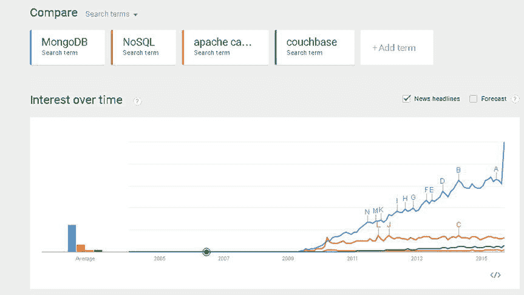

# 索引

关于作者

**迪帕克·沃赫拉**是一名顾问，也是`NuBean.com`软件公司的首席成员。迪帕克是一名经过 Sun 认证的 Java 程序员和 Web 组件开发人员。他在 XML、Java 编程和 Java EE 领域工作超过十年。迪帕克是*Pro Couchbase 开发*（Apress, 2015）一书的作者，以及*Pro XML Java 技术开发*（Apress, 2006）一书的合著者。迪帕克还是*JDBC 4.0*、*Oracle JDeveloper J2EE 开发*、*使用 Oracle JDeveloper 11g 处理 XML 文档*、*Oracle Fusion Middleware 11g 的 EJB 3.0 数据库持久化*以及*在 Eclipse IDE 中进行 Java EE 开发*（Packt Publishing）等书的作者。他还曾担任*WebLogic 权威指南*（O’Reilly Media, 2004）和*Ruby 编程初学者指南*（Cengage Learning PTR, 2007）的技术审阅者。

## 关于技术审阅者

**曼努埃尔·乔丹**是一位自学成才的开发者和研究员，他喜欢学习新技术，以便尝试以新的方式将它们整合起来。

曼努埃尔赢得了 2010 年 Springy 奖 – 社区冠军和 2013 年 Spring 冠军。在他为数不多的空闲时间里，他会阅读圣经，并用他的贝斯和吉他创作音乐。

**马西莫·纳尔多内**拥有意大利萨勒诺大学计算机科学硕士学位。他曾担任 PCI QSA 和高级首席 IT 安全/云/SCADA 架构师多年，目前担任惠普芬兰公司的安全、云和 SCADA 首席 IT 架构师。他拥有超过二十年的 IT 工作经验，涉及安全、SCADA、云计算、IT 基础设施、移动技术和 WWW 技术领域的国内和国际项目。马西莫曾担任项目经理、云/SCADA 首席 IT 架构师、软件工程师、研究工程师、首席安全架构师和软件专员。他曾在赫尔辛基技术大学（阿尔托大学）网络实验室担任客座讲师和练习指导老师。马西莫使用 Perl、PHP、Java、VB、Python、C/C++和 MySQL 进行编程和教授编程已超过二十年。他持有四项国际专利（涉及 PKI、SIP、SAML 和代理领域）。

马西莫是*Pro Android 游戏*（Apress, 2015）一书的作者。

## 引言

MongoDB 服务器在 NoSQL 数据库中排名第一，在所有数据库（关系型或 NoSQL）中排名第四。虽然市面上有几本关于 MongoDB 管理的书籍，但还没有关于基于 MongoDB 开发的书。

这本*Pro MongoDB 开发*是关于 MongoDB 服务器的，它是一个基于 BSON（二进制 JSON）文档模型的 NoSQL 数据库。如前所述，MongoDB 是最常用的 NoSQL 数据库，根据 DB-Engines.com 的数据，它在所有数据库（关系型或 NoSQL）中排名第四（参考：`http://db-engines.com/en/ranking`）。本书讨论了在 Web 开发中使用 MongoDB 数据库的各个方面。Java、PHP、Ruby 和 JavaScript 是最常用的编程/脚本语言，本书讨论了使用这些语言访问 MongoDB 数据库。本书还讨论了使用 Java EE 框架 Kundera 和 Spring Data 与 MongoDB。由于 NoSQL 数据库通常与 Hadoop 生态系统一起使用，本书讨论了 MongoDB 与 Apache Hadoop 和 Apache Hive 的结合使用。还讨论了基于 Oracle Data Integrator 将 MongoDB 数据集成到 Oracle Database 中。讨论了从其他 NoSQL 数据库（Apache Cassandra 和 Couchbase）以及关系型数据库（Oracle Database）的迁移。

本书适用于使用 MongoDB 服务器开发应用程序的 Web 开发者和 NoSQL 开发者。必须具备 Java、Java EE 以及脚本语言 PHP、Ruby 和 JavaScript 的预备知识。熟悉 Apache Hadoop、Apache Hive、Oracle Database 和 Oracle Data Integrator 也是先决条件。

根据 2014 年 Java 工具和技术展望，“在 NoSQL 领域……在使用 NoSQL 的开发者中……MongoDB（56%）显然处于领先地位……”（参考：`http://zeroturnaround.com/rebellabs/java-tools-and-technologies-landscape-for-2014/13/`）。

超过 2000 个组织使用 MongoDB（参考：`www.mongodb.com/who-uses-mongodb`）。

各种指标都将 MongoDB 排在所有其他 NoSQL 数据库之上（参考：`www.mongodb.com/leading-nosql-database`）。

MongoDB 被 DB-Engines 评为 2013 年度数据库（参考：`www.mongodb.com/blog/post/mongodb-named-2013-database-year-why-matters`）。

2015 年 9 月，Google Trends 中“MongoDB”与“Apache Cassandra”和“Couchbase”搜索词排名如下图所示。

*Google Trends 数据库搜索结果*

