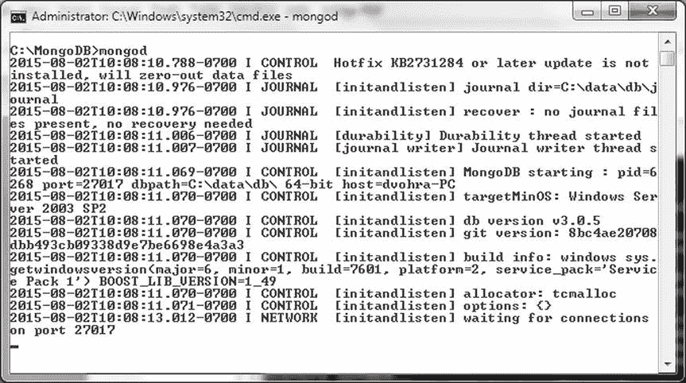
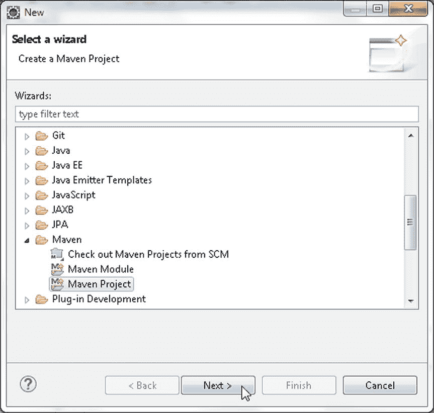
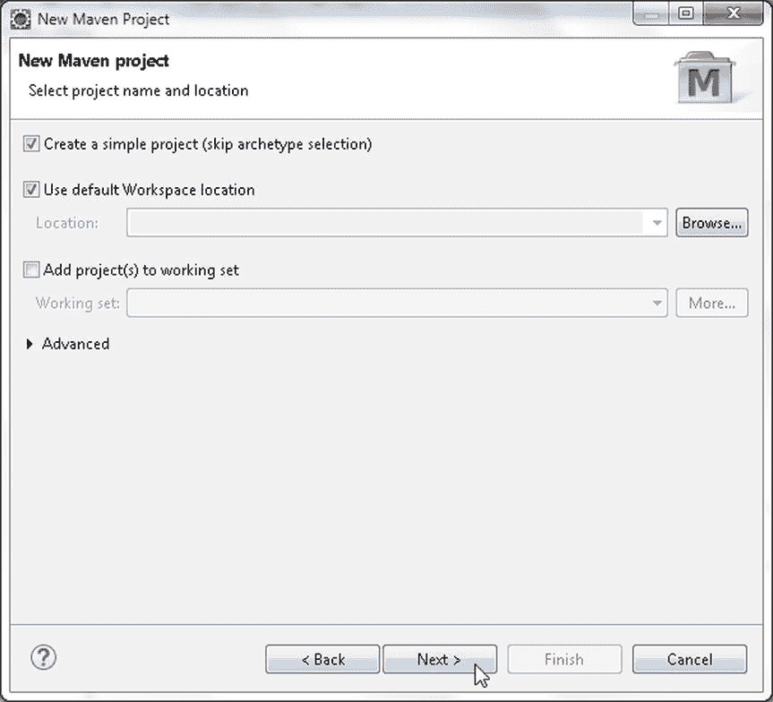
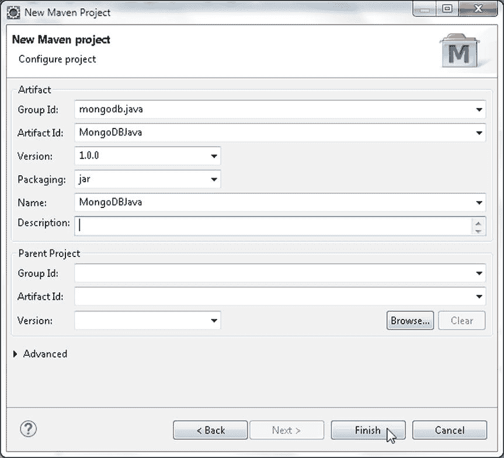

# 第 1 章


## 使用 Java 客户端连接 MongoDB

MongoDB 服务器为包括 Java 在内的多种语言提供了驱动程序。MongoDB Java 驱动程序可用于从 Java 应用程序连接到 MongoDB 服务器，并创建集合、获取集合或集合列表、向集合添加一个或多个文档，以及查找一个或一组文档。在本章中，我们将在 Eclipse 中创建一个 Java 应用程序，访问 MongoDB 服务器添加文档，随后从 MongoDB 服务器获取数据，以及更新和删除 MongoDB 服务器中的数据。本章涵盖以下主题：

*   设置环境
*   创建 Maven 项目
*   在 MongoDB 中创建 BSON 文档
*   使用模型在 MongoDB 中创建 BSON 文档
*   从 MongoDB 获取数据
*   更新 MongoDB 中的数据
*   删除 MongoDB 中的数据

### 设置环境

我们需要下载并安装以下软件。

1.  从`www.mongodb.org/downloads`下载 MongoDB 3.0.5 二进制发行版`mongodb-win32-x86_64-3.0.5-signed.msi`。本章使用 Windows 64 位稳定版（3.0.5）。
2.  从`www.eclipse.org/downloads`下载 Eclipse IDE for Java EE Developers。
3.  从`www.oracle.com/technetwork/java/javase/downloads/index.html`下载 Java 5 或更高版本（本章使用 Java 7）。

双击 MongoDB 二进制发行版进行安装。将 MongoDB 安装目录下的`bin`文件夹（`C:\Program Files\MongoDB\Server\3.0\bin`）添加到`PATH`环境变量中。为 MongoDB 数据创建一个目录`C:\data\db`。使用以下命令启动 MongoDB 服务器。

```
>mongod
```

MongoDB 服务器启动，如图 1-1 所示。



图 1-1. 启动 MongoDB

### 创建 Maven 项目

为了从 Java 应用程序访问 MongoDB，我们需要在 Eclipse IDE 中创建一个 Maven 项目并添加所需的依赖项。

1.  选择文件  新建  其他。在“新建”窗口中，选择 Maven  Maven 项目向导，然后单击下一步，如图 1-2 所示。



图 1-2. 选择 Maven  Maven 项目

2.  在“新建 Maven 项目”向导中，选中“创建简单项目”和“使用默认工作空间位置”复选框，如图 1-3 所示。单击下一步。



图 1-3. 新建 Maven 项目向导

3.  接下来，配置项目，指定以下值，如图 1-4 所示，然后单击完成：

*   Group Id: `mongodb.java`
    *   Artifact Id: `MongoDBJava`
    *   Version: 1.0.0
    *   Packaging: jar
    *   Name: `MongoDBJava`



图 1-4. 配置 Maven 项目


