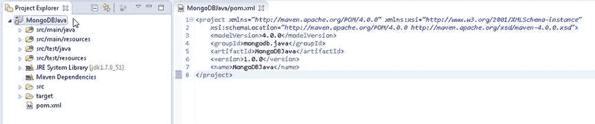
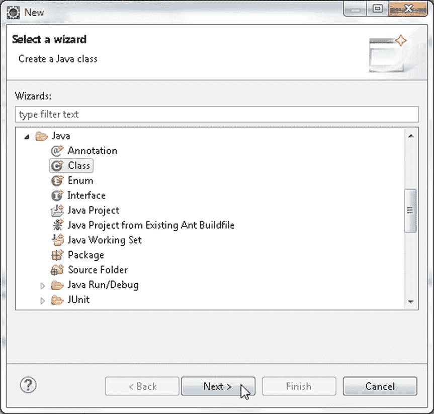
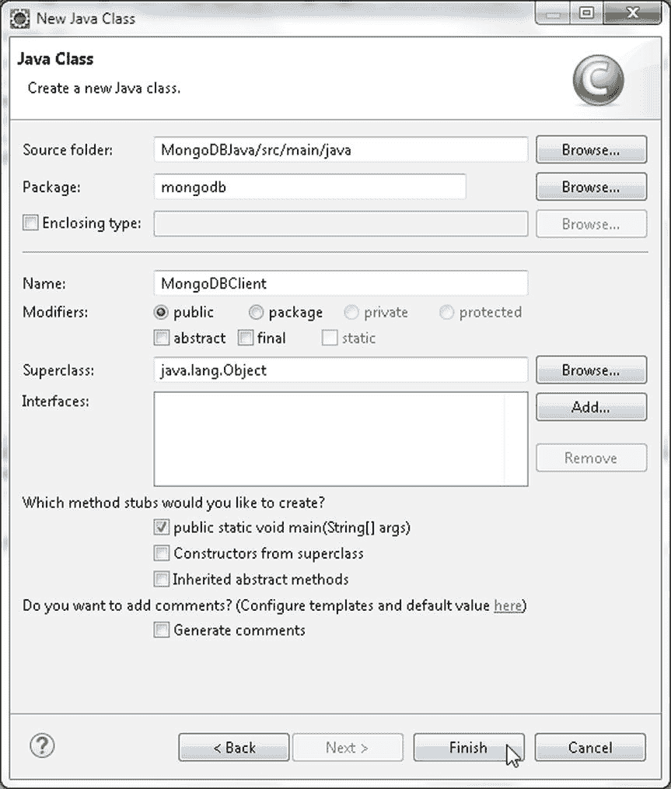
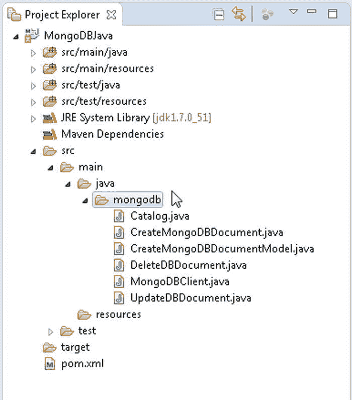
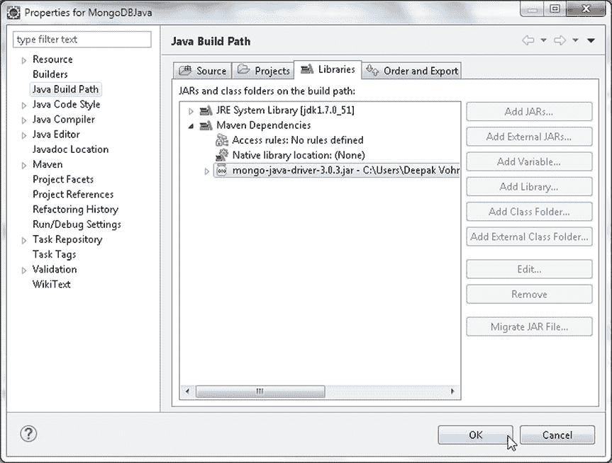
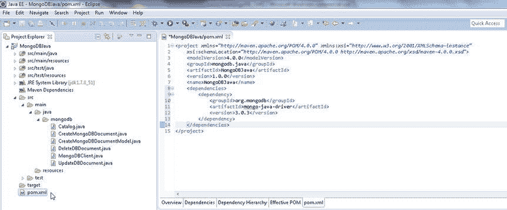

# 创建和配置 Maven 项目

一个新的 Maven 项目已创建，如图 1-5 所示。



图 1-5. Maven 项目 MongoDBJava

4.  我们需要向 Maven 项目添加一些 Java 类，以便在 MongoDB 服务器上运行 CRUD 操作。选择 File  New  Other，然后在 New 窗口中，选择 Java  Class，如图 1-6 所示。



图 1-6. 选择 Java  Class

5.  在 New Java Class 向导中，Source folder 预先选定为`MongoDBJava/src/main/java`。指定 Package 名称（`mongodb`）。指定一个 class Name（例如，用于连接 MongoDB 并获取数据的应用程序类`MongoDBClient`）。勾选`public static void main (String[] args)`方法存根以创建类，然后单击 Finish，如图 1-7 所示。



图 1-7. 创建一个新类

6.  `MongoDBClient`类在`MongoDBJava`项目中被创建。类似地，将表 1-1 中列出的 Java 类添加到与`MongoDBClient`类相同的包中：`mongodb`包。

表 1-1. Java 类

| 类 | 描述 |
| --- | --- |
| `Catalog` | 模型类，用于定义要添加到 MongoDB 服务器的记录的属性和访问方法。 |
| `CreateMongoDBDocument` | 创建 MongoDB 文档的类。 |
| `CreateMongoDBDocumentModel` | 使用模型类 catalog 创建 MongoDB 文档的类。 |
| `UpdateDBDocument` | 更新文档的类。 |
| `DeleteDBDocument` | 删除文档的类。 |

Maven 项目中的 Java 类在 Package Explorer 中如图 1-8 所示。



图 1-8. Java 类

7.  接下来，通过向`pom.xml`配置文件添加所需的依赖项来配置 Maven 项目。将 Java MongoDB Driver 依赖项添加到`pom.xml`。`pom.xml`内容如下所示。单击 File  Save All 保存`pom.xml`。

```xml
    <project xmlns="http://maven.apache.org/POM/4.0.0" xmlns:xsi="http://www.w3.org/2001/XMLSchema-instance"
        xsi:schemaLocation="http://maven.apache.org/POM/4.0.0 http://maven.apache.org/xsd/maven-4.0.0.xsd">
        <modelVersion>4.0.0</modelVersion>
        <groupId>mongodb.java</groupId>
        <artifactId>MongoDBJava</artifactId>
        <version>1.0.0</version>
        <name>MongoDBJava</name>
        <dependencies>
            <dependency>
                <groupId>org.mongodb</groupId>
                <artifactId>mongo-java-driver</artifactId>
                <version>3.0.3</version>
            </dependency>
        </dependencies>
    </project>
```

8.  在 Package Explorer 中右键单击项目节点，然后选择 Project Properties。在 Properties 中选择 Java Build Path。选择 Libraries 选项卡并单击 Maven Dependencies 以展开节点。MongoDB Java 驱动程序应列在 Java Build Path 中，如图 1-9 所示。单击 OK。



图 1-9. Java 构建路径中的 Mongo Java 驱动程序

在`pom.xml`中配置了 Mongo Java 驱动程序依赖项的 Maven 项目如图 1-10 所示。`MongoDBJava` Maven 项目的目录结构显示在 Package Explorer 中。



图 1-10. 配置了 Mongo Java 驱动程序依赖项的 Maven 项目

## 创建 BSON 文档

在本节中，我们将向 MongoDB 服务器添加一个 BSON（二进制 JSON）文档。我们将使用 Eclipse IDE 中的`CreateMongoDBDocument.java`应用程序。MongoDB 文档由`org.bson.Document`类表示。MongoDB 将数据存储在集合中。MongoDB Java 驱动程序中用于 MongoDB 类的主要包是`com.mongodb`和`com.mongodb.client`。用于连接到 MongoDB 服务器的 MongoDB 客户端由`com.mongodb.MongoClient`类表示。一个`MongoClient`对象提供连接池，并且整个应用程序只需要一个实例。`MongoClient`类提供了几个构造函数，其中一些在表 1-2 中列出。

表 1-2. MongoClient 类构造函数

| 构造函数 | 描述 |
| --- | --- |
| `MongoClient()` | 基于单个 MongoDB 节点（localhost 和默认端口 27017）创建一个实例。 |
| `MongoClient(String host)` | 基于单个 MongoDB 节点创建实例，主机指定为 host[:port] 字符串。 |
| `MongoClient(String host, int port)` | 使用指定的主机和端口基于单个 MongoDB 节点创建实例。 |
| `MongoClient(List<ServerAddress> seeds)` | 使用 MongoDB 服务器列表创建实例以进行选择。选择 ping 时间最短的服务器。如果 ping 时间最短的服务器宕机，则选择列表中的下一个。 |
| `MongoClient(List<ServerAddress> seeds, List<MongoCredential> credentialsList)` | 与上一个版本相同，但提供凭据列表以验证到服务器的连接。 |
| `MongoClient(List<ServerAddress> seeds, List<MongoCredential> credentialsList, MongoClientOptions options)` | 与上一个版本相同，但也提供了 Mongo 客户端选项。 |

1.  使用`MongoClient(List<ServerAddress> seeds)`构造函数创建一个`MongoClient`实例。提供“localhost”或主机的 IPv4 地址，端口为 27017。

```java
MongoClient mongoClient = new MongoClient(Arrays.asList(new ServerAddress("localhost", 27017)));
```

2.  当创建多个`MongoClient`实例时，所有资源使用限制都适用于每个`MongoClient`实例。要关闭实例，需要调用`MongoClient.close()`来清理资源。MongoDB 中的逻辑数据库由`com.mongodb.client.MongoDatabase`接口表示。使用`MongoClient`类中的`getDatabase(String databaseName)`方法获取“local”数据库的`com.mongodb.client.MongoDatabase`实例，这是一个默认的 MongoDB 数据库实例。

```java
MongoDatabase db = mongoClient.getDatabase("local");
```

3.  一些 Mongo 客户端 API 在 3.0.x 版本中已被修改。例如，在 3.0.x 中，数据库实例由`MongoDatabase`表示，而不是`com.mongodb.DB`。`MongoClient`中返回`DB`实例的`getDB(String dbName)`方法已被弃用。在 3.0.x 中，数据库集合由`com.mongodb.client.MongoCollection<TDocument>`表示，而不是`com.mongodb.DBCollection`。使用`MongoDatabase`中的`listCollectionNames()`方法获取数据库中的所有集合名称。

```java
MongoIterable<String> colls = db.listCollectionNames();
```

4.  `listCollectionNames()`方法返回一个`MongoIterable<String>`的集合。迭代该集合以输出集合名称。

```java
for (String s : colls) {
    System.out.println(s);
}
```

5.  接下来，使用`MongoDatabase`中的`getCollection(String collectionName)`方法创建一个新的`MongoCollection<Document>`实例。创建一个名为`catalog`的`Document`实例集合。当调用`getCollection(String)`方法时，会隐式创建集合。

```java
MongoCollection<Document> coll = db.getCollection("catalog");
```


