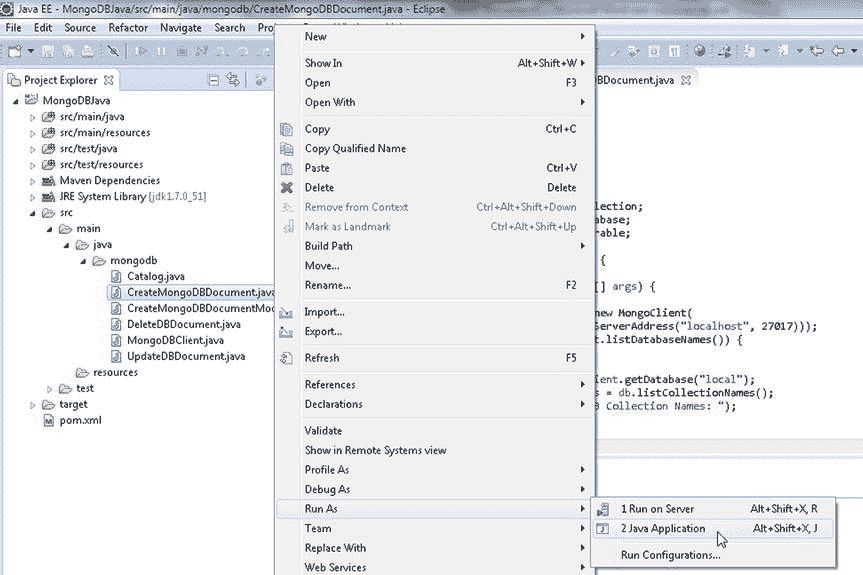
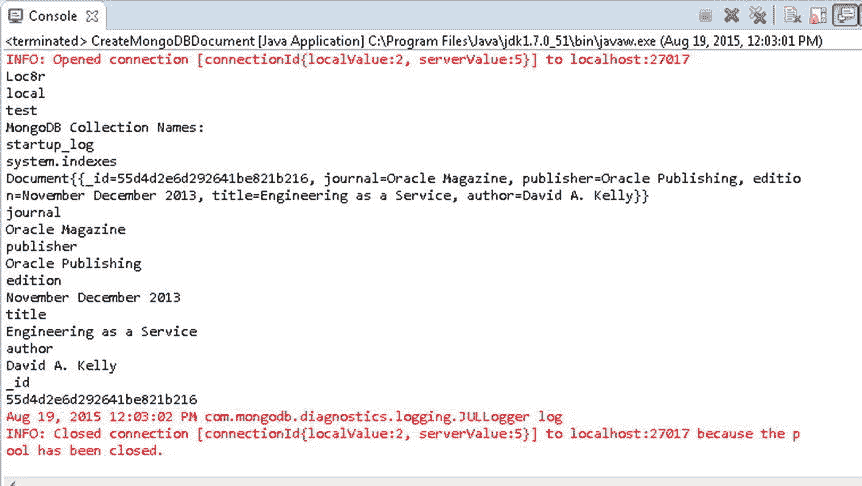
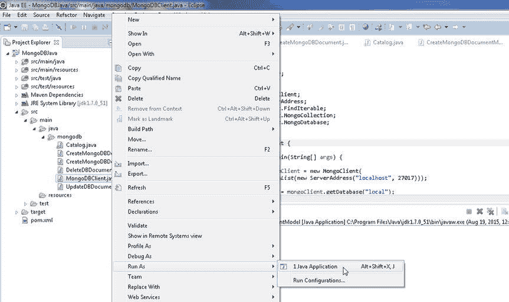
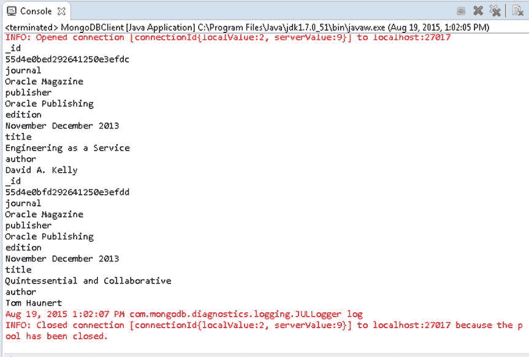

# MongoDB 文档操作：使用 Document 类和模型

一个 MongoDB 特定的 BSON 对象由 `org.bson.Document` 类表示，该类实现了 `Map` 等接口。`Document` 类提供了表 1-3 中列出的以下构造方法来创建新实例。

### 表 1-3. Document 类构造方法

| 构造方法 | 描述 |
| --- | --- |
| `Document()` | 创建一个空的 `Document` 实例。 |
| `Document(Map<String,Object> map)` | 创建一个使用 `Map` 初始化的 `Document` 实例。 |
| `Document(String key, Object value)` | 创建一个使用键/值对初始化的 `Document` 实例。 |

`Document` 类提供了一些其他实用方法，其中一部分在表 1-4 中。

### 表 1-4. Document 类实用方法

| 方法 | 描述 |
| --- | --- |
| `append(String key, Object value)` | 将一个键/值对追加到 `Document` 对象并返回一个新实例。 |
| `toString()` | 返回对象的字符串表示形式。 |

6. 使用 `Document(String key, Object value)` 构造方法创建一个 `Document` 实例，并使用 `append(String key, Object value)` 方法追加键/值对。可以按顺序多次调用 `append()` 方法来添加多个键/值对。为 `journal`、`publisher`、`edition`、`title` 和 `author` 字段添加键/值对。

```java
Document catalog = new Document("journal", "Oracle Magazine")
.append("publisher", "Oracle Publishing")
.append("edition", "November December 2013")
.append("title", "Engineering as a Service").append("author", "David A. Kelly");
```

7. `MongoCollection<TDocument>` 接口提供了 `insertOne(TDocument document)` 方法，用于向集合中添加文档。将 `catalog` `Document` 添加到 `catalog` 集合的 `MongoCollection<TDocument>` 实例中。

```java
coll.insertOne(catalog);
```

8. `MongoCollection<TDocument>` 接口提供了重载的 `find()` 方法来查找 `Document` 实例。接下来，使用 `find()` 方法获取添加的文档。此外，`find()` 方法返回一个可迭代的集合，我们从中使用 `first()` 方法获取第一个文档。

```java
Document dbObj = coll.find().first();
```

9. 输出找到的 `Document` 对象，同时也通过迭代使用 `Document` 的 `keySet()` 方法获得的 `Set<E>` 来输出。`keySet()` 方法返回一个 `Set<String>`。使用 `iterator()` 方法从 `Set<String>` 创建一个 `Iterator`。当 `Iterator` 通过 `hasNext()` 方法确定有元素时，使用 `next()` 方法获取元素。每个元素都是所获取 `Document` 中的一个键。使用 `Document` 中的 `get(String key)` 方法获取该键对应的值。

```java
System.out.println(dbObj);
Set<String> set = dbObj.keySet();
Iterator iter = set.iterator();
while(iter.hasNext()){
Object obj=     iter.next();
System.out.println(obj);
System.out.println(dbObj.get(obj.toString()));
}
```

10. 关闭 `MongoClient` 实例。

```java
mongoClient.close();
```

`CreateMongoDBDocument` 类如下所示。

```java
package mongodb;

import java.util.Arrays;
import java.util.Iterator;
import java.util.Set;
import org.bson.Document;
import com.mongodb.MongoClient;
import com.mongodb.ServerAddress;
import com.mongodb.client.MongoCollection;
import com.mongodb.client.MongoDatabase;
import com.mongodb.client.MongoIterable;

public class CreateMongoDBDocument {

    public static void main(String[] args) {

        MongoClient mongoClient = new MongoClient(
                Arrays.asList(new ServerAddress("localhost", 27017)));
        for (String s : mongoClient.listDatabaseNames()) {
            System.out.println(s);
        }
        MongoDatabase db = mongoClient.getDatabase("local");
        MongoIterable<String> colls = db.listCollectionNames();
        System.out.println("MongoDB Collection Names: ");
        for (String s : colls) {
            System.out.println(s);
        }
        MongoCollection<Document> coll = db.getCollection("catalog");
        Document catalog = new Document("journal", "Oracle Magazine")
                .append("publisher", "Oracle Publishing")
                .append("edition", "November December 2013")
                .append("title", "Engineering as a Service")
                .append("author", "David A. Kelly");
        coll.insertOne(catalog);
        Document dbObj = coll.find().first();
        System.out.println(dbObj);
        Set<String> set = catalog.keySet();
        Iterator<String> iter = set.iterator();
        while (iter.hasNext()) {
            Object obj = iter.next();
            System.out.println(obj);
            System.out.println(dbObj.get(obj.toString()));
        }
        mongoClient.close();
    }
}
```

11. 要运行 `CreateMongoDBDocument` 应用程序，请在 Package Explorer 中右键单击 `CreateMongoDBDocument.java` 文件，然后选择 "运行方式"  "Java 应用程序"，如图 1-11 所示。



### 图 1-11. 运行 CreateMongoDBDocument.java 应用程序

一个新的 BSON 文档将被存储在 MongoDB 数据库的新集合 `catalog` 中。存储的文档也会如图 1-12 所示，以原样及键/值对的形式输出。



### 图 1-12. 输出存储在 MongoDB 中的文档

## 使用模型创建 BSON 文档

在上一节中，我们使用 `Document` 类中的 `append(String key, Object value)` 方法构造要添加到集合的文档，并使用 `MongoCollection<TDocument>` 接口中的 `insertOne(TDocument document)` 方法将文档添加到集合中。也可以使用表示集合中对象的模型类来构造 `Document` 对象。`MongoCollection<TDocument>` 接口提供了重载的 `insertMany()` 方法来添加文档列表，如表 1-5 所述。

### 表 1-5. 重载的 insertMany() 方法

| 方法 | 描述 |
| --- | --- |
| `insertMany(List<? extends TDocument> documents)` | 插入一个或多个文档。 |
| `insertMany(List<? extends TDocument> documents, InsertManyOptions options)` | 使用指定的插入选项插入一个或多个文档。唯一支持的选项是按提供的顺序插入文档。 |

在本节中，我们将使用一个模型类构造一个文档列表。随后，我们将使用其中一个 `insertMany()` 方法将该列表插入到一个集合中。

1.  首先，创建一个具有以下字段的模型类 `Catalog`：
    *   `catalogId`
    *   `journal`
    *   `publisher`
    *   `edition`
    *   `title`
    *   `author`
2.  该模型类扩展了 `BasicDBObject` 类（这是 MongoDB 特定 BSON 对象的基本实现）并实现了 `Serializable` 接口。该类实现 `Serializable` 接口是为了在模型类对象持久化到数据库时将其序列化到缓存中。为了通过序列化运行时将版本号与可序列化类关联，请指定一个作用域为 `private` 的 `serialVersionUID` 变量。

```java
private static final long serialVersionUID = 1L;
```


3.  指定一个类构造函数，将所有字段作为 `args` 参数。模型类 `Catalog` 列于下方。

```
    package mongodb;
    import java.io.Serializable;
    import com.mongodb.BasicDBObject;
    public class Catalog extends BasicDBObject implements Serializable {

private static final long serialVersionUID = 1L;

private String catalogId;
        private String journal;
        private String publisher;
        private String edition;
        private String title;
        private String author;
    public Catalog() {
        super();
    }

public Catalog(String catalogId, String journal, String publisher,
            String edition, String title, String author) {
        this.catalogId = catalogId;
        this.journal = journal;
        this.publisher = publisher;
        this.edition = edition;
        this.title = title;
        this.author = author;
    }
}
```

接下来，我们将使用模型类 `Catalog` 来构建文档，并将这些文档添加到 MongoDB 数据库中。我们将使用 `CreateMongoDBDocumentModel` 类来构建文档并将其添加到 MongoDB。

### 1.  首先，如前所述创建一个 `MongoClient` 实例。

```
    MongoClient mongoClient = new MongoClient(Arrays.asList(new ServerAddress("localhost", 27017)));
```

### 2.  同时为 `local` 数据库创建一个 `MongoDatabase` 实例

同时，使用 `MongoClient` 类中的 `getDatabase(String databaseName)` 方法为 `local` 数据库创建一个 `MongoDatabase` 实例。

```
    MongoDatabase db = mongoClient.getDatabase("local");
```

`MongoDatabase` 接口提供了 `表 1-6` 中列出的重载方法，用于获取或创建由 `MongoCollection<TDocument>` 接口表示的集合。

`表 1-6`. 重载的 `getCollection()` 方法

| 方法 | 描述 |
| --- | --- |
| `getCollection(String collectionName)` | 以 `MongoCollection<Document>` 实例的形式获取一个集合。如果该集合尚不存在，则会创建它。 |
| `getCollection(String collectionName, Class<TDocument> documentClass)` | 以 `MongoCollection<TDocument>` 实例的形式获取一个集合。如果该集合尚不存在，则会创建它。第二个参数表示文档类。`MongoCollection<Document>` 和 `MongoCollection<TDocument>` 之间的唯一区别在于类型参数；`TDocument` 代表文档的类型，而 `Document` 代表文档本身。 |

### 3.  从 `MongoDatabase` 实例创建集合

使用先前创建的 `MongoDatabase` 实例，通过 `getCollection(String collectionName)` 方法创建一个集合。

```
    MongoCollection<Document> coll = db.getCollection("catalog");
```

### 4.  创建 `Catalog` 的实例

由于 `Catalog` 类继承自 `BasicDBObject` 类，因此它也代表一个可以存储在 MongoDB 数据库中的文档对象。创建 `Catalog` 的实例，并使用 `BasicDBObject` 类中的 `put(String key, Object value)` 方法设置对象字段。

```
    Catalog catalog1 = new Catalog();
    catalog1.put("catalogId", "catalog1");
    catalog1.put("journal", "Oracle Magazine");
    catalog1.put("publisher", "Oracle Publishing");
    catalog1.put("edition", "November December 2013");
    catalog1.put("title", "Engineering as a Service");
    catalog1.put("author", "David A. Kelly");

Catalog catalog2 = new Catalog();
    catalog2.put("catalogId", "catalog2");
    catalog2.put("journal", "Oracle Magazine");
    catalog2.put("publisher", "Oracle Publishing");
    catalog2.put("edition", "November December 2013");
    catalog2.put("title", "Quintessential and Collaborative");
    catalog2.put("author", "Tom Haunert");
```

### 5.  创建一个 `Document` 实例并添加 `Catalog` 对象

创建一个 `Document` 实例，并使用 `append(String key, Object value)` 方法将 `Catalog` 对象作为键值对添加到 `Document` 中。

```
    Document documentSet = new Document();
    documentSet.append("catalog1", catalog1);
    documentSet.append("catalog2", catalog2);
```

### 6.  创建一个 `List<E>` 实例

由于用于添加文档的 `insertMany()` 方法的参数要求类型为 `List<E>`，我们需要使用 `ArrayList<E>` 构造函数来创建一个 `List<E>` 实例。

```
    ArrayList<Document> arrayList = new ArrayList<Document>();
```

### 7.  将 `Document` 实例添加到 `ArrayList<E>`

使用 `add(E e)` 方法将已添加了键值对的 `Document` 实例添加到 `ArrayList<E>` 中。

```
    arrayList.add(documentSet);
```

### 8.  将 `ArrayList<E>` 实例添加到 `MongoCollection<TDocument>` 实例

使用 `insertMany(List<? extends TDocument> documents)` 方法将 `ArrayList<E>` 实例添加到 `MongoCollection<TDocument>` 实例中。

```
    coll.insertMany(arrayList);
```

### 9.  使用 `find()` 方法获取文档

为了验证文档已被添加，使用 `MongoCollection<TDocument>` 中的 `find()` 方法获取文档。`find()` 方法返回一个 `FindIterable<TDocument>` 对象作为结果。

```
    FindIterable<Document> iterable = coll.find();
```

随后，输出存储在 `FindIterable<TDocument>` 对象中的键值对。使用增强的 `for` 循环获取 `FindIterable<TDocument>` 中的 `Document` 实例，并使用 `keySet()` 方法获取与每个 `Document` 实例关联的键集，该方法返回一个 `Set<String>` 对象。使用 `Set<E>` 中的 `iterator()` 方法创建一个由 `Iterator<String>` 对象表示的迭代器。使用 `while` 循环遍历键集，输出每个 `Document` 的文档键以及关联的 `Document` 对象。

```
    FindIterable<Document> iterable = coll.find();
        String documentKey = null;
        for (Document document : iterable) {
            Set<String> keySet = document.keySet();
            Iterator<String> iter = keySet.iterator();
            while (iter.hasNext()) {
                documentKey = iter.next();
                System.out.println(documentKey);
                System.out.println(document.get(documentKey));
            }
        }
```

### 10.  关闭 `MongoClient` 对象

使用 `close()` 方法关闭 `MongoClient` 对象。

```
    mongoClient.close();
```

`CreateMongoDBDocumentModel` 类列于下方。

```
    package mongodb;

import java.util.ArrayList;
    import java.util.Arrays;
    import java.util.Iterator;
    import java.util.Set;
    import org.bson.Document;
    import com.mongodb.MongoClient;
    import com.mongodb.ServerAddress;
    import com.mongodb.client.FindIterable;
    import com.mongodb.client.MongoCollection;
    import com.mongodb.client.MongoDatabase;

public class CreateMongoDBDocumentModel {
        public static void main(String[] args) {
            MongoClient mongoClient = new MongoClient(
                    Arrays.asList(new ServerAddress("localhost", 27017)));

MongoDatabase db = mongoClient.getDatabase("local");

MongoCollection<Document> coll = db.getCollection("catalog");

Catalog catalog1 = new Catalog();
            catalog1.put("catalogId", "catalog1");
            catalog1.put("journal", "Oracle Magazine");
            catalog1.put("publisher", "Oracle Publishing");
            catalog1.put("edition", "November December 2013");
            catalog1.put("title", "Engineering as a Service");
            catalog1.put("author", "David A. Kelly");

Catalog catalog2 = new Catalog();
            catalog2.put("catalogId", "catalog2");
            catalog2.put("journal", "Oracle Magazine");
            catalog2.put("publisher", "Oracle Publishing");
            catalog2.put("edition", "November December 2013");
            catalog2.put("title", "Quintessential and Collaborative");
            catalog2.put("author", "Tom Haunert");
```


## 从 MongoDB 获取数据

在本节中，我们将从 MongoDB 获取数据。我们将在此部分使用 `MongoDBClient` 应用程序。`MongoCollection<TDocument>` 接口提供了表 1-7 中讨论的重载方法来查找文档。

**表 1-7.** 重载的 `find()` 方法

| 方法 | 描述 |
| --- | --- |
| `find()` | 查找集合中的所有文档并返回一个 `FindIterable<TDocument>` 实例。 |
| `find(Bson filter)` | 使用指定的查询过滤器查找集合中的所有文档，并返回一个 `FindIterable<TDocument>` 实例。 |
| `find(Bson filter, Class<TResult> resultClass)` | 使用指定的查询过滤器和结果类查找集合中的所有文档，并返回一个 `<TResult> FindIterable<TResult>` 实例。 |
| `find(Class<TResult> resultClass)` | 使用指定的结果类查找集合中的所有文档，并返回一个 `<TResult> FindIterable<TResult>` 实例。 |

### 步骤 1：创建客户端、数据库和集合实例

创建一个 `MongoClient` 实例、一个 `MongoDatabase` 实例和一个 `MongoCollection<TDocument>` 实例，如前所述。

```java
MongoClient mongoClient = new MongoClient(Arrays.asList(new ServerAddress("localhost", 27017)));
MongoDatabase db = mongoClient.getDatabase("local");
MongoCollection<Document> coll = db.getCollection("catalog");
```

### 步骤 2：创建并插入文档

创建两个 `Catalog` 实例，并使用 `insertOne(TDocument document)` 方法将这些 `Catalog` 实例添加到 `MongoCollection<TDocument>` 实例中。

```java
Document catalog = new Document("journal", "Oracle Magazine")
            .append("publisher", "Oracle Publishing")
            .append("edition", "November December 2013")
            .append("title", "Engineering as a Service")
            .append("author", "David A. Kelly");
    coll.insertOne(catalog);

catalog = new Document("journal", "Oracle Magazine")
            .append("publisher", "Oracle Publishing")
            .append("edition", "November December 2013")
            .append("title", "Quintessential and Collaborative")
            .append("author", "Tom Haunert");
    coll.insertOne(catalog);
```

### 步骤 3：查询文档

随后，使用 `find()` 方法查找添加的文档，该方法将结果作为 `FindIterable<TDocument>` 返回。

```java
FindIterable<Document> iterable = coll.find();
```

### 步骤 4：遍历并输出文档

使用增强的 `for` 循环遍历 `FindIterable<TDocument>` 以获取存储的 `Document` 实例，并获取与每个 `Document` 实例关联的键集。在键集上创建一个迭代器，并使用 `while` 循环遍历键集以输出每个文档键及其关联的 `Document` 对象。

```java
String documentKey = null;
for (Document document : iterable) {
    Set<String> keySet = document.keySet();
    Iterator<String> iter = keySet.iterator();
    while (iter.hasNext()) {
        documentKey = iter.next();
        System.out.println(documentKey);
        System.out.println(document.get(documentKey));
    }
}
```

`MongoDBClient` 类的完整代码如下所示。

```java
package mongodb;

import java.util.Arrays;
import java.util.Iterator;
import java.util.Set;
import org.bson.Document;
import com.mongodb.MongoClient;
import com.mongodb.ServerAddress;
import com.mongodb.client.FindIterable;
import com.mongodb.client.MongoCollection;
import com.mongodb.client.MongoDatabase;

public class MongoDBClient {
    public static void main(String[] args) {
        MongoClient mongoClient = new MongoClient(
                Arrays.asList(new ServerAddress("localhost", 27017)));
        MongoDatabase db = mongoClient.getDatabase("local");
        MongoCollection<Document> coll = db.getCollection("catalog");
        Document catalog = new Document("journal", "Oracle Magazine")
                .append("publisher", "Oracle Publishing")
                .append("edition", "November December 2013")
                .append("title", "Engineering as a Service")
                .append("author", "David A. Kelly");
        coll.insertOne(catalog);

        catalog = new Document("journal", "Oracle Magazine")
                .append("publisher", "Oracle Publishing")
                .append("edition", "November December 2013")
                .append("title", "Quintessential and Collaborative")
                .append("author", "Tom Haunert");
        coll.insertOne(catalog);

        FindIterable<Document> iterable = coll.find();
        String documentKey = null;
        for (Document document : iterable) {
            Set<String> keySet = document.keySet();
            Iterator<String> iter = keySet.iterator();
            while (iter.hasNext()) {
                documentKey = iter.next();
                System.out.println(documentKey);
                System.out.println(document.get(documentKey));
            }
        }
        mongoClient.close();
    }
}
```

### 步骤 5：清理集合（可选但推荐）

在运行 `MongoDBClient` 应用程序之前，请使用 Mongo shell 中的以下命令（下一章将更详细地讨论）从 `local` 数据库中删除 `catalog` 集合。Mongo shell 使用 `mongo` 命令启动。在一个新的命令窗口中启动 Mongo shell，并且在运行 Mongo shell 命令时，MongoDB 服务器实例应该正在运行。

```
>mongo
>use local
>db.catalog.drop()
```

### 步骤 6：运行应用程序

要运行 `MongoDBClient` 应用程序，请在 Package Explorer 中右键单击 `MongoDBClient.java` 文件，然后选择 **Run As**  **Java Application**，如图 1-15 所示。



**图 1-15.** 运行 MongoDBClient.java 应用程序


图 1-15. 运行 `MongoClient.java` 应用程序

应用程序的输出显示在 Eclipse 控制台中，如图 1-16 所示。添加的两个文档被获取，关联的键/值对被输出。



图 1-16. 查找文档并输出键/值对

## 更新 MongoDB 中的数据

在本节中，我们将更新 MongoDB 数据。我们将使用 `UpdateDBDocument` 应用程序。`MongoCollection<TDocument>` 类提供了多种方法（其中一些是重载的）来查找和更新数据，如表 1-8 所述。

表 1-8. 用于更新或替换文档的 `MongoCollection<TDocument>` 方法

| 方法 | 描述 |
| --- | --- |
| `findOneAndReplace(Bson filter, TDocument replacement)` | 使用指定的查询过滤器查找文档，并用替换文档替换它。 |
| `findOneAndReplace(Bson filter, TDocument replacement, FindOneAndReplaceOptions options)` | 使用指定的查询过滤器和 `FindOneAndReplaceOptions` 选项查找文档，并用替换文档替换它。`FindOneAndReplaceOptions` 选项包括查找和替换的最大时间、是返回原始文档还是替换文档、要应用的排序标准、如果查询过滤器未找到文档是否要插入或更新文档（upsert），以及要返回哪些文档字段。"插入或更新"是指如果要替换或更新的文档未找到，则插入一个文档的术语。 |
| `findOneAndUpdate(Bson filter, Bson update)` | 使用指定的查询过滤器查找文档，并用更新文档替换它。更新必须仅包含更新操作符。 |
| `findOneAndUpdate(Bson filter, Bson update, FindOneAndUpdateOptions options)` | 使用指定的查询过滤器查找文档，并用更新文档替换它。更新必须仅包含更新操作符。同时也提供了 `FindOneAndUpdateOptions` 选项。`FindOneAndUpdateOptions` 选项包括查找和更新的最大时间、是返回原始文档还是更新后的文档、要应用的排序标准、如果查询过滤器未找到文档是否要插入或更新文档，以及要返回哪些文档字段。 |
| `replaceOne(Bson filter, TDocument replacement)` | 使用指定的查询过滤器和替换文档替换一个文档。 |
| `replaceOne(Bson filter, TDocument replacement, UpdateOptions updateOptions)` | 使用指定的查询过滤器和替换文档替换一个文档。同时提供了 `UpdateOptions`。`UpdateOptions` 选项包括如果查询过滤器未找到文档是否要插入或更新文档。 |
| `updateMany(Bson filter, Bson update)` | 使用查询过滤器和更新文档更新一个或多个文档。 |
| `updateMany(Bson filter, Bson update, UpdateOptions updateOptions)` | 使用查询过滤器和更新文档更新一个或多个文档。同时提供了 `UpdateOptions`。`UpdateOptions` 选项包括如果查询过滤器未找到文档是否要插入或更新文档。 |
| `updateOne(Bson filter, Bson update)` | 使用查询过滤器和更新文档更新一个文档。 |
| `updateOne(Bson filter, Bson update, UpdateOptions updateOptions)` | 使用查询过滤器和更新文档更新一个文档。同时提供了 `UpdateOptions`。`UpdateOptions` 选项包括如果查询过滤器未找到文档是否要插入或更新文档。 |

上表列出的一些方法仅支持在更新文档中使用 `update` 操作符。可以应用于文档字段的 `update` 操作符在表 1-9 中讨论。

表 1-9. 更新操作符

| 操作符 | 描述 |
| --- | --- |
| `$inc` | 递增字段的值。增量必须是正值或负值。 |
| `$mul` | 乘以字段的值。 |
| `$rename` | 重命名字段。 |
| `$setOnInsert` | 如果更新导致插入，则设置字段的值。 |
| `$set` | 设置文档中字段的值。 |
| `$unset` | 取消设置文档中字段的值。 |
| `$min` | 仅当指定值小于当前字段值时才更新字段。 |
| `$max` | 仅当指定值大于当前字段值时才更新字段。 |
| `$currentDate` | 将字段的值设置为当前日期（Date 或 Timestamp 类型）。 |

### 分步操作

1.  在 `UpdateDBDocument` 应用程序中，如前所述创建一个 `MongoClient` 实例，并为 `local` 数据库创建一个 `MongoDatabase` 实例。随后，为 `catalog` 集合创建一个 `MongoCollection<TDocument>` 实例。使用 `insertOne(TDocument document)` 方法向 `catalog` 集合添加两个 `Catalog` 对象实例。

    ```
    Document catalog = new Document("catalogId", "catalog1")
        .append("journal", "Oracle Magazine")
        .append("publisher", "Oracle Publishing")
        .append("edition", "November December 2013")
        .append("title", "Engineering as a Service")
        .append("author", "David A. Kelly");
    coll.insertOne(catalog);

    catalog = new Document("catalogId", "catalog2")
        .append("journal", "Oracle Magazine")
        .append("publisher", "Oracle Publishing")
        .append("edition", "November December 2013")
        .append("title", "Quintessential and Collaborative")
        .append("author", "Tom Haunert");
    coll.insertOne(catalog);
    ```

2.  以使用 `updateOne(Bson filter, Bson update)` 方法为例，使用更新操作符 `$set` 更新 `catalogId` 为 `catalog1` 的 `Document` 实例的 `edition` 和 `author` 字段。

    ```
    coll.updateOne(new Document("catalogId", "catalog1"), new Document("$set", new Document("edition", "11-12 2013").append("author", "Kelly, David A.")));
    ```

3.  以使用 `updateMany(Bson filter, Bson update)` 方法为例，使用更新操作符 `$set` 更新所有 `Document` 实例的 `journal` 字段。

    ```
    coll.updateMany(new Document("journal", "Oracle Magazine"), new Document("$set", new Document("journal", "OracleMagazine")));
    ```

4.  以使用 `replaceOne(Bson filter, TDocument replacement, UpdateOptions updateOptions)` 方法为例，替换 `catalogId` 为 `catalog3`（该文档不存在）的 `Document` 实例为一个新的 `Document` 实例。提供一个 `UpdateOptions` 参数，以便在查询过滤器未返回 `Document` 实例时插入或更新（upsert）该文档。

    ```
    UpdateResult result = coll.replaceOne(new Document("catalogId", "catalog3"),
        new Document("catalogId", "catalog3")
            .append("journal", "Oracle Magazine")
            .append("publisher", "Oracle Publishing")
            .append("edition", "November December 2013")
            .append("title", "Engineering as a Service")
            .append("author", "David A. Kelly"),
        new UpdateOptions().upsert(true));
    ```

5.  `replaceOne()` 方法返回一个 `UpdateResult` 对象。输出以下内容：
    *   使用 `UpdateResult` 的 `getMatchedCount()` 方法获取匹配的文档数量。
    *   使用 `getModifiedCount()` 方法获取修改的文档数量。并非所有匹配的文档都一定被修改。
    *   使用 `getUpsertedId()` 方法获取插入或更新的文档的 `_id` 字段值。`_id` 字段值需要通过调用 `asObjectId()` 方法后再调用 `getValue()` 方法来获取。

    ```
    System.out.println("Number of documents matched: " + result.getMatchedCount());
    System.out.println("Number of documents modified: " + result.getModifiedCount());
    System.out.println("Upserted Document Id: " + result.getUpsertedId().asObjectId().getValue());
    ```


