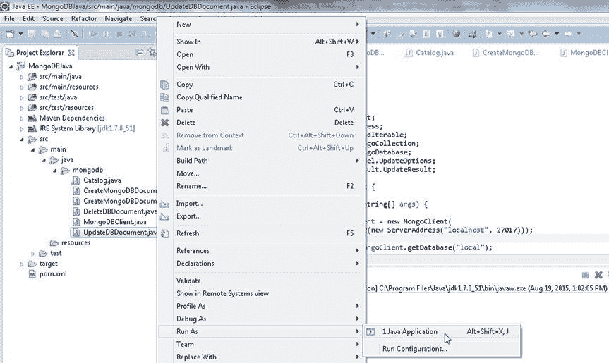

# 验证文档更新

6.  为了验证文档是否已更新或替换，输出目录集合中的所有文档。使用 `find()` 方法为 `catalog` 集合中的文档创建一个 `FindIterable<TDocument>`。随后，使用增强的 `for` 循环来获取 `Document` 实例，并如前所述输出每个 `Document` 实例中的键/值对。

`UpdateDBDocument` 应用程序如下所列。

```java
package mongodb;

import java.util.Arrays;
import java.util.Iterator;
import java.util.Set;
import org.bson.Document;
import com.mongodb.MongoClient;
import com.mongodb.ServerAddress;
import com.mongodb.client.FindIterable;
import com.mongodb.client.MongoCollection;
import com.mongodb.client.MongoDatabase;
import com.mongodb.client.model.UpdateOptions;
import com.mongodb.client.result.UpdateResult;

public class UpdateDBDocument {

    public static void main(String[] args) {
        MongoClient mongoClient = new MongoClient(
                Arrays.asList(new ServerAddress("localhost", 27017)));
        MongoDatabase db = mongoClient.getDatabase("local");
        MongoCollection<Document> coll = db.getCollection("catalog");
        Document catalog = new Document("catalogId", "catalog1")
                .append("journal", "Oracle Magazine")
                .append("publisher", "Oracle Publishing")
                .append("edition", "November December 2013")
                .append("title", "Engineering as a Service")
                .append("author", "David A. Kelly");
        coll.insertOne(catalog);
        catalog = new Document("catalogId", "catalog2")
                .append("journal", "Oracle Magazine")
                .append("publisher", "Oracle Publishing")
                .append("edition", "November December 2013")
                .append("title", "Quintessential and Collaborative")
                .append("author", "Tom Haunert");
        coll.insertOne(catalog);
        coll.updateOne(
                new Document("catalogId", "catalog1"),
                new Document("$set", new Document("edition", "11-12 2013")
                        .append("author", "Kelly, David A.")));
        coll.updateMany(new Document("journal", "Oracle Magazine"),
                new Document("$set", new Document("journal", "OracleMagazine")));
        UpdateResult result = coll.replaceOne(
                new Document("catalogId", "catalog3"),
                new Document("catalogId", "catalog3")
                        .append("journal", "Oracle Magazine")
                        .append("publisher", "Oracle Publishing")
                        .append("edition", "November December 2013")
                        .append("title", "Engineering as a Service")
                        .append("author", "David A. Kelly"),
                new UpdateOptions().upsert(true));
        System.out.println("Number of documents matched: "
                + result.getMatchedCount());
        System.out.println("Number of documents modified: "
                + result.getModifiedCount());
        System.out.println("Upserted Document Id: "
                + result.getUpsertedId().asObjectId().getValue());
        FindIterable<Document> iterable = coll.find();
        String documentKey = null;
        for (Document document : iterable) {
            Set<String> keySet = document.keySet();
            Iterator<String> iter = keySet.iterator();
            while (iter.hasNext()) {
                documentKey = iter.next();
                System.out.println(documentKey);
                System.out.println(document.get(documentKey));
            }
        }
        mongoClient.close();
    }
}
```

7.  同样，在运行应用程序之前，在 mongo shell 中使用 `db.catalog.drop()` 命令删除目录集合。要运行 `UpdateDBDocument.java` 应用程序，请在“Package Explorer”中右键单击 `UpdateDBDocument.java`，然后选择 Run As  Java Application，如 图 1-17 所示。



图 1-17. 运行 UpdateDBDocument.java 应用程序

`UpdateDBDocument.java` 应用程序的输出如下。

```
Number of documents matched: 0
Number of documents modified: 0
Upserted Document Id: 55d4e56c0bc271d4a7002749
_id
55d4e56cd292641a003cb55a
catalogId
catalog1
journal
OracleMagazine
publisher
Oracle Publishing
edition
11-12 2013
title
Engineering as a Service
author
Kelly, David A.
_id
55d4e56cd292641a003cb55b
catalogId
catalog2
journal
OracleMagazine
publisher
Oracle Publishing
edition
November December 2013
title
Quintessential and Collaborative
author
Tom Haunert
_id
55d4e56c0bc271d4a7002749
catalogId
catalog3
journal
Oracle Magazine
publisher
Oracle Publishing
edition
November December 2013
title
Engineering as a Service
author
David A. Kelly
```

`updateOne()` 方法示例使用更新操作符 `$set` 更新了 `catalogId` 为 `catalog1` 的文档的 `edition` 和 `author` 字段。`updateMany()` 方法示例使用更新操作符 `$set` 将所有文档的 `journal` 字段设置为 `OracleMagazine`。如输出所示，`replaceOne()` 方法示例匹配和修改的文档数均为 0。因为 `UpdateOptions` 被设置为 upsert（更新插入）文档，所以当找不到 `catalogId` 为 `catalog3` 的 `Document` 实例时，就会添加一个新文档。

