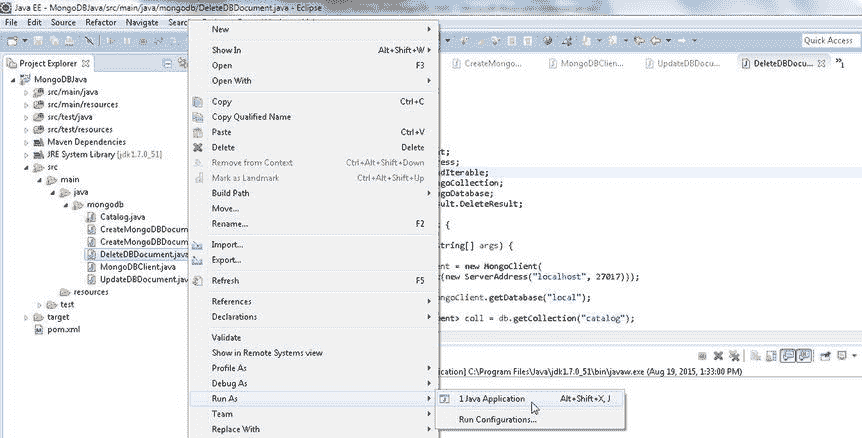
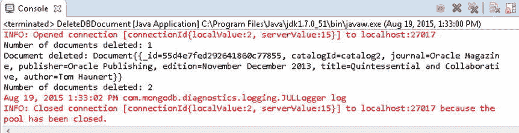

# 第 2 章

## 使用 Mongo Shell

7.  作为使用 `findOneAndDelete(Bson filter)` 方法的示例，删除 `catalogId` 为 `catalog2` 的文档。`findOneAndDelete()` 方法返回被删除的文档。输出被删除的文档。

```
    Document documentDeleted = coll.findOneAndDelete(new Document("catalogId", "catalog2"));
    System.out.println("Document deleted: " + documentDeleted);
    ```

8.  作为使用 `deleteMany(Bson filter)` 方法的示例，通过提供一个未指定键值对的 `Document` 对象作为方法参数，删除所有剩余的文档。随后，使用 `DeleteResult` 中的 `getDeletedCount()` 方法输出被删除文档的数量。

```
    DeleteResult result = coll.deleteMany(new Document());
    System.out.println("Number of documents deleted: "+ result.getDeletedCount());
    ```

9.  要验证文档已被删除，请使用 `find()` 方法查找所有文档，并按之前讨论的方式输出每个文档中的键值对。`DeleteDBDocument` 应用程序如下所列。

```
    package mongodb;

import java.util.Arrays;
import java.util.Iterator;
import java.util.Set;

import org.bson.Document;
import com.mongodb.MongoClient;
import com.mongodb.ServerAddress;
import com.mongodb.client.FindIterable;
import com.mongodb.client.MongoCollection;
import com.mongodb.client.MongoDatabase;
import com.mongodb.client.result.DeleteResult;

public class DeleteDBDocument {

public static void main(String[] args) {

MongoClient mongoClient = new MongoClient(
                Arrays.asList(new ServerAddress("localhost", 27017)));

MongoDatabase db = mongoClient.getDatabase("local");

MongoCollection<Document> coll = db.getCollection("catalog");
        Document catalog = new Document("catalogId", "catalog1")
                .append("journal", "Oracle Magazine")
                .append("publisher", "Oracle Publishing")
                .append("edition", "November December 2013")
                .append("title", "Engineering as a Service")
                .append("author", "David A. Kelly");
        coll.insertOne(catalog);

catalog = new Document("catalogId", "catalog2")
                .append("journal", "Oracle Magazine")
                .append("publisher", "Oracle Publishing")
                .append("edition", "November December 2013")
                .append("title", "Quintessential and Collaborative")
                .append("author", "Tom Haunert");
        coll.insertOne(catalog);

catalog = new Document("catalogId", "catalog3")
                .append("journal", "Oracle Magazine")
                .append("publisher", "Oracle Publishing")
                .append("edition", "November December 2013");
        coll.insertOne(catalog);

catalog = new Document("catalogId", "catalog4")
                .append("journal", "Oracle Magazine")
                .append("publisher", "Oracle Publishing")
                .append("edition", "November December 2013");
        coll.insertOne(catalog);

DeleteResult result = coll.deleteOne(
                new Document("catalogId", "catalog1"));

System.out.println("Number of documents deleted: "
                + result.getDeletedCount());

Document documentDeleted = coll
                .findOneAndDelete(new Document("catalogId", "catalog2"));
        System.out.println("Document deleted: " + documentDeleted);

result = coll.deleteMany(new Document());

System.out.println("Number of documents deleted: "
                + result.getDeletedCount());

FindIterable<Document> iterable = coll.find();

String documentKey = null;

for (Document document : iterable) {
            Set<String> keySet = document.keySet();
            Iterator<String> iter = keySet.iterator();
            while (iter.hasNext()) {
                documentKey = iter.next();
                System.out.println(documentKey);
                System.out.println(document.get(documentKey));

}
        }

mongoClient.close();
    }

}
    ```

10. 在运行应用程序之前，请在 mongo shell 中使用 `db.catalog.drop()` 命令删除 `catalog` 集合。要运行 `DeleteDBDocument` 应用程序，请在 Package Explorer 中右键单击 `DeleteDBDocument.java` 文件，然后选择运行方式  Java 应用程序，如 图 1-18 所示。



图 1-18. 运行 DeleteDBDocument.java 应用程序

`DeleteDBDocument.java` 应用程序的输出如 图 1-19 所示。



图 1-19. DeleteDBDocument.java 应用程序的输出

由于 `deleteOne()` 方法删除一个文档，在调用 `deleteOne()` 方法之后指示已删除的文档数量被输出为 1。使用 `findOneAndDelete()` 方法删除的文档被输出。`deleteMany()` 方法的删除计数被输出为 2，这是在 `DeleteDBDocument` 应用程序中添加的 4 个文档中删除 2 个后，`catalog` 集合中的文档数量。

## 总结

在本章中，我们使用了 MongoDB Java 驱动程序来访问 MongoDB 服务器并向数据库添加文档。随后，我们从数据库中获取文档，并对文档进行了更新和删除。在本章中，我们还介绍了 Mongo shell。在下一章中，我们将讨论 Mongo shell。


