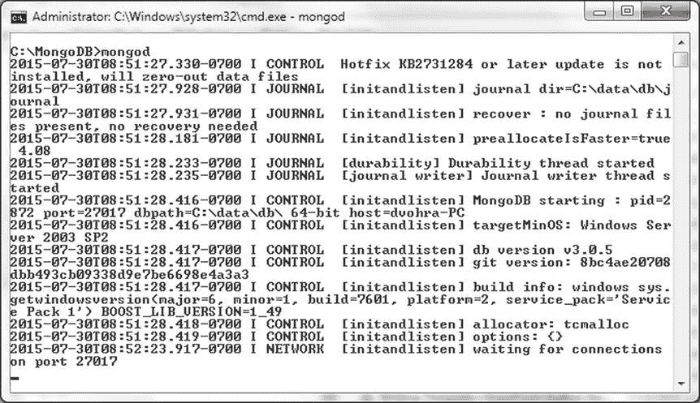
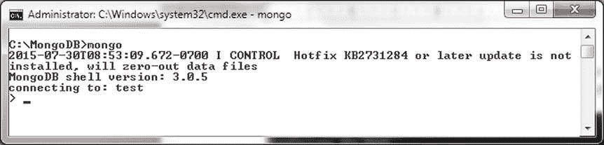
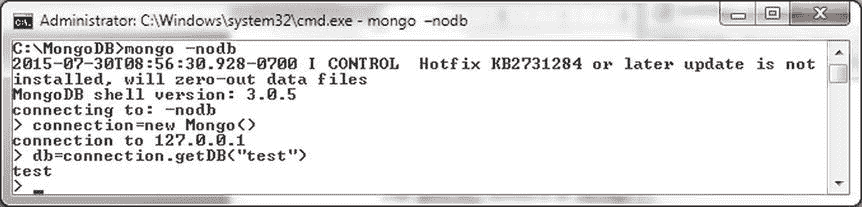
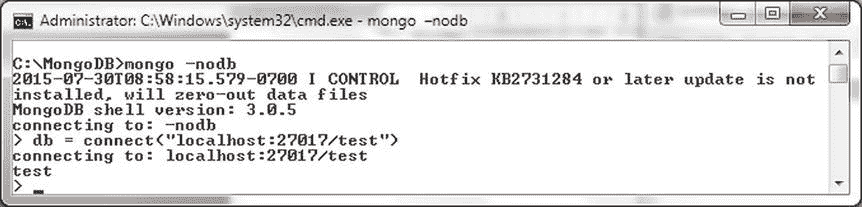
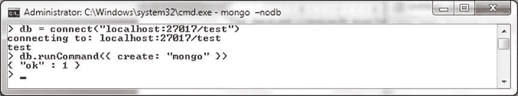
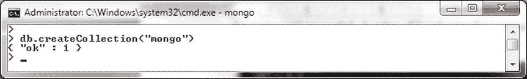

# MongoDB 数据库基础操作：Shell 环境、数据库、集合与文档

## 本章内容

*   入门指南
*   数据库操作
*   集合操作
*   文档操作

## 入门指南

在以下小节中，我们将设置环境，包括安装必需的软件。我们将启动 Mongo shell 并连接到 MongoDB 服务器，同时讨论如何在 Mongo shell 中运行命令。

## 环境设置

如果尚未安装，请从第 1 章下载并安装以下软件：

*   本章使用适用于 Windows 64 位的 MongoDB (3.0.5)。从`http://www.mongodb.org/downloads`下载二进制发行版。

双击 MongoDB 二进制发行版以安装 MongoDB。将 MongoDB 安装目录的`bin`目录添加到`PATH`环境变量中。为 MongoDB 数据创建目录`C:\data\db`。在命令窗口中使用以下命令启动 MongoDB 服务器。

```
>mongod
```

MongoDB 服务器启动，如图 2-1 所示。



图 2-1. 启动 MongoDB

## 启动 Mongo Shell

打开一个新的命令窗口。使用以下命令启动 Mongo shell。

```
>mongo
```

Mongo shell 启动并默认连接到`test`数据库，如图 2-2 所示。默认情况下，Mongo shell 连接到`localhost`上的 MongoDB，端口为 27017。



图 2-2. 启动 Mongo Shell

可能会生成类似“Hotifx KB2731284 或后续更新未安装，将清零数据文件”的消息。产生此消息的原因之一是 MongoDB 安装在目录路径包含空格的目录中，例如目录路径`C:\Program Files\MongoDB\Server\3.0`。如果消息是由带空格的目录路径引起的，可以忽略此消息。如果原因是未创建`C:\data\db`目录，请创建该目录。

要启动不连接任何数据库的 Mongo shell，请运行以下命令。在运行此命令前，请打开一个新的命令窗口，因为我们已经使用`mongo`命令连接过一次。

```
>mongo –nodb>
```

随后，可以使用 JavaScript `Mongo()`构造函数打开到 MongoDB 服务器的连接，该函数默认连接到`localhost`的端口 27017。

```
>connection=new Mongo()
```

可以使用 Mongo shell 中的`getDB()`方法设置数据库，如图 2-3 所示。

```
db=connection.getDB("test")
```



图 2-3. 初始时不连接数据库启动 Mongo Shell

上述命令的结果是，Mongo shell 连接到默认主机`localhost`和默认端口 27017 上的 MongoDB 服务器，并使用`test`数据库，这与直接运行`mongo`命令相同。使用`Mongo()`构造函数在连接到非默认主机和端口时很有用。

或者，可以在 Mongo shell 中使用`connect`方法连接到 MongoDB。使用`–nodb`选项启动 Mongo shell 后，使用以下命令连接到`localhost`和端口 27017 上的 MongoDB，并将数据库设置为`test`。

```
db = connect("localhost:27017/test");
```

`connect()`方法连接到 MongoDB 的`test`数据库，如图 2-4 所示。



图 2-4. 使用 connect()方法连接到 MongoDB

## 在 Mongo Shell 中运行命令或方法

可以在 Mongo shell 中运行以下类型的命令和方法。

*   数据库命令
*   Mongo shell JavaScript 辅助方法
*   Mongo shell 帮助方法

JavaScript 辅助方法与帮助方法之间的区别在于 JavaScript 辅助方法使用 JavaScript。数据库命令具有 BSON 文档格式，由键/值对组成，第一个键是命令名称，后续的键/值对是命令选项。例如，用于创建集合的`create`命令具有以下语法。

```
{ create: <collection_name>, option1:value, option2:value, option3:value,..optionN:value }
```

`create`命令提供以下选项（仅讨论主要选项）。

*   `capped`。设置为`boolean`值（true 或 false）以指定集合是否为固定集合。默认值为 false。如果设置为 true，则还需要 size 选项。固定集合是大小固定的集合，当达到最大大小时，较早的文档会被覆盖。
*   `autoIndexId`。设置为`boolean`值（`true`或`false`）以指定是否在`_id`字段上自动创建索引。默认值为`true`。
*   `size`。固定集合的最大大小（以字节为单位）。固定集合必需。
*   `max`。固定集合中的最大文档数。size 设置优先于 max 设置。例如，如果`size`为 3 且`max`为 4，则最大文档数为 3。

可以使用 Mongo shell 辅助方法`db.runCommand()`运行数据库命令。例如，可以使用 Mongo shell 中的以下辅助/包装 JavaScript 方法运行`create`命令来创建名为“mongo”的集合。

```
db.runCommand({ create: "mongo" })
```

命令响应是一个 JSON 文档，至少包含`ok`字段，该字段指示命令是否成功，如图 2-5 所示。值为 1 表示命令成功，值为 0 表示命令失败。



图 2-5. 使用 db.runCommand()辅助方法

`create`命令是那些具有等效 JavaScript shell 辅助方法`db.createCollection()`的命令之一。可以按如下方式创建`mongo`集合。

```
db.createCollection("mongo")
```

前面的命令返回一个 JSON 文档，其`ok`字段设置为 1，表示命令成功，如图 2-6 所示。



图 2-6. 使用 db.createCollection()辅助方法

如果前面的命令要在`db.runCommand`之后运行以创建`mongo`集合，则必须使用`db.mongo.drop()`命令删除该集合，以避免“集合已存在”错误消息，如图 2-7 所示。（请参阅本章后面的“删除集合”。）


