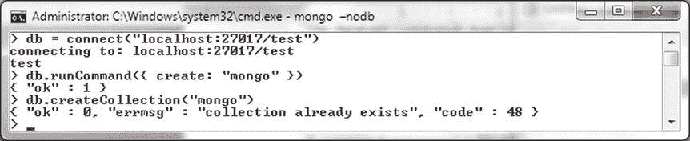
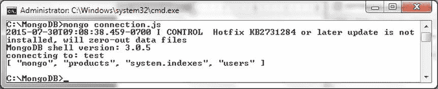
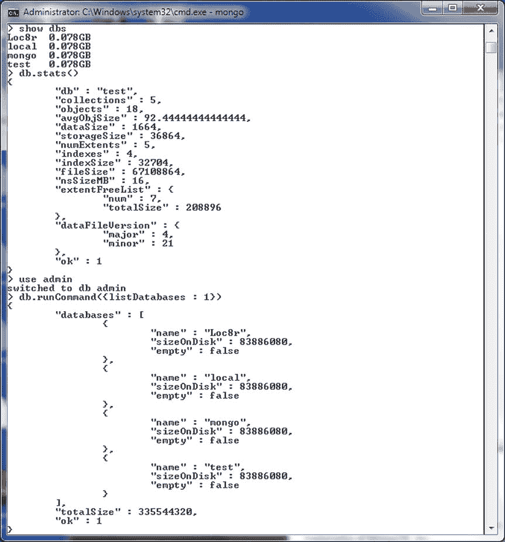
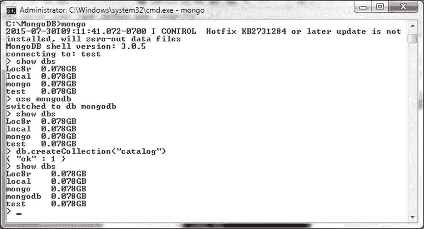
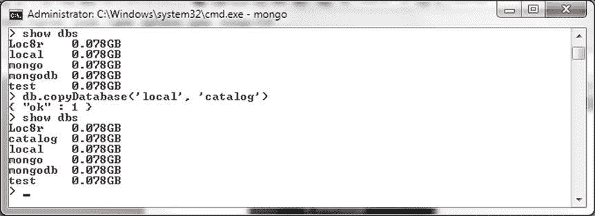
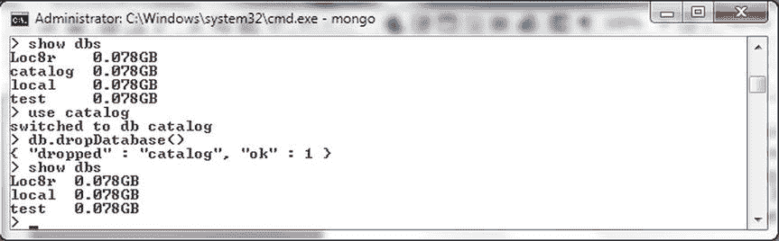
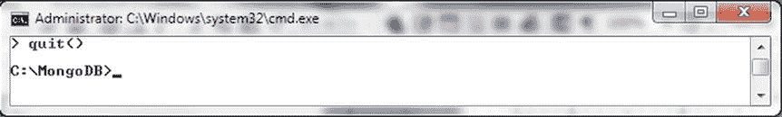
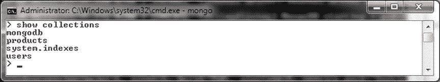
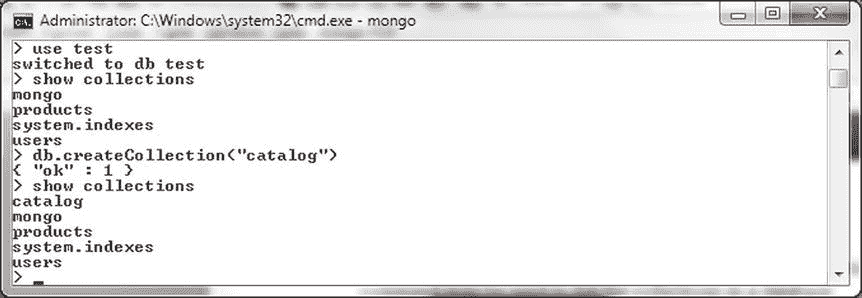

# 使用 MongoDB



图 2-7. “集合已存在”错误消息

数据库命令的完整参考可在 `http://docs.mongodb.org/v3.0/reference/command/` 获取，Mongo shell 辅助方法的完整参考可在 `http://docs.mongodb.org/v3.0/reference/method/` 获取。

JavaScript 方法也可以通过 JavaScript 文件运行。例如，将以下 JavaScript 代码复制到文件 `connection.js` 中，并将该文件放在将从其运行命令的目录 `C:\MongoDB` 下。

```javascript
connection = new Mongo();
db = connection.getDB("test");
printjson(db.getCollectionNames());
```

从命令行运行以下命令来执行该 JavaScript 文件。

```bash
>mongo connection.js
```

JavaScript 代码将被求值并生成输出，对于示例 JavaScript，输出如 图 2-8 所示，是一个集合名称的列表。



图 2-8. 运行 JavaScript 脚本

Mongo shell 还提供了一些帮助方法来获取有关数据库、集合和文档的信息。部分帮助方法列于下表 表 2-1 中。

表 2-1. 帮助方法

| 帮助命令 | 描述 |
| --- | --- |
| `show dbs` | 列出服务器上的数据库。 |
| `use <db>` | 选择一个数据库。在对集合或文档执行任何操作之前，必须先选择数据库。 |
| `show collections` | 列出数据库中的所有集合。 |

## 使用数据库

在以下小节中，我们将讨论获取有关数据库的信息、创建数据库和删除数据库。

## 获取数据库信息

Mongo shell 有一个名为 `db` 的变量，它引用当前数据库。默认情况下，当使用 `mongo` 命令启动 Mongo shell 时，如前面章节所述，`test` 数据库成为当前数据库。`show dbs` 命令列出服务器上的所有数据库。`db.stats()` Mongo shell 辅助方法列出当前数据库的统计信息。`listDatabases` 命令列出所有数据库，包括总大小、每个数据库的大小以及数据库是否为空。一些命令——管理命令，例如 `listDatabases` 命令——必须在 `admin` 数据库上运行。

```bash
>show dbs
>db.stats()
>use admin
>db.runCommand({listDatabases : 1})
```

前面命令的输出在 Mongo shell 中显示，如 图 2-9 所示。



图 2-9. 获取数据库信息

## 创建数据库实例

当向数据库实例发送命令并执行诸如创建集合之类的操作时，MongoDB 数据库实例会被隐式创建。`use <db>` 命令可用于选择当前数据库，即使该数据库尚不存在，但 `use <db>` 命令不会创建不存在的数据库。要创建数据库，必须在该数据库上运行一个操作。例如，使用 `show dbs` 命令列出所有数据库。随后，使用 `use mongodb` 命令将当前数据库选择为一个不存在的数据库 `mongodb`。接着，使用 `db.createCollection(name, options)` 辅助方法创建一个名为 `catalog` 的集合。

```bash
>show dbs
>use mongodb
>show dbs
>db.createCollection("catalog")
>show dbs
```

如果在 `use mongodb` 命令之后运行 `show dbs` 命令，则 `mongodb` 数据库不会被列出；但如果在 `db.createCollection()` 命令之后运行 `show dbs` 命令，则 `mongodb` 数据库会被列出，如 图 2-10 所示。



图 2-10. 创建数据库实例

`db.copyDatabase(fromdb, todb, fromhost, username, password, mechanism)` 命令可用于将一个数据库复制到另一个数据库。目标数据库会被创建。例如，将数据库 `local` 复制到一个名为 `catalog` 的新数据库。

```javascript
db.copyDatabase('local', 'catalog')
```

如果在 `db.copyDatabase()` 命令之前和之后运行 `show dbs` 命令，之后运行的命令会列出 `catalog` 数据库，如 图 2-11 所示。



图 2-11. 复制数据库实例

## 删除数据库

要删除当前数据库，请使用 `db.dropDatabase()` 方法。当前数据库是用 `use <db>` 命令设置的数据库。即使删除了数据库，当前数据库名称也不会改变，并且如果创建了一个新集合，它将在使用新数据文件的、与被删除数据库同名的数据库中创建。例如，使用 `show dbs` 命令列出所有数据库。随后，将当前数据库设置为列出的数据库之一，例如数据库 `catalog`。选择用于删除的数据库可以不同，不一定名为 `catalog`。接着，调用 `db.dropDatabase()` 方法删除当前数据库，即数据库 `mongo`。如果随后调用 `show dbs` 命令，则不会列出 `catalog` 数据库。

```bash
>show dbs
>use catalog
>db.dropDatabase()
>show dbs
```

`db.dropDatabase()` 方法返回一个包含字段 "dropped" 和 "ok" 的文档。"dropped" 字段的值是被删除的数据库，"ok" 字段值为 1 表示方法无错误返回，如 图 2-12 所示。



图 2-12. 删除数据库

要退出 Mongo shell，请运行 `quit()` 命令或 `exit` 命令。

```bash
>quit()
```

Mongo shell 会话结束，如 图 2-13 所示。



图 2-13. 结束 Mongo Shell 会话

## 使用集合

在以下小节中，我们将在 Mongo shell 中创建一个集合，随后删除一个集合。

### 创建集合

`create` 命令用于创建集合。我们之前已经讨论了使用 `create` 命令创建集合（参见“在 mongo Shell 中运行命令或方法”）。`show collections` 命令可用于列出数据库中的集合。

```bash
>use test
>show collections
```

数据库中的集合被列出，如 图 2-14 所示。



图 2-14. 使用 show collections 列出集合

列出的集合可能因用户而异，但无论用户是谁，都应列出 `system.indexes` 集合。一个集合只有在被创建之后才会被列出。例如，在 test 数据库中，先列出集合，然后运行 `db.createCollection()` 方法创建一个名为 `catalog` 的集合，之后再次列出集合。如果 `catalog` 集合已经存在，请使用 `db.catalog.drop()` 删除它。

```bash
>use test
>db.catalog.drop()
>show collections
>db.createCollection("catalog")
>show collections
```

在 `db.createCollection()` 方法之后运行的 `show collections` 命令会列出 `catalog` 集合，如 图 2-15 所示。列出的其他集合可能因用户而异。



图 2-15. 创建集合后运行 show collections

