# 固定集合

## 创建固定集合

一个 *capped* 集合是具有固定大小的集合，类似于循环列表。当固定集合已满时，数据会被覆盖。数据无法从固定集合中删除。例如，创建一个名为 `catalog` 的固定集合，启用自动索引，大小为 64 KB，最大文档数为 1000。在创建固定的 `catalog` 集合之前，使用 `db.catalog.drop()` 命令删除先前创建的同名集合（删除操作将在下一节详细讨论）。

```
>use test
>db.catalog.drop()
>db.createCollection("catalog", {capped: true, autoIndexId: true, size: 64 * 1024, max: 1000} )
```

返回的响应中 `ok` 字段为 1，表示固定集合已创建，如 图 2-16 所示。

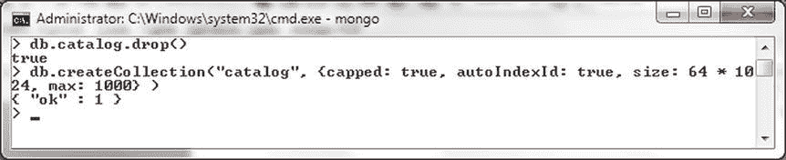

图 2-16. 创建固定集合

`create` 命令也可以使用 `db.runCommand()` 方法运行。同样地，如果 `catalog` 集合已存在，则先将其删除。如果已在使用 `test` 数据库，则无需重新运行 `use test` 命令。

```
>use test
>db.catalog.drop()
>db.runCommand( { create: "catalog", capped: true, size: 64 * 1024, max: 1000 } )
```

固定集合已创建，如 图 2-17 中所示的 `"ok": 1` 响应所示。

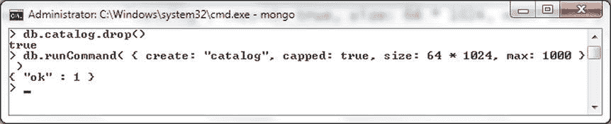

图 2-17. 使用 runCommand() 创建固定集合

集合不能已存在，否则会生成错误。例如，在 `catalog` 集合已存在时再次创建它。会输出“collection already exists”错误信息，如 图 2-18 所示。

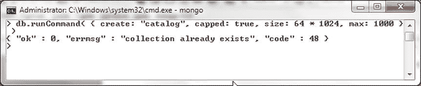

图 2-18. “集合已存在”错误信息

## 管理集合

可以使用辅助方法 `db.collection.count()` 列出集合中的文档数量。例如，以下方法列出了 `catalog` 集合中的文档计数。

```
>db.catalog.count()
```

输出为 0 表示尚未向 `catalog` 集合添加任何文档，如 图 2-19 所示。

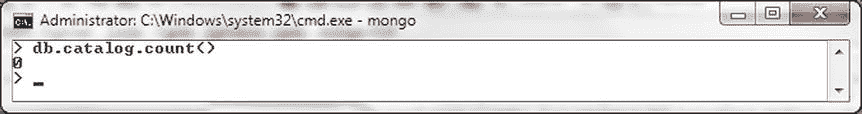

图 2-19. 列出文档计数

可以使用 `db.collection.stats()` 方法列出集合的统计信息。例如，以下方法列出了 `catalog` 集合的统计信息。

```
>db.catalog.stats()
```

集合统计信息输出包括集合命名空间（格式为 `<database>.<collection>`）、文档计数、集合是否为固定集合、存储大小、最大文档数等，如 图 2-20 所示。

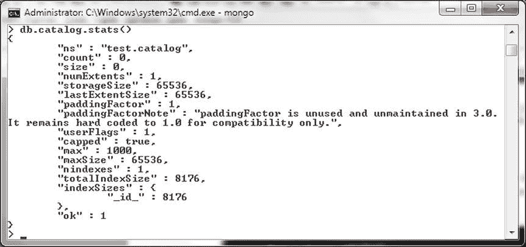

图 2-20. 使用 stats() 方法列出统计信息

可以使用 `db.collection.renameCollection(target, dropTarget)` 方法重命名集合。默认情况下，`dropTarget boolean` 为 `false`，表示如果已存在与新集合名同名的集合，则目标集合应被删除。例如，将 `mongo` 集合重命名为 `mongodb`。

```
>db.mongo.renameCollection('mongodb', false)
```

返回的 `"ok": 1` 响应表示 `mongo` 集合已被重命名，如 图 2-21 所示。如果在重命名后运行 `show collections` 命令，它将列出重命名后的集合 `mongodb`，而不是重命名前列出的 `mongo` 集合。

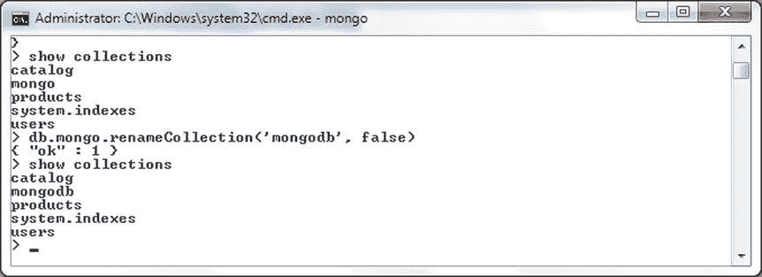

图 2-21. 重命名集合

## 删除集合

要从数据库中移除集合，请调用 `db.collection.drop()` 方法。例如，调用 `show collections` 命令列出所有集合。随后删除 `catalog` 集合。


## 使用文档

在接下来的小节中，我们将讨论添加文档、批量添加文档、查询文档、更新文档以及删除文档。

### 添加文档

本节我们将使用 `db.collection.insert()` 这个 JavaScript 方法，通过 Mongo shell 向 MongoDB 添加一个文档。`insert()` 辅助方法对于不同版本的 MongoDB 具有不同的语法，后续版本中添加了一些新功能，如 表 2-2 所列。

表 2-2. 插入辅助方法语法

| MongoDB 版本 | insert 方法语法 | 描述 |
| --- | --- | --- |
| 2.6 及更高版本 | `db.collection.insert(<document or array of documents>,{writeConcern: <document>,ordered:<boolean>})` | 添加了 `writeConcern` 和 ordered 选项——两者都是可选的。`writeConcern` 选项为“安全写入”提供不同级别的插入成功保证。ordered 选项接受一个布尔值，并按顺序插入文档，默认为 false。该插入方法对单个文档插入返回一个 `WriteResult` 对象，对文档数组插入返回一个 `BulkWriteResult` 对象。 |
| 2.2 | `db.collection.insert(<document or array of documents>)` | 支持添加单个文档或文档数组。 |
| 2.04 | `db.collection.insert(<document>)` | 仅支持添加一个文档。单个文档可以包含子文档。 |

要添加一个文档，请完成以下步骤：

### 1. 删除现有集合

在添加新文档或文档数组之前，如果 `catalog` 集合已存在，则将其删除。

```
>db.catalog.drop()
```

### 2. 创建文档

创建要添加的 BSON 文档结构。

```
>use catalog
>doc1 = {"catalogId" : "catalog1", "journal" : 'Oracle Magazine', "publisher" : 'Oracle Publishing', "edition" : 'November December 2013',"title" : 'Engineering as a Service',"author" : 'David A. Kelly'}
```

### 3. 插入文档

使用 `catalog` 集合，在文档上调用 `db.collection.insert()` 方法。

```
>db.catalog.insert(doc1)
```

### 4. 验证插入

随后运行 `db.collection.find()` 方法以查找 `catalog` 集合中的文档。

```
>db.catalog.find()
```

添加的单个文档会被列出，并包含 `_id` 字段。`_id` 字段在文档的 JSON 结构中并未指定，它在文档被添加到数据库之前会自动被添加。

`insert()` 方法返回的 `WriteResult` 对象包含 `nInserted` 字段，用以指示添加的文档数量。添加一个文档时，`nInserted` 字段的值为 1，如 图 2-23 所示。

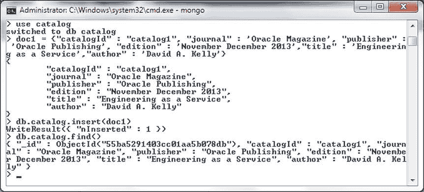

图 2-23. 使用插入方法添加文档

接下来，我们将添加一个在 BSON 文档结构中指定了 `_id` 字段的 BSON 文档。

### 5. 创建带 _id 的文档

指定与之前相同的文档，但额外添加一个 `_id` 字段。`_id` 字段的值必须是一个 `ObjectId` 对象。

```
>doc1 = {"_id": ObjectId("507f191e810c19729de860ea"), "catalogId" : "catalog1", "journal" : 'Oracle Magazine', "publisher" : 'Oracle Publishing', "edition" : 'November December 2013',"title" : 'Engineering as a Service',"author" : 'David A. Kelly'};
```

### 6. 插入带 _id 的文档

使用 `db.collection.insert` 方法添加该文档。


```
    >db.catalog.insert(doc1)
```

和之前一样，`insert()`方法返回一个`WriteResult`对象，其`nInserted`字段值为 1，表示已添加一个文档，如图 2-24 所示。

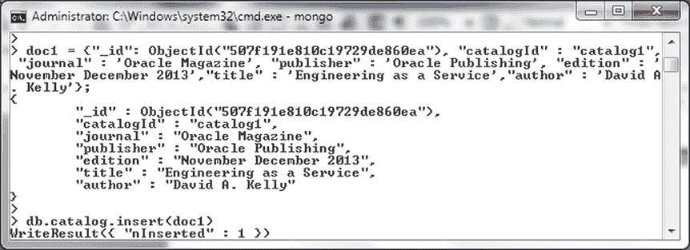

图 2-24. 添加包含 `_id` 字段的 BSON 文档

3.  接着运行 `db.catalog.find()` 方法以查找数据库中的文档。添加的文档会被列出，并包含文档中指定的 `_id` 字段，如图 2-25 所示。

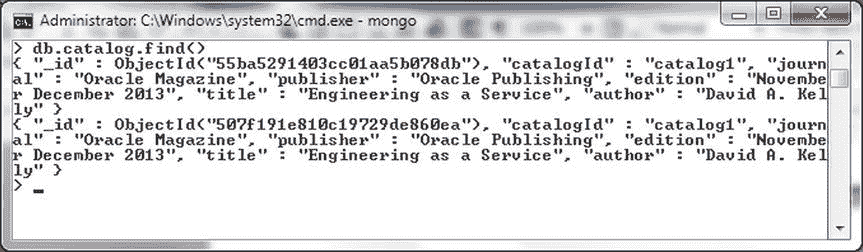

图 2-25. 列出包含 `_id` 字段的文档

对于任何版本的 MongoDB，`_id` 字段值在集合（collection）的文档中必须是唯一的。为了演示这一点，添加以下文档，其 `_id` 字段设置为 `ObjectId("507f191e810c19729de860ea")`。

```
>doc2 = {"_id": ObjectId("507f191e810c19729de860ea"),"catalogId" : 2, "journal" : 'Oracle Magazine', "publisher" : 'Oracle Publishing', "edition" : 'November December 2013'};
>db.catalog.insert(doc2)
```

再添加另一个 `_id` 字段设置为相同 `ObjectId` 值的文档。

```
>doc3 = {"_id": ObjectId("507f191e810c19729de860ea"),"catalogId" : 3};
>db.catalog.insert(doc3)
```

这会产生一个重复键错误，如图 2-26 所示。

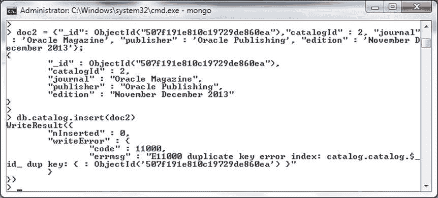

图 2-26. 重复键错误

添加一批文档

MongoDB 2.2 版本开始支持添加文档数组。在 2.2 之前的版本中，每次调用 `db.collection.insert()` 方法只能添加单个文档。要在 MongoDB 3.0.5 中添加一批文档，请指定或创建要添加的两个文档的 JSON，包括 `_id` 字段。

```
>doc1 = {"_id": ObjectId("507f191e810c19729de860ea"), "catalogId" : 'catalog1', "journal" : 'Oracle Magazine', "publisher" : 'Oracle Publishing', "edition" : 'November December 2013',"title" : 'Engineering as a Service',"author" : 'David A. Kelly'}
>doc2 = {"_id" : ObjectId("53fb4b08d17e68cd481295d5"), "catalogId" : 'catalog2', "journal" : 'Oracle Magazine', "publisher" : 'Oracle Publishing', "edition" : 'November December 2013',"title" : 'Quintessential and Collaborative',"author" : 'Tom Haunert'}
```

删除 `catalog` 集合，然后使用文档数组作为 `catalog` 集合来调用 `db.catalog.insert()` 方法。

```
>db.catalog.drop()
>db.catalog.insert([doc1, doc2])
```

`insert()` 方法返回一个 `BulkWriteResult` 对象，其中包含一个 `nInserted` 字段，表示添加的文档数量。数组中的两个文档作为两个不同的文档被添加，`nInserted` 字段值为 2 即表明了这一点。随后运行 `db.collection.find()` 方法以查找 `catalog` 集合中的文档。

```
>db.catalog.find()
```

集合方法 `find()` 列出了两个不同的文档，如图 2-27 所示。

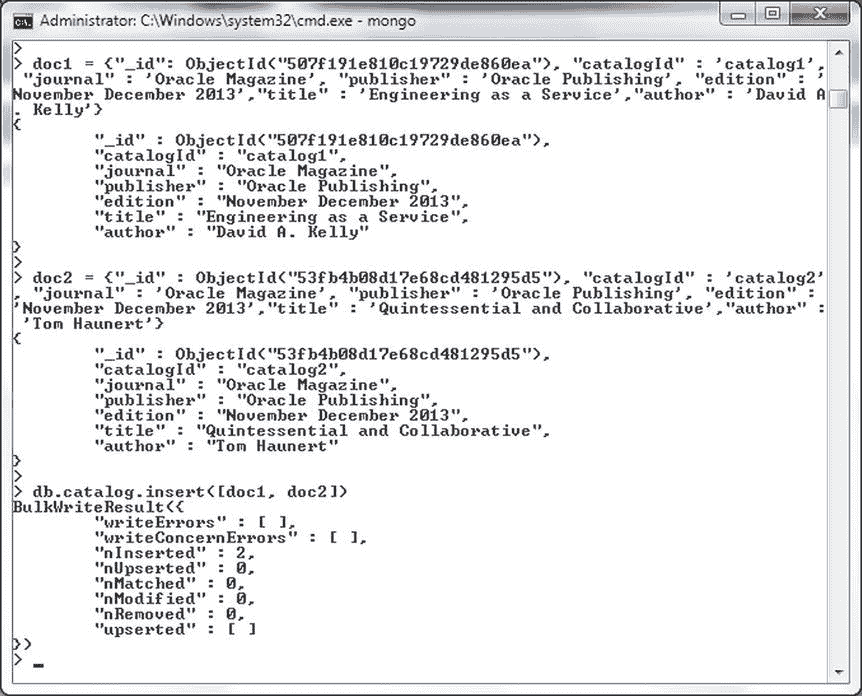

图 2-27. 添加一批文档

MongoDB 2.6 的 Mongo shell 增加了两个新选项的支持：`writeConcern` 和 `ordered`。接下来，我们将演示这些选项的用法。`writeConcern` 选项文档支持表 2-3 中列出的选项。

表 2-3. 插入方法选项

| 选项 | 描述 |
| --- | --- |
| `w` | 指定写入关注级别。 |
| `j` | 确认 MongoDB 已将数据写入磁盘上的日志。布尔值，默认值为 false。MongoDB 不能以 `–nojournal` 选项运行。 |
| `wtimeout` | 适用于 `w` 值大于 1 的情况，指定写入关注的时间限制（毫秒）。写入关注是 MongoDB 在报告操作成功时提供的保证。 |

写入关注级别 `w` 可以设置为表 2-4 中列出的值。

表 2-4. 写入关注级别值

| w 值 | 描述 |
| --- | --- |
| `1` | 对独立 MongoDB 或副本集中的主节点提供写入关注确认。默认值。 |
| `0` | 禁用写入操作的确认。 |
| `majority` | 确认写入操作已传播到大多数副本集成员。 |
| 大于 `1` 的数字 | 确认写入操作已传播到指定数量的副本集成员。 |
| `标签集` | 以细粒度方式指定哪些副本集成员必须确认写入操作。 |

接下来，我们将使用 `writeConcern` 和 `ordered` 选项添加一批文档。指定要添加的三个 BSON 文档。

```
doc1 = {"_id": ObjectId("507f191e810c19729de860ea"), "catalogId" : 2, "journal" : 'Oracle Magazine', "publisher" : 'Oracle Publishing', "edition" : 'November December 2013',"title" : 'Engineering as a Service',"author" : 'David A. Kelly'}
doc2 = {"_id" : ObjectId("53fb4b08d17e68cd481295d5"), "catalogId" : 1, "journal" : 'Oracle Magazine', "publisher" : 'Oracle Publishing', "edition" : 'November December 2013',"title" : 'Quintessential and Collaborative',"author" : 'Tom Haunert'}
doc3 = {"_id" : ObjectId("53fb4b08d17e68cd481295d6"), "catalogId" : 3, "journal" : 'Oracle Magazine', "publisher" : 'Oracle Publishing', "edition" : 'November December 2013'}
```

使用 `db.collection.insert()` 方法和一个 `writeConcern`（`w` 设置为 `majority`，`wtimeout` 设置为 5000）以及 `ordered` 选项设置为 `true` 来添加文档数组。同样，在运行 `db.catalog.insert()` 命令之前，先删除 `catalog` 集合。

```
>db.catalog.drop()
>db.catalog.insert([doc3, doc1, doc2],  { writeConcern: { w: "majority", wtimeout: 5000 }, ordered:true })
```

将返回一个 `BulkWriteResult` 对象，其 `nInserted` 值为 3，如图 2-28 所示。

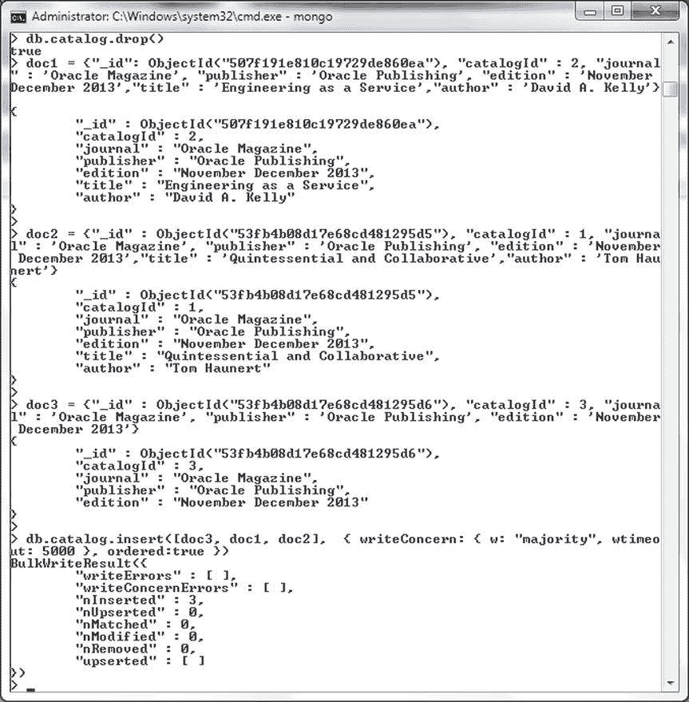

图 2-28. 使用 writeConcern 选项

随后调用 `db.catalog.find()` 来列出添加的三个文档。文档按照添加时文档数组中指定的顺序列出，如图 2-29 所示。

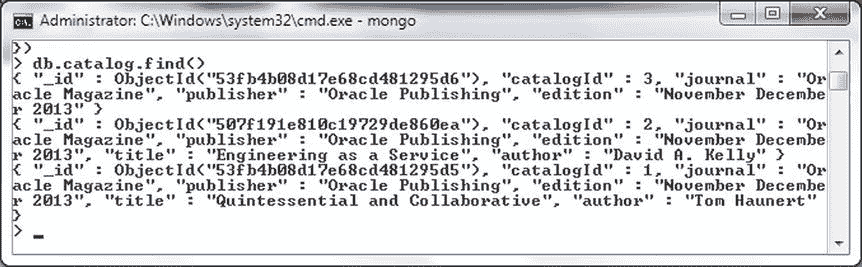

图 2-29. 使用 find() 列出文档

当主机不是副本集的成员时，不能使用非 `majority` 的 `w` 值（例如 1）。例如，运行以下命令。

```
>db.catalog.drop()
>db.catalog.insert([doc3, doc1, doc2],  { writeConcern: { w: "1", wtimeout: 5000 }, ordered:true })
```

正如错误消息所示，`w` 不能为 1，如图 2-30 所示。

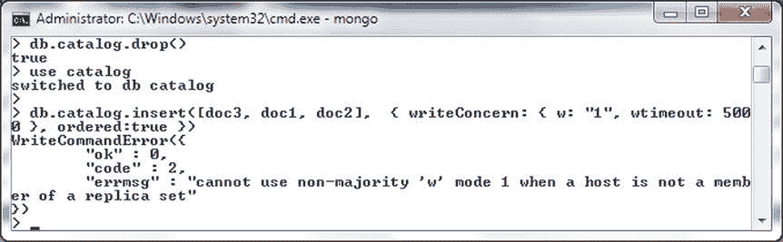

图 2-30. 错误消息 “cannot use non-majority”

保存文档

`db.collection.save()` 方法用于保存文档，这与 `db.collection.insert()` 方法不同，因为 insert 方法总是添加新文档，或者如果数据库中已存在具有相同 `_id` 字段的文档，则抛出错误。相反，`db.collection.save()` 方法如果数据库中已存在具有相同 `_id` 的文档，则更新该文档；如果不存在具有相同 `_id` 的文档，则添加新文档。当数据库中已存在具有相同 `_id` 的文档时，save 方法会用新文档完全替换旧文档。`db.collection.save()` 方法在 MongoDB 2.6 版本中进行了修订。下表，表 2-5，列出了 MongoDB 2.4 和 MongoDB 2.6（及更高版本）的 `save()` 方法。

表 2-5. Save 方法


