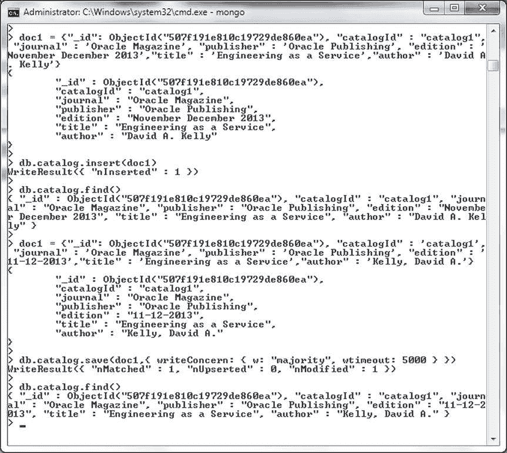
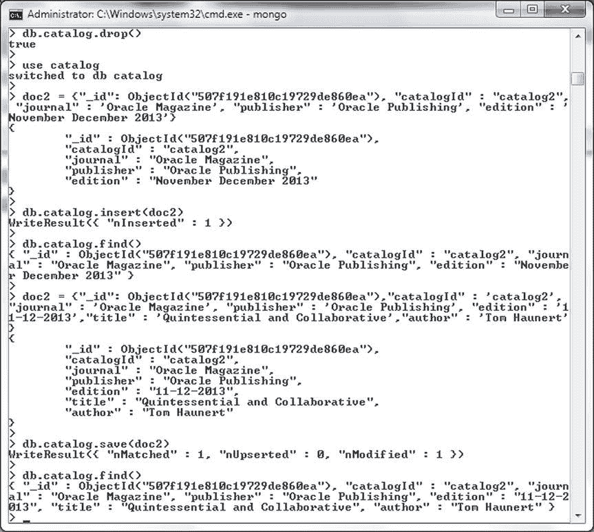
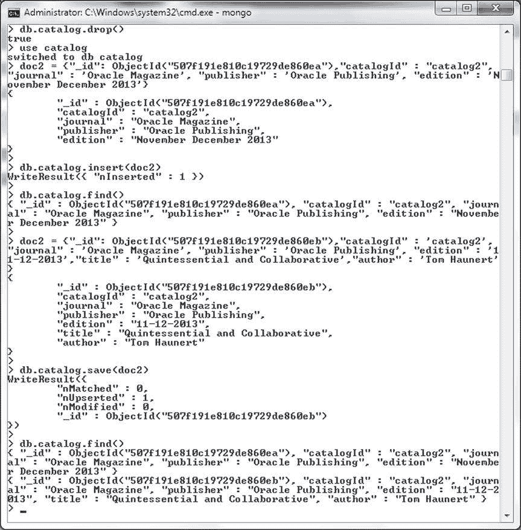

# 使用 save()方法操作 MongoDB 文档示例

| MongoDB 版本 | Save 方法 | 描述 |
| --- | --- | --- |
| 2.4 | `db.collection.save(document)` | 保存一个文档。 |
| 2.6 及更高版本 | `db.collection.save(<document>,{writeConcern: <document>})` | 将文档保存到集合中。`writeConcern` 是一个新增的方法参数。 |

本节将演示 `save()` 方法的不同用法。首先，我们将使用 `save()` 方法更新一个文档。使用 `db.collection.insert()` 方法在 `catalog` 集合中添加以下文档。

## 示例一：更新现有文档

1.  在添加文档之前，先删除 `catalog` 集合并将当前数据库设置为 `catalog`。

    ```javascript
    >db.catalog.drop()
    >use catalog
    >doc1 = {"_id": ObjectId("507f191e810c19729de860ea"), "catalogId" : "catalog1", "journal" : 'Oracle Magazine', "publisher" : 'Oracle Publishing', "edition" : 'November December 2013',"title" : 'Engineering as a Service',"author" : 'David A. Kelly'}
    >db.catalog.insert(doc1)
    ```

2.  `db.collection.insert()` 方法添加文档，并返回一个 `WriteResult` 对象，其 `nInserted` 字段值为 1。调用 `db.collection.find()` 方法列出添加的文档。

    ```javascript
    >db.catalog.find()
    ```

3.  接着，构造一个与添加的文档具有相同 `_id` 但某些字段不同的文档。

    ```javascript
    >doc1 = {"_id": ObjectId("507f191e810c19729de860ea"), "catalogId" : 'catalog1', "journal" : 'Oracle Magazine', "publisher" : 'Oracle Publishing', "edition" : '11-12-2013',"title" : 'Engineering as a Service',"author" : 'Kelly, David A.'}
    ```

4.  调用 `db.collection.save()` 方法保存修改了部分字段的文档。如果指定了 `writeConcern` 选项，则会被忽略。

    ```javascript
    >db.catalog.save(doc1,{ writeConcern: { w: "majority", wtimeout: 5000 } })
    ```

5.  `db.collection.save()` 方法保存文档，并返回一个 `WriteResult` 对象，其 `nMatched` 和 `nModified` 字段值均为 1。因为使用了相同的 `_id` 字段值，该文档被更新或修改为新文档的内容。随后，在 `catalog` 集合上调用 `db.collection.find()` 方法，列出先前添加并随后保存的文档。

    ```javascript
    >db.catalog.find()
    ```

通过 `db.collection.insert()` 添加并随后通过 `db.collection.save()` 保存的文档被列出。保存（更新后）的文档中，`edition` 字段和 `author` 字段已被修改，如 图 2-31 所示。



图 2-31. 使用 `save()` 方法更新文档

在前面的例子中，用 `save()` 方法保存的文档与用 `insert()` 方法添加的文档具有完全相同的字段。在下一个例子中，我们将在 `save` 方法保存的文档中添加新字段，而不是在 `insert` 方法添加的文档中。

## 示例二：为文档添加新字段

1.  构造一个包含 `_id` 字段、`catalogId` 字段、`journal` 字段、`publisher` 字段和 `edition` 字段，但不包含 `title` 和 `author` 字段的 BSON 文档。

    ```javascript
    doc2 = {"_id": ObjectId("507f191e810c19729de860ea"), "catalogId" : "catalog2", "journal" : 'Oracle Magazine', "publisher" : 'Oracle Publishing', "edition" : 'November December 2013'}
    ```

2.  使用 `db.collection.insert()` 方法将文档添加到 `catalog` 集合中。在运行命令之前，先删除 `catalog` 集合。

    ```javascript
    >db.cataog.drop()
    >db.catalog.insert(doc2)
    ```

3.  `insert()` 方法返回一个 `WriteResult` 对象，其 `nInserted` 字段值为 1。随后在 `catalog` 集合上调用 `db.collection.find()` 方法会列出该文档。

    ```javascript
    >db.catalog.find()
    ```

4.  添加文档后，接下来我们将使用 `save()` 方法更新该文档。构造一个文档，其包含与 `insert()` 方法添加的文档完全相同的字段和字段值，包括 `_id` 字段以及新增的 `title` 和 `author` 字段。

    ```javascript
    >doc2 = {"_id": ObjectId("507f191e810c19729de860ea"),"catalogId" : 'catalog2', "journal" : 'Oracle Magazine', "publisher" : 'Oracle Publishing', "edition" : '11-12-2013',"title" : 'Quintessential and Collaborative',"author" : 'Tom Haunert'}
    ```

5.  使用 `db.collection.save()` 方法将文档保存到 `catalog` 集合中。在运行以下命令前**不要**删除 `catalog` 集合，因为我们正在保存（并修改）与之前添加的同一个文档。

    ```javascript
    >db.catalog.save(doc2)
    ```

6.  `save()` 方法修改了文档，添加了 `title` 和 `author` 字段。`save()` 方法返回一个 `WriteResult` 对象，其 `nInserted` 和 `nModified` 字段值均为 1。随后调用 `db.collection.find()` 方法列出文档。

    ```javascript
    >db.catalog.find()
    ```

修改后的文档被列出，并包含新增的两个字段，如 图 2-32 所示。文档已被修改。



图 2-32. 使用 `save()` 方法更新文档并添加新字段

在前面所有的 `save()` 示例中，我们都在用 `insert()` 添加的文档中指定了 `_id` 字段，然后在用 `save` 方法保存时使用了相同的 `_id`。在下一个使用 `save()` 方法的例子中，我们将使用一个与 `insert()` 方法添加的文档不同的 `_id` 字段值来调用 `save()` 方法。像之前一样构造一个 BSON 文档，并使用 `insert()` 方法添加该文档。在运行示例前删除 `catalog` 集合。

## 示例三：执行 Upsert 操作

1.  随后调用 `db.collection.find()` 方法列出添加的文档。

    ```javascript
    >db.catalog.drop()
    >doc2 = {"_id": ObjectId("507f191e810c19729de860ea"),"catalogId" : "catalog2", "journal" : 'Oracle Magazine', "publisher" : 'Oracle Publishing', "edition" : 'November December 2013'}
    > db.catalog.insert(doc2)
     >db.catalog.find()
    ```

2.  接着，构造另一个具有相同字段和字段值，但 `_id` 字段值不同的文档。使用 `save` 方法保存该文档。

    ```javascript
     >doc2 = {"_id": ObjectId("507f191e810c19729de860eb"),"catalogId" : 'catalog2', "journal" : 'Oracle Magazine', "publisher" : 'Oracle Publishing', "edition" : '11-12-2013',"title" : 'Quintessential and Collaborative',"author" : 'Tom Haunert'}
     >db.catalog.save(doc2)
    ```

3.  随后在 `catalog` 集合上调用 `db.collection.find()` 方法。

    ```javascript
    db.catalog.find()
    ```

因为使用 `save()` 方法保存的文档具有不同的 `_id` 字段值，所以添加了一个新文档，`find()` 列出了两个文档，如 图 2-33 所示。



图 2-33. 使用 `save()` 执行 Upsert 操作

`WriteResult` 中的 `nUpserted` 为 1。`Upsert` 是一个术语，表示当没有文档匹配一个可能匹配并更新文档的查询文档时执行的插入操作。`Upsert` 用于在找到匹配文档时修改或更新文档的操作上下文中。`insert()` 方法不修改或更新文档，因此 `upsert` 一词不能用于 `insert()` 方法的上下文中。`save()` 和 `update()` 方法确实会修改或更新文档，因此 `upsert` 用于这些方法的上下文中。

当在 `insert()` 添加的文档中使用了新的 `_id` 字段，并随后用 `save()` 方法保存时，这个过程称为对文档执行 `upserting`。

当在 `insert()` 的文档中未指定 `_id` 字段，并随后用 `save()` 保存时，执行的是 `insert` 操作，而非 `upsert`。接下来，我们将讨论一个使用 `save()` 方法执行插入的例子。


