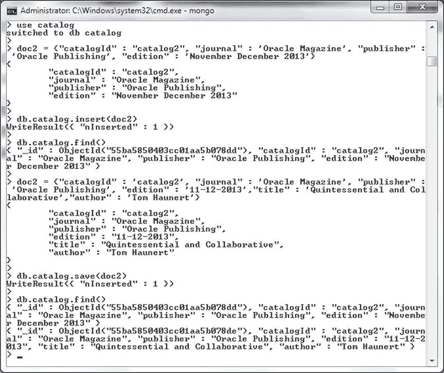
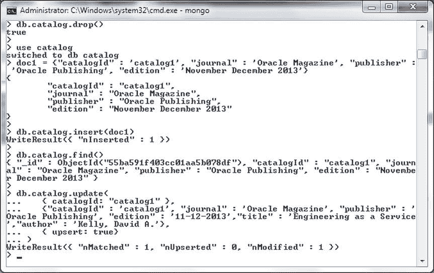
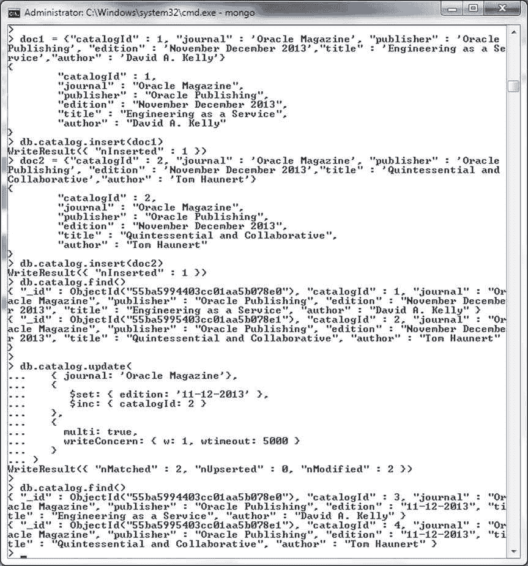

# MongoDB 文档操作

## 插入文档

1.  像之前一样构建一个文档，但不包含 `_id` 字段。使用 `insert()` 方法添加文档。随后调用 `find()` 方法列出该文档。像之前一样删除 `catalog` 集合。

    ```javascript
    >db.catalog.drop()
    >doc2 = {"catalogId" : “catalog2”, "journal" : 'Oracle Magazine', "publisher" : 'Oracle Publishing', "edition" : 'November December 2013'}
    >db.catalog.insert(doc2)
    >db.catalog.find()
    ```

2.  接下来，构建另一个文档，其中修改了 `edition` 字段，并新增了 `title` 和 `author` 两个字段。

    ```javascript
    >doc2 = {"catalogId" : 'catalog2', "journal" : 'Oracle Magazine', "publisher" : 'Oracle Publishing', "edition" : '11-12-2013',"title" : 'Quintessential and Collaborative',"author" : 'Tom Haunert'}
    ```

3.  在更新后的文档上调用 `save()` 方法。

    ```javascript
    >db.catalog.save(doc2)
    ```

4.  随后调用 `find()` 方法不会列出更新后的文档，而是列出两个文档。

    ```javascript
    >db.catalog.find()
    ```

因为使用 `insert()` 添加的文档和使用 `save()` 保存的文档都不包含 `_id` 字段，所以会添加一个新文档，并通过 `find()` 列出，如 图 2-34 所示。返回的 `WriteResult` 对象有一个值为 1 的 `nInserted` 字段，表明已添加一个文档。



图 2-34。使用 `save()` 插入文档

### 更新文档

在本节中，我们将更新一个文档。`db.collection.update()` JavaScript 方法用于更新文档。该方法在 MongoDB 2.2 和 2.6 版本中有所修订。不同版本的方法如 表 2-6 所示。

表 2-6。`update()` 方法的不同版本

| 版本 | 方法 | 描述 |
| --- | --- | --- |
| 2.2 之前 | `db.collection.update(query, update, <upsert>, <multi>)` | `<upsert>` 和 `<multi>` 是位置布尔选项。 |
| 2.2 | `db.collection.update(query, update, options)` 或 `db.collection.update(<query>,<update>,{ upsert: <boolean>, multi: <boolean> })` | 为 `<upsert>` 和 `<multi>` 选项添加了 `options` 文档类型参数。 |
| 2.6 及之后 | `db.collection.update(query, update, options)` 或 `db.collection.update(<query>,<update>,{ upsert: <boolean>, multi: <boolean>, writeConcern: <document> })` | `options` 参数增加了 `writeConcern` 选项。同时，该方法返回一个包含操作状态的 `WriteResult`。 |

`update()` 方法的参数（包括可选参数 `options`）在 表 2-7 中讨论。

表 2-7。`update` 方法参数

| 选项 | 类型 | 描述 |
| --- | --- | --- |
| `query` | document | 用于选择要更新的文档的查询条件。 |
| `update` | document | 要应用的更新或修改。 |
| `upsert` | Boolean | 如果设置为 `true`，当未找到符合选择条件的文档时，会插入一个新文档。默认为 `false`。 |
| `multi` | Boolean | 如果设置为 `true`，当找到多个符合选择条件的文档时，会更新多个文档。 |
| `writeConcern` | document | 指定写关注（write concern）。写关注在本章前面已讨论过。 |

接下来，我们将更新一个文档。首先，我们将使用 `insert()` 方法添加一个文档，随后使用 `update` 方法更新添加的文档。

1.  在 mongo 命令 shell 中运行以下命令来添加文档。在运行命令之前，先删除 `catalog` 集合。

    ```javascript
    >db.catalog.drop()
    >doc1 = {"catalogId" : 'catalog1', "journal" : 'Oracle Magazine', "publisher" : 'Oracle Publishing', "edition" : 'November December 2013'}
    >db.catalog.insert(doc1)
    ```

2.  随后运行以下命令来查找添加的文档。

    ```javascript
    >db.catalog.find()
    ```

3.  要更新文档，需调用 `update()` 方法，为 `edition` 字段提供修改后的值，并添加新的 `title` 和 `author` 字段。包含 `options` 参数，其中 `upsert` 选项设置为 `true`。

    ```javascript
    db.catalog.update(
       { catalogId: "catalog1" },
       {"catalogId" : 'catalog1', "journal" : 'Oracle Magazine', "publisher" : 'Oracle Publishing', "edition" : '11-12-2013',"title" : 'Engineering as a Service',"author" : 'Kelly, David A.'},
       { upsert: true}
    )
    ```

4.  随后再次调用 `find()` 方法。

    ```javascript
    >db.catalog.find()
    ```

文档被更新，并返回一个 `WriteResult` 对象。`WriteResult` 对象中的 `nMatched` 字段值为 1，`nUpserted` 为 0，`nModified` 为 1，如 图 2-35 所示。



图 2-35。使用 `update()` 方法更新文档

如果在 `update` 参数中使用了键值表达式，则会用 `update` 参数中的文档完全替换原文档。如果在 `update()` 方法中使用了诸如 `$set` 之类的更新操作符表达式，则仅替换更新操作符表达式中指定的字段，而不是整个文档。如果 `update` 参数包含更新操作符表达式，则它不能包含字段键值表达式。

### 更新多个文档

`update()` 方法默认更新单个文档。要更新多个文档，请使用 `multi` 参数。`update()` 方法要更新多个文档的一个要求是使用更新操作符表达式。如果 `update()` 方法仅指定字段:值表达式，则无法更新多个文档。

接下来，我们将在 MongoDB 3.0.5 中更新多个文档。

1.  首先通过调用 `db.catalog.drop()` 删除之前添加的 `catalog` 集合。使用 `db.collection.insert()` 方法向 `catalog` 集合添加两个文档。随后使用 `db.collection.find()` 方法列出 `catalog` 集合中的文档。

    ```javascript
    > db.catalog.drop()
    >use catalog
    >doc1 = {"catalogId" : 1, "journal" : 'Oracle Magazine', "publisher" : 'Oracle Publishing', "edition" : 'November December 2013',"title" : 'Engineering as a Service',"author" : 'David A. Kelly'}
    db.catalog.insert(doc1)
    >doc2 = {"catalogId" : 2, "journal" : 'Oracle Magazine', "publisher" : 'Oracle Publishing', "edition" : 'November December 2013',"title" : 'Quintessential and Collaborative',"author" : 'Tom Haunert'}
    >db.catalog.insert(doc2)
    >db.catalog.find()
    ```

2.  接下来，调用 `db.collection.update()` 方法，使用包含 `$set`（更新 `edition` 字段）和 `$inc`（更新 `catalogId` 字段）的更新操作符表达式。在 `options` 参数中，指定 `multi` 选项为 `true`，同时也指定 `writeConcern` 选项。尽管为 `w:1` 指定了 `wtimeout`，但它仅适用于 w>1 的情况，对于 w:1 会被忽略。随后调用 `db.catalog.find()` 方法列出更新后的文档。

    ```javascript
    >db.catalog.update(
       { journal: 'Oracle Magazine'},
       {
          $set: { edition: '11-12-2013' },
          $inc: { catalogId: 2 }
       },
       {
         multi: true,
         writeConcern: { w: 1, wtimeout: 5000 }
       }
    )
    >db.catalog.find()
    ```

从 `update()` 方法的输出表明，两个文档被匹配并更新，如 图 2-36 所示。



图 2-36。使用 `update()` 方法更新多个文档

## 查询单个文档

可以使用 `findOne()` 方法从集合中查询单个文档。`findOne()` 方法的语法如下。

```
db.collection.findOne(query, <projection>)
```


