# MongoDB 查询操作：findOne() 与 find()

方法的所有参数均为可选。`query` 参数用于指定查询的选择条件，其类型为文档（document）。`<projection>` 参数用于指定要返回的字段。`query` 和 `<projection>` 参数的类型均为文档（`document`）。默认情况下，将返回所有字段。如果多个文档满足选择条件，或者未指定选择条件且集合中有多个文档，则返回匹配到的第一个文档。

接下来，我们将添加两个文档，并使用不带参数的 `findOne()` 方法来查找一个文档。

1.  删除 `catalog` 集合，并使用 `db.collection.insert()` 方法向 `catalog` 集合添加两个文档。

```
>db.catalog.drop()
>doc1 = {"catalogId" : "catalog1", "journal" : 'Oracle Magazine', "publisher" : 'Oracle Publishing', "edition" : 'November December 2013',"title" : 'Engineering as a Service',"author" : 'David A. Kelly'}
>db.catalog.insert(doc1)
>doc2 = {"_id": ObjectId("507f191e810c19729de860ea"),"catalogId" :"catalog2", "journal" : 'Oracle Magazine', "publisher" : 'Oracle Publishing', "edition" : 'November December 2013'}
>db.catalog.insert(doc2)
```

2.  使用 `findOne()` 方法查找一个文档。

```
>db.catalog.findOne()
```

两个文档中的一个会被返回，如图 2-37 所示。

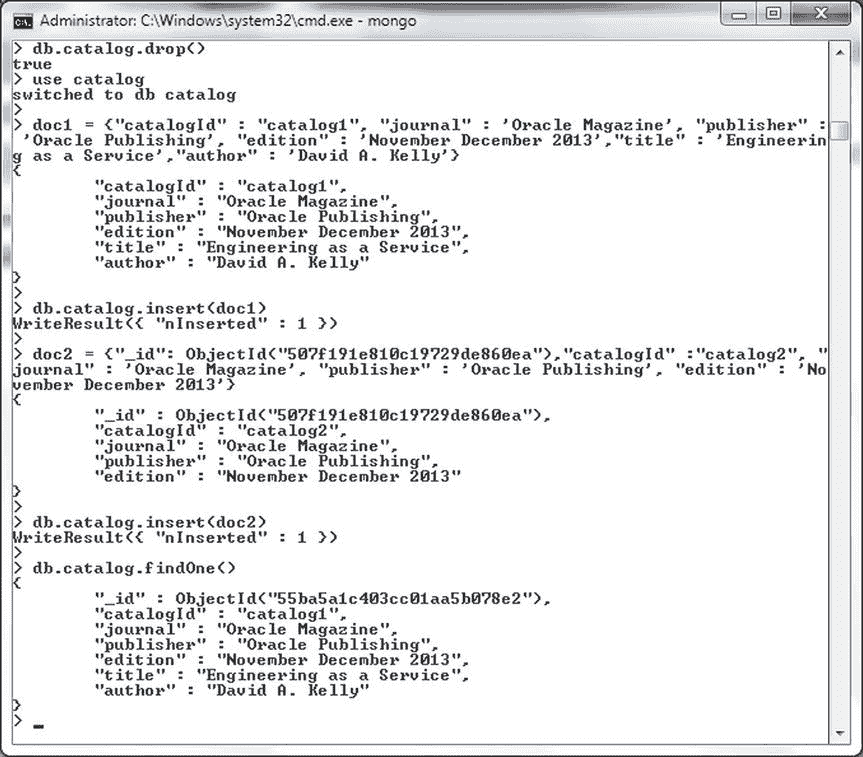
图 2-37. 查找单个文档

### 查找所有文档

要查找所有文档，必须使用 `find()` 方法。`find()` 方法的语法如下。

```
db.collection.find(query, <projection>)
```

`query` 参数指定查询的选择条件，`<projection>` 参数指定要返回的字段。这些参数都不是必需的，且类型均为文档。`find()` 方法实际上返回一个游标（cursor），如果在 MongoDB shell 中调用该方法，游标会自动迭代以显示前 20 个文档。要在 shell 中迭代剩余的文档，请指定该游标。

要在 `catalog` 集合中查找之前添加且未被删除的所有文档，请运行 `find()` 方法。

```
>db.catalog.find()
```

`catalog` 集合中的所有文档都将被返回，如图 2-38 所示。为了区分 `findOne()` 方法返回的单个文档和 `find()` 方法返回的所有文档，下面列出了 `findOne()` 和 `find()` 的结果。

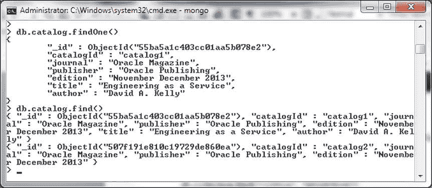
图 2-38. 使用 find() 方法查找所有文档

## 查找选定字段

如前所述，`find()` 和 `findOne()` 方法都支持 `<projection>` 参数。`<projection>` 参数指定要返回的字段，其文档语法如下。

```
{ field1: <boolean>, field2: <boolean> ... }
```

要包含一个字段，请将对应的 `boolean` 值设置为 true 或 1。要排除一个字段，请将其设置为 `false` 或 0。例如，使用 `insert()` 方法向 `catalog` 集合添加两个文档。但首先需要删除 `catalog` 集合。

```
>db.catalog.drop()
>doc1 = {"catalogId" : 1, "journal" : 'Oracle Magazine', "publisher" : 'Oracle Publishing', "edition" : 'November December 2013',"title" : 'Engineering as a Service',"author" : 'David A. Kelly'}
>db.catalog.insert(doc1)
>doc2 = {"catalogId" : 2, "journal" : 'Oracle Magazine', "publisher" : 'Oracle Publishing', "edition" : 'November December 2013',"title" : 'Quintessential and Collaborative',"author" : 'Tom Haunert'}
>db.catalog.insert(doc2)
```

随后调用 `findOne()` 方法，将 `query` 参数设置为空文档，并将 `<projection>` 参数设置为包含 `edition`、`title` 和 `author` 字段。

```
>db.catalog.findOne(
    {  },
{ edition: 1, title: 1, author: 1 }
)
```

将返回一个文档，并且仅返回 `title`、`author` 和 `edition` 字段，如图 2-39 所示。`_id` 字段总是会被返回，无需在 `<projection>` 参数中指定其为要返回的字段之一。

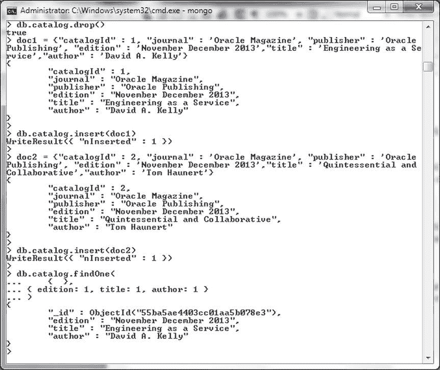
图 2-39. 查找选定字段

`<projection>` 参数可以指定包含字段或排除字段，但不能同时两者兼有。为了演示，请调用 `findOne()` 方法，排除 `edition` 字段，但包含 `title` 和 `author` 字段。

```
>db.catalog.findOne(
    {  },
{ edition: 0, title: true, author: 1 }
)
```

这将引发异常，表明不能混合包含和排除字段，如图 2-40 所示。

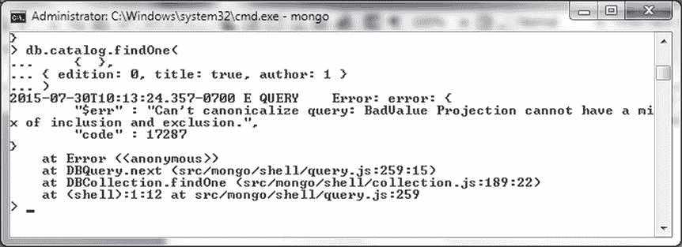
图 2-40. 不能混合包含和排除字段

要排除字段，`<projection>` 参数中的所有字段必须都设置为排除。例如，在以下对 `findOne()` 的调用中，使用查询比较操作符 `$gt` 设置 `catalogId` 字段，并将 `<projection>` 参数值设置为排除 `journal` 和 `publisher` 字段。

```
>db.catalog.findOne(
    { catalogId : {$gt: 1} },
    { journal: 0, publisher: 0}
)
```

`findOne()` 方法仅返回 `catalogId` 大于 1 的文档，并排除了 `journal` 和 `publisher` 字段，如图 2-41 所示。

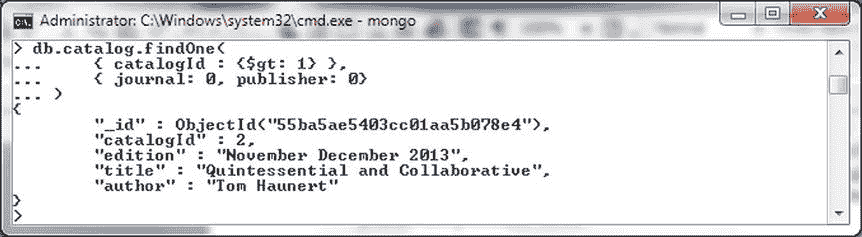
图 2-41. 使用 findOne() 方法查找文档

甚至可以在 `<projection>` 参数中排除 `_id` 字段。例如，排除 `_id`、`journal` 和 `publisher` 字段。

```
>db.catalog.findOne(
    { catalogId : {$gt: 1} },
    { _id:0, journal: 0, publisher: 0}
)
```

输出中也会排除 `_id` 字段，如图 2-42 所示。

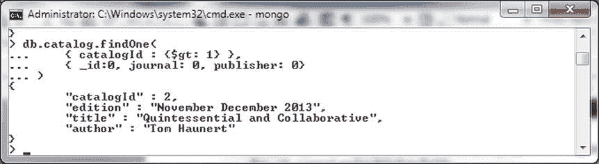
图 2-42. 排除 _id 字段

如果要在 `find()` 或 `findOne()` 方法的 `query` 参数中指定 `_id` 字段值，则必须使用 `ObjectId` 包装类。例如，使用比较查询操作符 `$in` 和 `ObjectId` 来指定 `_id` 字段值。这些 `_id` 字段值与添加文档时使用的值相同。不同用户的 `_id` 字段值会不同；请使用之前添加文档的 `_id` 字段值。可以使用 `db.catalog.find()` 命令查找这些 `_id` 字段值。

```
>db.catalog.find(
   {
      _id: { $in: [ ObjectId("55ba5ae4403cc01aa5b078e3"),  ObjectId("55ba5ae5403cc01aa5b078e4") ] }
   }, { edition: 1, title: 1, author: 1 }
)
```

`find()` 方法返回具有指定 `_id` 字段值的两个文档，如图 2-43 所示。仅返回在 `<projection>` 参数中指定的字段。

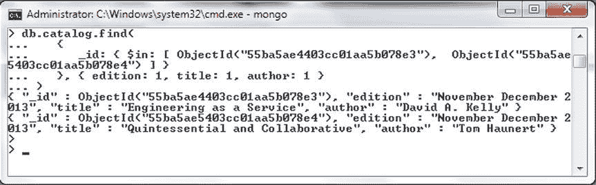
图 2-43. 使用比较查询操作符 $in 查找文档

### 使用游标

如前所述，`db.collection.find()` 方法返回一个游标，当在 shell 中调用 `find()` 方法时，默认会迭代并显示前 20 个文档。游标支持多种方法，并且可以获取游标对象的句柄来调用这些方法。游标支持的部分方法见表 2-8。

表 2-8. 游标支持的方法


## 游标方法

| 方法 | 描述 |
| --- | --- |
| `batchSize()` | 指定在单个网络消息中返回的文档数量。 |
| `count()` | 游标中的文档数量。 |
| `forEach(<function>)` | 遍历每个文档以应用一个 JavaScript 函数。 |
| `hasNext()` | 如果游标有另一个文档可供迭代，则返回 true；如果游标没有，则返回 false。 |
| `limit()` | 限制游标结果集的大小。 |
| `next()` | 返回游标中的下一个文档。 |
| `skip()` | 指定在从 MongoDB 数据库获取文档之前要跳过的文档数量。 |
| `sort()` | 按指定的排序顺序返回结果。 |
| `toArray()` | 返回文档数组。 |

接下来，我们将演示一些游标方法的使用。使用 `insert()` 方法删除 `catalog` 集合并向其中添加三个文档。

```
>db.catalog.drop()
>doc1 = {"_id" : ObjectId("53fb4b08d17e68cd481295d5"),"catalogId" : 1, "journal" : 'Oracle Magazine', "publisher" : 'Oracle Publishing', "edition" : 'November December 2013',"title" : 'Engineering as a Service',"author" : 'David A. Kelly'}
db.catalog.insert(doc1)
>doc2 = {"_id" : ObjectId("53fb4b08d17e68cd481295d6"), "catalogId" : 2, "journal" : 'Oracle Magazine', "publisher" : 'Oracle Publishing', "edition" : 'November December 2013',"title" : 'Quintessential and Collaborative',"author" : 'Tom Haunert'}
>db.catalog.insert(doc2)
>doc3 = {"_id" : ObjectId("53fb4b08d17e68cd481295d7"), "catalogId" : 3, "journal" : 'Oracle Magazine', "publisher" : 'Oracle Publishing', "edition" : 'November December 2013'}
>db.catalog.insert(doc3)
```

在返回的游标上调用 `forEach` 方法，并调用 `printjson` 函数以 JSON 格式输出文档。

```
>db.catalog.find().forEach(printjson)
```

三个文档以 JSON 格式显示，如图 2-44 所示。

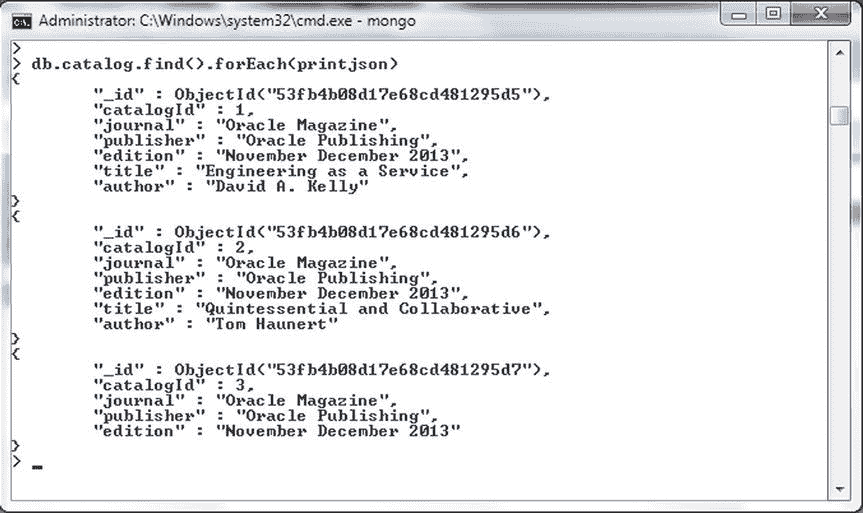

**图 2-44. 使用游标列出文档 JSON**

在前面的例子中，我们没有为游标创建变量，而是在 `find()` 方法调用之后顺序调用了 `forEach()` 方法。我们也可以如下指定游标变量。如果游标还要用于其他目的，则可以使用变量。

```
var cursor= db.catalog.find();
```

随后，在三元/条件运算符中调用 `hasNext()` 和 `next()` 方法以查找游标中的下一个文档。

```
var document = cursor.hasNext() ? cursor.next() : null;
```

如果返回了文档，则打印其 JSON 形式。

```
if (document) {
    print (tojson(document));
}
```

文档的 JSON 形式输出如图 2-45 所示。

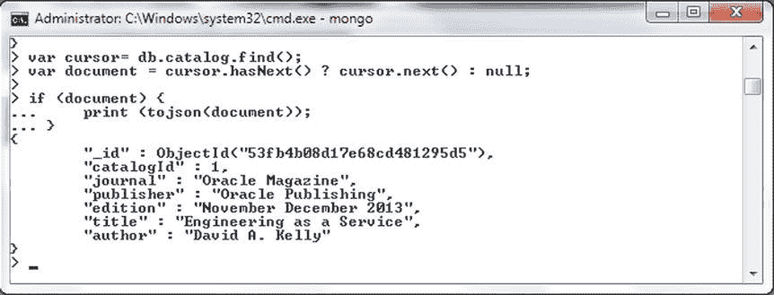

**图 2-45. 为游标使用变量**

可以按顺序调用游标方法，如下面的 `find()` 方法调用所示，其中调用了 `limit()` 方法，随后调用了 `sort()` 方法。`limit()` 方法将返回的文档限制为两个，`sort` 方法按 `catalogId` 升序排序。

```
>db.catalog.find().limit(2).sort({catalogId: 1})
```

返回两个按 `catalogId` 字段升序排列的文档，如图 2-46 所示。

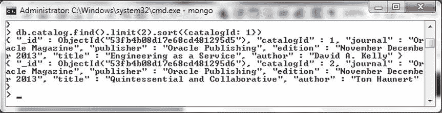

**图 2-46. 顺序调用游标方法**

## 查找和修改文档

`findAndModify()` 方法可用于查找和修改单个文档，其语法如下。

```
db.collection.findAndModify({
    query: <document>,
    sort: <document>,
    remove: <boolean>,
    update: <document>,
    new: <boolean>,
    fields: <document>,
    upsert: <boolean>
})
```

`findAndModify()` 方法支持以下列出的参数。除必须指定 update 或 remove 之一外，所有参数都是可选的。

**表 2-9. findAndModify() 方法支持的参数**

| 参数 | 类型 | 描述 |
| --- | --- | --- |
| `query` | document | 用于查找要修改的文档的查询选择标准。如果选择标准返回多个文档，则只修改其中一个文档。 |
| `sort` | document | 指定如果返回多个文档则修改哪个文档。由 `sort` 参数指定排序顺序中的第一个文档。 |
| `remove` | boolean | 指定是否要删除所选文档。默认为 false。必须指定 `remove` 或 `upsert` 之一。 |
| `update` | document | 指定要应用的更新。更新参数使用更新操作符或 field:value。 |
| `new` | boolean | 指定是返回修改后的文档还是原始文档。默认为 false。如果 `remove` 设置为 true，则 new 被忽略。 |
| `fields` | document | 要返回的字段子集，以 <projection> 格式 {field1:1, field2:1 } 指定。 |
| `upsert` | boolean | 指定如果未找到匹配选择标准的文档，是否要创建并返回一个新文档。默认为 false。必须指定 `remove` 或 `upsert` 之一。 |

例如，按如下方式调用 `findAndModify()` 方法：
*   设置 `query` 参数以查找 journal 字段为 Oracle Magazine 的文档。
*   按 catalogId 字段升序排序。
*   指定 `update` 参数，使用 `update` 操作符 `$inc` 将 catalogId 字段递增 1，并使用 `$set` 操作符为 edition 字段设置新值。
*   `upsert` 参数设置为 `true`，`new` 参数也设置为 `true`。
*   `fields` 参数指定要返回的字段为 `catalogId`、`edition`、`title` 和 `author`。

```
>db.catalog.findAndModify({
  query: {journal : "Oracle Magazine"},
  sort: {catalogId : 1},
  update: {$inc: {catalogId: 1}, $set: {edition: '11-12-2013'}},
  upsert :true,
  new: true,
  fields: {catalogId: 1, edition: 1, title: 1, author: 1}
})
```

在调用前面的方法之前，请添加一些文档，这些文档的 `catalogId` 字段值应为数字，因为 `$inc` 操作符不能应用于非数字。由于参数 `new` 设置为 `true`，该方法返回修改后的文档，如图 2-47 所示。

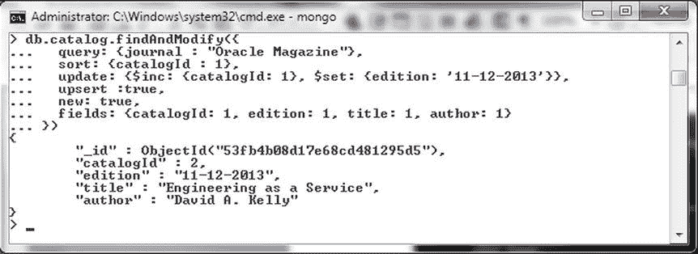

**图 2-47. 使用 findAndModify 方法**

不能在方法调用中同时指定 `upsert` 和 `remove` 参数值。例如，运行以下命令。

```
db.catalog.findAndModify({
  query: {journal : "Oracle Magazine"},
  sort: {catalogId : 1},
  update: {$inc: {catalogId: 1}, $set: {edition: '11-12-2013'}},
  remove: true,
  upsert :true,
  new: true,
  fields: {catalogId: 1, edition: 1, title: 1, author: 1}
})
```

如以下异常所示，`upsert` 和 `remove` 参数值不能共存，如图 2-48 所示。

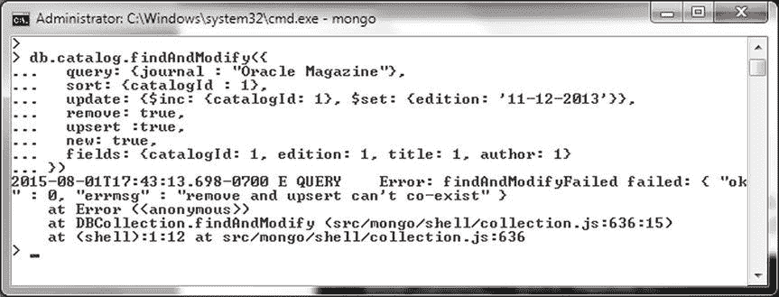

**图 2-48. 错误消息 “remove and upsert can’t co-exist”**

### 删除文档

`db.collection.remove()` 方法用于删除文档。在 MongoDB 2.6 之前的版本中，该方法的语法如下。

```
db.collection.remove(
   <query>,
   <justOne>
)
```

在 2.6 及更高版本中，`remove()` 方法的语法如下。

```
db.collection.remove(
   <query>,
   {
     justOne: <boolean>,
     writeConcern: <document>
   }
)
```

该方法的参数如表 2-10 所列。

**表 2-10. remove 方法参数**


## MongoDB `remove()`方法

| 参数 | 类型 | 描述 |
| --- | --- | --- |
| `query` | 文档 | 指定使用查询操作符的删除条件。要删除所有文档，请指定一个空文档 `{}`。在 2.6 之前的版本中，通过省略查询也可以删除所有文档。 |
| `justOne` | 布尔值 | 指定是否仅删除单个文档。默认为 `false`，这意味着将删除所有匹配的文档。 |
| `writeConcern` | 文档 | 写入关注级别，这在之前的章节中已经讨论过。 |

在 2.6 及更高版本中，`remove()`方法会返回一个`WriteResult`对象。例如，添加三个文档，其中一个`catalogId`为 3，两个`catalogId`为 2。

```
>db.catalog.drop()
>doc1 = {"_id" : ObjectId("53fb4b08d17e68cd481295d5"),"catalogId" : 2, "journal" : 'Oracle Magazine', "publisher" : 'Oracle Publishing', "edition" : 'November December 2013',"title" : 'Engineering as a Service',"author" : 'David A. Kelly'}
>db.catalog.insert(doc1)
>doc2 = {"_id" : ObjectId("53fb4b08d17e68cd481295d6"), "catalogId" : 2, "journal" : 'Oracle Magazine', "publisher" : 'Oracle Publishing', "edition" : 'November December 2013',"title" : 'Quintessential and Collaborative',"author" : 'Tom Haunert'}
>db.catalog.insert(doc2)
>doc3 = {"_id" : ObjectId("53fb4b08d17e68cd481295d7"), "catalogId" : 3, "journal" : 'Oracle Magazine', "publisher" : 'Oracle Publishing', "edition" : 'November December 2013'}
>db.catalog.insert(doc3)
```

随后，如下所示删除`catalogId`为 2 的文档。

```
>db.catalog.remove({ catalogId: 2 })
```

如图 2-49 的输出所示，两个`catalogId`为 2 的文档被删除（`nRemoved`为 2），并且在删除文档后调用`find()`方法时，只返回了`catalogId`为 3 的文档。

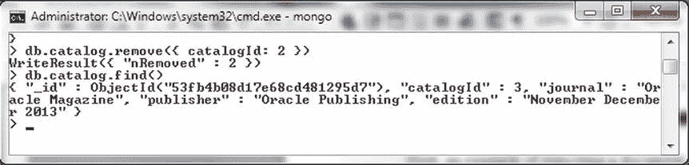

图 2-49. 使用 `remove()` 删除文档

在另一个例子中，为`catalogId`字段使用比较查询操作符`$gt`来指定查询。将`justOne`设置为 `true` 以仅删除一个文档，并将`writeConcern`设置为 `{ w: 1, wtimeout: 5000 }`。`w`选项的值为 1 表示在单个 MongoDB 服务器上确认写入。如果为`w:1`指定了`wtimeout`，则会被忽略，这意味着不会发生超时，并且会从单个服务器返回确认。

```
>db.catalog.remove(
    { catalogId: { $gt: 1 } },
    {justOne:true, writeConcern: { w: 1, wtimeout: 5000 } }
)
```

返回的`WriteResult`对象中的`nRemoved`字段表明有一个文档被删除，如图 2-50 所示。

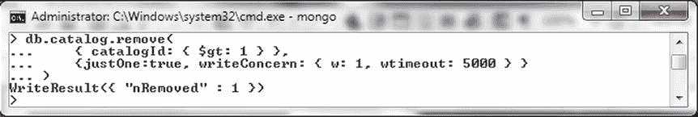

图 2-50. 在 `remove()` 方法中使用比较查询操作符 `$gt`

在 2.6 之前的版本中，要删除所有文档，`remove()`方法的调用方式如下，不带任何参数。

```
>db.catalog.remove()
```

在 MongoDB 2.6 及更高版本中，要删除集合中的所有文档，必须提供一个空文档`{}`作为参数，如下所示。

```
>db.catalog.remove({})
```

`remove()`方法返回一个`WriteResult`对象，其中`nRemoved`为 3，表明已删除三个文档，如图 2-51 所示。

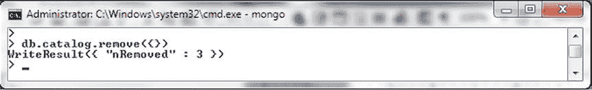

图 2-51. 删除所有文档

无法使用`remove()`方法从固定容量集合（capped collection，一种类似于循环缓冲区的固定大小集合）中删除文档。为了演示，在固定容量集合上调用`remove()`方法；首先删除`catalog`集合，然后如本章前面“创建集合”一节所讨论的，创建一个固定容量集合。

```
>db.catalog.drop()
> db.createCollection("catalog", {capped: true, autoIndexId: true, size: 64 * 1024, max: 1000} )
>db.catalog.remove({})
```

如图 2-52 所示，会显示一条错误消息。

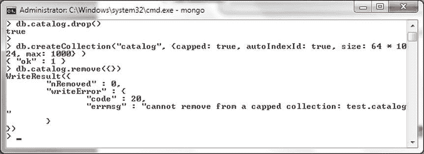

图 2-52. 固定容量集合无法被删除

### 总结

在本章中，我们讨论了一些重要的 Mongo shell 方法和命令。在下一章中，我们将使用 PHP 与 MongoDB 服务器。

## 使用 PHP 驱动 MongoDB

PHP 仍然是开发网站最常用的脚本语言之一。MongoDB 的 PHP 驱动可用于连接 MongoDB，并创建集合以及对数据库执行 CRUD（创建、读取、更新、删除）操作。PHP 驱动扩展`dll`并未打包在 PHP 下载包中，需要单独添加和配置。在本章中，我们将使用 MongoDB 的 PHP 驱动来连接 MongoDB 数据库服务器，并从服务器添加、查找、更新和删除数据。本章涵盖以下主题：

*   入门
*   使用集合
*   使用文档

## 入门

在以下小节中，我们将讨论 PHP MongoDB 数据库驱动。我们还将讨论环境设置以及从 PHP 脚本创建到 MongoDB 驱动的连接。

## PHP MongoDB 数据库驱动概述

PHP MongoDB 驱动提供了多个用于连接 MongoDB 和执行 CRUD 操作的类。PHP 驱动中的核心类如图 3-1 所示。

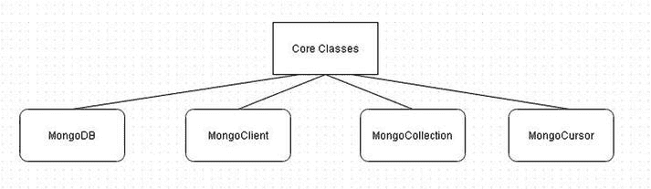

图 3-1. PHP MongoDB 驱动中的核心类

主要的核心类在表 3-1 中讨论。

表 3-1. PHP MongoDB 驱动核心类

| 类 | 描述 |
| --- | --- |
| `MongoDB` | 该类的实例用于与 MongoDB 数据库交互。类构造函数 `MongoDB::__construct ( MongoClient $conn , string $name )` 创建一个新数据库，但不应直接调用该构造函数。而是使用 `MongoClient::__get()` 或 `MongoClient::selectDB()` 方法创建 `MongoDB` 的实例。 |
| `MongoClient` | 该类用于创建和管理与 MongoDB 的连接。类构造函数 `MongoClient::__construct ([ string $server = "mongodb://localhost:27017" [, array $options = array("connect" => TRUE) [, array $driver_options ]]] )` 创建一个新的客户端连接。 |
| `MongoCollection` | 该类表示一个 MongoDB 集合。 |
| `MongoCursor` | 该类表示一个游标，用于迭代数据库查询的结果集。 |

MongoDB 服务器操作可能会产生异常。一些主要的异常类型如图 3-2 所示。

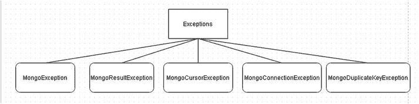

图 3-2. MongoDB 生成的异常类型

主要的异常在表 3-2 中讨论。

表 3-2. 主要异常类

| 异常类 | 描述 |
| --- | --- |
| `MongoException` | 默认的异常类，所有其他异常类都必须扩展此类。如果插入的文档为空，则由 `MongoCollection::batchInsert` 和 `MongoCollection::insert` 方法抛出。 |
| `MongoResultException` | 一些命令辅助方法（如 `MongoCollection::findAndModify`）会抛出此异常。 |
| `MongoCursorException` | 任何未能收到预期回复的数据库请求都会抛出此异常。如果设置了 `w` 选项但写入失败，`MongoCollection::update`、`MongoCollection::batchInsert` 和 `MongoCollection::insert` 会抛出此异常。 |
| `MongoConnectionException` | 当驱动程序无法连接到数据库时抛出。`MongoClient::connect` 和 `MongoCollection::findOne` 如果无法连接到数据库，会抛出 `MongoConnectionException`。 |
| `MongoDuplicateKeyException` | 如果将文档插入到一个集合中，而该集合中已存在另一个具有相同唯一键的文档，则抛出此异常。 |

## 环境设置


