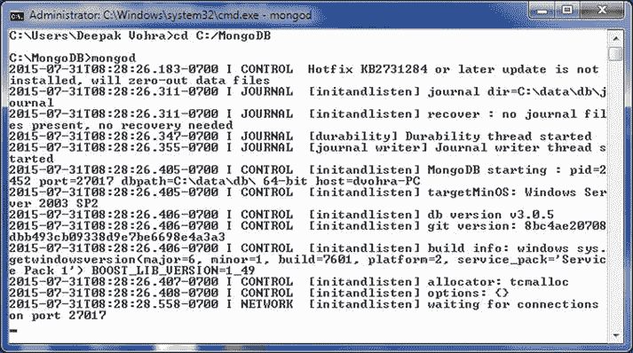
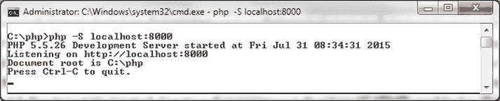
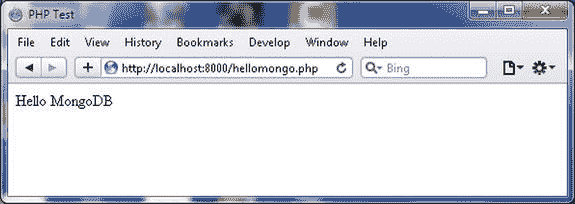

# MongoDB 和 PHP 环境安装与连接

## 安装所需软件

除了安装 MongoDB 服务器外，我们还需要安装以下软件：
*   MongoDB Server
*   PHP
*   PHP Driver for MongoDB

## 安装 MongoDB Server

下载并安装 MongoDB 3.0.5。将 MongoDB 的 `bin` 目录（例如 `C:\Program Files\MongoDB\Server\3.0\bin`）添加到 `PATH` 环境变量中。使用以下命令启动 MongoDB 服务器：

```
>mongod
```

命令的输出表明 MongoDB 服务器已启动，如图 3-3 所示。


图 3-3. 启动 MongoDB

## 安装 PHP

运行 PHP 脚本需要 Web 服务器。PHP 5.4 及更高版本在安装包中包含了 Web 服务器。

1.  从 `http://windows.php.net/download/` 下载 PHP 5.5 (5.5.26) VC11 x64 Thread-Safe 版本的 PHP zip 文件 `php-5.5.26-Win32-VC11-x64.zip`。也可以使用更高的 PHP 版本。支持 PHP 5.3、5.4、5.5 和 5.6。VC11 版本需要预先安装 Visual C++ Redistributable for Visual Studio 2012 x86 或 x64。
2.  将 `php-5.5.26-Win32-VC11-x64.zip` 文件解压到一个目录，会创建一个 `php-5.5.26-Win32-VC11-x64` 目录。如果使用不同版本，目录名会不同。
3.  创建一个文档根目录（本章使用 `C:\php`），并将文件和目录从 `php-5.5.26-Win32-VC11-x64` 目录复制到 `C:\php` 目录。
4.  在 PHP 安装的根目录 `C:\php` 中，将 PHP 配置文件 `php.ini-development` 或 `php.ini-production` 重命名为 `php.ini`。
5.  从文档根目录 `C:\php` 使用以下命令在端口 8000 启动内置的 Web 服务器：

```
    php -S localhost:8000
```

命令的输出表明开发服务器已启动并正在监听 `http://localhost:8000`，如图 3-4 所示。


图 3-4. 启动 PHP Web 服务器

6.  任何复制到文档根目录 (`C:\php`) 的 PHP 脚本都可以在集成 Web 服务器上运行。PHP 脚本可以复制到文档根目录的子目录中，并通过在 URL 中包含从文档根目录开始的目录路径来运行。将以下脚本 `hellomongo.php` 复制到文档根目录的 `C:\php` 目录。

```
    <html>
     <head>
      <title>PHP Test</title>
     </head>
     <body>
     <?php echo '<p>Hello MongoDB</p>'; ?>
     </body>
    </html>
```

7.  使用 URL `http://localhost:8000/hellomongo.php` 运行该脚本。输出如图 3-5 所示。


图 3-5. 运行 PHP 脚本

## 安装 PHP Driver for MongoDB

要下载的驱动程序版本取决于所使用的 MongoDB 版本。PHP MongoDB 驱动程序和 MongoDB 版本的兼容性矩阵列在表 3-3 中。

表 3-3. 兼容性矩阵

| PHP Driver | MongoDB Driver |
| --- | --- |
| 1.6 | 2.4, 2.6, 3.0 |
| 1.5 | 2.4, 2.6 |

因为我们使用的是 MongoDB 3.0.5，所以要下载的兼容 PHP 驱动程序版本是 1.6。

1.  从 `http://pecl.php.net/package/mongo` 下载 PHP MongoDB Database Driver。因为我们使用的是 PHP 5.5，所以需要从 `https://pecl.php.net/package/mongo/1.6.10/windows` 下载 5.5 Thread Safe (TS) x64 版本的 `php_mongo-1.6.10-5.5-ts-vc11-x64.zip` 文件。
2.  将 `php_mongo-1.6.10-5.5-ts-vc11-x64.zip` 文件解压到一个目录。
3.  将解压目录中的 `php_mongo.dll` 文件复制到 PHP 安装的文档根目录 `C:\php`。
4.  将以下配置添加到 `php.ini` 文件中：

```
    extension=php_mongo.dll
```

5.  重启 PHP Web 服务器。

 **注意** 在后续章节中，我们将运行 PHP 脚本来连接 MongoDB 并在服务器上执行增删改查操作。在每个后续部分（除非特别说明）之前，在 Mongo shell 中运行以下命令，从 `local` 数据库中删除 `catalog` 集合；可以通过 `mongo` 命令启动 Mongo shell：

```
use local
db.catalog.drop()
```

对于每个部分，我们将使用一个空集合，这样前一部分的文档就不会被使用，只有当前部分的脚本用于演示 PHP MongoDB 驱动程序。

## 创建连接

在文档根目录 `C:\php` 中创建一个 PHP 脚本 `mongoconnection.php`。使用 `MongoClient` 构造函数连接到 MongoDB 数据库，如下所示：

```
$connection = new MongoClient();
```

构造函数中未指定任何连接参数时，会建立到 `localhost:27017` 的连接，其中 `localhost` 是默认的 MongoDB 主机，27017 是默认的 MongoDB 端口。输出连接详情：

```
print 'Connection: <br/>';
var_dump($connection);
```

生成的输出如下：

```
object(MongoClient)#1 (4) { ["connected"]=> bool(true) ["status"]=> NULL ["server":protected]=> NULL ["persistent":protected]=> NULL }
```

其中 `["connected"]=> bool(true)` 表示客户端脚本已连接到 MongoDB。可以使用 `getWriteConcern()` 方法输出写关注点，如下所示：

```
var_dump($connection->getWriteConcern());
```

以下输出表示 `w` 的值为 1，`wtimeout` 的值为 -1：

```
array(2) { ["w"]=> int(1) ["wtimeout"]=> int(-1) }
```

可以使用必须以 `mongodb://` 开头的连接字符串来建立连接：

```
$connection = new MongoClient( "mongodb://localhost:27017" );
```

使用 `getReadPreference()` 方法输出读偏好。输出表明读取操作被定向到副本集中的主成员，这也是默认设置：

```
array(1) { ["type"]=> string(7) "primary" }
```

使用 `listDBs()` 方法列出服务器上的数据库。输出一个包含数据库信息的数组。对于每个数据库，输出其名称、`sizeOnDisk`、`empty` 属性。示例脚本中的三个数据库是 `catalog`、`local` 和 `test`：

```
array(3) { ["databases"]=> array(3) { [0]=> array(3) { ["name"]=> string(5) "Loc8r" ["sizeOnDisk"]=> float(83886080) ["empty"]=> bool(false) } [1]=> array(3) { ["name"]=> string(5) "local" ["sizeOnDisk"]=> float(83886080) ["empty"]=> bool(false) } [2]=> array(3) { ["name"]=> string(4) "test" ["sizeOnDisk"]=> float(83886080) ["empty"]=> bool(false) } } ["totalSize"]=> float(251658240) ["ok"]=> float(1) }
```

连接字符串中使用的主机名也可以是 IPv4 地址，如下所示。不同用户的 IPv4 地址会不同，可以使用 `ipconfig/all` 命令查找：

```
$connection = new MongoClient("mongodb://192.168.1.72:27017");
```

可以使用 `getConnections()` 方法列出所有打开的连接。连接信息（包括主机、端口和连接类型，示例连接为 `STANDALONE`）将被列出。


