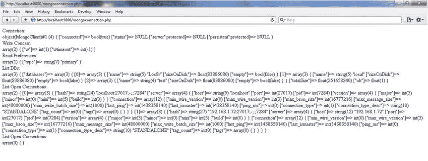
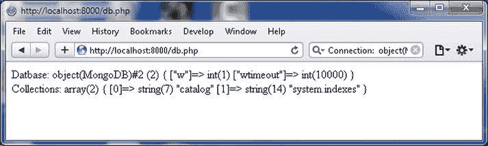
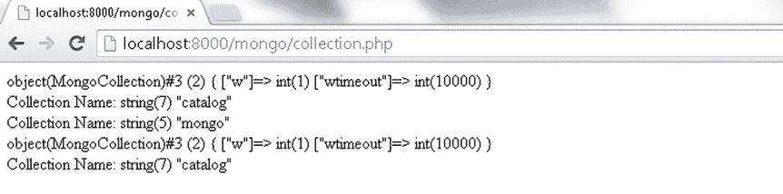
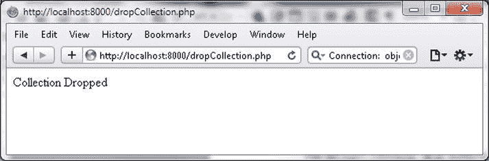
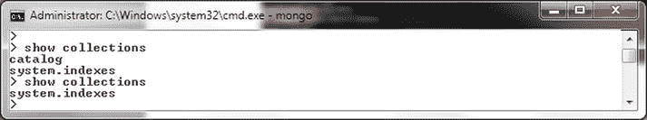
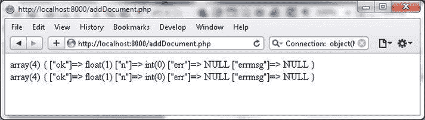

# 获取连接信息

```
array(2) {
  [0]=> array(3) {
    ["hash"]=> string(24) "localhost:27017;-;.;7284"
    ["server"]=> array(4) {
      ["host"]=> string(9) "localhost"
      ["port"]=> int(27017)
      ["pid"]=> int(7284)
      ["version"]=> array(4) {
        ["major"]=> int(3)
        ["minor"]=> int(0)
        ["mini"]=> int(5)
        ["build"]=> int(0)
      }
    }
    ["connection"]=> array(12) {
      ["min_wire_version"]=> int(0)
      ["max_wire_version"]=> int(3)
      ["max_bson_size"]=> int(16777216)
      ["max_message_size"]=> int(48000000)
      ["max_write_batch_size"]=> int(1000)
      ["last_ping"]=> int(1438358245)
      ["last_ismaster"]=> int(1438358245)
      ["ping_ms"]=> int(0)
      ["connection_type"]=> int(1)
      ["connection_type_desc"]=> string(10) "STANDALONE"
      ["tag_count"]=> int(0)
      ["tags"]=> array(0) {
      }
    }
  }
  [1]=> array(3) {
    ["hash"]=> string(27) "192.168.1.72:27017;-;.;7284"
    ["server"]=> array(4) {
      ["host"]=> string(12) "192.168.1.72"
      ["port"]=> int(27017)
      ["pid"]=> int(7284)
      ["version"]=> array(4) {
        ["major"]=> int(3)
        ["minor"]=> int(0)
        ["mini"]=> int(5)
        ["build"]=> int(0)
      }
    }
    ["connection"]=> array(12) {
      ["min_wire_version"]=> int(0)
      ["max_wire_version"]=> int(3)
      ["max_bson_size"]=> int(16777216)
      ["max_message_size"]=> int(48000000)
      ["max_write_batch_size"]=> int(1000)
      ["last_ping"]=> int(1438358245)
      ["last_ismaster"]=> int(1438358245)
      ["ping_ms"]=> int(0)
      ["connection_type"]=> int(1)
      ["connection_type_desc"]=> string(10) "STANDALONE"
      ["tag_count"]=> int(0)
      ["tags"]=> array(0) {
      }
    }
  }
}
```

要关闭连接，可调用 `MongoClient::close([boolean|string $connection])` 方法。要关闭所有连接，可调用带参数 `true` 的 `close()` 方法。如果未提供参数或参数为 `false`，则仅关闭调用该方法时所使用的连接。可以通过连接字符串指定一个特定的连接。如果在关闭所有连接后调用 `getConnections()` 方法，则会列出一个空数组。

```
array(0) { }
```

以下是 PHP 脚本 `mongoconnection.php` 的内容：

```
<?php
$connection = new MongoClient(); // 连接到 localhost:27017
print '连接: <br/>';
var_dump($connection);
print '<br/>';
print '写关注: <br/>';
var_dump($connection->getWriteConcern());
print '<br/>';
$connection = new MongoClient( "mongodb://localhost:27017" );
print '读取偏好: <br/>';
var_dump($connection->getReadPreference());
print '<br/>';
print '列出数据库: <br/>';
var_dump($connection->listDBs());
print '<br/>';
$connection = new MongoClient("mongodb://192.168.1.72:27017");
print '列出开放的连接: <br/>';
var_dump($connection->getConnections());
print '<br/>';
$connection->close(true);
print '列出开放的连接: <br/>';
var_dump($connection->getConnections());
?>
```

使用 URL `http://localhost:8000/mongoconnection.php` 在浏览器中运行该 PHP 脚本。`mongoconnection.php` 脚本的输出如 图 3-6 所示。



图 3-6. mongoconnection.php 脚本的输出

## 获取数据库信息

`MongoDB` 类代表一个数据库。可以通过 `MongoClient` 中的 `selectDB()` 方法或直接通过数据库名称的间接引用来获取该类的实例。在 `C:\php` 目录下创建一个 PHP 脚本 `db.php`。按如下方式获取 `test` 数据库的 `MongoDB` 实例。

```
$connection = new MongoClient();
$db = $connection->test;
```

或者，也可以使用 `selectDB()` 方法。例如，以下 `MongoDB` 实例代表数据库 `local`。

```
$db=$connection->selectDB("local");
```

`selectDB()` 方法会抛出 `MongoConnectionException` 异常，必须在 `try`-`catch` 语句中处理。`MongoDB` 中的 `getCollectionNames(boolean)` 方法获取数据库中的所有集合名称。要获取系统集合，也需要使用参数 `true` 调用该方法。

```
$collections=$db->getCollectionNames(true);
```

可以按如下方式输出集合名称。

```
var_dump($collections);
```

`db.php` 脚本如下所列。`MongoDB` 类并未在 `db.php` 脚本中显式出现，因为返回值被赋给了一个变量。

```
<?php
try
{
$connection = new MongoClient();

$db = $connection->test;
print '数据库: ';
var_dump($db);
print '<br/>';
$db=$connection->selectDB("local");
$collections=$db->getCollectionNames(true);
print '集合: ';
var_dump($collections);
print '<br/>';
}catch ( MongoConnectionException $e )
{
    echo '<p>无法连接到 mongodb，请问 "mongo" 进程正在运行吗？</p>';
    exit();
}
?>
```

使用 URL `http://localhost:8000/db.php` 在浏览器中运行该 PHP 脚本。为 local 数据库列出的集合名称包括 `system.indexes` 和 `catalog`，如 图 3-7 所示。不同用户列出的集合可能不同。



图 3-7. db.php 脚本的输出

## 使用集合

在接下来的小节中，我们将讨论如何使用 PHP MongoDB 驱动程序获取集合和删除集合。

## 获取集合

在本节中，我们将在 MongoDB 数据库实例中创建一个集合。在 `C:\php` 目录下创建一个 PHP 脚本 `collection.php`。`MongoCollection` 类代表一个集合。从连接实例获取集合的语法与获取数据库的语法相同。例如，首先获取数据库实例 `local`，然后从该数据库实例获取集合 `catalog`，如下所示。

```
$connection = new MongoClient();
$db=$connection->local;
$collection=$db->catalog;
```

可以按如下方式输出集合信息和集合名称。

```
var_dump($collection);
var_dump($collection->getName());
```

也可以直接获取一个集合，如下所示。

```
$collection=$connection->local->mongo;
```

也可以使用 `MongoDB::createCollection()` 来创建 `MongoCollection` 实例。`createCollection()` 方法的语法如下。

```
$db->createCollection(
    "create" => $name,
    "capped" => $options["capped"],
    "size" => $options["size"],
    "max" => $options["max"],
    "autoIndexId" => $options["autoIndexId"],
));
```

`createCollection()` 方法中的参数和选项如 表 3-4 所示。

表 3-4. createCollection 方法中的参数和选项

| 参数/选项 | 描述 |
| --- | --- |
| `create` | 集合的名称。 |
| `capped` | 指示集合是否为固定集合（capped）或固定大小的选项。 |
| `size` | 指示固定集合固定大小（以字节为单位）的选项。 |
| `max` | 指示固定集合中最大文档数量的选项。 |
| `autoIndexId` | 对于 MongoDB 2.2 及更高版本，默认自动索引为 true。对于 2.2 之前的版本，默认自动索引为 false。对于固定集合，`autoIndexId` 可设置为 false。 |

例如，创建一个名为 `catalog` 的固定集合，固定大小为 1 MB，最大文档数为 10。

```
$coll = $db->createCollection(
    "catalog",
    array(
        'capped' => true,
        'size' => 1*1024,
        'max' => 10
    )
);
```

`collection.php` 脚本如下所列。

```
<?php
try
{
$connection = new MongoClient();
$db=$connection->local;
$collection=$db->catalog;
var_dump($collection);
print '<br/>';
print '集合名称: ';
var_dump($collection->getName());
print '<br/>';
$collection=$connection->local->mongo;
print '集合名称: ';
var_dump($collection->getName());

}catch ( MongoConnectionException $e ) 
{
    echo '<p>无法连接到 mongodb，请问 "mongo" 进程正在运行吗？</p>';
    exit();
}
$collection->drop();

$coll = $db->createCollection(
    "catalog",
    array(
        'capped' => true,
        'size' => 1*1024,
        'max' => 10
    )
);
print '<br/>';
var_dump($coll);
print '<br/>';
print '集合名称: ';
var_dump($coll->getName());

?>
```


在浏览器中运行脚本 `collection.php`，URL 为 `http://localhost:8000/collection.php`。输出结果如图 3-8 所示。



图 3-8. collection.php 脚本的输出

## 删除集合

`MongoCollection::drop()` 方法用于删除一个集合，没有任何参数。

在 `C:\php` 目录下创建一个 PHP 脚本 `dropCollection.php`。在 `try`-`catch` 语句中创建一个 `MongoCollection` 实例。调用 `drop()` 方法来删除集合。

```
$collection->drop();
```

`dropCollection.php` 脚本如下：

```php
<?php
try
{
$connection = new MongoClient();
$collection=$connection->local->catalog;
$collection->drop();
echo '<p>集合已删除</p>';
}catch (MongoConnectionException $e)
{
    echo '<p>无法连接到 mongodb</p>';
    exit(); 
} 
?>
```

在浏览器中运行此 PHP 脚本，URL 为 `http://localhost:8000/dropCollection.php`，如图 3-9 所示。



图 3-9. 删除一个集合

`catalog` 集合已被删除，如图 3-10 所示，在运行 `dropCollection.php` 脚本前后执行 `show collections` 方法的结果所示。



图 3-10. 删除集合前后的集合列表

## 使用文档

在接下来的小节中，我们将讨论使用 PHP MongoDB 驱动在 MongoDB 服务器中添加、查询、更新和删除文档。

### 添加文档

`MongoCollection::insert` 方法用于向 MongoDB 添加单个文档。`insert()` 方法接受参数。

```
MongoCollection::insert ( array|object $document [, array $options = array() ] )
```

第一个参数是一个数组或对象，如果该参数未提供 `_id` 键，则会创建一个新的 `MongoId` 实例并分配给它。`insert` 方法支持以下选项，列于表 3-5 中。

表 3-5. 插入方法中的选项

| 选项 | 描述 |
| --- | --- |
| `j` | 在启用日志记录时使用。日志记录是将写入操作先应用到内存和磁盘上的日志中，然后再应用到磁盘数据文件的过程。如果设置为 true，则必须收到确认写入。写入操作将被阻塞，直到它同步到磁盘上的日志。默认值为 false。会覆盖 `w` 设置为 '0' 的情况。 |
| `fsync` | 如果启用日志记录，`fsync` 与 `j` 类似。如果未启用日志记录，写入操作将被阻塞，直到它与磁盘上的数据文件同步，并且必须收到确认插入，覆盖 `w` 设置为 '0' 的情况。 |
| `socketTimeoutMS` | 指定套接字通信的时间限制，如果服务器在此时间段内未响应，则抛出 `MongoCursorTimeoutException` 异常。MongoClient 的默认值为 30,000 毫秒。 |
| `w` | 写入关注，默认值为 1。 |
| `wTimeoutMS` | 当 w >1 时，指定确认的时间限制（以毫秒为单位）。如果在时限内未满足写入关注，则抛出 MongoCursorException 异常。`MongoClient` 的默认值为 10,000。 |

1.  在 `C:\php` 目录下创建一个 PHP 脚本 `addDocument.php`。在 `try`-`catch` 语句中创建一个 `MongoClient` 实例（表示一个连接），并在 `local` 数据库中为 `catalog` 集合创建一个 `MongoCollection` 实例。

    ```php
    $connection = new MongoClient();
    $collection=$connection->local->catalog;
    ```

2.  创建一个要添加文档的数组。

    ```php
    $doc = array(
        "name" => "MongoDB",
        "type" => "database",
        "count" => 1,
        "info" => (object)array("catalogId" => 'catalog1', "journal" => 'Oracle Magazine', "publisher" => 'Oracle Publishing', "edition" => 'November December 2013',"title" => 'Engineering as a Service',"author" => 'David A. Kelly')
    );
    ```

3.  使用 `insert()` 方法将文档添加到 `MongoDB` 集合。

    ```php
    $status=$collection->insert($doc);
    var_dump($status);
    ```

4.  为 `MongoConnectionException` 和 `MongoCursorException` 添加 catch 块。
5.  类似地向集合添加另一个文档。`addDocument.php` 脚本如下所示。

    ```php
    <?php
    try
    {
    $connection = new MongoClient();
    $collection=$connection->local->catalog;
    $doc = array(
        "name" => "MongoDB",
        "type" => "database",
        "count" => 1,
        "info" => (object)array("catalogId" => 'catalog1', "journal" => 'Oracle Magazine', "publisher" => 'Oracle Publishing', "edition" => 'November December 2013',"title" => 'Engineering as a Service',"author" => 'David A. Kelly')
    );
    $status=$collection->insert($doc);
    var_dump($status);
    print '<br/>';
    $doc = array(
        "name" => "MongoDB",
        "type" => "database",
        "count" => 1,
        "info" => (object)array("catalogId" => 'catalog2', "journal" => 'Oracle Magazine', "publisher" => 'Oracle Publishing', "edition" => 'November December 2013',"title" => 'Quintessential and Collaborative',"author" => 'Tom Haunert')
    );
    $status=$collection->insert($doc);
    var_dump($status);
    }catch ( MongoConnectionException $e )
    {
        echo '<p>无法连接到 mongodb</p>';
        exit();
    }catch(MongoCursorException $e) {
     echo '<p>w 选项已设置，写入失败</p>';
        exit();
    }
    ?>
    ```

6.  在浏览器中运行此 PHP 脚本，URL 为 `http://localhost:8000/addDocument.php`。输出结果如图 3-11 所示。如 `insert()` 方法返回的状态消息数组所示，`err` 键为 `NULL`，表示没有错误，`errmsg` 也为 NULL。而 `ok` 键为 1，表示所有数据库操作已成功完成。`n` 键表示受影响的文档数，对于插入操作为 0。对于更新、upsert 或删除操作，如果文档已被更新、upsert 或删除，则 `n` 将为正数。



图 3-11. addDocument.php 脚本的输出

由于我们没有为添加的文档提供 `_id` 键，系统会自动为添加的文档创建一个唯一的 `MongoId`。`_id` 键或 `MongoId` 必须是唯一的。接下来，我们将演示 `_id` 或 `MongoId` 必须是唯一的。

使用 `try`-`catch` 语句创建并使用 `insert()` 方法添加文档。对同一文档调用两次 `insert` 方法。

```php
$status=$collection->insert($doc);
$status=$collection->insert($doc);
```

`addDocumentException.php` 脚本如下：

```php
<?php
try
{
$connection = new MongoClient();
$collection=$connection->local->catalog;
$doc = array(
    "name" => "MongoDB",
    "type" => "database",
    "count" => 1,
    "info" => (object)array("catalogId" => 'catalog1', "journal" => 'Oracle Magazine', "publisher" => 'Oracle Publishing', "edition" => 'November December 2013',"title" => 'Engineering as a Service',"author" => 'David A. Kelly')
);
$status=$collection->insert($doc);
var_dump($status);
print '<br/>';
$status=$collection->insert($doc);
}catch ( MongoConnectionException $e )
{
    echo '<p>无法连接到 mongodb</p>';
    exit();
}catch(MongoCursorException $e) {
 echo '<p>w 选项已设置，写入失败</p>';
    exit();
}
?>
```


