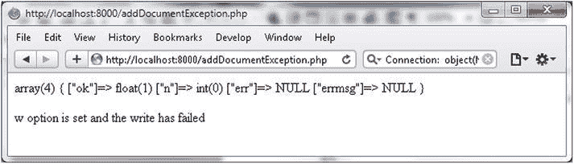
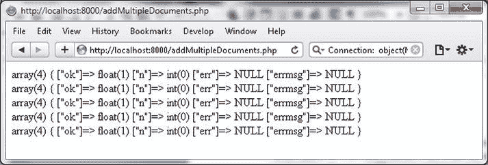
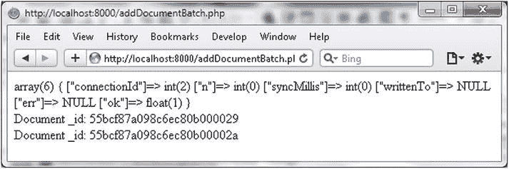
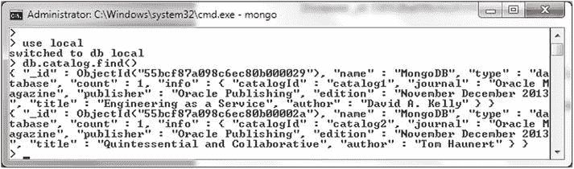

# 使用 MongoDB PHP 库操作文档

## 捕获重复插入异常

当在浏览器中运行`addDocumentException.php`脚本时（URL 为`http://localhost:8000/addDocumentException.php`），由于尝试添加重复的文档，会抛出`MongoCursorException`异常。该异常被捕获并输出错误信息，如图 3-12 所示。



**图 3-12. `addDocumentException.php`脚本的输出**

### 添加多个文档

在上一节中，我们使用两次单独的`insert()`方法调用添加了两个文档。`insert()`方法调用也可以使用`while`、`do`-`while`或`for`循环来完成。

1.  在文档根目录`C:\php`中创建一个 PHP 脚本`addMultipleDocuments.php`。在`try`-`catch`语句中，像之前一样为集合创建一个`MongoCollection`实例。

    ```
    $connection = new MongoClient();
    $collection=$connection->local->catalog;
    ```

2.  在一个`for`循环中，使用循环初始化器中的变量`$i`作为文档的`catalogId`字段值，向集合添加文档。

    ```
    for ($i = 1; $i <= 5; $i++)
    {
        $status=$collection->insert(array("catalogId" =>'catalog'.$i, "journal" => 'Oracle Magazine', "publisher" => 'Oracle Publishing', "edition" => 'November December 2013'));
    var_dump($status);
    print '<br/>';
    }
    ```

完整的`addMultipleDocuments.php`脚本如下：

```
<?php
try
{
$connection = new MongoClient();
$collection=$connection->local->catalog;
for ($i = 1; $i <= 5; $i++)
{
    $status=$collection->insert(array("catalogId" =>'catalog'.$i, "journal" => 'Oracle Magazine', "publisher" => 'Oracle Publishing', "edition" => 'November December 2013'));
var_dump($status);
print '<br/>';
}
}catch (MongoConnectionException $e)
{
    echo '<p>Couldn\'t connect to mongodb</p>';
    exit();
}catch(MongoCursorException $e) {
 echo '<p>w option is set and the write has failed</p>';
    exit();
}
?>
```

3.  在浏览器中运行`addMultipleDocuments.php`脚本，URL 为`http://localhost:8000/addMultipleDocuments.php`，以向 MongoDB 集合添加多个文档。每添加一个文档，都会输出一条状态信息，如图 3-13 所示。



**图 3-13. `addMultipleDocuments.php`脚本的输出**

### 批量添加文档

`MongoCollection::batchInsert()`方法可用于向集合批量添加文档。该方法的语法与`insert`方法相同。

```
MongoCollection::batchInsert ( array $document [, array $options = array() ] )
```

与`insert()`方法的区别在于，其第一个参数是数组的数组或对象，而`insert`方法中是数组或对象。`batchInsert()`方法返回一个关联数组，而`insert`方法返回数组或`boolean`值。该方法支持一个额外的选项`continueOnError`，默认值为 false。如果设置为 true，当其中一个文档插入失败时，批量插入会失败。要批量添加的文档数组中的每个文档都必须有一个唯一的`_id`。

1.  在`C:\php`目录中创建一个 PHP 脚本`addDocumentBatch.php`。像之前一样创建一个`MongoCollection`实例。

    ```
    $connection = new MongoClient();
    $collection=$connection->local->catalog;
    ```

2.  创建一个用于存放文档数组的数组。

    ```
    $batch=array();
    ```

3.  创建一个文档数组，并将其添加到`$batch`数组中。

    ```
    $doc1 = array(
        "name" => "MongoDB",
        "type" => "database",
        "count" => 1,
        "info" => (object)array("catalogId" => 'catalog1', "journal" => 'Oracle Magazine', "publisher" => 'Oracle Publishing', "edition" => 'November December 2013',"title" => 'Engineering as a Service',"author" => 'David A. Kelly')
    );

    $batch[]=$doc1;
    ```

4.  同样地，将另一个文档添加到批量数组中。`$doc2`在`addDocumentBatch.php`脚本列表中声明。

    ```
    $batch[]=$doc2;
    ```

5.  使用`$batch`数组作为参数调用`batchInsert`方法。

    ```
    $status=$collection->batchInsert($batch);
    var_dump($status);
    ```

6.  由于没有为要添加的文档提供`_id`字段，`MongoId`实例会被自动添加。随后，可以使用`foreach`循环输出添加的`_id`字段值。

    ```
    foreach ($batch as $doc) {
    print 'Document _id: ';
      echo $doc['_id']."\n";
    print '<br/>';
    }
    ```

完整的`addDocumentBatch.php`脚本如下：

```
<?php
try
{
$connection = new MongoClient();
$collection=$connection->local->catalog;
$batch=array();
$doc1 = array(
    "name" => "MongoDB",
    "type" => "database",
    "count" => 1,
    "info" => (object)array("catalogId" => 'catalog1', "journal" => 'Oracle Magazine', "publisher" => 'Oracle Publishing', "edition" => 'November December 2013',"title" => 'Engineering as a Service',"author" => 'David A. Kelly')
);

$batch[]=$doc1;

$doc2 = array(
    "name" => "MongoDB",
    "type" => "database",
    "count" => 1,
    "info" => (object)array("catalogId" => 'catalog2', "journal" => 'Oracle Magazine', "publisher" => 'Oracle Publishing', "edition" => 'November December 2013',"title" => 'Quintessential and Collaborative',"author" => 'Tom Haunert')
);

$batch[]=$doc2;
$status=$collection->batchInsert($batch);
var_dump($status);
print '<br/>';
foreach ($batch as $doc) {
print 'Document _id: ';
  echo $doc['_id']."\n";
print '<br/>';
}

}catch ( MongoConnectionException $e )
{
    echo '<p>Couldn\'t connect to mongodb</p>';
    exit();
}catch(MongoCursorException $e) {
 echo '<p>w option is set and the write has failed</p>';
    exit();

}
?>
```

7.  在浏览器中运行 PHP 脚本`addDocumentBatch.php`，URL 为`http://localhost:8000/addDocumentBatch.php`。如图 3-14 的输出所示，两个具有唯一 id 的文档被添加到了 MongoDB 的`catalog`集合中。



**图 3-14. `addDocumentBatch.php`脚本的输出**

8.  随后，在 Mongo shell 中调用`local`数据库中`catalog`集合的`find()`方法，以输出添加的文档。

    ```
    >use local
    >db.catalog.find()
    ```

如图 3-15 所示，列出了添加的两个文档。



**图 3-15. 在 Mongo Shell 中列出批量添加的文档**

请不要删除`local`数据库中的`catalog`集合，因为下一节将使用批量添加的文本来演示如何查找文档。

### 查找单个文档

`MongoCollection::findOne()`方法用于从集合中查找单个文档。`findOne()`方法返回一个由文档字段组成的数组。该方法接受一个`$query`参数、一个`$fields`参数（指定返回文档中要包含的字段）以及选项参数。即使未在`$fields`中指定，`_id`字段也会被返回。

```
MongoCollection::findOne ([ array $query = array() [, array $fields = array() [, array $options = array() ]]] )
```


