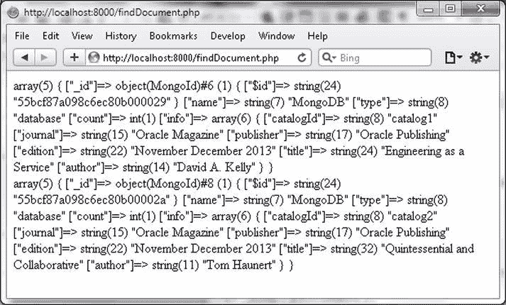
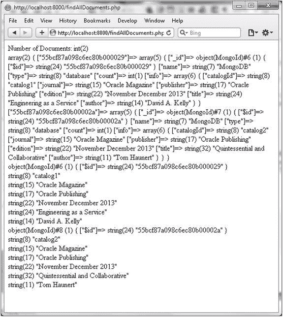

# 使用 `findOne()` 和 `find()` 查找文档

`findOne()` 方法用于查找单个文档。所有参数都是可选的，如果未指定任何参数，则返回集合中的第一个文档。只支持一个选项 `maxTimeMS`，它是处理该方法的累计时间限制（毫秒），不包括空闲时间。如果方法未在指定时间内完成，则抛出 `MongoExecutionTimeoutException`。如果未与 MongoDB 服务器建立连接，则抛出 `MongoConnectionException`。

## 使用 `findOne()` 查找单个文档

1.  在 `C:\php` 目录中创建一个 PHP 脚本 `findDocument.php`。在 `try`-`catch` 语句中，创建一个 `MongoClient` 实例，并使用该连接为 `local` 数据库中的 `catalog` 集合创建一个 `MongoCollection` 实例。

    ```
    $connection = new MongoClient();
    $collection=$connection->local->catalog;
    ```

2.  在 `MongoCollection` 实例上调用 `findOne()` 方法以查找单个文档。找到的第一个文档将被返回，对于不同的用户可能不同。

    ```
    $document = $collection->findOne();
    var_dump($document);
    ```

3.  可以通过指定传递给 `findOne()` 方法的数组中的 `_id` 字段来查找特定文档。`_id` 字段值使用 `MongoId` 类构造函数构建。`_id` 字段值对于不同的用户会有所不同。

    ```
    $document = $collection->findOne(array('_id' => new MongoId("55bcf87a098c6ec80b00002a")));
    var_dump($document);
    ```

`findDocument.php` 脚本如下：

```
<?php
try
{
$connection = new MongoClient();
$collection=$connection->local->catalog;

$document = $collection->findOne();
var_dump($document);
print '<br/>';
$document = $collection->findOne(array('_id' => new MongoId("55bcf87a098c6ec80b00002a")));
var_dump($document);
print '<br/>';

}catch ( MongoConnectionException $e )
{
    echo '<p>Couldn\'t connect to mongodb</p>';
    exit();
}catch(MongoCursorException $e) {
 echo '<p>w option is set and the write has failed</p>';
    exit();
}
?>
```

4.  在浏览器中使用 URL `http://localhost:8000/findDocument.php` 运行 PHP 脚本。浏览器中会显示两个文档，如 图 3-16 所示。



图 3-16. 使用 findOne() 查找单个文档

同样，不要删除 `local` 数据库中的 `catalog` 集合，因为将在下一节中使用批量添加的文档来演示查找文档。

### 查找所有文档

`MongoCollection::find()` 方法用于查找匹配指定查询的所有文档。该方法语法接受两个参数 `$query` 和 `$fields`，均为数组类型且均为可选。`_id` 字段总是会被返回。如果未指定查询，则返回所有文档。`find()` 方法返回一个游标，由 `MongoCursor` 实例表示，该游标位于数据库查询的结果集之上。

```
MongoCursor MongoCollection::find ([ array $query = array() [, array $fields = array() ]] )
```

1.  在 `C:\php` 目录中创建一个 PHP 脚本 `findAllDocuments.php`。在 `try`-`catch` 语句中创建一个 `MongoClient` 实例，它表示与 MongoDB 服务器的连接。为 `local` 数据库中的 `catalog` 集合创建一个 `MongoCollection` 实例。

    ```
    $connection = new MongoClient(); 
    $collection=$connection->local->catalog;
    ```

2.  在 `MongoCollection` 实例上调用 `find()` 方法，并使用 `iterator_to_array` 方法将返回的游标转换为数组。

    ```
    $cursor = $collection->find();
    var_dump(iterator_to_array($cursor));
    ```

3.  也可以使用 `foreach` 循环来遍历数据库查询的结果集。例如，输出 `_id` 和 `catalogId` 字段值，如下所示。

    ```
    foreach ($cursor as $doc) {
         var_dump($doc["_id"]);
    print '<br/>';
    var_dump($doc["info"]["catalogId"]);
    }
    ```

`findAllDocuments.php` 脚本如下：

```
<?php
try
{
$connection = new MongoClient();
$collection=$connection->local->catalog;
print 'Number of Documents: ';
var_dump($collection->count());
print '<br/>';

$cursor = $collection->find();
var_dump(iterator_to_array($cursor));
print '<br/>';
foreach ($cursor as $doc) {
     var_dump($doc["_id"]);
print '<br/>';
var_dump($doc["info"]["catalogId"]);
print '<br/>';
var_dump($doc["info"]["journal"]);
print '<br/>';
var_dump($doc["info"]["publisher"]);
print '<br/>';
var_dump($doc["info"]["edition"]);
print '<br/>';
var_dump($doc["info"]["title"]);
print '<br/>';
var_dump($doc["info"]["author"]);
print '<br/>';
}
}catch ( MongoConnectionException $e )
{
    echo '<p>Couldn\'t connect to mongodb</p>';
    exit();
}catch(MongoCursorException $e) {
 echo '<p>w option is set and the write has failed</p>';
    exit();

}
?>
```

4.  在浏览器中使用 URL `http://localhost:8000/findAllDocuments.php` 运行 PHP 脚本。`local` 数据库中 `catalog` 集合的所有文档都将显示出来。每个文档的字段值也会显示，如 图 3-17 所示。



图 3-17. 使用 find() 查找所有文档

## 查找字段和文档的子集

`find()` 方法接受两个数组类型的参数 `$query` 和 `$fields`，两者都是可选的。为了从文档子集中选择字段子集，可以指定两者的参数值。

1.  首先，使用以下脚本 `addDocumentSet.php` 在 `C:\php` 目录中添加一个文档集合。

    ```
    <?php
    try
    {
    $connection = new MongoClient();
    $collection=$connection->local->catalog;
    $doc = array("catalogId" => 'catalog1', "journal" => 'Oracle Magazine', "publisher" => 'Oracle Publishing', "edition" => 'November December 2013',"title" => 'Engineering as a
    Service',"author" => 'David A. Kelly');
    $status=$collection->insert($doc);
    var_dump($status);
    print '<br/>';
    $doc = array("catalogId" => 'catalog2', "journal" => 'Oracle Magazine', "publisher" => 'Oracle Publishing', "edition" => 'November December 2013',"title" => 'Quintessential and Collaborative',"author" => 'Tom Haunert');
    $status=$collection->insert($doc);
    var_dump($status);
    }catch ( MongoConnectionException $e )
    {
        echo '<p>Couldn\'t connect to mongodb</p>';
        exit();
    }catch(MongoCursorException $e) {
     echo '<p>w option is set and the write has failed</p>';
        exit();

}
     ?>
    ```

2.  将脚本复制到 `C:\php` 目录，并使用 URL `http://localhost:8000/addDocumentSet.php` 运行。
3.  创建另一个 PHP 脚本 `findDocumentSet.php`，放在 `C:\php` 目录中，用于查找字段和文档的子集。
4.  像之前一样，为 `local` 数据库中的 `catalog` 集合创建一个 `MongoCollection` 实例。

    ```
    $connection = new MongoClient();
    $collection=$connection->local->catalog;
    ```

5.  指定要查找文档的 key=>value 对数组。例如，选择所有 `catalogId` 为 `catalog1` 的文档。

    ```
    $query = array('catalogId'=>'catalog1');
    ```

6.  指定要从找到的文档中选择的字段数组。例如，选择 `title` 和 `author` 字段。

    ```
    $fields = array('title' => true, 'author' => true);
    ```

7.  使用 `$query` 和 `$fields` 参数调用 `find()` 方法，以获得结果集上的游标。

    ```
    $cursor = $collection->find($query, $fields);
    ```

8.  使用 `while` 循环遍历结果以输出返回的文档字段。`MongoCursor` 中的 `hasNext()` 方法将光标移动到下一个文档，`getNext()` 方法获取下一个文档。


