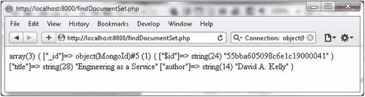
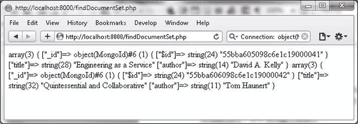
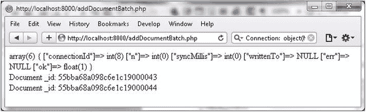

# 使用 MongoDB 查询与更新文档

## 查询文档集合

以下 PHP 代码演示了如何使用游标遍历查询结果：

```php
    while ($cursor->hasNext())
    {
        var_dump($cursor->getNext());
    }
    ?>
```

`findDocumentSet.php` 脚本如下：

```php
    <?php
    try
    {
    $connection = new MongoClient();
    $collection=$connection->local->catalog;
    $query = array('catalogId'=>'catalog1');
    $fields = array('title' => true, 'author' => true);
    $cursor = $collection->find($query, $fields);
    while ($cursor->hasNext())
    {
        var_dump($cursor->getNext());
    }
    }catch (MongoConnectionException $e)
    {
        echo '<p>Couldn\'t connect to mongodb</p>';
        exit();
    }catch(MongoCursorException $e) {
     echo $e;
        exit();
    }
    ?>
```

9.  在浏览器中运行 `findDocumentSet.php` 脚本，URL 为 `http://localhost:8000/findDocumentSet.php`，将输出从选定文档中选择的字段，如 图 3-18 所示。



图 3-18. 为文档子集查找字段子集

10. 要选择所有文档，请按如下方式指定查询：

```php
    $query = array();
```

当在浏览器中运行 `findDocumentSet.php` 脚本以选择所有文档时，将选择所有文档的选定字段，如 图 3-19 所示。



图 3-19. 为所有文档查找字段子集

### 更新文档

`MongoCollection::update()` 方法用于根据指定条件更新一个或多个文档。如果设置了 `w` 选项，该方法返回一个状态数组，否则返回一个布尔值。该方法的语法接受 `$criteria`、`$new_object` 和 `$options` 参数，均为数组类型。

```
MongoCollection::update ( array $criteria , array $new_object [, array $options = array() ] )
```

方法参数在 表 3-6 中讨论。

表 3-6. Update 方法的参数

| 参数 | 描述 |
| --- | --- |
| `$criteria` | 要更新的文档的查询条件。 |
| `$new_object` | 如果新对象包含 key=>value 对，则为替换文档。或者，如果新对象包含更新操作符，则为要更新的特定字段。 |
| `$options` | 主要选项是 `upsert`、`w.` 和 `multiple`。如果 `upsert` 选项设置为 true，则在没有文档匹配条件时添加新文档。`upsert` 的默认值为 false。`w` 的默认值为 1。如果 `multiple` 选项设置为 true，则更新多个文档。`multiple` 的默认值为 false。 |

接下来，我们将更新一些文档。

1.  首先，我们需要添加要更新的文档。运行 `addDocumentBatch.php` 脚本，URL 为 `http://localhost:8000/addDocumentBatch.php`，如 图 3-20 所示，向 `local` 数据库中的 `catalog` 集合添加两个文档。文档 `_id` 被输出。我们将使用这些 `_id` 值来更新文档。不同用户的 `_id` 值会不同。



图 3-20. 添加一批文档

2.  在 `C:\php` 目录中创建 PHP 脚本 `updateDocument.php`。在 `try`-`catch` 语句中，使用 `MongoClient` 实例创建与 MongoDB 的连接。为 `local` 数据库中的 `catalog` 集合创建一个 `MongoCollection` 实例。

```php
    $connection = new MongoClient();
    $collection=$connection->local->catalog;
```

3.  通过将数组中的 `_id` 字段设置为从 `53f3d425098c6e2410000065`（这是使用 `addDocumentBatch.php` 添加到 `catalog` 集合的其中一个文档的 `_id`）构造的 `MongoId` 实例，来指定要更新文档的 `$criteria`。不同用户的 `_id` 值会不同。

```php
    $criteria = array("_id" => new MongoId("55bba68a098c6e1c19000043 "));
```

4.  使用 key=>value 对为替换文档指定 `$new_object`。添加一个新字段 “updated” 并设置为 “true。”

```php
    $new_object = array("catalogId" => 'catalog1', "journal" => 'Oracle Magazine', "publisher" => 'Oracle Publishing', "edition" => '11-12-2013',"title" => 'Engineering As a Service',"author" => 'Kelly, David A.', "updated"=>true);
```

5.  使用 `$criteria` 和 `$new_object` 调用 `update()` 方法，并使用一个 `upsert` 设置为 `false` 的选项数组。

```php
    $status=$collection->update($criteria,$new_object, array("upsert" => false));
    var_dump($status);
```

6.  类似地，更新另一个文档。

```php
    $criteria = array("_id" => new MongoId("55bba68a098c6e1c19000044"));
    $new_object = array("catalogId" => 'catalog2', "journal" => 'Oracle Magazine', "publisher" => 'Oracle Publishing', "edition" => '11-12-2013',"title" => 'Quintessential and Collaborative',"author" => 'Haunert, Tom', "updated"=>true);
    $status=$collection->update($criteria,$new_object, array("upsert" => false));
    var_dump($status);
```

我们在前面的文档更新中将 `upsert` 选项设置为 false。接下来，我们将使用 `upsert` 选项设置为 true 来调用 `update` 方法。

为了演示如果未找到符合 `$criteria` 的文档，`upsert` 会添加新文档，请指定一个在数据库中不存在的 `_id` 的 `$criteria`。与 `updateDocument.php` 脚本中一样，不同的用户可以使用相同的 `_id` 值。


