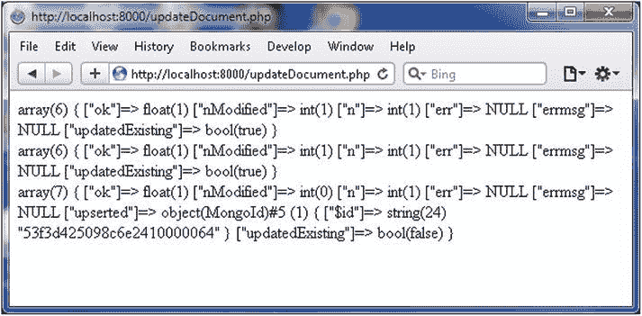
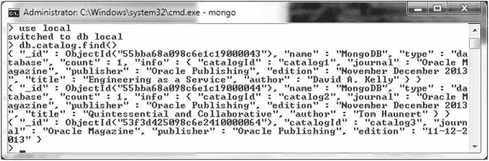
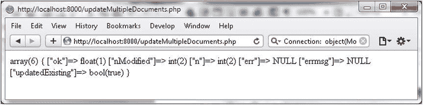
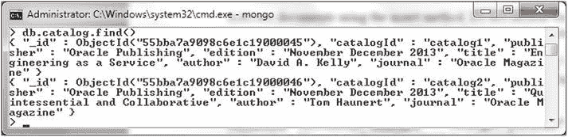
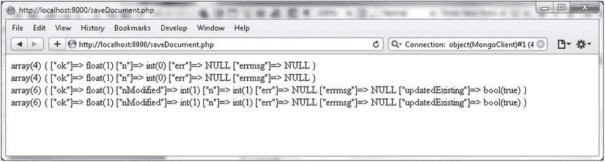
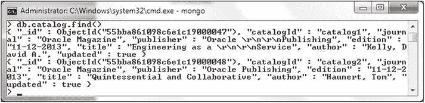
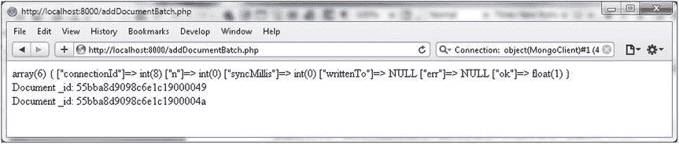
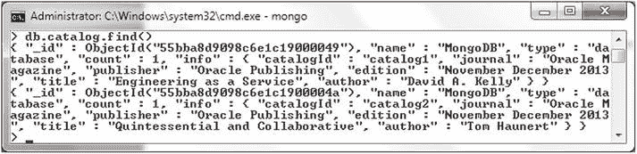
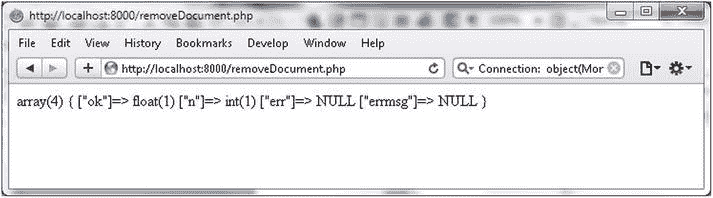
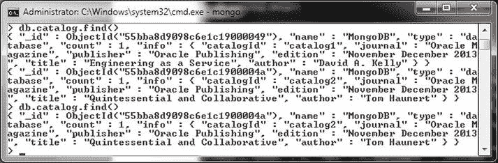

# 更新与插入文档

创建一个`$criteria`数组，指定要更新的文档。

```php
$criteria = array("_id" => new MongoId("53f3d425098c6e2410000064"));
```

指定一个`$new_object`来替换文档，并调用`update()`方法，同时将`upsert`选项设置为`true`。

```php
$new_object = array("catalogId" => 'catalog3', "journal" => 'Oracle Magazine', "publisher" => 'Oracle Publishing', "edition" => '11-12-2013');
$status=$collection->update($criteria,$new_object, array("upsert" => true));
```

`updateDocument.php`脚本如下：

```php
<?php
try
{
    $connection = new MongoClient();
    $collection=$connection->local->catalog;
    $criteria = array("_id" => new MongoId("55bba68a098c6e1c19000043"));
    $new_object = array("catalogId" => 'catalog1', "journal" => 'Oracle Magazine', "publisher" => 'Oracle Publishing', "edition" => '11-12-2013',"title" => 'Engineering As a Service',"author" => 'Kelly, David A.', "updated"=>true);
    $status=$collection->update($criteria,$new_object, array("upsert" => false));
    var_dump($status);
    print '<br/>';
    $criteria = array("_id" => new MongoId("55bba68a098c6e1c19000044"));
    $new_object = array("catalogId" => 'catalog2', "journal" => 'Oracle Magazine', "publisher" => 'Oracle Publishing', "edition" => '11-12-2013',"title" => 'Quintessential and Collaborative',"author" => 'Haunert, Tom', "updated"=>true);
    $status=$collection->update($criteria,$new_object, array("upsert" => false));
    var_dump($status);
    print '<br/>';
    $criteria = array("_id" => new MongoId("53f3d425098c6e2410000064"));
    $new_object = array("catalogId" => 'catalog3', "journal" => 'Oracle Magazine', "publisher" => 'Oracle Publishing', "edition" => '11-12-2013');
    $status=$collection->update($criteria,$new_object, array("upsert" => true));
    var_dump($status);
}
catch ( MongoConnectionException $e )
{
    echo '<p>Couldn\'t connect to mongodb</p>';
    exit();
}
catch(MongoCursorException $e) {
    echo '<p>w option is set and the write has failed</p>';
    exit();
}
?>
```

在浏览器中运行`updateDocument.php`脚本，URL 为`http://localhost:8000/updateDocument.php`。两个文档被更新，一个文档被插入（upserted）。在状态数组中，两个`updatedExisting`键为`true`，一个为`false`，如图 3-21 所示。


图 3-21. 更新文档

在 Mongo shell 中运行以下 JavaScript 方法：

```javascript
>use local
>db.catalog.find()
```

更新/插入的文档将被列出，如图 3-22 所示。


图 3-22. 列出更新的文档

### 更新多个文档

在上一节中，我们提到了`update()`方法中的`multiple`选项，用于更新多个文档。在本节中，我们将使用`multiple`选项。

1.  在`C:\php`目录中创建一个 PHP 脚本`updateMultiDocuments.php`。在`try`-`catch`语句中像之前一样创建一个`MongoCollection`实例。

    ```php
    $connection = new MongoClient();
    $collection=$connection->local->catalog;
    ```

2.  使用`insert()`方法添加两个文档。在添加的文档中不要包含`journal`字段，因为我们将使用`update()`方法添加该字段。

    ```php
    $collection->insert(array("catalogId" => 'catalog1', "publisher" => 'Oracle Publishing', "edition" => 'November December 2013',"title" => 'Engineering as a Service',"author" => 'David A. Kelly'));
    $collection->insert(array("catalogId" => 'catalog2', "publisher" => 'Oracle Publishing', "edition" => 'November December 2013',"title" => 'Quintessential and Collaborative',"author" => 'Tom Haunert'));
    ```

3.  我们将使用更新操作符`$set`在`update()`方法中将`journal`字段添加到这些文档中，同时将`multiple`选项设置为`true`。

    ```php
    $newdata = array('$set' => array("journal" => "Oracle Magazine"));
    ```

4.  调用`update()`方法，使用`$criteria`作为`edition`字段为`November December 2013`的文档，`$newdata`作为要更新的字段，以及`multiple`设置为`true`的选项数组。

    ```php
    $status=$collection->update(array("edition" => "November December 2013"), $newdata,array("multiple" => true));
    ```

    `updateMultiDocuments.php`脚本如下：

    ```php
    <?php
    try
    {
        $connection = new MongoClient();
        $collection=$connection->local->catalog;
        $collection->insert(array("catalogId" => 'catalog1', "publisher" => 'Oracle Publishing', "edition" => 'November December 2013',"title" => 'Engineering as a Service',"author" => 'David A. Kelly'));
        $collection->insert(array("catalogId" => 'catalog2', "publisher" => 'Oracle Publishing', "edition" => 'November December 2013',"title" => 'Quintessential and Collaborative',"author" => 'Tom Haunert'));
        $newdata = array('$set' => array("journal" => "Oracle Magazine"));
        $status=$collection->update(array("edition" => "November December 2013"), $newdata,array("multiple" => true));
        var_dump($status);
    }
    catch (MongoConnectionException $e)
    {
        echo '<p>Couldn\'t connect to mongodb</p>';
        exit();
    }
    catch(MongoCursorException $e) {
        echo $e;
        exit();
    }
    ?>
    ```

5.  在浏览器中运行`updateMultiDocuments.php`脚本，URL 为`http://localhost:8000/updateMultiDocuments.php`。在输出中，`updatedExisting`键值为`true`，`nModified`键值为 2，这表明两个现有文档被更新，如图 3-23 所示。

    
    图 3-23. 更新多个文档

6.  在 Mongo shell 中运行`db.catalog.find()`方法以列出更新的文档。如输出所示，文档包含了`journal`字段，如图 3-24 所示。

    
    图 3-24. 列出更新的文档

## 保存文档

默认情况下，`insert()`方法不会添加已存在于数据库中的文档。

## 保存文档

`MongoCollection` 类提供了另一种插入已修改文档的方法。`MongoCollection::save()` 方法将文档保存到集合中。**保存（Save）** 与 **插入（insert）** 的区别在于，要保存的文档可能已存在于数据库中。在本节中，我们将使用 `insert()` 方法添加两个文档，然后调用 `save()` 方法来保存这些文档，并修改其中某些字段的值。save 方法的语法如下：

```text
MongoCollection::save ( array|object $document [, array $options = array() ] )
```

1.  在 `C:\php` 目录下创建一个 PHP 脚本 `saveDocument.php`。在 `try`-`catch` 语句中创建一个 `MongoCollection` 实例。
    ```php
    $connection = new MongoClient();
    $collection=$connection->local->catalog;
    ```

2.  使用 `insert()` 方法添加两个文档。
    ```php
    $doc1 = array("catalogId" => 'catalog1', "journal" => 'Oracle Magazine', "publisher" => 'Oracle Publishing', "edition" => 'November December 2013',"title" => 'Engineering as a Service',"author" => 'David A. Kelly');
    $status=$collection->insert($doc1);
    $doc2 =array("catalogId" => 'catalog2', "journal" => 'Oracle Magazine', "publisher" => 'Oracle Publishing', "edition" => 'November December 2013',"title" => 'Quintessential and Collaborative',"author" => 'Tom Haunert');
    $status=$collection->insert($doc2);
    ```

3.  随后修改这两个文档中的部分字段值，并在修改后的文档上调用 `save()` 方法。
    ```php
    $doc1['edition']= '11-12-2013';
    $doc1['author'] = 'Kelly, David A.';
    $doc1['updated']=true;
    $status=$collection->save($doc1);
    $doc2['edition']='11-12-2013';
    $doc2['author'] = 'Haunert, Tom';
    $doc2['updated']=true;
    $status=$collection->save($doc2);
    ```
    `save()` 方法保存了带有修改后字段值的文档。如果我们使用 `insert` 方法来保存修改后的文档，将会收到错误。`saveDocument.php` 脚本如下：
    ```php
    <?php
    try
    {
    $connection = new MongoClient();
    $collection=$connection->local->catalog;
    $doc1 = array("catalogId" => 'catalog1', "journal" => 'Oracle Magazine', "publisher" => 'Oracle Publishing', "edition" => 'November December 2013',"title" => 'Engineering as a Service',"author" => 'David A. Kelly');
    $status=$collection->insert($doc1);
    var_dump($status);
    print '<br/>';
    $doc2 =array("catalogId" => 'catalog2', "journal" => 'Oracle Magazine', "publisher" => 'Oracle Publishing', "edition" => 'November December 2013',"title" => 'Quintessential and Collaborative',"author" => 'Tom Haunert');
    $status=$collection->insert($doc2);
    var_dump($status);
    print '<br/>';
    $doc1['edition']= '11-12-2013';
    $doc1['author'] = 'Kelly, David A.';
    $doc1['updated']=true;
    $status=$collection->save($doc1);
    var_dump($status);
    print '<br/>';
    $doc2['edition']='11-12-2013';
    $doc2['author'] = 'Haunert, Tom';
    $doc2['updated']=true;
    $status=$collection->save($doc2);
    var_dump($status);
    print '<br/>';
    }catch ( MongoConnectionException $e )
    {
        echo '<p>Couldn\'t connect to mongodb</p>';
        exit();
    }catch(MongoCursorException $e) {
     echo '<p>w option is set and the write has failed</p>';
        exit();
    }
    ?>
    ```

4.  在浏览器中运行 PHP 脚本，URL 为 `http://localhost:8000/saveDocument.php`。两个文档被添加，随后这两个文档被更新，如 图 3-25 中 `updatedExisting` 键值为 true 所示。
    
    图 3-25. 保存文档

5.  在 Mongo shell 中运行 JavaScript 方法 `db.catalog.find()` 以列出更新后的文档，如 图 3-26 所示。
    
    图 3-26. 列出已保存的文档

### 删除文档

`MongoCollection::remove()` 方法用于删除文档，其语法如下：

```text
MongoCollection::remove ([ array $criteria = array() [, array $options = array() ]] )
```

方法参数 `$criteria` 是要删除的文档的查询条件。大多数选项，如 `w`、`j`、`fsync`，与其他方法相同。`remove()` 方法提供了 `justOne` 选项来仅删除一个文档。在本节中，我们将从集合中删除一个文档。

1.  首先，使用 `addDocumentBatch.php` 脚本添加一些文档，如 图 3-27 所示。
    
    图 3-27. 使用 addDocumentBatch.php 添加文档
    mongo shell 中的 `db.catalog.find()` 方法应列出添加的两个文档，如 图 3-28 所示。
    
    图 3-28. 列出使用 addDocumentBatch.php 添加的文档

2.  在 `C:\php` 目录下创建一个 PHP 脚本 `removeDocument.php`。像之前一样创建一个 `MongoCollection` 实例。
    ```php
    $connection = new MongoClient();
    $collection=$connection->local->catalog;
    ```

3.  使用要删除的文档的 `_id` 作为方法参数调用 `remove` 方法。`_id` 字段必须以 `MongoId` 实例的形式提供，对于不同用户会有所不同。
    ```php
    $id = '55bba8d9098c6e1c19000049';
    $status=$collection->remove(array('_id' => new MongoId($id)));
    ```
    `removeDocument.php` 脚本如下：
    ```php
    <?php
    try
    {
    $id = '55bba8d9098c6e1c19000049';
    $connection = new MongoClient();
    $collection=$connection->local->catalog;
    $status=$collection->remove(array('_id' => new MongoId($id)));
    var_dump($status);
    }catch (MongoConnectionException $e)
    {
        echo '<p>Couldn\'t connect to mongodb</p>';
        exit();
    }
    ?>
    ```

4.  在浏览器中运行 `removeDocument.php` 脚本，URL 为 `http://localhost:8000/removeDocument.php` 以删除文档，如 图 3-29 所示。
    
    图 3-29. 删除文档

如果再次运行 `db.catalog.find()` 方法，则只列出一个文档，如 图 3-30 中 `db.catalog.find()` 的第二次运行结果所示。

图 3-30. 删除两个文档中的一个后列出文档

`remove()` 方法可用于删除所有文档。由于我们通过运行 `addDocumentBatch.php` 脚本添加的两个文档中只删除了一个，我们需要向 `catalog` 集合中添加更多文档来演示删除所有文档，因为仅删除一个文档无法证明所有或多个文档已被删除。

1.  再次运行 `addDocumentBatch.php` 脚本以再添加两个文档，使文档总数达到三个。
2.  接下来，在 `C:\php` 目录下创建一个 PHP 脚本 `removeAllDocuments.php`。像删除单个文档一样调用 `remove()` 方法，但提供一个空数组。
    ```php
    $status=$collection->remove(array());
    ```
    `removeAllDocuments.php` 脚本如下：
    ```php
    <?php
    try
    {
    $connection = new MongoClient();
    $collection=$connection->local->catalog;
    $status=$collection->remove(array());
    var_dump($status);
    }catch (MongoConnectionException $e)
    {
        echo '<p>Couldn\'t connect to mongodb</p>';
        exit();
    }
    ?>
    ```


