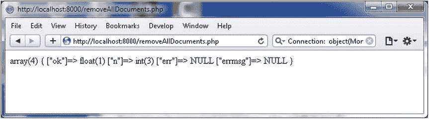

# PHP 操作 MongoDB：删除所有文档

```php
try {
    $connection = new MongoClient();
    $collection = $connection->local->catalog;
    $status = $collection->remove(array());
    var_dump($status);
} catch (MongoConnectionException $e) {
    echo '<p>无法连接到 mongodb</p>';
    exit();
}
?>
```

3.  使用 URL `http://localhost:8000/removeAllDocuments.php` 运行 PHP 脚本。如 图 3-31 中 `n=>int(3)` 所示，所有三个文档都被删除了。

    

    图 3-31. 运行 removeAllDocuments.php 脚本

随后运行 `db.catalog.find()` 将不会列出任何文档。请不要删除 `local` 数据库中的 `catalog` 集合，因为我们将在下一节中演示删除集合。

## 小结

在本章中，我们使用 PHP Driver for MongoDB 连接到 MongoDB 并在数据库上执行了 CRUD 操作。我们还讨论了添加、查找和更新单个文档与多个文档的区别。在下一章中，我们将使用 Ruby 与 MongoDB。

