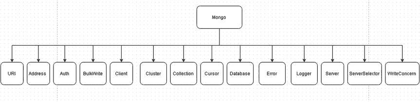
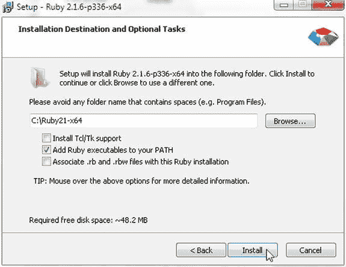
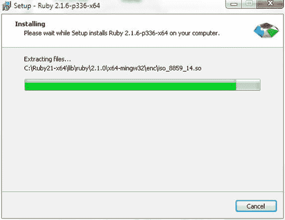
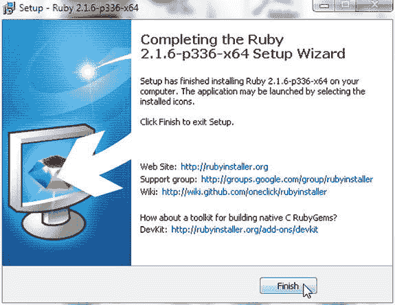
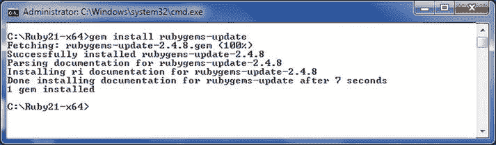
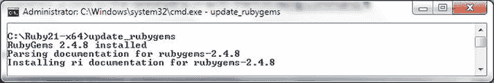
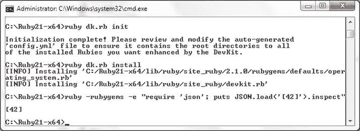

# 第 4 章


## 使用 Ruby 操作 MongoDB

Ruby 是一种开源编程语言，最常用于 Ruby on Rails 框架。Ruby 的一些显著特性包括简单性、灵活性、可扩展性、可移植性以及操作系统无关的线程处理。MongoDB Ruby 驱动程序可用于连接到 MongoDB 服务器，并对数据库中的数据进行添加、获取和更新操作。Ruby 驱动程序还提供了用于提高性能的 C 语言扩展。在本章中，我们将讨论使用 Ruby 客户端访问 MongoDB 并更改数据。本章涵盖以下主题：

*   入门指南
*   使用集合
*   使用文档

## 入门指南

在以下小节中，我们将介绍 Ruby Driver for MongoDB，并设置包含所需软件的环境。

#### Ruby Driver for MongoDB 概述

MongoDB 的 Ruby 驱动程序 API 可用于在 Ruby 脚本中连接到 MongoDB 服务器，并在服务器上执行 CRUD（创建、读取、更新、删除）操作。Ruby 驱动程序 API 中唯一的命名空间称为 `Mongo`。`Mongo` 命名空间中的主要类如 图 4-1 所示。



图 4-1. Ruby MongoDB 驱动程序中的核心类

`Mongo` 命名空间类在 表 4-1 中讨论。

表 4-1. Ruby MongoDB 驱动程序核心类

| 类 | 描述 | 示例用法 |
| --- | --- | --- |
| `URI` | 根据连接字符串格式规范定义的 MongoDB uri 的表示。 | `uri = URI.new('mongodb://localhost:27017')` |
| `Address` | 表示到服务器的地址。 | `Mongo::Address.new("127.0.0.1:27017")` |
| `Auth` | 表示认证。 | `Auth.get(user)` |
| `BulkWrite` | 用于批量写入操作。 | `Mongo::BulkWrite.get(collection, operations, ordered: true)` |
| `Client` | `Client` 类是驱动程序的入口点。 | `Mongo::Client.new([ '127.0.0.1:27017' ])` |
| `Cluster` | 表示一组服务器。 | `Mongo::Cluster.new(["127.0.0.1:27017"])` |
| `Collection` | 表示一个集合。 | `Mongo::Collection.new(database, 'test')` |
| `Cursor` | 客户端对查询结果的迭代器。不由用户直接创建，而是由 `CollectionView` 内部创建。 | `catalog.find.each { |document| puts document }` |
| `Database` | 表示服务器上的一个数据库。 | `Mongo::Database.new(client, :test)` |
| `Error` | `Error` 类。 | `Mongo::Error::BulkWriteFailure.new(response)` |
| `Logger` | 记录消息。 | `Logger.error('mongo', 'message', '10ms')` |
| `Server` | 表示单个服务器。 | `Mongo::Server.new('127.0.0.1:27017', cluster, listeners)` |
| `ServerSelector` | 根据给定的偏好选择服务器。 | `Mongo::ServerSelector.get({ :mode => :secondary })` |
| `WriteConcern` | 表示写关注。 | `Mongo::WriteConcern.get(:w => 1)` |

#### 设置环境

我们需要下载并安装以下软件以从 Ruby 访问 MongoDB 服务器。

*   Ruby 2.1.6 安装程序 (`rubyinstaller-2.1.6-x64.exe`)。从 `http://rubyinstaller.org/downloads/` 下载。MongoDB Ruby 驱动程序 2.x 支持 Ruby 版本 1.8.7、1.9、2.0 和 2.1。
*   Rubygems。
*   RubyInstaller Development Kit (DevKit)。从 `http://rubyinstaller.org/downloads/` 下载合适的版本。对于 Ruby 2.1.6，请下载 `DevKit-mingw64-64-4.7.2-20130224-1432-sfx.exe`。
*   MongoDB Ruby 驱动程序
*   MongoDB Server 3.0.5

### 安装 Ruby

要安装 Ruby，请双击 Ruby 安装程序应用程序 `rubyinstaller-2.1.6-x64.exe`。Ruby 安装向导将启动。

1.  选择安装语言并单击“确定”。
2.  接受许可协议并单击“下一步”。
3.  在“安装目标和可选任务”中，指定安装 Ruby 的目标文件夹，或选择默认文件夹。目录路径不应包含任何空格。选择“将 Ruby 可执行文件添加到您的 `PATH`”。
4.  单击“安装”，如 图 4-2 所示。

    

    图 4-2. 选择 Ruby 的安装目录

Ruby 开始安装，如 图 4-3 所示。



图 4-3. 安装 Ruby

安装向导完成 Ruby 的安装，如 图 4-4 所示。单击“完成”。



图 4-4. Ruby 已安装

接下来，安装 Rubygems，这是一个用于 Ruby 的包管理框架。运行以下命令来安装 Rubygems。

```
gem install rubygems-update
```

Rubygems gem 将被安装，如 图 4-5 所示。



图 4-5. 安装 Rubygems

如果 Rubygems 已经安装，请使用以下命令更新到最新版本。

```
update_rubygems
```

Rubygems 将被更新，如 图 4-6 所示。



图 4-6. 更新 Rubygems

### 安装 DevKit

DevKit 是一个工具包，用于构建许多适用于 Ruby 的 C/C++ 扩展。

1.  要安装 DevKit，请双击 DevKit 安装程序应用程序 (DevKit-mingw64-64-4.7.2-20130224-1432-sfx.exe) 将 DevKit 文件解压到一个目录。使用 `cd` 命令切换到文件解压到的目录。

    ```
    C:\Ruby21-x64
    ```

2.  使用以下命令初始化 DevKit 并自动生成 `config.yml` 文件。

    ```
    ruby dk.rb init
    ```

3.  在 C:\Ruby21-x64 目录中生成一个 `config.yml` 文件。将以下行添加到 `config.yml` 文件中。

    ```
    - C:/Ruby21-x64
    ```

4.  使用以下命令安装 DevKit。

    ```
    ruby dk.rb install
    ```

5.  使用以下命令验证 DevKit 是否已安装。

    ```
    ruby -rubygems -e "require 'json'; puts JSON.load('[42]').inspect"
    ```

用于初始化/安装 DevKit 的上述命令的输出显示在 图 4-7 的命令 shell 中。



图 4-7.


