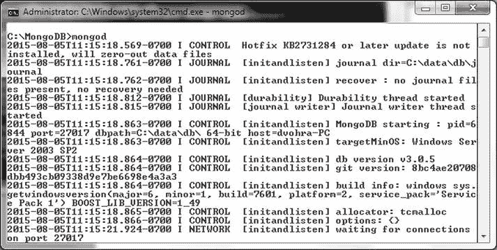
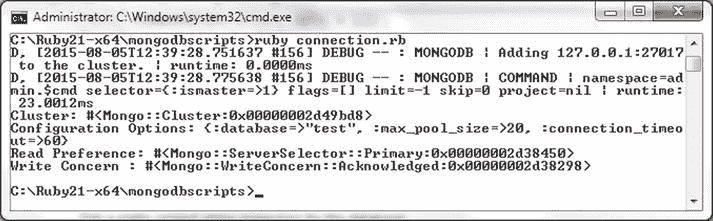

# 安装 MongoDB 的 Ruby 驱动

要安装 MongoDB Ruby 驱动 gem `mongo`，请完成以下步骤：

1.  运行以下命令。

    ```ruby
    >gem install mongo
    ```

    MongoDB Ruby 驱动 gem 安装过程如 图 4-8 所示。

    
    图 4-8. 安装 MongoDB Ruby 驱动

2.  接下来，安装 MongoDB 服务器。只有 MongoDB 2.4、2.6 和 3.x 版本与 MongoDB Ruby 驱动 2.x 兼容。从 `www.mongodb.org/` 下载 MongoDB 3.0.5，并将 zip 文件解压到一个目录。
3.  将 MongoDB 安装目录下的 `bin` 目录（例如，`C:\Program Files\MongoDB\Server\3.0\bin`）添加到 `PATH` 环境变量中。
4.  使用以下命令启动 MongoDB 服务器。

    ```bash
    >mongod
    ```

    MongoDB 服务器启动过程如 图 4-9 所示。

    
    图 4-9. 启动 MongoDB 服务器

## 使用集合

在以下小节中，我们将连接到 MongoDB 服务器，获取数据库信息，并创建一个集合。

### 与 MongoDB 建立连接

在本节中，我们将使用 Ruby 脚本连接到 MongoDB 服务器。

1.  为 Ruby 脚本创建一个名为 `C:\Ruby21-x64\mongodbscripts` 的目录。
2.  在 `C:\Ruby21-x64\mongodbscripts` 目录中创建一个 Ruby 脚本 `connection.rb`。在脚本中添加对 `mongo` gem 的 `require` 语句。为 `Mongo` 命名空间添加一个 `include` 语句。

    ```ruby
    require 'mongo'
    include Mongo
    ```

    `Client` 类提供了多个用于获取连接信息的属性和方法。部分属性在 表 4-2 中讨论。

    表 4-2. Client 类属性

    | 属性 | 描述 |
    | --- | --- |
    | `cluster` | 客户端的服务器集群。 |
    | `database` | 数据库实例。 |
    | `options` | 配置选项。 |

    `Client` 类中一些重要的方法在 表 4-3 中讨论。

    表 4-3. Client 类方法

    | 方法 | 返回类型 | 描述 |
    | --- | --- | --- |
    | `[]` | `Mongo::Collection` | 获取集合对象。 |
    | `database_names` | `Array<String>` | 获取所有数据库的名称。 |
    | `initialize` | `Client` | 实例化一个新的驱动客户端。 |
    | `list_databases` | `Array<Hash>` | 获取每个数据库的信息。 |
    | `read_preference` | `Object` | 获取指定选项的读取偏好。 |
    | `use(name)` | `Mongo::Client` | 使用指定名称的数据库。 |
    | `with(new_options = {})` | `Mongo::Client` | 使用这些选项提供一个新客户端。 |
    | `write_concern` | `Mongo::WriteConcern` | 获取写入关注。 |

    `Client` 类构造函数的语法如下。

    ```ruby
    initialize(addresses_or_uri, options = {})
    ```

    构造函数的参数在 表 4-4 中讨论。

    表 4-4. Client 构造函数参数

    | 参数 | 类型 | 描述 |
    | --- | --- | --- |
    | `addresses_or_uri` | `Array<String>, String` | 以 host:port 格式表示的服务器地址数组或 MongoDB URI 连接字符串。 |
    | `options` | `Hash` | 客户端选项。默认为 {}。 |

    `Client` 类构造函数支持的部分选项在 表 4-5 中讨论。

    表 4-5. Client 类构造函数选项

    | 选项 | 类型 | 描述 |
    | --- | --- | --- |
    | `:auth_mech` | Symbol | 要使用的认证机制。 |
    | `:connect` | Symbol | 要使用的连接方法。值可以是 `:direct`, `:replica_set`, `:sharded`。 |
    | `:database` | String | 要连接的数据库。 |
    | `:user` | String | 用户名。 |
    | `:password` | String | 密码。 |
    | `:max_pool_size` | Integer | 连接池的最大大小。 |
    | `:min_pool_size` | Integer | 连接池的最小大小。 |
    | `:connect_timeout` | Float | 连接超时时间（秒）。 |
    | `:read` | Hash | 读取偏好选项。`:mode` 选项可以设置为 `:secondary`, `:secondary_preferred`, `:primary`, `:primary_preferred`, `:nearest`。 |
    | `:replica_set` | Symbol | 要连接的副本集。 |
    | `:write` | Hash | 写入关注选项。 |

3.  在 `connection.rb` 脚本中，使用 `Client` 类的一个构造函数创建与 MongoDB 服务器的连接。可以显式指定主机和端口；如果未指定其中任何一个，则使用默认值。如果未指定主机和端口，默认的主机和端口是 `localhost:27017`。默认数据库是 `test`。以下是 `Client` 类构造函数的一些不同应用方式。

    ```ruby
    client =Mongo::Client.new
    client =Mongo::Client.new([ '127.0.0.1:27017' ], :database => 'test')
    client =Mongo::Client.new([ '127.0.0.1:27017' ], :database => 'test', :connect => :direct)
    client =Mongo::Client.new('mongodb://127.0.0.1:27017/test')
    client = Mongo::Client.new([ '127.0.0.1:27017' ], :database => 'test', :max_pool_size => 20, :connection_timeout => 60)
    ```

    可以指定主机的 IPv4 地址代替 localhost。

    ```ruby
    client =Mongo::Client.new(['192.168.1.72:27017' ], :database => 'test')
    ```

    可以输出 `Client` 类属性的值，并使用 `Client` 类实例调用实例方法。

    用于连接到 MongoDB 服务器、调用一些方法并输出一些属性值的 `connection.rb` 脚本如下所列：

    ```ruby
    require 'mongo'
    include Mongo
    #client =Mongo::Client.new([ '127.0.0.1:27017' ], :database => 'test')
    #client =Mongo::Client.new([ '127.0.0.1:27017' ], :database => 'test', :connect => :direct)
    #client =Mongo::Client.new('mongodb://127.0.0.1:27017/test')
    client = Mongo::Client.new([ '127.0.0.1:27017' ], :database => 'test', :max_pool_size => 20, :connection_timeout => 60)
    print "Cluster: "
    print  client.cluster
    print "\n"
    print "Configuration Options: "
    print  client.options
    print "\n"
    print "Read Preference: "
    print  client.read_preference
    print "\n"
    print "Write Concern : "
    print client.write_concern
    print "\n"
    ```

4.  从 `C:\Ruby21-x64\mongodbscripts` 目录，使用以下命令运行 `connection.rb` 脚本。

    ```bash
    >ruby connection.rb
    ```

    `connection.rb` 脚本的输出如 图 4-10 所示。

    
    图 4-10. 运行 Ruby 脚本 connection.rb

### 连接到数据库

一个 MongoDB 数据库实例由 `Mongo::Database` 类表示。在本节中，我们将创建一些 MongoDB 数据库实例并获取有关数据库的其他信息。

1.  在 `C:\Ruby21-x64\mongodbscripts` 目录中创建一个 Ruby 脚本 `db.rb`。`Database` 类提供了多个实例属性和方法。这些属性在 表 4-6 中讨论。

    表 4-6.


