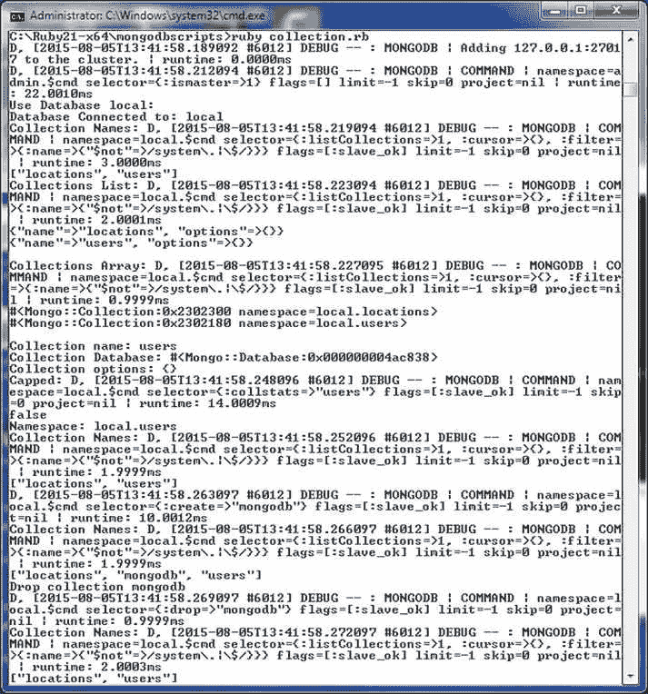
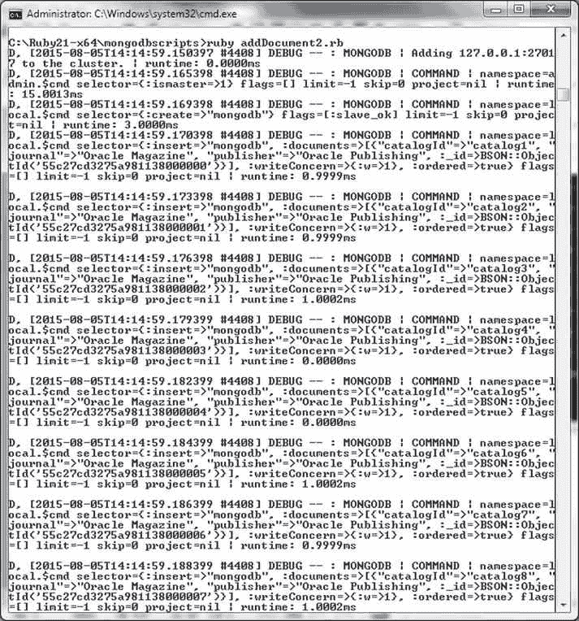
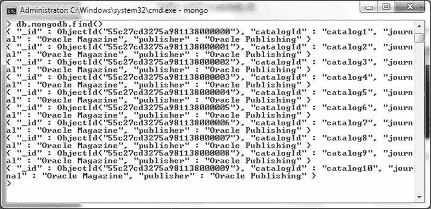

# Database 和 Collection 类参考

## Database 类

### 实例属性

| 参数 | 类型 | 描述 |
| --- | --- | --- |
| `client` | `Client` | 数据库客户端。 |
| `name` | `String` | 数据库名称。 |
| `options` | `Hash` | 配置选项。 |

`Database` 类支持的一些实例方法在 表 4-7 中讨论。

### Database 类方法

| 方法 | 返回类型 | 描述 |
| --- | --- | --- |
| `[]` 或 `collection` | `Mongo::Collection` | 获取此数据库中的一个集合。 |
| `collection_names(options = {})` | `Array<String>` | 获取所有非系统集合的名称。 |
| `collections` | `Array<Mongo::Collection>` | 获取此数据库下所有的集合。 |
| `command(operation, opts = {})` | `Hash` | 在数据库上执行一个命令。 |
| `drop` | `Result` | 删除此数据库。 |
| `initialize(client, name, options = {})` | `Database` | 实例化一个新的 `Database` 对象。 |
| `list_collections` | `Array<Hash>` | 获取数据库中所有集合的信息。 |
| `users` | `View::User` | 获取数据库的用户视图。 |

`Database` 类构造函数具有以下签名。

```ruby
initialize(client, name, options = {})
```

构造函数参数与类属性相同，并在 表 4-6 中讨论。

1.  在 `db.rb` 脚本中，像之前一样创建一个 `Client` 实例。

    ```ruby
    client = Mongo::Client.new([ '127.0.0.1:27017' ], :database => 'test')
    ```

2.  使用 `Client` 实例的 `database` 属性获取数据库，并使用数据库实例的 `name` 属性输出数据库名称。

    ```ruby
    db = client.database
    print db.name
    ```

3.  使用 `client` 和 `options` 属性输出客户端和配置选项。

    ```ruby
    print db.client
    print db.options
    ```

4.  使用 `Client` 类的 `database_names()` 方法输出数据库名称。

    ```ruby
    print client.database_names
    ```

5.  遍历 `Client` 实例的 `list_databases()` 方法返回的集合，输出每个数据库的信息。

    ```ruby
    client.list_databases.each { |info| puts info.inspect }
    ```

6.  要使用特定数据库，调用 `Client` 实例的 `use(database)` 方法。例如，可以将数据库设置为 `mongo` 数据库。

    ```ruby
    client = client.use(:mongo)
    ```

7.  将数据库设置为 `mongo` 后，再次输出数据库名称以验证设置。使用 `drop()` 方法删除数据库。

    ```ruby
    print db.drop
    ```

`db.rb` 脚本如下所列。

```ruby
require 'mongo'
include Mongo

client = Mongo::Client.new([ '127.0.0.1:27017' ], :database => 'test')
print "Database Connected to: "
db = client.database
print db.name
print "\n"

print "Database Client: "
print db.client
print "\n"

print "Database Options: "
print db.options
print "\n"

print "Database Names: "
print client.database_names
print "\n"

print "Database Info: "
client.list_databases.each { |info| puts info.inspect }
print "\n"

print "Use Database mongo: "
client = client.use(:mongo)
print "\n"

print "Database Connected to: "
db = client.database
print db.name
print "\n"

print "Use Database mongo: "
client = client.use(:local)
print "\n"

print "Database Connected to: "
db = client.database
print db.name
print "\n"

print db.drop
```

8.  使用以下命令运行 `db.rb` 脚本。

    ```bash
    >ruby db.rb
    ```

`db.rb` 脚本的输出如 图 4-11 所示。在输出中需要注意的是，将数据库实例设置为 `mongo` 后，`mongo` 数据库实例不会通过 `database_names` 列出，因为尚未访问该数据库实例。


**图 4-11** 运行 Ruby 脚本 db.rb

在删除数据库实例 `local` 后，如 图 4-12 所示，该数据库不会在 Mongo shell 中通过 `show dbs` 命令列出。


**图 4-12** `local` 数据库未通过 `show dbs` 列出

由于我们将在后续章节中使用 `local` 数据库，请在 Mongo shell 中使用以下命令创建 `local` 数据库。

```bash
>use local
>db.createCollection("local")
```

### 创建集合

`Mongo::Database` 类提供了几种用于集合的方法，这些方法在 表 4-7 中讨论。集合由 `Mongo::Collection` 类表示。`Collection` 类提供了几个实例属性和方法。属性在 表 4-8 中讨论。

### Collection 类实例属性

| 参数 | 类型 | 描述 |
| --- | --- | --- |
| `database` | `Mongo::Database` | 所属数据库。 |
| `name` | `String` | 集合名称。 |
| `options` | `Hash` | 配置选项。 |

`Collection` 类支持的一些实例方法在 表 4-9 中讨论。

### Collection 类实例方法

| 方法 | 返回类型 | 描述 |
| --- | --- | --- |
| `bulk_write(operations, options)` | `BSON::Document` | 运行一批批量写操作。 |
| `capped?` | `true`, `false` | 判断集合是否为固定集合。 |
| `create` | `Result` | 创建一个集合。 |
| `drop` | `Result` | 删除一个集合。 |
| `find(filter = nil)` | `CollectionView` | 查找集合中的文档。 |
| `indexes(options = {})` | `View::Index` | 返回集合所有索引的视图。 |
| `insert_many(documents, options = {})` | `Result` | 在集合中插入提供的文档。 |
| `insert_one(document, options = {})` | `Result` | 在集合中插入单个文档。 |
| `namespace` | `String` | 获取集合的完全限定命名空间。 |

`Collection` 类构造函数具有以下签名。

```ruby
initialize(database, name, options = {})
```

构造函数参数与类属性相同。

1.  首先，在 `C:\Ruby21-x64\mongodbscripts` 目录中创建一个 Ruby 脚本 `collection.rb`，并像之前一样包含 `mongo` gem 和 `Mongo` 命名空间。
2.  创建一个用于连接到 MongoDB 的 `Client` 实例，随后获取 `local` 数据库的实例。

    ```ruby
    client = Mongo::Client.new([ '127.0.0.1:27017' ], :database => 'test')
    ```

3.  使用 `Client` 类中的 `use(database)` 实例方法，将数据库设置为 `local`。

    ```ruby
    client = client.use(:local)
    ```

4.  使用 `Mongo::Database` 类中的 `collection_names()` 方法输出集合名称。

    ```ruby
    print db.collection_names({})
    ```

5.  使用 `list_collections()` 方法输出所有集合的信息。

    ```ruby
    db.list_collections.each { |info| puts info.inspect }
    ```

6.  使用 `collections()` 方法输出所有集合的数组。

    ```ruby
    db.collections.each { |info| puts info.inspect }
    ```


## 使用文档

在以下小节中，我们将向 MongoDB 服务器添加一个文档、添加一批文档、查找单个文档、查找多个文档、更新文档、删除文档以及执行批量操作。

### 添加文档

在本节中，我们将向一个 MongoDB 集合添加单个文档。使用 `Collection` 类中的 `insert_one(document, options = {})` 方法来添加文档。`document` 参数是要添加的文档。`options` 参数是一个定制选项的哈希表，默认值为 `{}`。

1.  创建一个 Ruby 脚本 `addDocument.rb`，并为 `mongo` gem 和 `Mongo` 命名空间分别添加 `require` 和 `include` 语句。
2.  创建一个连接，将数据库设置为 `local` 并获取 `mongodb` 集合。
    ```ruby
    client =Mongo::Client.new([ '127.0.0.1:27017' ], :database => 'test')
    client=client.use(:local)
    db=client.database
    collection=db.collection("mongodb")
    ```
3.  如果 `mongodb` 集合尚不存在，则必须调用 `create()` 方法。
    ```ruby
    collection.create
    ```
4.  创建要添加的文档 JSON。
    ```ruby
    document1={
      "_id" => "document1a",
      "catalogId" => "catalog1",
      "journal" => "Oracle Magazine",
      "publisher" => "Oracle Publishing",
      "edition" =>  "November December 2013",
      "title" => "Engineering as a Service",
      "author" =>  "David A. Kelly"
    }
    ```
5.  调用 `insert_one()` 方法将文档添加到 `mongodb` 集合中。
    ```ruby
    collection.insert_one(document1)
    ```
6.  同样添加另一个文档。
    ```ruby
    document2={
      "_id" => "document1a",
      "catalogId" => "catalog2",
      "journal" => "Oracle Magazine",
      "publisher" => "Oracle Publishing",
      "edition" =>  "November December 2013",
      "title" => "Quintessential and Collaborative",
      "author" =>  "Tom Haunert"
    }
    collection.insert_one(document2)
    ```

`addDocument.rb` 脚本如下所示：
```ruby
require 'mongo'
include Mongo
client =Mongo::Client.new([ '127.0.0.1:27017' ], :database => 'test')
client=client.use(:local)
db=client.database
collection=db.collection("mongodb")

collection.create

document1={
  "_id" => "document1a",
  "catalogId" => "catalog1",
  "journal" => "Oracle Magazine",
  "publisher" => "Oracle Publishing",
  "edition" =>  "November December 2013",
  "title" => "Engineering as a Service",
  "author" =>  "David A. Kelly"
}

collection.insert_one(document1)

document2={
  "catalogId" => "catalog2",
  "journal" => "Oracle Magazine",
  "publisher" => "Oracle Publishing",
  "edition" =>  "November December 2013",
  "title" => "Quintessential and Collaborative",
  "author" =>  "Tom Haunert"
}
collection.insert_one(document2)
```

7.  使用以下命令运行 `addDocument.rb` 脚本。
    ```bash
    >ruby addDocument.rb
    ```

`addDocument.rb` 脚本的输出如 图 4-13 所示。


图 4-13. 运行 collection.rb 脚本

8.  在 Mongo shell 中运行以下 JavaScript 方法。
    ```javascript
    >db.mongodb.find()
    ```
    添加的两个文档被列出，如 图 4-15 所示。


图 4-15. 查找并列出已添加的文档

9.  添加文档的 `_id` 必须是唯一的，否则会生成 `OperationFailure` 错误。


为了演示添加两个具有相同 `_id` 的文档，下面列出了用于演示 `OperationFailure` 错误的 Ruby 脚本 `addDocument.rb`：
```ruby
require 'mongo'
include Mongo

client =Mongo::Client.new([ '127.0.0.1:27017' ], :database => 'test')
client=client.use(:local)
db=client.database
collection=db.collection("mongodb")

collection.create

document1={
  "_id" => "document1a",
  "catalogId" => "catalog1",
  "journal" => "Oracle Magazine",
  "publisher" => "Oracle Publishing",
  "edition" =>  "November December 2013",
  "title" => "Engineering as a Service",
  "author" =>  "David A. Kelly"
}

collection.insert_one(document1)

document2={
  "_id" => "document1a",
  "catalogId" => "catalog2",
  "journal" => "Oracle Magazine",
  "publisher" => "Oracle Publishing",
  "edition" =>  "November December 2013",
  "title" => "Quintessential and Collaborative",
  "author" =>  "Tom Haunert"
}

collection.insert_one(document2)
```

当再次使用 `ruby addDocument.rb` 运行该脚本时，会生成 `OperationFailure` 错误，如图 4-16 所示。

图 4-16. 因重复键导致的 OperationFailure 错误

### 添加多个文档

在上一节中，我们添加了两个文档，但通过调用两次 `insert_one()` 方法实现。`Mongo::Collection` 类提供了 `insert_many(documents, options = {})` 方法来添加多个文档。

1.  在 `C:\Ruby21-x64\mongodbscripts` 目录中创建一个 Ruby 脚本 `addDocuments.rb`。
2.  像之前一样创建一个 `Client` 实例并获取 `mongodb` 集合。为了使新添加的文档不会与 `mongodb` 集合中已有的文档产生重复键，请在运行 `addDocuments.rb` 脚本之前，使用 mongo shell 中的 `db.mongodb.drop()` 方法删除 `mongodb` 集合。
    ```ruby
    client =Mongo::Client.new([ '127.0.0.1:27017' ], :database => 'test')
    client=client.use(:local)
    db=client.database
    collection=db.collection("mongodb")
    collection.create
    ```
3.  创建两个文档的 JSON。
    ```ruby
    document1={
      "catalogId" => "catalog1",
      "journal" => "Oracle Magazine",
      "publisher" => "Oracle Publishing",
      "edition" =>  "November December 2013",
      "title" => "Engineering as a Service",
      "author" =>  "David A. Kelly"
    }

    document2={
      "catalogId" => "catalog2",
      "journal" => "Oracle Magazine",
      "publisher" => "Oracle Publishing",
      "edition" =>  "November December 2013",
      "title" => "Quintessential and Collaborative",
      "author" =>  "Tom Haunert"
    }
    ```
4.  调用 `insert_many()` 方法添加这两个文档。
    ```ruby
    collection.insert_many([document1,document2])
    ```

`addDocuments.rb` 脚本内容如下：
```ruby
require 'mongo'
include Mongo
client =Mongo::Client.new([ '127.0.0.1:27017' ], :database => 'test')
client=client.use(:local)
db=client.database
collection=db.collection("mongodb")
collection.create
document1={
  "catalogId" => "catalog1",
  "journal" => "Oracle Magazine",
  "publisher" => "Oracle Publishing",
  "edition" =>  "November December 2013",
  "title" => "Engineering as a Service",
  "author" =>  "David A. Kelly"
}

document2={
  "catalogId" => "catalog2",
  "journal" => "Oracle Magazine",
  "publisher" => "Oracle Publishing",
  "edition" =>  "November December 2013",
  "title" => "Quintessential and Collaborative",
  "author" =>  "Tom Haunert"
}

collection.insert_many([document1,document2])
```

使用 `ruby addDocuments.rb` 运行脚本。`addDocuments.rb` 脚本的输出如图 4-17 所示。

图 4-17. addDocuments.rb 脚本的输出

5.  为了验证两个文档已被添加，在 Mongo shell 中运行以下命令。
    ```javascript
    >db.mongodb.find()
    ```

已添加的两个文档会被列出，如图 4-18 所示。

图 4-18. 列出使用 insert_many 添加的文档

在本节中，我们还将使用 `for` 循环来添加多个文档。

1.  使用 `db.mongodb.drop()` 删除 `mongodb` 集合。
2.  创建另一个 Ruby 脚本 `addDocument2.rb`，并在 `local` 数据库中创建集合 `mongodb`。首先获取 `local` 数据库实例，然后调用 `create()` 方法来创建集合。
    ```ruby
    client =Mongo::Client.new([ '127.0.0.1:27017' ], :database => 'test')
    client=client.use(:local)
    db=client.database
    collection=db.collection("mongodb")
    collection.create
    ```
3.  使用 `for` 循环，为 `catalogId` 创建一个变量，并在 `for` 循环的每次迭代中使用该变量值创建一个新的文档实例。使用 `insert_one()` 方法将文档实例添加到集合中。`addDocument2.rb` 脚本内容如下：
    ```ruby
    require 'mongo'
    include Mongo

    client =Mongo::Client.new([ '127.0.0.1:27017' ], :database => 'test')
    client=client.use(:local)
    db=client.database
    collection=db.collection("mongodb")
    collection.create
    for i in 1..10 do
      catalogId="catalog"+i.to_s
      document={
        "catalogId" => catalogId,
        "journal" => "Oracle Magazine",
        "publisher" => "Oracle Publishing"
      }
      collection.insert_one(document)
      print "\n"
    end
    ```
4.  使用以下命令运行 `addDocument2.rb` 脚本。
    ```bash
    >ruby addDocument2.rb
    ```

脚本的输出显示添加了多个文档，如图 4-19 所示。

图 4-19. 运行 addDocument2.rb 脚本

5.  随后，在 Mongo shell 中运行以下 JavaScript 方法来列出添加的文档。
    ```javascript
    >db.mongodb.find()
    ```

添加的文档会被列出，如图 4-20 所示。

图 4-20. 列出使用 for 循环添加的多个文档

### 查找单个文档

`Mongo::Collection` 类中的 `find(filter = nil)` 方法用于查找一个或多个文档。默认情况下，如果未指定筛选器，则查找所有文档。在本节中，我们将使用筛选器查找单个文档。

1.  在 `C:\Ruby21-x64\mongodbscripts` 目录中创建一个 Ruby 脚本 `findDocument.rb`。
2.  像之前一样创建 `mongodb` 集合。
3.  像在 `addDocuments.rb` 脚本中一样，使用 `insert_many()` 方法添加两个文档。
4.  调用 `find()` 方法，指定筛选条件 `catalogId` 为 `catalog1`。遍历结果游标以输出找到的文档。
    ```ruby
    collection.find(:catalogId=>"catalog1").each do |document|
        print document
    end
    ```

`findDocument.rb` 脚本内容如下。
```ruby
require 'mongo'
include Mongo
client =Mongo::Client.new([ '127.0.0.1:27017' ], :database => 'test')
client=client.use(:local)
db=client.database
```


