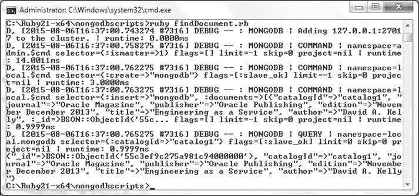
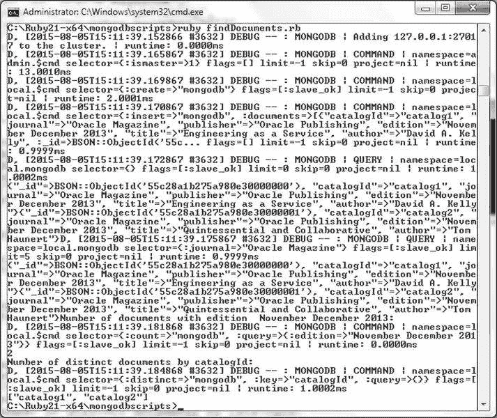

# 使用 `find()` 方法查找文档

### 查找单个文档

使用 `collection.find(:catalogId=>"catalog1").each do |document|` 迭代并打印找到的文档。

使用以下命令删除 `mongodb` 集合：`db.mongodb.drop()`。然后使用以下命令运行脚本：

```
>ruby findDocument.rb
```

找到的 `catalogId` 为 `catalog1` 的文档如图 4-21 所示输出。


图 4-21. 查找单个文档

### 查找多个文档

本节我们将使用 `find()` 方法查找多个文档。`find(filter = nil)` 方法可用于查找与过滤器匹配的多个文档。`find()` 方法返回一个游标。如果对 `find()` 方法的调用包含一个代码块，就像对 `find()` 方法的结果调用 `each()` 方法一样，该方法会将游标传递给代码块，可以迭代该代码块以输出文档。

1.  要使用 `find()` 方法查找文档，请在 `C:\Ruby21-x64\mongodbscripts` 目录中创建一个 Ruby 脚本 `findDocuments.rb`。
2.  如前所述，创建一个集合实例。`find()` 方法本身不返回 `Cursor` 对象，而是返回一个创建 `Cursor` 的 `CollectionView`。以下每一行都返回一个 `CollectionView` 对象。

    ```
    print collection.find()
    print collection.find({"journal" => "Oracle Magazine"})
    ```

3.  `Cursor` 类实现了 `Enumerable`，这意味着可以使用 `Enumerable` 的方法（如 `each`）。要输出 `Cursor` 中的文档，请使用 `each` 方法迭代结果集。

    ```
    collection.find.each { |document| puts document }
    ```

4.  要输出所有文档，可以使用 `Enumerable#find.to_a()` 方法，该方法会一次性将所有文档加载到内存中，因此与在块迭代中一次处理一个文档的 `each()` 方法相比效率较低。

    ```
    puts collection.find.to_a
    ```

5.  在 `findDocuments.rb` 脚本中，创建一个文档数组，并使用 `insert_many` 脚本添加。

    ```
    collection.insert_many([document1,document2])
    ```

6.  尝试以下每种查找文档的选项：
    *   使用 `find()` 方法查找所有文档，并在由 `CollectionView` 生成的 `Cursor` 上调用 `each` 以迭代返回的文档集合。

        ```
        collection.find().each do |document|
           print document
        end
        ```

    *   作为另一个示例，仅查找 `:journal` 设置为 'Oracle Magazine' 的文档，并使用 `limit()` 方法限制返回的文档数量。

        ```
        collection.find(:journal => 'Oracle Magazine').limit(5).each do |document|
              print document
           end
        ```

    *   要查找特定版本的文档数量，请使用 `count()` 方法。

        ```
        print collection.find(:edition => 'November December 2013').count
        ```

    *   可以使用 `distinct()` 方法查找不同的文档。

        ```
        print collection.find.distinct(:catalogId)
        collection.find(:journal => 'Oracle Magazine').limit(5).each do |document|
              print document
           end
        ```

    `findDocuments.rb` 脚本如下所列。

    ```
    require 'mongo'
    include Mongo
    client =Mongo::Client.new([ '127.0.0.1:27017' ], :database => 'test')
    client=client.use(:local)
    db=client.database
    collection=db.collection("mongodb")
    collection.create
    document1={
      "catalogId" => "catalog1",
      "journal" => "Oracle Magazine",
      "publisher" => "Oracle Publishing",
      "edition" =>  "November December 2013",
      "title" => "Engineering as a Service",
      "author" =>  "David A. Kelly"
    }
    document2={
      "catalogId" => "catalog2",
      "journal" => "Oracle Magazine",
      "publisher" => "Oracle Publishing",
      "edition" =>  "November December 2013",
      "title" => "Quintessential and Collaborative",
      "author" =>  "Tom Haunert"
    }
     collection.insert_many([document1,document2])
       collection.find().each do |document|
          print document
       end
    collection.find(:journal => 'Oracle Magazine').limit(5).each do |document|
          print document
       end
    print "Number of documents with edition  November December 2013: "
    print "\n"
    print collection.find(:edition => 'November December 2013').count
    print "\n"
    print "Number of distinct documents by catalogId: "
    print "\n"
    print collection.find.distinct(:catalogId)
    ```

7.  由于该集合将再次使用，请使用 `db.mongodb.drop()` 删除 `mongodb` 集合。使用以下命令运行 `findDocuments.rb` 脚本。

    ```
    >ruby findDocuments.rb
    ```

`findDocuments.rb` 脚本的输出如图 4-22 所示。


图 4-22. 查找多个文档

`collection.find()` 的输出列出了 `mongodb` 集合中的两个文档。`collection.find(:journal => 'Oracle Magazine').limit(5)` 的输出则列出了 `:journal` 设置为 'Oracle Magazine' 的文档。`limit()` 方法将结果限制为 5，但由于集合只有 2 个文档，`limit` 方法没有效果。`collection.find(:edition => 'November December 2013').count()` 方法调用输出了版本为 'November December 2013' 的文档数量为 2。`collection.find.distinct(:catalogId)` 方法查找了 `mongodb` 集合中两个不同的 `catalogId`。

`find()` 方法返回一个集合视图，当在视图上调用 `each` 时，会创建一个 `Cursor` 对象。`Mongo::Collection::View` 是查询和选项的表示，生成文档结果集。`find()` 方法本身不会将查询发送到服务器。必须在 `find()` 方法之后调用另一个方法才能将查询发送到服务器。例如，在 `View` 上调用 `each()` 方法时，会创建一个将查询发送到服务器的 `Cursor` 对象。`Mongo::Collection::View` 类支持表 4-10 中讨论的方法。这些方法来自 `Writable`、`Explainable`、`Readable` 和 `Iterable` 类。

表 4-10. `Mongo::Collection::View` 类实例方法

| 方法 | 返回类型 | 描述 |
| --- | --- | --- |
| `delete_many` | Result | 删除多个文档。


