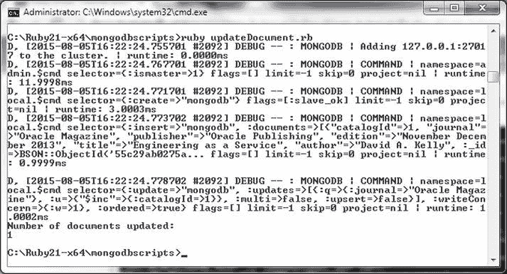
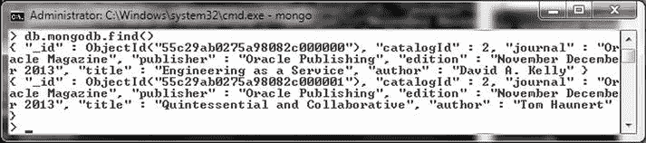
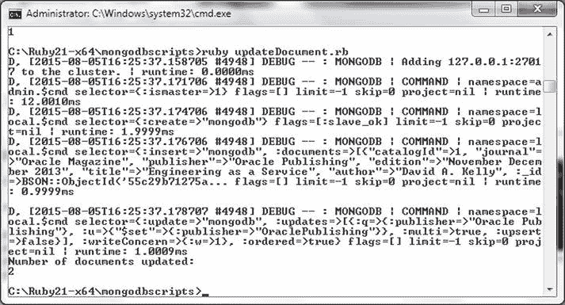
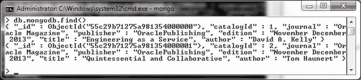
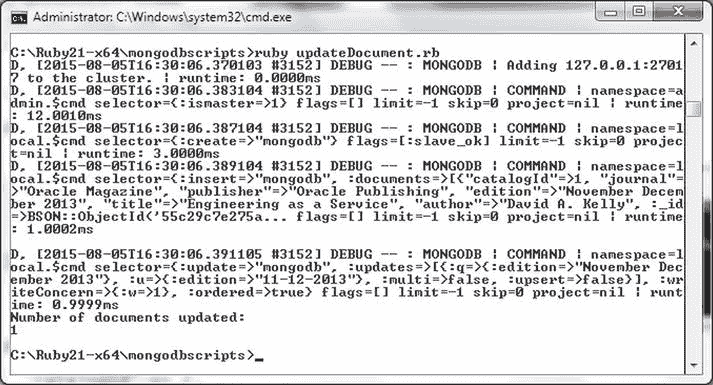
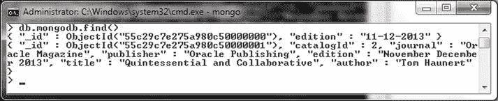
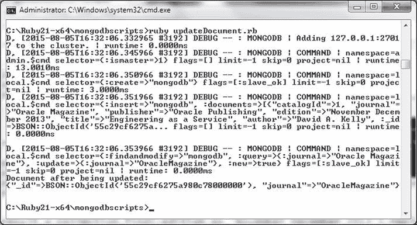
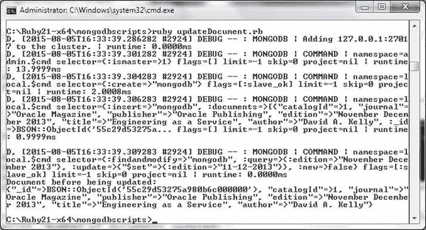
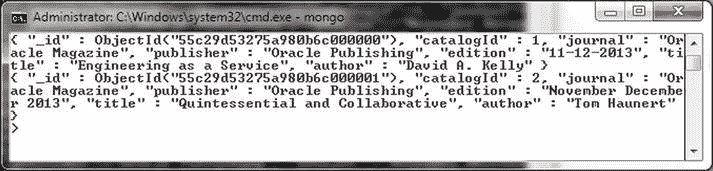

# 方法参考

| 方法 | 返回类型 | 描述 |
|------|----------|------|
| `delete_one` | Result | 删除单个文档。 |
| `find_one_and_delete` | BSON::Document | 查找并删除一个文档。 |
| `find_one_and_replace(replacement, opts = {})` | BSON::Document | 查找并替换一个文档。 |
| `find_one_and_update(document, opts = {})` | BSON::Document | 查找并更新一个文档。 |
| `replace_one(document, opts = {})` | Result | 替换单个文档。 |
| `update_many(spec, opts = {})` | Result | 更新多个文档。 |
| `update_one(spec, opts = {})` | Result | 更新单个文档。 |
| `explain` | Hash | 获取查询的解释计划。 |
| `aggregate(pipeline, options = {})` | Aggregation | 创建集合视图的聚合。 |
| `allow_partial_results` | View | 允许查询在部分分片宕机时获取部分结果。 |
| `batch_size(batch_size = nil)` | (Integer, View) | 设置批处理大小。设置为 1 或负值相当于设置限制。 |
| `comment(comment = nil)` | (String, View) | 为查询关联注释。 |
| `count(options = {})` | Integer | 获取匹配文档的数量。 |
| `distinct(field_name, options = {})` | Array&lt;Object&gt; | 获取不同值的列表。 |
| `hint(hint = nil)` | Hash, View | 查询必须使用的 MongoDB 索引。 |
| `limit(limit = nil)` | Integer, View | 限制查询返回文档的最大数量。 |
| `map_reduce(map, reduce, options = {}))` | MapReduce | 在查询上运行 map reduce 函数。 |
| `max_scan(value = nil)` | Integer, View | 设置要扫描文档的最大数量。 |
| `no_cursor_timeout` | View | 默认情况下，服务器会在空闲 10 分钟后超时游标以防止内存过度使用。设置`no_cursor_timeout`不会使空闲游标超时。 |
| `projection(document = nil)` | Hash, View | 在结果集中为每个文档包含或排除的字段。 |
| `read(value = nil)` | Symbol, View | 读取偏好。 |
| `show_disk_loc(value = nil)` | (true, false, View) | 设置是否应显示每个文档的磁盘位置。值可以是`true`、`false,`或`nil`（默认）。 |
| `skip(number = nil)` | Integer, View | 要跳过的文档数量。设置为整数值。 |
| `snapshot(value = nil)` | Object | 当设置为`true`时，防止文档返回超过一次。值可以是`true`、`false,`或`nil`。 |
| `sort(spec = nil)` | Hash, View | 指定结果集排序方式的键值对（作为 Hash）。 |
| `each {&#124;Each&#124; ... }` | Enumerator | 用于遍历结果集中的文档。 |

### 更新文档

`Collection`类不直接提供用于更新文档的任何实例方法。但是，由`find()`方法返回的集合视图提供了几种方法，如前面第 4-10 表中讨论的，用于更新或替换文档。在本节中，我们将更新文档。

1.  在`C:\Ruby21-x64\mongodbscripts`目录中创建一个 Ruby 脚本`updateDocument.rb`。
2.  在`updateDocument.rb`脚本中，如果`mongodb`集合已存在则删除它，然后创建`mongodb`集合。
3.  向`mongodb`集合添加两个文档。
4.  为`mongodb`集合创建一个集合视图。

    ```
    collection = client[:mongodb]
    ```

我们将讨论几个示例，在这些示例中，两个文档将被添加到`mongodb`集合中，随后被更新或替换。

## 示例 1：使用`update_one()`

1.  对于第一个示例，使用`update_one()`方法将其中一个文档的`catalogId`递增 1。使用`$inc`更新操作符来递增`catalogId`。`find()`方法查找所有`journal`设置为`'Oracle Magazine'`的文档。

    ```
    result = collection.find(:journal => 'Oracle Magazine').update_one("$inc" => { :catalogId => 1 })
    ```

2.  输出更新的文档数量。

    ```
    print result.n
    ```

3.  运行`updateDocument.rb`脚本。

    ```
    >ruby updateDocument.rb
    ```

    如图 4-23 所示的输出所示，一个文档被更新。

    
    图 4-23. 运行 updateDocument.rb 脚本

4.  在 Mongo shell 中运行`db.mongodb.find()`命令以列出更新后的文档，如图 4-24 所示。两个文档的`catalogId`都为 2；一个文档起始`catalogId`为 1，另一个的`catalogId`被递增了 1。

    
    图 4-24. 其中一个文档的 catalogId 被递增 1 至 2

## 示例 2：使用`update_many()`

1.  对于第二个示例，使用`update_many`方法更新多个文档。使用`$set`更新操作符将 publisher 字段设置为`OraclePublishing`。`find()`方法设置了过滤器，用于查找所有`publisher`设置为`'Oracle Publishing'`的文档。

    ```
    result = collection.find(:publisher => 'Oracle Publishing').update_many('$set' => { publisher: 'OraclePublishing'})
    ```

2.  使用`db.mongodb.drop()`删除`mongodb`集合。运行`updateDocument.rb`脚本。输出表明两个文档已被更新，如图 4-25 所示。

    
    图 4-25. 更新多个文档

3.  运行`db.mongodb.find()`方法以列出两个更新后的文档，如图 4-26 所示。

    
    图 4-26. 列出两个更新后的文档

## 示例 3：使用`replace_one()`

1.  在第三个示例中，查找`edition`设置为 November December 2013 的文档，并使用`replace_one()`方法将其中一个文档替换为仅包含`edition`字段且设置为`'11-12-2013'`的文档。

    ```
    result = collection.find(:edition => 'November December 2013').replace_one(:edition => '11-12-2013')
    ```

2.  使用`db.mongodb.drop()`删除`mongodb`集合。运行仅包含示例 3 的`updateDocument.rb`脚本。如输出所示，一个文档已被更新（替换），如图 4-27 所示。

    
    图 4-27. 替换单个文档

3.  在 Mongo shell 中运行`db.mongodb.find()`命令以列出替换后的文档，如图 4-28 所示。

    
    图 4-28. 列出替换后的文档

## 示例 4：使用`find_one_and_replace()`

1.  在第四个示例中，`find()`方法的过滤器设置为查找所有`journal`设置为`'Oracle Magazine'`的文档，并使用`find_one_and_replace()`方法查找并替换一个文档，替换为仅设置了`journal`字段的文档。`return_document`设置为`:after`以返回替换后的文档。

    ```
    document = collection.find(:journal => 'Oracle Magazine').find_one_and_replace({:journal => 'OracleMagazine'}, :return_document => :after)
    ```

    使用`db.mongodb.drop()`删除`mongodb`集合。当运行`updateDocument.rb`脚本时，一个文档被替换，并且替换后的文档被输出，如图 4-29 所示。

    
    图 4-29. 查找并替换文档


## 示例 5

在第五个示例中，`find()` 方法的过滤器被设置为查找所有 `edition` 字段为 `'November December 2013'` 的文档，并使用 `find_one_and_update()` 方法与 `$set` 操作符来查找和更新 `edition` 字段。

```
document = collection.find(:edition => 'November December 2013').find_one_and_update('$set' => {:edition=>'11-12-2013'})
```

当运行 `updateDocument.rb` 脚本时，其中一个 `edition` 为 `'November December 2013'` 的文档会被更新，并且更新前的文档会被输出（这是默认行为，除非 `:return_document` 被设置为 `:after`），如 图 4-31 所示。



图 4-31. 查找并更新文档

当在 Mongo shell 中运行 `db.mongodb.find()` 命令时，更新后的文档会被列出，如 图 4-32 所示。



图 4-32. 列出更新后的文档

`updateDocument.rb` 脚本如下所列，其中五个示例的代码都被注释掉了。通过取消注释示例代码来运行脚本。

```
require 'mongo'
include Mongo

client = Mongo::Client.new([ '127.0.0.1:27017' ], :database => 'test')
client = client.use(:local)
db = client.database
collection = db.collection("mongodb")

collection.create

document1 = {
  "catalogId" => 1,
  "journal" => "Oracle Magazine",
  "publisher" => "Oracle Publishing",
  "edition" => "November December 2013",
  "title" => "Engineering as a Service",
  "author" => "David A. Kelly"
}

document2 = {
  "catalogId" => 2,
  "journal" => "Oracle Magazine",
  "publisher" => "Oracle Publishing",
  "edition" => "November December 2013",
  "title" => "Quintessential and Collaborative",
  "author" => "Tom Haunert"
}

collection.insert_many([document1, document2])

print "\n"

collection = client[:mongodb]

#更新示例 1
#result = collection.find(:journal => 'Oracle Magazine').update_one("$inc" => { :catalogId => 1 })
#print "Number of documents updated: "
#print "\n"
#print result.n
#print "\n"

#更新示例 2
#result = collection.find(:publisher => 'Oracle Publishing').update_many('$set' => { publisher: 'OraclePublishing'})
#print "Number of documents updated: "
#print "\n"
#print result.n
#print "\n"

#更新示例 3
#result = collection.find(:edition => 'November December 2013').replace_one(:edition => '11-12-2013')
#print "Number of documents updated: "
#print "\n"
#print result.n
#print "\n"

#更新示例 4
#document = collection.find(:journal => 'Oracle Magazine').find_one_and_replace({:journal => 'OracleMagazine'}, :return_document => :after)
#print "Document after being updated: "
#print "\n"
#print document
#print "\n"

#更新示例 5
#document = collection.find(:edition => 'November December 2013').find_one_and_update('$set' => {:edition=>'11-12-2013'})
#print "Document before being updated: "
#print "\n"
#print document
#print "\n"
```

### 删除文档

在本节中，我们将从 MongoDB 集合中删除文档。用于删除文档的方法包含在 表 4-10 中（参见 “查找多个文档” 部分）。

1.  创建一个 Ruby 脚本 `deleteDocument.rb`，并为 `mongodb` 集合创建一个 `Collection` 实例。
2.  使用 `insert_many()` 方法向集合中添加四个文档。

    ```
    collection.create

    document1 = {
      "catalogId" => 1,
      "journal" => "Oracle Magazine",
      "publisher" => "Oracle Publishing",
      "edition" => "November December 2013",
      "title" => "Engineering as a Service",
      "author" => "David A. Kelly"
    }

    document2 = {
      "catalogId" => 2,
      "journal" => "Oracle Magazine",
      "publisher" => "Oracle Publishing",
      "edition" => "November December 2013",
      "title" => "Quintessential and Collaborative",
      "author" => "Tom Haunert"
    }

    document3 = {
      "catalogId" => 3,
      "journal" => "Oracle Magazine",
      "publisher" => "Oracle Publishing",
      "edition" => "November December 2013",
      "title" => "",
      "author" => ""
    }

    document4 = {
      "catalogId" => 4,
      "journal" => "Oracle Magazine",
      "publisher" => "Oracle Publishing",
      "edition" => "November December 2013",
      "title" => "",
      "author" => ""
    }

    collection.insert_many([document1, document2, document3, document4])
    ```

3.  在 `mongodb` 集合上创建一个 `Collection` 实例。

    ```
    collection = client[:mongodb]
    ```

4.  随后使用 `delete_one()` 方法删除其中一个文档。`find()` 方法的过滤器被设置为查找所有 `edition` 字段为 `'November December 2013'` 的文档。

    ```
    print collection.find(:edition => 'November December 2013').delete_one
    ```

    作为另一个例子，使用 `find_one_and_delete()` 方法删除一个文档。

    ```
    print collection.find(:journal => 'Oracle Magazine').find_one_and_delete
    ```

    作为第三个例子，使用 `delete_many()` 方法删除多个文档，其 `find()` 方法的过滤器被设置为查找所有 `edition` 字段为 'November December 2013' 的文档。

    ```
    print collection.find(:edition => 'November December 2013').delete_many
    ```

5.  `deleteDocument.rb` 脚本如下所列，其中一些代码被注释掉了。首先，取消前两个删除示例的注释并运行脚本。随后删除 `mongodb` 集合，并运行脚本执行第三个示例以删除所有文档。

    ```
    require 'mongo'
    include Mongo
    client = Mongo::Client.new([ '127.0.0.1:27017' ], :database => 'test')
    client = client.use(:local)
    db = client.database
    collection = db.collection("mongodb")
    #collection.create
    document1 = {
      "catalogId" => 1,
      "journal" => "Oracle Magazine",
      "publisher" => "Oracle Publishing",
      "edition" => "November December 2013",
      "title" => "Engineering as a Service",
      "author" => "David A. Kelly"
    }
    document2 = {
      "catalogId" => 2,
      "journal" => "Oracle Magazine",
      "publisher" => "Oracle Publishing",
      "edition" => "November December 2013",
      "title" => "Quintessential and Collaborative",
      "author" => "Tom Haunert"
    }
    document3 = {
      "catalogId" => 3,
      "journal" => "Oracle Magazine",
      "publisher" => "Oracle Publishing",
      "edition" => "November December 2013",
      "title" => "",
      "author" => ""
    }
    document4 = {
      "catalogId" => 4,
      "journal" => "Oracle Magazine",
      "publisher" => "Oracle Publishing",
      "edition" => "November December 2013",
      "title" => "",
      "author" => ""
    }

    collection.insert_many([document1, document2, document3, document4])
    print "\n"
    collection = client[:mongodb]
    #print collection.find(:edition => 'November December 2013').delete_one
    print "\n"
    #print collection.find(:journal => 'Oracle Magazine').find_one_and_delete
    print "\n"
    #print collection.find(:edition => 'November December 2013').delete_many
    print "\n"
    ```

6.  使用 `db.mongodb.drop()` 删除 `mongodb` 集合。


