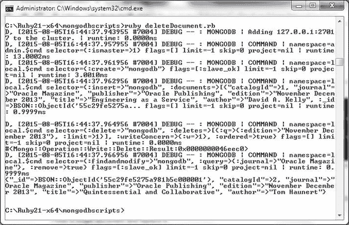
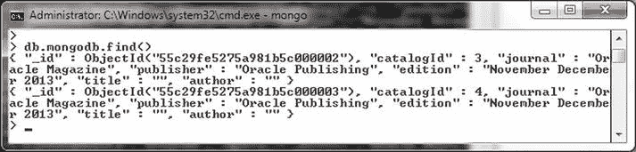
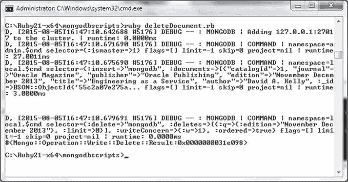
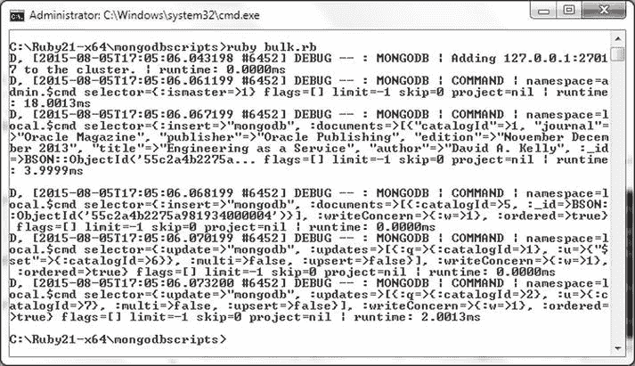
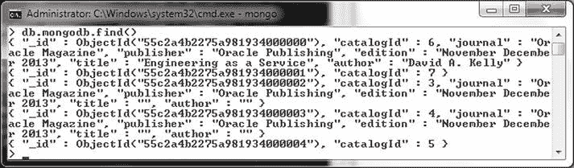

# 删除文档与批量操作

取消注释 `delete_one` 和 `find_one_and_delete_one`，并运行 `deleteDocument.rb` 脚本来删除四个文档中的两个，一个使用 `each` 配合 `delete_one`，另一个使用 `find_one_and_delete`。脚本的输出如 图 4-33 所示。

图 4-33：使用 `delete_one` 和 `find_one_and_delete` 删除文档

7. 在 Mongo shell 中运行 `db.mongodb.find()` 命令以列出剩余的两个文档，如 图 4-34 所示。

图 4-34：列出四个文档中的两个（已删除两个）

8. 在 Mongo shell 中使用 `db.mongodb.drop()` 命令删除 `mongodb` 集合，然后再次运行 `deleteDocument.rb` 脚本，这次仅使用 `delete_many` 的第三个示例。`deleteDocument.rb` 脚本的输出如 图 4-35 所示。

图 4-35：使用 `delete_many` 删除多个文档

在 Mongo shell 中运行 `db.mongodb.find()` 命令时，不会列出任何文档，如 图 4-36 所示。

图 4-36：列出空集合

### 执行批量操作

MongoDB Ruby 驱动通过 `Mongo::Collection` 类中的 `bulk_write(operations, options)` 方法支持批量操作。可以使用 `bulk_write()` 方法调用一系列操作。每个操作使用一个文档定义，其中一个键在 表 4-11 中讨论。
表 4-37：批量操作

| 批量操作键          | 描述               |
| ------------------- | ------------------ |
| `insert_one`        | 插入一个文档       |
| `delete_one`        | 删除一个文档       |
| `delete_many`       | 删除多个文档       |
| `replace_one`       | 替换一个文档       |
| `update_one`        | 更新一个文档       |
| `update_many`       | 更新多个文档       |

1. 在 `C:\Ruby21-x64\mongodbscripts` 目录下创建一个 Ruby 脚本 `bulk.rb`。
2. 如果 `mongodb` 集合已存在，则使用 `db.mongodb.drop()` 将其删除，并在脚本中创建该集合。
3. 使用 `insert_many()` 方法插入多个文档。
    ```
    collection.insert_many([document1,document2,document3,document4])
    ```
4. 为 `mongodb` 集合创建一个集合对象。
    ```
    collection = client[:mongodb]
    ```
5. 使用 `insert_one`、`update_one` 和 `replace_one` 批量操作调用 `bulk_write()` 方法。将第二个参数设置为 `:ordered => true` 以指示批量操作按指定顺序执行（这也是默认行为）。

    `bulk.rb` 脚本如下所示。
    ```
    require 'mongo'
    include Mongo

    client =Mongo::Client.new([ '127.0.0.1:27017' ], :database => 'test')
    client=client.use(:local)
    db=client.database
    collection=db.collection("mongodb")

    collection.create

    document1={
      "catalogId" => 1,
      "journal" => "Oracle Magazine",
      "publisher" => "Oracle Publishing",
      "edition" =>  "November December 2013",
      "title" => "Engineering as a Service",
      "author" =>  "David A. Kelly"
    }

    document2={
      "catalogId" => 2,
      "journal" => "Oracle Magazine",
      "publisher" => "Oracle Publishing",
      "edition" =>  "November December 2013",
      "title" => "Quintessential and Collaborative",
      "author" =>  "Tom Haunert"
    }

    document3={
      "catalogId" => 3,
      "journal" => "Oracle Magazine",
      "publisher" => "Oracle Publishing",
      "edition" =>  "November December 2013",
      "title" => "",
      "author" => ""
    }

    document4={
      "catalogId" => 4,
      "journal" => "Oracle Magazine",
      "publisher" => "Oracle Publishing",
      "edition" =>  "November December 2013",
      "title" => "",
      "author" => ""
    }

    collection.insert_many([document1,document2,document3,document4])

    print "\n"

    collection = client[:mongodb]

    collection.bulk_write([ { :insert_one => { :catalogId => 5 }
                    },
                    { :update_one => { :find => { :catalogId => 1 },
                                       :update => {'$set' => { :catalogId => 6 } }
                                     }
                    },
                    { :replace_one => { :find => { :catalogId => 2 },
                                        :replacement => { :catalogId => 7 }
                                      }
                    }
                  ],
                  :ordered => true )
    ```
6. 按如下方式运行 `bulk.rb` 脚本。
    ```
    >ruby bulk.rb
    ```
    `bulk.rb` 脚本的输出如 图 4-37 所示。
    
    图 4-37：运行 bulk.rb 脚本
7. 随后，使用 `db.mongodb.find()` 方法列出 `mongodb` 集合中的文档。如 图 4-38 所示，添加了一个 `catalogId` 为 5 的新文档。`catalogId` 1 已更新为 6，而 `catalogId` 为 2 的文档已被 `catalogId` 为 7 的文档替换。
    
    图 4-38：批量操作后列出文档

## 总结

在本章中，我们使用 Ruby 驱动连接到 MongoDB 服务器，并对数据库执行 CRUD（创建、读取、更新、删除）操作。我们演示了针对单个文档和多个文档的每种 CRUD 操作。在下一章中，我们将使用 Node.js 驱动连接到 MongoDB 并执行类似的 CRUD 操作。

