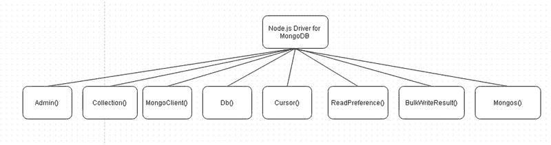

# Node.js 驱动程序

Node.js 驱动程序的主要类如图 5-1 所示。

图 5-1。 Node.js 驱动程序的主要类

Node.js 驱动程序类在表 5-1 中讨论。
表 5-1。 Node.js 驱动程序的主要类

| 类 | 描述 |
| --- | --- |
| `Admin` | 提供对 MongoDB 服务器管理功能的访问，例如检索服务器信息和状态、添加/删除用户以及进行身份验证。 |
| `Collection` | 表示 MongoDB 服务器中的一个集合。 |
| `MongoClient` | 表示到 MongoDB 服务器的一个连接。 |
| `Db` | 表示一个数据库实例。 |
| `Cursor` | 表示一个查询结果集上的游标。 |
| `ReadPreference` | 表示读取偏好。 |
| `BulkWriteResult` | 表示一个批量写入的结果。 |
| `Mongos` | 表示一个 Mongo 服务器数组。 |
| `Server` | 表示一个 MongoDB 服务器。 |

