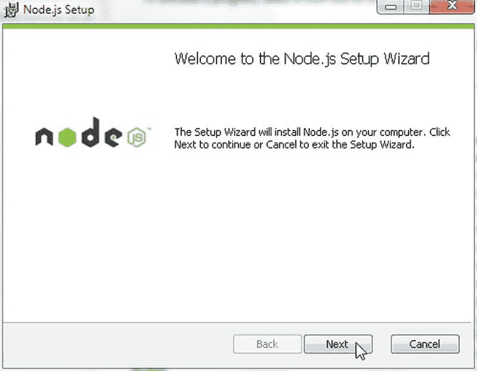
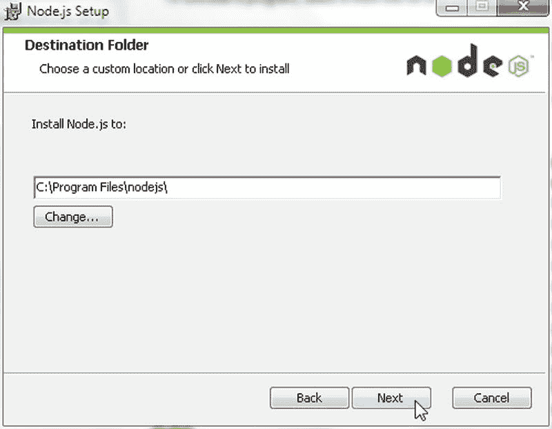
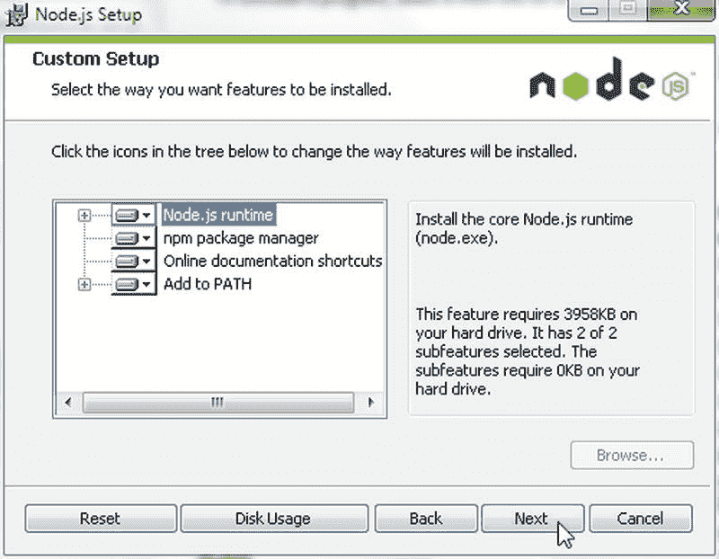
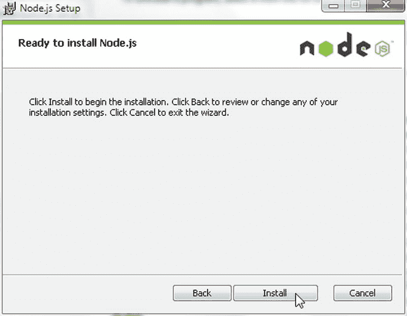
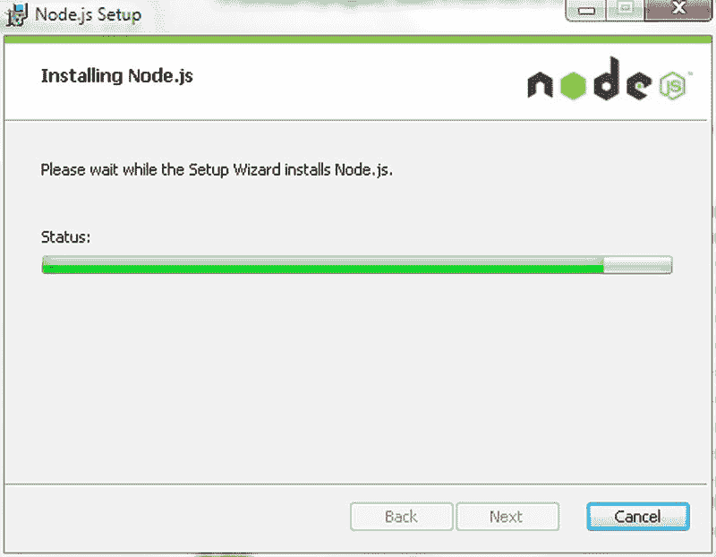
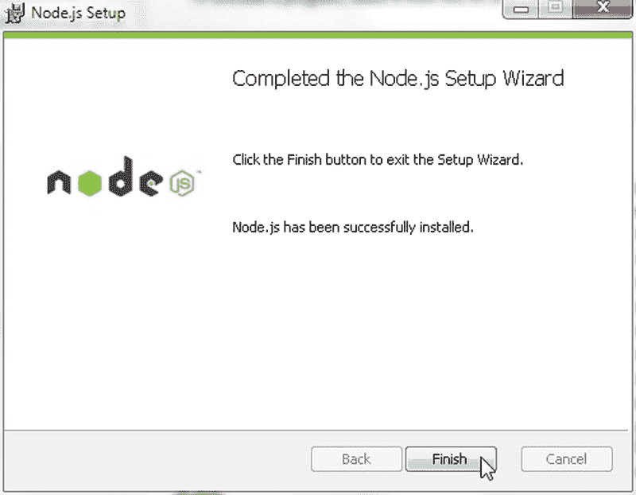
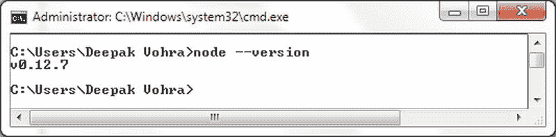
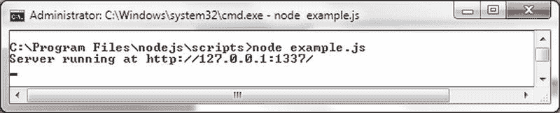
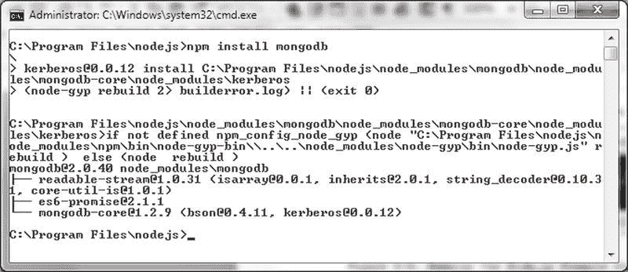

# 设置环境

我们需要为本章安装以下软件：
* MongoDB
* Node.js
* MongoDB 的 Node.js 驱动程序

### 安装 MongoDB 服务器

从 `www.mongodb.org/` 下载 MongoDB 3.0.5，并将 zip 文件解压到一个目录。将 MongoDB 安装目录中的 `bin` 目录（例如，`C:\Program Files\MongoDB\Server\3.0\bin`）添加到 `PATH` 环境变量中。如果尚未创建，请创建 `C:\data\db` 目录。使用以下命令启动 MongoDB 服务器。

```
>mongod
```

### 安装 Node.js

从 `blog.nodejs.org/release/` 下载适用于 Node.js 的 `node-v0.12.7-x64.msi` 应用程序，并完成以下步骤：

1. 双击 `msi` 应用程序以启动 Node.js 安装向导。
2. 在安装向导中单击“下一步”，如图 5-2 所示。
   
   图 5-2。 Node.js 安装向导
3. 接受最终用户许可协议并单击“下一步”。
4. 在“目标文件夹”中指定安装 Node.js 的目录，默认为 `C:\Program Files\nodejs`，如图 5-3 所示。单击“下一步”。
   
   图 5-3。 选择 Node.js 的安装目录
5. 在“自定义安装”中，列出了要安装的 Node.js 功能（包括核心 Node.js 运行时）供选择，如图 5-4 所示。选择默认设置并单击“下一步”。
   
   图 5-4。 选择要安装的功能
6. 在“准备安装 Node.js”窗口中，单击“安装”，如图 5-5 所示。
   
   图 5-5。 单击“安装”
   Node.js 的安装开始，如图 5-6 所示。等待安装完成。
   
   图 5-6。 正在安装 Node.js
7. 当 Node 安装完成时，单击“完成”，如图 5-7 所示。
   
   图 5-7。 Node.js 已安装
8. 要查找已安装的 Node.js 版本，请在命令 shell 中运行以下命令：
   ```
   node --version
   ```
   该命令的输出列出版本为 0.12.7，如图 5-8 所示。
   
   图 5-8。 查找 Node.js 版本
9. 要测试 Node.js 安装，请使用以下脚本创建一个服务器；将脚本存储在任意目录的 `example.js` 文件中，例如 `C:\Program Files\nodejs\scripts` 目录。
   ```
   var http = require('http');
   http.createServer(function (req, res) {
     res.writeHead(200, {'Content-Type': 'text/plain'});
     res.end('Hello World\n');
   }).listen(1337, '127.0.0.1');
   console.log('Server running at http://127.0.0.1:1337/');
   ```
10. 从包含脚本的目录中，使用以下命令运行脚本：
    ```
    node example.js
    ```
    脚本的输出显示在命令 shell 中，如图 5-9 所示。
    
    图 5-9。 运行 Node.js 示例脚本

## 安装用于 MongoDB 的 Node.js 驱动程序

打开一个新的终端/控制台，进入 `C:\Program Files\nodejs`。然后运行以下命令来安装用于 MongoDB 的 Node.js 驱动程序。

```
npm install mongodb
```

用于 MongoDB 的 Node.js 驱动程序将被安装，如图 5-10 所示。

图 5-10。 安装用于 MongoDB 的 Node.js 驱动程序

## 使用连接

在以下小节中，我们将创建一个到 MongoDB 服务器的连接并创建一个数据库实例。

## 创建 MongoDB 连接

在本节中，我们将使用用于 MongoDB 的 Node.js 驱动程序连接到 MongoDB 服务器。我们将使用 `MongoClient` 类连接到 MongoDB 服务器。`MongoClient` 构造函数不接受任何参数，其语法如下。

```
MongoClient()
```

`MongoClient` 类支持表 5-2 中讨论的方法（静态和实例）。

表 5-2。 MongoClient 类方法

| 方法 | 描述 |
| --- | --- |
| `MongoClient.connect(url, options, callback)` | 使用字符串 URI 连接到 MongoDB 服务器的静态方法。连接 URI 通常包含数据库名称，格式为 `mongodb://[username:password@]host1[:port1][,host2[:port2],...][,hostN[:portN]]/[database][?options]]`。连接 URI 的组件在表 5-3 中讨论。连接方法的 `options` 参数在表 5-6 中讨论。回调类型为 `connectCallback(error, db)` |
| `connect(url, options, callback)` | 连接到 MongoDB 服务器的实例方法。方法参数与静态方法相同。 |

连接 URI 的组件在表 5-3 中讨论。

表 5-3。 连接 URI 的组件

| 组件 | 描述 |
| --- | --- |
| `mongodb://` | 连接字符串中必需的前缀。 |
| `username:password@` | 特定数据库的登录凭据。可选。 |
| `host1` | 要连接到的 MongoDB 服务器地址，指定为主机名、IP 地址或 UNIX 域套接字。唯一必需的组件。 |
| `:port1` | 要连接到的端口。默认为 `:27017`。 |
| `host2[:port2],...[,hostN[:portN]]` | 多个主机：端口配置，例如用于副本集。 |
| `/database` | 如果指定了 `username:password@`，则为要进行身份验证连接的数据库。如果指定了 `username:password@` 但未指定 `/database`，则对管理员数据库进行身份验证连接。 |
| `?options` | 连接字符串选项。如果未指定 `/database`，则必须在最后一个 `hostN` 后添加 `/` 和 `?`。部分连接字符串选项在表 5-4 中讨论。连接字符串选项指定为用 `&` 或逗号分隔的名称/值对，值区分大小写。 |


