# Mongo Shell 文档查询操作

### 查找单个文档

`Collection` 类提供了 `findOne(query, options, callback)` 方法，用于从集合中查找单个文档。该方法的参数在 Table 5-15 中讨论。

**表 5-15. `findOne()` 方法参数**

| 参数 | 类型 | 描述 |
| --- | --- | --- |
| `query` | object | 用于查找单个文档的选择器查询。 |
| `options` | object | 方法选项。 |
| `callback` | `resultCallback(error, result)` | 回调函数。回调函数的第一个参数是如果产生错误时的 `MongoError` 对象，第二个参数是 `result`。 |

`findOne()` 方法支持的一些选项在 Table 5-16 中讨论。

**表 5-16. `findOne()` 方法的部分选项**

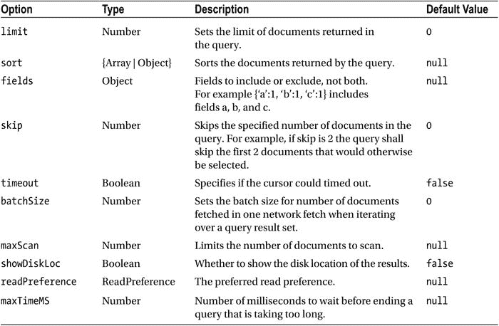

### 操作步骤

1.  创建一个脚本 `findOneDocument.js`，并像之前一样导入所需的类。
2.  创建一个 `Db` 实例并打开数据库实例。
3.  创建一个集合并向集合中添加一个文档数组。在 `createCollection()` 方法的回调函数方法块内，调用 `findOne()` 方法。在选择器查询中，指定 `journal` 字段设置为 `'Oracle Magazine'`。在 `options` 参数中，指定要返回的字段为 `edition`、`title` 和 `author`，并将 `skip` 选项设置为 `1`。在回调函数中，第二个参数是由 `findOne()` 方法返回的文档游标。将单个文档输出到控制台。

    ```javascript
    collection.findOne({journal:'Oracle Magazine'}, {fields:{edition:1,title:1,author:1}, skip:1},
    function(error, result) {
     if (error) console.log(error.message);
      else
       console.log(result);
          });
    ```

    `findOneDocument.js` 脚本如下：

    ```javascript
    Server = require('mongodb').Server;
    Db = require('mongodb').Db;
    Collection = require('mongodb').Collection;
    var db = new Db('local', new Server('localhost', 27017));
    db.open(function(error, db) {
     if (error)
            console.log(error);
    else{
    db.createCollection('catalog', function(error, collection){
    if (error)
            console.log(error);
    else{
     doc1 = {"catalogId" : 'catalog1', "journal" : 'Oracle Magazine', "publisher" : 'Oracle Publishing', "edition" : 'November December 2013',"title" : 'Engineering as a Service',"author" : 'David A. Kelly'};
     doc2 = {"catalogId" : 'catalog2', "journal" : 'Oracle Magazine', "publisher" : 'Oracle Publishing', "edition" : 'November December 2013',"title" : 'Quintessential and Collaborative',"author" : 'Tom Haunert'};
     collection.insertMany([doc1,doc2], function(error, result){
     if (error)
            console.log(error);
     else{
     console.log("Documents added: "+result);
     }
     });
    collection.findOne({journal:'Oracle Magazine'}, {fields:{edition:1,title:1,author:1}, skip:1},
    function(error, result) {
     if (error) console.log(error.message);
      else
       console.log(result);
          });
    }
    });
    }});
    ```

4.  在命令行中运行脚本 `node findOneDocument.js`。单个文档被输出到控制台，如 Figure 5-23 所示。由于设置了 `fields` 选项，因此只输出了指定的字段。

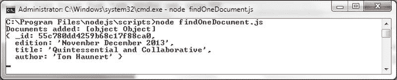

**图 5-23. 查找单个文档**

### 查找所有文档

在本节中，我们将从集合中查找所有文档。

### 操作步骤

1.  从 `local` 数据库中删除 `catalog` 集合，因为我们将在本节中使用相同的集合。

    ```javascript
    >use local
    >db.catalog.drop()
    ```

    虽然 `findOne` 文档返回单个文档，但 `find(query)` 方法可用于根据选择器查询返回一个或多个文档。`find()` 方法只有一个参数 `query`，并返回一个 `Cursor`。

2.  在 `C:\Program Files\nodejs\scripts` 目录中创建一个脚本 `findAllDocuments.js` 来查找一个、多个或所有文档。导入所需的类 `Db`、`Collection` 和 `Server`。

3.  创建并打开一个数据库实例，并使用 `createCollection()` 方法创建一个名为 `catalog` 的集合。在 `createCollection()` 方法块内，使用 `insertMany()` 方法向集合中添加两个文档。调用 `find()` 方法查找所有文档。如果未指定查询，则默认选择所有文档。`find()` 方法返回结果集上的 `Cursor`。在返回的 `Cursor` 对象上调用 `toArray(callback)` 方法以返回一个文档数组。`toArray()` 方法的回调函数的第二个参数是 BSON 反序列化对象的数组。

    ```javascript
    collection.find().toArray(function(error, result) {
     if (error) console.warn(error.message);
      else
       console.log(result);
          });
    ```

    `findAllDocuments.js` 脚本如下：

    ```javascript
    Server = require('mongodb').Server;
    Db = require('mongodb').Db;
    Collection = require('mongodb').Collection;
    var db = new Db('local', new Server('localhost', 27017));
    db.open(function(error, db) {
     if (error)
            console.log(error);
    else{
    db.createCollection('catalog', function(error, collection){
    if (error)
            console.log(error);
    else{
     doc1 = {"catalogId" : 'catalog1', "journal" : 'Oracle Magazine', "publisher" : 'Oracle Publishing', "edition" : 'November December 2013',"title" : 'Engineering as a Service',"author" : 'David A. Kelly'};
     doc2 = {"catalogId" : 'catalog2', "journal" : 'Oracle Magazine', "publisher" : 'Oracle Publishing', "edition" : 'November December 2013',"title" : 'Quintessential and Collaborative',"author" : 'Tom Haunert'};
     collection.insertMany([doc1,doc2], function(error, result){
     if (error)
            console.log(error);
     else{
     console.log("Documents added: "+result);
     }
     });
    collection.find().toArray(function(error, result) {
     if (error) console.warn(error.message);
      else
       console.log(result);
          });
    }
    });
    }});
    ```

4.  运行脚本 `node findAllDocuments.js` 以查找并列出所有文档，如 Figure 5-24 所示。

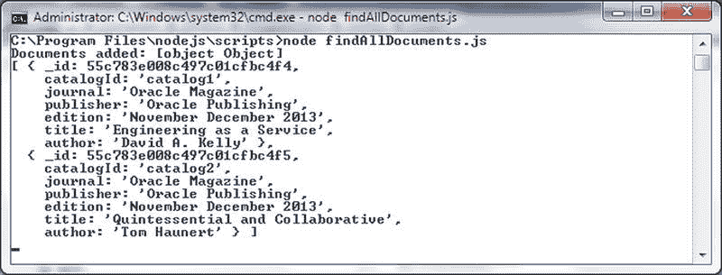

**图 5-24. 查找所有文档**

### 查找文档子集

在本节中，我们将使用之前讨论过的 `find()` 方法来查找文档的子集。我们将使用 `skip`、`limit` 和 `fields` 选项来跳过一些文档，限制文档数量，并返回字段的子集。

### 操作步骤

1.  创建一个脚本 `findSubsetDocuments.js`。导入所需的类 `Collection`、`Server` 和 `Db`。
2.  创建并打开一个 `Db` 实例，并像前面的章节一样创建一个名为 `catalog` 的集合。在 `createCollection()` 方法的回调函数块内，创建一个文档数组，并使用 `insertMany()` 方法将文档添加到集合中。

    ```javascript
    doc1 = {"catalogId" : 'catalog1', "journal" : 'Oracle Magazine', "publisher" : 'Oracle Publishing', "edition" : 'November December 2013',"title" : 'Engineering as a Service',"author" : 'David A. Kelly'};
    ```


进入`/path/to/xxx`目录，找到`xxx.json`。

在表达式`cvar = avar + bvar`中，加法运算符（`+`）将`avar`与`bvar`相加，得到它们的和`cvar`。

在`List.of(arg0, arg1, arg2)`中，`List`接口的工厂方法`of()`接受一系列的元素，返回包含它们的只读列表。

之后我们这样调用`cmd`命令：`cmd arg0 arg1 arg2`。

```
if (condVar > someVal) {console.log("xxx")}
```

doc2 = {"catalogId": 'catalog2', "journal": 'Oracle Magazine', "publisher": 'Oracle Publishing', "edition": 'November December 2013', "title": 'Quintessential and Collaborative', "author": 'Tom Haunert'};
doc3 = {"catalogId": 'catalog3', "journal": 'Oracle Magazine', "publisher": 'Oracle Publishing', "edition": 'November December 2013'};
doc4 = {"catalogId": 'catalog4', "journal": 'Oracle Magazine', "publisher": 'Oracle Publishing', "edition": 'November December 2013'};
docArray = [doc1, doc2, doc3, doc4];
collection.insertMany(docArray, function (error, result) {
    if (error)
        console.log(error);
    else {
        //查找文档子集
    }
});
```

3. 在 `createCollection()` 方法的回调函数块内，调用 `find()` 方法。选择器查询参数是一个空文档。指定 `skip` 选项为 `1`，`limit` 选项为 `2`，并指定 `fields` 选项以包含 `edition`、`title` 和 `author`。使用 `toArray()` 方法将查询发送到服务器。`toArray()` 方法回调函数的第二个参数是 `find()` 方法查询返回的文档。将文档输出到控制台。

```
collection.find({}, {
    skip: 1,
    limit: 2,
    fields: {
        edition: 1,
        title: 1,
        author: 1
    }
}).toArray(function (error, result) {
    if (error) console.log(error);
    else
        console.log(result);
});
```

`findSubsetDocuments.js` 列出如下：

```
Server = require('mongodb').Server;
Db = require('mongodb').Db;
Collection = require('mongodb').Collection;
var db = new Db('local', new Server('localhost', 27017));
db.open(function (error, db) {
    if (error)
        console.log(error);
    else {
        db.createCollection('catalog', function (error, collection) {
            if (error)
                console.log(error);
            else {
                doc1 = {"catalogId": 'catalog1', "journal": 'Oracle Magazine', "publisher": 'Oracle Publishing', "edition": 'November December 2013', "title": 'Engineering as a Service', "author": 'David A. Kelly'};
                doc2 = {"catalogId": 'catalog2', "journal": 'Oracle Magazine', "publisher": 'Oracle Publishing', "edition": 'November December 2013', "title": 'Quintessential and Collaborative', "author": 'Tom Haunert'};
                doc3 = {"catalogId": 'catalog3', "journal": 'Oracle Magazine', "publisher": 'Oracle Publishing', "edition": 'November December 2013'};
                doc4 = {"catalogId": 'catalog4', "journal": 'Oracle Magazine', "publisher": 'Oracle Publishing', "edition": 'November December 2013'};
                docArray = [doc1, doc2, doc3, doc4];
                collection.insertMany(docArray, function (error, result) {
                    if (error)
                        console.log(error);
                    else {
                        console.log("Documents added: " + result);
                    }
                });
                collection.find({}, {
                    skip: 1,
                    limit: 2,
                    fields: {
                        edition: 1,
                        title: 1,
                        author: 1
                    }
                }).toArray(function (error, result) {
                    if (error) console.log(error);
                    else
                        console.log(result);
                });
            }
        });
    }
});
```

4. 从 `local` 数据库中删除 `catalog` 集合。

```
>use local
>db.catalog.drop()
```

使用以下命令运行脚本：
```
>node findSubsetDocuments.js
```

两个不同的文档被返回并输出到控制台。只有文档中存在的 `edition`、`title` 和 `author` 字段被返回。返回的其中一个文档没有 `title` 和 `author` 字段，只返回了 `edition` 字段，如 图 5-25 所示。

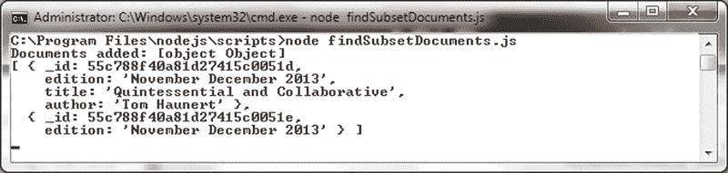
**图 5-25. 查找文档子集**

### 使用游标
`find()` 方法并不直接返回文档，而是返回结果集上的一个 `Cursor`。

`Cursor` 类提供了几种方法来获取有关文档的更多信息，例如迭代文档、计算文档数量以及查找结果集中的下一个文档。一些 `Cursor` 类方法列在 表 5-17 中。

**表 5-17. 部分游标类方法**

| 方法 | 描述 |
| :--- | :--- |
| `rewind()` | 倒回游标并返回游标。可以再次迭代游标以获取文档。 |
| `toArray(callback)` | 返回一个文档数组。如果游标之前已被访问过，结果仅包含部分文档，即尚未迭代过的文档。对于先前访问过的游标，必须调用 `rewind()` 方法才能获取所有文档。 |
| `each(callback)` | 迭代文档。如果游标之前已被访问过，则不会迭代所有文档，只会迭代尚未迭代过的文档。对于先前访问过的游标，必须调用 `rewind()` 方法才能迭代所有文档。 |
| `count(applySkipLimit, options, callback)` | 返回游标中的文档数量。布尔值 `applySkipLimit` 可设置为 `true` 以应用游标上设置的 `skip` 和 `limit`。 |
| `sort(keyOrList, direction)` | 对文档进行排序并返回排序结果集上的游标。 |
| `limit(value)` | 限制结果集中的文档数量，并返回限制结果集上的新游标。 |
| `skip(value)` | 跳过结果集中指定数量的文档，并返回结果集上的新游标。 |
| `batchSize(value)` | 设置批处理大小并返回新游标。 |
| `nextObject(callback)` | 从游标获取下一个文档。 |
| `close(callback)` | 关闭游标。 |

1.  在 `C:\Program Files\nodejs\scripts` 目录中创建一个脚本 `findWithCursor.js`。
2.  从 `local` 数据库中删除 `catalog` 集合。

```
>use local
>db.catalog.drop()
```

3.  导入 `Collection`、`Db` 和 `Server` 类。
4.  为 `local` 数据库创建并打开一个 `Db` 实例，随后创建一个 `catalog` 集合。
5.  在 `createCollection()` 方法块的回调函数块内，使用 `insertMany()` 方法添加一些文档。

```
doc1 = {"catalogId": 'catalog1', "journal": 'Oracle Magazine', "publisher": 'Oracle Publishing', "edition": 'November December 2013', "title": 'Engineering as a Service', "author": 'David A. Kelly'};
doc2 = {"catalogId": 'catalog2', "journal": 'Oracle Magazine', "publisher": 'Oracle Publishing', "edition": 'November December 2013', "title": 'Quintessential and Collaborative', "author": 'Tom Haunert'};
docArray = [doc1, doc2];
collection.insertMany(docArray, function (error, result) {
    if (error)
        console.log(error);
    else {
        console.log("Documents added: " + result);
    }
});
```

6.  调用 `find()` 方法以获取 `Cursor` 对象。

```
var cursor = collection.find();
```

7.  在 `Cursor` 对象上调用 `each(callback)` 方法以迭代文档。回调函数中的第二个参数是正在迭代的文档。将文档输出到控制台。

```
var cursor = collection.find();
cursor.each(function (error, result) {
    if (error) console.log(error);
    else
        console.log(result);
});
```

8.  在 `Cursor` 上调用 `each()` 方法后，该 `Cursor` 无法再用于迭代结果集。为了演示这一点，在调用 `each()` 方法之后，调用 `forEach()` 方法来迭代结果集。

```
cursor.forEach(function (doc) {
    console.log(doc);
});
```


`cursor.forEach(function(doc) {`
`console.log(doc);`
`}, function(error) {`
`console.log(error);`
`});`
```

9.  接下来，我们将在`Cursor`上调用另一个方法来计算文档数量。调用`count()`方法，在回调函数中，第二个参数是文档的数量。输出文档的数量。

```
cursor.count(function(error, count) {
if (error) console.log(error);
else
console.log("文档数量 "+count);
});
```

以下是`findWithCursor.js`脚本的完整内容：

```
Server = require('mongodb').Server;
Db = require('mongodb').Db;
Collection = require('mongodb').Collection;
var db = new Db('local', new Server('localhost', 27017));
db.open(function(error, db) {
if (error)
console.log(error);
else{
db.createCollection('catalog', function(error, collection){
if (error)
console.log(error);
else{
doc1 = {"catalogId" : 'catalog1', "journal" : 'Oracle Magazine', "publisher" : 'Oracle Publishing', "edition" : 'November December 2013',"title" : 'Engineering as a Service',"author" : 'David A. Kelly'};
doc2 = {"catalogId" : 'catalog2', "journal" : 'Oracle Magazine', "publisher" : 'Oracle Publishing', "edition" : 'November December 2013',"title" : 'Quintessential and Collaborative',"author" : 'Tom Haunert'};
docArray=[doc1,doc2];
collection.insertMany(docArray, function(error, result){
if (error)
console.log(error);
else{
console.log("添加的文档: "+result);
}
});
var cursor = collection.find();
cursor.each(function(error, result) {
if (error) console.log(error);
else
console.log(result);
});
cursor.forEach(function(doc) {
console.log(doc);
}, function(error) {
console.log(error);
});
cursor.count(function(error, count) {
if (error) console.log(error);
else
console.log("文档数量 "+count);
});
}
}});
});
```

10. 使用命令`node findWithCursor.js`运行`findWithCursor.js`脚本。输出如图 5-26 所示。
    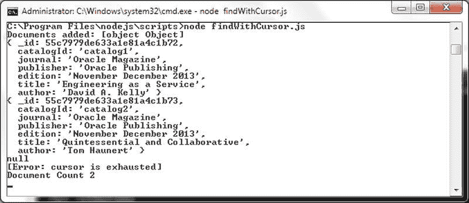
    图 5-26. findWithCursor.js 脚本的输出

    当运行`findWithCursor.js`脚本时，调用`find()`方法，随后调用`each()`方法，会返回集合中的两个文档。`each()`方法遍历`Cursor`以输出结果集中的文档。当调用`forEach()`方法时，游标已经被耗尽，因此会输出一个错误。`count()`方法的调用则输出了文档数量。

    **查找并修改单个文档**

    在本节中，我们将使用`Collection`类中的`findAndModify(query, sort, doc, options, callback)`方法来查找并修改一个文档。本章将讨论已弃用的方法`findAndModify()`及其替代方法`findOneAndUpdate()`、`findOneAndReplace()`或`findOneAndDelete()`。`findAndModify()`方法返回修改前的原始文档。方法参数在表 5-18 中讨论。

    表 5-18. findAndModify()方法的参数

    | 参数 | 类型 | 描述 |
    | --- | --- | --- |
    | `query` | object | 用于查找要修改的文档的查询。 |
    | `sort` | array | 如果多个文档匹配查询，则按指定顺序选择第一个。 |
    | `doc` | object | 包含要更新的字段和值的文档。 |
    | `options` | object | 方法选项。 |
    | `callback` | `resultCallback(error, result)` | 回调函数。第一个参数是发生错误时的`MongoError`对象或 null，第二个参数是查找和修改操作的结果。 |

    除了`w`、`wtimeout`和`j`选项外，表 5-19 中列出的选项也被支持。

    表 5-19. findAndModify()方法的选项
    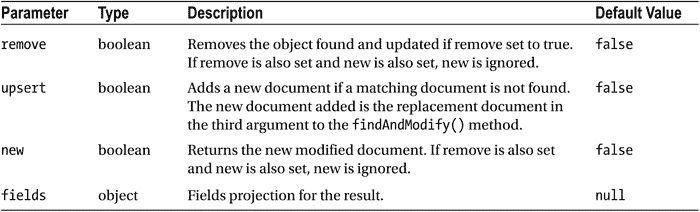

    1.  在`C:\Program Files\nodejs\scripts`目录下创建一个脚本`findAndModify.js`。
    2.  使用`db.catalog.drop()`删除`local`数据库中的`catalog`集合。
    3.  像前面的章节一样，向集合中添加一些文档。为`catalogId`和`edition`字段使用数值，以演示排序。

    ```
    doc1 = {"catalogId" : 1, "journal" : 'Oracle Magazine',
    "publisher" : 'Oracle Publishing', "edition" : '11122013',"title" : 'Engineering as a Service',"author" : 'David A. Kelly'};
    doc2 = {"catalogId" : 2, "journal" : 'Oracle Magazine',
    "publisher" : 'Oracle Publishing', "edition" : '11122013',"title" : 'Quintessential and Collaborative',"author" : 'Tom Haunert'};
    collection.insertMany([doc1,doc2], function(error, result){
    if (error)
    console.log(error);
    else{
    console.log("添加的文档: "+result);
    }
    });
    ```

    4.  在`createCollection()`方法的回调函数内，调用`findAndModify()`方法。`query`参数是文档`{journal:'Oracle Magazine'}`。`sort`参数是数组`[['catalogId', 'ascending'], ['edition', 'descending']]`，它按`catalogId`升序和`edition`降序排序。在更新文档中，使用`{edition:'11-12-2013', journal:'OracleMagazine'}`作为参数来设置`edition`和`journal`字段的新值。在`options`参数中，将`new`选项设置为`true`，即`{new:true, w:1}`。在回调函数中，将更新后的文档记录到控制台。

    ```
    collection.findAndModify({journal:'Oracle Magazine'},
    [['catalogId', 'ascending'], ['edition', 'descending']],
    {edition:'11-12-2013', journal:'OracleMagazine'}, {new:true,
    w:1}, function(error, result) {
    if (error) console.log(error);
    else
    console.log(result);
    });
    ```

    以下是`findAndModify.js`脚本的完整内容：

    ```
    Server = require('mongodb').Server;
    Db = require('mongodb').Db;
    Collection = require('mongodb').Collection;
    var db = new Db('local', new Server('localhost', 27017));
    db.open(function(error, db) {
    if (error)
    console.log(error);
    else{
    db.createCollection('catalog', function(error, collection){
    if (error)
    console.log(error);
    else{
    doc1 = {"catalogId" : 1, "journal" : 'Oracle Magazine',
    "publisher" : 'Oracle Publishing', "edition" : '11122013',"title" : 'Engineering as a Service',"author" : 'David A. Kelly'};
    doc2 = {"catalogId" : 2, "journal" : 'Oracle Magazine',
    "publisher" : 'Oracle Publishing', "edition" : '11122013',"title" : 'Quintessential and Collaborative',"author" : 'Tom Haunert'};
    collection.insertMany([doc1,doc2], function(error, result){
    if (error)
    console.log(error);
    else{
    console.log("添加的文档: "+result);
    }
    });
    collection.findAndModify({journal:'Oracle Magazine'},
    [['catalogId', 'ascending'], ['edition', 'descending']],
    {edition:'11-12-2013', journal:'OracleMagazine'}, {new:true,
    w:1}, function(error, result) {
    if (error) console.log(error);
    else
    console.log(result);
    });
    }
    }});
    });
    ```

    5.  使用命令`node findAndModify.js`运行脚本以查找并修改文档，并返回修改后的文档，如图 5-27 所示。
    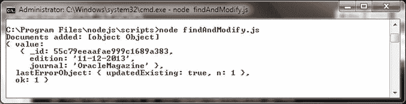


jpeg) 图 5-27. `findAndModify.js` 脚本的输出

6.  在 Mongo shell 中运行 `db.catalog.find()` 方法以列出更新后的文档。只有一个文档被更新，如 图 5-28 所示。因为 `catalogId` 字段的 `sort` 顺序设置为升序，所以找到的第一个文档 `catalogId:1` 就是被修改的文档。

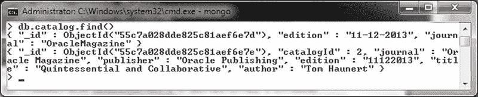 图 5-28. 列出更新后的文档

### 查找并移除单个文档

`Collection` 类中的 `findAndRemove(query, sort, options, callback)` 方法用于查找并移除一个文档。本章我们讨论了已弃用的方法 `findAndRemove()` 及其替代方法 `findOneAndDelete()`。方法参数如 表 5-20 所示。

表 5-20. `findAndRemove()` 方法的参数

| 参数 | 类型 | 描述 |
| --- | --- | --- |
| `query` | object | 选择器查询，用于找到要移除的文档。 |
| `sort` | array | 如果多个文档匹配查询，则按指定顺序选择第一个进行移除。 |
| `options` | object | 方法选项。支持的选项是 `w`、`wtimeout` 和 `j`。 |
| `callback` | `resultCallback(error, result)` | 回调函数。第一个参数是 Error 对象，第二个参数是方法结果，即被移除的文档。 |

1.  在 `C:\Program Files\nodejs\scripts` 目录中创建脚本 `findAndRemove.js`。
2.  用 `db.catalog.drop()` 从 `local` 数据库中删除 `catalog` 集合。
3.  按照前面的讨论，向集合中添加两个文档。`catalogId` 字段应具有数值，因为我们将按 `catalogId` 字段排序。

```
doc1 = {"catalogId" : 1, "journal" : 'Oracle Magazine', "publisher" : 'Oracle Publishing', "edition" : 11122013,"title" : 'Engineering as a Service',"author" : 'David A. Kelly'};
doc2 = {"catalogId" : 2, "journal" : 'Oracle Magazine', "publisher" : 'Oracle Publishing', "edition" : 11122013,"title" : 'Quintessential and Collaborative',"author" : 'Tom Haunert'};
docArray=[doc1,doc2];
collection.insertMany(docArray, function(error, result){
    if (error)
        console.log(error);
    else{
        console.log("Documents added: "+result);
    }
});
```

4.  调用 `findAndRemove()` 方法，使用 `{journal:'Oracle Magazine'}` 作为查询文档，`[['catalogId', 'ascending']]` 作为排序数组。在回调函数中，第二个参数是要被移除的文档。将被移除的文档记录到控制台。

```
collection.findAndRemove({journal:'Oracle Magazine'},
    [['catalogId', 'ascending']], {w:1}, function(error, result) {
        if (error) console.log(error);
        else console.log(result);
    });
```

`findAndRemove.js` 脚本如下：

```
Server = require('mongodb').Server;
Db = require('mongodb').Db;
Collection = require('mongodb').Collection;
var db = new Db('local', new Server('localhost', 27017));
db.open(function(error, db) {
    if (error)
        console.log(error);
    else{
        db.createCollection('catalog', function(error, collection){
            if (error)
                console.log(error);
            else{
                doc1 = {"catalogId" : 1, "journal" : 'Oracle Magazine',
                    "publisher" : 'Oracle Publishing', "edition" : 11122013,"title"
                    : 'Engineering as a Service',"author" : 'David A. Kelly'};
                doc2 = {"catalogId" : 2, "journal" : 'Oracle Magazine',
                    "publisher" : 'Oracle Publishing', "edition" : 11122013,"title"
                    : 'Quintessential and Collaborative',"author" : 'Tom Haunert'};
                collection.insertMany([doc1,doc2], function(error, result){
                    if (error)
                        console.log(error);
                    else{
                        console.log("Documents added: "+result);
                    }
                });
                collection.findAndRemove({journal:'Oracle Magazine'},
                    [['catalogId', 'ascending']], {w:1}, function(error, result) {
                        if (error) console.log(error);
                        else console.log(result);
                    });
            }
        });
    }
});
```

5.  使用命令 `node findAndRemove.js` 运行 `findAndRemove.js` 脚本。被移除的文档被记录到控制台，如 图 5-29 所示。

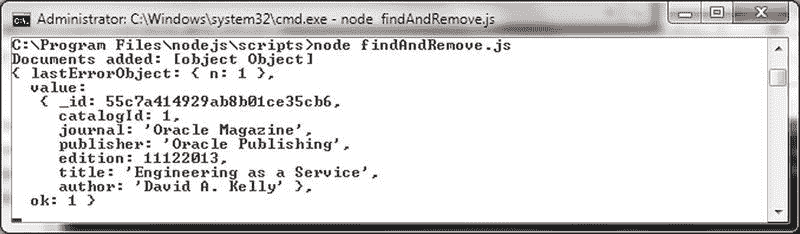 图 5-29. `findAndRemove.js` 脚本的输出

### 替换单个文档

`Collection` 类提供了 `findOneAndReplace(filter, replacement, options, callback)` 方法来替换单个文档。方法参数在 表 5-21 中讨论。

表 5-21. `findOneAndReplace()` 方法的参数

| 参数 | 类型 | 描述 |
| --- | --- | --- |
| `filter` | object | 指定文档选择过滤器以选择要更新的文档。 |
| `replacement` | object | 替换文档。 |
| `options` | object | 方法选项。 |
| `callback` | `resultCallback(error, result)` | 回调函数，其第一个参数是 `MongoError` 对象，第二个参数是方法结果。如果使用写关注，则必须指定回调函数。 |

`findOneAndReplace()` 方法支持的选项在 表 5-22 中讨论。

表 5-22. `findOneAndReplace()` 方法的选项

| 选项 | 类型 | 描述 |
| --- | --- | --- |
| `projection` | object | 结果的字段投影。 |
| `sort` | object | 如果查询选择多个文档，根据排序顺序确定哪个文档被替换。 |
| `maxTimeMS` | number | 查询可以运行的最长时间（毫秒）。 |
| `upsert` | boolean | 如果文档不存在，是否进行 upsert。默认为 `false`。 |
| `returnOriginal` | boolean | 是否返回原始文档而非替换文档。默认为 `true`。 |

1.  使用 `db.catalog.drop()` 从 `local` 数据库中删除 `catalog` 集合。
2.  在 `C:\Program Files\nodejs\scripts` 目录中创建一个 `findOneAndReplaceDocument.js` 脚本。
3.  获取并打开一个 `Db` 实例，创建一个集合，并向集合中添加文档。
4.  使用 `findOneAndReplace(filter, replacement, options, callback)` 方法，将其中一个 `journal` 字段为 `Oracle Magazine` 的文档替换。提供一个 `catalogId` 为 `catalog3` 的替换文档。

```
collection.findOneAndReplace({journal:'Oracle Magazine'}, {"catalogId" : 'catalog3', "journal" : 'OracleMagazine', "publisher" :
    'OraclePublishing', "edition" : '11122013'}, function(error, result) {
    if (error) console.warn(error.message);
    else console.log(result);
});
```

`findOneAndReplaceDocument.js` 脚本如下：

```
Server = require('mongodb').Server;
Db = require('mongodb').Db;
Collection = require('mongodb').Collection;
var db = new Db('local', new Server('localhost', 27017));
db.open(function(error, db) {
    if (error)
        console.log(error);
    else{
        db.createCollection('catalog', function(error, collection){
            if (error)
                console.log(error);
            else{
                doc1 = {"catalogId" : 'catalog1', "journal" : 'Oracle Magazine', "publisher" : 'Oracle Publishing', "edition" : 'November December 2013',"title" : 'Engineering as a Service',"author" : 'David A. Kelly'};
```


### 更新单个文档

在本节中，我们将介绍如何使用 `findOneAndReplace`、`replaceOne` 和 `findOneAndUpdate` 方法来更新 MongoDB 集合中的文档。

## 使用 findOneAndReplace

`findOneAndReplace(filter, replacement, options, callback)` 方法用于查找一个文档并将其替换为一个新文档。

### 参数说明

| 参数 | 类型 | 描述 |
| --- | --- | --- |
| `filter` | object | 指定用于选择要替换文档的选择器查询。 |
| `replacement` | object | 用于替换的新文档。 |
| `options` | object | 方法选项。 |
| `callback` | `resultCallback(error, result)` | 回调函数，第一个参数是 `MongoError` 对象，第二个参数是方法结果。如果使用写关注，则必须指定回调函数。 |

### 示例脚本

创建一个名为 `findOneAndReplaceDocument.js` 的脚本。该脚本会连接到数据库，创建一个集合并插入两个文档，然后使用 `findOneAndReplace` 方法替换其中一个文档。

```javascript
var db = new Db('local', new Server('localhost', 27017));
db.open(function(error, db) {
  if (error)
    console.log(error);
  else {
    db.createCollection('catalog', function(error, collection) {
      if (error)
        console.log(error);
      else {
        var doc1 = {"catalogId": 1, "journal": 'Oracle Magazine', "publisher": 'Oracle Publishing', "edition": 'November December 2013', "title": 'Oracle and Linux', "author": 'Tom Haunert'};
        var doc2 = {"catalogId": 2, "journal": 'Oracle Magazine', "publisher": 'Oracle Publishing', "edition": 'November December 2013', "title": 'Quintessential and Collaborative', "author": 'Tom Haunert'};
        collection.insertMany([doc1, doc2], function(error, result) {
          if (error)
            console.log(error);
          else {
            console.log("Documents added: " + result);
          }
        });
        collection.findOneAndReplace({journal: 'Oracle Magazine'}, {"catalogId": 3, "journal": 'OracleMagazine', "publisher": 'OraclePublishing', "edition": '11122013'}, function(error, result) {
          if (error) console.warn(error.message);
          else
            console.log(result);
        });
      }
    });
  }
});
```

### 运行与验证

1.  使用 `node findOneAndReplaceDocument.js` 命令运行脚本。被替换的原始文档将被返回并输出，如图 5-30 所示。
    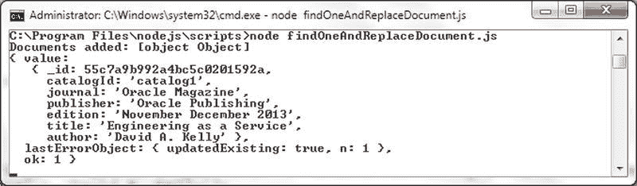
    *图 5-30. findOneAndReplaceDocument.js 脚本的输出*
2.  在 Mongo shell 中运行 `db.catalog.find()` 查询以列出文档，包括替换后的文档，如图 5-31 所示。
    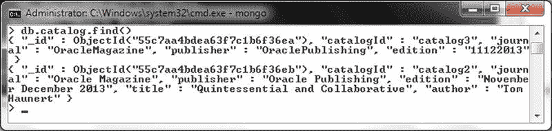
    *图 5-31. 列出替换后的文档*

## 使用 replaceOne

另一种可以用来替换文档的方法是 `replaceOne(filter, doc, options, callback)` 方法。它与 `findOneAndReplace(filter, replacement, options, callback)` 方法类似，但 `replaceOne` 方法提供的选项更少（`w`、`wtimeout`、`j`、`upsert` 和 `upsert`）。

### 更新单个文档

在本节中，我们将更新一个文档。`findOneAndUpdate(filter, update, options, callback)` 方法用于基于选择器查询来更新一个或多个文档。

### 参数说明

`findOneAndUpdate()` 方法的参数如下表所示。

| 参数 | 类型 | 描述 |
| --- | --- | --- |
| `filter` | object | 指定文档选择过滤器以选择要更新的文档。 |
| `update` | object | 要在文档上执行的更新操作。 |
| `options` | object | 方法选项。 |
| `callback` | `resultCallback(error, result)` | 回调函数，第一个参数是 `MongoError` 对象，第二个参数是方法结果。如果使用写关注，则必须指定回调函数。 |

该方法支持的选项与 `findOneAndReplace()` 方法相同，在上一节的表 5-21 中已有讨论。

### 示例脚本

1.  在 `local` 数据库中，使用 `db.catalog.drop()` 删除 `catalog` 集合。
2.  在 `C:\Program Files\nodejs\scripts` 目录中创建一个 `updateDocument.js` 脚本。
3.  如前所述，创建一个名为 `catalog` 的集合。
4.  添加两个只设置了部分字段的文档，因为后续我们将通过更新来添加其他字段。
    ```javascript
    doc1 = {"catalogId": 1, "journal": 'Oracle Magazine', "publisher": 'Oracle Publishing', "edition": 'November December 2013'};
    doc2 = {"catalogId": 2, "journal": 'Oracle Magazine', "publisher": 'Oracle Publishing', "edition": 'November December 2013'};
    collection.insertMany([doc1, doc2], function(error, result) {
      if (error)
        console.log(error);
      else {
        console.log("Documents added: " + result);
      }
    });
    ```
5.  使用 `findOneAndUpdate(filter, update, options, callback)` 方法，筛选 `journal` 字段为 `'Java Magazine'` 的所有文档，并使用 `$set` 操作符更新其中一个文档为 `{journal:'Java Magazine'}`。将 `upsert` 选项设置为 `true`，这样如果找不到匹配的文档，就会插入一个新文档。
    ```javascript
    collection.findOneAndUpdate({journal: 'Java Magazine'}, {$set: {journal: 'Java Magazine'}}, {returnOriginal: false, upsert: true}, function(error, result) {
      if (error) console.log(error);
      else
        console.log(result);
    });
    ```
    用于更新的字段和值的第二个参数可以使用任何更新操作符来指定。当使用更新操作符 `$set` 修改字段值时，不需要指定所有字段/值，只需指定要更新的字段。
6.  作为另一个示例，更新第一个匹配的、`journal` 字段设置为 `'Oracle Magazine'` 的文档。在文档参数中使用 `$set` 操作符来更新 `edition`、`title` 和 `author` 字段。由于通过 `insertMany` 添加的文档不包含 `title` 和 `author` 字段，因此在更新时会添加这些字段。在回调函数中输出方法结果。
    ```javascript
    collection.update({journal: 'Oracle Magazine'}, {$set: {edition: '11-12-2013', title: 'Engineering as a Service', author: 'David A. Kelly'}}, {upsert: true, w: 1}, function(err, result) {
      if (err)
        console.log(err);
      else
        console.log(result);
    });
    ```
完整的 `updateDocument.js` 脚本如下：
```javascript
Server = require('mongodb').Server;
Db = require('mongodb').Db;
Collection = require('mongodb').Collection;
var db = new Db('local', new Server('localhost', 27017));
db.open(function(error, db) {
  if (error)
    console.log(error);
  else {
    db.createCollection('catalog', function(error, collection) {
      if (error)
        console.log(error);
      else {
        doc1 = {"catalogId": 1, "journal": 'Oracle Magazine', "publisher": 'Oracle Publishing', "edition": 'November December 2013'};
        doc2 = {"catalogId": 2, "journal": 'Oracle Magazine', "publisher": 'Oracle Publishing', "edition": 'November December 2013'};
        collection.insertMany([doc1, doc2], function(error, result) {
          if (error)
            console.log(error);
          else {
            console.log("Documents added: " + result);
          }
        });
        collection.findOneAndUpdate({journal: 'Java Magazine'}, {$set: {journal: 'Java Magazine'}}, {returnOriginal: false, upsert: true}, function(error, result) {
          if (error) console.log(error);
          else
            console.log(result);
        });
        collection.update({journal: 'Oracle Magazine'}, {$set: {edition: '11-12-2013', title: 'Engineering as a Service', author: 'David A. Kelly'}}, {upsert: true}, function(error, result) {
          if (error) console.log(error);
          else
            console.log(result);
        });
      }
    });
  }
});
```

### 运行与验证

1.  使用 `node updateDocument.js` 命令运行脚本。图 5-32 所示的输出表明有一个文档被更新插入（upsert）。
    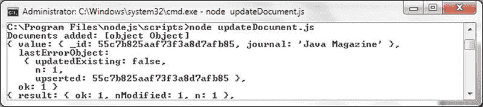
    *图 5-32. updateDocument.js 的输出*
2.  在 Mongo shell 中运行 `db.catalog.find()` 方法以列出集合中的文档。列出的文档中有一个是更新插入的文档，如图 5-33 所示。另一个文档已被更新，其中添加了一些字段。
    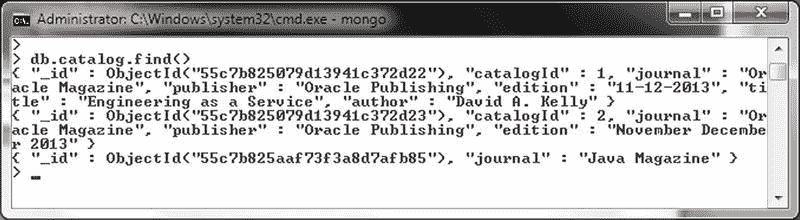
    *图 5-33. 列出更新后的文档*

在被更新的文档（不是更新插入的文档）中，只有在 `$set` 操作符中指定的字段被更新，其他字段保持与更新前相同。只有第一个匹配的文档会被更新。


### 更新多个文档

在本章节中，我们将使用 `updateMany(filter, update, options, callback)` 方法来更新多个文档。相关参数在表 5-24 中讨论。

## 表 5-24. `updateMany()` 方法的参数

| 参数 | 类型 | 描述 |
| --- | --- | --- |
| `filter` | object | 指定用于选择要更新的文档的选择过滤器。 |
| `update` | object | 要在文档上执行的更新操作。 |
| `options` | object | 方法选项。选项包括 `upsert`、`w`、`wtimeout` 和 `j`。 |
| `callback` | `writeOpCallback(error, result)` | 回调函数，其第一个参数是一个 `MongoError` 对象，第二个参数是方法结果。如果使用写关注点，则必须指定回调函数。 |

1.  在 `C:\Program Files\nodejs\scripts` 目录中创建一个脚本 `updateDocuments.js` 以更新多个文档。
2.  如前所述，使用 `insertMany()` 方法向 `catalog` 数据库中的 `catalog` 集合添加一个文档数组。添加 `catalogId`、`title` 和 `author` 字段（这些是所有文档独有的字段），但不要添加通用字段 `edition`、`journal` 和 `publisher`。

    ```javascript
    doc1 = {"catalogId" : 'catalog1',"title" : 'Engineering as a Service',"author" : 'David A. Kelly'};
    doc2 = {"catalogId" : 'catalog2', "title" : 'Quintessential and Collaborative',"author" : 'Tom Haunert'};
    collection.insertMany([doc1,doc2], function(error, result){
        if (error)
            console.log(error);
        else{
            console.log("Documents added: "+result);
        }
    });
    ```

3.  调用 `updateMany()` 方法，使用选择过滤器 `{}` 来选择所有文档。使用 `$set` 更新操作符指定更新，以添加通用字段 `journal`、`publisher` 和 `edition`。在回调函数中，将方法结果记录到控制台。

    ```javascript
    collection.updateMany({}, {$set:{edition:'November December 2013', journal:'Oracle Magazine', publisher:'Oracle Publishing'}},
        {upsert:true},
        function(error, result) {
            if (error) console.log(error);
            else
                console.log(result);
        });
    ```

    `updateDocuments.js` 脚本如下：

    ```javascript
    Server = require('mongodb').Server;
    Db = require('mongodb').Db;
    Collection = require('mongodb').Collection;
    var db = new Db('local', new Server('localhost', 27017));
    db.open(function(error, db) {
        if (error)
            console.log(error);
        else{
            db.createCollection('catalog', function(error, collection){
                if (error)
                    console.log(error);
                else{
                    doc1 = {"catalogId" : 'catalog1',"title" : 'Engineering as a Service',"author" : 'David A. Kelly'};
                    doc2 = {"catalogId" : 'catalog2', "title" : 'Quintessential and Collaborative',"author" : 'Tom Haunert'};
                    collection.insertMany([doc1,doc2], function(error, result){
                        if (error)
                            console.log(error);
                        else{
                            console.log("Documents added: "+result);
                        }
                    });
                    collection.updateMany({}, {$set:{edition:'November December 2013', journal:'Oracle Magazine', publisher:'Oracle Publishing'}},
                        {upsert:true},
                        function(error, result) {
                            if (error) console.log(error);
                            else
                                console.log(result);
                        });
                }
            });
        }
    });
    ```

4.  运行脚本前，在 Mongo shell 中使用以下命令删除 `catalog` 集合。

    ```javascript
    >use local
    >db.catalog.drop()
    ```

5.  使用命令 `node updateDocuments.js` 运行 `updateDocuments.js` 脚本。两个文档被匹配，如结果中的 `nModified` 字段所示，这两个文档被修改，如图 5-34 所示。

    

    图 5-34. `updateDocuments.js` 的输出

6.  在 Mongo shell 中运行 `db.catalog.find()` 方法以列出更新后的文档。两个文档都添加/更新了 `edition`、`publisher` 和 `journal` 字段，如图 5-35 所示。

    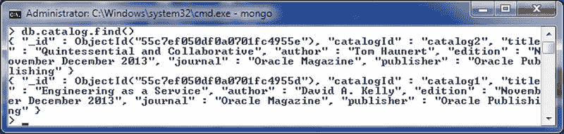

    图 5-35. 列出更新的文档

