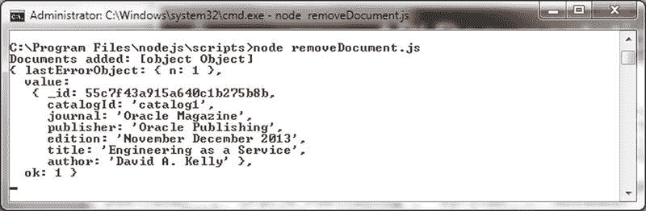
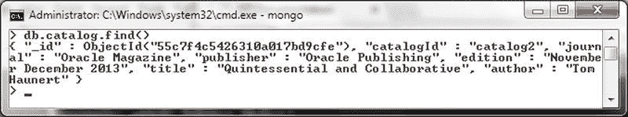
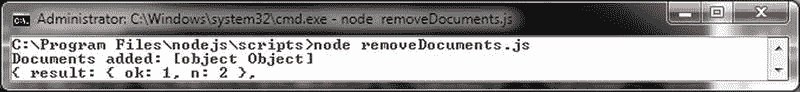
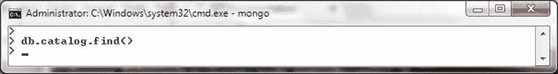

# 删除单个文档

`findOneAndDelete(filter, options, callback)` 方法可用于从集合中删除一个或多个文档。方法参数在表 5-25 中讨论。

## 表 5-25. `findOneAndDelete()` 方法的参数

| 参数 | 类型 | 描述 |
| --- | --- | --- |
| `filter` | object | 指定文档选择过滤器。如果未指定过滤器，则删除所有文档。 |
| `options` | object | 方法选项。 |
| `callback` | `findAndModifyCallback(error, result)` | 回调函数，如果使用写关注点，则必须指定。 |

支持的选项在表 5-26 中讨论。

## 表 5-26. `findOneAndDelete()` 方法的选项

| 选项 | 类型 | 描述 |
| --- | --- | --- |
| `projection` | object | 结果的字段投射。 |
| `sort` | object | 如果查询选择多个文档，则根据排序顺序确定替换哪个文档。 |
| `maxTimeMS` | number | 查询可以运行的最长时间（以毫秒为单位）。 |

1.  在 `C:\Program Files\nodejs\scripts` 目录中创建一个脚本 `removeDocument.js`。
2.  使用 `insertMany()` 方法向集合添加一个文档数组。
3.  调用 `findOneAndRemove()` 方法，使用选择查询来选择所有 `journal` 为 `Oracle Magazine` 的文档，并将回调函数结果输出到控制台。

    ```javascript
    collection.findOneAndRemove({journal:'Oracle Magazine'},
        function(error, result) {
            if (error) console.log(error);
            else
                console.log(result);
        });
    ```

    `removeDocument.js` 脚本如下：

    ```javascript
    Server = require('mongodb').Server;
    Db = require('mongodb').Db;
    Collection = require('mongodb').Collection;
    var db = new Db('local', new Server('localhost', 27017));
    db.open(function(error, db) {
        if (error)
            console.log(error);
        else{
            db.createCollection('catalog', function(error, collection){
                if (error)
                    console.log(error);
                else{
                    doc1 = {"catalogId" : 'catalog1', "journal" : 'Oracle Magazine', "publisher" : 'Oracle Publishing', "edition" : 'November December 2013',"title" : 'Engineering as a Service',"author" : 'David A. Kelly'};
                    doc2 = {"catalogId" : 'catalog2', "journal" : 'Oracle Magazine', "publisher" : 'Oracle Publishing', "edition" : 'November December 2013',"title" : 'Quintessential and Collaborative',"author" : 'Tom Haunert'};
                    collection.insertMany([doc1,doc2], function(error, result){
                        if (error)
                            console.log(error);
                        else{
                            console.log("Documents added: "+result);
                        }
                    });
                    collection.findOneAndDelete({journal:'Oracle Magazine'},
                        function(error, result) {
                            if (error) console.log(error);
                            else
                                console.log(result);
                        });
                }
            });
        }
    });
    ```

4.  使用 `db.catalog.drop()` 删除 `local` 数据库中的 `catalog` 集合。

当使用 `node removeDocument.js` 命令运行 `removeDocument.js` 脚本时，将添加两个文档并删除一个。被删除的文档会输出，如图 5-36 所示。



图 5-36.


xhtml#_Fig36). `removeDocuments.js` 的输出

5.  在 Mongo shell 中运行 `db.catalog.find()` 方法以列出文档。由于两个添加的文档中有一个已被删除，因此没有列出任何文档，如图 5-37 所示。



图 5-37. 删除一个文档后的文档列表

`deleteOne(filter, options, callback)` 方法与 `findOneAndDelete(filter, options, callback)` 方法类似，不同之处在于 `deleteOne()` 方法仅支持 `w`、`wtimeout` 和 `j` 选项。

## 删除多个文档

`deleteMany(filter, options, callback)` 方法可用于从集合中删除一个或多个文档。该方法的参数在表 5-27 中讨论。

表 5-27. `deleteMany()` 方法的选项

| 参数 | 类型 | 描述 |
| --- | --- | --- |
| `filter` | object | 指定文档选择过滤器。 |
| `options` | object | 方法选项。支持的选项有 `w`、`wtimeout` 和 `j`。 |
| `callback` | `writeOpCallback(error, result)` | 回调函数。 |

1.  在 `C:\Program Files\nodejs\scripts` 目录下创建一个脚本 `removeDocuments.js`。
2.  使用 `insertMany()` 方法将一组文档添加到集合中。
3.  使用选择器查询调用 `deleteMany()` 方法，以选择所有 `journal` 为 '`Oracle Magazine`' 的文档，并将回调函数结果输出到控制台。

```
collection.deleteMany({journal:'Oracle Magazine'},function(error, result) {
    if (error) console.log(error);
    else
        console.log(result);
});
```

`removeDocuments.js` 脚本如下：

```
Server = require('mongodb').Server;
Db = require('mongodb').Db;
Collection = require('mongodb').Collection;
var db = new Db('local', new Server('localhost', 27017));
db.open(function(error, db) {
    if (error)
        console.log(error);
    else {
        db.createCollection('catalog', function(error, collection) {
            if (error)
                console.log(error);
            else {
                doc1 = {"catalogId": 'catalog1', "journal": 'Oracle Magazine', "publisher": 'Oracle Publishing', "edition": 'November December 2013', "title": 'Engineering as a Service', "author": 'David A. Kelly'};
                doc2 = {"catalogId": 'catalog2', "journal": 'Oracle Magazine', "publisher": 'Oracle Publishing', "edition": 'November December 2013', "title": 'Quintessential and Collaborative', "author": 'Tom Haunert'};
                collection.insertMany([doc1, doc2], function(error, result) {
                    if (error)
                        console.log(error);
                    else {
                        console.log("Documents added: " + result);
                    }
                });
                collection.deleteMany({journal: 'Oracle Magazine'}, function(error, result) {
                    if (error) console.log(error);
                    else
                        console.log(result);
                });
            }
        });
    }
});
```

4.  从 `local` 数据库中删除 `catalog` 集合。

```
>use local
>db.catalog.drop()
```

当使用命令 `node removeDocuments.js` 运行 `removeDocuments.js` 脚本时，会添加两个文档并且两个都被删除。结果中的 `n` 为 2，表示有两个文档已被删除，如图 5-38 所示。



图 5-38. `removeDocuments.js` 的输出

5.  在 Mongo shell 中运行 `db.catalog.find()` 方法以列出文档。由于添加的两个文档中有一个已被删除，因此没有列出任何文档，如图 5-39 所示。



图 5-39. 删除所有文档后的文档列表

### 执行批量写入操作

`Collection` 类提供了 `bulkWrite(operations, options, callback)` 方法来执行批量写入操作。该方法的参数在表 5-28 中讨论。

表 5-28. `bulkWrite()` 方法的参数

| 参数 | 类型 | 描述 |
| --- | --- | --- |
| `operations` | Array.<object> | 要执行的批量操作。支持的操作有 `insertOne`、`updateOne`、`updateMany`、`deleteOne`、`deleteMany` 和 `replaceOne`。 |
| `options` | object | 方法选项。支持的选项有 `w`、`wtimeout`、`j`、`serializeFunctions` 和 `ordered`。`serializeFunctions` 默认为 `false`。`ordered` 默认为 `true`，表示写入操作将按指定的顺序执行。 |
| `callback` | `bulkWriteOpCallback` | 回调函数。 |

1.  在 `C:\Program Files\nodejs\scripts` 目录中创建一个 `bulkWriteDocuments.js` 脚本。
2.  在 local 数据库中删除 `catalog` 集合。

```
>use local
>db.catalog.drop()
```

3.  在脚本中创建 `catalog` 集合，并使用 `bulkWrite(operations, options, callback)` 方法执行批量写入操作，以添加一些文档、更新单个文档、更新多个文档、替换一个文档以及删除一个文档。将 `ordered` 选项设置为 `true`（这也是默认值），以便批量写入操作按指定的顺序执行。如果某个批量写入操作依赖于前一个操作，那么顺序可能很重要。例如，集合中的文档必须在添加后才能更新。

```
collection.bulkWrite([
    { insertOne: { document: {"catalogId": 'catalog1', "journal": 'Oracle Magazine', "publisher": 'Oracle Publishing', "edition": 'November December 2013', "title": 'Engineering as a Service', "author": 'David A. Kelly'} } },
    { insertOne: { document: {"catalogId": 'catalog2', "journal": 'Oracle Magazine', "publisher": 'Oracle Publishing', "edition": 'November December 2013', "title": 'Quintessential and Collaborative', "author": 'Tom Haunert'} } },
    { insertOne: { document: {"catalogId": 'catalog3', "journal": 'Oracle Magazine', "publisher": 'Oracle Publishing', "edition": 'November December 2013'} } },
    { insertOne: { document: {"catalogId": 'catalog4', "journal": 'Oracle Magazine', "publisher": 'Oracle Publishing', "edition": 'November December 2013'} } },
    { updateOne: { filter: {journal: 'Oracle Magazine'}, update: {$set: {journal: 'OracleMagazine'}}, upsert: true } },
    { updateMany: { filter: {edition: 'November December 2013'}, update: {$set: {edition: '11-12-2013'}}, upsert: true } },
    { deleteOne: { filter: {journal: 'Oracle Magazine'} } },
    { replaceOne: { filter: {catalogId: 'catalog5'}, replacement: {"catalogId": 'catalog5', "journal": 'Oracle Magazine', "publisher": 'Oracle Publishing', "edition": 'November December 2013'}, upsert: true }}
], {ordered: true, w: 1}, function(error, result) {
    if (error)
        console.log(error);
    else {
        console.log("Documents added: " + result);
    }
});
```

类似地，可以添加一个 `{ deleteMany: { filter: {journal:'Oracle Magazine'} } }` 批量写入操作，以根据选择查询删除所有文档。示例脚本中没有包含 `deleteMany()` 操作，这是为了展示其他批量写入操作的效果，因为如果包含了 `deleteMany()`，所有或大部分文档都会被删除。`bulkWriteDocuments.js` 脚本如下：

```
Server = require('mongodb').Server;
Db = require('mongodb').Db;
Collection = require('mongodb').Collection;
var db = new Db('local', new Server('localhost', 27017));
db.
```


