# 第六章 将 Apache Cassandra 表迁移到 MongoDB

虽然 MongoDB 是最常用的基于文档的 NoSQL 存储，但 Apache Cassandra 是最常用的基于宽列的 NoSQL 存储。MongoDB 和 Apache Cassandra 使用的数据模型不同。MongoDB 基于 JSON（BSON）数据模型，而 Cassandra 基于列/行（表）数据模型。两者都提供了无模式、灵活的存储模型。在本章中，我们将讨论将 Apache Cassandra 文档迁移到 MongoDB。本章包括以下主题：

*   设置环境
*   在 Eclipse 中创建 Maven 项目
*   在 Apache Cassandra 中创建文档
*   将 Cassandra 表迁移到 MongoDB

## 设置环境

我们需要为本章安装以下软件：

*   Apache Cassandra 2.2.0：从 `http://cassandra.apache.org/download/` 获取 `apache-cassandra-2.2.0-bin.tar.gz`。将 `tar.gz` 文件解压到一个目录，并将 `bin` 目录（例如 `C:\apache-cassandra-2.2.0\bin`）添加到 `PATH` 环境变量中。
*   MongoDB 3.0.5：从 `www.mongodb.org/downloads` 获取。
*   Eclipse IDE for Java EE Developers：从 `www.eclipse.org/downloads/` 获取。
*   Java 7：从 `www.oracle.com/technetwork/java/javase/downloads/jdk7-downloads-1880260.html` 获取。

双击 MongoDB 二进制发行版以安装 MongoDB。将 MongoDB 安装的 `bin` 目录（`C:\Program Files\MongoDB\Server\3.0\bin`）添加到 `PATH` 环境变量中。如果尚未为前面的章节创建，请创建目录 `C:\data\db` 用于存放 MongoDB 数据。

使用以下命令启动 Apache Cassandra 服务器。
```
>cassandra –f
```
服务器启动，如 图 6-1 的服务器输出所示。如果 thrift 服务未启动，请运行命令 `nodetool enablethrift`。Cassandra 服务器正在 `localhost` 端口 9160 上监听客户端连接。

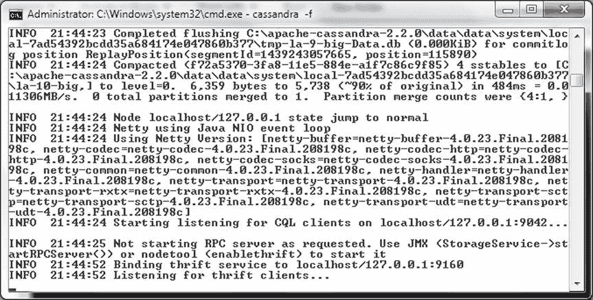
图 6-1. 启动 Apache Cassandra

使用以下命令启动 MongoDB 服务器。
```
>mongod
```
MongoDB 服务器启动，如 图 6-2 所示。MongoDB 正在 `localhost` 端口 27017 上等待连接。

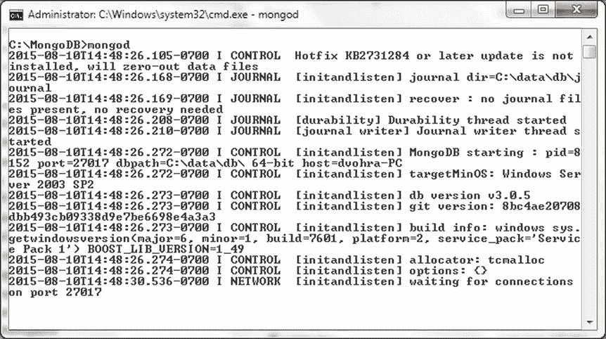
图 6-2. 启动 MongoDB 服务器

### 在 Eclipse 中创建 Maven 项目

接下来，在 Eclipse IDE 中创建一个 Java 项目，用于将 Cassandra 数据库数据迁移到 MongoDB 数据库。

1.  选择 File  New  Other。
2.  在 New 窗口中，选择 Maven  Maven Project 并点击 Next，如 图 6-3 所示。

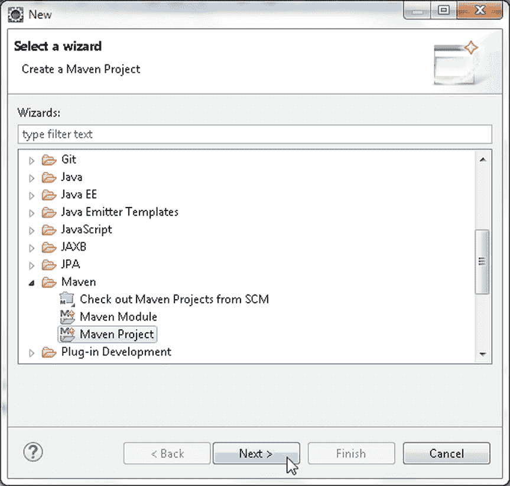
图 6-3. 选择 Maven  Maven Project

3.  New Maven Project 向导启动。选择 Create a simple project 复选框和 Use default Workspace location 复选框，然后点击 Next，如 图 6-4 所示。

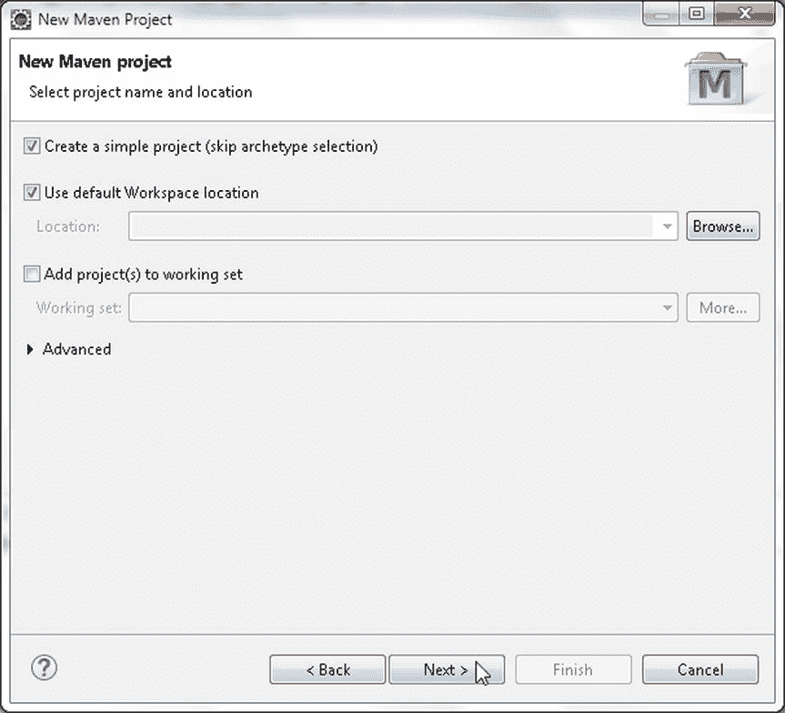
图 6-4. New Maven Project 向导

4.  在 Configure project 中，指定以下内容，然后点击 Finish，如 图 6-5 所示。
    *   Group Id: `com.mongodb.migration`
    *   Artifact Id: `CassandraToMongoDB`
    *   Version: `1.0.0`
    *   Packaging: `jar`
    *   Name: `CassandraToMongoDB`

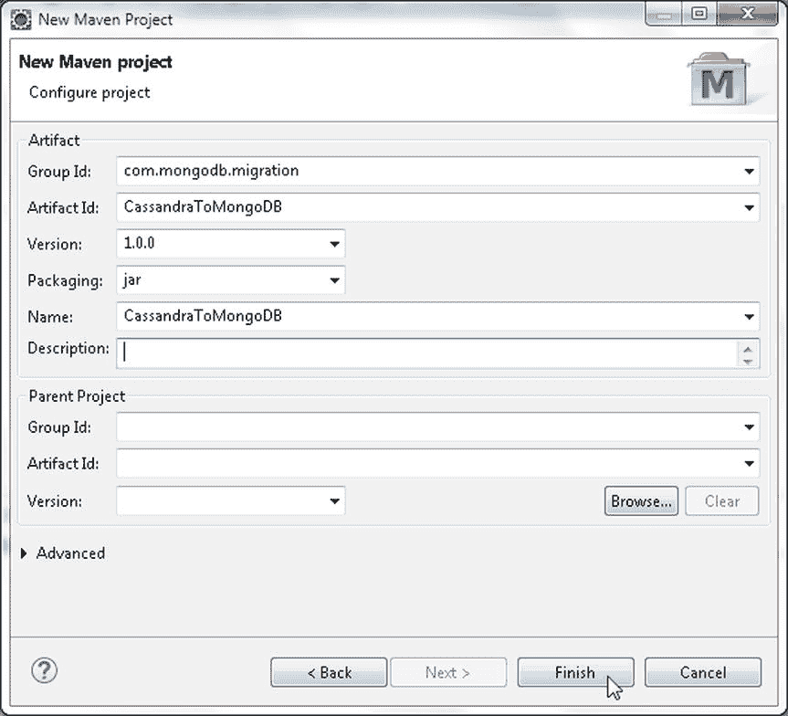
图 6-5. 配置 Maven 项目

在 Eclipse IDE 中创建了一个 Maven 项目，如 图 6-6 所示。

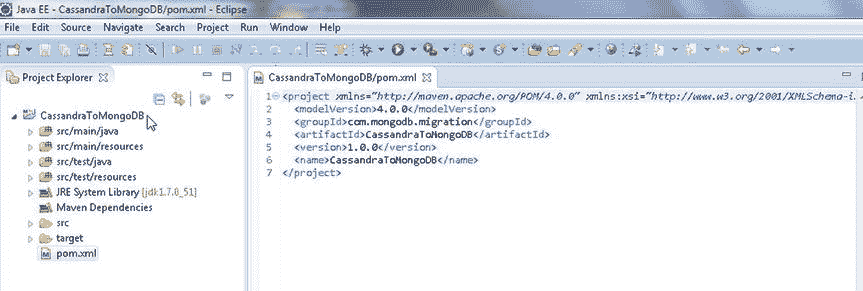
图 6-6. Package Explorer 中的 Maven 项目 CassandraToMongoDB

现在，我们需要为迁移创建两个 Java 类：一个用于在 Cassandra 中创建初始数据，另一个用于将数据迁移到 MongoDB。

1.  要创建 Java 类，点击 File  New  Other。
2.  在 New 窗口中，选择 Java  Class 并点击 Next，如 图 6-7 所示。

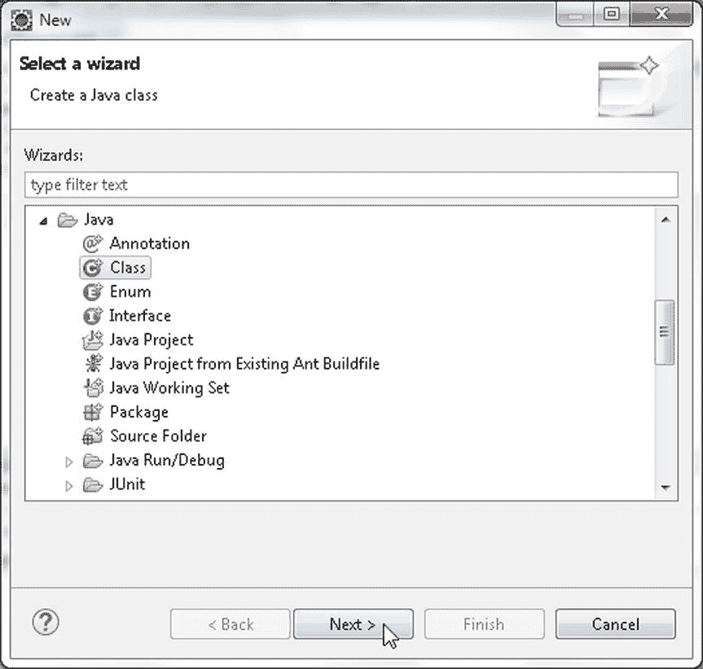
图 6-7. 选择 Java  Java Class

3.  在 New Java Class 向导中，选择 Source folder 为 `CassandraToMongoDB/src/main/java`，指定 Package 为 `mongodb`，类名为 `CreateCassandraDatabase`。

```javascript
open(function(error, db) {
    if (error)
        console.log(error);
    else {
        db.createCollection('catalog', function(error, collection) {
            if (error)
                console.log(error);
            else {
                collection.bulkWrite([
                    { insertOne: { document: { "catalogId": 'catalog1', "journal": 'Oracle Magazine', "publisher": 'Oracle Publishing', "edition": 'November December 2013', "title": 'Engineering as a Service', "author": 'David A. Kelly' } } },
                    { insertOne: { document: { "catalogId": 'catalog2', "journal": 'Oracle Magazine', "publisher": 'Oracle Publishing', "edition": 'November December 2013', "title": 'Quintessential and Collaborative', "author": 'Tom Haunert' } } },
                    { insertOne: { document: { "catalogId": 'catalog3', "journal": 'Oracle Magazine', "publisher": 'Oracle Publishing', "edition": 'November December 2013' } } },
                    { insertOne: { document: { "catalogId": 'catalog4', "journal": 'Oracle Magazine', "publisher": 'Oracle Publishing', "edition": 'November December 2013' } } },
                    { updateOne: { filter: { journal: 'Oracle Magazine' }, update: { $set: { journal: 'OracleMagazine' } }, upsert: true } },
                    { updateMany: { filter: { edition: 'November December 2013' }, update: { $set: { edition: '11-12-2013' } }, upsert: true } },
                    { deleteOne: { filter: { journal: 'Oracle Magazine' } } },
                    { replaceOne: { filter: { catalogId: 'catalog5' }, replacement: { "catalogId": 'catalog5', "journal": 'Oracle Magazine', "publisher": 'Oracle Publishing', "edition": 'November December 2013' }, upsert: true } }
                ], { ordered: true, w: 1 }, function(error, result) {
                    if (error)
                        console.log(error);
                    else {
                        console.log("Documents added: " + result);
                    }
                });
            }
        });
    }
});
```

4.  使用命令 `node bulkWriteDocuments.js` 运行脚本。输出如 图 5-40 所示。


图 5-40. 运行 bulkWriteDocuments.js 脚本

5.  随后在 Mongo shell 中运行 `db.catalog.find()` 命令以列出文档，如 图 5-41 所示。

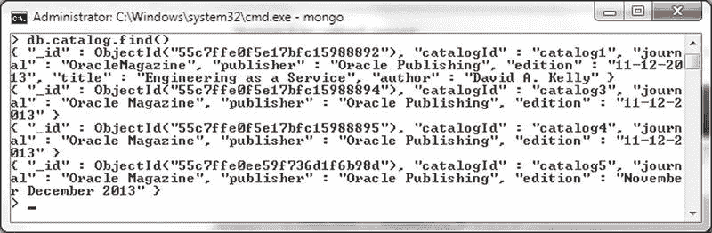
图 5-41. 列出文档

如输出所示，只列出了四个文档，因为最初添加了四个，删除了一个，随后更新（upsert）了一个文档。其中一个文档的 `journal` 字段被设置为 `OracleMagazine`，因为使用了 `updateOne` 来更新一个文档的 `journal` 字段。`catalog5` `catalogId` 文档是使用 `replaceOne` 更新（upsert）的文档。

## 总结

在本章中，我们使用 MongoDB 的 Node.js 驱动程序连接到 MongoDB 服务器并执行 CRUD（创建、读取、更新和删除）操作。我们演示了单文档和多文档的 CRUD 操作。在下一章中，我们将把文档从 Apache Cassandra 迁移到 MongoDB。


勾选复选框以创建方法存根 `public static void main(String[] args)`。如 图 6-8 所示，点击 Finish（完成）。

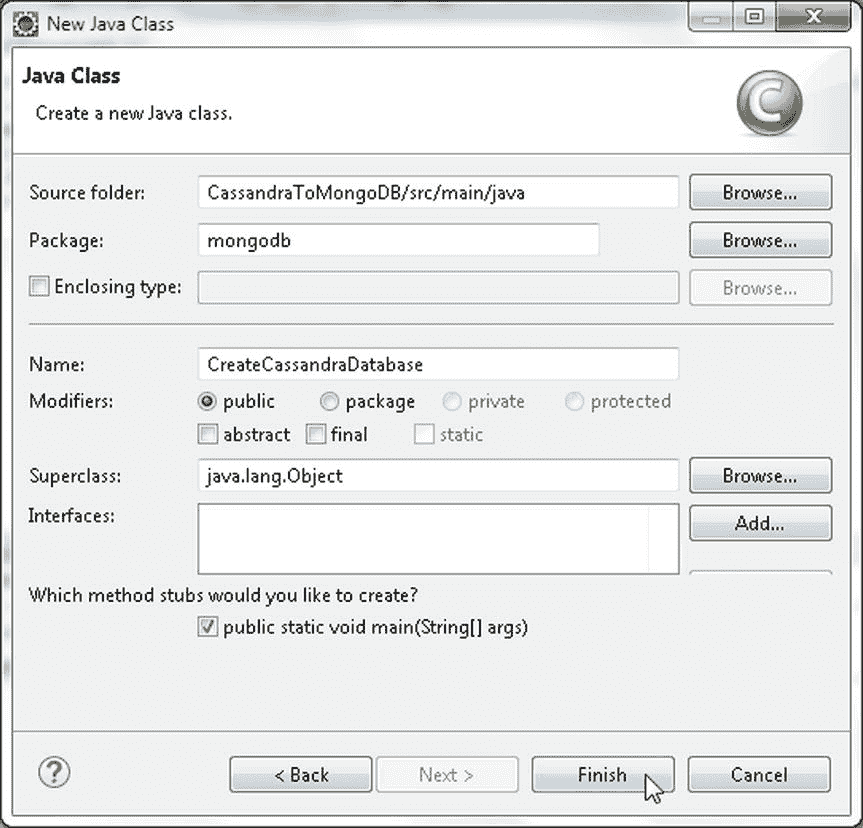
图 6-8. 配置 Java 类 `CreateCassandraDatabase`

4.  类似地，创建一个 Java 类 `MigrateCassandraToMongoDB`，如 图 6-9 所示。

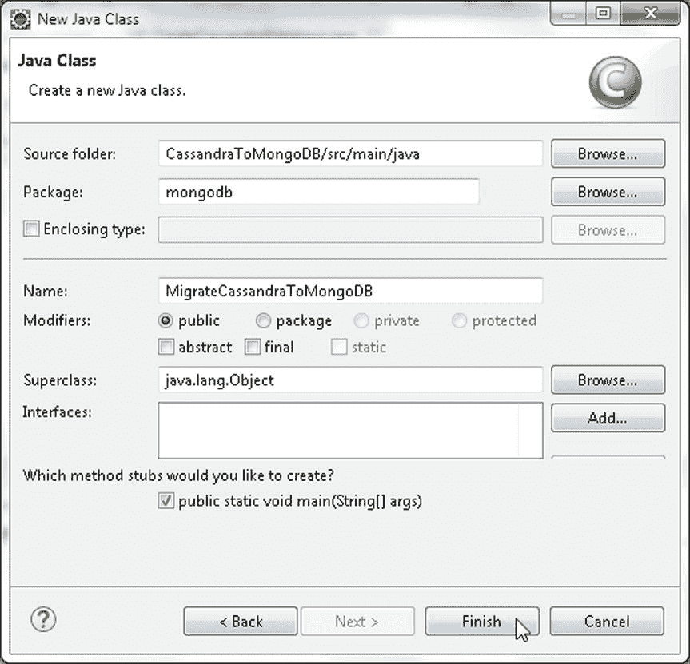
图 6-9. 配置 Java 类 `MigrateCassandraToMongoDB`

这两个 Java 类在 Package Explorer 中的显示如 图 6-10 所示。

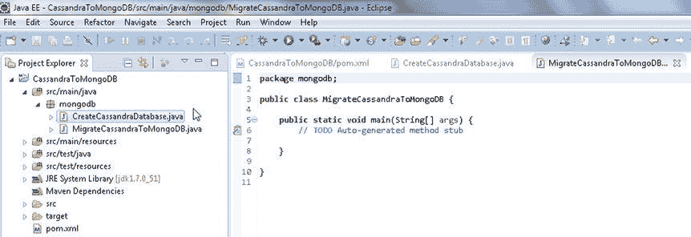
图 6-10. Package Explorer 中的 Java 类

## 添加依赖项

我们需要在 `pom.xml` 中添加一些依赖项。按照 表 6-1 所列添加以下依赖项；其中一些依赖项已注明随 Apache Cassandra Project 依赖项一同包含，不应单独添加。

表 6-1. 依赖项

| JAR 包 | 描述 |
| --- | --- |
| Mongo Java Driver 3.0.3 | 连接 MongoDB 服务器的 Java 客户端。 |
| Apache Cassandra 2.2.0 | Apache Cassandra 项目。 |
| Cassandra Driver Core 2.2.0-rc2 | Datastax Java 驱动程序。 |
| Apache Commons BeanUtils 1.9.2 | 用于基于 JavaBeans 模式开发的 Java 类的实用工具 JAR 包。 |
| Apache Commons Collections 3.2.1 | 提供加速 Java 应用程序开发的数据结构。 |
| Apache Commons Lang 3 3.1 | 提供用于操作 Java 核心类的额外类。随 Apache Cassandra 项目依赖项一同包含。 |
| Apache Commons Logging 1.2 | 通用日志记录实现的接口。 |
| Guava 16.0.1 | Google 的核心库，用于基于 Java 的项目。随 Apache Cassandra 依赖项一同包含。 |
| Jackson Core ASL 1.9.2 | 高性能 JSON 处理器。随 Apache Cassandra 项目依赖项一同包含。 |
| Jackson Mapper ASL 1.9.2 | 构建于 Jackson JSON 处理器之上的高性能数据绑定包。随 Apache Cassandra 项目依赖项一同包含。 |
| Metrics Core 3.1.0 | Metrics 的核心库。随 Apache Cassandra 项目依赖项一同包含。 |
| Netty 4.0.27 | 用于开发网络应用程序（如协议服务器和客户端）的 NIO 客户端服务器框架。随 Apache Cassandra 项目依赖项一同包含。 |
| Slf4j API 1.7.7 | Java 的简单日志门面，充当各种日志框架的抽象层。随 Apache Cassandra 项目依赖项一同包含。 |

`pom.xml` 文件内容如下。

```xml
<project xmlns="http://maven.apache.org/POM/4.0.0" xmlns:xsi="http://www.w3.org/2001/XMLSchema-instance"
    xsi:schemaLocation="http://maven.apache.org/POM/4.0.0 http://maven.apache.org/xsd/maven-4.0.0.xsd">
    <modelVersion>4.0.0</modelVersion>
    <groupId>com.mongodb.migration</groupId>
    <artifactId>CassandraToMongoDB</artifactId>
    <version>1.0.0</version>
    <name>CassandraToMongoDB</name>

    <dependencies>
        <dependency>
            <groupId>org.mongodb</groupId>
            <artifactId>mongo-java-driver</artifactId>
            <version>3.0.3</version>
        </dependency>

        <dependency>
            <groupId>com.datastax.cassandra</groupId>
            <artifactId>cassandra-driver-core</artifactId>
            <version>2.2.0-rc2</version>
        </dependency>

        <dependency>
            <groupId>org.apache.cassandra</groupId>
            <artifactId>cassandra-all</artifactId>
            <version>2.2.0</version>
        </dependency>

        <dependency>
            <groupId>commons-beanutils</groupId>
            <artifactId>commons-beanutils</artifactId>
            <version>1.9.2</version>
        </dependency>

        <dependency>
            <groupId>commons-collections</groupId>
            <artifactId>commons-collections</artifactId>
            <version>3.2.1</version>
        </dependency>

        <dependency>
            <groupId>commons-logging</groupId>
            <artifactId>commons-logging</artifactId>
            <version>1.2</version>
        </dependency>
    </dependencies>
</project>
```

其中一些依赖项还有进一步的依赖项，它们会被自动添加，不应单独添加。要查找从依赖项中添加的所需 JAR 包，请在 Package Explorer 中右键单击项目节点并选择 Properties（属性）。在 Properties 中选择 Java Build Path（Java 构建路径）。添加到迁移项目的 JAR 包如 图 6-11 所示。

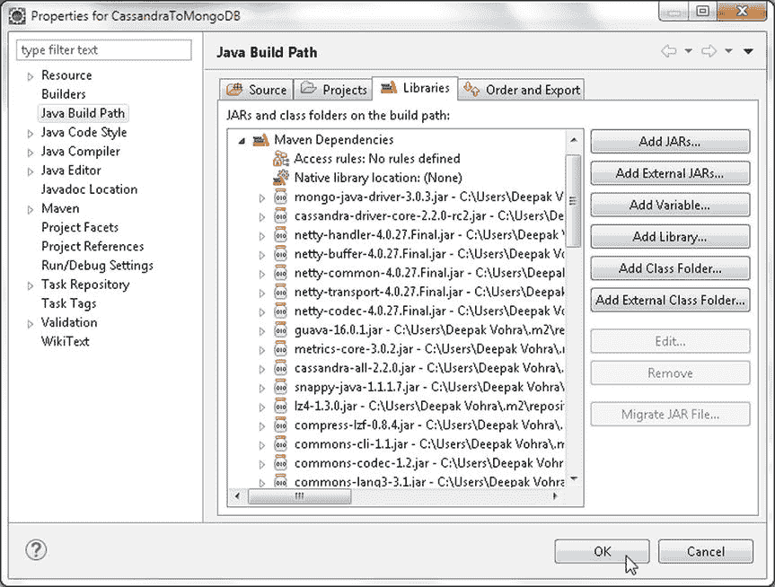
图 6-11. Java 构建路径中的 JAR 文件

### 在 Apache Cassandra 中创建文档

在本节中，我们将创建要迁移到 MongoDB 的 Cassandra 表。Cassandra 表可以使用 Cassandra-CLI 或使用带有 Cassandra Java 驱动程序的 Java 应用程序来创建。我们将在 Java 应用程序 `CreateCassandraDatabase` 中创建一个 Cassandra 表。

在 Java 应用程序中，首先我们需要从应用程序连接到 Cassandra。我们将使用 Datastax Java 驱动程序连接到 Cassandra。创建一个 `Cluster` 实例，它是 Datastax Java 驱动程序的主要入口点。该集群维护与其中一个服务器节点的连接，以保存集群状态和当前拓扑的信息。驱动程序利用节点的自动发现功能来发现集群中的所有节点，包括后来加入的新节点。使用静态方法 `builder()` 构建一个 `Cluster.Builder` 实例，它是用于构建 `Cluster` 实例的辅助类。

1.  我们需要提供 Cassandra 集群中至少一个节点的连接地址，以便 Datastax 驱动程序能够连接到集群并使用自动发现功能发现集群中的其他节点。使用 `Cluster.Builder` 的 `addContactPoint(String)` 方法添加在本地主机 (127.0.0.1) 上运行的 Cassandra 服务器的地址。
2.  接下来，调用 `build()` 方法，使用配置的地址构建 `Cluster`。这些方法可以按顺序调用，因为我们不需要中间类 `Cluster.Builder` 的实例。

    ```java
    cluster = Cluster.builder().addContactPoint("127.0.0.1").build();
    ```

3.  接下来，通过调用 `connect()` 方法在集群上创建一个会话。`Session` 实例用于查询集群，由 `Session` 类表示，它持有到集群的多个连接。`Session` 实例还提供有关使用集群中哪个节点进行查询的策略。默认策略是对集群中的所有节点进行轮询。`Session` 还用于处理失败查询的重试。`Session` 实例是线程安全的，如果仅连接到单个键空间，单个实例对应用程序来说就足够了。如果要连接到多个键空间，则需要单独的 `Session` 实例。

    ```java
    Session session = cluster.connect();
    ```

Cassandra 服务器必须正在运行，才能在应用程序运行时连接到服务器，我们之前已经启动了 Cassandra 服务器。如果 Cassandra 服务器没有运行，尝试连接时会生成 `com.datastax.driver.core.exceptions.NoHostAvailableException` 异常。

`Session` 类提供了多种方法来准备和执行服务器上的查询，其中一些在 表 6-2 中讨论。

表 6-2.


