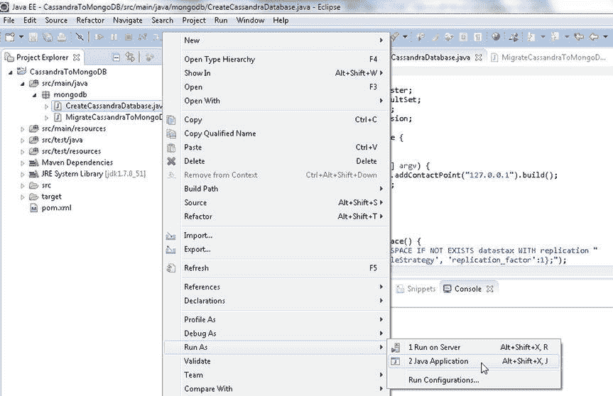
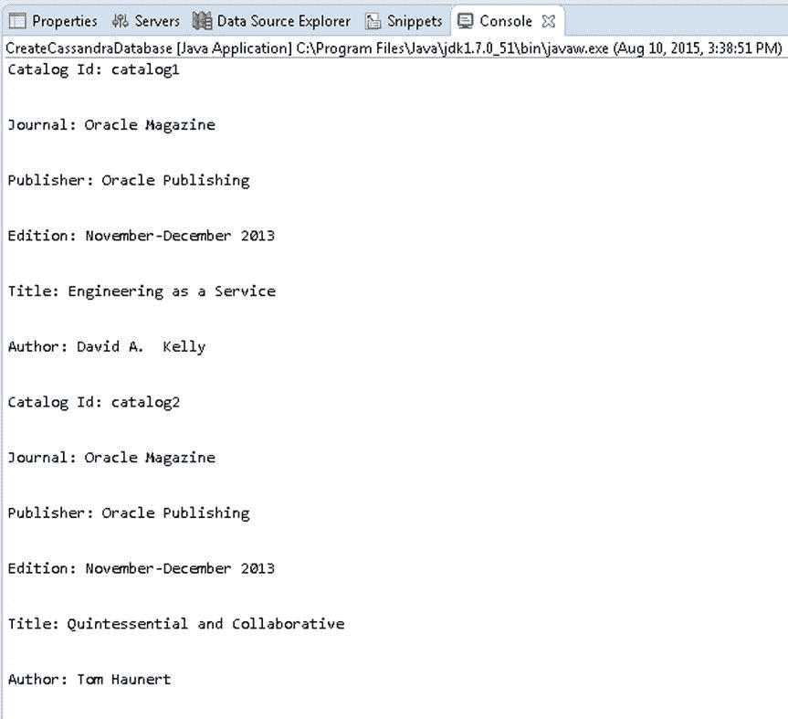

# 运行 `CreateCassandraDatabase` 应用程序

运行 `CreateCassandraDatabase` 应用程序，向 `catalog` 表添加两行数据。在 Package Explorer 中右键点击 `CreateCassandraDatabase.java`，选择 **运行方式**  **Java 应用程序**，如 图 6-12 所示。

图 6-12. 运行 Java 应用程序 CreateCassandraDatabase.java

Cassandra 键空间 `datastax` 将被创建，`catalog` 表将被创建，并且数据将被添加到表中。作为测试运行的 `SELECT` 语句，将输出添加到 Cassandra 的两行数据，如 图 6-13 所示。

图 6-13. 添加到 Cassandra 数据库的两行数据

