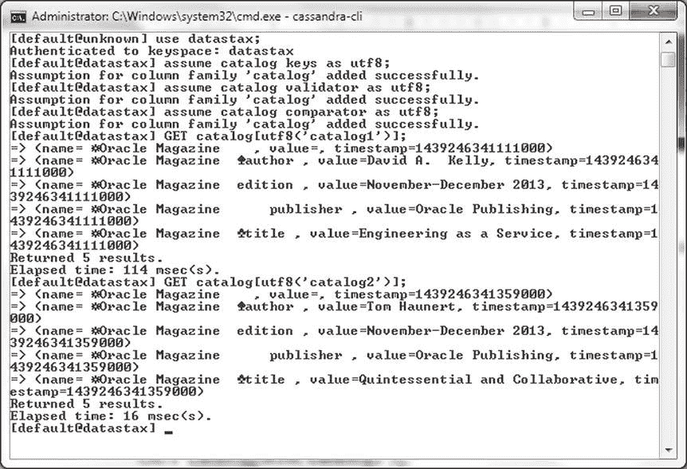
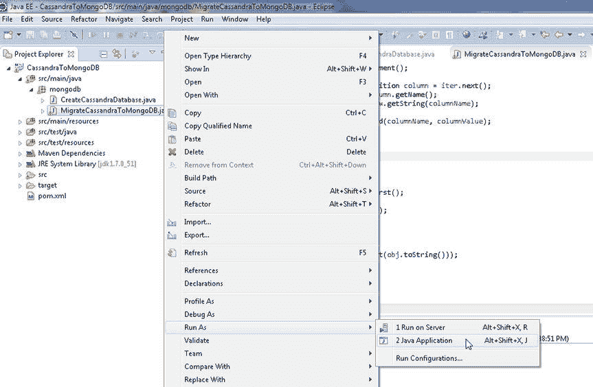
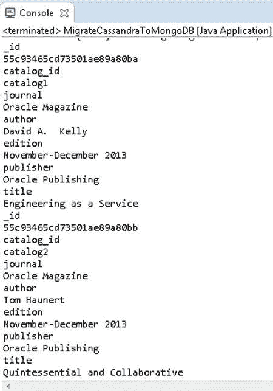

# 输出存储在 Cassandra 中的表

要在 Cassandra-CLI 中输出存储在 Cassandra 中的表，请运行以下命令。

```sql
assume catalog keys as utf8;
assume catalog validator as utf8;
assume catalog comparator as utf8;
GET catalog[utf8('catalog1')];
GET catalog[utf8('catalog2')];
```

存储在 `catalog` 表中的两行数据将被列出，如 图 6-15 所示。



图 6-15. 列出 Catalog 表行

接下来，我们将把 Cassandra 数据迁移到 MongoDB 服务器。

### 将 Cassandra 表迁移到 MongoDB

在本节中，我们将获取存储在 Cassandra 数据库中的数据，并将其迁移到 MongoDB 服务器。我们将使用 `MigrateCassandraToMongoDB` 类将数据从 Cassandra 数据库迁移到 MongoDB 服务器。

1.  向 `MigrateCassandraToMongoDB` 类添加一个名为 `migrate()` 的方法，并从 `main` 方法中调用该方法。

2.  按照上一节在 `main` 方法中的说明，从 `MigrateCassandraToMongoDB` 类连接到 Cassandra 服务器。

    ```java
    cluster = Cluster.builder().addContactPoint("127.0.0.1").build();
    session = cluster.connect();
    ```

    创建一个 `Session` 对象来表示与 Cassandra 服务器的连接。我们将使用 `Session` 对象在 Cassandra 上运行 `SELECT` 语句以选择要迁移的数据。

3.  在 `migrate()` 方法中运行如下 `SELECT` 语句，从 `datastax` 键空间的 `catalog` 表中选择所有行。

    ```java
    ResultSet results = session.execute("select * from datastax.catalog");
    ```

4.  查询的结果集用 `ResultSet` 类表示。`ResultSet` 中的一行用 `Row` 类表示。遍历 `ResultSet` 以将每一行作为 `Row` 对象取出。

    ```java
    for (Row row : results) {
    }
    ```

    在我们迁移从 Cassandra 获取的数据行之前，先为 MongoDB 创建一个 Java 客户端，因为我们需要连接到 MongoDB 并将获取的数据添加到 MongoDB。

5.  `MongoClient` 类表示 MongoDB 的客户端并提供内部连接池。我们将使用 `MongoClient(List<ServerAddress> seeds)` 构造函数，其中 `ServerAddress` 实例的主机为 localhost，服务器运行的端口为 27017。在 `migrate()` 方法中创建一个 `MongoClient` 实例。

    ```java
    MongoClient mongoClient = new MongoClient(Arrays.asList(new ServerAddress(
    "localhost", 27017)));
    ```

6.  数据库实例由 `com.mongodb.client.MongoDatabase` 类表示。为 `local` 数据库创建一个数据库对象。

    ```java
    MongoDatabase db = mongoClient.getDatabase("local");
    ```

7.  MongoDB 数据库集合由 `com.mongodb.client.MongoCollection` 类表示。接下来，使用 `MongoDatabase` 对象的 `getCollection(String collectionName)` 方法创建一个 MongoDB 集合实例。创建一个名为 `catalog` 的集合。

    ```java
    MongoCollection<Document> coll = db.getCollection("catalog");
    ```

8.  当按名称引用集合而无需首先创建集合时，MongoDB 集合会隐式创建。接下来，我们将使用 `for` 循环遍历结果集中的行，将从 Cassandra 获得的结果集迁移到 MongoDB。

    ```java
    for (Row row : results) {
    }
    ```

9.  `ColumnDefinitions` 类表示描述 `ResultSet` 中包含的列的元数据。使用 `Row` 的 `getColumnDefinitions()` 方法获取由 `ColumnDefinitions` 对象表示的列定义。使用 `iterator()` 方法在 `ColumnDefinitions` 对象上创建一个 `Iterator`，其中每个列定义由 `ColumnDefinitions.Definition` 表示。

    ```java
    ColumnDefinitions columnDefinitions = row.getColumnDefinitions();
    Iterator<ColumnDefinitions.Definition> iter = columnDefinitions.iterator();
    ```

10. 使用 `while` 循环和 `Iterator` 的 `hasNext` 方法遍历列，并使用 `ColumnDefinitions.Definition` 中的 `getName` 方法获取列名。

    ```java
    while (iter.hasNext()) {
        ColumnDefinitions.Definition column = iter.next();
        String columnName = column.getName();
    }
    ```

11. 在 `while` 循环中，使用 `Row` 中的 `getString(String columnName)` 方法获取每列对应的值。

    ```java
    String columnValue = row.getString(columnName);
    ```

    `org.bson.Document` 类将 MongoDB 文档表示为 `Map`；可以存储在 Mongo 数据库中的键/值映射。`org.bson.Document` 实现了 `org.bson.conversions.Bson` 接口，并表示存储在 MongoDB 服务器中的基本 BSON 对象。

12. 接下来，我们将向 Mongo 数据库添加一个 BSON 文档。在 `for` 循环中，使用类构造函数创建一个 `org.bson.Document` 实例。

    ```java
    Document catalog = new Document();
    ```

13. 一旦 `org.bson.


## 使用 Java 将 Cassandra 表迁移到 MongoDB

### 步骤
14. 使用`org.bson.Document`类的`append(String key, Object value)`方法为`Document`添加键值对。利用从 Cassandra 结果集中获取的列名/值对，通过`append`方法创建一个完整的 BSON 文档。
    ```
    catalog = catalog.append(columnName, columnValue);
    ```

15. 如第 1 章所述，`MongoCollection`类提供了`insertOne(TDocument document)`方法来添加单个文档。使用`insertOne(TDocument document)`方法保存`Document`实例。
    ```
    coll.insertOne(catalog);
    ```

16. 接下来，输出添加到 MongoDB 集合中的文档，这也验证了文档确实已添加。可以使用`MongoCollection`中的`find()`方法获取集合中的所有文档。`find()`方法返回一个`FindIterable`对象作为结果。
    ```
    FindIterable<Document> iterable = coll.find();
    ```

17. 如第 1 章所述，输出存储在`FindIterable`对象中每个文档的键值对。使用增强的`for`循环获取`FindIterable`中的`Document`实例。使用`keySet()`方法获取每个`Document`实例关联的键集合，该方法返回一个`Set<String>`对象。使用`iterator()`方法从`Set`对象创建一个`Iterator<String>`对象。使用`while`循环遍历键集，并输出每个`Document`的文档键及其关联的`Document`对象。
    ```
    FindIterable<Document> iterable = coll.find();
    String documentKey = null;
    for (Document document : iterable) {
        Set<String> keySet = document.keySet();
        Iterator<String> iter = keySet.iterator();
        while (iter.hasNext()) {
            documentKey = iter.next();
            System.out.println(documentKey);
            System.out.println(document.get(documentKey));
        }
    }
    ```

18. 使用`close()`方法关闭`MongoClient`对象。
    ```
    mongoClient.close();
    ```

19. 同时关闭 Cassandra 的会话和集群。
    ```
    session.close();
    cluster.close();
    ```

`MigrateCassandraToMongoDB`类如下所示：
```
package mongodb;
import java.util.Arrays;
import java.util.Iterator;
import java.util.Set;
import org.bson.Document;
import com.datastax.driver.core.Cluster;
import com.datastax.driver.core.ColumnDefinitions;
import com.datastax.driver.core.ResultSet;
import com.datastax.driver.core.Row;
import com.datastax.driver.core.Session;
import com.mongodb.MongoClient;
import com.mongodb.ServerAddress;
import com.mongodb.client.FindIterable;
import com.mongodb.client.MongoCollection;
import com.mongodb.client.MongoDatabase;

public class MigrateCassandraToMongoDB {
    private static Cluster cluster;
    private static Session session;
    private static MongoClient mongoClient;
    public static void main(String[] args) {
        cluster = Cluster.builder().addContactPoint("127.0.0.1").build();
        session = cluster.connect();
        session = cluster.connect();
        migrate();
        mongoClient.close();
        session.close();
        cluster.close();
    }
    public static void migrate() {
        mongoClient = new MongoClient(Arrays.asList(new ServerAddress(
                "localhost", 27017)));
        MongoDatabase db = mongoClient.getDatabase("local");
        MongoCollection<Document> coll = db.getCollection("catalog");
        ResultSet results = session.execute("select * from datastax.catalog");
        for (Row row : results) {
            ColumnDefinitions columnDefinitions = row.getColumnDefinitions();
            Iterator<ColumnDefinitions.Definition> iter = columnDefinitions
                    .iterator();
            Document catalog = new Document();
            while (iter.hasNext()) {
                ColumnDefinitions.Definition column = iter.next();
                String columnName = column.getName();
                String columnValue = row.getString(columnName);
                catalog = catalog.append(columnName, columnValue);
            }
            coll.insertOne(catalog);
        }
        FindIterable<Document> iterable = coll.find();
        String documentKey = null;
        for (Document document : iterable) {
            Set<String> keySet = document.keySet();
            Iterator<String> iter = keySet.iterator();
            while (iter.hasNext()) {
                documentKey = iter.next();
                System.out.println(documentKey);
                System.out.println(document.get(documentKey));
            }
        }
    }
}
```

要将 Cassandra 表迁移到 MongoDB，请在 Package Explorer 中右键单击`MigrateCassandraToMongoDB`类，然后选择“运行方式”  “Java 应用程序”，如图 6-16 所示。


图 6-16。运行 MigrateCassandraToMongoDB.java 应用程序

Apache Cassandra 表被迁移到 MongoDB。迁移到 MongoDB 的表数据也会在 Eclipse 控制台中输出，如图 6-17 所示。


图 6-17。输出迁移的文档

应用程序更详细的输出如下所示：
```
16:31:48.058 [main] INFO  com.datastax.driver.core.Cluster - New Cassandra host /127.0.0.1:9042 added
16:31:48.143 [cluster1-nio-worker-1] DEBUG com.datastax.driver.core.Connection - Connection[/127.0.0.1:9042-2, inFlight=0, closed=false] Connection opened successfully
16:31:48.168 [cluster1-nio-worker-1] DEBUG com.datastax.driver.core.Session - Added connection pool for /127.0.0.1:9042
16:31:48.176 [cluster1-nio-worker-2] DEBUG com.datastax.driver.core.Connection - Connection[/127.0.0.1:9042-3, inFlight=0, closed=false] Connection opened successfully
16:31:48.190 [cluster1-nio-worker-2] DEBUG com.datastax.driver.core.Session - Added connection pool for /127.0.0.1:9042
16:31:49.122 [main] INFO  org.mongodb.driver.cluster - Cluster created with settings {hosts=[localhost:27017], mode=MULTIPLE, requiredClusterType=UNKNOWN, serverSelectionTimeout='30000 ms', maxWaitQueueSize=500}
16:31:49.122 [main] INFO  org.mongodb.driver.cluster - Adding discovered server localhost:27017 to client view of cluster
16:31:49.165 [main] DEBUG org.mongodb.driver.cluster - Updating cluster description to  {type=UNKNOWN, servers=[{address=localhost:27017, type=UNKNOWN, state=CONNECTING}]
16:31:49.253 [cluster-ClusterId{value='55c93465cd73501ae89a80b9', description='null'}-localhost:27017] INFO  org.mongodb.driver.connection - Opened connection [connectionId{localValue:1, serverValue:16}] to localhost:27017
16:31:49.254 [cluster-ClusterId{value='55c93465cd73501ae89a80b9', description='null'}-localhost:27017] DEBUG org.mongodb.driver.cluster - Checking status of localhost:27017
16:31:49.256 [cluster-ClusterId{value='55c93465cd73501ae89a80b9', description='null'}-localhost:27017] INFO  org.mongodb.driver.cluster -
```


