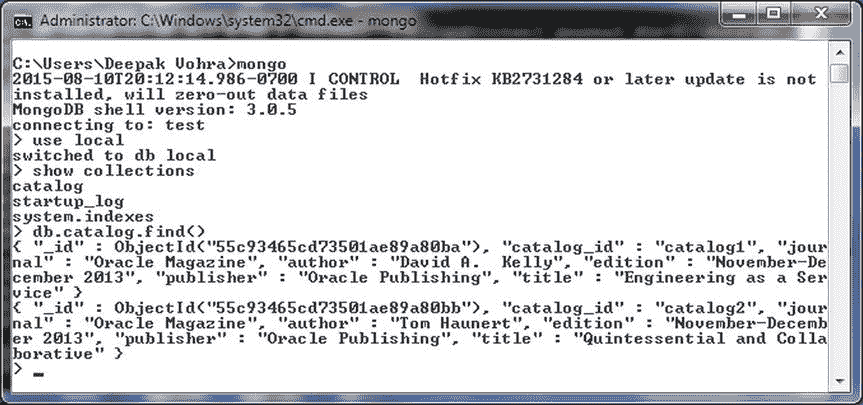

# MongoDB 连接与操作日志

```
cluster - Monitor thread successfully connected to server with description ServerDescription{address=localhost:27017, type=STANDALONE, state=CONNECTED, ok=true, version=ServerVersion{versionList=[3, 0, 5]}, minWireVersion=0, maxWireVersion=3, electionId=null, maxDocumentSize=16777216, roundTripTimeNanos=2118747}
16:31:49.258 [cluster-ClusterId{value='55c93465cd73501ae89a80b9', description='null'}-localhost:27017] INFO  org.mongodb.driver.cluster - Discovered cluster type of STANDALONE
16:31:49.259 [cluster-ClusterId{value='55c93465cd73501ae89a80b9', description='null'}-localhost:27017] DEBUG org.mongodb.driver.cluster - Updating cluster description to  {type=STANDALONE, servers=[{address=localhost:27017, type=STANDALONE, roundTripTime=2.1 ms, state=CONNECTED}]}
16:31:49.281 [main] INFO  org.mongodb.driver.connection - Opened connection [connectionId{localValue:2, serverValue:17}] to localhost:27017
16:31:49.307 [main] DEBUG org.mongodb.driver.protocol.insert - Inserting 1 documents into namespace local.catalog on connection [connectionId{localValue:2, serverValue:17}] to server localhost:27017
16:31:49.318 [main] DEBUG org.mongodb.driver.protocol.insert - Insert completed
16:31:49.319 [main] DEBUG org.mongodb.driver.protocol.insert - Inserting 1 documents into namespace local.catalog on connection [connectionId{localValue:2, serverValue:17}] to server localhost:27017
16:31:49.320 [main] DEBUG org.mongodb.driver.protocol.insert - Insert completed
16:31:49.354 [main] DEBUG org.mongodb.driver.protocol.query - Sending query of namespace local.catalog on connection [connectionId{localValue:2, serverValue:17}] to server localhost:27017
16:31:49.358 [main] DEBUG org.mongodb.driver.protocol.query - Query completed
_id     55c93465cd73501ae89a80ba
catalog_id     catalog1
journal     Oracle Magazine
author     David A.  Kelly
edition     November-December 2013
publisher     Oracle Publishing
title     Engineering as a Service
_id     55c93465cd73501ae89a80bb
catalog_id     catalog2
journal     Oracle Magazine
author     Tom Haunert
edition     November-December 2013
publisher     Oracle Publishing
title     Quintessential and Collaborative
16:31:49.364 [main] INFO  org.mongodb.driver.connection - Closed connection [connectionId{localValue:2, serverValue:17}] to localhost:27017 because the pool has been closed.
16:31:49.365 [main] DEBUG org.mongodb.driver.connection - Closing connection connectionId{localValue:2, serverValue:17}
16:31:49.368 [main] DEBUG com.datastax.driver.core.Connection - Connection[/127.0.0.1:9042-3, inFlight=0, closed=true] closing connection
16:31:49.371 [cluster-ClusterId{value='55c93465cd73501ae89a80b9', description='null'}-localhost:27017] DEBUG org.mongodb.driver.connection - Closing connection connectionId{localValue:1, serverValue:16}
16:31:49.381 [main] DEBUG com.datastax.driver.core.Cluster - Shutting down
16:31:49.382 [main] DEBUG com.datastax.driver.core.Connection - Connection[/127.0.0.1:9042-1, inFlight=0, closed=true] closing connection
16:31:49.382 [main] DEBUG com.datastax.driver.core.Connection - Connection[/127.0.0.1:9042-2, inFlight=0, closed=true] closing connection
```

20. 在 mongo shell 中运行以下命令。

```
>use local
>show collections
>db.catalog.find()
```

迁移到 MongoDB 的两个文档被列出，如 图 6-18 所示。

图 6-18. 列出迁移的文档

## Summary

在本章中，我们使用 Eclipse IDE 中的 Java 应用程序将 Apache Cassandra 表迁移到 MongoDB 服务器。首先，我们使用 Cassandra Java 驱动程序向 Cassandra 添加文档。随后，我们将 Cassandra 文档迁移到 MongoDB。

在下一章中，我们将把 Couchbase 数据库文档迁移到 MongoDB。

