# CHAPTER 7


## 将 Couchbase 迁移到 MongoDB

MongoDB 和 Couchbase 都是以文档为中心的 NoSQL 数据库。两者都基于相同的数据存储模型，即 JSON，但有一个细微差别：MongoDB 基于 BSON（二进制 JSON）数据模型，这提供了更广泛的数据类型选择。Couchbase 中的 JSON 支持相对不够成熟。MongoDB 将文档存储在集合中，这使得处理文档更加容易。Mongo 对在 Mongo shell 中运行以对文档执行 CRUD 操作的 JavaScript 方法的支持是另一个优于 Couchbase 的优势。为了利用 MongoDB 中的这些附加功能，将文档从 Couchbase 迁移到 MongoDB 可能是有利的。在本章中，我们将把 Couchbase 文档迁移到 MongoDB。本章涵盖以下主题：

*   设置环境
*   创建 Maven 项目
*   创建 Java 类
*   配置 Maven 项目
*   向 Couchbase 添加文档
*   创建 Couchbase 视图
*   将 Couchbase 文档迁移到 MongoDB

### 设置环境

我们需要为本章下载以下软件。

*   Couchbase Server Community 或 Enterprise Edition 3.0.x（或更高版本） `couchbase-server-enterprise_3.0.3-windows_amd64.exe` 文件，从 `www.couchbase.com/nosql-databases/downloads` 下载。双击 `exe` 文件启动安装程序并安装 Couchbase Server。
*   适用于 Java EE 开发者的 Eclipse IDE，从 `www.eclipse.org/downloads/` 下载。
*   MongoDB 3.05（或更高版本）Windows 二进制文件 `mongodb-win32-x86_64-3.0.5-signed.msi`，从 `www.mongodb.org/downloads` 下载。双击 `mongodb-win32-x86_64-3.0.5-signed` 文件安装 MongoDB 3.05。将 `bin` 目录（例如 `C:\Program Files\MongoDB\Server\3.0\bin`）添加到 `PATH` 环境变量中。
*   Java 7，从 `www.oracle.com/technetwork/java/javase/downloads/jdk7-downloads-1880260.html` 下载。

如果尚未为前面的章节创建，请为 MongoDB 数据创建一个目录 `C:\data\db`。从命令 shell 启动 MongoDB 的命令如下。

```
>mongod
```

MongoDB 启动并在端口 27017 上等待连接。

登录 Couchbase 控制台。在 Couchbase 管理控制台（通过 URL `localhost:8091` 访问）中单击 Data Buckets。默认存储桶应列在 Couchbase Buckets 中。单击默认存储桶的 Documents 按钮。默认情况下，存储桶最初不应包含任何文档，如 图 7-1 所示。
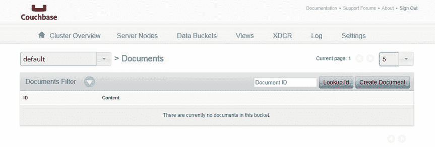
图 7-1. 空的 Couchbase 存储桶 default

### 创建 Maven 项目

我们将使用一个 Maven 项目来创建 Couchbase 文档，随后将 Couchbase 文档迁移到 MongoDB。接下来，在 Eclipse 中创建一个 Maven 项目。

1.  选择 File  New  Other。
2.  在 New 窗口中，选择 Maven  Maven Project 并单击 Next，如 图 7-2 所示。
    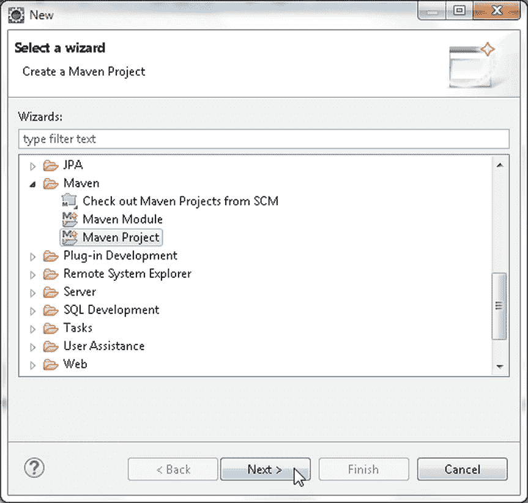
    图 7-2. 选择 Maven  Maven Project
3.  在 New Maven Project 向导中，选中 “Create a simple project” 复选框和 “Use default Workspace location” 复选框，然后单击 Next，如 图 7-3 所示。
    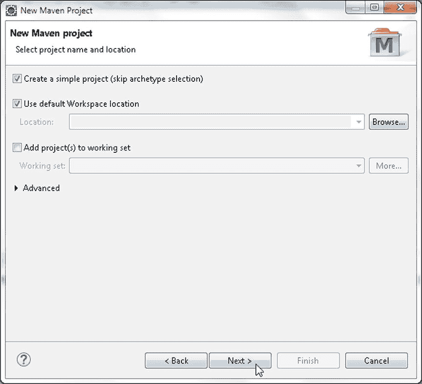
    图 7-3. 创建新的 Maven 项目
4.  要创建 Maven 项目，请指定以下内容并单击 Finish，如 图 7-4 所示。
    *   Group Id: `com.mongodb.migration`
    *   Artifact Id: `CouchbaseToMongoDB`
    *   Version: `1.0`


### 创建 Java 类

我们将在一个 Java 应用程序中将 MongoDB 数据库文档迁移到 Couchbase Server。创建两个类：`CreateCouchbaseDocument` 和 `MigrateCouchbaseToMongoDB`。

1.  要创建 Java 类，请选择 File > New > Other。
2.  在“新建”窗口中，选择 Java > Class，然后点击 Next，如图 7-6 所示。
    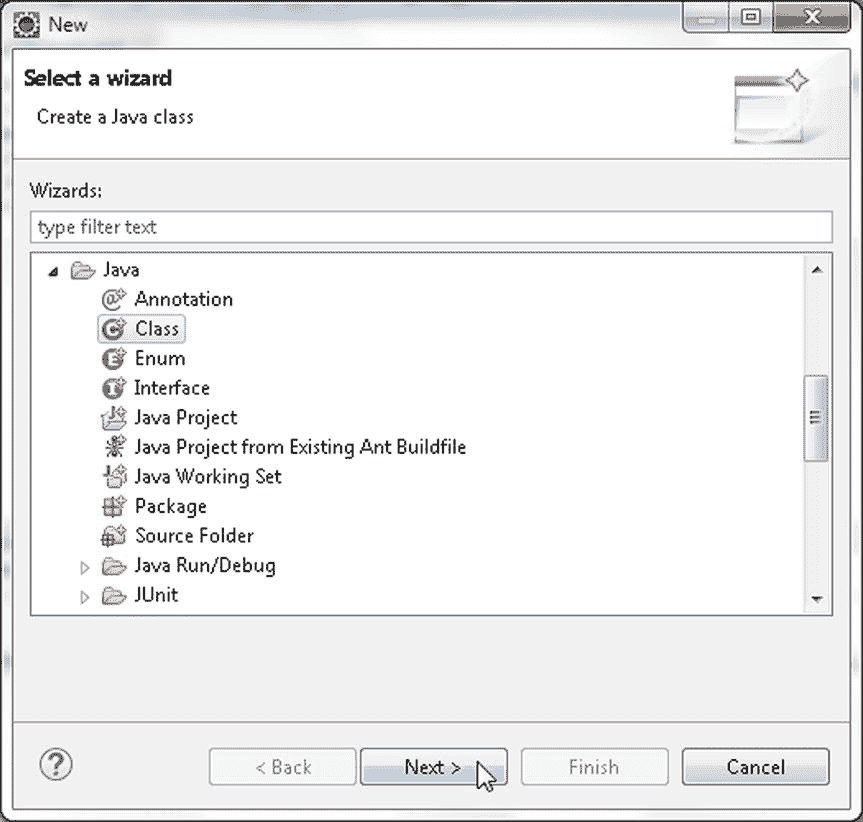
    图 7-6。选择 Java > Java Class
3.  在“新建 Java 类”向导中，选择 Source folder（源文件夹），并指定 Package（包）为 `mongodb`。指定 class Name（类名）为 `CreateCouchbaseDocument`，然后点击 Finish（完成），如图 7-7 所示。
    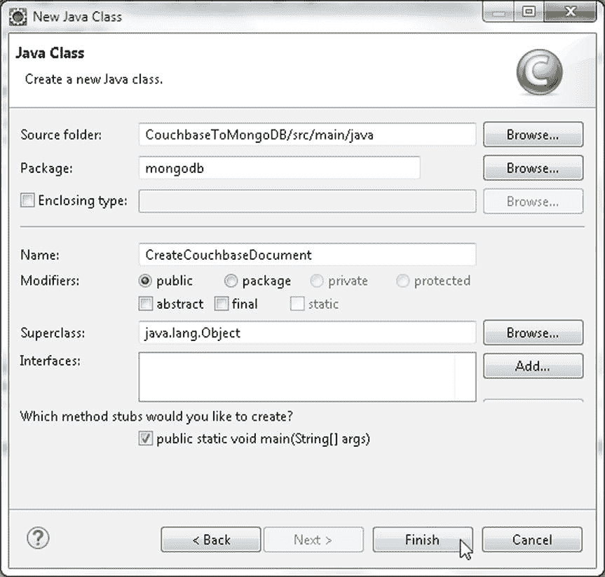
    图 7-7。新建 Java 类向导
4.  类似地，添加一个类 `MigrateCouchbaseToMongoDB`，如图 7-8 所示。这两个类 `CreateMongoDB` 和 `MigrateMongoDBToCouchbase` 在 Package Explorer 中的显示如图 7-8 所示。
    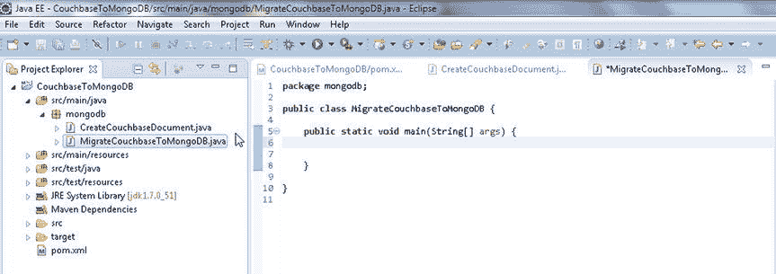
    图 7-8。Package Explorer 中的 Java 类

### 配置 Maven 项目

我们需要将一些 Maven 依赖项添加到项目类路径中。将 表 7-1 中列出的依赖项添加到 Maven 项目的 `pom.xml` 配置文件中。

表 7-1。Maven 依赖项

| 依赖项 | 描述 |
| --- | --- |
| Mongo Java Driver 3.0.3 | 从 Java 应用程序访问 MongoDB 所需的 MongoDB Java 驱动程序。 |
| Couchbase Server Java SDK Client library 2.1.4 | Couchbase Server 的 Java 客户端。 |
| Apache Commons BeanUtils 1.9.2 | 用于遵循 JavaBeans 模式开发的 Java 类的实用工具 Jar 包。 |
| Apache Commons Collections 3.2.1 | Java Collections 框架提供了加速开发的数据结构。 |
| Apache Commons Logging 1.2 | 通用日志记录实现的一个接口。 |

`pom.xml` 文件如下所列。

```xml
<project xmlns="http://maven.apache.org/POM/4.0.0" xmlns:xsi="http://www.w3.org/2001/XMLSchema-instance"
    xsi:schemaLocation="http://maven.apache.org/POM/4.0.0 http://maven.apache.org/xsd/maven-4.0.0.xsd">
    <modelVersion>4.0.0</modelVersion>
    <groupId>com.mongodb.migration</groupId>
    <artifactId>CouchbaseToMongoDB</artifactId>
    <version>1.0.0</version>
    <name>CouchbaseToMongoDB</name>
    <dependencies>
        <dependency>
            <groupId>com.couchbase.client</groupId>
            <artifactId>java-client</artifactId>
            <version>2.1.4</version>
        </dependency>
        <dependency>
            <groupId>org.mongodb</groupId>
            <artifactId>mongo-java-driver</artifactId>
            <version>3.0.3</version>
        </dependency>
        <dependency>
            <groupId>commons-beanutils</groupId>
            <artifactId>commons-beanutils</artifactId>
            <version>1.9.2</version>
        </dependency>
        <dependency>
            <groupId>commons-collections</groupId>
            <artifactId>commons-collections</artifactId>
            <version>3.2.1</version>
        </dependency>
        <dependency>
            <groupId>commons-logging</groupId>
            <artifactId>commons-logging</artifactId>
            <version>1.2</version>
        </dependency>
    </dependencies>
</project>
```

选择 File > Save All 来保存 `pom.xml` 配置文件。所需的 jar 文件会被下载，并被添加到 Java 构建路径中。要查看哪些 Jar 文件已添加到 Maven 项目的 Java 构建路径中，请在 Package Explorer 中右键单击项目节点并选择 Properties（属性）。在 Properties 中选择 Java Build Path（Java 构建路径）。添加到迁移项目的 Jar 文件如图 7-9 所示。
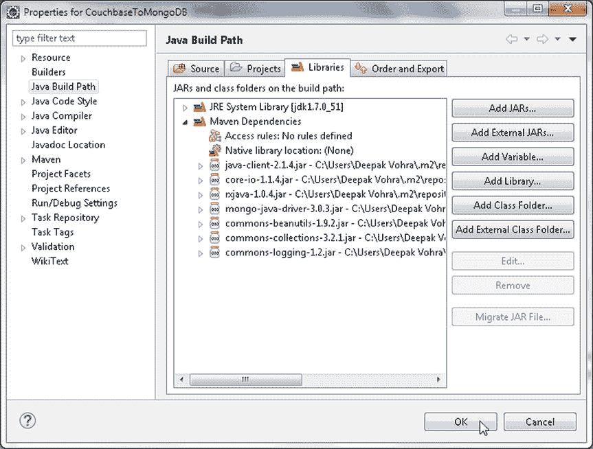
图 7-9。Java 构建路径中的 Jar 文件

### 向 Couchbase 添加文档

`com.couchbase.client.java.CouchbaseCluster` 类是 Couchbase Server 的客户端类，是访问 Couchbase 集群的入口点，该集群可能包含一台或多台服务器。在 `CreateCouchbaseDocument` 应用程序中，我们将使用 `CouchbaseCluster` 类在 Couchbase Server 中创建并存储一个 JSON 文档。`CouchbaseCluster` 类提供了重载的 `create()` 方法来创建 `CouchbaseCluster` 的实例。我们将使用不带任何参数的静态方法 `create()`，该方法用于连接到 localhost 端口 8091 上的默认存储桶。Couchbase Server 将文档存储在数据桶（Data Buckets）中。`Bucket` 接口表示与一个存储桶的连接，用于同步地在该存储桶上执行操作。

1.  创建一个 `CouchbaseCluster` 实例，并随后使用 `openBucket()` 方法连接到默认存储桶。连接到“default”存储桶时，无需指定存储桶名称和密码。
    ```java
    Cluster cluster = CouchbaseCluster.create();
    Bucket defaultBucket = cluster.openBucket();
    ```

`com.couchbase.client.java.document.json.JsonObject` 类表示存储在 Couchbase Server 中的 JSON 对象。文档由 `com.couchbase.client.java.document.Document` 接口表示，并提供了多种类实现，包括 `com.couchbase.client.java.document.JsonDocument`，它从 `com.couchbase.client.java.document.json.JsonObject` 创建文档。`JsonObject` 代表一个 JSON 对象，即存储在 Couchbase 中的 `{a1:v1,a2:v2}` 格式的 JSON。`JsonObject` 类提供了静态方法 `empty()` 和 `create()` 来创建一个空的 `JsonObject` 实例。`JsonObject` 类提供了重载的 put 方法，用于将字段/值对放入 `JsonObject` 实例中。这些方法中的字段名都是 `String` 类型。为值类型 `String`、`int`、`long`、`double`、`boolean`、`JsonObject`、`JsonArray` 和 `Object` 都提供了相应的 `put` 方法。我们将使用 `put(String,String)` 方法向 JSON 文档添加键/值对。

2.  使用 `put(java.lang.String name, java.lang.String value)` 方法为字段 `journal`、`publisher`、`edition`、`title` 和 `author` 创建一个包含其字符串值的 JSON 文档的 `JsonObject` 实例。首先，调用 `empty()` 方法返回一个空的 `JsonObject` 实例，然后调用 `put(java.lang.String name, java.lang.String value)` 方法添加字段/值对。
    ```java
    JsonObject catalogObj = JsonObject.empty()
                .put("journal", "Oracle Magazine")
                .put("publisher", "Oracle Publishing")
                .put("edition", "March April 2013")
                .put("title", "Engineering as a Service")
                .put("author", "David A. Kelly");
    ```

3.  `Bucket` 类提供了多个重载的 `insert` 和 `upsert` 方法来向存储桶添加文档。使用 `JsonDocument.create(java.lang.String id, JsonObject content)` 方法创建一个 `JsonDocument` 实例。


## 创建 Couchbase 文档

1.  使用`insert(D document)`方法向`default`存储桶添加一个`JsonObject`实例。
    ```
    defaultBucket.insert(JsonDocument.create("catalog1", catalogObj));
    ```
2.  同样，向`default`存储桶添加另一个 JSON 文档。
    ```
    catalogObj = JsonObject.empty()
                .put("journal", "Oracle Magazine")
                .put("publisher", "Oracle Publishing")
                .put("edition", "March April 2013")
                .put("title", "Quintessential and Collaborative")
                .put("author", "Tom Haunert");
    defaultBucket.insert(JsonDocument.create("catalog2", catalogObj));
    ```
3.  添加文档后，使用`disconnect()`方法断开与 Couchbase 集群的连接。
    ```
    cluster.disconnect();
    ```

`CreateCouchbaseDocument`类如下所示。
```
package mongodb;
import com.couchbase.client.java.Bucket;
import com.couchbase.client.java.Cluster;
import com.couchbase.client.java.CouchbaseCluster;
import com.couchbase.client.java.document.JsonDocument;
import com.couchbase.client.java.document.json.JsonObject;

public class CreateCouchbaseDocument {
    public static void main(String args[]) {
        Cluster cluster = CouchbaseCluster.create();
        Bucket defaultBucket = cluster.openBucket();
        JsonObject catalogObj = JsonObject.empty()
                .put("journal", "Oracle Magazine")
                .put("publisher", "Oracle Publishing")
                .put("edition", "March April 2013")
                .put("title", "Engineering as a Service")
                .put("author", "David A. Kelly");
        defaultBucket.insert(JsonDocument.create("catalog1", catalogObj));

        catalogObj = JsonObject.empty()
                .put("journal", "Oracle Magazine")
                .put("publisher", "Oracle Publishing")
                .put("edition", "March April 2013")
                .put("title", "Quintessential and Collaborative")
                .put("author", "Tom Haunert");
        defaultBucket.insert(JsonDocument.create("catalog2", catalogObj));
        cluster.disconnect();
    }
}
```

要运行`CreateCouchbaseDocument.java`应用程序，在 Package Explorer 中右键单击该类，选择运行方式  Java 应用程序，如图 7-10 所示。
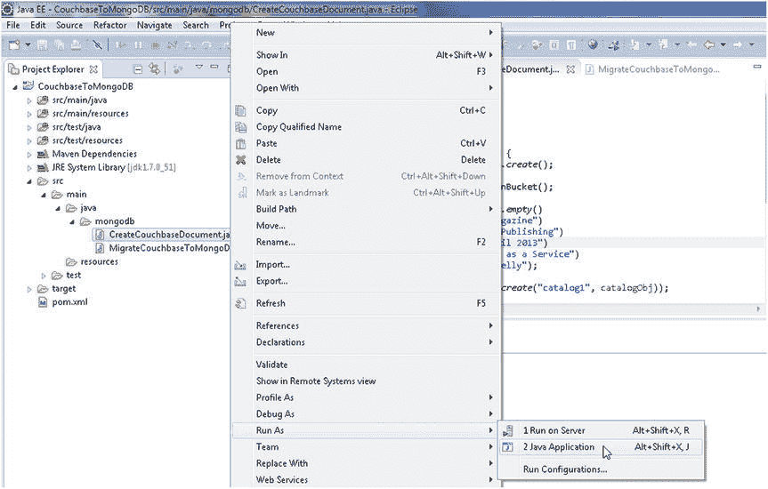
图 7-10. 运行 CreateCouchbaseDocument.java 应用程序

JSON 文档将被存储在 Couchbase 服务器中。如果尚未登录，请登录到 Couchbase Server 管理控制台。单击数据存储桶。“default”存储桶的项目数应显示为 2，如图 7-11 所示。单击文档以列出添加的文档。
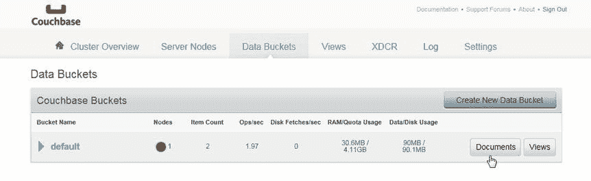
图 7-11. 项目数为 2

7.  添加的两个文档将列出，如图 7-12 所示。单击编辑文档以显示文档的 JSON。
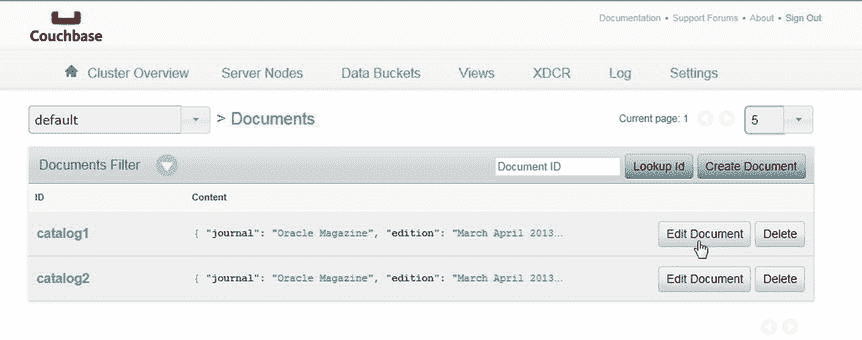
图 7-12. 列出 default 存储桶中的文档

`catalog1` ID 的 JSON 文档将显示，如图 7-13 所示。
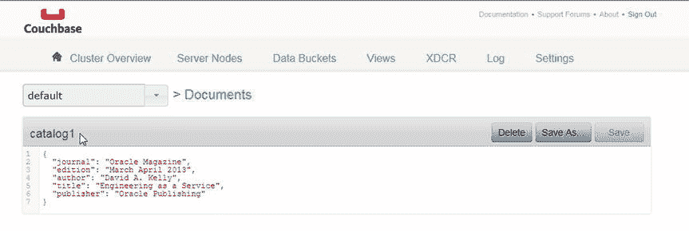
图 7-13. 列出 catalog1 文档 JSON

8.  同样地，列出`catalog2`文档，如图 7-14 所示。
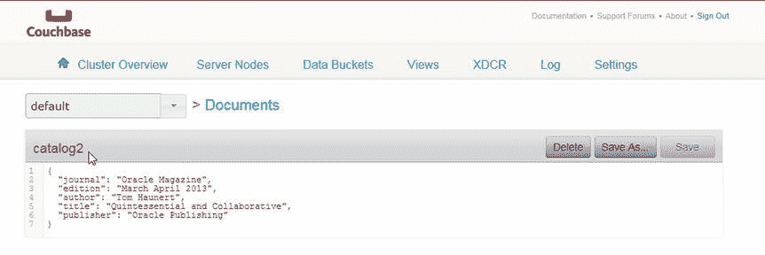
图 7-14. 列出 catalog2 文档 JSON

### 创建 Couchbase 视图

存储在 Couchbase Server 中的 JSON 数据可以使用视图进行索引，视图根据定义的格式和结构在数据上创建索引。视图从 Couchbase Server 中的 JSON 文档对象提取字段，并创建可查询的索引。视图是一个逻辑结构，映射函数将存储在 Couchbase Server 中的 JSON 文档对象的字段映射到视图。

可选地，也可以应用规约函数来汇总（或平均或求和）数据。在本节中，我们在 Couchbase Server 中的 JSON 文档上创建一个视图。映射函数具有以下格式。
```
function(doc, meta) {
  emit(doc.name, [doc.field1, doc.field2]);
}
```

当函数被转换为`map()`函数时，`map()`函数为存储在存储桶中的每个文档提供两个参数：`doc`参数和`meta`参数。`doc`参数是存储在 Couchbase 存储桶中的文档对象，其内容类型可以通过`meta.type`字段识别。`meta`参数是存储在存储桶中的文档对象的元数据。数据存储桶中的每个文档都会提交给`map()`函数。在`map()`函数内，可以指定任何自定义代码。`emit()`函数用于从`map()`函数发出一行或一条数据记录。`emit()`函数接受两个参数：一个键和一个值。
```
emit(key, value)
```

发出的键用于对映射到视图的文档对象字段进行排序和查询。键可以是任何格式，例如字符串、数字、复合结构（如数组）或 JSON 对象。值是要在一行或记录中输出的数据，它可以是任何格式，包括字符串、数字、数组或 JSON。指定以下函数用于从 Couchbase Server 存储桶到视图的映射。该函数首先测试文档的类型是否为 JSON，随后发出记录，每个记录的键是文档名称，每个记录的值是文档对象字段中存储的数据。

接下来，在 Couchbase Console 中创建一个视图。

1.  选择数据存储桶  default 存储桶。随后，选择视图。默认选择开发视图选项卡。
2.  单击创建开发视图以创建开发视图，如图 7-15 所示。
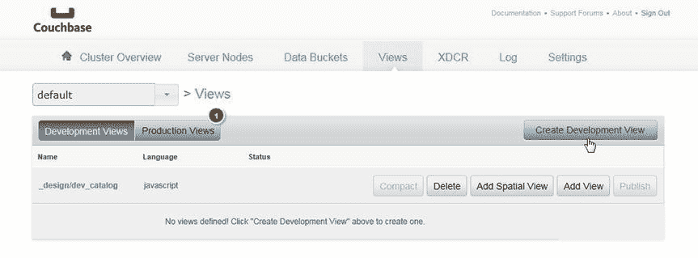
图 7-15. 选择创建开发视图
3.  在创建开发视图对话框中，指定设计文档名称（`_design/dev_catalog`）和视图名称（`catalog_view`），如图 7-16 所示。当使用 Java 客户端以编程方式访问时，设计文档名称中不包含`_design`前缀。单击保存。
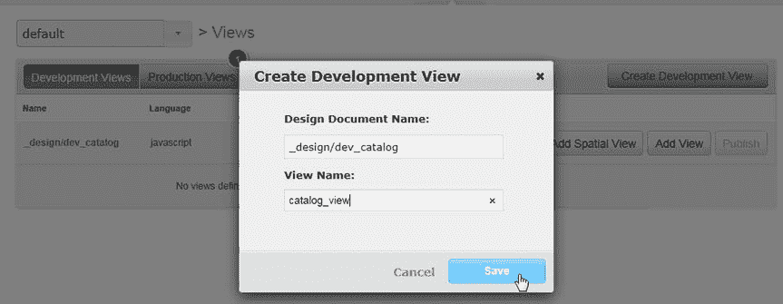
图 7-16. 创建开发视图
将创建一个名为`catalog_view`的开发视图，如图 7-17 所示。
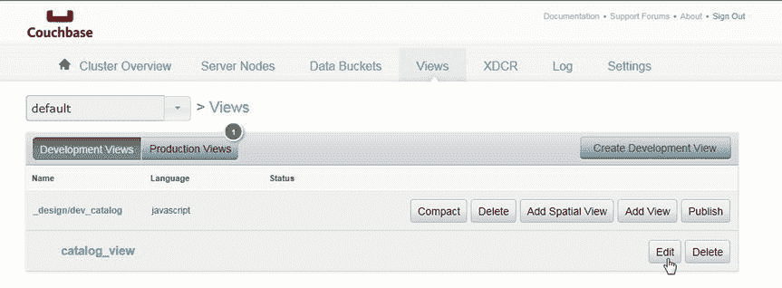
图 7-17. catalog_view 视图
4.  我们需要编辑默认的 Map 函数，以输出包含 journal、publisher、edition、title 和 author 字段键值对的 JSON。单击编辑以编辑视图。
5.  将以下函数复制到视图代码  Map 区域。
```
function(doc,meta) {
  if (meta.type == 'json') {
  emit(doc.name, [doc.journal,doc.publisher,doc.edition,doc.title,doc.author]);
  }
}
```

