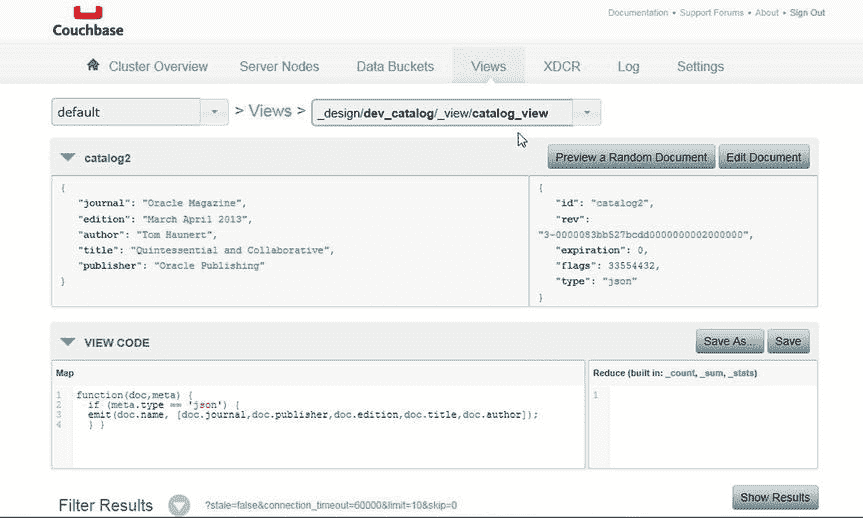
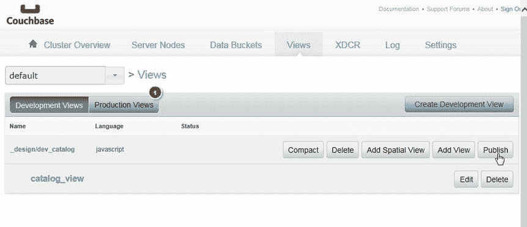
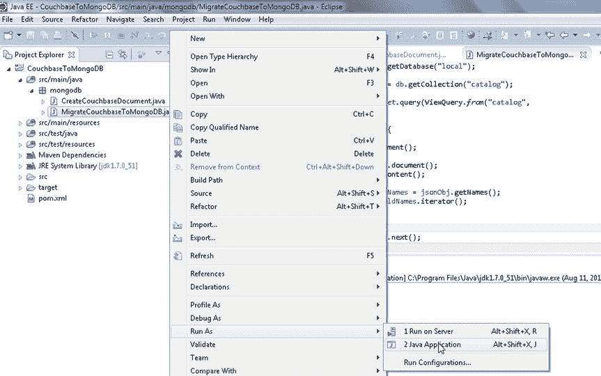
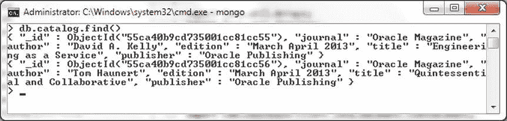

# 保存 Map 函数

6.  点击 **Save** 以保存 Map 函数。包含视图代码的 `catalog_view` 视图如 图 7-18 所示。

    
    图 7-18：`catalog_view` 视图的 Map 函数

7.  我们需要在能够通过 Couchbase Java 客户端访问视图之前，将开发视图转换为生产视图。点击如 图 7-19 所示的 **Publish**，将视图转换为生产视图。

    
    图 7-19：将 `catalog_view` 转换为生产视图

### 将 Couchbase 文档迁移到 MongoDB

在本节中，我们将查询先前存储在 Couchbase Server 中的 JSON 文档，并将其迁移到 MongoDB 数据库。我们将使用 `MigrateCouchbaseToMongoDB` 应用程序将 JSON 文档从 Couchbase Server 迁移到 MongoDB 数据库。我们向 Couchbase Server 添加了一个封装在设计文档中的视图，以便可以使用该视图查询 Couchbase Server。视图由 `com.couchbase.client.java.view.View` 类表示，视图查询由 `com.couchbase.client.java.view.ViewQuery` 类表示，该类提供了 `from(java.lang.String design, java.lang.String view)` 类方法来创建 `ViewQuery` 实例。`Bucket` 类提供了重载的 `query()` 方法来查询视图。每个 `query()` 方法都返回一个 `ViewResult` 实例，该实例表示来自 `ViewQuery` 的结果。我们将使用视图查询为 Couchbase Server 中存储的文档生成 `ViewResult`，然后迭代视图结果以将 JSON 文档迁移到 MongoDB。

1.  在 `MigrateCouchbaseToMongoDB` 应用程序的 `main` 方法中，如前所述创建一个 `Bucket` 实例。

    ```java
    Cluster cluster = CouchbaseCluster.create();
    Bucket defaultBucket = cluster.openBucket();
    ```

2.  同样如 第 1 章 所讨论的，为要迁移到的 `catalog` 集合创建一个 `MongoCollection` 实例。

    ```java
    mongoClient = new MongoClient(Arrays.asList(new ServerAddress("localhost", 27017)));
    MongoDatabase db = mongoClient.getDatabase("local");
    MongoCollection<Document> coll = db.getCollection("catalog");
    ```

3.  创建与 Couchbase Server 和 MongoDB 服务器的连接后，我们将把 Couchbase 文档迁移到 MongoDB。调用 `Bucket` 实例的 `query(ViewQuery query)` 方法以生成 `ViewResult` 对象。使用静态方法 `from(java.lang.String design, java.lang.String view)` 创建 `ViewQuery` 参数，设计文档名称为 `catalog`，视图名称为 `catalog_view`，这些在上一节中已创建。

    ```java
    ViewResult result = defaultBucket.query(ViewQuery.from("catalog", "catalog_view"));
    ```

4.  `ViewResult` 提供了重载的 `rows()` 方法，该方法返回视图结果中行的 `Iterator`。`ViewRow` 接口表示视图行。使用增强的 `for` 循环，迭代 `ViewResult` 中的行并将每一行输出到 MongoDB。

    ```java
    for (ViewRow row : result) {
        // 将每一行迁移到 MongoDB
    }
    ```

5.  MongoDB Java 驱动程序中的文档由 `org.bson.Document` 类表示。为 `ViewResult` 中的每一行创建一个 `Document` 实例。Couchbase Server 驱动程序中的 JSON 文档由 `JsonDocument` 类表示。可以使用 `document()` 方法从 `ViewRow` 实例获取 `JsonDocument` 实例。随后，使用 `content()` 方法从 `JsonDocument` 获取 JSON 对象。

    `JsonObject` 实例具有 JSON 文档的字段/值对。使用 `getNames()` 方法从 `JsonObject` 获取字段名称作为 `Set`。使用 `iterator()` 方法从 `Set` 获取 `Iterator`。使用 `while` 循环迭代字段名称，并将每个字段名称作为 `String` 获取。使用 `JsonObject` 中的 `getString(String fieldName)` 方法获取字段值。使用 `Document` 中的 `append(String key, Object value)` 方法将字段/值对添加到要存储在 MongoDB 中的 BSON 文档。

    ```java
    for (ViewRow viewRow : result) {
        Document catalog = new Document();
        JsonDocument json = viewRow.document();
        JsonObject jsonObj = json.content();
        Set<java.lang.String> fieldNames = jsonObj.getNames();
        Iterator<String> iter = fieldNames.iterator();
        while (iter.hasNext()) {
            String fieldName = iter.next();
            String fieldValue = jsonObj.getString(fieldName);
            catalog = catalog.append(fieldName, fieldValue);
        }
    ```

6.  创建了要存储在 MongoDB 的 `Document` 实例后，调用 `MongoCollection` 实例的 `insertOne(TDocument document)` 方法将 BSON 文档存储在 MongoDB 中。

    ```java
    coll.insertOne(catalog);
    ```

`MigrateCouchbaseToMongoDB` 应用程序如下所列。

```java
package mongodb;

import java.util.Arrays;
import java.util.Iterator;
import java.util.Set;
import org.bson.Document;
import com.couchbase.client.java.Bucket;
import com.couchbase.client.java.Cluster;
import com.couchbase.client.java.CouchbaseCluster;
import com.couchbase.client.java.document.JsonDocument;
import com.couchbase.client.java.document.json.JsonObject;
import com.couchbase.client.java.view.ViewQuery;
import com.couchbase.client.java.view.ViewResult;
import com.couchbase.client.java.view.ViewRow;
import com.mongodb.MongoClient;
import com.mongodb.ServerAddress;
import com.mongodb.client.MongoCollection;
import com.mongodb.client.MongoDatabase;

public class MigrateCouchbaseToMongoDB {
    private static Bucket defaultBucket;
    private static MongoClient mongoClient;
    public static void main(String[] args) {
        Cluster cluster = CouchbaseCluster.create();
        defaultBucket = cluster.openBucket();
        migrate();
    }
    public static void migrate() {
        mongoClient = new MongoClient(Arrays.asList(new ServerAddress(
                "localhost", 27017)));
        MongoDatabase db = mongoClient.getDatabase("local");
        MongoCollection<Document> coll = db.getCollection("catalog");
        ViewResult result = defaultBucket.query(ViewQuery.from("catalog",
                "catalog_view"));
        for (ViewRow viewRow : result) {
            Document catalog = new Document();
            JsonDocument json = viewRow.document();
            JsonObject jsonObj = json.content();
            Set<java.lang.String> fieldNames = jsonObj.getNames();
            Iterator<String> iter = fieldNames.iterator();
            while (iter.hasNext()) {
                String fieldName = iter.next();
                String fieldValue = jsonObj.getString(fieldName);
                catalog = catalog.append(fieldName, fieldValue);
            }
            coll.insertOne(catalog);
        }
    }
}
```

7.  要运行 `MigrateCouchbaseToMongoDB` 应用程序，请在 Package Explorer 中右键单击 `MigrateCouchbaseToMongoDB.java`，然后选择 **Run As**  **Java Application**，如 图 7-20 所示。

    


## 运行迁移应用程序

运行 MigrateCouchbaseToMongoDB 应用程序。

Couchbase Server 文档被迁移到 MongoDB。随后在 Mongo shell 中运行以下命令。
```
>use local
>db.catalog.find()
```

迁移到 MongoDB 的两个 JSON 文档如 图 7-21 所示。


图 7-21. 在 Mongo shell 中列出迁移的文档

## 小结

Couchbase 和 MongoDB 都将文档存储为 JSON 格式，但 MongoDB 在文档处理方面具有一些优势。在本章中，我们将一个 Couchbase 文档迁移到了 MongoDB。首先，我们在 Eclipse IDE 中用 Java 应用程序在 Couchbase 中创建了一个 JSON 文档。随后，我们在另一个 Java 应用程序中将该 Couchbase 文档迁移到了 MongoDB。下一章我们将迁移一个 Oracle Database 表到 MongoDB。

