# 第 8 章


## 迁移 Oracle 数据库

MongoDB 是领先的 NoSQL 数据库。MongoDB 使用 BSON（二进制 JSON）数据格式存储文档，这是最灵活的数据模型，支持创建数据结构的层次结构。Oracle Database 则以固定模式的表格格式存储数据。这两种数据库的模型截然不同：MongoDB 基于文档存储，而 Oracle Database 基于由列和行组成的二维矩阵的固定表格格式。在本章中，我们将把一个 Oracle Database 表迁移到 MongoDB Server。虽然没有直接从 Oracle 迁移到 MongoDB 的迁移工具，但 MongoDB 提供了一个名为 `mongoimport` 的导入工具，用于将 CSV、TSV 或 JSON 文件中的数据导入到 MongoDB 数据库中。我们将首先将 Oracle Database 表导出为 CSV 文件，随后使用 `mongoimport` 工具将 CSV 文件数据导入 MongoDB Server。本章涵盖以下主题。

-   `mongoimport` 工具概述
-   环境设置
-   创建 Oracle Database 表
-   将 Oracle Database 表导出为 CSV 文件
-   从 CSV 文件导入数据到 MongoDB
-   显示 MongoDB 中的 JSON 数据

## mongoimport 工具概述

`mongoimport` 工具用于将数据从文件（CSV、TSV 或 JSON）传输到 MongoDB Server。使用 `mongoimport` 工具的语法如下。
```
mongoimport <options> <file>
```

`mongoimport` 支持的一些选项在 表 8-1 中讨论。

表 8-1. mongoimport 工具支持的选项
| 选项 | 描述 |
| --- | --- |
| `-v , --verbose` | 详细输出选项。多次包含以获取更多详细信息，例如 `-vvv`。 |
| `--quiet` | 不生成命令输出（数据仍会传输）。 |
| `-h, --host` | 要连接的 MongoDB 主机。可包含端口，格式为 `--host host:port`。 |
| `--port` | 要连接的 MongoDB 端口。 |
| `-u, --username` | 认证用户名。 |
| `-p, --password` | 认证密码。 |
| `-d, --db` | 要使用的数据库实例。 |
| `-c, --collection` | 要使用的集合。 |
| `-f, --fields` | 以逗号分隔的字段名。 |
| `--file` | 要从中导入的文件。如果未指定，则使用 `stdin`。可以是 `.csv`、`.json` 或 `.tsv` 文件。 |
| `--headerline` | 使用输入文件中的第一行作为字段列表。 |
| `--jsonArray` | 输入源是 JSON 数组。 |
| `--type` | 要导入的输入格式。值可以是 `json`、`csv` 或 `tsv`。默认为 `json`。 |
| `--drop` | 在插入文档前删除集合。 |
| `--ignoreBlanks` | 忽略 CSV 和 TSV 中值为空的字段。 |
| `--maintainInsertionOrder` | 维护插入顺序。 |
| `--stopOnError` | 在第一次插入/更新错误时停止导入。 |
| `--upsert` | 插入或更新已存在的对象。 |
| `--writeConcern` | 写关注选项。 |
| `--numInsertionWorkers, -j` | 并发运行的插入操作数。 |
| `--fieldFile` | 包含字段名的文件 - 每行一个。 |

## 环境设置

我们需要为本章下载以下软件。

-   Oracle Database 12c。从 `www.oracle.com/technetwork/database/enterprise-edition/downloads/index-092322.html` 下载。
-   MongoDB Server（版本：3.0.5）。
-   `mongoimport` 工具随 MongoDB Server 一起安装，对于 Windows 系统，位于 `C:\Program Files\MongoDB\Server\3.0\bin` 目录中。

提醒一下，在安装和配置 MongoDB Server 时，创建 `c:\data\db` 目录。

## 创建 Oracle Database 表

首先，使用以下 SQL 脚本创建一个 Oracle Database 表 `WLSLOG`。该脚本可以从 SQL*Plus 运行。
```
CREATE TABLE OE.WLSLOG (ID VARCHAR2(255) PRIMARY KEY, TIME_STAMP VARCHAR2(255), CATEGORY VARCHAR2(255), TYPE VARCHAR2(255), SERVERNAME VARCHAR2(255), CODE VARCHAR2(255), MSG VARCHAR2(255));
INSERT INTO OE.WLSLOG (ID, TIME_STAMP, CATEGORY, TYPE, SERVERNAME, CODE, MSG) values ('catalog1','Apr-8-2014-7:06:16-PM-PDT','Notice','WebLogicServer','AdminServer','BEA-000365','Server state changed to STANDBY');
INSERT INTO OE.WLSLOG (ID, TIME_STAMP, CATEGORY, TYPE, SERVERNAME, CODE, MSG) values ('catalog2','Apr-8-2014-7:06:17-PM-PDT','Notice','WebLogicServer','AdminServer','BEA-000365','Server state changed to STARTING');
INSERT INTO OE.WLSLOG (ID,TIME_STAMP, CATEGORY, TYPE, SERVERNAME, CODE, MSG) values ('catalog3','Apr-8-2014-7:06:18-PM-PDT', 'Notice', 'WebLogicServer', 'AdminServer', 'BEA-000365', 'Server state changed to ADMIN');
INSERT INTO OE.WLSLOG (ID,TIME_STAMP, CATEGORY, TYPE, SERVERNAME, CODE, MSG) values ('catalog4','Apr-8-2014-7:06:19-PM-PDT', 'Notice', 'WebLogicServer', 'AdminServer', 'BEA-000365', 'Server state changed to RESUMING');
INSERT INTO OE.WLSLOG (ID,TIME_STAMP, CATEGORY, TYPE, SERVERNAME, CODE, MSG) values ('catalog5','Apr-8-2014-7:06:20-PM-PDT', 'Notice', 'WebLogicServer', 'AdminServer', 'BEA-000361', 'Started WebLogic AdminServer');
INSERT INTO OE.WLSLOG (ID,TIME_STAMP, CATEGORY, TYPE, SERVERNAME, CODE, MSG) values ('catalog6','Apr-8-2014-7:06:21-PM-PDT', 'Notice', 'WebLogicServer', 'AdminServer', 'BEA-000365', 'Server state changed to RUNNING');
INSERT INTO OE.WLSLOG (ID,TIME_STAMP, CATEGORY, TYPE, SERVERNAME, CODE, MSG) values ('catalog7','Apr-8-2014-7:06:22-PM-PDT', 'Notice', 'WebLogicServer', 'AdminServer', 'BEA-000360', 'Server started in RUNNING mode');
```

## 将 Oracle Database 表导出为 CSV 文件

接下来，将 Oracle Database 表导出为 CSV 文件。在 SQL*Plus 中运行以下 SQL 脚本，从 `OE.WLSLOG` 表中选择数据并导出到 `wlslog.csv` 文件。
```
set pagesize 0 linesize 500 trimspool on feedback off echo off
select ID || ',' || TIME_STAMP || ',' || CATEGORY || ',' || TYPE || ',' || SERVERNAME || ',' || CODE || ',' || MSG from OE.WLSLOG;
spool wlslog.csv
/
spool off
```

如 图 8-1 所示运行 SQL 脚本，数据将被导出到 `wlslog.csv` 文件。

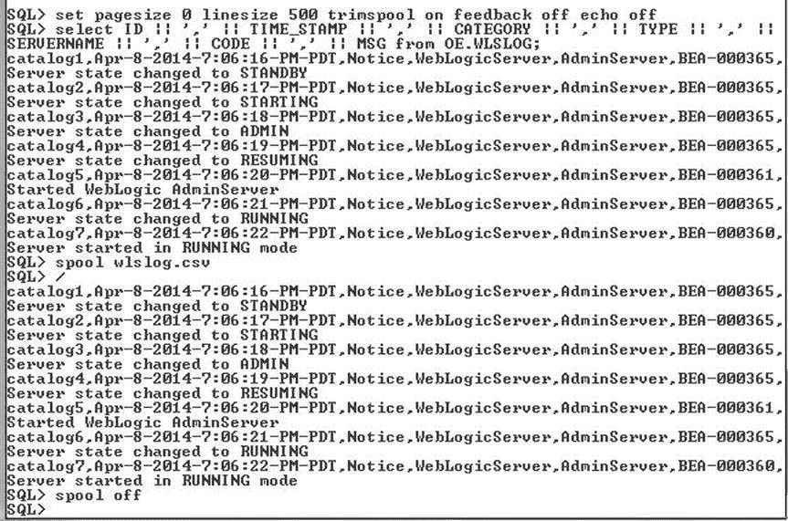
图 8-1. 将 Oracle Database 表导出为 CSV 文件

从导出的输出中移除开头的 `SQL> /` 和结尾的 `SQL> spool off`，然后将其保存为 `wlslog.csv` 文件。需要移除这些首尾行，因为 `mongoimport` 工具的输入应该是一个 CSV 文件。


### 从 CSV 文件导入数据到 MongoDB

```catalog1,Apr-8-2014-7:06:16-PM-PDT,Notice,WebLogicServer,AdminServer,BEA-000365,Server state changed to STANDBY catalog2,Apr-8-2014-7:06:17-PM-PDT,Notice,WebLogicServer,AdminServer,BEA-000365,Server state changed to STARTING catalog3,Apr-8-2014-7:06:18-PM-PDT,Notice,WebLogicServer,AdminServer,BEA-000365,Server state changed to ADMIN catalog4,Apr-8-2014-7:06:19-PM-PDT,Notice,WebLogicServer,AdminServer,BEA-000365,Server state changed to RESUMING catalog5,Apr-8-2014-7:06:20-PM-PDT,Notice,WebLogicServer,AdminServer,BEA-000361,Started WebLogic AdminServer catalog6,Apr-8-2014-7:06:21-PM-PDT,Notice,WebLogicServer,AdminServer,BEA-000365,Server state changed to RUNNING catalog7,Apr-8-2014-7:06:22-PM-PDT,Notice,WebLogicServer,AdminServer,BEA-000360,Server started in RUNNING mode```

在本节中，我们将使用 `mongoimport` 工具将数据从 `wlslog.csv` 文件传输到 MongoDB 服务器。

1.  使用以下命令启动 MongoDB 服务器。

    ```
    >mongod
    ```

    MongoDB 在 `localhost` 的 `27017` 端口上启动，如 图 8-2 所示。

    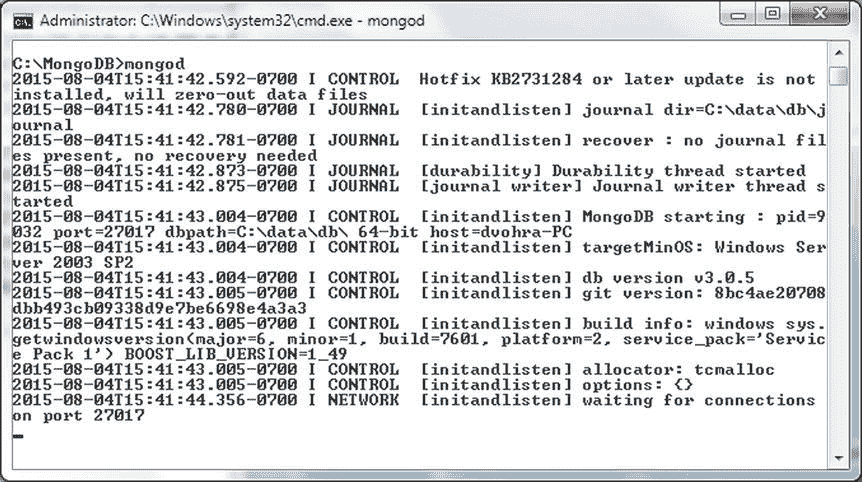
    图 8-2. 启动 MongoDB 服务器

2.  运行 `mongoimport` 工具，将数据从 `wlslog.csv` 文件传输到 MongoDB 服务器。命令选项列于 表 8-2。

    表 8-2. `mongoimort` 工具命令所使用的命令参数

    | 选项 | 值 | 描述 |
    | --- | --- | --- |
    | `--db` | `wls` | MongoDB 数据库实例。该数据库无需在运行 `mongoimport` 工具之前创建，会在导入工具运行时自动创建。 |
    | `--collection` | `wlslog` | 集合名称。该集合同样无需在运行导入工具之前创建。 |
    | `--type` | `csv` | 输入数据的类型是 CSV。 |
    | `--fields` | `ID`,`TIME_STAMP`,`CATEGORY`,`TYPE`,`SERVERNAME`,`CODE`,`MSG` | 输入字段。 |
    | `--file` | `wlslog.csv` | 输入文件。 |

3.  运行以下 `mongoimport` 命令。

    ```
    mongoimport --db wls --collection wlslog --type csv --fields ID,TIME_STAMP,CATEGORY,TYPE,SERVERNAME,CODE,MSG --file wlslog.csv
    ```

    如输出所示，数据从 `wlslog.csv` 文件传输到了 MongoDB 服务器，如 图 8-3 所示。针对 7 行输入数据，在 MongoDB 服务器中创建了 7 个文档。

    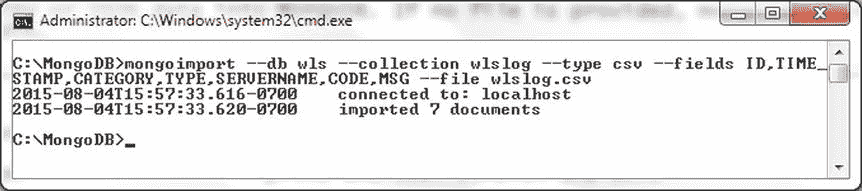
    图 8-3. 运行 `mongoimport` 工具命令

# 在 MongoDB 中显示 JSON 数据

以下步骤向您展示如何显示 JSON 数据：

1.  使用以下命令启动 Mongo shell。

    ```
    >mongo
    ```

2.  要使用 `wls` 数据库，请运行以下 Mongo shell 命令。

    ```
    >use wls
    ```

3.  要列出集合，请运行以下 Mongo shell 命令。

    ```
    >show collections
    ```

4.  要输出文档计数，请运行以下 Mongo shell 命令。

    ```
    >db.wlslog.count()
    ```

    上述命令的输出如 图 8-4 所示。

    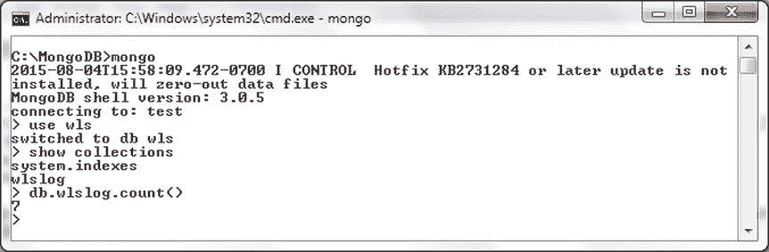
    图 8-4. 文档计数为 7

5.  要列出导入到 MongoDB 服务器的文档，请运行以下 Mongo shell 命令。

    ```
    >db.wlslog.find()
    ```

    导入到 MongoDB 服务器的文档被列出，如 图 8-5 所示。

    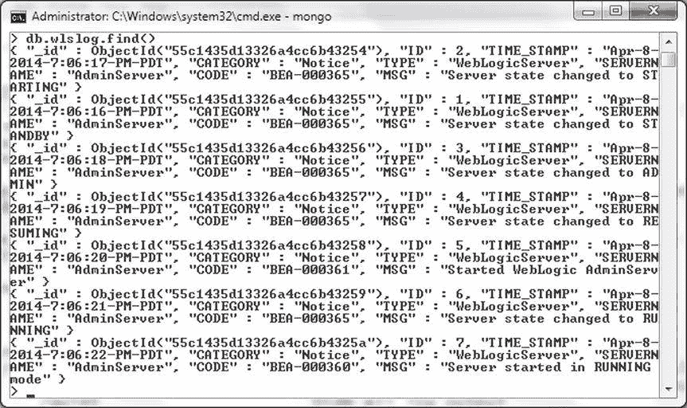
    图 8-5. 传输到 MongoDB 服务器的 7 个文档

# 总结

在本章中，我们将 Oracle 数据库表数据传输到了 MongoDB 服务器。首先，我们创建了一个 Oracle 数据库表。由于没有直接的数据传输工具，我们首先将 Oracle 数据库表导出为 CSV 文件。随后，使用 MongoDB 的 `mongoimport` 工具将 CSV 文件数据传输到 MongoDB 服务器。在下一章中，我们将使用 Kundera，一个符合 JPA 2.0 标准的对象-数据存储映射库，用于 NoSQL 数据存储。

# 第 9 章

## 将 Kundera 与 MongoDB 一起使用

Java 持久化 API (JPA) 是用于在 Java EE/Java SE 环境中进行持久化管理和对象/关系映射的 Java API，它使用 Java 领域模型来管理关系数据库。JPA 还通过 Query 接口提供了查询语言 API，用于静态和动态查询。JPA 主要为关系数据库设计，而 Kundera 是一个符合 JPA 2.0 标准的对象-数据存储映射库，用于 NoSQL 数据存储。Kundera 也支持关系数据库，并为 MongoDB 和其他一些 NoSQL 数据库（如 Apache Cassandra 和 HBase）提供特定的 NoSQL 数据存储配置。在领域模型中使用 `kundera-mongo` 库，即可通过 JPA 访问 MongoDB。在本章中，我们将使用 `kundera-mongo` 模块访问 MongoDB，并在 MongoDB 上运行 CRUD（创建、读取、更新、删除）操作，涵盖以下主题：

*   设置环境
*   创建 MongoDB 集合
*   在 Eclipse 中创建 Maven 项目
*   创建 JPA 实体类
*   在 `persistence.xml` 配置文件中配置 JPA
*   创建 JPA 客户端类
*   运行 JPA CRUD 操作
*   Kundera-Mongo JPA 客户端类
*   安装 Maven 项目
*   运行 Kundera-Mongo JPA 客户端类
*   调用 `KunderaClient` 方法

## 设置环境

本章我们将需要以下软件。

*   从 `www.eclipse.org/downloads/` 下载适用于 Java EE 开发者的 Eclipse IDE。
*   从 `www.mongodb.org/dl/win32/x86_64` 下载 MongoDB 3.0.2（或更高版本）Windows 二进制文件 `mongodb-win32-x86_64-3.0.2-signed.msi`。双击 `mongodb-win32-x86_64-3.0.2-signed` 文件以安装 MongoDB 3.0.2。将 `bin` 目录（例如 `C:\Program Files\MongoDB\Server\3.0\bin`）添加到 `PATH` 环境变量中。
*   从 `www.oracle.com/technetwork/java/javase/downloads/jdk7-downloads-1880260.html` 下载 Java 7。

Kundera 支持的 MongoDB 版本是 `2.6.3+` 和 `3.0.2`。如果之前没有为前面的章节创建过，请为 MongoDB 数据创建一个目录 `C:\data\db`。从命令 shell 使用以下命令启动 MongoDB。

```
>mongod
```

MongoDB 启动，等待在 `localhost:27017` 上的连接。

### 创建 MongoDB 集合

我们需要创建一个 MongoDB 集合来存储文档。使用 `mongo` 命令启动 Mongo shell。

```
>mongo
```

在 Mongo shell 中使用以下命令创建一个名为 `catalog` 的集合。第一条命令将数据库设置为 `local`。第二条命令删除 `catalog` 集合。

```
>use local
>db.catalog.drop()
>db.createCollection("catalog")
```

`catalog` 集合被创建，如 图 9-1 所示。

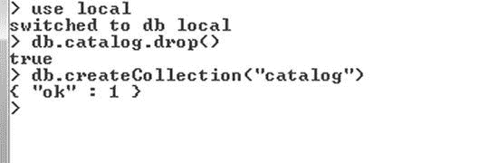
图 9-1. 创建 MongoDB 集合

### 在 Eclipse 中创建 Maven 项目

`kundera-mongo` 库可作为 Maven 依赖项使用。我们将使用一个 Maven 项目，通过 `kundera-mongo` 库访问 MongoDB，为此需要在 Eclipse IDE 中创建一个 Maven 项目。

1.  在 Eclipse IDE 中选择 文件  新建  其他。
2.  在“新建”窗口中选择 Maven  Maven 项目，如 图 9-2 所示。单击 下一步。

     **新建**  **Maven 项目**，如图 9-2 所示。
    
    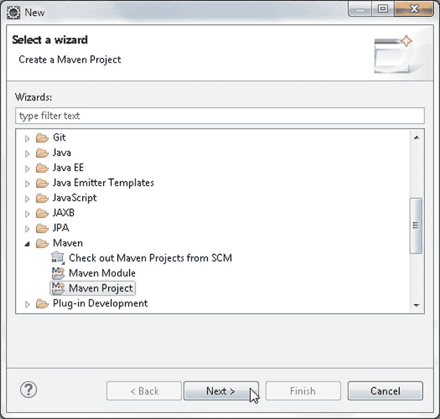 图 9-2. 选择 Maven  Maven Project

2.  在 **新建 Maven 项目** 向导中，选中 **创建一个简单的项目** 复选框。同时选中 **使用默认的工作空间位置** 复选框，如图 9-3 所示。点击 **下一步**。

    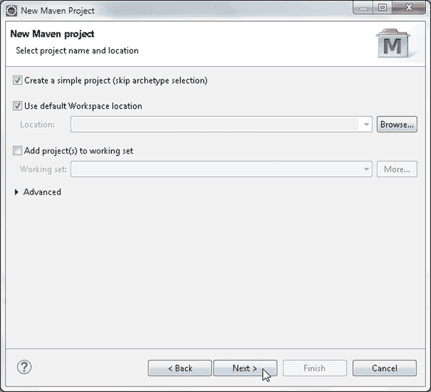 图 9-3. 新建 Maven 项目向导

3.  在 **新建 Maven** 向导的 **配置项目** 窗口中，选择以下值并点击 **完成**，如图 9-4 所示。
    *   Group Id: `com.kundera.mongodb`
    *   Artifact Id: `KunderaMongoDB`
    *   Version: `1.0.0`
    *   Packaging: `jar`
    *   Name: `KunderaMongoDB`

    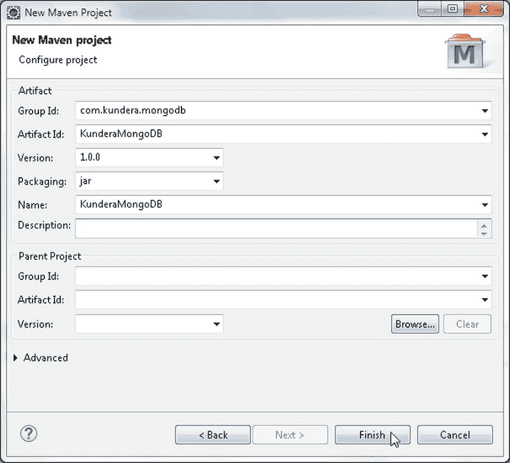 图 9-4. 配置 Maven 项目

    一个用于 Kundera Mongo 的 Maven 项目已创建，如包资源管理器中的图 9-5 所示。

    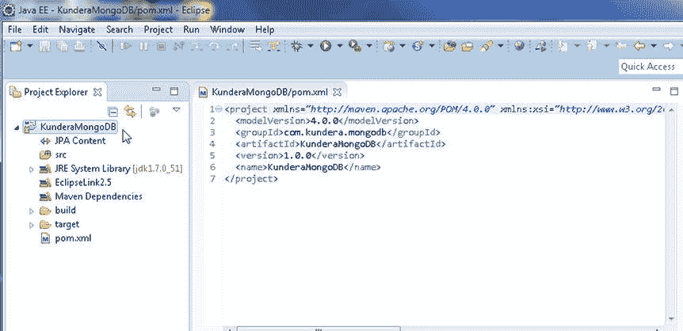 图 9-5. Maven 项目 KunderaMongoDB

4.  接下来，修改 `pom.xml` 以添加 `kundera-mongo` 库和 EclipseLink 的依赖。由于我们将使用 JPA，因此需要 EclipseLink。

    ```xml
    <dependencies>
        <dependency>
            <groupId>com.impetus.client</groupId>
            <artifactId>kundera-mongo</artifactId>
            <version>2.9</version>
        </dependency>
        <dependency>
            <groupId>org.eclipse.persistence</groupId>
            <artifactId>eclipselink</artifactId>
            <version>2.6.0</version>
        </dependency>
    </dependencies>
    ```

5.  在构建配置中，指定 `maven-compiler-plugin` 插件来编译 Maven 项目，以及 `exec-maven-plugin` 插件来运行 Maven 客户端类。对于 `exec-maven-plugin` 插件，在 `<configuration/>` 中指定要运行的主类为 Kundera `Client` 类 `kundera.KunderaClient`，我们将在本章后面创建它。

    ```xml
    <build>
        <plugins>
            <plugin>
                <artifactId>maven-compiler-plugin</artifactId>
                <configuration>
                    <source>1.7</source>
                    <target>1.7</target>
                </configuration>
            </plugin>
            <plugin>
                <groupId>org.codehaus.mojo</groupId>
                <artifactId>exec-maven-plugin</artifactId>
                <version>1.2.1</version>
                <configuration>
                    <mainClass>kundera.KunderaClient</mainClass>
                </configuration>
            </plugin>
        </plugins>
    </build>
    ```

    完整的 `pom.xml` 文件如下：

    ```xml
    <project xmlns="http://maven.apache.org/POM/4.0.0" xmlns:xsi="http://www.w3.org/2001/XMLSchema-instance"
        xsi:schemaLocation="http://maven.apache.org/POM/4.0.0 http://maven.apache.org/xsd/maven-4.0.0.xsd">
        <modelVersion>4.0.0</modelVersion>
        <groupId>com.kundera.mongodb</groupId>
        <artifactId>KunderaMongoDB</artifactId>
        <version>1.0.0</version>
        <name>KunderaMongoDB</name>
        <dependencies>
            <dependency>
                <groupId>com.impetus.client</groupId>
                <artifactId>kundera-mongo</artifactId>
                <version>2.9</version>
            </dependency>
            <dependency>
                <groupId>org.eclipse.persistence</groupId>
                <artifactId>eclipselink</artifactId>
                <version>2.6.0</version>
            </dependency>
        </dependencies>
        <build>
            <plugins>
                <plugin>
                    <artifactId>maven-compiler-plugin</artifactId>
                    <configuration>
                        <source>1.7</source>
                        <target>1.7</target>
                    </configuration>
                </plugin>
                <plugin>
                    <groupId>org.codehaus.mojo</groupId>
                    <artifactId>exec-maven-plugin</artifactId>
                    <version>1.2.1</version>
                    <configuration>
                        <mainClass>kundera.KunderaClient</mainClass>
                    </configuration>
                </plugin>
            </plugins>
        </build>
    </project>
    ```

### 创建 JPA 实体类

JPA 对象/关系映射应用程序的领域模型在 JPA 实体类中定义。该领域模型类只是一个*普通的 Java 对象*（POJO），它描述了要持久化的 Java 对象实体、对象属性以及要持久化到的 MongoDB 数据库和集合。在本节中，我们将使用 Kundera 和 MongoDB 数据库创建一个用于对象/关系映射的 JPA 实体类。尽管 MongoDB 不是关系型数据库，但可以使用支持某些 NoSQL 数据库的 Kundera 库与之进行对象/关系映射。

1.  选择 **文件**  **新建**  **其他**。
2.  在 **新建** 窗口中，选择 **Java**  **类** 并点击 **下一步**，如图 9-6 所示。
    
    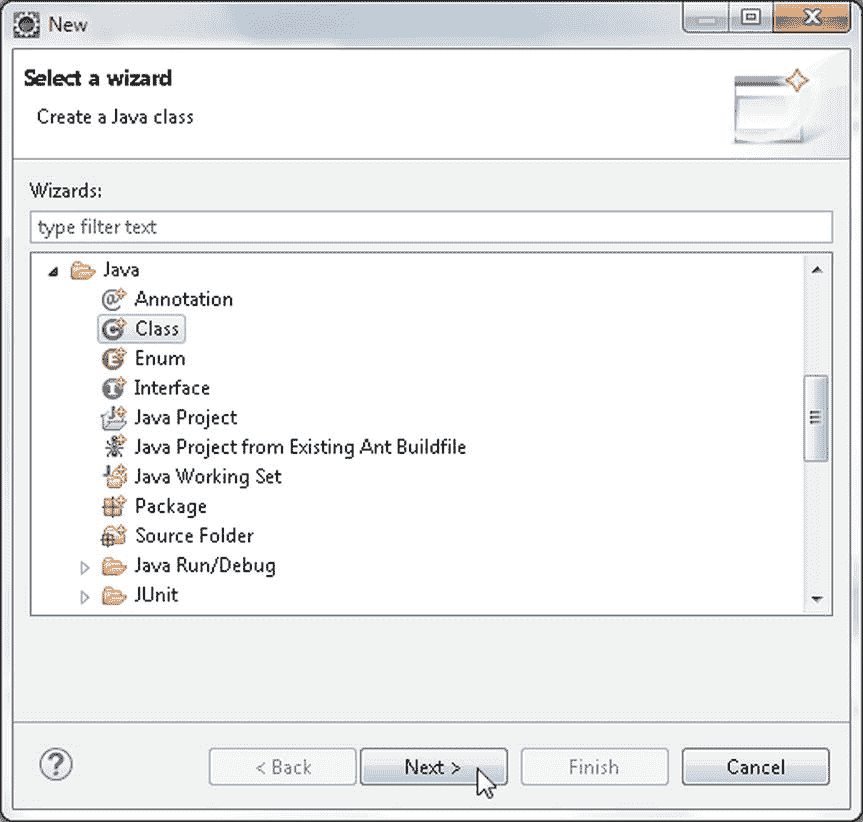 图 9-6. 选择 Java  Class

3.  在 **新建 Java 类** 向导中分配以下值，如图 9-7 所示。点击 **完成**。
    *   源文件夹: `KunderaMongoDB/src/main/java`
    *   包: `kundera`
    *   名称: `Catalog`

    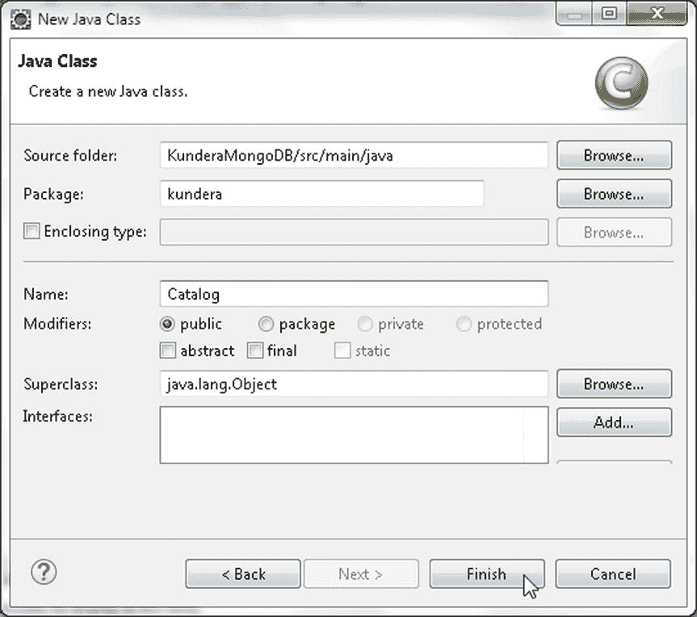 图 9-7. 创建实体类 Catalog

    Java 类 `kundera.Catalog` 被添加到 Maven 项目中，如图 9-8 所示。

    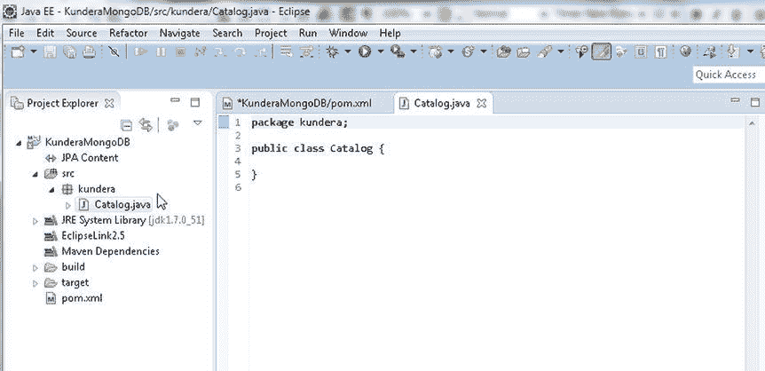 图 9-8. 实体类 Catalog

4.  使用 `@Entity` 注解标注 `Catalog` 类，以表明该类是一个 JPA 实体类。默认情况下，实体名称与实体类名相同。使用 `@Table` 注解标注类以指示 MongoDB 集合名称和模式。表名是集合名 `catalog`。模式采用 `database@persistence-unit` 格式。对于 `local` 数据库和我们将在下一节配置的 `kundera` 持久性单元名称，模式是 `local@kundera`。

    ```java
    @Entity
    @Table(name = "catalog", schema = "local@kundera")
    ```

5.  实体类实现 `Serializable` 接口，以便在持久化到数据库时序列化启用缓存的实体 bean。要将版本号与序列化类关联，需指定一个 `serialVersionUID` 变量。

    ```java
    private static final long serialVersionUID = 1L;
    ```

6.  使用 `@Id` 注解标注 `catalogId` 字段，以表明该字段是实体的主键。使用 `@Column` 注解指定文档字段 `_id` 作为主键列。

    ```java
    @Id
    @Column(name = "_id")
    private String catalogId;
    ```
    被 `@Id` 注解的字段必须是以下类型之一：Java 基本类型（如 `int`，`double`）、任何基本包装类型（如 `Integer`，`Double`）、`String`、`java.util.Date`、`java.sql.Date`、`java.math.BigDecimal` 或 `java.math.BigInteger`。

7.


### 为实体类添加字段与注解

为实体类添加 `journal`、`publisher`、`edition`、`title` 和 `author` 字段，并使用 `@Column` 注解来指定字段与文档列的映射关系。

```java
@Column(name = "journal")
private String journal;

@Column(name = "publisher")
private String publisher;

@Column(name = "edition")
private String edition;

@Column(name = "title")
private String title;

@Column(name = "author")
private String author;
```

8.  为每个字段添加对应的 `get`/`set` 访问器方法。完整的 JPA `Entity` 类如下所示。

```java
package kundera;

import java.io.Serializable;
import javax.persistence.*;

/**
 * Entity implementation class for Entity: Catalog
 *
 */
@Entity
@Table(name = "catalog", schema = "local@kundera")
public class Catalog implements Serializable {

    private static final long serialVersionUID = 1L;

    @Id
    @Column(name = "_id")
    private String catalogId;

    public Catalog() {
        super();
    }

    @Column(name = "journal")
    private String journal;

    @Column(name = "publisher")
    private String publisher;

    @Column(name = "edition")
    private String edition;

    @Column(name = "title")
    private String title;

    @Column(name = "author")
    private String author;

    public String getCatalogId() {
        return catalogId;
    }

    public void setCatalogId(String catalogId) {
        this.catalogId = catalogId;
    }

    public String getJournal() {
        return journal;
    }

    public void setJournal(String journal) {
        this.journal = journal;
    }

    public String getPublisher() {
        return publisher;
    }

    public void setPublisher(String publisher) {
        this.publisher = publisher;
    }

    public String getEdition() {
        return edition;
    }

    public void setEdition(String edition) {
        this.edition = edition;
    }

    public String getTitle() {
        return title;
    }

    public void setTitle(String title) {
        this.title = title;
    }

    public String getAuthor() {
        return author;
    }

    public void setAuthor(String author) {
        this.author = author;
    }
}
```

### 在 persistence.xml 配置文件中配置 JPA

在本节中，我们将在 Maven 项目的 `src/main/resources` 文件夹下创建一个 `META-INF/persistence.xml` 配置文件。我们将在 `persistence.xml` 配置文件中配置对象/关系映射。Kundera 支持一些通过 `<property/>` 标签在 `persistence.xml` 中指定的属性，这些属性对所有支持的 NoSQL 数据存储都是通用的。这些通用属性在 表 9-1 中讨论。

**表 9-1**. Kundera 持久化配置属性

| 属性 | 描述 | 必需/可选 |
| :--- | :--- | :--- |
| `kundera.nodes` | NoSQL 服务器运行的节点。 | 必需 |
| `kundera.port` | NoSQL 数据库端口。 | 必需 |
| `kundera.keyspace` | NoSQL 数据库键空间。 | 必需 |
| `kundera.dialect` | NoSQL 数据库方言，用于确定持久化提供者。有效值：`cassandra`、`mongodb` 和 `hbase`。 | 必需 |
| `kundera.client.lookup.class` | 用于低级别数据存储操作的 NoSQL 数据库特定客户端类。 | 必需 |
| `kundera.cache.provider.class` | L2 缓存实现类。 | 必需 |
| `kundera.cache.config.resource` | 包含 L2 缓存实现的文件。 | 必需 |
| `kundera.ddl.auto.prepare` | 指定自动生成所有实体的模式和表的选项。有效选项：`create`：如果存在则删除，并基于实体定义创建模式/表。`create-drop`：与 `create` 相同，并在操作结束后删除模式。`update`：基于实体定义更新模式/表。`validate`：基于实体定义验证模式/表，如果验证失败则抛出 `SchemaGenerationException`。 | 可选 |
| `kundera.pool.size.max.active` | 每个节点由池管理的对象实例数量的上限。 | 可选 |
| `kundera.pool.size.max.idle` | 池中空闲对象实例数量的上限。 | 可选 |
| `kundera.pool.size.min.idle` | 池中空闲对象实例的最小数量。 | 可选 |
| `kundera.pool.size.max.total` | 所有节点合并的池中对象实例总数的上限。 | 可选 |
| `index.home.dir` | 如果选择 Lucene 索引而不是内置的二级索引，此属性指定存储 Lucene 索引的目录路径。 | 可选 |
| `kundera.client.property` | NoSQL 数据库特定配置文件的名称，该文件必须在类路径中。 | 可选 |
| `kundera.batch.size` | 批量插入/更新的批处理大小（整数）。 | 可选 |
| `kundera.username` | 用于认证 Cassandra 和 MongoDB 的用户名。 | 可选 |
| `kundera.password` | 用于认证 Cassandra 和 MongoDB 的密码。 | 可选 |

9.  在 Maven 项目的 `persistence.xml` 文件中，将持久化单元名称指定为 `kundera`。
10. 添加一个 `<provider/>` 元素，其值设置为 `com.impetus.kundera.KunderaPersistence`。
11. 在 `<class/>` 元素中将 JPA 实体类指定为 `kundera.Catalog`。
12. 在 `<properties/>` 标签内作为子元素添加 `<property/>` 标签。添加 表 9-2 中讨论的属性。

**表 9-2**. 已配置的 Kundera 持久化属性

| 属性 | 描述 | 值 |
| :--- | :--- | :--- |
| `kundera.nodes` | MongoDB 主机名。 | `localhost` 或 `127.0.0.1` |
| `kundera.port` | MongoDB 端口。 | `27017` |
| `kundera.keyspace` | MongoDB 数据库。 | `local` |
| `kundera.dialect` | Kundera 方言。Kundera 使用它来确定持久化提供者实现。 | `mongodb` |
| `kundera.ddl.auto.prepare` | Kundera 使用它自动在持久化单元中生成模式和实体。 | `create` |
| `kundera.client.lookup.class` | Kundera 使用它来查找用于在 MongoDB 上执行操作的低级别方言类。 | `com.impetus.client.mongodb.MongoDBClientFactory` |
| `kundera.annotations.scan.package` | 要扫描 JPA 实体的包。 | `kundera` |

`persistence.xml` 配置文件如下所示。

```xml
<?xml version="1.0" encoding="UTF-8"?>
<persistence version="2.1"
    xmlns="http://xmlns.jcp.org/xml/ns/persistence" xmlns:xsi="http://www.w3.org/2001/XMLSchema-instance"
    xsi:schemaLocation="http://xmlns.jcp.org/xml/ns/persistence http://xmlns.jcp.org/xml/ns/persistence/persistence_2_1.xsd">
    <persistence-unit name="kundera">
        <provider>com.impetus.kundera.KunderaPersistence</provider>
        <class>kundera.Catalog</class>
        <properties>
            <property name="kundera.nodes" value="127.0.0.1" />
            <property name="kundera.port" value="27017" />
            <property name="kundera.keyspace" value="local" />
            <property name="kundera.dialect" value="mongodb" />
            <property name="kundera.ddl.auto.prepare" value="create" />
            <property name="kundera.client.lookup.class"
                value="com.impetus.client.mongodb.MongoDBClientFactory" />
            <property name="kundera.annotations.scan.package" value="kundera" />
        </properties>
    </persistence-unit>
</persistence>
```

一些 NoSQL 数据库特定的属性也可以在单独的 XML 配置文件中指定。


# MongoDB 特定属性配置

表 9-3 展示了支持的以下 MongoDB 特定属性。

**表 9-3. MongoDB 特定配置属性**

| 属性 | 描述 |
| --- | --- |
| `read.preference` | 读取偏好。应从主节点还是从节点读取数据。 |
| `socket.timeout` | 套接字超时是 Kundera 在连接 MongoDB 超时前等待的时间段（以毫秒为单位）。 |

例如，要配置 MongoDB 特定属性，请在 `persistence.xml` 中的 MongoDB 特定配置文件中添加以下属性。

```
<property name="kundera.client.property" value="kundera-mongo.xml" />
```

MongoDB 特定配置文件的名称是 `kundera-mongo.xml`。以下是一个示例 MongoDB 特定配置文件。

```
<?xml version="1.0" encoding="UTF-8"?>
<clientProperties>
    <datastores>
        <dataStore>
        <name>mongo</name>
        <connection>
            <properties>
                <property name="read.preference" value="secondary"></property>
            <property name="socket.timeout" value="50000"></property>
            </properties>
            <servers>
                <server>
                <host>192.160.140.160</host>
                <port>27017</port>
            </server>
                <server>
                <host>192.161.141.161</host>
                <port>27018</port>
            </server>
            </servers>
        </connection>
        </dataStore>
    </datastores>
</clientProperties>
```

我们尚未使用任何 MongoDB 特定的配置文件。

接下来，在 `src/main/resources/META-INF/` 文件夹中创建 `persistence.xml` 配置文件。新建 Maven 项目时，`META-INF` 文件夹不会自动创建。要添加 `META-INF` 文件夹，请右键单击资源文件夹，选择 **新建 > 文件夹**，如 图 9-9 所示。

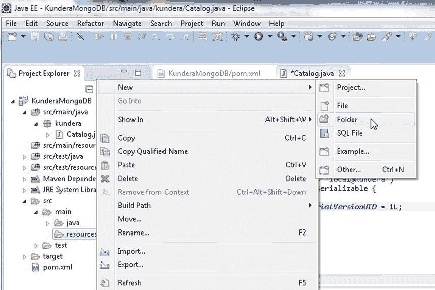

图 9-9. 在资源文件夹中创建新文件夹

在 **新建文件夹** 向导中，选择 `src/main/resources` 文件夹，将文件夹名称指定为 `META-INF`，然后单击 **完成**，如 图 9-10 所示。

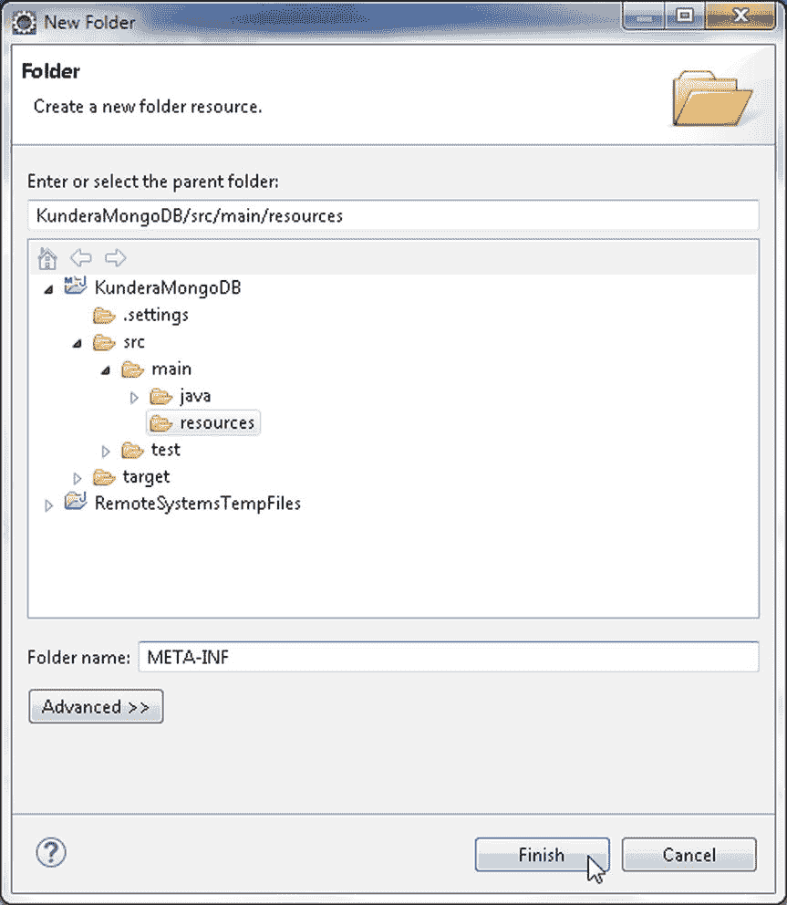

图 9-10. 创建 META-INF 文件夹

`META-INF` 文件夹已创建。接下来，将 `persistence.xml` 文件添加到 `META-INF` 文件夹。

1.  要创建 `persistence.xml` 文件，请选择 **文件 > 新建 > 其他**。
2.  在 **新建** 窗口中，选择 **XML > XML 文件** 并单击 **下一步**，如 图 9-11 所示。
    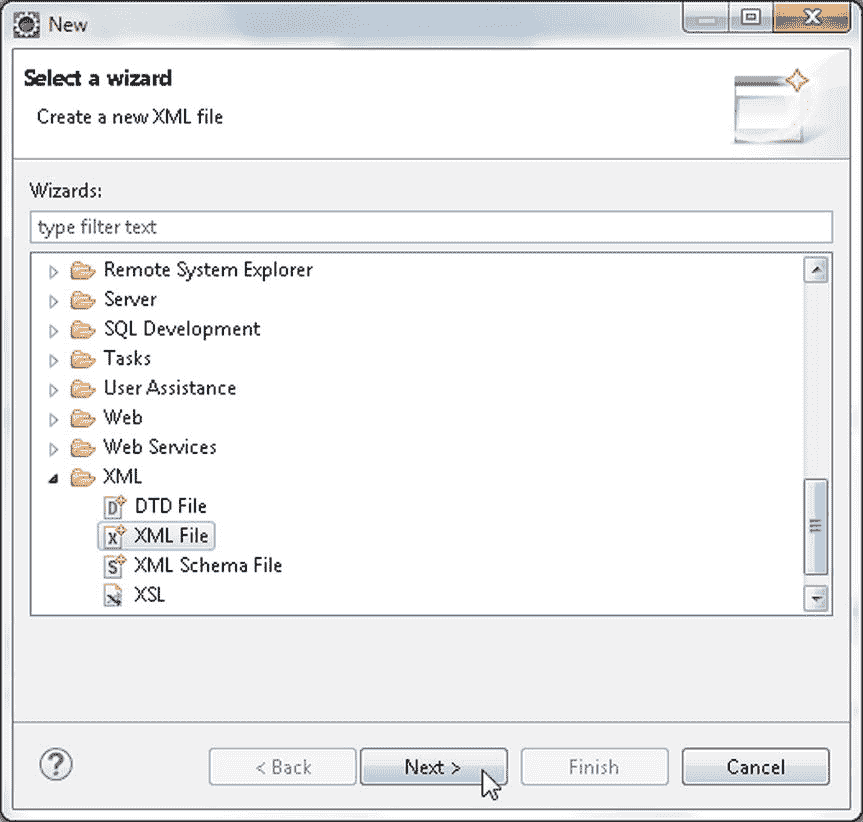
    图 9-11. 创建 XML 文件
3.  在 **新建 XML 文件** 向导中，选择 `META-INF` 文件夹并将文件名指定为 `persistence.xml`，如 图 9-12 所示。单击 **完成**。
    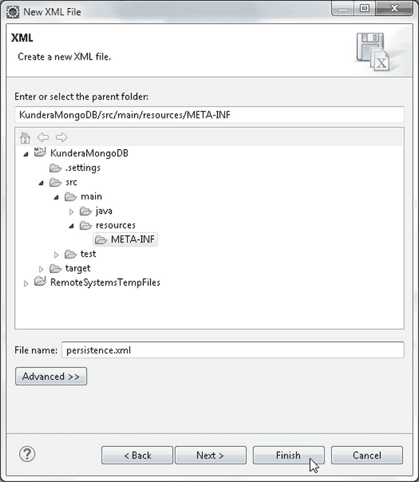
    图 9-12. 创建 persistence.xml
    `persistence.xml` 文件已添加到 `META-INF` 文件夹。
4.  将前面列出的 `persistence.xml` 文件内容复制到 Maven 项目中的 `persistence.xml` 文件，如 图 9-13 所示。
    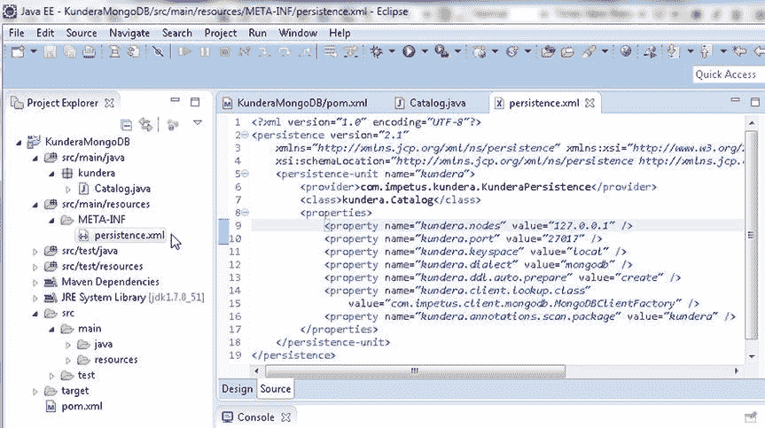
    图 9-13. 持久化配置文件 persistence.xml

### 创建 JPA 客户端类

我们已经配置了一个 JPA 项目用于对象/关系映射到 MongoDB 数据库。接下来，我们将使用 JPA API 运行一些 CRUD 操作。但是，首先我们需要为 CRUD 操作创建一个客户端类。我们将使用一个 Java 类作为客户端类。

1.  选择 **文件 > 新建 > 其他**。
2.  在 **新建** 窗口中，选择 **Java > 类** 并单击 **下一步**。
3.  在 **新建 Java 类** 向导中，指定一个包 (`kundera`) 和一个类名 (`KunderaClient`)，如 图 9-14 所示。选择为类添加 `main` 方法的方法存根，然后单击 **完成**。
    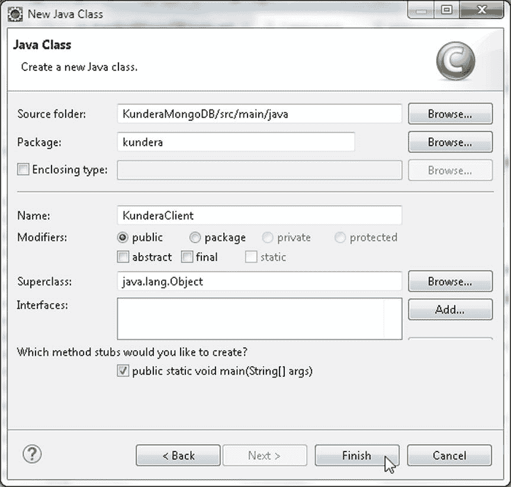
    图 9-14. 创建客户端类 KunderaClient
    `kundera.KunderaClient` 类已添加到 `KunderaMongoDB` Maven 项目中，如 图 9-15 所示。
    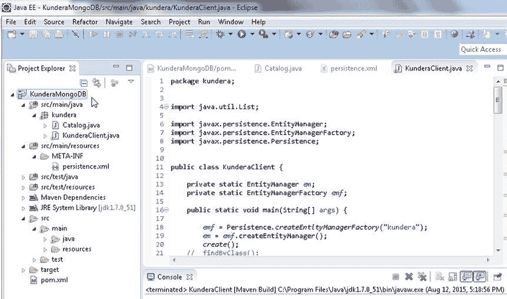
    图 9-15. 包含 KunderaClient 类的 Maven 项目目录结构

我们将向 `KunderaClient` 应用程序添加 表 9-4 中所示的方法，以在 MongoDB 上运行 CRUD 操作。我们将从 `main` 方法调用这些方法，开始时注释掉所有方法。我们将一次取消注释一个方法并运行 `KunderaClient` 应用程序。

**表 9-4. KunderaClient 应用程序方法**

| 属性 | 描述 |
| --- | --- |
| `create()` | 创建实体。 |
| `findByClass()` | 使用实体类查找实体。 |
| `query()` | 查询实体。 |
| `update()` | 更新实体。 |
| `delete()` | 删除实体。 |

### 运行 CRUD 操作

在接下来的几个小节中，我们将在 `catalog` 集合中创建一个目录，并向目录中添加数据、查找目录条目、更新目录条目和删除目录条目。

### 创建目录

在本节中，我们将向 MongoDB 中的 `catalog` 集合添加一些文档。

1.  向 `KunderaClient` 类添加一个名为 `create()` 的方法，并从 `main` 方法调用该方法，以便在应用程序运行时调用该方法。
    JPA API 在 `javax.persistence` 包中定义。`EntityManager` 接口用于与持久化上下文交互。`EntityManagerFactory` 接口用于与持久化单元的实体管理器工厂交互。在 Java SE 环境中，`Persistence` 类用于获取 `EntityManagerFactory` 对象。
2.  使用 `Persistence` 类的静态方法 `createEntityManagerFactory(java.lang.String persistenceUnitName)` 创建一个 `EntityManagerFactory` 对象。
3.  使用 `EntityManagerFactory` 对象的 `createEntityManager()` 方法创建一个 `EntityManager` 实例。
    ```
    EntityManagerFactory  emf = Persistence.createEntityManagerFactory("kundera");
    em = emf.createEntityManager();
    ```
4.  在 `create()` 方法中，创建实体类 `Catalog` 的一个实例。使用 set 方法设置 `catalogId`、`journal`、`publisher`、`edition`、`title` 和 `author` 字段。
    ```
    Catalog catalog = new Catalog();
            catalog.setCatalogId("catalog1");
            catalog.setJournal("Oracle Magazine");
            catalog.setPublisher("Oracle Publishing");
            catalog.setEdition("November-December 2013");
            catalog.setTitle("Engineering as a Service");
            catalog.setAuthor("David A. Kelly");
    ```
5.  使用 `EntityManager` 接口中的 `persist(java.lang.Object entity)` 方法使领域模型实例受管理和持久化。
    ```
    em.persist(catalog);
    ```
    同样，其他 JPA 实例也可以被持久化。当我们在后面的部分运行 `KunderaClient` 类时，`Catalog` 实体将被持久化到 MongoDB 数据库。

### 使用实体类查找目录条目

`EntityManager` 类提供了多种方法用于查找实体实例。在本节中，我们将使用 `find(java.lang.`


# 使用 Kundera 进行 JPA CRUD 操作

## 查找目录条目

使用 `EntityManager` 接口中的 `find(java.lang.Class<T> entityClass, java.lang.Object primaryKey)` 方法，第一个参数是实体类，第二个参数是要查找的文档的 `_id` 字段值。

1.  向 `KunderaClient` 类添加一个名为 `findByClass()` 的方法，并从 `main` 方法中调用该方法，以便在应用程序运行时调用它。
2.  使用 `Catalog.class` 作为第一个参数，`"catalog1"` 作为第二个参数来调用 `find(java.lang.Class<T> entityClass, java.lang.Object primaryKey)` 方法。
    ```java
    Catalog catalog = em.find(Catalog.class, "catalog1");
    ```
3.  在 `Catalog` 实例上调用 `get` 方法以输出实体字段。
    ```java
    System.out.println(catalog.getJournal());
    System.out.println(catalog.getPublisher());
    System.out.println(catalog.getEdition());
    System.out.println(catalog.getTitle());
    System.out.println(catalog.getAuthor());
    ```

当客户端类运行时，`Catalog` 实体字段值应当被输出。

### 使用 JPA 查询查找目录条目

`Query` 接口用于运行 Java 持久化查询语言和原生 SQL 的查询。`EntityManager` 接口提供了几种创建 `Query` 实例的方法。在本节中，我们将首先使用 `EntityManager` 方法 `createQuery(java.lang.String qlString)` 创建一个 `Query` 实例，然后在 `Query` 实例上调用 `getResultList()` 方法，从而运行一个 Java 持久化查询语言语句。

1.  向 `KunderaClient` 类添加一个名为 `query()` 的方法，并从 `main` 方法中调用该方法。
2.  在 `query()` 方法中，调用 `createQuery(java.lang.String qlString)` 方法来创建一个 `Query` 实例。
3.  提供 Java 持久化查询语言语句 `SELECT c FROM Catalog c`。
    ```java
    javax.persistence.Query query = em.createQuery("SELECT c FROM Catalog c");
    ```
4.  在 `Query` 实例上调用 `getResultList()` 方法以运行 `SELECT` 语句，并返回一个 `List<Catalog>` 作为结果。
    ```java
    List<Catalog> results = query.getResultList();
    ```
5.  使用增强的 `for` 语句遍历 `List` 对象，以输出 `Catalog` 实例的字段。
    ```java
    for (Catalog catalog : results) {
        System.out.println(catalog.getCatalogId());
        System.out.println(catalog.getJournal());
        System.out.println(catalog.getPublisher());
        System.out.println(catalog.getEdition());
        System.out.println(catalog.getTitle());
        System.out.println(catalog.getAuthor());
    }
    ```

当客户端类运行时，`Catalog` 实体字段值应当被输出。

### 更新目录条目

在本节中，我们将使用 Java 持久化 API 更新一个目录条目。`EntityManager` 中的 `persist()` 方法可用于持久化更新后的实体实例。

1.  向 `KunderaClient` 类添加一个名为 `update()` 的方法，并从 `main` 方法中调用该方法。
    1.  要更新主键为 `"catalog1"` 的文档中的 `edition` 列，请使用 `find(java.lang.Class<T> entityClass, java.lang.Object primaryKey)` 方法为 `catalog1` 行创建一个实体实例。
    2.  随后，使用 `setEdition` 方法将 `edition` 字段设置为更新后的值。
    3.  使用 `persist(java.lang.Object entity)` 方法持久化更新后的 `Catalog` 实例。
        ```java
        Catalog catalog = em.find(Catalog.class, "catalog1");
        catalog.setEdition("Nov-Dec 2013");
        em.persist(catalog);
        ```
2.  Java 持久化查询语言提供了 `UPDATE` 子句来更新一行。使用 `UPDATE` 语句和 `EntityManager` 中的 `createQuery(String)` 方法创建一个 `Query` 实例。随后调用 `executeUpdate()` 方法来执行 `UPDATE` 语句。
    ```java
    em.createQuery("UPDATE Catalog c SET c.journal = 'Oracle-Magazine'").executeUpdate();
    ```
3.  `catalog` 列族中所有行的 `journal` 列都将被更新。应用更新后，调用 `query()` 方法以输出更新后的字段值。

当 `KunderaClient` 类运行时，已更新的 `journal` 字段应具有更新后的值 `Oracle-Magazine`，而不是 `Oracle Magazine`。

### 删除目录条目

在本节中，我们将使用 Java 持久化 API 移除持久化在 MongoDB 中的文档。`EntityManager` 中的 `remove(java.lang.Object entity)` 方法可用于移除一个实体实例。

1.  向 `KunderaClient` 类添加一个名为 `delete()` 的方法，并从 `main` 方法中调用该方法。
2.  要移除主键为 `"catalog1"` 的文档，请使用 `find(java.lang.Class<T> entityClass, java.lang.Object primaryKey)` 方法为 `catalog1` 行创建一个实体实例。随后调用 `remove(java.lang.Object entity)` 方法，从 MongoDB 中移除主键为 `catalog1` 的文档。
    ```java
    Catalog catalog = em.find(Catalog.class, "catalog1");
    em.remove(catalog);
    ```
3.  Java 持久化查询语言提供了 `DELETE` 子句来删除文档。使用 `DELETE` 语句和 `EntityManager` 中的 `createQuery(String)` 方法创建一个 `Query` 实例。随后调用 `executeUpdate()` 方法来执行 `DELETE` 语句。
    ```java
    em.createQuery("DELETE FROM Catalog c").executeUpdate();
    ```
    所有行都将被删除。`DELETE` 语句不会删除文档本身，而是删除行中的所有列。
4.  应用删除操作（无论是使用 `remove(java.lang.Object entity)` 还是使用 `DELETE` Java 持久化查询语言语句）后，调用 `query()` 方法以输出任何持久化到 `catalog` 表中的 `Catalog` 实例。

当客户端类运行时，在删除 `Catalog` 条目后调用 `query()` 方法时，不应列出任何字段值。

### Kundera-Mongo JPA 客户端类

在以下小节中，我们将安装 Maven 项目并为 Maven 项目生成 Eclipse IDE 文件。随后，我们将运行 Kundera-Mongo JPA 客户端类（在上一节“运行 JPA CRUD 操作”中讨论过）以调用客户端类的不同方法。本章中使用的 `KunderaClient` 类如下所列：

```java
package kundera;

import java.util.List;

import javax.persistence.EntityManager;
import javax.persistence.EntityManagerFactory;
import javax.persistence.Persistence;

public class KunderaClient {
    private static EntityManager em;
    private static EntityManagerFactory emf;

    public static void main(String[] args) {
        emf = Persistence.createEntityManagerFactory("kundera");
        em = emf.createEntityManager();
        create();
        findByClass();
        query();
        update();
        delete();
        close();
    }

    private static void create() {
        Catalog catalog = new Catalog();
        catalog.setCatalogId("catalog1");
        catalog.setJournal("Oracle Magazine");
        catalog.setPublisher("Oracle Publishing");
        catalog.setEdition("November-December 2013");
        catalog.setTitle("Engineering as a Service");
        catalog.setAuthor("David A. Kelly");

        em.persist(catalog);

        catalog = new Catalog();
        catalog.setCatalogId("catalog2");
        catalog.setJournal("Oracle Magazine");
        catalog.
```


setPublisher("Oracle Publishing");
catalog.setEdition("November-December 2013");
catalog.setTitle("Quintessential and Collaborative");
catalog.setAuthor("Tom Haunert");

em.persist(catalog);
}

private static void findByClass() {
Catalog catalog = em.find(Catalog.class, "catalog1");
System.out.println(catalog.getJournal());
System.out.println("\n");
System.out.println(catalog.getPublisher());
System.out.println("\n");
System.out.println(catalog.getEdition());
System.out.println("\n");
System.out.println(catalog.getTitle());
System.out.println("\n");
System.out.println(catalog.getAuthor());
}

private static void query() {

javax.persistence.Query query = em
.createQuery("SELECT c FROM Catalog c");
List<Catalog> results = query.getResultList();
for (Catalog catalog : results) {
System.out.println(catalog.getCatalogId());
System.out.println("\n");
System.out.println(catalog.getJournal());
System.out.println("\n");
System.out.println(catalog.getPublisher());
System.out.println("\n");
System.out.println(catalog.getEdition());
System.out.println("\n");
System.out.println(catalog.getTitle());
System.out.println("\n");
System.out.println(catalog.getAuthor());
}
}

private static void update() {
Catalog catalog = em.find(Catalog.class, "catalog1");
catalog.setEdition("Nov-Dec 2013");
em.persist(catalog);
em.createQuery("UPDATE Catalog c SET c.journal = 'Oracle-Magazine'")
.executeUpdate();
System.out.println("After updating");
System.out.println("\n");
query();
}

private static void delete() {
Catalog catalog = em.find(Catalog.class, "catalog1");
em.remove(catalog);
System.out.println("After removing catalog1");
query();

em.createQuery("DELETE FROM Catalog c").executeUpdate();
System.out.println("\n");
System.out.println("After removing all catalog entries");
query();

}

private static void close() {
em.close();
emf.close();
}
}
```

### 安装 Maven 项目

在上一节中，我们开发了一个 Maven 项目的源代码。在本节中，我们将构建这个 Maven 项目，包括为其生成依赖 JAR 文件 `KunderaMongoDB-1.0.0.jar`。

在项目资源管理器中右键单击 `pom.xml`，然后选择 运行方式  Maven 安装，如 图 9-16 所示，以构建 `KunderaMongoDB-1.0.0.jar` 并将其安装到目标子目录下的本地仓库中。

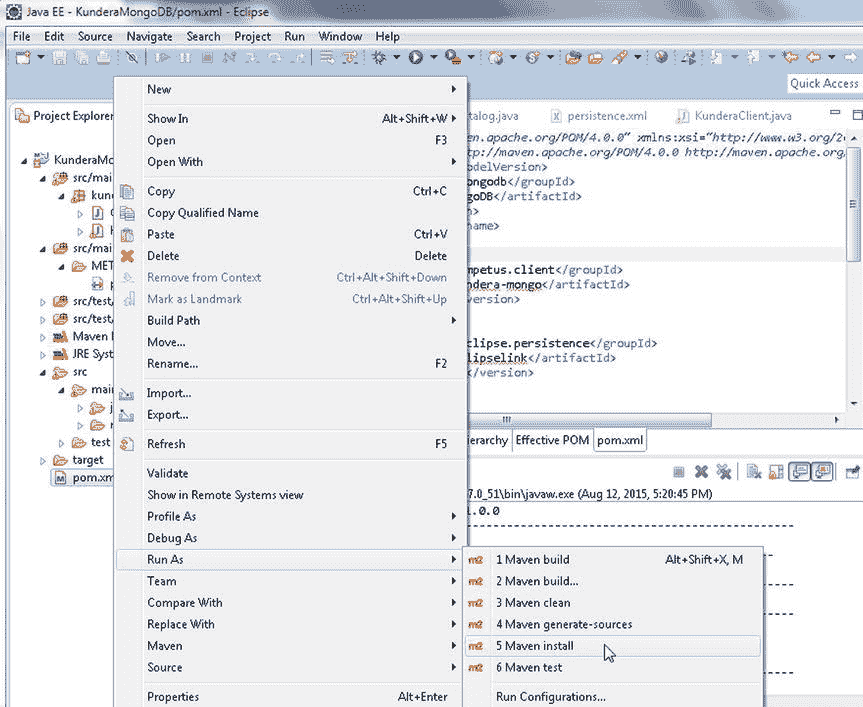

图 9-16. 安装 Maven 项目

Maven 会扫描项目，并如 图 9-17 所示构建和安装 `KunderaMongo` 项目。Maven 安装的输出应包含 "BUILD SUCCESS" 消息。若没有，则表示发生了错误，Maven 项目未成功安装。文件 `/root/workspace/KunderaMongoDB/target/KunderaMongoDB-1.0.0.jar` 将被构建并安装。

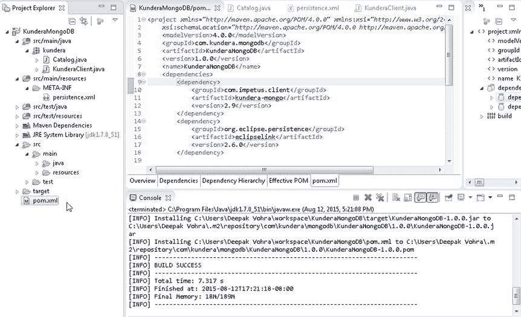

图 9-17. 安装 Maven 项目的输出

接下来，我们将使用 Maven Eclipse 插件为 Maven 项目生成 Eclipse IDE 文件。我们将运行来自 Maven Eclipse 插件的以下目标，列于 表 9-5 中。

表 9-5. Eclipse 特定配置属性

| 目标 | 描述 |
| --- | --- |
| `eclipse:clean` | 删除 Eclipse IDE 使用的文件。 |
| `eclipse:eclipse` | 生成 Eclipse 配置文件。 |

我们需要为 `eclipse:clean eclipse:eclipse` 目标创建一个运行配置。

1.  右键单击 `pom.xml`，然后选择 运行方式  运行配置，如 图 9-18 所示。

    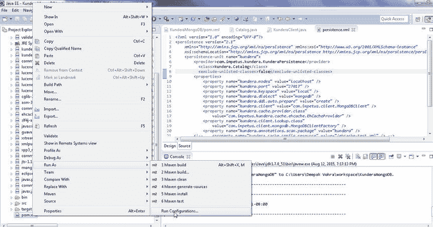

    图 9-18. 选择 pom.xml  运行方式  运行配置

2.  右键单击 Maven Build，然后选择 新建。
3.  对于新的运行配置，指定以下值并单击 应用。

    *   名称：Eclipse（例如）
    *   基目录：`KunderaMongoDB` 项目基目录
    *   目标：`eclipse:clean eclipse:eclipse`

4.  随后单击 运行，如 图 9-19 所示。

    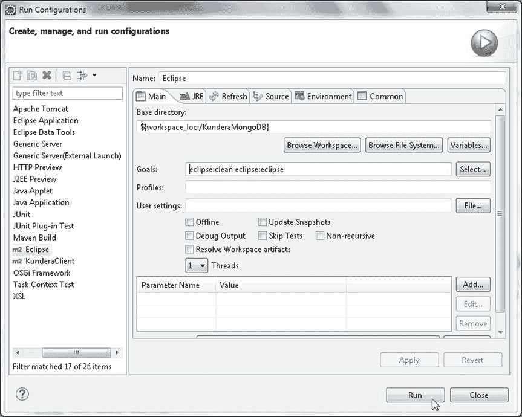

    图 9-19. 配置新的运行配置

如果 Maven 目标未产生错误，则应输出 `BUILD SUCCESS` 消息，如 图 9-20 所示。

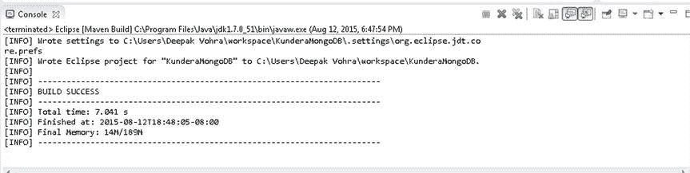

图 9-20. Maven 目标的输出

### 运行 Kundera-Mongo JPA 客户端类

在本节中，我们将运行 `KunderaMongoDB` 项目中的 `KunderaClient` 类。我们将使用 Exec Maven 插件中的 Maven `exec:java` 目标来运行 `KunderaClient` 类。我们通过 `pom.xml` 中 `exec-maven-plugin` 配置的 `mainClass` 参数指定了要运行的类。

```
<configuration>
  <mainClass>kundera.KunderaClient</mainClass>
</configuration>
```

我们将在 Eclipse 中运行 `exec:java` 目标以运行 `KunderaClient` 类。但首先，我们需要在 Eclipse 中创建一个新的运行配置。

1.  在运行配置中右键单击 Maven Build，然后选择 新建。
2.  指定一个名称（例如 `KunderaClient`）和一个目标（`exec:java`），然后单击 应用，随后单击 运行，如 图 9-21 所示。

    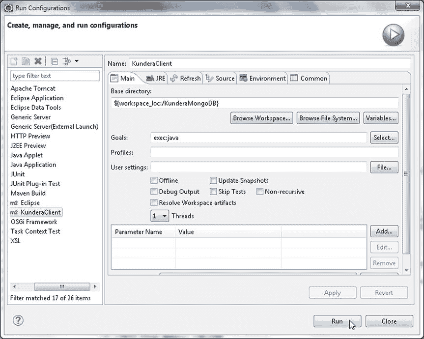

    图 9-21. 运行 exec:java 目标

`KunderaClient` 应用程序将运行，并为调用的方法（如查找和列出实体）生成输出。在下一节中，我们将调用 `KunderaClient` 类的方法来创建、查找、更新和删除实体。

### 调用 KunderaClient 方法

现在是调用这些方法的时候了。

1.  首先，在 `main` 方法中调用 `create()` 方法，并将其他方法注释掉。当运行 `exec:java` 的运行配置时，`KunderaClient` 应用程序将运行，并调用 `create()` 方法来创建一些实体。
2.  随后，在 Mongo shell 中运行 `db.catalog.find()` 方法，以列出添加到 MongoDB 的两个实体，如 图 9-22 所示。

    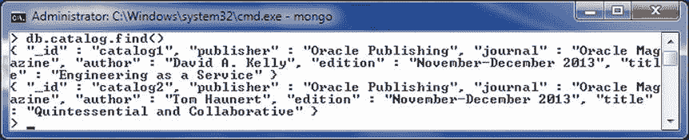

    图 9-22. 在 Mongo Shell 中列出添加到 MongoDB 的两个文档

3.  接下来，通过取消注释方法调用，在 `main` 方法中调用 `findByClass()` 方法。
4.  再次运行 `exec:java` 目标的运行配置。`catalog1` 实体的字段将被列出，如 图 9-23 所示。

    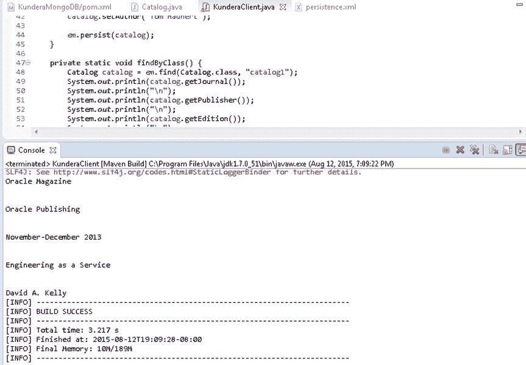

    图 9-23. 运行调用 findByClass() 方法的 exec:java 运行配置的输出

5.  接下来，使用 `exec:java` 运行配置调用 `query()` 方法。运行 Maven 项目运行配置的输出如 图 9-24 所示。

    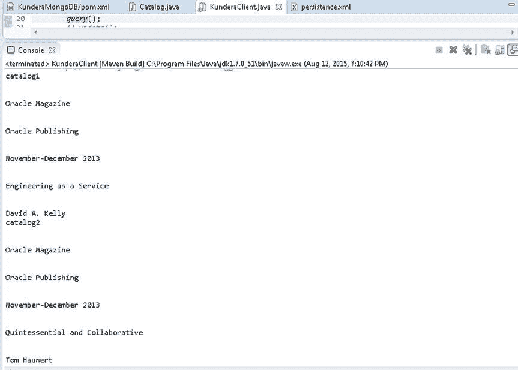

    图 9-24.


## 6. 接下来，调用 `update()` 方法以更新 `journal` 字段。
## 7. 运行 `exec:java` 目标运行配置。`journal` 字段得到更新，更新后的字段值如图 9-25 所示输出。

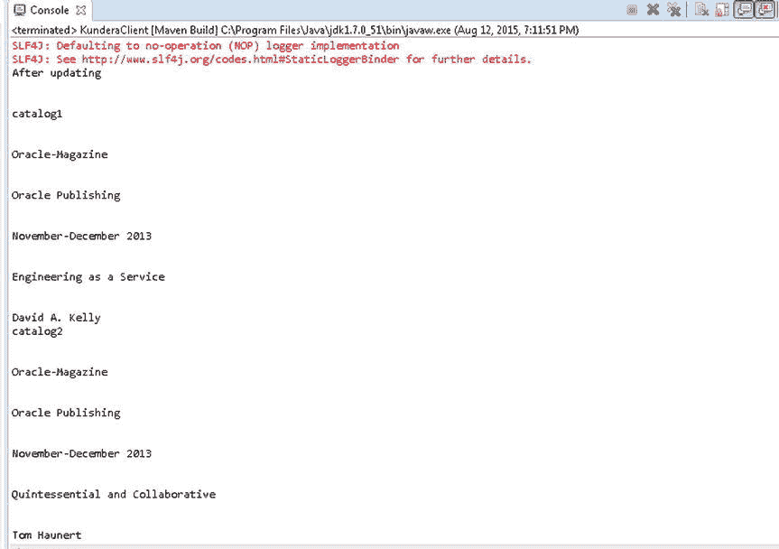

**图 9-25.** 运行用于调用 `update()` 方法的 `exec:java` 运行配置的输出

## 8. 接下来，调用 `delete()` 方法，并使用 `exec:java` 的运行配置运行 `KunderaClient` 应用程序。如图 9-26 所示的输出所示，在移除一个实体后以及移除两个实体后，实体都会被列出。

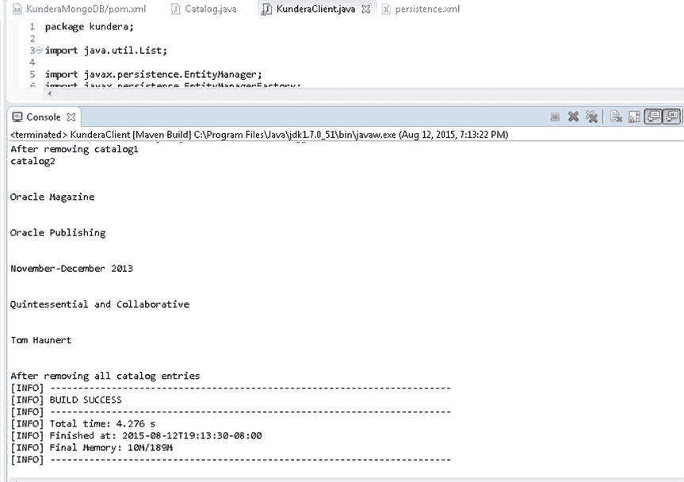

**图 9-26.** 运行用于调用 `delete()` 方法的 `exec:java` 运行配置的输出

## 总结
在本章中，我们使用带有 `kundera-mongo` 模块的 Kundera，通过一个带有 JPA 实体类和 `persistence.xml` 配置文件的 Java 客户端类，在 MongoDB 中执行 CRUD 操作。Kundera-Mongo 应用程序是作为 Eclipse 中的 Maven 项目开发的，并使用来自 Maven Eclipse 插件和 Exec Maven 插件的目标进行构建和运行。在下一章中，我们将使用 Spring Data 与 MongoDB。

