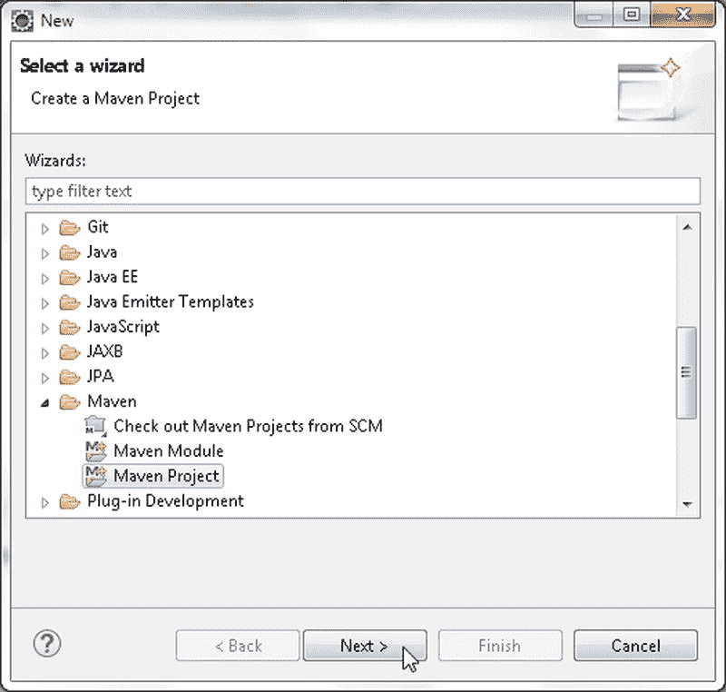
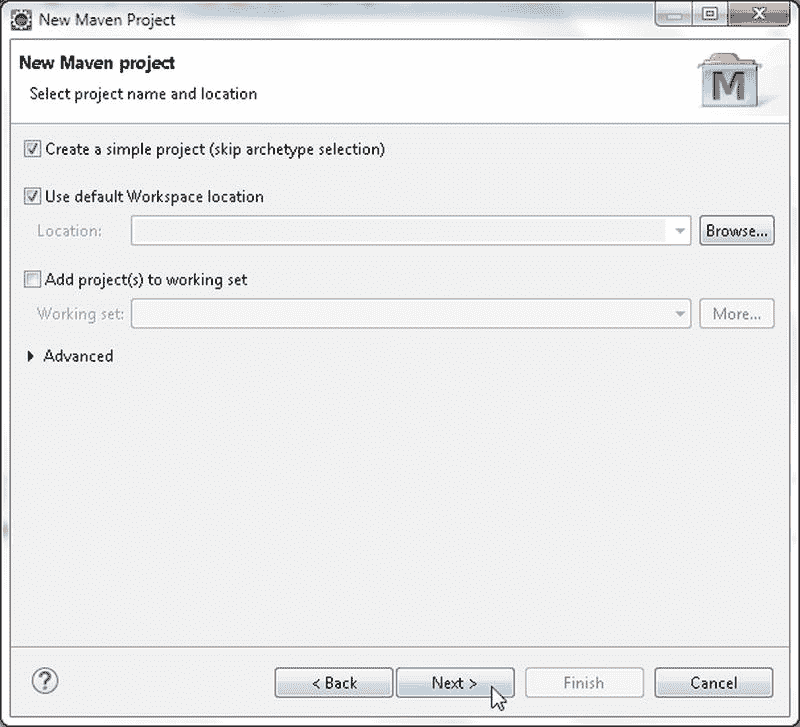
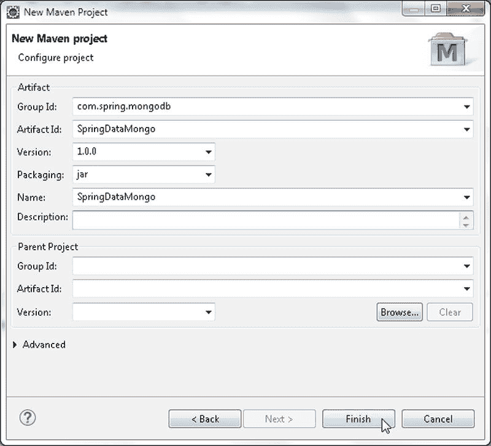
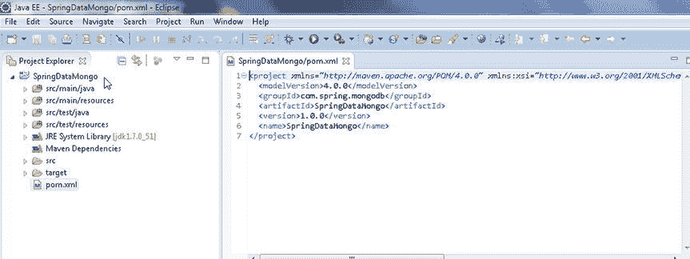
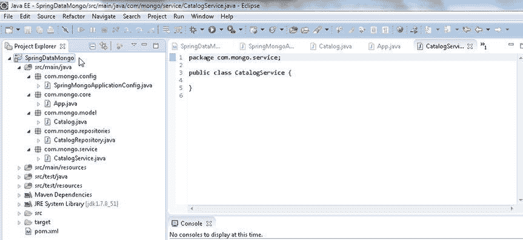

# 使用 Spring Data 与 MongoDB

Spring Data 专为非关系数据库等新型数据访问技术而设计。MongoDB 是一个非关系型 NoSQL 数据库，具有可扩展性、灵活性和高性能等优点。Spring Data MongoDB 项目为 MongoDB 服务器添加了 Spring Data 功能。本章阐述如何使用 Spring Data MongoDB 项目访问 MongoDB 并在 Eclipse 中对数据库执行 CRUD 操作。我们将使用 Maven 作为构建自动化工具。本章包含以下主题：

*   设置环境
*   创建 Maven 项目
*   安装 Spring Data MongoDB
*   配置 JavaConfig
*   创建模型
*   使用带有 Template 的 Spring Data 与 MongoDB
*   使用带有 MongoDB 的 Spring Data 仓库

## 设置环境
我们需要为本章下载并安装以下软件。

*   Eclipse IDE for Java EE Developers。从 `www.eclipse.org/downloads` 下载。本章使用 Eclipse 4.4 Luna。
*   从 `www.mongodb.org/downloads` 获取 MongoDB 3.0.5（或更高版本）二进制发行版。
*   从 `www.oracle.com/technetwork/java/javase/downloads/jdk7-downloads-1880260.html` 获取 Java SE 7。

双击 MongoDB 二进制发行版以安装 MongoDB。将 MongoDB 安装目录的 `bin` 目录（例如 `C:\Program Files\MongoDB\Server\3.0\bin`）添加到 `PATH` 环境变量中。如果之前章节未创建，请为 MongoDB 数据创建目录 `C:\data\db`。

使用以下命令启动 MongoDB 服务器。

```bash
>mongod
```

### 创建 Maven 项目
首先，我们需要在 Eclipse 中创建一个 Maven 项目。

1.  选择 **File > New > Other**。
2.  在 **New** 窗口中，选择 **Maven > Maven Project** 向导并单击 **Next**，如图 10-1 所示。

    
    **图 10-1.** 创建新的 Maven 项目

3.  **New Maven Project** 向导启动。选中 **Create a simple project** 复选框和 **Use default Workspace location** 复选框，如图 10-2 所示。然后单击 **Next**。

    
    **图 10-2.** New Maven Project 向导

4.  在 **Configure project** 中指定以下设置，然后单击 **Finish**，如图 10-3 所示。
    *   Group Id: `com.spring.mongodb`
    *   Artifact Id: `SpringDataMongo`
    *   Version: `1.0.0`
    *   Packaging: `jar`
    *   Name: `SpringDataMongo`

    
    **图 10-3.** 配置新的 Maven 项目

一个 Maven 项目（`SpringDataMongo`）被创建，如图 10-4 的 Package Explorer 所示。


**图 10-4.** 新的 Maven 项目 SpringDataMongo

项目的 Java 构建路径应包含 Maven 依赖项，包括 Spring Data MongoDB 项目依赖项。安装 Spring Data MongoDB 和其他依赖项将在下一节讨论。我们需要向 Maven 项目添加一些类以使用 Spring Data 与 MongoDB。添加表 10-1 中列出的 Java 类。

**表 10-1.** Java 类

| 类 | 描述 |
|---|---|
| `com.mongo.config.SpringMongoApplicationConfig` | `JavaConfig` 类。 |
| `com.mongo.core.App` | 用于通过 Template 使用 Spring Data 与 MongoDB 的 Java 应用程序。 |
| `com.mongo.model.Catalog` | 模型类。 |
| `com.mongo.repositories.CatalogRepository` | MongoDB 特定仓库的实现类。 |
| `com.mongo.service.CatalogService` | 用于调用对 MongoDB 仓库的 CRUD 操作的服务类。 |

Maven 项目中的 Java 类如图 10-5 所示。


**图 10-5.** Maven 项目中的 Java 类

在后续章节中，我们将安装并使用 Spring Data MongoDB 项目。除非另有说明，在运行应用程序 `App.java` 或 `CatalogService.java` 之前，如果 `local` 数据库中已存在 `catalog` 集合，请使用 Mongo shell 中的方法 `db.catalog.drop()` 将其删除。

```javascript
>use local
>db.catalog.drop()
```

### 安装 Spring Data MongoDB
Maven 项目在根目录下包含一个 `pom.xml` 文件，用于指定项目的依赖项和项目的构建配置。在 `pom.xml` 中指定表 10-2 中列出的依赖项。

**表 10-2.** Maven 项目依赖项

| 依赖项 | Group Id | Artifact Id | 版本 |
|---|---|---|---|
| Spring Data MongoDB | `org.springframework.data` | `spring-data-mongodb` | `1.7.2.RELEASE` |

在构建配置中指定 `maven-compiler-plugin` 和 `maven-eclipse-plugin` 插件。用于 Spring Data MongoDB 项目的 `pom.xml` 列出如下。

```xml
<project xmlns="http://maven.apache.org/POM/4.0.0" xmlns:xsi="http://www.w3.org/2001/XMLSchema-instance"
    xsi:schemaLocation="http://maven.apache.org/POM/4.0.0 http://maven.apache.org/xsd/maven-4.0.0.xsd">
    <modelVersion>4.0.0</modelVersion>
    <groupId>com.spring.mongodb</groupId>
    <artifactId>SpringDataMongo</artifactId>
    <version>1.0.0</version>
    <name>SpringDataMongo</name>
    <dependencies>
        <dependency>
            <groupId>org.springframework.data</groupId>
            <artifactId>spring-data-mongodb</artifactId>
            <version>1.7.2.RELEASE</version>
        </dependency>
    </dependencies>
    <build>
        <plugins>
            <plugin>
                <artifactId>maven-compiler-plugin</artifactId>
                <version>3.0</version>
                <configuration>
                    <source>1.7</source>
                    <target>1.7</target>
                </configuration>
            </plugin>
            <plugin>
                <groupId>org.apache.maven.plugins</groupId>
                <artifactId>maven-eclipse-plugin</artifactId>
                <version>2.9</version>
            </plugin>
        </plugins>
    </build>
</project>
```


### 配置 JavaConfig

在配置 Spring 环境时，可以使用 `JavaConfig` 来配置*普通的旧 Java 对象*（POJO）。POJO 是一种普通的 Java 对象，不受 Java 对象模型或约定的任何特殊约束。使用 `JavaConfig` 进行 Spring Data MongoDB 配置的基类是 `org.springframework.data.mongodb.config.AbstractMongoConfiguration`。

1.  创建一个名为 `SpringMongoApplicationConfig` 的类，它声明一些 `@Bean` 方法并继承 `org.springframework.data.mongodb.config.AbstractMongoConfiguration` 类。
2.  使用 `@Configuration` 注解该类，这表明该类由 Spring 容器处理，以在运行时生成 Bean 定义和 Bean 请求。
3.  声明一个带有 `@Bean` 注解的方法，该方法返回一个 `MongoClient` 实例。`SpringMongoApplicationConfig` 类必须实现继承的抽象方法 `getDatabaseName()` 和 `mongo()`。使用本地主机名（也可以使用 IP 地址）和端口号 27017 来创建 `MongoClient` 实例。
4.  同时，重写非抽象方法 `getMappingBasePackage` 以返回模型类定义所在的包（`com.mongo.model`）。

Spring 配置类 `SpringMongoApplicationConfig` 如下所示。

```java
package com.mongo.config;

import org.springframework.context.annotation.Configuration;
import org.springframework.data.mongodb.config.AbstractMongoConfiguration;
import org.springframework.context.annotation.Bean;
import com.mongo.service.CatalogService;
import com.mongodb.Mongo;
import com.mongodb.MongoClient;
import com.mongodb.ServerAddress;

import java.util.Arrays;

@Configuration
public class SpringMongoApplicationConfig extends AbstractMongoConfiguration {

    @Override
    @Bean
    public Mongo mongo() throws Exception {
        return new MongoClient(Arrays.asList(new ServerAddress("localhost",
                27017)));
    }

    @Override
    protected String getDatabaseName() {
        return "local";
    }

    @Override
    protected String getMappingBasePackage() {
        return "com.mongo.model";
    }
}
```

### 创建模型

接下来，为 Spring Data MongoDB 项目创建模型类。要持久化到 MongoDB 服务器的域对象必须使用 `@Document` 注解。

1.  在 `com.mongo.model` 包中创建一个 POJO 类 `Catalog`。
2.  为 `id`、`journal`、`edition`、`publisher`、`title` 和 `author` 字段添加相应的 get/set 方法。
3.  使用 `@Id` 注解 id 字段。
4.  添加一个可用于构造 `Catalog` 实例的构造函数。

`Catalog` 实体如下所示。

```java
package com.mongo.model;
import org.springframework.data.annotation.Id;
import org.springframework.data.mongodb.core.mapping.Document;
@Document
public class Catalog {
    @Id
    private String id;
    private String journal;
    private String publisher;
    private String edition;
    private String title;
    private String author;

    public String getId() {
        return id;
    }

    public void setId(String id) {
        this.id = id;
    }

    public String getJournal() {
        return journal;
    }

    public void setJournal(String journal) {
        this.journal = journal;
    }

    public String getPublisher() {
        return publisher;
    }

    public void setPublisher(String publisher) {
        this.publisher = publisher;
    }

    public String getEdition() {
        return edition;
    }

    public void setEdition(String edition) {
        this.edition = edition;
    }

    public String getTitle() {
        return title;
    }

    public void setTitle(String title) {
        this.title = title;
    }

    public String getAuthor() {
        return author;
    }

    public void setAuthor(String author) {
        this.author = author;
    }

    public Catalog(String id, String journal, String publisher, String edition,
            String title, String author) {
        id = this.id;
        this.journal = journal;
        this.publisher = publisher;
        this.edition = edition;
        this.title = title;
        this.author = author;

    }

}
```

## 使用 Spring Data MongoDB Template

在本节中，我们将使用 MongoDB 模板在 MongoDB 服务器上执行 CRUD 操作。术语“模板”指的是 MongoDB 操作的实现，例如创建、查找、更新、删除、聚合、更新插入和计数。可以使用 `org.springframework.data.mongodb.core.MongoOperations` 接口在 MongoDB 数据存储上执行常见的 CRUD 操作。

1.  创建一个 Java 类 `com.mongo.core.App` 以在 MongoDB 服务器上运行 CRUD 操作。
2.  `org.springframework.data.mongodb.core.MongoTemplate` 类实现了 `MongoOperations` 接口。`MongoTemplate` 实例可以使用 `ApplicationContext` 获取。创建 `ApplicationContext` 如下：

    ```java
    ApplicationContext context = new AnnotationConfigApplicationContext(
    SpringMongoApplicationConfig.class);
    ```

    `getBean(String name, Class requiredType)` 方法返回指定类型的命名 Bean。`MongoTemplate` 的 Bean 名称是 `mongoTemplate`。类类型是 `MongoOperations.class`。

    ```java
    MongoOperations ops = context.getBean("mongoTemplate", MongoOperations.class);
    ```

3.  可以使用 `MongoOperations` 实例对存储在 MongoDB 中的域对象执行各种 CRUD 操作。将 表 10-3 中列出的 `static` 方法添加到 `App.java` 类中，并在 `main` 方法中添加对这些方法的调用。`App` 类的方法名称与 `MongoOperations` 方法名称相同或相似。
4.  为 `MongoOperations` 实例 `ops` 和两个 `Catalog` 实例 `catalog1` 与 `catalog2` 添加类变量。

    ```java
    static MongoOperations ops;
    static Catalog catalog1;
    static Catalog catalog2;
    ```

在以下小节中，我们将调用 表 10-3 中列出的方法来创建集合、创建文档实例以及运行 CRUD 操作。

**表 10-3. App.java 中的方法**

| 方法 | 描述 |
| --- | --- |
| `createCollection()` | 创建一个集合。 |
| `createCatalogInstances()` | 创建一些 Catalog 实例。 |
| `addDocument()` | 添加一个文档。 |
| `addDocumentBatch()` | 批量添加文档。 |
| `findById()` | 按 ID 查找文档。 |
| `findOne()` | 查找一个文档。 |
| `findAll()` | 查找所有文档。 |
| `find()` | 查找文档。 |
| `updateFirst()` | 更新第一个文档。 |
| `updateMulti()` | 更新多个文档。 |
| `remove()` | 移除文档。 |

### 创建 MongoDB 集合

首先，我们需要创建一个集合来添加文档。`MongoOperations` 接口提供了重载的 `createCollection()` 方法来创建集合。每个 `createCollection()` 方法都返回一个 `com.mongodb.DBCollection` 实例，如 表 10-4 所述。

**表 10-4. MongoOperations 中重载的 createCollection() 方法**

| 方法 | 描述 |
| --- | --- |
| `createCollection(Class<T> entityClass)` | 创建一个非固定集合，其名称基于指定的实体类。 |
| `createCollection(Class<T> entityClass, CollectionOptions collectionOptions)` | 创建一个集合，其名称基于指定的实体类，并使用指定的集合选项。 |


