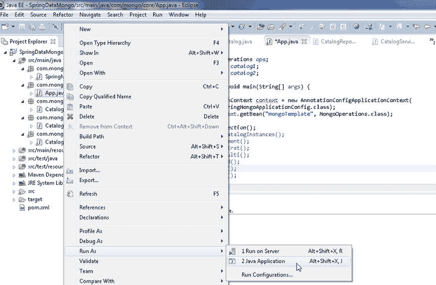
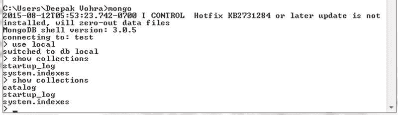
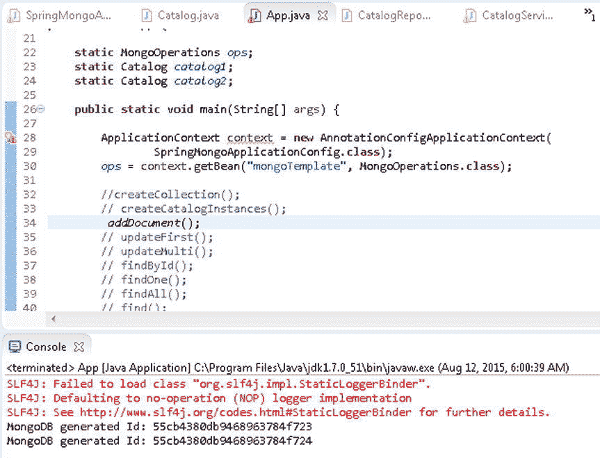
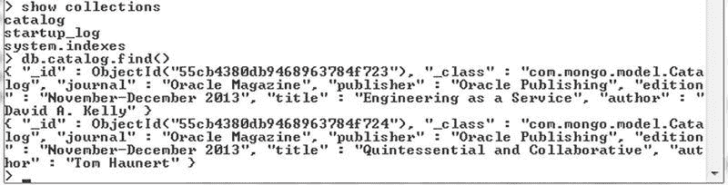

# MongoDB 操作：创建集合与添加文档

### 创建集合

首先，我们将在 `App` 应用程序的 `createCollection()` 类方法中创建一个集合。我们需要检查名为 `catalog` 的集合是否已存在。`MongoOperations` 接口提供了 `collectionExists(String collectionName)` 和 `collectionExists(Class<T> entityClass)` 方法来检查集合是否存在。

1.  在 `if`-`else` 语句中检查 `catalog` 集合是否存在。如果不存在，则使用 `createCollection(String collectionName)` 方法创建集合；如果已存在，则先使用 `dropCollection(String collectionName)` 方法删除集合，再重新创建。`createCollection()` 类方法代码如下：
    ```
    private static void createCollection() {
        if (!ops.collectionExists("catalog")) {
            ops.createCollection("catalog");
        } else {
            ops.dropCollection("catalog");
            ops.createCollection("catalog");
        }
    }
    ```

2.  在 `main` 方法中调用 `createCollection()` 方法。
3.  运行 `App.java` 应用程序，在 `local` 数据库中创建名为 `catalog` 的集合。在 Package Explorer 中右键点击 `App.java`，选择 **Run As** > **Java Application** 来运行，如图 10-6 所示。
    
    *图 10-6. 运行 App.java 应用程序*

4.  运行 `show collections` 命令列出应用程序创建集合后的所有集合。`catalog` 集合会被列出，如图 10-7 所示。
    
    *图 10-7. 在 Mongo Shell 中列出 catalog 集合*

### 创建文档实例

我们将对 MongoDB 文档执行 CRUD 操作，为此我们添加了文档实例的类变量，以便在不同的方法调用中使用同一个文档实例，而无需在每个方法中创建新的文档实例。在 `createCatalogInstances()` 方法中，使用类构造函数创建两个 `Catalog` 实例。除了自动生成的必需字段 `_id` 外，其他字段值可以留空。
```
catalog1 = new Catalog("catalog1", "Oracle Magazine", "Oracle Publishing", "November-December 2013", "Engineering as a Service", "David A. Kelly");
catalog2 = new Catalog("catalog2", "Oracle Magazine", "Oracle Publishing", "November-December 2013", "Quintessential and Collaborative", "Tom Haunert");
```

### 添加文档

`MongoOperations` 接口提供了重载的 `save()` 方法和 `insert()` 方法来添加文档。`insert()` 方法用于初次将文档存储到数据库中，而 `save()` 方法用于在数据库中不存在具有相同 `_id` 的文档时添加新文档，或在存在时更新该文档。如果不确定具有特定 `_id` 的文档是否已存在，应使用 `save()` 方法，因为如果已存在相同 `_id` 的文档，`insert()` 方法将会失败。本节我们将使用 `save()` 方法，下一小节也将讨论使用 `insert()` 方法添加文档集合。

`save()` 方法会在数据库中已存在相同 `_id` 的文档时更新该文档。如果不存在，则添加新文档，执行一次 upsert 操作。`_id` 是自动生成的。如果要保存对象的实体类型有一个 Id 属性（即用 `@Id` 注解的属性），则该属性会被设置为 MongoDB 生成的 `_id` 值。如果 Id 属性的类型是 `String`，则其值会使用从 `_id` 字段值创建的 `ObjectId` 实例来设置。表 10-5 讨论了两个重载的 `save()` 方法。

*表 10-5. 重载的 save() 方法*

| 方法 | 描述 |
| --- | --- |
| `save(Object objectToSave)` | 将对象保存到该对象实体类型对应的集合中。 |
| `save(Object objectToSave, String collectionName)` | 将对象保存到指定的集合中。 |

1.  在 `addDocument()` 方法中创建一个 `Catalog` 实例。
    ```
    catalog1 = new Catalog("catalog1", "Oracle Magazine", "Oracle Publishing", "November-December 2013", "Engineering as a Service", "David A. Kelly");
    ```

2.  调用 `save(Object objectToSave, String collectionName)` 方法，以 `Catalog` 实例作为第一个参数，集合名称 `catalog` 作为第二个参数。如果集合在数据库中不存在，它会被隐式创建。例如，在调用 `save()` 方法并指定集合名称为 `catalog` 之前，并不需要在 MongoDB 数据库中预先存在 `catalog` 集合。
    ```
    ops.save(catalog1, "catalog");
    ```
    如果使用 `save(Object objectToSave)` 方法保存到特定集合，且该集合不存在，则会隐式创建一个与对象类同名的集合。
    ```
    ops.save(catalog1);
    ```

3.  输出自动设置在 Id 属性中的 `_id`。
    ```
    System.out.println("MongoDB generated Id: " + catalog1.getId());
    ```

4.  类似地添加另一个文档。
    ```
    catalog2 = new Catalog("catalog2", "Oracle Magazine", "Oracle Publishing", "November-December 2013", "Quintessential and Collaborative", "Tom Haunert");
    ops.save(catalog2, "catalog");
    System.out.println("MongoDB generated Id: " + catalog2.getId());
    ```
    `addDocument()` 方法如下所示：
    ```
    private static void addDocument() {
        catalog1 = new Catalog("catalog1", "Oracle Magazine",
                "Oracle Publishing", "November-December 2013",
                "Engineering as a Service", "David A. Kelly");
        ops.save(catalog1, "catalog");
        //ops.save(catalog1);
        System.out.println("MongoDB generated Id: " + catalog1.getId());

        catalog2 = new Catalog("catalog2", "Oracle Magazine",
                "Oracle Publishing", "November-December 2013",
                "Quintessential and Collaborative", "Tom Haunert");
        ops.save(catalog2, "catalog");
        System.out.println("MongoDB generated Id: " + catalog2.getId());
    }
    ```
    当运行 `App.java` 应用程序并调用 `addDocument()` 方法时，两个文档会被添加到 `catalog` 集合中。自动生成的 `_id` 字段值会输出到 Eclipse 控制台，如图 10-8 所示。
    
    *图 10-8. 添加文档*

5.  要列出添加的两个文档，请在 Mongo shell 中运行 `db.catalog.find()` 方法，如图 10-9 所示。
    
    *图 10-9. 查找文档*


