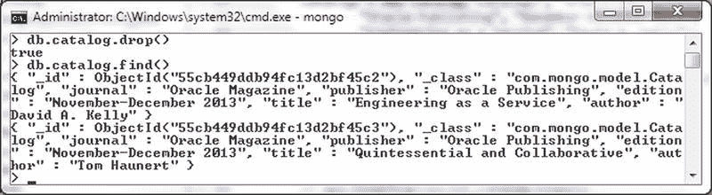
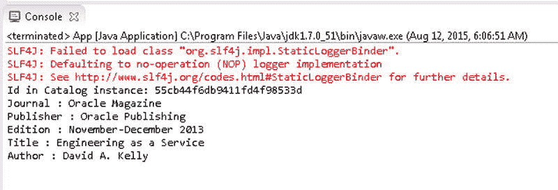

# 在 Mongo Shell 中列出文档

`MongoOperations` 接口也提供了重载的 `insert()` 方法，用于添加单个文档，如 表 10-6 所述。

## 表 10-6. 重载的 insert() 方法

| 方法 | 描述 |
| --- | --- |
| `insert(Object objectToSave)` | 根据要保存对象的实体类型，将一个对象（文档）添加到集合中。 |
| `insert(Object objectToSave, String collectionName)` | 将一个对象（文档）添加到指定的集合中。 |

### 批量添加文档

在本节中，我们将添加一批文档，而非单个文档。`MongoOperations` 接口提供了重载的 `insert()` 方法和 `insertAll()` 方法，用于将一批对象添加或插入到集合中，如 表 10-7 所述。我们将演示 表 10-7 中的三种方法，以将文档列表添加到集合中。

### 表 10-7. 重载的批量插入方法

| 方法 | 描述 |
| --- | --- |
| `insert(Collection<? extends Object> batchToSave, Class<?> entityClass)` | 在单个批次中添加指定实体类类型的对象列表。 |
| `insert(Collection<? extends Object> batchToSave, String collectionName)` | 在单个批次中将对象列表添加到指定的集合。 |
| `insertAll(Collection<? extends Object> objectsToSave)` | 将混合对象（文档）集合添加到数据库集合中。 |

1.  在 `App` 应用程序中使用自定义方法 `addDocumentBatch()` 添加一批文档。
2.  创建一个 `Catalog` 实例的 `ArrayList`。创建新的 `Catalog` 实例 `catalog1` 和 `catalog2`。`Catalog` 实例 `catalog1` 和 `catalog2` 可以与 `addDocument()` 自定义方法中创建的实例相同。由于 `catalog1` 和 `catalog2` 是类变量，可以复用相同的实例。

    ```java
    catalog1 = new Catalog("catalog1", "Oracle Magazine",
        "Oracle Publishing", "November-December 2013",
        "Engineering as a Service", "David A. Kelly");
    catalog2 = new Catalog("catalog2", "Oracle Magazine",
        "Oracle Publishing", "November-December 2013",
        "Quintessential and Collaborative", "Tom Haunert");
    ArrayList arrayList = new ArrayList();
    arrayList.add(catalog1);
    arrayList.add(catalog2);
    ```

3.  接下来，使用以下方法之一添加一批文档：
    1.  使用 `insert(Collection<? extends Object> batchToSave, String collectionName)` 方法将 `ArrayList` 实例添加到 `catalog` 集合。
        `ops.insert(arrayList, "catalog");`
    2.  或者使用 `insert(Collection<? extends Object> batchToSave, Class<?> entityClass)` 方法添加这批对象。
        `ops.insert(arrayList, Catalog.class);`
    3.  或者可以使用 `insertAll(Collection<? extends Object> objectsToSave)` 方法来添加 `ArrayList`。要使用的数据库集合名称根据 `class` 确定。
        `ops.insertAll(arrayList);`

    对于所有 `insert()` 方法和 `insertAll()` 方法，如果集合尚未创建，则会隐式创建。

     `注意` 源代码包含两个重载 `insert()` 方法和 `insertAll()` 方法的实现，用于添加一批文档。一次只能调用其中一种方法实现来添加两个文档。其他的方法调用可以注释掉。

4.  在添加一批文档之前，先在 Mongo shell 中使用以下命令移除 `catalog` 集合。

    ```javascript
    >use local
    >db.catalog.drop()
    ```

    当运行 `App` 应用程序以调用 `addDocumentBatch()` 方法时，一批文档就会被添加到 `catalog` 集合中。

5.  随后在 Mongo shell 中运行 `db.catalog.find()` 方法以列出添加的文档，如 图 10-10 所示。`_id` 是自动生成的。

    

    图 10-10. 列出批量添加的文档

## 按 Id 查找文档

在本节中，我们将按 Id 查找文档。`MongoCollection` 接口提供了重载的 `findById()` 方法，如 表 10-8 所述，用于按 Id 查找文档。

### 表 10-8. 重载的 findById() 方法

| 方法 | 描述 |
| --- | --- |
| `findById(Object id, Class<T> entityClass)` | 根据给定 id 返回映射到给定实体类的文档。 |
| `findById(Object id, Class<T> entityClass, String collectionName)` | 从给定的集合中，根据给定 id 返回映射到给定实体类的文档。 |

在本节中，我们将使用 `findById(Object id, Class<T> entityClass, String collectionName)` 方法按 Id 查找文档。

1.  在 `App` 应用程序的 `findById()` 方法中创建一个 `Catalog` 实例 `catalog1`。

    ```java
    catalog1 = new Catalog("catalog1", "Oracle Magazine",
        "Oracle Publishing", "November-December 2013",
        "Engineering as a Service", "David A. Kelly");
    ```

2.  使用 `save()` 方法将 `catalog1` 实例保存到 `catalog` 集合。

    ```java
    ops.save(catalog1, "catalog");
    ```

3.  使用 `findById()` 方法查找文档，其中 id 参数使用 `catalog1.getId()` 方法调用，实体类参数使用 `Catalog.class`，集合名称为 `catalog`。

    ```java
    Catalog catalog = ops.findById(catalog1.getId(), Catalog.class, "catalog");
    ```

    或者，使用另一个 `findById()` 方法。

    ```java
    Catalog catalog = ops.findById(catalog1.getId(), Catalog.class);
    ```

4.  随后，输出通过 id 找到的 `Catalog` 实例的字段值。

    ```java
    System.out.println("Id in Catalog instance: " + catalog1.getId());
    System.out.println("Journal : " + catalog.getJournal());
    System.out.println("Publisher : " + catalog.getPublisher());
    System.out.println("Edition : " + catalog.getEdition());
    System.out.println("Title : " + catalog.getTitle());
    System.out.println("Author : " + catalog.getAuthor());
    ```

    `App` 应用程序中的 `findById()` 方法如下所示。

    ```java
    private static void findById() {
        catalog1 = new Catalog("catalog1", "Oracle Magazine",
            "Oracle Publishing", "November-December 2013",
            "Engineering as a Service", "David A. Kelly");

        ops.save(catalog1);
        // Catalog catalog = ops.findById(catalog1.getId(),
        //     Catalog.class, "catalog");
        Catalog catalog = ops.findById(catalog1.getId(), Catalog.class);
        System.out.println("Id in Catalog instance: " + catalog1.getId());
        System.out.println("Journal : " + catalog.getJournal());
        System.out.println("Publisher : " + catalog.getPublisher());
        System.out.println("Edition : " + catalog.getEdition());
        System.out.println("Title : " + catalog.getTitle());
        System.out.println("Author : " + catalog.getAuthor());
    }
    ```

5.  运行 `App.java`。输出列出了通过 Id 找到的文档的字段值，如 图 10-11 所示。需要注意的是，`Catalog` 实例 `catalog1` 的 id 不是在构造函数中指定的 id 值 (`catalog1`)，而是自动生成的 id 值。

    

    图 10-11.


