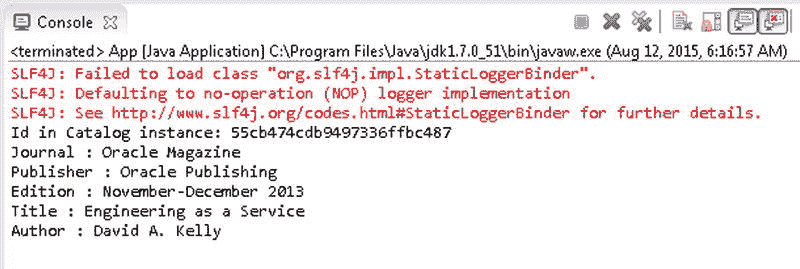
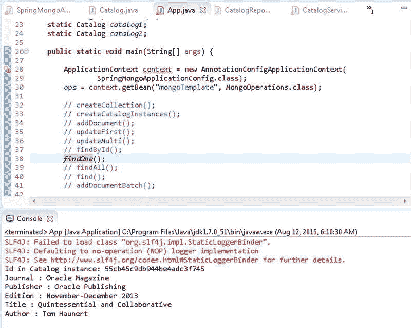
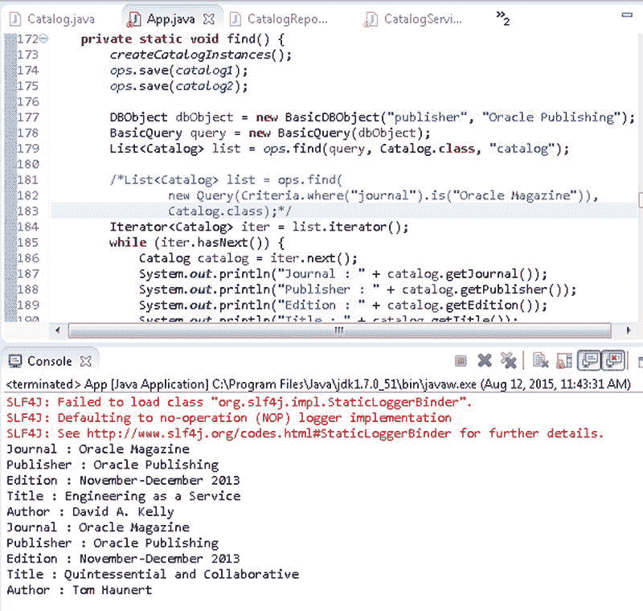
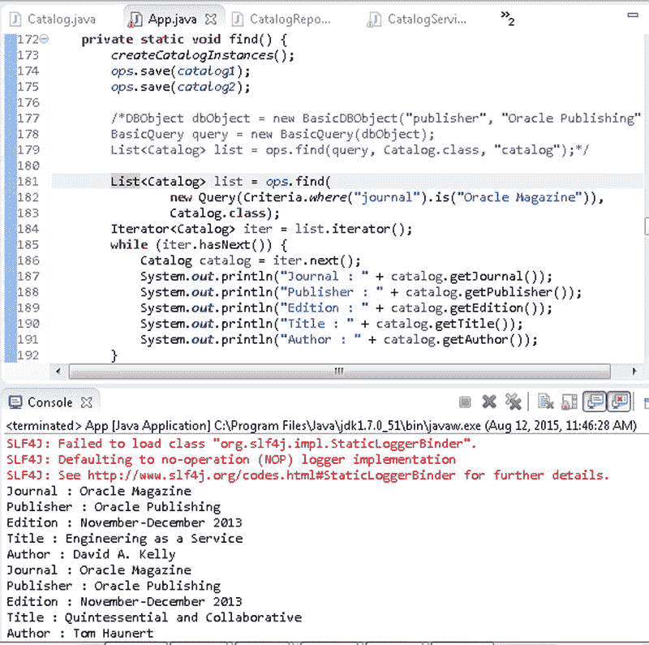

# 通过 ID 查找文档

### 查找单个文档

另一种用于查找单个文档的方法是重载的 `findOne()`，它具有以下几种变体，在 表 10-9 中讨论。

**表 10-9**. 重载的 `findOne()` 方法

| 方法 | 描述 |
| --- | --- |
| `findOne(Query query, Class<T> entityClass)` | 使用指定的查询，从实体类类型的集合中查找该指定实体类类型的一个对象实例。 |
| `findOne(Query query, Class<T> entityClass, String collectionName)` | 使用指定的查询，从指定的集合中查找指定类型的一个对象实例。 |

在本节中，我们将在 `App` 应用程序的 `findOne()` 方法中，使用 `Query` 对象从 `catalog` 集合中查找一个 `Catalog` 类型的文档。首先，我们需要构造 `Query` 对象来查找该单个文档。`BasicQuery` 类继承自 Query，并提供以下构造函数，在 表 10-10 中讨论。

**表 10-10**. 重载的 `BasicQuery` 构造函数

| 方法 | 描述 |
| --- | --- |
| `BasicQuery(com.mongodb.DBObject queryObject)` | 使用指定的 `DBObject` 查询对象创建 `BasicQuery` 实例。 |
| `BasicQuery(com.mongodb.DBObject queryObject, com.mongodb.DBObject fieldsObject)` | 使用指定的 `DBObject` 查询对象和 `DBObject` 字段对象创建 `BasicQuery` 实例。 |
| `BasicQuery(String query)` | 使用指定的查询字符串创建 `BasicQuery` 实例。 |
| `BasicQuery(String query, String fields)` | 使用指定的查询字符串和字段字符串创建 `BasicQuery` 实例。 |

1.  使用 Mongo shell 中的以下 JavaScript 方法删除任何先前创建的名为 `catalog` 的集合。
    ```
    >db.catalog.drop()
    ```
2.  在 `App` 应用程序的 `findOne()` 方法中调用 `createCatalogInstances()` 方法来创建 `Catalog` 实例，并使用 `save()` 方法保存这些实体实例。
    ```
    createCatalogInstances();
    ops.save(catalog1);
    ops.save(catalog2);
    ```
3.  使用 `BasicDBObject(String key, Object value)` 构造函数创建一个 `BasicDBObject` 实例。指定键为 id，值为使用 `getId()` 方法从 `catalog1` 实例获取的 id 所创建的 `ObjectId` 实例。
    ```
    DBObject dbObject = new BasicDBObject("id", new ObjectId(catalog1.getId()));
    ```
4.  使用该 `BasicDBobject` 实例创建一个 `BasicQuery` 对象。
    ```
    BasicQuery query = new BasicQuery(dbObject);
    ```
5.  使用 `BasicQuery` 对象，通过任一种 `findOne()` 方法从实体类类型为 `Catalog` 的 `catalog` 集合中查找单个文档。
    ```
    Catalog catalog = ops.findOne(query, Catalog.class);
    // Catalog catalog = ops.findOne(query, Catalog.class,"catalog");
    ```
    `App` 应用程序中的 `findOne()` 方法如下所示。
    ```
    private static void findOne() {
            createCatalogInstances();
            ops.save(catalog1);
            ops.save(catalog2);
            DBObject dbObject = new BasicDBObject("id", new ObjectId(
                    catalog1.getId()));
            BasicQuery query = new BasicQuery(dbObject);

            Catalog catalog = ops.findOne(query, Catalog.class);
            // Catalog catalog = ops.findOne(query, Catalog.class,"catalog");
            System.out.println("Id in Catalog instance: " + catalog1.getId());
            System.out.println("Journal : " + catalog.getJournal());
            System.out.println("Publisher : " + catalog.getPublisher());
            System.out.println("Edition : " + catalog.getEdition());
            System.out.println("Title : " + catalog.getTitle());
            System.out.println("Author : " + catalog.getAuthor());

        }
    ```
6.  运行 `App` 应用程序以保存一些 `Catalog` 实例，并使用 `MongoOperations` 中的 `findOne()` 方法查找其中一个 `Catalog` 实例。`findOne()` 方法的输出显示在 图 10-12 的 Eclipse 控制台中。
    
    **图 10-12**. 使用 `findOne()` 查找文档
    也可以使用带有 `Query(CriteriaDefinition criteriaDefinition)` 构造函数的条件定义来创建要传递给 `findOne()` 方法的新 `Query` 实例。`Criteria` 类实现了 `CriteriaDefinition` 接口，并提供了几种方法来创建条件并返回 `Criteria` 实例。使用 `where(String key)` 方法为条件指定一个键，随后调用 `is(Object o)` 方法将该键与 `catalog2 Catalog` 实例中的 id 字段值进行比较。
7.  使用通过链式调用 `where()` 和 `is()` 方法返回的 `Criteria` 实例来创建一个 `Query` 实例，并使用该 `Query` 实例调用 `findOne(Query query, Class<T> entityClass)` 方法。
    ```
    String _id = catalog2.getId();
    Catalog catalog = ops.findOne(new Query(Criteria.where("_id").is(_id)),
    Catalog.class);
    ```
8.  输出由 `findOne()` 方法返回的 `Catalog` 实例中的字段值。
    ```
    System.out.println("Id in Catalog instance: " + catalog2.getId());
    System.out.println("Journal : " + catalog.getJournal());
    System.out.println("Publisher : " + catalog.getPublisher());
    System.out.println("Edition : " + catalog.getEdition());
    System.out.println("Title : " + catalog.getTitle());
    System.out.println("Author : " + catalog.getAuthor());
    ```
    当运行 `App` 应用程序时，使用条件定义找到的 `Catalog` 实例中的字段值会输出，如 图 10-13 所示。
    
    **图 10-13**. 使用查询条件查找文档

### 查找所有文档

`MongoOperations` 接口提供了重载的 `findAll()` 方法，用于从集合中查找所有文档，如 表 10-11 所述。

**表 10-11**. 重载的 `findAll()` 方法

| 方法 | 描述 |
| --- | --- |
| `findAll(Class<T> entityClass)` | 返回指定实体类类型的集合中的文档列表。 |
| `findAll(Class<T> entityClass, String collectionName)` | 返回指定实体类类型的指定集合中的文档列表。 |

1.  在 `App` 应用程序的 `findAll()` 方法中，首先向 `catalog` 集合添加一些 `Catalog` 实例。
2.  随后使用 `findAll(Class<T> entityClass)` 方法查找实体类类型为 `Catalog` 的所有文档。`findAll()` 方法返回一个 `List` 实例。
3.  使用 `iterator()` 方法从 `List` 实例获取一个 `Iterator<Catalog>`。
    ```
    Iterator<Catalog> iter = list.iterator();
    ```
4.  在 `while` 循环中使用 `hasNext()` 方法遍历结果集，并获取结果集中的 `Catalog` 实例。
5.  使用 `Catalog` 类中为字段定义的 `get()` 方法输出 `Catalog` 实例中的字段值。`App` 类中的 `findAll()` 方法如下。
    ```
    private static void findAll() {
            createCatalogInstances();
            ops.save(catalog1);
            ops.save(catalog2);
            List<Catalog> list = ops.findAll(Catalog.class);
    ```


### 使用查询查找文档

在前面的章节中，我们使用了 `findAll`（查找所有文档）、`findOne`（查找单个文档）和 `findById`（按 Id 查找）来查找文档。`MongoOperations` 接口提供了重载的 `find()` 方法，用于使用特定查询查找文档。`find()` 方法返回一个 `List<T>` 实例，并在表 10-12 中讨论。

**表 10-12. 重载的 find() 方法**

| 方法 | 描述 |
| --- | --- |
| `find(Query query, Class<T> entityClass)` | 为指定的实体类类型返回集合中符合指定查询的文档列表。 |
| `find(Query query, Class<T> entityClass, String collectionName)` | 为指定的实体类类型从指定集合中返回符合指定查询的文档列表。 |

在 `App` 应用程序的 `find()` 方法中，我们将查找 `publisher` 字段值为 `Oracle Publishing` 的文档。

1.  使用构造函数 `BasicDBObject(String key, Object value)` 创建一个 `BasicDBObject` 实例，键为 `publisher`，值为 `Oracle Publishing`。
    ```
    DBObject dbObject = new BasicDBObject("publisher", "Oracle Publishing");
    ```
2.  使用构造函数 `BasicQuery(com.mongodb.DBObject queryObject)` 从 `BasicDBObject` 对象创建一个 `BasicQuery` 对象。
    ```
    BasicQuery query = new BasicQuery(dbObject);
    ```
3.  使用 `BasicQuery` 实例调用 `find(Query query, Class<T> entityClass, String collectionName)` 方法，以查找符合指定查询的文档。`find()` 方法返回文档的 `List<Catalog>` 实例。
    ```
    List<Catalog> list = ops.find(query, Catalog.class, "catalog");
    ```
4.  从 `List` 实例获取一个迭代器，并迭代该 `List` 实例以输出列表中文档的字段值。`App` 应用程序中的 `find()` 方法如下所示。
    ```
    private static void find() {
            createCatalogInstances();
            ops.save(catalog1);
            ops.save(catalog2);
            DBObject dbObject = new BasicDBObject("publisher", "Oracle Publishing");
            BasicQuery query = new BasicQuery(dbObject);
            List<Catalog> list = ops.find(query, Catalog.class, "catalog");
            Iterator<Catalog> iter = list.iterator();
            while (iter.hasNext()) {
                Catalog catalog = iter.next();
                System.out.println("Journal : " + catalog.getJournal());
                System.out.println("Publisher : " + catalog.getPublisher());
                System.out.println("Edition : " + catalog.getEdition());
                System.out.println("Title : " + catalog.getTitle());
                System.out.println("Author : " + catalog.getAuthor());
            }
    ```
5.  运行 `App` 应用程序，输出使用 `find(Query query, Class<T> entityClass, String collectionName)` 方法找到的文档的字段值，如图 10-15 所示。
    
    **图 10-15. 使用 find() 查找文档**
6.  如对于 `findOne(Query query, Class<T> entityClass)` 方法所讨论的，也可以使用条件定义来查找文档。依次使用 `where` 和 `is` 方法调用创建一个用于 `journal` 字段值为 `Oracle Magazine` 的 `Criteria` 实例。从 `Criteria` 实例创建一个 `Query` 实例，并使用该 `Query` 实例和 `Catalog.class` 实体类类型调用 `find()` 方法。
    ```
    List<Catalog> list = ops.find(new Query(Criteria.where("journal").is("Oracle Magazine")), Catalog.class);
    ```
7.  迭代 `find` 方法返回的列表，输出 `Catalog` 实例在列表中的字段值。使用条件的 `find()` 方法的输出如图 10-16 所示的 Eclipse 控制台中。
    
    **图 10-16. 使用查询条件通过 find() 方法查找文档**

### 更新第一个文档

在本节中，我们将使用查询来查找要更新的文档。一个查询可能返回多个文档。如果只想更新查询结果中的第一个文档，`MongoOperations` 接口提供了重载的 `updateFirst()` 方法。`org.springframework.data.mongodb.core.query.Update` 类用于提供更新子句。每个 `updateFirst()` 方法（详见表 10-13）都返回一个 `WriteResult` 对象。

**表 10-13. 重载的 updateFirst() 方法**

| 方法 | 描述 |
| --- | --- |
| `updateFirst(Query query, Update update, Class<?> entityClass)` | 使用给定的更新文档更新使用给定查询找到的给定实体类类型的第一个文档。 |
| `updateFirst(Query query, Update update, Class<?> entityClass, String collectionName)` | 使用给定的更新文档更新使用给定查询在给定集合中找到的给定实体类类型的第一个文档。 |
| `updateFirst(Query query, Update update, String collectionName)` | 使用给定的更新文档更新在给定集合中使用给定查询找到的第一个文档。 |

1.  使用 Mongo shell 中的 `db.catalog.drop()` 方法删除任何先前添加的文档。
2.  在 `App` 类的 `updateFirst()` 方法中，使用 `createCatalogInstances()` 方法创建 `Catalog` 实例，并使用 `save()` 方法保存一些 `Catalog` 实例。
3.  为 `edition` 字段创建一个 `BasicDBObject` 实例，键为 `edition`，值为 `November-December 2013`。
    ```
    DBObject dbObject = new BasicDBObject("edition", "November-December 2013");
    ```
4.  从 `BasicDBObject` 实例创建一个 `BasicQuery` 实例。
    ```
    BasicQuery query = new BasicQuery(dbObject);
    ```
5.  使用 `BasicQuery` 对象作为第一个参数调用 `updateFirst(Query query, Update update, Class<?> entityClass)` 方法。为第二个参数创建 `Update` 对象，使用 `Update` 类的静态方法 `update(String key, Object value)`，键为 `edition`，值为 `11-12-2013`，这意味着将 `edition` 字段更新为 `11-12-2013`。对于第三个参数，指定 `Catalog.class`。输出 `updateFirst()` 方法返回的 `WriteResult` 对象。
    ```
    WriteResult result = ops.updateFirst(query, Update.update("edition", "11-12-2013"), Catalog.class);
    ```


