# 更新和删除文档

### 更新单个文档

以下步骤演示如何更新单个文档。

1.  在 `App` 类的方法 `updateFirst()` 中，创建 `Catalog` 实例并使用 `MongoOperations` 的 `save()` 方法保存。
2.  创建用于查询的 `BasicQuery` 对象。查询文档选择 `edition` 字段为 `November-December 2013` 的所有文档。
    ```java
    DBObject dbObject = new BasicDBObject("edition",
            "November-December 2013");
    BasicQuery query = new BasicQuery(dbObject);
    ```
3.  调用 `updateFirst(Query query, Update update, Class<T> entityClass)` 方法，以 `BasicQuery` 对象作为第一个参数。为 `edition` 字段创建一个值为 `11-12-2013` 的 `Update` 实例（使用静态方法 `update(String key, Object value)`）作为第二个参数。使用实体类 `Catalog.class` 作为第三个参数。
    ```java
    WriteResult result = ops.updateFirst(query,
            Update.update("edition", "11-12-2013"), Catalog.class);
    System.out.println(result);
    ```
4.  随后调用 `findAll(Class<T> entityClass)` 方法查找所有文档，遍历找到的文档列表并输出其字段值。
    ```java
    List<Catalog> list = ops.findAll(Catalog.class);
    Iterator<Catalog> iter = list.iterator();
    while (iter.hasNext()) {
        Catalog catalog = iter.next();
        System.out.println("Journal : " + catalog.getJournal());
        System.out.println("Publisher : " + catalog.getPublisher());
        System.out.println("Edition : " + catalog.getEdition());
        System.out.println("Title : " + catalog.getTitle());
        System.out.println("Author : " + catalog.getAuthor());
    }
    ```

`App` 类中的 `updateFirst()` 方法如下：
```java
private static void updateFirst() {
    createCatalogInstances();
    ops.save(catalog1);
    ops.save(catalog2);
    DBObject dbObject = new BasicDBObject("edition",
            "November-December 2013");
    BasicQuery query = new BasicQuery(dbObject);
    WriteResult result = ops.updateFirst(query,
            Update.update("edition", "11-12-2013"), Catalog.class);
    System.out.println(result);
    List<Catalog> list = ops.findAll(Catalog.class);
    Iterator<Catalog> iter = list.iterator();
    while (iter.hasNext()) {
        Catalog catalog = iter.next();
        System.out.println("Journal : " + catalog.getJournal());
        System.out.println("Publisher : " + catalog.getPublisher());
        System.out.println("Edition : " + catalog.getEdition());
        System.out.println("Title : " + catalog.getTitle());
        System.out.println("Author : " + catalog.getAuthor());
    }
}
```

当运行 `App` 应用程序调用 `updateFirst()` 方法时，第一个文档会被更新。随后使用 `find()` 方法列出文档时，第一个文档的 `edition` 字段已按照更新文档的指定更新为 `11-12-2013`，如 图 10-17 所示。其他文档的 `edition` 字段仍为 `November-December 2013`。`WriteResult` 字段 n 的值为 1，这意味着有一个文档已被更新。

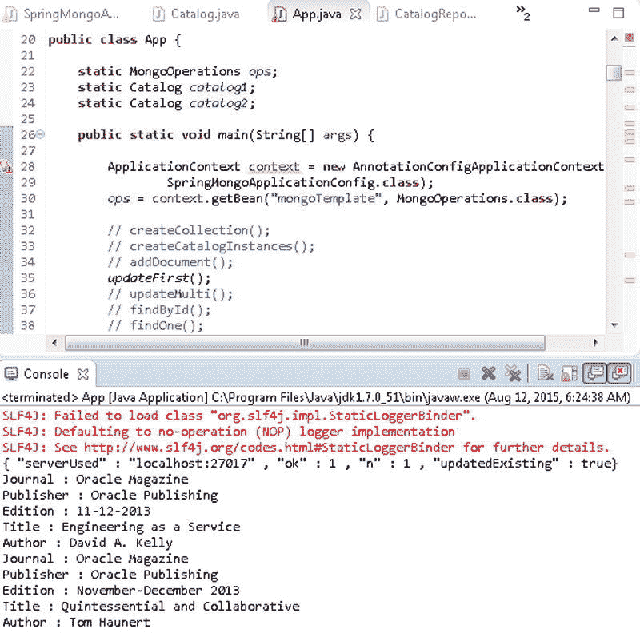
**图 10-17. 更新单个文档**

查询也可以使用条件定义来指定，如下所示：
```java
WriteResult result = ops.updateFirst(new Query(Criteria.where("edition").is("November-December 2013")), Update.update("edition", "11-12-2013"), Catalog.class);
```

### 更新多个文档

如果需要更新多个文档，`MongoOperations` 接口提供了重载的 `updateMulti()` 方法，如 表 10-14 所述。

**表 10-14. 重载的 updateMulti() 方法**

| 方法 | 描述 |
| --- | --- |
| `updateMulti(Query query, Update update, Class<?> entityClass)` | 使用给定的更新文档，更新使用给定查询找到的、属于给定实体类类型的所有文档。 |
| `updateMulti(Query query, Update update, Class<?> entityClass, String collectionName)` | 使用给定的更新文档，更新在给定集合中使用给定查询找到的、属于给定实体类类型的所有文档。 |
| `updateMulti(Query query, Update update, String collectionName)` | 使用给定的更新文档，更新在给定集合中使用给定查询找到的所有文档。 |

接下来，我们将在 `App` 类的 `updateMulti()` 方法中更新 `catalog` 集合中的多个文档。

1.  在 Mongo shell 中使用 `db.catalog.drop()` 方法删除 `catalog` 集合。
2.  使用 `createCatalogInstances()` 方法创建新文档，并使用 `save()` 方法保存文档。
3.  为查询文档创建 `BasicQuery` 对象。查询文档选择 `edition` 字段为 `November-December 2013` 的所有文档。
    ```java
    DBObject dbObject = new BasicDBObject("edition","November-December 2013");
    BasicQuery query = new BasicQuery(dbObject);
    ```
4.  调用 `updateMulti(Query query, Update update, Class<?> entityClass)` 方法，将 `BasicQuery` 对象作为第一个参数。为 `edition` 字段创建一个值为 `11-12-2013` 的 `Update` 实例（使用静态方法 `update(String key, Object value)`）作为第二个参数。使用实体类 `Catalog.class` 作为第三个参数。输出 `updateMulti()` 方法返回的 `WriteResult` 对象。
    ```java
    WriteResult result = ops.updateMulti(query,Update.update("edition", "11-12-2013"), Catalog.class);
    System.out.println(result);
    ```
5.  随后调用 `findAll()` 方法查找并输出所有文档的字段值，以验证文档已更新。`updateMulti()` 方法如下：
    ```java
    private static void updateMulti() {
        createCatalogInstances();
        ops.save(catalog1);
        ops.save(catalog2);
        DBObject dbObject = new BasicDBObject("edition",
                "November-December 2013");
        BasicQuery query = new BasicQuery(dbObject);
        WriteResult result = ops.updateMulti(query,
                Update.update("edition", "11-12-2013"), Catalog.class);
        System.out.println(result);
        List<Catalog> list = ops.findAll(Catalog.class);
        Iterator<Catalog> iter = list.iterator();
        while (iter.hasNext()) {
            Catalog catalog = iter.next();
            System.out.println("Journal : " + catalog.getJournal());
            System.out.println("Publisher : " + catalog.getPublisher());
            System.out.println("Edition : " + catalog.getEdition());
            System.out.println("Title : " + catalog.getTitle());
            System.out.println("Author : " + catalog.getAuthor());
        }
    }
    ```
6.  在 Mongo shell 中使用 `db.catalog.drop()` 方法删除任何先前添加的 `catalog` 集合。

当运行 `App` 应用程序调用 `updateMulti()` 方法时，所有符合指定查询条件的文档都会被更新。随后调用 `findAll()` 会列出修改后的文档，其中 `edition` 字段已在所有文档中更新，而不仅仅是第一个文档，如 图 10-18 所示。

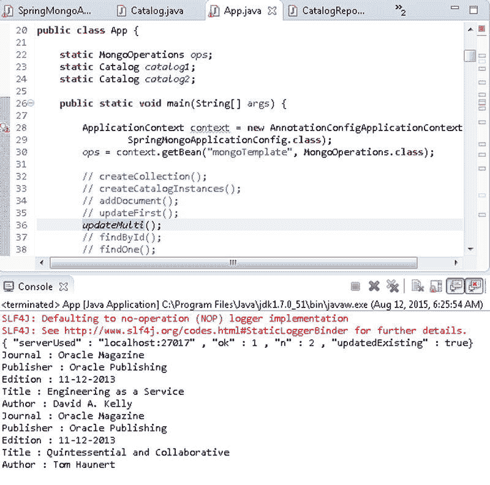
**图 10-18. 使用 updateMulti() 方法更新多个文档**

`updateMulti()` 方法调用中的查询文档也可以使用条件定义来创建，如下所示：
```java
WriteResult result = ops.updateMulti(new Query(Criteria.where("edition").is("November-December 2013")), Update.update("edition", "11-12-2013"), Catalog.class);
```

### 删除文档

在本节中，我们将从 `catalog` 集合中删除文档。`MongoOperations` 接口提供了重载的 `remove()` 方法，用于根据指定查询删除文档，如 表 10-15 所述。

**表 10-15. 重载的 remove() 方法**

| 方法 | 描述 |
| --- | --- |
| `remove(Query query, Class<?> entityClass)` | 从给定实体类对应的集合中，移除所有匹配指定查询的文档。 |
| `remove(Query query, Class<?> entityClass, String collectionName)` | 从给定集合中，移除所有匹配指定查询的、属于给定实体类类型的文档。 |


|  | `remove(Query query, String collectionName)` | 从给定集合中移除所有匹配指定查询的文档。 | `MongoOperations`接口也提供了重载的`findAndRemove()`方法，用于查找并移除单个文档，如表 10-16 所述。 表 10-16 重载的`findAndRemove()`方法 | 方法 | 描述 | | --- | --- | | `findAndRemove(Query query, Class<T> entityClass)` | 从给定实体类的集合中查找并移除单个文档。匹配给定查询的第一个文档将被移除。 | | `findAndRemove(Query query, Class<T> entityClass, String collectionName)` | 从给定集合中查找并移除指定实体类类型的单个文档。匹配给定查询的第一个文档将被移除。 | 首先，我们来看一个使用`remove()`方法的示例。

1.  在`App`应用程序的自定义`remove()`类方法中（不要与`MongoOperations`接口中的`remove()`方法混淆），创建并保存两个`Catalog`实例。
2.  使用`_id`字段作为键，`catalog1`实例中的 id 字段值作为值，创建一个`BasicDBObject`实例。使用该`BasicDBObject`实例创建一个`BasicQuery`实例。

    ```
    DBObject dbObject = new BasicDBObject("_id", catalog1.getId());
    BasicQuery query = new BasicQuery(dbObject);
    ```

3.  调用某个`remove()`方法来移除所有匹配指定查询的文档。输出`remove()`方法的结果。

    ```
    WriteResult result = ops.remove(query, Catalog.class);
    //WriteResult result = ops.remove(query, "catalog");
    //WriteResult result = ops.remove(query, Catalog.class, "catalog");
    System.out.println(result);
    ```

4.  随后调用`findAll()`方法来查找并列出所有文档。当运行`App`应用程序以调用`remove()`方法时，匹配给定查询的文档将被移除。在此示例中，两个文档中的一个被移除，另一个通过`findAll()`列出，如图 10-19 所示。

    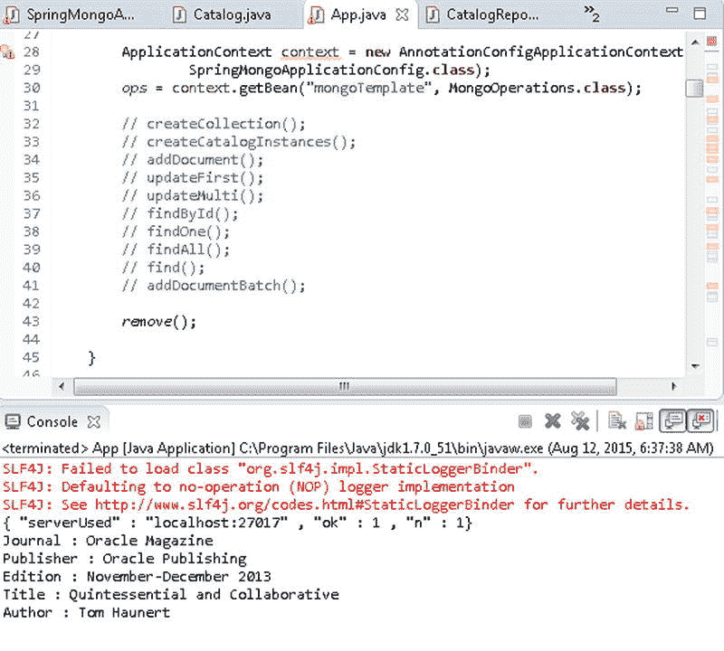
    图 10-19 使用`remove()`移除单个文档

5.  要移除所有文档，可以使用以下查询。

    ```
    DBObject dbObject = new BasicDBObject("edition","November-December 2013");
    BasicQuery query = new BasicQuery(dbObject);
    ```

    当使用前面的查询调用`remove()`方法时，添加的两个文档将被移除，如`n`字段值为 2 所示，如图 10-20 所示。

    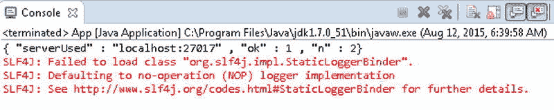
    图 10-20 使用`remove()`移除多个文档

`App`应用程序中的`remove()`方法如下。

```
private static void remove() {
    createCatalogInstances();
    ops.save(catalog1);
    ops.save(catalog2);
    //DBObject dbObject = new BasicDBObject("edition","November-December 2013");
    DBObject dbObject = new BasicDBObject("_id", catalog1.getId());
    BasicQuery query = new BasicQuery(dbObject);
    WriteResult result = ops.remove(query, Catalog.class);
    // WriteResult result = ops.remove(query, "catalog");
    System.out.println(result);

    List<Catalog> list = ops.findAll(Catalog.class);
    Iterator<Catalog> iter = list.iterator();
    while (iter.hasNext()) {
        Catalog catalog = iter.next();
        System.out.println("Journal : " + catalog.getJournal());
        System.out.println("Publisher : " + catalog.getPublisher());
        System.out.println("Edition : " + catalog.getEdition());
        System.out.println("Title : " + catalog.getTitle());
        System.out.println("Author : " + catalog.getAuthor());
    }
}
```

接下来，我们将演示`findAndModify()`方法。

1.  创建一个`BasicQuery`对象以查找具有特定`_id`字段值的所有文档。由于`_id`字段值是唯一的，该查询应仅返回一个文档。

    ```
    DBObject dbObject = new BasicDBObject("_id", catalog1.getId());
    BasicQuery query = new BasicQuery(dbObject);
    ```

2.  使用该查询调用某个`findAndRemove()`方法。

    ```
    Catalog catalog = ops.findAndRemove(query, Catalog.class);
    //Catalog catalog = ops.findAndRemove(query, Catalog.class, "catalog");
    ```

3.  `findAndRemove()`方法返回找到并被移除的文档。输出被移除文档的字段值。当运行`App`应用程序时，匹配查询的文档将被移除，其字段值将输出到 Eclipse 控制台，如图 10-21 所示。

    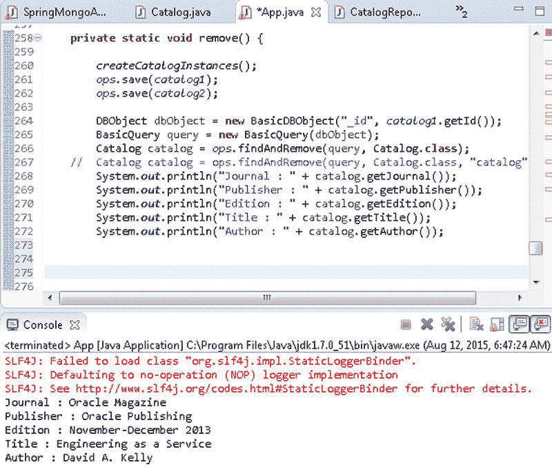
    图 10-21 使用`findAndRemove()`移除文档

以下列出了`App`应用程序，其中部分方法调用和代码段被注释掉了。在运行应用程序前，请取消注释相应的代码段以进行测试。

```
package com.mongo.core;

import java.util.ArrayList;
import java.util.Iterator;
import java.util.List;
import org.bson.types.ObjectId;
import org.springframework.context.ApplicationContext;
import org.springframework.context.annotation.AnnotationConfigApplicationContext;
import com.mongo.config.SpringMongoApplicationConfig;
import org.springframework.data.mongodb.core.MongoOperations;
import org.springframework.data.mongodb.core.query.BasicQuery;
import org.springframework.data.mongodb.core.query.Criteria;
import org.springframework.data.mongodb.core.query.Query;
import org.springframework.data.mongodb.core.query.Update;
import com.mongo.model.Catalog;
import com.mongodb.BasicDBObject;
import com.mongodb.DBObject;
import com.mongodb.WriteResult;

public class App {

    static MongoOperations ops;
    static Catalog catalog1;
    static Catalog catalog2;

    public static void main(String[] args) {

        ApplicationContext context = new AnnotationConfigApplicationContext(
                SpringMongoApplicationConfig.class);
        ops = context.getBean("mongoTemplate", MongoOperations.class);

        // createCollection();
        // createCatalogInstances();
        // addDocument();
        // updateFirst();
        // updateMulti();
        // findById();
        // findOne();
        // findAll();
        find();
        // addDocumentBatch();

        //remove();
    }

    private static void createCollection() {
        if (!ops.collectionExists("catalog")) {
            ops.createCollection("catalog");
        } else {
            ops.dropCollection("catalog");
            ops.createCollection("catalog");
        }
    }

    private static void createCatalogInstances() {
        catalog1 = new Catalog("catalog1", "Oracle Magazine",
                "Oracle Publishing", "November-December 2013",
                "Engineering as a Service", "David A. Kelly");

        catalog2 = new Catalog("catalog2", "Oracle Magazine",
                "Oracle Publishing", "November-December 2013",
                "Quintessential and Collaborative", "Tom Haunert");
    }

    private static void addDocument() {

        catalog1 = new Catalog("catalog1", "Oracle Magazine",
                "Oracle Publishing", "November-December 2013",
                "Engineering as a Service", "David A. Kelly");
        // ops.save(catalog1, "catalog");//collection created implicitly
        ops.save(catalog1);// collection created implicitly by same name as
                           // object class
        System.out.
```


```java
private static void addDocumentBatch() {
    catalog1 = new Catalog("catalog1", "Oracle Magazine",
            "Oracle Publishing", "November-December 2013",
            "Engineering as a Service", "David A. Kelly");
    catalog2 = new Catalog("catalog2", "Oracle Magazine",
            "Oracle Publishing", "November-December 2013",
            "Quintessential and Collaborative", "Tom Haunert");

    ArrayList arrayList = new ArrayList();
    arrayList.add(catalog1);
    arrayList.add(catalog2);
    ops.insert(arrayList, "catalog");

    // ops.insert(arrayList,Catalog.class);
    // ops.insertAll(arrayList);
}

private static void findById() {
    catalog1 = new Catalog("catalog1", "Oracle Magazine",
            "Oracle Publishing", "November-December 2013",
            "Engineering as a Service", "David A. Kelly");

    ops.save(catalog1);

    // Catalog catalog = ops.findById(catalog1.getId(),
    // Catalog.class,"catalog");

    Catalog catalog = ops.findById(catalog1.getId(), Catalog.class);
    System.out.println("Id in Catalog instance: " + catalog1.getId());
    System.out.println("Journal : " + catalog.getJournal());
    System.out.println("Publisher : " + catalog.getPublisher());
    System.out.println("Edition : " + catalog.getEdition());
    System.out.println("Title : " + catalog.getTitle());
    System.out.println("Author : " + catalog.getAuthor());
}

private static void findOne() {
    createCatalogInstances();
    ops.save(catalog1);
    ops.save(catalog2);

    /*
     * String _id = catalog2.getId(); Catalog catalog = ops.findOne(new
     * Query(Criteria.where("_id").is(_id)), Catalog.class);
     * System.out.println("Id in Catalog instance: " + catalog2.getId());
     * System.out.println("Journal : " + catalog.getJournal());
     * System.out.println("Publisher : " + catalog.getPublisher());
     * System.out.println("Edition : " + catalog.getEdition());
     * System.out.println("Title : " + catalog.getTitle());
     * System.out.println("Author : " + catalog.getAuthor());
     */

    DBObject dbObject = new BasicDBObject("id", new ObjectId(
            catalog1.getId()));
    BasicQuery query = new BasicQuery(dbObject);

    Catalog catalog = ops.findOne(query, Catalog.class);
    catalog = ops.findOne(query, Catalog.class, "catalog");
    System.out.println("Id in Catalog instance: " + catalog1.getId());
    System.out.println("Journal : " + catalog.getJournal());
    System.out.println("Publisher : " + catalog.getPublisher());
    System.out.println("Edition : " + catalog.getEdition());
    System.out.println("Title : " + catalog.getTitle());
    System.out.println("Author : " + catalog.getAuthor());
}

private static void findAll() {
    createCatalogInstances();
    ops.save(catalog1);
    ops.save(catalog2);

    List<Catalog> list = ops.findAll(Catalog.class);
    Iterator<Catalog> iter = list.iterator();
    while (iter.hasNext()) {
        Catalog catalog = iter.next();
        System.out.println("Journal : " + catalog.getJournal());
        System.out.println("Publisher : " + catalog.getPublisher());
        System.out.println("Edition : " + catalog.getEdition());
        System.out.println("Title : " + catalog.getTitle());
        System.out.println("Author : " + catalog.getAuthor());
    }
}

private static void find() {
    createCatalogInstances();
    ops.save(catalog1);
    ops.save(catalog2);

    /*DBObject dbObject = new BasicDBObject("publisher", "Oracle Publishing");
    BasicQuery query = new BasicQuery(dbObject);
    List<Catalog> list = ops.find(query, Catalog.class, "catalog");*/

    List<Catalog> list = ops.find(
            new Query(Criteria.where("journal").is("Oracle Magazine")),
            Catalog.class);
    Iterator<Catalog> iter = list.iterator();
    while (iter.hasNext()) {
        Catalog catalog = iter.next();
        System.out.println("Journal : " + catalog.getJournal());
        System.out.println("Publisher : " + catalog.getPublisher());
        System.out.println("Edition : " + catalog.getEdition());
        System.out.println("Title : " + catalog.getTitle());
        System.out.println("Author : " + catalog.getAuthor());
    }
}

private static void updateFirst() {
    createCatalogInstances();
    ops.save(catalog1);
    ops.save(catalog2);

    WriteResult result = ops.updateFirst(new Query(Criteria
            .where("edition").is("November-December 2013")), Update.update(
            "edition", "11-12-2013"), Catalog.class);
    System.out.println(result);

    List<Catalog> list = ops.findAll(Catalog.class);
    Iterator<Catalog> iter = list.iterator();
    while (iter.hasNext()) {
        Catalog catalog = iter.next();
        System.out.println("Journal : " + catalog.getJournal());
        System.out.println("Publisher : " + catalog.getPublisher());
        System.out.println("Edition : " + catalog.getEdition());
        System.out.println("Title : " + catalog.getTitle());
        System.out.println("Author : " + catalog.getAuthor());
    }

    /*
     * DBObject dbObject = new BasicDBObject("edition",
     * "November-December 2013"); BasicQuery query = new
     * BasicQuery(dbObject); WriteResult result = ops.updateFirst(query,
     * Update.update("edition", "11-12-2013"), Catalog.class);
     * System.out.println(result);
     *
     * List<Catalog> list = ops.findAll(Catalog.class); Iterator<Catalog>
     * iter = list.iterator(); while (iter.hasNext()) { Catalog catalog =
     * iter.next(); System.out.println("Journal : " + catalog.getJournal());
     * System.out.println("Publisher : " + catalog.getPublisher());
     * System.out.println("Edition : " + catalog.getEdition());
     * System.out.println("Title : " + catalog.getTitle());
     * System.out.println("Author : " + catalog.getAuthor()); }
     */
}

private static void updateMulti() {
    createCatalogInstances();
    ops.save(catalog1);
    ops.save(catalog2);

    DBObject dbObject = new BasicDBObject("edition",
            "November-December 2013");
    BasicQuery query = new BasicQuery(dbObject);
    WriteResult result = ops.updateMulti(query,
            Update.update("edition", "11-12-2013"), Catalog.class);
    System.out.println(result);

    List<Catalog> list = ops.findAll(Catalog.class);
    Iterator<Catalog> iter = list.iterator();
    while (iter.hasNext()) {
        Catalog catalog = iter.next();
        System.out.println("Journal : " + catalog.getJournal());
        System.out.println("Publisher : " + catalog.getPublisher());
        System.out.println("Edition : " + catalog.getEdition());
        System.out.println("Title : " + catalog.getTitle());
        System.out.println("Author : " + catalog.getAuthor());
    }

    /*
     * WriteResult result = ops.updateMulti(new Query(Criteria
     * .where("edition").is("November-December 2013")), Update.update(
     * "edition", "11-12-2013"), Catalog.class); System.out.println(result);
     * List<Catalog> list = ops.findAll(Catalog.class); Iterator<Catalog>
     * iter = list.iterator(); while (iter.hasNext()) { Catalog catalog =
     * iter.next(); System.out.println("Journal : " + catalog.getJournal());
     * System.out.println("Publisher : " + catalog.getPublisher());
     * System.out.println("Edition : " + catalog.getEdition());
     * System.out.println("Title : " + catalog.getTitle());
     * System.out.println("Author : " + catalog.getAuthor()); }
     */
}
```


## 在 MongoDB 中使用 Spring Data

## Spring Data 仓库概念

Spring Data 仓库是数据访问层的抽象实现，位于底层数据存储之上。Spring Data 仓库减少了访问数据存储所需的样板代码。Spring Data 仓库可以与 MongoDB 数据存储一起使用。

## 配置仓库基础设施

要为 MongoDB 启用 Spring Data 仓库基础设施，需要用 `@EnableMongoRepositories` 注解标注 `JavaConfig` 类。用 `@EnableMongoRepositories("com.mongo.repositories")` 注解标注 `SpringMongoApplicationConfig` 类。`com.mongo.repositories` 是用于搜索仓库的包。使用 `@ComponentScan` 注解指定要扫描带注解组件的包，并将其 `basePackageClasses` 元素设置为服务类 `CatalogService.class`（我们将在本节后面开发）。会扫描 `basePackageClasses` 中指定的每个类所在的包。修改后的 `SpringMongoApplicationConfig` 类声明如下。

```java
@Configuration
@EnableMongoRepositories("com.mongo.repositories")
@ComponentScan(basePackageClasses = {CatalogService.class})
public class SpringMongoApplicationConfig extends AbstractMongoConfiguration {

}
```

## Repository 接口

核心仓库标记接口是 `org.springframework.data.repository.Repository`，它在实体之上提供 CRUD 访问。实体类 `Catalog` 在本章前面已定义。用于在仓库上进行 CRUD 操作的泛型接口是 `org.springframework.data.repository.CrudRepository`。特定于 MongoDB 服务器的仓库接口是 `org.springframework.data.mongodb.repository.MongoRepository<T,ID extends Serializable>`，它扩展了 `CrudRepository` 接口。该接口在领域类型（本例中为 `Catalog`）和 ID 类型（本例中为 `String`）上进行参数化。ID 继承 `java.io.Serializable` 接口，以便能够在 MongoDB 服务器中序列化 ID。创建一个接口 `CatalogRepository`，它扩展参数化类型 `MongoRepository<Catalog, String>`。

`CatalogRepository` 表示特定于 MongoDB 的仓库接口，用于在 MongoDB 服务器中存储类型为 `Catalog`、ID 类型为 `String` 的实体。

```java
package com.mongo.repositories;

import org.springframework.data.mongodb.repository.MongoRepository;

import com.mongo.model.Catalog;

public interface CatalogRepository extends MongoRepository<Catalog, String> {

}
```

## 服务类实现

在服务类 `CatalogService` 中，按如下方式从上下文中访问仓库实例。

```java
ApplicationContext context = new AnnotationConfigApplicationContext(
        SpringMongoApplicationConfig.class);
CatalogRepository repository = context.getBean(CatalogRepository.class);
```

随后，使用声明为类变量的 `CatalogRepository` 实例在 MongoDB 文档存储上执行 CRUD 操作。将以下（Table 10-17）方法添加到 `CatalogService` 类以实现 CRUD 操作。方法名与 `MongoRepository` 方法名相同或相似。

**Table 10-17. CatalogService 类中的方法**

| 方法 | 描述 |
| --- | --- |
| `count()` | 统计仓库中的文档数量。 |
| `findAll()` | 查找仓库中的所有文档。 |
| `save()` | 保存文档到仓库。 |
| `saveBatch()` | 批量保存文档到仓库。 |
| `findOne(String id)` | 在仓库中查找单个文档。 |
| `deleteAll()` | 删除仓库中的所有文档。 |
| `deleteById()` | 根据 Id 删除文档。 |

## 运行与操作

在 `main` 方法中为每个方法添加方法调用。要运行 `CatalogService` 类，请在 Package Explorer 中右键单击 `CatalogService.java` 应用程序，然后选择 Run As  Java Application，如 Figure 10-22 所示。

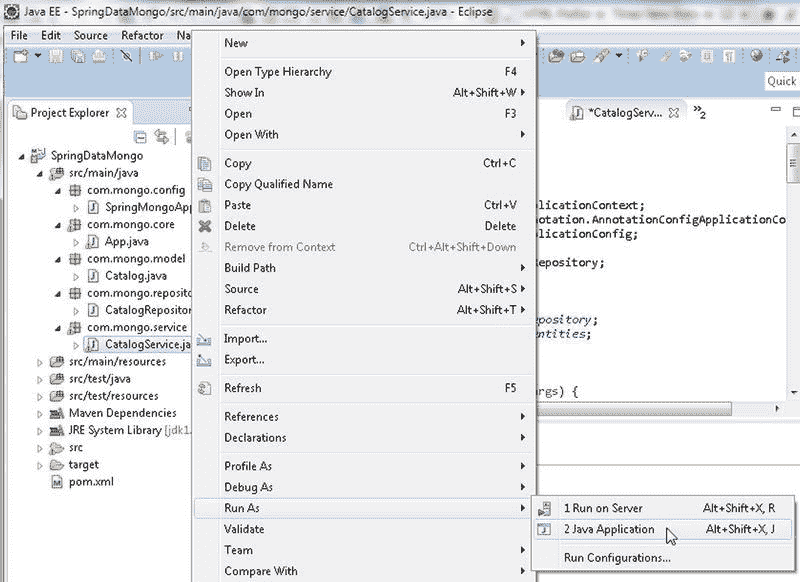

**Figure 10-22. 运行 CatalogService 应用程序**

当运行 `CatalogService.java` 应用程序时，我们将分别调用每个方法，并在调用时注释掉其他方法。

### 获取文档计数

扩展 `CrudRepository<T,ID>` 接口的 `MongoRepository<T,ID extends Serializable>` 接口提供了 CRUD 操作方法。`MongoRepository` 接口还包含一个 `count()` 方法，该方法返回集合中存储的实体数量。要能够计数实体，首先需要使用本章前面讨论的 `MongoOperations` 实例创建一些实体。运行 `App` 应用程序以调用 `addDocumentBatch()` 方法添加一些文档。使用 `CatalogRepository` 实例调用 `count()` 方法并输出返回的长整型值。

```java
public static void count() {
        System.out.println("Number of documents: " + repository.count());

    }
```

Figure 10-23 中 Eclipse 控制台的输出显示存储的文档实体数量为 2。

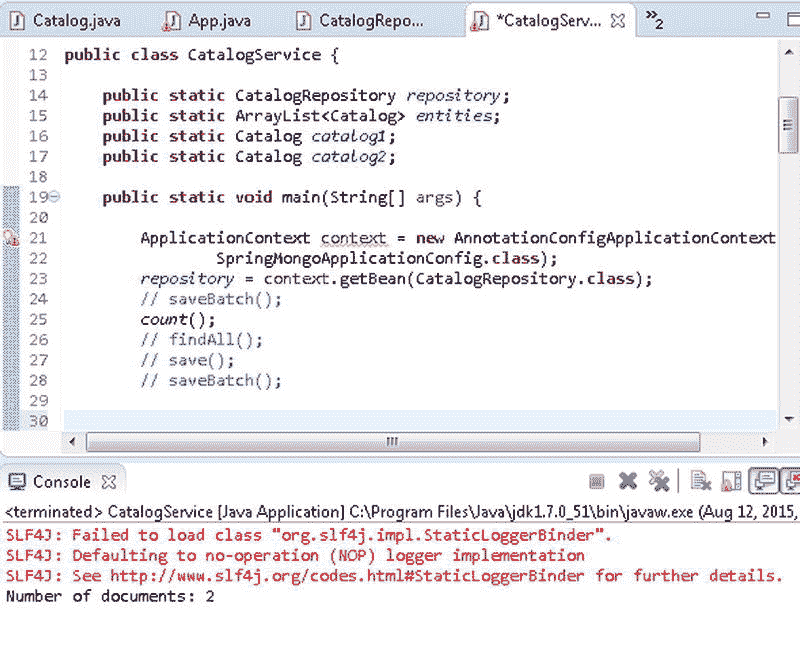

**Figure 10-23. 输出文档计数**

### 从仓库查找实体

`MongoRepository` 接口提供以下 (Table 10-18) 方法用于从仓库中查找文档。

**Table 10-18. 用于查找文档的 MongoRepository 方法**

| 方法 | 描述 |
| --- | --- |
| `T findOne(ID id)` | 返回指定 ID 的实体实例。 |
| `Iterable<T> findAll()` | 返回仓库中指定实体类型的所有实体。 |
| `Iterable<T> findAll(Iterable<ID> ids)` | 返回给定 ID 的实体类型的所有实体。 |
| `findAll(Sort sort)` | 返回按给定选项排序的所有实体。 |


## 介绍

在运行 `CatalogService` 应用程序查找文档之前，请先删除 `catalog` 集合，因为我们会发现 `catalog` 集合中已有的文档。

### 查找所有文档

要能够查找文档，首先需要使用本章前面讨论的 `MongoOperations` 实例创建一些实体。例如，使用 `CatalogRepository` 实例仓库的 `findAll()` 方法查找所有实例。

```
Iterable<Catalog> iterable = repository.findAll();
```

`findAll()` 方法返回一个 `Iterable`，从中可以使用 `iterator()` 方法获取 `Iterator`。

```
Iterator<Catalog> iter = iterable.iterator();
```

使用 `Iterator` 迭代实体实例并输出每个实体实例的字段。`findAll()` 方法如下所示。

```
    public static void findAll() {
    Iterable<Catalog> iterable = repository.findAll();
    Iterator<Catalog> iter = iterable.iterator();
    while (iter.hasNext()) {
        Catalog catalog = iter.next();
 
        System.out.println("Journal: " + catalog.getJournal());
        System.out.println("Publisher: " + catalog.getPublisher());
        System.out.println("Edition: " + catalog.getEdition());
        System.out.println("Title: " + catalog.getTitle());
        System.out.println("Author: " + catalog.getAuthor());
    }
}
```

当 `CatalogService` 应用程序运行时，两个实体实例的字段值会在 Eclipse 控制台中输出，如 Figure 10-24 所示。

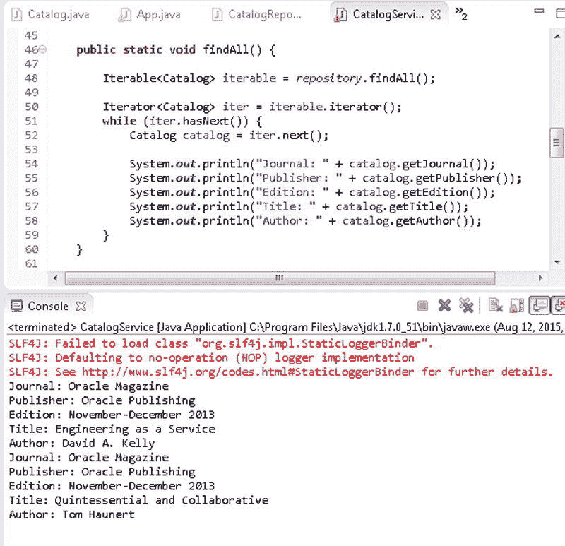

Figure 10-24. 查找所有文档

### 查找一个文档

作为在 `MongoRepository` 中使用 `findOne()` 方法的示例，查找特定 ID 的实体实例（该 ID 已知存在于 MongoDB 数据库中）。随后输出该实体实例的字段值。`CatalogService` 类中的 `findOne()` 方法如下所示。

```
public static void findOne(String id) {
    Catalog catalog = repository.findOne(id);
    System.out.println("Journal: " + catalog.getJournal());
    System.out.println("Publisher: " + catalog.getPublisher());
    System.out.println("Edition: " + catalog.getEdition());
    System.out.println("Title: " + catalog.getTitle());
    System.out.println("Author: " + catalog.getAuthor());
}
```

使用之前保存的特定 ID，从 `main` 方法调用 `findOne()` 方法。

```
if (repository.exists("53ea75e336845ce83eeb214f")) {
    findOne("53ea75e336845ce83eeb214f");
}
```

实体实例的字段值在 Eclipse 控制台中输出，如 Figure 10-25 所示。

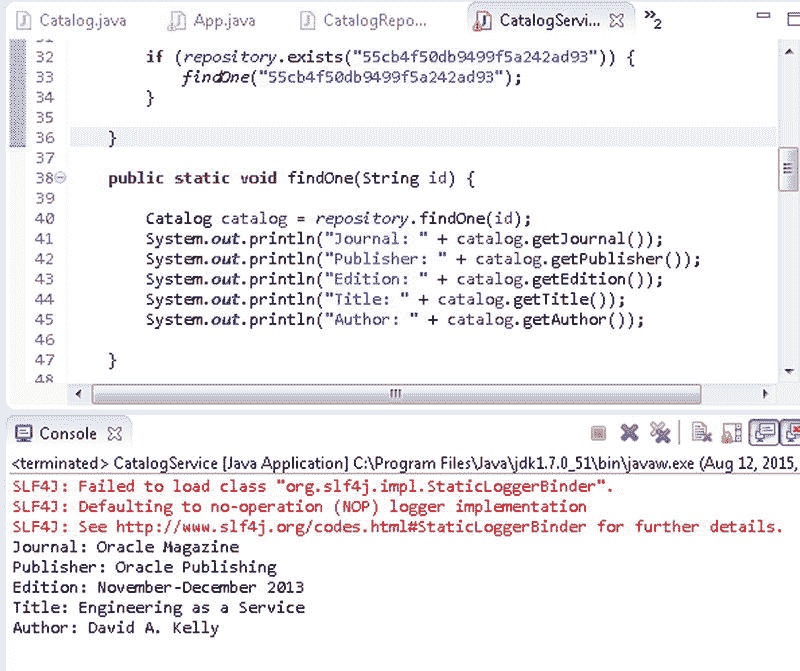

Figure 10-25. 查找一个文档

### 保存实体

`MongoRepository` 接口提供了以下方法（Table 10-19）用于通过仓库保存文档。

Table 10-19. 用于保存文档的 MongoRepository 方法

| 方法 | 描述 |
| --- | --- |
| `<S extends T> S save(S entity)` | 保存给定的实体。如果实体已在服务器中，则覆盖该实体。返回已保存的实体实例。 |
| `<S extends T> Iterable<S> save(Iterable<S> entities)` | 保存给定的实体集合。如果某个实体已在服务器中，则覆盖该实体。返回已保存的实体实例。 |

#### 保存单个文档

作为示例，使用 `save(S entity)` 方法创建并保存一个实体实例。

1.  在 `CatalogService` 类的 `save()` 方法中创建一个 `Catalog` 实例。ID 字段参数可以是空字符串，因为 `_id` 字段是自动生成的。
2.  随后，使用 `Catalog` 实例作为方法参数调用 `save()` 方法。

要查找已保存的文档，请在 `CatalogService` 中调用 `findAll()` 方法。`CatalogService` 中的 `save()` 方法如下。

```
public static void save() {
    Catalog catalog = new Catalog("", "Oracle Magazine",
        "Oracle Publishing", "11-12-2013", "Engineering as a Service", "Kelly, David");
    repository.save(catalog);
    findAll();
}
```

3.  从 `main` 方法调用 `save()` 方法以保存 `Catalog` 实例，随后查找并列出文档的字段值，如 Figure 10-26 所示。

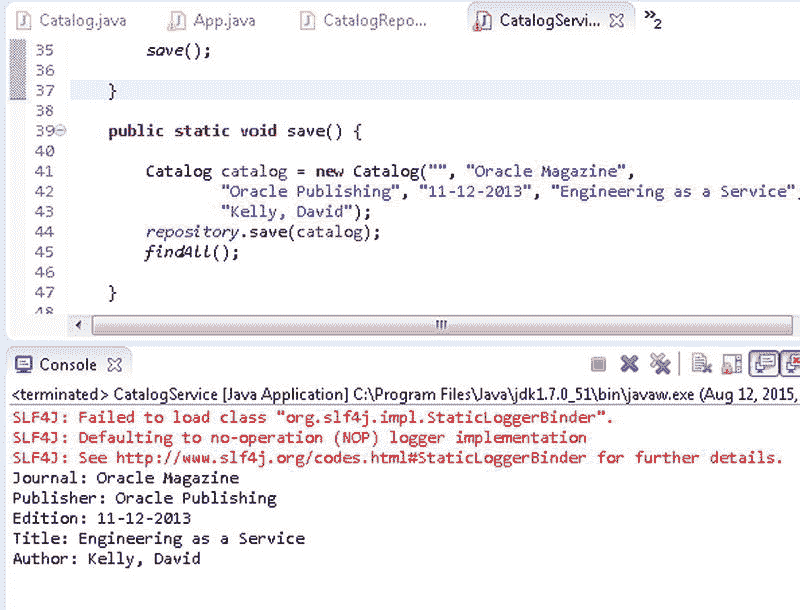

Figure 10-26. 保存一个文档

#### 保存一批文档

作为使用 `save(Iterable<S> entities)` 方法的示例，在 `CatalogService` 应用程序的 `saveBatch()` 方法中创建一个实体实例的 `ArrayList`。使用 `ArrayList` 实例作为参数调用 `save(Iterable<S> entities)` 方法。

```
repository.save(arrayList);
```

随后调用 `findAll()` 方法查找所有已保存的实体。`saveBatch()` 方法如下。

```
public static void saveBatch() {
    Catalog catalog1 = new Catalog("", "Oracle Magazine",
        "Oracle Publishing", "11-12-2013", "Engineering as a Service",
        "Kelly, David");
    Catalog catalog2 = new Catalog("", "Oracle Magazine",
        "Oracle Publishing", "11-12-2013",
        "Quintessential and Collaborative", "Haunert, Tom");
    entities = new ArrayList<Catalog>();
    entities.add(catalog1);
    entities.add(catalog2);
    repository.save(entities);
    findAll();
}
```

从 `main` 方法调用 `saveBatch()` 方法。在运行 `CatalogService` 应用程序之前，请使用 Mongo shell 中的 `db.catalog.drop()` 方法删除先前创建的 `catalog` 集合。当 `CatalogService` 应用程序运行时，`ArrayList` 中的实体实例集合会被添加到 MongoDB 服务器。已保存的 `Catalog` 实体字段值会输出到 Eclipse 控制台，如 Figure 10-27 所示。

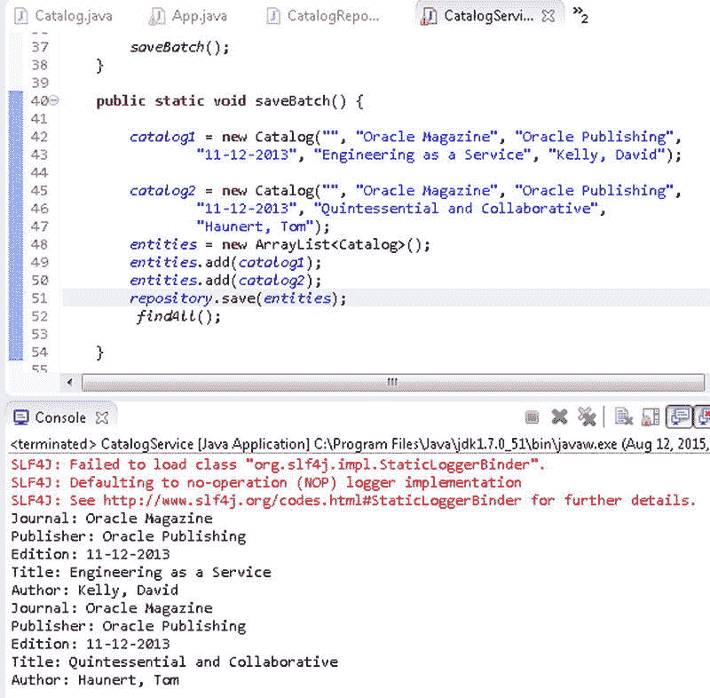

Figure 10-27. 保存一批文档

### 删除实体

`MongoRepository` 接口提供了以下方法（Table 10-20）用于通过仓库删除文档。

Table 10-20. 用于删除文档的 MongoRepository 方法

| 方法 | 描述 |
| --- | --- |
| `void delete(ID id)` | 删除由仓库管理的具有给定 ID 的实体。 |
| `void delete(T entity)` | 删除由仓库管理的指定实体。 |
| `void delete(Iterable<? extends T> entities)` | 删除由仓库管理的在指定 `Iterable` 中的实体。 |
| `void deleteAll()` | 删除由仓库管理的所有实体。 |

#### 按 ID 删除文档

作为使用 `delete(ID id)` 方法的示例，在 `CatalogService` 应用程序的 `deleteById()` 方法中删除已知存在于 MongoDB 服务器中的具有特定 ID 的实体。

首先，在 `deleteById()` 方法中保存一些文档。为已保存的 `Catalog` 实体使用类变量 `catalog1` 和 `catalog2`。在 `deleteById()` 方法中，使用其中一个已保存文档的 ID 作为方法参数，调用 `CatalogRepository` 实例的 `delete(ID id)` 方法。文档的 ID 使用 `getId()` 方法获取。随后调用 `findAll()` 方法查找所有文档。

```
public static void deleteById() {
    //Add documents
    repository.delete(catalog1.getId());
    findAll();
}
```

在 `CatalogService` 的 `main` 方法中调用 `deleteById()` 方法。


### 删除文档

```java
deleteById();
```

运行`CatalogService`应用时，指定`Id`的`Catalog`实例将被删除。之后调用`findAll()`方法将只列出一个已保存的文档，如图 10-28 所示。

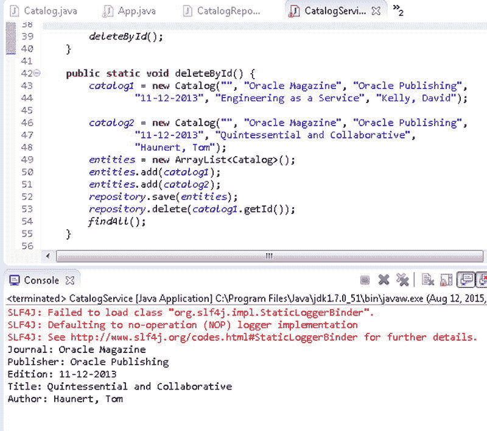

图 10-28. 按 Id 删除文档

### 删除所有文档

以使用`deleteAll()`方法为例，首先在`CatalogService`的`deleteAll()`方法中添加一批文档。随后调用`CatalogRepository`实例的`deleteAll()`方法。接着调用`findAll()`方法来查找所有文档。

```java
public static void deleteAll() {
    //添加文档
    repository.deleteAll();
    findAll();
}
```

在`CatalogService`的`main`方法中调用`deleteAll()`方法。

```java
deleteAll();
```

运行`CatalogService`应用时，一批文档会被保存，随后`deleteAll()`方法将删除所有已保存的文档。接着调用`findAll()`方法将找不到并列出任何文档，因为所有文档都已被删除，如图 10-29 所示。

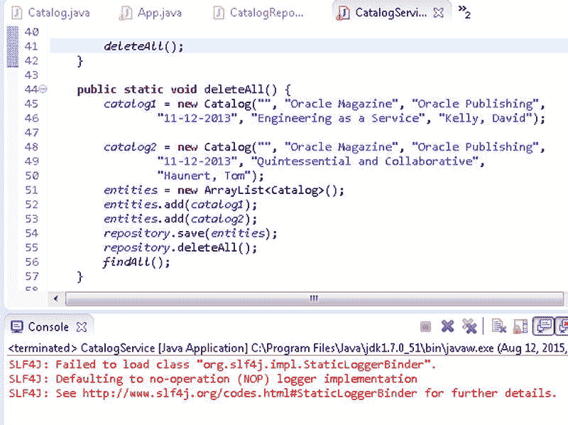

图 10-29. 删除所有文档

`CatalogService`类如下所列：

```java
package com.mongo.service;

import java.util.ArrayList;
import java.util.Iterator;

import org.springframework.context.ApplicationContext;
import org.springframework.context.annotation.AnnotationConfigApplicationContext;
import com.mongo.config.SpringMongoApplicationConfig;
import com.mongo.model.Catalog;
import com.mongo.repositories.CatalogRepository;

public class CatalogService {

    public static CatalogRepository repository;
    public static ArrayList<Catalog> entities;
    public static Catalog catalog1;
    public static Catalog catalog2;

    public static void main(String[] args) {

        ApplicationContext context = new AnnotationConfigApplicationContext(
                SpringMongoApplicationConfig.class);
        repository = context.getBean(CatalogRepository.class);
        // saveBatch();
        // count();
        // findAll();
        // saveBatch();
        // deleteAll();
        // deleteById();
        /*
         * if (repository.exists("55cb4f50db9499f5a242ad93")) {
         * findOne("55cb4f50db9499f5a242ad93"); }
         */
        // save();

        // saveBatch();

        // deleteById();
        deleteAll();
    }

    public static void deleteAll() {
        catalog1 = new Catalog("", "Oracle Magazine", "Oracle Publishing",
                "11-12-2013", "Engineering as a Service", "Kelly, David");

        catalog2 = new Catalog("", "Oracle Magazine", "Oracle Publishing",
                "11-12-2013", "Quintessential and Collaborative",
                "Haunert, Tom");
        entities = new ArrayList<Catalog>();
        entities.add(catalog1);
        entities.add(catalog2);
        repository.save(entities);
        repository.deleteAll();
        findAll();
    }

    public static void deleteById() {
        catalog1 = new Catalog("", "Oracle Magazine", "Oracle Publishing",
                "11-12-2013", "Engineering as a Service", "Kelly, David");

        catalog2 = new Catalog("", "Oracle Magazine", "Oracle Publishing",
                "11-12-2013", "Quintessential and Collaborative",
                "Haunert, Tom");
        entities = new ArrayList<Catalog>();
        entities.add(catalog1);
        entities.add(catalog2);
        repository.save(entities);
        repository.delete(catalog1.getId());
        findAll();
    }

    public static void saveBatch() {

        catalog1 = new Catalog("", "Oracle Magazine", "Oracle Publishing",
                "11-12-2013", "Engineering as a Service", "Kelly, David");

        catalog2 = new Catalog("", "Oracle Magazine", "Oracle Publishing",
                "11-12-2013", "Quintessential and Collaborative",
                "Haunert, Tom");
        entities = new ArrayList<Catalog>();
        entities.add(catalog1);
        entities.add(catalog2);
        repository.save(entities);
        findAll();

    }

    public static void save() {

        Catalog catalog = new Catalog("", "Oracle Magazine",
                "Oracle Publishing", "11-12-2013", "Engineering as a Service",
                "Kelly, David");
        repository.save(catalog);
        findAll();
    }

    public static void findOne(String id) {

        Catalog catalog = repository.findOne(id);
        System.out.println("Journal: " + catalog.getJournal());
        System.out.println("Publisher: " + catalog.getPublisher());
        System.out.println("Edition: " + catalog.getEdition());
        System.out.println("Title: " + catalog.getTitle());
        System.out.println("Author: " + catalog.getAuthor());

    }

    public static void count() {
        System.out.println("Number of documents: " + repository.count());

    }

    public static void findAll() {

        Iterable<Catalog> iterable = repository.findAll();

        Iterator<Catalog> iter = iterable.iterator();
        while (iter.hasNext()) {
            Catalog catalog = iter.next();

            System.out.println("Journal: " + catalog.getJournal());
            System.out.println("Publisher: " + catalog.getPublisher());
            System.out.println("Edition: " + catalog.getEdition());
            System.out.println("Title: " + catalog.getTitle());
            System.out.println("Author: " + catalog.getAuthor());
        }
    }

}
```

## 总结

在本章中，我们使用了 Spring Data MongoDB 项目与 MongoDB 服务器。对 MongoDB 数据存储的常见 CRUD 操作可以通过`org.springframework.data.mongodb.core.MongoOperations`接口和`org.springframework.data.mongodb.repository.MongoRepository`来执行。本章我们讨论了使用这两个接口对 MongoDB 进行 CRUD 操作。在下一章中，我们将讨论 MongoDB 与 Hadoop 的集成，并在 MongoDB 之上创建一个 Apache Hive 表。

## 第十一章


## 使用 MongoDB 创建 Apache Hive 表

MongoDB 是领先的 NoSQL 数据库。MongoDB 基于 BSON（二进制 JSON）文档格式，该格式基于动态模式，提供了存储的灵活性。Hive MongoDB 存储处理器使得从 Apache Hive 访问 MongoDB 变得可行。可以在 MongoDB 文档存储上创建一个 Hive 外部表。在本章中，我们将在 MongoDB 中创建一个文档存储，然后在该 MongoDB 文档存储上创建一个 Hive 外部表。

Apache Hadoop 是一个用于大规模数据集分布式处理的框架。Apache Hadoop 文件系统是 Hadoop 分布式文件系统（HDFS）。Apache Hive 是一个用于查询和管理存储在分布式存储上的大型数据集的软件，默认是 HDFS。本章假设读者具备 Apache Hadoop（参考：`https://hadoop.apache.org/`）和 Apache Hive（参考：`https://hive.apache.org/`）的知识，因为我们不会讨论 HDFS 是什么或 HDFS 如何为 Hive 存储数据。我们还将使用一些 Hadoop shell 命令。本章包括以下主题：

*   Hive MongoDB 存储处理器概述
*   设置环境
*   创建 MongoDB 数据存储
*   在 Hive 中创建外部表

### Hive MongoDB 存储处理器概述

Apache Hive 支持两种类型的表：*managed*表和*external*表。


