# Hive 管理表与外部表及 MongoDB 存储处理器

Hive 管理表与外部表的区别在于，管理表由 Hive 管理，这意味着表的元数据和数据都由 Hive 管理。对于外部表，Hive 只管理元数据，而不管理表数据。如果删除一个 Hive 管理表，数据和元数据都会被删除。但如果删除一个 Hive 外部表，则只会删除元数据，而不会删除表数据。Hive 外部表适用于数据存储在外部数据源（如 MongoDB 数据库）中的场景。本节我们将介绍 Hive MongoDB 存储处理器，它用于在 MongoDB 数据库上创建 Hive 外部表。

Hive 的 MongoDB 存储处理器类是`org.yong3.hive.mongo.MongoStorageHandler`。该存储处理器仅支持 Hive 原始类型，如`int`和`string`。MongoDB 存储处理器提供了 serde 属性`mongo.column.mapping`，用于指定要映射到 Hive 外部表的 MongoDB 数据存储列名。此外，还支持以下`tblproperties`属性（见表 11-1）。

表 11-1. Mongo 存储处理器属性

| 属性 | 描述 |
| --- | --- |
| `mongo.host` | MongoDB 主机名。 |
| `mongo.port` | MongoDB 端口。 |
| `mongo.db` | MongoDB 数据库。 |
| `mongo.user` | MongoDB 用户名。 |
| `mongo.passwd` | MongoDB 密码。 |
| `mongo.collection` | MongoDB 集合。 |

## 环境设置

本章需要以下软件：

*   Hadoop 2.0.0 CDH 4.6
*   Hive 0.10.0 CDH 4.6
*   MongoDB Java Driver 2.11.3
*   MongoDB Storage Handler for Hive 0.0.3
*   MongoDB 2.6.3
*   Eclipse IDE for Java EE Developers
*   Java 7

也可以使用所列软件的更高版本。从`https://github.com/yc-huang/Hive-mongo`下载 MongoDB 存储处理器，并将 zip 文件解压到一个目录。包含存储处理器的 Jar 文件位于`Hive-mongo-master/release`目录中。使用`hive-mongo-0.0.3-jar-with-dependencies.jar`文件，其中包含了所有必需的依赖项。从`http://central.maven.org/maven2/org/mongodb/mongo-java-driver/`下载 MongoDB Java 驱动程序 Jar 文件`mongo-java-driver-2.11.3.jar`或更高版本。

完成以下步骤来设置环境：

1.  我们使用了安装在 Oracle VirtualBox 4.3 上的 Oracle Linux 6.5。但也可以使用不同的 Linux 发行版。Oracle Linux 基于 RedHat Linux，是最常用的 Linux 发行版之一。创建 MongoDB 和其他软件的目录并设置权限。

    ```
    mkdir /mongodb
    chmod -R 777 /mongodb
    cd /mongodb
    ```

2.  下载 Java 7 并将文件解压到`/mongodb`目录。

    ```
    tar zxvf jdk-7u55-linux-i586.gz
    ```

3.  下载 Hadoop 2.0.0 并将`tar.gz`文件解压到一个目录。

    ```
    wget http://archive.cloudera.com/cdh4/cdh/4/hadoop-2.0.0-cdh4.6.0.tar.gz
    tar -xvf hadoop-2.0.0-cdh4.6.0.tar.gz
    ```

4.  为 Hadoop 的`bin`和`conf`目录创建符号链接。

    ```
    ln -s /mongodb/hadoop-2.0.0-cdh4.6.0/bin /oranosql/hadoop-2.0.0-cdh4.6.0/share/hadoop/mapreduce2/bin
    ln -s /mongodb/hadoop-2.0.0-cdh4.6.0/etc/hadoop /oranosql/hadoop-2.0.0-cdh4.6.0/share/hadoop/mapreduce2/conf
    ```

5.  在`core-site.xml`和`hdfs-site.xml`配置文件中配置 Hadoop。在下面列出的`core-site.xml`中，设置`fs.defaultFS`和`hadoop.tmp.dir`属性。

    ```
    <?xml-stylesheet type="text/xsl" href="configuration.xsl"?>
    <!-- Put site-specific property overrides in this file. -->
    <configuration>
    <property>
      <name>fs.defaultFS</name>
        <value>hdfs://10.0.2.15:8020</value>
    </property>
    <property>
        <name>hadoop.tmp.dir</name>
        <value>file:///var/lib/hadoop-0.20/cache</value>
    </property>
    </configuration>
    ```

6.  创建为`hadoop.tmp.dir`属性指定的目录，并将其权限设置为全局（`777`）。

    ```
    mkdir -p /var/lib/hadoop-0.20/cache
    chmod -R 777 /var/lib/hadoop-0.20/cache
    ```

7.  在下面列出的`hdfs-site.xml`配置文件中，设置`dfs.permissions.superusergroup`、`dfs.namenode.name.dir`、`dfs.replication`和`dfs.permissions`属性。

    ```
    <?xml version="1.0" encoding="UTF-8"?>
    <?xml-stylesheet type="text/xsl" href="configuration.xsl"?>
    <!-- Put site-specific property overrides in this file. -->
    <configuration>
    <property>
      <name>dfs.permissions.superusergroup</name>
      <value>hadoop</value>
    </property>
    <property>
      <name>dfs.namenode.name.dir</name>
      <value>file:///data/1/dfs/nn</value>
    </property>
    <property>
      <name>dfs.replication</name>
      <value>1</value>
    </property>
    <property>
      <name>dfs.permissions</name>
      <value>false</value>
    </property>
    </configuration>
    ```

8.  创建 NameNode 存储目录并设置其权限。

    ```
    mkdir -p /data/1/dfs/nn
    chmod -R 777 /data/1/dfs/nn
    ```

9.  下载并安装 Hive 0.10.0 CDH 4.6。

    ```
    wget http://archive.cloudera.com/cdh4/cdh/4/hive-0.10.0-cdh4.6.0.tar.gz
    tar -xvf hive-0.10.0-cdh4.6.0.tar.gz
    ```

10. 从模板创建`hive-site.xml`文件。

    ```
    cd /mongodb/hive-0.10.0-cdh4.6.0/conf
    cp hive-default.xml.template hive-site.xml
    ```

11. 默认情况下，Hive 使用嵌入式元存储。我们将使用远程元存储，为此需要将`hive.metastore.uris`属性配置为远程元存储的 URI。同时将`hive.metastore.warehouse.dir`属性设置为 Hive 存储目录，即存储 Hive 数据库和表的目录。`hive-site.xml`配置文件如下：

    ```
    <?xml version="1.0"?>
    <?xml-stylesheet type="text/xsl" href="configuration.xsl"?>
    <configuration>
    <property>
      <name>hive.metastore.warehouse.dir</name>
      <value>hdfs://10.0.2.15:8020/user/hive/warehouse</value>
    </property>
    <property>
      <name>hive.metastore.uris</name>
      <value>thrift://localhost:10000</value>
    </property>
    </configuration>
    ```

12. 创建在`hive.metastore.warehouse.dir`属性中指定的 HDFS 路径目录并设置其权限。

    ```
    hadoop dfs -mkdir hdfs://10.0.2.15:8020/user/hive/warehouse
    hadoop dfs -chmod -R g+w hdfs://10.0.2.15:8020/user/hive/warehouse
    ```

13. 下载并解压 MongoDB 2.6.3 文件。

    ```
    curl -O http://downloads.mongodb.org/linux/mongodb-linux-i686-2.6.3.tgz
    tar -zxvf mongodb-linux-i686-2.6.3.tgz
    ```

14. 将`mongo-java-driver-2.6.3.jar`和`hive-mongo-0.0.3-jar-with-dependencies.jar`复制到`/mongodb/hive-0.10.0-cdh4.6.0/lib`目录。在 bash shell 中设置 Hadoop、Hive、Java 和 MongoDB 的环境变量。

    ```
    vi ~/.bashrc
    export HADOOP_PREFIX=/mongodb/hadoop-2.0.0-cdh4.6.0
    export HADOOP_CONF=$HADOOP_PREFIX/etc/hadoop
    export MONGO_HOME=/mongodb/mongodb-linux-i686-2.6.3
    export HIVE_HOME=/mongodb/hive-0.10.0-cdh4.6.0
    export HIVE_CONF=$HIVE_HOME/conf
    export JAVA_HOME=/mongodb/jdk1.7.0_55
    export HADOOP_MAPRED_HOME=/mongodb/hadoop-2.0.0-cdh4.6.0/bin
    export HADOOP_HOME=/mongodb/hadoop-2.0.0-cdh4.6.0/share/hadoop/mapreduce2
    export HADOOP_CLASSPATH=$HADOOP_HOME/*:$HADOOP_HOME/lib/*:$HIVE_HOME/lib/*:/mongodb/mongo-java-driver-2.6.3.jar:/mongodb/hive-mongo-0.0.3-jar-with-dependencies.jar
    export PATH=$PATH:$JAVA_HOME/bin:$HADOOP_PREFIX/bin:$HIVE_HOME/bin:$MONGO_HOME/bin
    ```


```markdown
## Hadoop 和 Hive 配置
`jar:/mongodb/hive-mongo-0.0.3-jar-with-dependencies.jar:$HIVE_CONF`
`export PATH=$PATH:$HADOOP_HOME/bin:$HADOOP_MAPRED_HOME::$HIVE_HOME/bin:$MONGO_HOME/bin`

### 15. 格式化 NameNode 并启动 HDFS
格式化 NameNode 并启动 HDFS，HDFS 包含 NameNode 和 DataNode。

```bash
hadoop namenode -format
hadoop namenode
hadoop datanode
```

### 16. 在 HDFS 中创建目录
在 HDFS 中创建一个目录（并设置其权限），用于存放 Hive 目录，以使 Hive 在运行时类路径中可用。

```bash
hdfs dfs -mkdir hdfs://localhost:8020/mongodb
hadoop dfs -chmod -R g+w hdfs://localhost:8020/mongodb
```

### 17. 将 Hive 目录放入 HDFS
```bash
hdfs dfs -put /mongodb/hive-0.10.0-cdh4.6.0 hdfs://localhost:8020/mongodb
```

### 创建 MongoDB 数据存储
在本节中，我们将创建一个 MongoDB 数据存储。我们将在 MongoDB 中存储以下示例日志（取自 WebLogic Server）。
```
Apr-8-2014-7:06:16-PM-PDT Notice WebLogicServer AdminServer BEA-000365 Server state changed to STANDBY
Apr-8-2014-7:06:17-PM-PDT Notice WebLogicServer AdminServer BEA-000365 Server state changed to STARTING
Apr-8-2014-7:06:18-PM-PDT Notice WebLogicServer AdminServer BEA-000360 Server started in RUNNING mode
```

### 1. 启动 MongoDB 服务器
使用以下命令启动 MongoDB 服务器以便能够访问 MongoDB。

```bash
mongod
```

MongoDB 启动。`mongod` 命令的输出如下：

```
[root@localhost mongodb]# mongod
mongod --help for help and startup options
2014-06-22T12:18:56.908-0400
2014-06-22T12:18:56.918-0400 warning: 32-bit servers don’t have journaling enabled by default. Please use --journal if you want durability.
2014-06-22T12:18:56.920-0400
2014-06-22T12:18:57.112-0400 [initandlisten] MongoDB starting : pid=2610 port=27017 dbpath=/data/db 32-bit host=localhost.oraclelinux
2014-06-22T12:18:57.117-0400 [initandlisten]
2014-06-22T12:18:57.119-0400 [initandlisten] ** NOTE: This is a 32 bit MongoDB binary.
2014-06-22T12:18:57.124-0400 [initandlisten] **       32 bit builds are limited to less than 2GB of data (or less with --journal).
2014-06-22T12:18:57.129-0400 [initandlisten] **       Note that journaling defaults to off for 32 bit and is currently off.
2014-06-22T12:18:57.130-0400 [initandlisten] **       See http://dochub.mongodb.org/core/32bit
2014-06-22T12:18:57.136-0400 [initandlisten]
2014-06-22T12:18:57.153-0400 [initandlisten] db version v2.6.3
2014-06-22T12:18:57.167-0400 [initandlisten] git version: 255f67a66f9603c59380b2a389e386910bbb52cb
2014-06-22T12:18:57.203-0400 [initandlisten] build info: Linux ip-10-225-17-11 2.6.18-194.32.1.el5xen #1 SMP Mon Dec 20 11:08:09 EST 2010 i686 BOOST_LIB_VERSION=1_49
2014-06-22T12:18:57.206-0400 [initandlisten] allocator: system
2014-06-22T12:18:57.206-0400 [initandlisten] options: {}
2014-06-22T12:18:58.582-0400 [initandlisten] waiting for connections on port 27017
```

### 2. 在 Eclipse IDE 中启动
接下来，我们将在 Eclipse IDE 中使用 Java 应用程序创建一个 MongoDB 数据存储。从 Eclipse 安装目录启动 Eclipse IDE。

```bash
./eclipse
```

### 3. 创建 Java 项目
点击 `File` > `New`。在 `New` 窗口中，选择 `Java` > `Java Project` 并点击 `Next`，如图 11-1 所示。
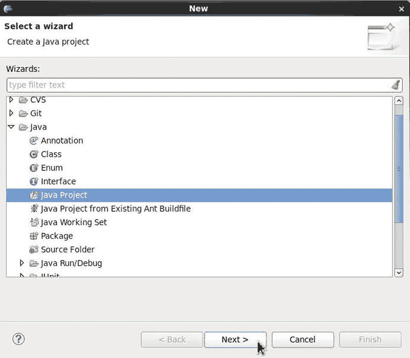
**图 11-1**. 选择 `Java` > `Java Project`

### 4. 指定项目名称
在 `New Java Project` 中，指定一个项目名称 (`MongoDB`)，选择 `Use default location`，选择一个 JRE，然后点击 `Next`，如图 11-2 所示。
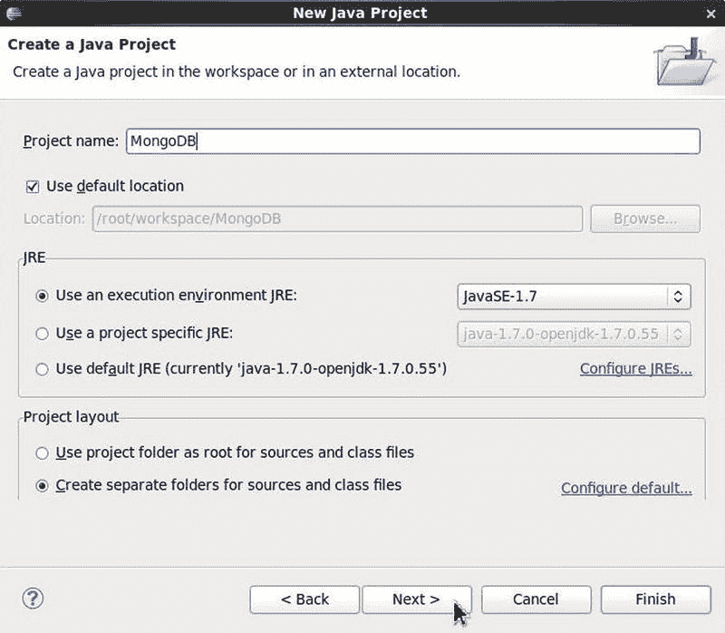
**图 11-2**. 创建 Java 项目

### 5. 配置输出文件夹
在 `Java Settings` 中，选择 `Allow output folders for source folders`。默认文件夹名称预设为 `MongoDB/bin`，如图 11-3 所示。
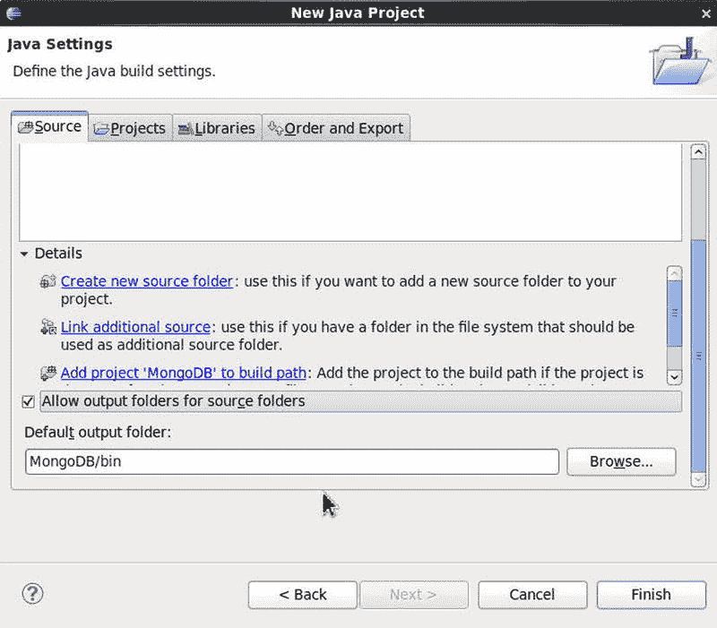
**图 11-3**. 配置输出文件夹

### 6. 配置源文件夹
源文件夹也预选为 `MongoDB/src`，如图 11-4 所示。点击 `Finish`。
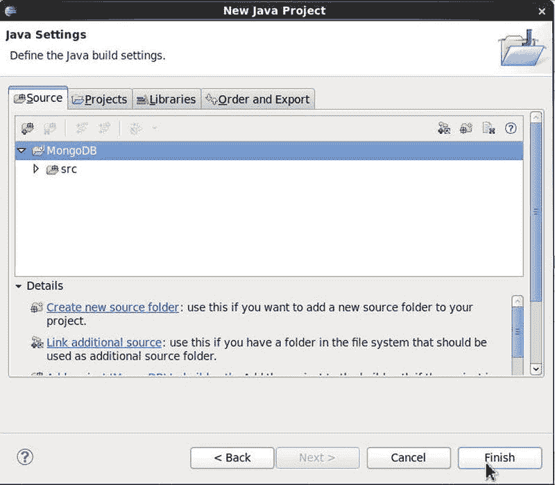
**图 11-4**. 配置源文件夹
一个名为 MongoDB 的 Java 项目被创建，如图 11-5 所示。
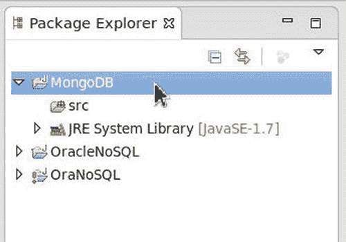
**图 11-5**. Java 项目 MongoDB

### 7. 打开项目属性
我们需要将 MongoDB Java 驱动 Jar 文件添加到项目的 Java Build Path 中。右键单击 MongoDB 项目节点并选择 `Properties`，如图 11-6 所示。
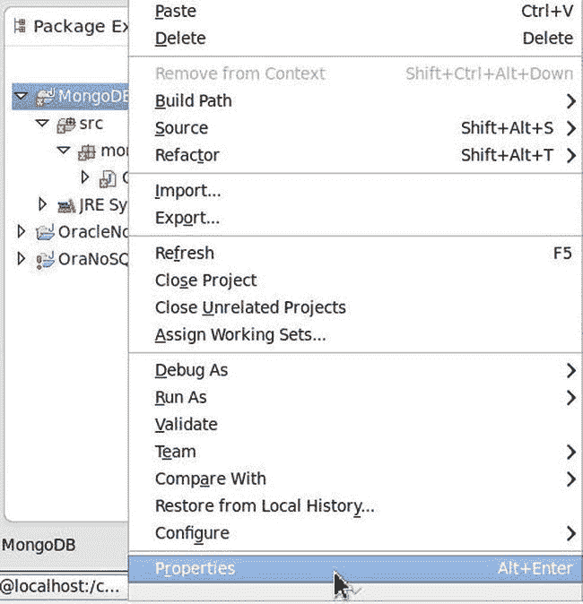
**图 11-6**. 为 MongoDB 项目选择属性

### 8. 添加 MongoDB Java 驱动
在 `Properties for MongoDB` 中，选择 `Java Build Path` 并点击 `Add External JARs` 以添加 MongoDB Java 驱动 jar 文件 `mongo-java-driver-2.11.3.jar`，如图 11-7 所示。点击 `OK`。
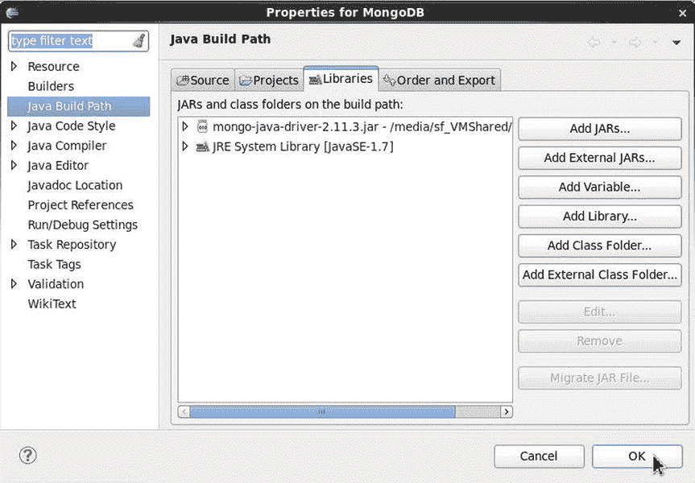
**图 11-7**. 将 MongoDB Java 驱动添加到类路径

### 9. 新建 Java 类向导
接下来，向 Java 项目添加一个 Java 类。选择 `File` > `New`，在 `New` 窗口中选择 `Java` > `Class` 向导并点击 `Next`，如图 11-8 所示。
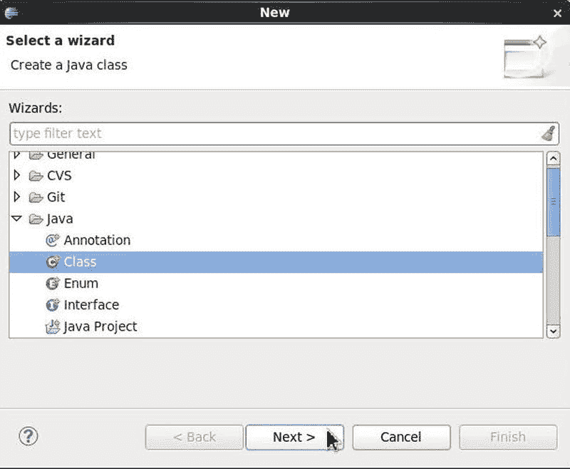
**图 11-8**. 选择 `Java` > `Class`

### 10. 创建 Java 类
在 `New Java Class` 中，源文件夹预设为 `MongoDB/src`。指定包名称 `mongodb`。指定类名称 `CreateMongoDBDocument`，如图 11-9 所示。选择 `main` 方法存根添加到类中，然后点击 `Finish`。
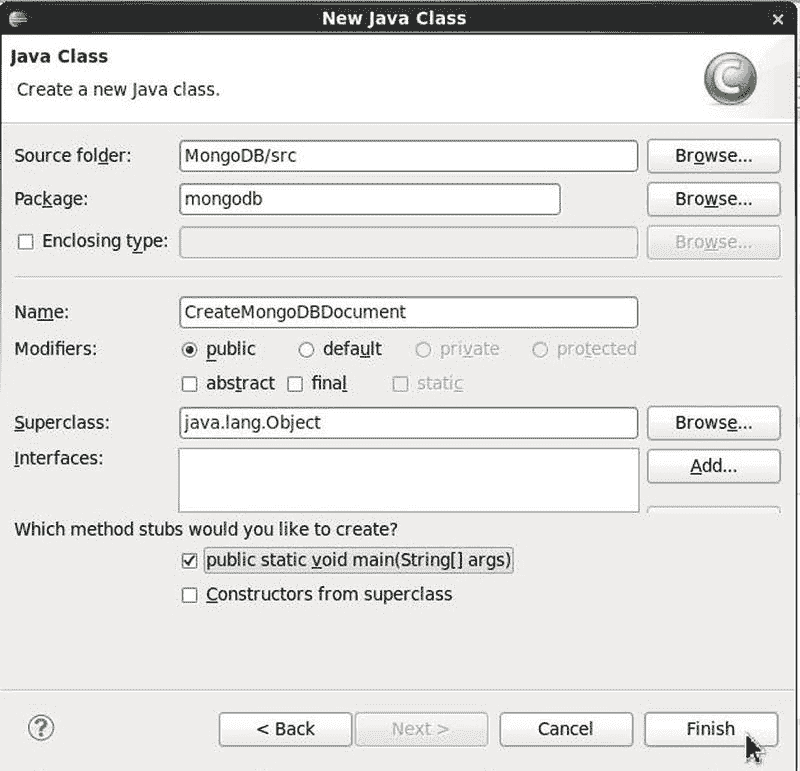
**图 11-9**. 创建 Java 类
一个 Java 源文件 `CreateMongoDBDocument.java` 被添加到 MongoDB 项目中，如图 11-10 所示。
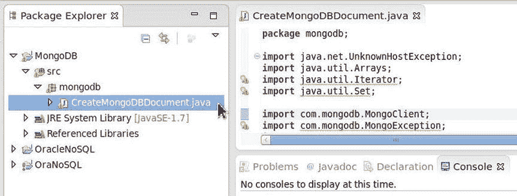
**图 11-10**. Java 项目中的 Java 类
总而言之，要向 MongoDB 服务器添加文档，首先需要建立到 MongoDB 的连接。随后，创建 MongoDB 数据库实例的 Java 类表示，并创建 MongoDB 集合的 Java 类表示。创建一个 MongoDB 文档的 Java 类表示，并将该文档添加到集合中。

### 11. 连接到 MongoDB
到 MongoDB 的连接由 `com.mongodb.MongoClient` 类表示。请遵循以下步骤：
1. 使用 `MongoClient(List<ServerAddress> seeds)` 构造函数创建 `MongoClient` 的实例。
2. 使用主机名 `10.0.2.15` 和端口 `27017` 创建一个 `List<ServerAddress>`。
3. MongoDB 服务器上的逻辑数据库由 `com.mongodb.DB` 类表示。使用 `MongoClient` 中的 `getDB(String dbname)` 方法创建一个 DB 实例，数据库名称为 `test`。
4. `DBCollection` 类表示数据库中文档对象的集合。使用 `MongoClient` 方法 `createCollection(String name, DBObject options)` 创建一个 `DBCollection` 实例。
```


## 创建 MongoDB 文档对象

数据库集合中的 BSON 文档对象由`DBObject`接口表示。`BasicDBObject`类实现了`DBObject`接口，并提供了用于创建键/值文档对象的构造函数。使用`BasicDBObject(String key, Object value)`构造函数创建文档对象，并使用`append(String key, Object val)`方法向对象添加键/值对。`BasicDBObject`的一个实例代表数据库集合中的一个文档对象。需要从日志数据创建三个`BasicDBObject`实例，以添加到 MongoDB 数据库集合中。

`DBCollection`类提供了重载的插入方法，用于将`BasicDBObject`实例添加到集合中。使用`insert(DBObject... arr)`方法将`BasicDBObject`实例添加到`DBCollection`。

要在集合中查找文档对象，请在`DBCollection`对象上调用`findOne()`方法。

### `CreateMongoDBDocument`类

```java
package mongodb;

import com.mongodb.MongoClient;
import com.mongodb.DB;
import import com.mongodb.DBCollection;
import com.mongodb.BasicDBObject;
import com.mongodb.DBObject;
import com.mongodb.ServerAddress;
import java.util.Arrays;
import java.net.UnknownHostException;

public class CreateMongoDBDocument {
    public static void main(String[] args) {
        try {
            MongoClient mongoClient = new MongoClient(
                    Arrays.asList(new ServerAddress("10.0.2.15", 27017)));
            DB db = mongoClient.getDB("test");
            DBCollection coll = db.createCollection("wlslog", null);

            BasicDBObject row1 = new BasicDBObject("TIME_STAMP",
                    "Apr-8-2014-7:06:16-PM-PDT").append("CATEGORY", "Notice")
                    .append("TYPE", "WebLogicServer")
                    .append("SERVERNAME", "AdminServer")
                    .append("CODE", "BEA-000365").append("MSG", "Server state changed to STANDBY");
            coll.insert(row1);

            BasicDBObject row2 = new BasicDBObject("TIME_STAMP",
                    "Apr-8-2014-7:06:17-PM-PDT").append("CATEGORY", "Notice")
                    .append("TYPE", "WebLogicServer")
                    .append("SERVERNAME", "AdminServer")
                    .append("CODE", "BEA-000365").append("MSG", "Server state changed to STARTING");
            coll.insert(row2);

            BasicDBObject row3 = new BasicDBObject("TIME_STAMP",
                    "Apr-8-2014-7:06:18-PM-PDT").append("CATEGORY", "Notice")
                    .append("TYPE", "WebLogicServer")
                    .append("SERVERNAME", "AdminServer")
                    .append("CODE", "BEA-000360").append("MSG", "Server started in RUNNING mode");
            coll.insert(row3);

            DBObject catalog = coll.findOne();
            System.out.println(row1);

        } catch (UnknownHostException e) {
            e.printStackTrace();
        }
    }
}
```

### 运行应用程序

要将 BSON 文档对象添加到 MongoDB，请运行 Java 应用程序。右键单击`CreateMongoDBDocument.java`源文件，然后选择 **运行方式**  **Java 应用程序**，如图 11-11 所示。

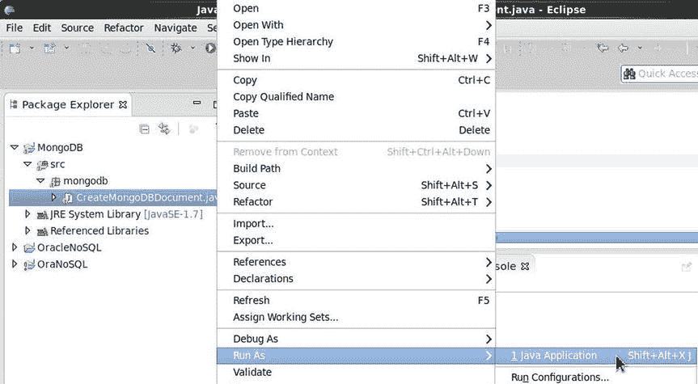

**图 11-11**. 运行 Java 应用程序 `CreateMongoDBDocument.java`

这样就创建了一个 MongoDB 文档存储。

添加到文档存储的其中一个文档对象会在 Eclipse IDE 控制台中输出，如图 11-12 所示。

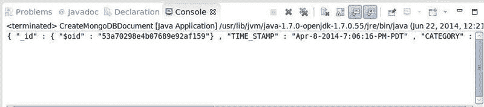

**图 11-12**. 添加的 MongoDB 对象

每个 BSON 文档对象会自动添加一个`_id`键。

```json
{
  "_id" : { "$oid" : "53a6cf25e4b09cac451ef1d6" },
  "TIME_STAMP" : "Apr-8-2014-7:06:16-PM-PDT",
  "CATEGORY" : "Notice",
  "TYPE" : "WebLogicServer",
  "SERVERNAME" : "AdminServer",
  "CODE" : "BEA-000365",
  "MSG" : "Server state changed to STANDBY"
}
```

### 在 Hive 中创建外部表

创建了 MongoDB 数据存储后，我们将使用 Hive MongoDB Storage Handler 在该数据存储上创建一个 Hive 外部表。MongoDB 存储处理器的`TBLPROPERTIES`需要`mongo.user`和`mongo.password`属性，因此我们需要先创建一个用户。我们将首先创建一个 MongoDB 用户，然后继续创建外部表。

1.  使用以下命令启动 MongoDB 服务器 shell。
    ```shell
    >mongod
    ```

2.  创建另一个用户的用户必须具有`createUser`操作权限。首先，创建一个具有`createUser`操作权限的管理员用户。`use admin`命令将数据库设置为`admin`。使用`db.addUser()`或`db.createUser()`方法添加一个名为`hive`的用户。使用`db.auth()`方法对管理员用户进行身份验证。
    ```shell
    >use admin
    >db.addUser('hive', 'hive');
    >db.auth('hive','hive');
    ```
    Mongo shell 命令的输出如图 11-13 所示。
    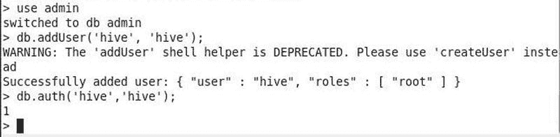
    **图 11-13**. 运行 Mongo Shell 命令

3.  关闭服务器。
    ```shell
    >db.shutdownServer()
    ```

4.  启动 MongoDB 服务器，并以管理员用户`hive`登录到 shell，使用以下命令。
    ```shell
    mongo --port 27017 -u hive -p hive --authenticationDatabase admin
    ```

5.  MongoDB shell 连接到`test`数据库。使用以下命令创建一个名为`hive`的用户。
    ```javascript
    db.createUser( { "user" : "hive",
                     "pwd": "hive",
                     "roles" : [ { role: "clusterAdmin", db: "admin" },
                                 { role: "readAnyDatabase", db: "admin" },
                                 "readWrite"
                               ]
                   },
                   { w: "majority" , wtimeout: 5000 } )
    ```
    一个名为`hive`的新用户被添加，如图 11-14 所示。
    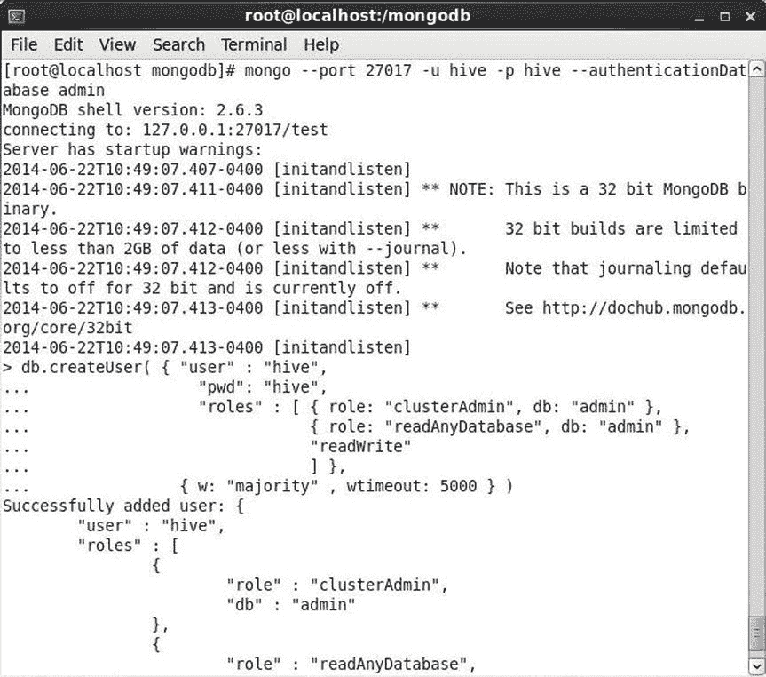
    **图 11-14**. 添加新用户

6.  由于我们将使用远程元存储，我们需要使用以下命令启动 Hive 服务器。
    ```shell
    hive –service hiveserver
    ```
    Hive Thrift Server 启动，如图 11-15 所示。
    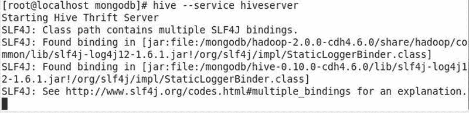
    **图 11-15**. 启动 Hive Thrift Server

7.  使用以下命令启动 Hive shell。
    ```shell
    hive
    ```

8.  在 Hive shell 中，使用`ADD JAR`命令将 MongoDB 存储处理器添加到 Hive 类路径。
    ```hive
    hive> ADD JAR hive-mongo-0.0.3-jar-with-dependencies.jar;
    ```


