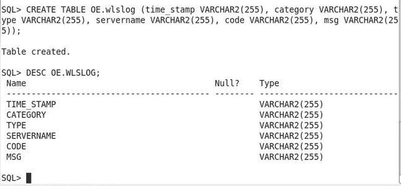
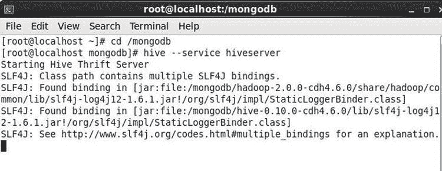

# 设置环境

除了第 11 章中使用的软件外，还需下载并安装以下软件。
*   Oracle Database 11g。本章假定您已安装 Oracle Database 11g（或更高版本）。
*   Oracle Loader for Hadoop 3.0.0。从 `www.oracle.com/technetwork/database/database-technologies/bdc/big-data-connectors/downloads/index.html` 下载，作为“Big Data Collectors”下载的一部分。
*   Oracle Data Integrator 11g。从 `www.oracle.com/technetwork/middleware/data-integrator/downloads/index.html` 下载 Data Integrator 11g（或更高版本）。

本章与第 11 章一样，使用 Oracle Linux。Oracle Database 11g 和 Oracle Data Integrator 11g 的安装过程过于复杂，无法在一章中详述。从 `www.oracle.com/technetwork/database/database-technologies/bdc/big-data-connectors/downloads/index.html` 下载 Oracle Loader for Hadoop Release 3.0.0 的 `oraloader-3.0.0.x86_64.zip`。将文件解压缩到一个目录。解压出两个文件：`oraloader-3.0.0-h1.x86_64.zip` 和 `oraloader-3.0.0-h2.x86_64.zip`。`oraloader-3.0.0-h1.x86_64.zip` 文件适用于 Apache Hadoop 1.x，`oraloader-3.0.0-h2.x86_64.zip` 适用于 CDH4 和 CDH5。由于我们使用 CDH4.6，因此以 root 用户身份在 Linux 上使用以下命令解压 `oraloader-3.0.0-h2.x86_64.zip`。

```bash
root>unzip oraloader-3.0.0-h2.x86_64.zip
```

Oracle Loader for Hadoop 3.0.0 被解压到 `oraloader-3.0.0-h2` 目录。在 bash shell 中设置 Oracle Database、Oracle Data Integrator、Oracle Loader for Hadoop、Hadoop、Hive、Java 和 MongoDB 的环境变量。

```bash
vi ~/.bashrc
export ODI_HOME=/home/dvohra/dbhome_1
export ORACLE_HOME=/home/oracle/app/oracle/product/11.2.0/dbhome_1
export ORACLE_SID=ORCL
export OLH_HOME=/mongodb/oraloader-3.0.0-h2
export HADOOP_PREFIX=/mongodb/hadoop-2.0.0-cdh4.6.0
export HADOOP_CONF=$HADOOP_PREFIX/etc/hadoop
export MONGO_HOME=/mongodb/mongodb-linux-i686-2.6.3
export HIVE_HOME=/mongodb/hive-0.10.0-cdh4.6.0
export HIVE_CONF=$HIVE_HOME/conf
export JAVA_HOME=/mongodb/jdk1.7.0_55
export HADOOP_MAPRED_HOME=/mongodb/hadoop-2.0.0-cdh4.6.0/bin
export HADOOP_HOME=/mongodb/hadoop-2.0.0-cdh4.6.0/share/hadoop/mapreduce2
export HADOOP_CLASSPATH=$HADOOP_HOME/*:$HADOOP_HOME/lib/*:$HIVE_HOME/lib/*:$OLH_HOME/jlib/*:/mongodb/mongo-java-driver-2.6.3.jar:/mongodb/hive-mongo-0.0.3-jar-with-dependencies.jar:$HIVE_CONF:$HADOOP_CONF
export PATH=$PATH:$HADOOP_HOME/bin:$HADOOP_MAPRED_HOME::$HIVE_HOME/bin:$MONGO_HOME/bin:$ORACLE_HOME/bin
```

我们将使用在第 11 章中创建在 MongoDB 上的 Hive 表，将 MongoDB 数据集成到 Oracle Database。使用以下 SQL 脚本在 Oracle Database 中创建目标数据库表。

```sql
CREATE TABLE OE.wlslog (time_stamp VARCHAR2(255), category VARCHAR2(255), type VARCHAR2(255), servername VARCHAR2(255), code VARCHAR2(255), msg VARCHAR2(255));
```

`CREATE TABLE` SQL 语句的输出如图 12-1 所示。Oracle Database 表 `OE.WLSLOG` 的列名与要从中加载数据的 Hive 外部表相同。



图 12-1. 创建 Oracle Database 表

如第 11 章所述，在 Java 应用程序中向 MongoDB 数据存储添加数据。也如第 11 章所述，创建 Hive 外部表 `wlslog`。使用以下命令启动 Hive 远程 metastore。

```bash
hive –service hiveserver
```

Hive 服务器启动，如图 12-2 所示。



图 12-2. 启动 Hive 服务器

由于我们使用 Oracle Data Integrator (ODI)，因此需要安装 ODI，创建存储库，并连接到存储库以定义物理和逻辑架构、模型以及用于将源数据存储映射到目标数据存储的接口。使用以下命令启动 Oracle Data Integrator Studio。

```bash
cd /home/dvohra/dbhome_1/oracledi/client
sh odi.sh
```

### 创建物理架构

物理架构由数据服务器和物理模式组成。


